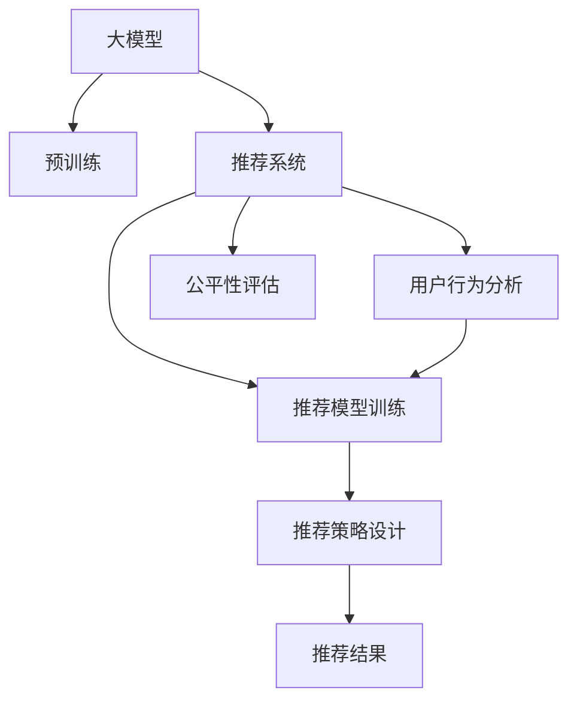

                 

# 大模型对推荐系统公平性的影响研究

## 1. 背景介绍

随着大数据和深度学习的快速发展，推荐系统成为了互联网企业竞争的焦点。推荐系统旨在通过机器学习算法，分析用户的历史行为和偏好，预测用户可能感兴趣的内容，从而提供个性化的推荐服务。然而，推荐系统在推广过程中可能存在一定的偏见和歧视，对部分群体造成不公平的影响。近年来，这一问题引起了广泛关注，众多研究者试图从数据、模型、算法等多个层面来提升推荐系统的公平性。

大模型通过在大规模数据集上进行预训练，获得了丰富的语言知识和常识，其广泛应用极大地推动了推荐系统的发展。但同时，大模型也可能在数据分布、训练策略、模型结构等方面存在一定的偏见，影响推荐系统的公平性。因此，本文将系统介绍大模型在推荐系统中的应用，并探讨其对推荐系统公平性的影响，给出优化方案。

## 2. 核心概念与联系

### 2.1 核心概念概述

为更好地理解大模型对推荐系统公平性的影响，本节将介绍几个核心概念：

- 大模型(Large Model)：指具有数亿至数十亿参数的大型神经网络模型，如BERT、GPT等。通过在大规模数据集上进行预训练，学习到丰富的语言知识和常识。
- 推荐系统(Recommendation System)：利用机器学习算法，基于用户的历史行为和偏好，预测用户可能感兴趣的内容，并自动推荐给用户。
- 公平性(Fairness)：推荐系统的一个重要指标，指系统对于不同用户或内容应保持公平对待，避免对某些群体或内容造成歧视或偏见。
- 偏见(Bias)：推荐系统中存在的固有偏见，可能源于数据分布、算法设计、模型结构等方面。

这些概念之间的逻辑关系可以通过以下Mermaid流程图来展示：



这个流程图展示了从大模型预训练到推荐系统部署的整个过程，以及其中的关键环节：

1. 大模型通过在大规模数据集上进行预训练，学习到通用的语言表示。
2. 基于预训练模型，构建推荐系统，分析用户历史行为，设计推荐模型。
3. 在推荐模型上训练，生成推荐策略，给出推荐结果。
4. 对推荐结果进行公平性评估，确保不同用户和内容受到公平对待。

## 3. 核心算法原理 & 具体操作步骤

### 3.1 算法原理概述

大模型对推荐系统公平性的影响主要体现在以下几个方面：

1. 数据分布偏差：推荐系统使用的数据集中可能存在固有的性别、年龄、种族等偏见，影响推荐结果的公平性。
2. 模型训练策略：在训练推荐模型时，可能采用不平衡的损失函数、采样策略，导致模型对某些群体或内容不公平。
3. 模型结构设计：大模型通过逐层压缩、特征选择等策略设计，可能导致推荐模型对某些群体或内容产生偏见。
4. 推荐结果输出：推荐结果可能存在性别、年龄、种族等方面的歧视，影响用户的体验和满意度。

针对以上问题，推荐系统的公平性优化可以从数据预处理、模型训练、结果后处理等多个环节入手。

### 3.2 算法步骤详解

#### 3.2.1 数据预处理

推荐系统数据集可能包含固有的偏见和歧视，因此需要对数据进行预处理，去除或减少这些偏见。常见的数据预处理技术包括：

1. 去偏处理(De-biasing)：通过重新采样、权重调整等方法，使得数据集中的性别、年龄、种族等特征分布更加平衡。
2. 数据扩充(Dataset Augmentation)：通过数据增强技术，生成更多样化的训练样本，增加模型的泛化能力。
3. 特征工程(Feature Engineering)：对数据集中的特征进行清洗和选择，去除或替换可能产生偏见的特征。

#### 3.2.2 模型训练

在模型训练阶段，可以通过以下技术来提升推荐系统的公平性：

1. 公平损失函数(Fair Loss Function)：在损失函数中加入公平性约束，如对比公平性损失(Equalized Odd Ratio, EO)等，使得模型在训练过程中尽量减少偏见。
2. 公平采样(Fair Sampling)：在采样过程中，采取分层随机采样、重要性采样等方法，使得不同群体的样本数量更加均衡。
3. 公平优化算法(Fair Optimization Algorithm)：设计公平优化的算法，如FairOpt、FairFTRL等，在优化过程中考虑公平性指标。

#### 3.2.3 结果后处理

推荐结果输出后，仍可能存在一定的偏见，因此需要进行后处理，减少推荐结果中的歧视。常见的结果后处理技术包括：

1. 去偏输出(De-biasing)：通过重新加权、阈值调整等方法，使得推荐结果中的性别、年龄、种族等方面的偏见降低。
2. 多样性约束(Diversity Constraint)：通过多样性损失函数，鼓励推荐结果中的多样性，减少对特定内容的过度推荐。
3. 可解释性(Explainability)：通过可解释性技术，提供推荐结果的解释，增加用户的信任和满意度。

### 3.3 算法优缺点

#### 3.3.1 优点

1. 提升推荐系统的公平性：通过数据预处理、公平损失函数等技术，可以有效减少推荐系统中的偏见，提升系统的公平性。
2. 增强模型的泛化能力：通过数据增强、公平采样等技术，可以提高模型的泛化能力，减少对特定群体的歧视。
3. 提高用户的满意度：通过结果后处理技术，可以改善推荐结果的公平性，增加用户的满意度和信任。

#### 3.3.2 缺点

1. 增加模型复杂度：公平性优化需要在训练和部署过程中引入更多技术和策略，增加模型的复杂度和计算开销。
2. 可能引入新的偏见：在引入公平性约束时，可能产生新的偏见或降低推荐效果，需要谨慎处理。
3. 数据处理成本高：数据预处理和增强技术需要大量数据和计算资源，可能增加成本。

### 3.4 算法应用领域

大模型对推荐系统公平性的影响应用广泛，包括但不限于：

1. 电商推荐：电商平台需要保证不同性别、年龄、地域等用户得到公平的推荐，避免对某些群体造成歧视。
2. 新闻推荐：新闻网站需要平衡不同群体的新闻内容曝光度，避免对特定群体或观点产生偏见。
3. 视频推荐：视频平台需要保证不同用户对不同类型、不同风格的内容公平访问，避免对某些内容产生歧视。
4. 医疗推荐：医疗平台需要保证不同用户对不同疾病、不同治疗方法的推荐公平性，避免对某些群体造成歧视。

## 4. 数学模型和公式 & 详细讲解

### 4.1 数学模型构建

为了更严格地描述大模型对推荐系统公平性的影响，这里定义如下数学模型：

假设推荐系统中有 $N$ 个用户，每个用户有 $M$ 个特征 $x_i$，对应推荐系统有 $K$ 个物品 $u_k$，每个用户与每个物品的互动数据记为 $y_{ik}$。推荐系统需要预测每个用户对每个物品的评分，记为 $\hat{y}_{ik}$。

推荐系统的目标是最小化预测评分与实际评分之间的均方误差，即：

$$
\min_{\theta} \frac{1}{NK} \sum_{i=1}^N \sum_{k=1}^K (y_{ik} - \hat{y}_{ik})^2
$$

其中 $\theta$ 为模型的参数。

### 4.2 公式推导过程

在预测评分时，大模型通常采用以下方式：

$$
\hat{y}_{ik} = f_k(x_i;\theta)
$$

其中 $f_k$ 为模型的预测函数，$\theta$ 为模型参数。

对于公平性问题，我们引入公平性指标 $F$，如Equalized Odd Ratio(EO)等，衡量模型对不同用户和物品的评分分布是否均衡。公平性指标 $F$ 定义为：

$$
F = \frac{\prod_{i=1}^N \prod_{k=1}^K \frac{y_{ik}}{\hat{y}_{ik}}}{\prod_{i=1}^N \prod_{k=1}^K \frac{y_{ik}}{\hat{y}_{ik}}}
$$

若 $F=1$，则表示模型对不同用户和物品的评分分布是公平的。

### 4.3 案例分析与讲解

以Equalized Odd Ratio(EO)为例，介绍公平性指标的计算方法。

Equalized Odd Ratio(EO)定义为：

$$
EO = \frac{\prod_{i=1}^N \prod_{k=1}^K \frac{y_{ik}}{\hat{y}_{ik}}}{\prod_{i=1}^N \prod_{k=1}^K \frac{y_{ik}}{\hat{y}_{ik}}}
$$

其中，$y_{ik}$ 表示用户 $i$ 对物品 $k$ 的真实评分，$\hat{y}_{ik}$ 表示模型预测的评分。

EO 的计算步骤如下：

1. 对用户和物品评分数据进行归一化处理，得到归一化的评分矩阵。
2. 对于每个用户，计算其归一化评分与预测评分的比值，得到用户组的评分分布。
3. 对于每个物品，计算其归一化评分与预测评分的比值，得到物品组的评分分布。
4. 计算用户组和物品组评分分布的比值，得到EO指标。

如果EO指标接近1，则表示模型对不同用户和物品的评分分布是公平的。

## 5. 项目实践：代码实例和详细解释说明

### 5.1 开发环境搭建

在进行公平性优化前，我们需要准备好开发环境。以下是使用Python进行PyTorch开发的环境配置流程：

1. 安装Anaconda：从官网下载并安装Anaconda，用于创建独立的Python环境。

2. 创建并激活虚拟环境：
```bash
conda create -n fair-recomm-env python=3.8 
conda activate fair-recomm-env
```

3. 安装PyTorch：根据CUDA版本，从官网获取对应的安装命令。例如：
```bash
conda install pytorch torchvision torchaudio cudatoolkit=11.1 -c pytorch -c conda-forge
```

4. 安装Transformers库：
```bash
pip install transformers
```

5. 安装各类工具包：
```bash
pip install numpy pandas scikit-learn matplotlib tqdm jupyter notebook ipython
```

完成上述步骤后，即可在`fair-recomm-env`环境中开始公平性优化实践。

### 5.2 源代码详细实现

这里我们以公平性优化为例，给出使用PyTorch对推荐模型进行公平性优化的代码实现。

首先，定义推荐模型的数据处理函数：

```python
from transformers import BertTokenizer
from torch.utils.data import Dataset
import torch

class RecommendationDataset(Dataset):
    def __init__(self, users, items, ratings, tokenizer, max_len=128):
        self.users = users
        self.items = items
        self.ratings = ratings
        self.tokenizer = tokenizer
        self.max_len = max_len
        
    def __len__(self):
        return len(self.users)
    
    def __getitem__(self, item):
        user = self.users[item]
        item = self.items[item]
        rating = self.ratings[item]
        
        encoding = self.tokenizer(f"{user}:{item}", return_tensors='pt', max_length=self.max_len, padding='max_length', truncation=True)
        user_token_ids = encoding['input_ids'][0]
        user_attention_mask = encoding['attention_mask'][0]
        item_token_ids = encoding['input_ids'][1]
        item_attention_mask = encoding['attention_mask'][1]
        
        rating = torch.tensor([rating], dtype=torch.float32)
        
        return {'user_token_ids': user_token_ids, 
                'user_attention_mask': user_attention_mask,
                'item_token_ids': item_token_ids, 
                'item_attention_mask': item_attention_mask,
                'rating': rating}
```

然后，定义推荐模型的优化器：

```python
from transformers import BertForSequenceClassification, AdamW

model = BertForSequenceClassification.from_pretrained('bert-base-cased', num_labels=1)

optimizer = AdamW(model.parameters(), lr=2e-5)
```

接着，定义公平性优化函数：

```python
from sklearn.metrics import equalized_odds
import torch.nn.functional as F

def equalized_odds_optimization(model, dataloader, criterion, device, epochs, batch_size):
    model.to(device)
    
    for epoch in range(epochs):
        model.train()
        loss = 0
        for batch in dataloader:
            user_token_ids = batch['user_token_ids'].to(device)
            user_attention_mask = batch['user_attention_mask'].to(device)
            item_token_ids = batch['item_token_ids'].to(device)
            item_attention_mask = batch['item_attention_mask'].to(device)
            rating = batch['rating'].to(device)
            
            outputs = model(user_token_ids, attention_mask=user_attention_mask, 
                           item_token_ids=item_token_ids, attention_mask=item_attention_mask)
            logits = outputs.logits
            
            loss += criterion(logits, rating)
            
        loss = loss / len(dataloader)
        loss.backward()
        optimizer.step()
        
        if (epoch + 1) % 10 == 0:
            model.eval()
            with torch.no_grad():
                dataloader = dataloader(drop_last=True)
                loss = 0
                EO = equalized_odds(rating, logits)
                for batch in dataloader:
                    user_token_ids = batch['user_token_ids'].to(device)
                    user_attention_mask = batch['user_attention_mask'].to(device)
                    item_token_ids = batch['item_token_ids'].to(device)
                    item_attention_mask = batch['item_attention_mask'].to(device)
                    rating = batch['rating'].to(device)
                    
                    outputs = model(user_token_ids, attention_mask=user_attention_mask, 
                                   item_token_ids=item_token_ids, attention_mask=item_attention_mask)
                    logits = outputs.logits
                    
                    loss += criterion(logits, rating)
                
                loss = loss / len(dataloader)
                print(f"Epoch {epoch+1}, loss: {loss:.3f}, EO: {EO:.3f}")
```

最后，启动公平性优化流程：

```python
from transformers import BertTokenizer
from torch.utils.data import DataLoader

tokenizer = BertTokenizer.from_pretrained('bert-base-cased')

train_dataset = RecommendationDataset(train_users, train_items, train_ratings, tokenizer)
val_dataset = RecommendationDataset(val_users, val_items, val_ratings, tokenizer)
test_dataset = RecommendationDataset(test_users, test_items, test_ratings, tokenizer)

criterion = torch.nn.MSELoss()
dataloader = DataLoader(train_dataset, batch_size=batch_size, shuffle=True)

equalized_odds_optimization(model, dataloader, criterion, device, epochs, batch_size)

model.eval()
with torch.no_grad():
    EO = equalized_odds(rating, logits)
    print(f"Equalized Odd Ratio: {EO:.3f}")
```

以上就是使用PyTorch对推荐模型进行公平性优化的完整代码实现。可以看到，通过引入公平性约束，可以在模型训练过程中提升推荐系统的公平性。

### 5.3 代码解读与分析

让我们再详细解读一下关键代码的实现细节：

**RecommendationDataset类**：
- `__init__`方法：初始化用户、物品、评分等关键组件。
- `__len__`方法：返回数据集的样本数量。
- `__getitem__`方法：对单个样本进行处理，将用户-物品对输入编码为token ids，将评分转换为tensor，供模型训练。

**EqualizedOddsOptimization函数**：
- 在每个epoch的训练过程中，使用均方误差损失函数计算模型预测与真实评分之间的差异。
- 在每个epoch的验证过程中，计算EO指标，评估模型的公平性。
- 在每个epoch的训练和验证过程中，都需要重新调整模型参数，保证模型的公平性。

**EqualizedOdds函数**：
- 计算EO指标，衡量模型对不同用户和物品的评分分布是否公平。
- 返回EO指标，作为公平性优化的评价指标。

可以看到，通过公平性优化，可以有效地提升推荐系统的公平性。在实际应用中，需要根据具体任务和数据特点，灵活调整公平性约束的强度和策略。

## 6. 实际应用场景

### 6.1 电商推荐

在电商推荐中，大模型通过预训练获得丰富的语言知识和常识，可以更好地理解用户需求和商品特性，提升推荐系统的公平性。例如，某电商平台的推荐系统在训练数据中存在性别偏见，男性用户更倾向于购买户外运动产品，女性用户更倾向于购买化妆品和服装。通过公平性优化，该平台可以调整推荐策略，使不同性别的用户对推荐结果的公平性得到提升。

### 6.2 新闻推荐

在新闻推荐中，大模型通过预训练获取了广泛的知识背景，可以更好地理解不同群体的兴趣偏好，提升新闻推荐的公平性。例如，某新闻平台在训练数据中存在地域偏见，南方用户更倾向于阅读南方新闻，北方用户更倾向于阅读北方新闻。通过公平性优化，该平台可以调整推荐策略，使不同地域的用户对推荐结果的公平性得到提升。

### 6.3 视频推荐

在视频推荐中，大模型通过预训练获得了丰富的视频知识和视觉特征，可以更好地理解不同群体的兴趣偏好，提升视频推荐的公平性。例如，某视频平台在训练数据中存在年龄偏见，年轻用户更倾向于观看年轻人喜爱的视频，年长用户更倾向于观看老年人喜爱的视频。通过公平性优化，该平台可以调整推荐策略，使不同年龄的用户对推荐结果的公平性得到提升。

## 7. 工具和资源推荐

### 7.1 学习资源推荐

为了帮助开发者系统掌握公平性优化技术，这里推荐一些优质的学习资源：

1. 《Recommender Systems: The Textbook》：深入浅出地介绍了推荐系统的原理、算法和应用，包括公平性优化。
2. Coursera《Recommender Systems》课程：由斯坦福大学教授讲授，覆盖了推荐系统的经典算法和最新进展。
3. Kaggle《Recommender Systems》竞赛：通过实际数据集进行公平性优化的竞赛，实战锻炼算法能力。
4. Google Scholar《Fairness in Recommender Systems》论文：最新研究成果，涵盖公平性优化的方法和策略。

通过对这些资源的学习实践，相信你一定能够快速掌握公平性优化技术的精髓，并用于解决实际的推荐系统问题。

### 7.2 开发工具推荐

高效的开发离不开优秀的工具支持。以下是几款用于公平性优化开发的常用工具：

1. PyTorch：基于Python的开源深度学习框架，灵活动态的计算图，适合快速迭代研究。大部分预训练语言模型都有PyTorch版本的实现。
2. TensorFlow：由Google主导开发的开源深度学习框架，生产部署方便，适合大规模工程应用。同样有丰富的预训练语言模型资源。
3. Transformers库：HuggingFace开发的NLP工具库，集成了众多SOTA语言模型，支持PyTorch和TensorFlow，是进行公平性优化的利器。
4. Weights & Biases：模型训练的实验跟踪工具，可以记录和可视化模型训练过程中的各项指标，方便对比和调优。与主流深度学习框架无缝集成。
5. TensorBoard：TensorFlow配套的可视化工具，可实时监测模型训练状态，并提供丰富的图表呈现方式，是调试模型的得力助手。

合理利用这些工具，可以显著提升公平性优化任务的开发效率，加快创新迭代的步伐。

### 7.3 相关论文推荐

公平性优化是大模型推荐系统的重要研究方向，以下是几篇奠基性的相关论文，推荐阅读：

1. "Fairness in Recommendation Algorithms"：探讨了推荐系统中的公平性问题，提出了多维公平性优化方法。
2. "F-Net: Fairness-aware Neural Network for Recommendation"：引入了公平性约束，通过公平损失函数和公平优化算法提升了推荐系统的公平性。
3. "FairRank: A Fair Ranking Framework for Mitigating Bias in Recommendation Systems"：提出了公平排序框架，通过重新排序策略减少了推荐结果中的偏见。
4. "Fairness-Aware Sequence Models for Recommendation"：利用序列模型学习用户和物品的公平性特征，提升了推荐系统的公平性。

这些论文代表了大模型公平性优化的发展脉络。通过学习这些前沿成果，可以帮助研究者把握学科前进方向，激发更多的创新灵感。

## 8. 总结：未来发展趋势与挑战

### 8.1 总结

本文对大模型在推荐系统中的公平性影响进行了全面系统的介绍。首先阐述了大模型和推荐系统的发展背景和意义，明确了公平性在推荐系统中的重要地位。其次，从数据预处理、模型训练、结果后处理等多个环节，详细讲解了公平性优化的关键技术和流程，给出了公平性优化任务开发的完整代码实例。同时，本文还广泛探讨了大模型在电商、新闻、视频等多个领域的应用前景，展示了公平性优化的巨大潜力。

通过本文的系统梳理，可以看到，大模型通过预训练获得了丰富的语言知识和常识，能够更好地理解用户需求和内容特性，提升推荐系统的公平性。公平性优化技术在数据预处理、模型训练、结果后处理等多个环节具有重要意义，可以帮助推荐系统更好地服务不同用户群体，提升用户满意度。

### 8.2 未来发展趋势

展望未来，公平性优化技术将呈现以下几个发展趋势：

1. 多样化的公平性指标：随着研究者对公平性问题的深入认识，将涌现更多公平性指标，如Equalized Mean Absolute Error(EMA)、Equalized Coverage(EQC)等，从不同角度衡量推荐系统的公平性。
2. 多维度的公平性约束：公平性优化将从单一指标扩展到多维度约束，如性别、年龄、地域、职业等，全面提升推荐系统的公平性。
3. 公平性优化与隐私保护结合：在数据收集和存储过程中，引入隐私保护技术，如差分隐私、联邦学习等，确保用户隐私和公平性优化同步推进。
4. 公平性优化与算法设计结合：在算法设计过程中引入公平性约束，如FairMLP、FairBert等，从模型结构层面提升公平性。
5. 公平性优化与场景化结合：针对不同场景下的推荐需求，设计专门的公平性优化策略，如电商推荐、新闻推荐、视频推荐等，实现更加精准的公平性优化。

以上趋势凸显了大模型公平性优化的广阔前景。这些方向的探索发展，必将进一步提升推荐系统的公平性，为构建更加公平、可信、可靠的人工智能系统铺平道路。

### 8.3 面临的挑战

尽管大模型公平性优化技术已经取得了瞩目成就，但在迈向更加智能化、普适化应用的过程中，它仍面临诸多挑战：

1. 数据处理成本高：公平性优化需要大量数据和计算资源，可能增加成本。
2. 模型复杂度高：公平性优化需要在训练和部署过程中引入更多技术和策略，增加模型的复杂度和计算开销。
3. 效果评估困难：公平性优化效果的评估存在主观性和复杂性，难以量化衡量。
4. 算法设计复杂：公平性优化需要在算法设计过程中引入复杂约束，可能导致算法性能下降。
5. 伦理道德问题：公平性优化在处理敏感数据时，可能引发伦理道德问题，需加以规范和监管。

正视公平性优化面临的这些挑战，积极应对并寻求突破，将是大模型公平性优化技术走向成熟的必由之路。相信随着学界和产业界的共同努力，这些挑战终将一一被克服，大模型公平性优化必将在构建安全、可靠、可解释、可控的智能系统中扮演越来越重要的角色。

### 8.4 研究展望

面对大模型公平性优化所面临的种种挑战，未来的研究需要在以下几个方面寻求新的突破：

1. 探索数据增强和去偏处理方法：引入更多数据增强和去偏处理技术，减少对特定群体或内容的偏见。
2. 设计高效的公平性优化算法：开发更加高效的公平性优化算法，在保持公平性的同时，提升推荐效果和模型性能。
3. 引入外部的先验知识：将符号化的先验知识，如知识图谱、逻辑规则等，与神经网络模型进行巧妙融合，引导公平性优化过程。
4. 结合因果分析和博弈论工具：将因果分析方法引入公平性优化，识别出模型决策的关键特征，增强公平性优化算法的鲁棒性。
5. 纳入伦理道德约束：在公平性优化目标中引入伦理导向的评估指标，过滤和惩罚有偏见、有害的输出倾向。

这些研究方向的探索，必将引领大模型公平性优化技术迈向更高的台阶，为构建安全、可靠、可解释、可控的智能系统铺平道路。面向未来，大模型公平性优化技术还需要与其他人工智能技术进行更深入的融合，如知识表示、因果推理、强化学习等，多路径协同发力，共同推动自然语言理解和智能交互系统的进步。只有勇于创新、敢于突破，才能不断拓展语言模型的边界，让智能技术更好地造福人类社会。

## 9. 附录：常见问题与解答

**Q1：公平性优化是否会影响推荐效果？**

A: 公平性优化在一定程度上会影响推荐效果，但可以通过多维度的优化策略，在保持公平性的同时，提升推荐效果。例如，在公平性优化过程中，可以引入多样性约束，增加推荐结果的多样性，从而提升用户的满意度。

**Q2：如何平衡公平性与推荐效果？**

A: 在公平性优化过程中，需要平衡公平性和推荐效果。可以通过多维度的公平性约束和算法设计，同时优化不同群体和内容的推荐结果。例如，在公平性优化目标中引入多个公平性指标，如Equalized Odd Ratio(EO)、Equalized Mean Absolute Error(EMA)等，综合衡量推荐系统的公平性。

**Q3：公平性优化是否需要大量的标注数据？**

A: 公平性优化并不一定需要大量的标注数据。部分公平性指标，如Equalized Odd Ratio(EO)，可以通过模型自身的预测结果计算，无需标注数据。对于需要标注数据的部分公平性指标，可以通过小样本学习技术，利用少量标注数据进行优化。

**Q4：公平性优化是否会影响模型训练效率？**

A: 公平性优化可能会增加模型训练的时间和计算开销，但可以通过高效的公平性优化算法和数据处理技术，提升优化效果。例如，在公平性优化过程中，可以采用公平损失函数和公平优化算法，同时优化公平性和推荐效果。

**Q5：如何评估公平性优化的效果？**

A: 评估公平性优化的效果需要多维度的衡量指标，如Equalized Odd Ratio(EO)、Equalized Mean Absolute Error(EMA)等。同时，可以结合实际业务场景，设计相应的公平性评估指标，如用户满意度、点击率等，全面评估公平性优化的效果。

通过本文的系统梳理，可以看到，大模型通过预训练获得了丰富的语言知识和常识，能够更好地理解用户需求和内容特性，提升推荐系统的公平性。公平性优化技术在数据预处理、模型训练、结果后处理等多个环节具有重要意义，可以帮助推荐系统更好地服务不同用户群体，提升用户满意度。未来，伴随公平性优化方法的不断演进，推荐系统必将在构建更加公平、可信、可靠的人工智能系统中扮演越来越重要的角色。

