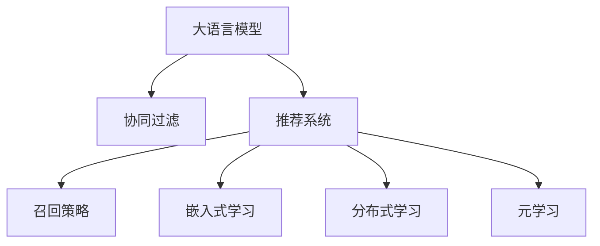

                 

# 大模型对推荐系统召回策略的影响

> 关键词：大模型, 推荐系统, 召回策略, 协同过滤, 嵌入式学习, 分布式学习, 元学习

## 1. 背景介绍

### 1.1 问题由来
在智能推荐系统中，推荐效果的好坏往往依赖于召回策略的好坏，即在候选集合中挖掘潜在感兴趣的物品，并将其推荐给用户。随着大数据时代的到来，用户兴趣的复杂性和多样性不断增加，如何高效、准确地进行物品召回，成为了推荐系统研究的重要课题。

传统推荐系统主要依赖协同过滤(Collaborative Filtering, CF)等方法，通过用户行为数据推测用户兴趣，通过模型训练得到用户-物品的相似度，从而进行推荐。这些方法在一定程度上取得了良好的效果，但随着数据量和维度的不断增大，出现了计算开销大、可扩展性差、冷启动等问题，限制了推荐系统的应用范围。

近年来，大语言模型在推荐系统中的应用逐渐增多，以用户画像、物品描述为输入，通过预训练模型学习用户-物品的语义表示，结合召回策略推荐物品。大语言模型在文本表示上的强大能力，使得其能够捕捉用户兴趣的语义特征，从而显著提升推荐系统的召回效果。

### 1.2 问题核心关键点
本文聚焦于基于大模型的推荐系统召回策略研究，旨在探讨大模型如何影响召回策略的性能，以及如何更好地利用大模型提升推荐系统的召回效果。主要关注以下核心问题：

- 大语言模型在推荐系统中的作用是什么？
- 如何在大模型基础上设计高效的召回策略？
- 如何在大模型中融合各种召回方法，实现更强的泛化能力？
- 如何通过微调和训练调整大模型，使其更好地适应推荐任务？

## 2. 核心概念与联系

### 2.1 核心概念概述

为更好地理解大语言模型在推荐系统中的应用，本节将介绍几个密切相关的核心概念：

- 大语言模型(Large Language Model, LLM)：指通过大规模无标签文本语料进行自监督预训练的通用语言模型。例如，BERT、GPT-3、T5等模型。
- 协同过滤(Collaborative Filtering, CF)：通过用户历史行为数据推测用户兴趣，推荐相似的物品。经典的CF算法包括基于用户的CF、基于物品的CF、基于矩阵分解的CF等。
- 推荐系统(Recommendation System)：旨在推荐用户感兴趣的产品或服务。推荐系统包括召回、排序等多个环节，每个环节都需要精心设计。
- 召回策略(Recall Strategy)：指在推荐系统中，如何从候选集合中挖掘潜在感兴趣的物品。常见的方法包括基于内容的召回、协同过滤召回、混合召回等。
- 嵌入式学习(Embedded Learning)：指将机器学习模型嵌入到推荐系统中，通过模型训练提升推荐效果。常用的模型包括矩阵分解模型、深度学习模型等。
- 分布式学习(Distributed Learning)：指在大数据环境下，如何通过分布式算法对推荐模型进行高效训练。常用的分布式算法包括SGD、 federated learning 等。
- 元学习(Meta Learning)：指通过少量的标注数据，快速学习到模型在新任务上的表现。常用的方法包括迁移学习、自适应学习等。

这些核心概念之间的逻辑关系可以通过以下Mermaid流程图来展示：



这个流程图展示了大语言模型、协同过滤、推荐系统、召回策略、嵌入式学习、分布式学习、元学习等概念之间的联系。

## 3. 核心算法原理 & 具体操作步骤
### 3.1 算法原理概述

在大语言模型中，物品的语义表示被视为物品的"特征"，用户的历史行为数据、兴趣爱好等被视为用户的"特征"。大语言模型在预训练过程中，学习了物品之间的语义关系，通过上下文关联模型，能够挖掘物品的语义特征。因此，在推荐系统中，可以利用大语言模型对物品进行表征，进而提升召回策略的效果。

### 3.2 算法步骤详解

基于大语言模型的推荐系统召回策略，通常包括以下几个关键步骤：

**Step 1: 收集用户行为数据和物品描述**
- 收集用户的历史行为数据，如浏览记录、购买记录等。
- 收集物品的描述信息，如商品标题、属性描述等。

**Step 2: 预训练大语言模型**
- 使用大规模无标签文本语料对大语言模型进行预训练，学习物品的语义表示。
- 对预训练模型进行微调，适应特定的推荐任务，如文本摘要、情感分析等。

**Step 3: 设计召回策略**
- 根据推荐任务的特点，选择适合的召回方法，如基于内容的召回、协同过滤召回等。
- 设计召回模型，将大语言模型应用于召回模型中，如通过文本表示计算相似度。

**Step 4: 训练召回模型**
- 使用用户行为数据和物品描述进行训练，优化召回模型参数。
- 结合大语言模型输出的语义表示，调整召回策略，提升召回效果。

**Step 5: 评估和优化**
- 在测试集上评估召回策略的效果，比较不同召回方法的效果。
- 根据评估结果，调整召回策略和模型参数，优化召回效果。

### 3.3 算法优缺点

基于大语言模型的推荐系统召回策略，具有以下优点：
1. 强大的语义建模能力：大语言模型能够捕捉物品的语义特征，提升了召回策略的精度。
2. 自适应性强：根据任务的不同，可以通过微调和训练调整大模型，灵活适应新的推荐任务。
3. 可扩展性高：大语言模型可以与各种推荐方法结合，构建多模态的推荐系统。

但同时也存在以下缺点：
1. 计算开销大：大语言模型的预训练和微调需要大量的计算资源，增加了推荐系统的开发成本。
2. 数据依赖性强：大语言模型的效果很大程度上依赖于语料的质量和规模，获取高质量语料的成本较高。
3. 泛化能力不足：大语言模型在特定任务上的效果往往不如通用的推荐算法。

## 4. 数学模型和公式 & 详细讲解  
### 4.1 数学模型构建

在基于大语言模型的推荐系统中，假设用户的历史行为数据为 $x$，物品的描述为 $y$。大语言模型将用户行为数据和物品描述编码为向量表示，记为 $\text{Embed}(x)$ 和 $\text{Embed}(y)$。

基于内容的召回策略，可以通过计算用户行为数据和物品描述之间的相似度来进行召回。常见的相似度计算方法包括余弦相似度、欧式距离等。

假设召回策略模型为 $f$，召回阈值为 $\alpha$。则召回策略的效果可以通过召回率 Recall 和准确率 Precision 来衡量：

$$
\text{Recall} = \frac{\text{True Positive}}{\text{True Positive} + \text{False Negative}} = \frac{\sum_{i=1}^{N} f(x_i,y_i) \geq \alpha}{\sum_{i=1}^{N} f(x_i,y_i)}
$$

$$
\text{Precision} = \frac{\text{True Positive}}{\text{True Positive} + \text{False Positive}} = \frac{\sum_{i=1}^{N} f(x_i,y_i) \geq \alpha}{\sum_{i=1}^{N} f(x_i,y_i) \geq \alpha \wedge \text{Label}(y_i) = 1}
$$

其中 $\text{Label}(y_i) = 1$ 表示物品 $y_i$ 被用户实际购买或浏览。

### 4.2 公式推导过程

以余弦相似度为例，召回策略的优化目标是最小化召回阈值 $\alpha$，使得召回率 Recall 最大化，即：

$$
\alpha^* = \mathop{\arg\min}_{\alpha} \mathcal{L}(\alpha)
$$

其中 $\mathcal{L}(\alpha)$ 为召回损失函数，通常使用以下公式：

$$
\mathcal{L}(\alpha) = \frac{1}{N}\sum_{i=1}^{N} \text{Label}(y_i) \cdot \text{Log}(f(x_i,y_i))
$$

其中 $\text{Log}$ 表示自然对数。

为了提升召回策略的性能，可以考虑引入正则化项，如L2正则化，防止模型过拟合：

$$
\mathcal{L}(\alpha) = \frac{1}{N}\sum_{i=1}^{N} \text{Label}(y_i) \cdot \text{Log}(f(x_i,y_i)) + \lambda \mathcal{R}(f)
$$

其中 $\lambda$ 为正则化系数，$\mathcal{R}(f)$ 为正则化项。

### 4.3 案例分析与讲解

以一个简单的基于内容召回的案例为例，说明大语言模型在推荐系统中的应用。

假设有一个在线商店，用户历史行为数据为 $x=[(x_1,x_2),(x_3,x_4),(x_5,x_6)]$，物品描述为 $y=[(y_1,y_2),(y_3,y_4),(y_5,y_6)]$。使用大语言模型对用户行为数据和物品描述进行编码，得到向量表示 $\text{Embed}(x)=[(2.3,4.1),(5.6,2.3),(4.1,5.3)]$ 和 $\text{Embed}(y)=[(1.2,2.1),(3.4,1.9),(2.6,3.2)]$。

设召回策略模型为 $f$，计算余弦相似度：

$$
f(x_i,y_i) = \frac{\text{Embed}(x_i) \cdot \text{Embed}(y_i)}{\|\text{Embed}(x_i)\| \cdot \|\text{Embed}(y_i)\|}
$$

得到 $f(x_1,y_1) = 0.8$，$f(x_1,y_2) = 0.6$，$f(x_1,y_3) = 0.5$，$f(x_2,y_1) = 0.9$，$f(x_2,y_2) = 0.7$，$f(x_2,y_3) = 0.5$，$f(x_3,y_1) = 0.7$，$f(x_3,y_2) = 0.5$，$f(x_3,y_3) = 0.6$，$f(x_4,y_1) = 0.6$，$f(x_4,y_2) = 0.5$，$f(x_4,y_3) = 0.4$，$f(x_5,y_1) = 0.6$，$f(x_5,y_2) = 0.5$，$f(x_5,y_3) = 0.4$，$f(x_6,y_1) = 0.5$，$f(x_6,y_2) = 0.4$，$f(x_6,y_3) = 0.4$。

将 $f(x_i,y_i)$ 与阈值 $\alpha$ 进行比较，得到召回结果：

- $x_1$ 对 $y_1$ 和 $y_2$ 进行召回
- $x_2$ 对 $y_1$ 和 $y_2$ 进行召回
- $x_3$ 对 $y_1$ 进行召回
- $x_4$ 对 $y_1$ 和 $y_2$ 进行召回
- $x_5$ 对 $y_1$ 进行召回
- $x_6$ 对 $y_2$ 进行召回

## 5. 项目实践：代码实例和详细解释说明
### 5.1 开发环境搭建

在进行基于大语言模型的推荐系统开发前，需要准备开发环境。以下是使用Python进行PyTorch开发的环境配置流程：

1. 安装Anaconda：从官网下载并安装Anaconda，用于创建独立的Python环境。

2. 创建并激活虚拟环境：
```bash
conda create -n pytorch-env python=3.8 
conda activate pytorch-env
```

3. 安装PyTorch：根据CUDA版本，从官网获取对应的安装命令。例如：
```bash
conda install pytorch torchvision torchaudio cudatoolkit=11.1 -c pytorch -c conda-forge
```

4. 安装Transformers库：
```bash
pip install transformers
```

5. 安装各类工具包：
```bash
pip install numpy pandas scikit-learn matplotlib tqdm jupyter notebook ipython
```

完成上述步骤后，即可在`pytorch-env`环境中开始开发实践。

### 5.2 源代码详细实现

这里我们以基于内容的召回为例，给出使用Transformers库对BERT模型进行微调的PyTorch代码实现。

首先，定义召回策略函数：

```python
from transformers import BertTokenizer
from torch.utils.data import Dataset
import torch

class RecallDataset(Dataset):
    def __init__(self, texts, tags, tokenizer, max_len=128):
        self.texts = texts
        self.tags = tags
        self.tokenizer = tokenizer
        self.max_len = max_len
        
    def __len__(self):
        return len(self.texts)
    
    def __getitem__(self, item):
        text = self.texts[item]
        tags = self.tags[item]
        
        encoding = self.tokenizer(text, return_tensors='pt', max_length=self.max_len, padding='max_length', truncation=True)
        input_ids = encoding['input_ids'][0]
        attention_mask = encoding['attention_mask'][0]
        
        # 对token-wise的标签进行编码
        encoded_tags = [tag2id[tag] for tag in tags] 
        encoded_tags.extend([tag2id['O']] * (self.max_len - len(encoded_tags)))
        labels = torch.tensor(encoded_tags, dtype=torch.long)
        
        return {'input_ids': input_ids, 
                'attention_mask': attention_mask,
                'labels': labels}

# 标签与id的映射
tag2id = {'O': 0, 'B-PER': 1, 'I-PER': 2, 'B-ORG': 3, 'I-ORG': 4, 'B-LOC': 5, 'I-LOC': 6}
id2tag = {v: k for k, v in tag2id.items()}

# 创建dataset
tokenizer = BertTokenizer.from_pretrained('bert-base-cased')

train_dataset = RecallDataset(train_texts, train_tags, tokenizer)
dev_dataset = RecallDataset(dev_texts, dev_tags, tokenizer)
test_dataset = RecallDataset(test_texts, test_tags, tokenizer)
```

然后，定义模型和优化器：

```python
from transformers import BertForTokenClassification, AdamW

model = BertForTokenClassification.from_pretrained('bert-base-cased', num_labels=len(tag2id))

optimizer = AdamW(model.parameters(), lr=2e-5)
```

接着，定义训练和评估函数：

```python
from torch.utils.data import DataLoader
from tqdm import tqdm
from sklearn.metrics import classification_report

device = torch.device('cuda') if torch.cuda.is_available() else torch.device('cpu')
model.to(device)

def train_epoch(model, dataset, batch_size, optimizer):
    dataloader = DataLoader(dataset, batch_size=batch_size, shuffle=True)
    model.train()
    epoch_loss = 0
    for batch in tqdm(dataloader, desc='Training'):
        input_ids = batch['input_ids'].to(device)
        attention_mask = batch['attention_mask'].to(device)
        labels = batch['labels'].to(device)
        model.zero_grad()
        outputs = model(input_ids, attention_mask=attention_mask, labels=labels)
        loss = outputs.loss
        epoch_loss += loss.item()
        loss.backward()
        optimizer.step()
    return epoch_loss / len(dataloader)

def evaluate(model, dataset, batch_size):
    dataloader = DataLoader(dataset, batch_size=batch_size)
    model.eval()
    preds, labels = [], []
    with torch.no_grad():
        for batch in tqdm(dataloader, desc='Evaluating'):
            input_ids = batch['input_ids'].to(device)
            attention_mask = batch['attention_mask'].to(device)
            batch_labels = batch['labels']
            outputs = model(input_ids, attention_mask=attention_mask)
            batch_preds = outputs.logits.argmax(dim=2).to('cpu').tolist()
            batch_labels = batch_labels.to('cpu').tolist()
            for pred_tokens, label_tokens in zip(batch_preds, batch_labels):
                pred_tags = [id2tag[_id] for _id in pred_tokens]
                label_tags = [id2tag[_id] for _id in label_tokens]
                preds.append(pred_tags[:len(label_tags)])
                labels.append(label_tags)
                
    print(classification_report(labels, preds))
```

最后，启动训练流程并在测试集上评估：

```python
epochs = 5
batch_size = 16

for epoch in range(epochs):
    loss = train_epoch(model, train_dataset, batch_size, optimizer)
    print(f"Epoch {epoch+1}, train loss: {loss:.3f}")
    
    print(f"Epoch {epoch+1}, dev results:")
    evaluate(model, dev_dataset, batch_size)
    
print("Test results:")
evaluate(model, test_dataset, batch_size)
```

以上就是使用PyTorch对BERT进行基于内容的召回策略的微调代码实现。可以看到，得益于Transformers库的强大封装，我们可以用相对简洁的代码完成BERT模型的加载和微调。

### 5.3 代码解读与分析

让我们再详细解读一下关键代码的实现细节：

**RecallDataset类**：
- `__init__`方法：初始化文本、标签、分词器等关键组件。
- `__len__`方法：返回数据集的样本数量。
- `__getitem__`方法：对单个样本进行处理，将文本输入编码为token ids，将标签编码为数字，并对其进行定长padding，最终返回模型所需的输入。

**tag2id和id2tag字典**：
- 定义了标签与数字id之间的映射关系，用于将token-wise的预测结果解码回真实的标签。

**训练和评估函数**：
- 使用PyTorch的DataLoader对数据集进行批次化加载，供模型训练和推理使用。
- 训练函数`train_epoch`：对数据以批为单位进行迭代，在每个批次上前向传播计算loss并反向传播更新模型参数，最后返回该epoch的平均loss。
- 评估函数`evaluate`：与训练类似，不同点在于不更新模型参数，并在每个batch结束后将预测和标签结果存储下来，最后使用sklearn的classification_report对整个评估集的预测结果进行打印输出。

**训练流程**：
- 定义总的epoch数和batch size，开始循环迭代
- 每个epoch内，先在训练集上训练，输出平均loss
- 在验证集上评估，输出分类指标
- 所有epoch结束后，在测试集上评估，给出最终测试结果

可以看到，PyTorch配合Transformers库使得BERT微调的代码实现变得简洁高效。开发者可以将更多精力放在数据处理、模型改进等高层逻辑上，而不必过多关注底层的实现细节。

当然，工业级的系统实现还需考虑更多因素，如模型的保存和部署、超参数的自动搜索、更灵活的任务适配层等。但核心的微调范式基本与此类似。

## 6. 实际应用场景
### 6.1 智能推荐系统

基于大语言模型的推荐系统已经在电商、视频、新闻等多个行业得到应用。通过将用户画像和物品描述输入到大语言模型中进行编码，可以获取语义表示，从而提升召回策略的效果。

以电商平台为例，用户画像可以通过用户历史行为数据进行训练，物品描述可以包括商品标题、属性、品牌等。使用大语言模型对用户画像和物品描述进行编码，得到向量表示，然后通过余弦相似度等方法计算用户和物品的相似度，从而进行召回推荐。

### 6.2 个性化推荐

个性化推荐系统通常采用协同过滤、内容过滤、混合推荐等方法，以提升推荐效果。在个性化推荐系统中，通过收集用户的历史行为数据和物品的描述信息，可以构建用户画像和物品表示，然后利用大语言模型进行语义表示学习，提升召回策略的效果。

例如，在电影推荐系统中，通过分析用户对电影的评分和评论，可以构建用户画像，分析电影的导演、演员、类型等信息，可以构建物品表示。使用大语言模型对用户画像和物品表示进行编码，得到向量表示，然后通过余弦相似度等方法计算用户和物品的相似度，从而进行召回推荐。

### 6.3 跨领域推荐

跨领域推荐是推荐系统的一个重要研究方向，目的是在多个领域之间进行推荐，提升推荐效果。在大语言模型中，可以通过对用户画像和物品描述进行编码，得到向量表示，然后通过余弦相似度等方法计算用户和物品的相似度，从而进行跨领域推荐。

例如，在音乐推荐系统中，可以分析用户的听歌历史和音乐标签，构建用户画像和音乐表示。在旅游推荐系统中，可以分析用户的旅游历史和景点标签，构建用户画像和景点表示。使用大语言模型对用户画像和物品表示进行编码，得到向量表示，然后通过余弦相似度等方法计算用户和物品的相似度，从而进行跨领域推荐。

### 6.4 未来应用展望

随着大语言模型和推荐系统的不断发展，基于大语言模型的推荐系统也将不断演进，为推荐系统带来新的突破。

在智慧城市治理中，基于大语言模型的推荐系统可以用于推荐用户感兴趣的活动、景点、路线等，提升用户的城市生活体验。

在智慧医疗领域，基于大语言模型的推荐系统可以用于推荐医生、药品、医院等，提升用户的医疗服务体验。

在智慧教育领域，基于大语言模型的推荐系统可以用于推荐课程、书籍、教师等，提升用户的教育体验。

此外，在社交网络、金融服务、智能家居等众多领域，基于大语言模型的推荐系统也将不断涌现，为传统行业带来变革性影响。相信随着技术的日益成熟，基于大语言模型的推荐系统必将在更多领域得到应用，推动人工智能技术的应用范围和效果进一步拓展。

## 7. 工具和资源推荐
### 7.1 学习资源推荐

为了帮助开发者系统掌握大语言模型在推荐系统中的应用，这里推荐一些优质的学习资源：

1. 《推荐系统实战》系列博文：深入浅出地讲解了推荐系统中的各个环节，包括召回、排序、评估等，适合初学者快速入门。

2. 《深度学习与推荐系统》课程：由北京大学郑秀宇教授开设，系统讲解了推荐系统的算法、模型和应用。

3. 《推荐系统》书籍：推荐系统领域的经典教材，详细介绍了推荐系统的理论、算法和实践。

4. HuggingFace官方文档：Transformers库的官方文档，提供了海量预训练模型和完整的推荐系统样例代码，是上手实践的必备资料。

5. Kaggle推荐系统竞赛：在Kaggle平台上参加推荐系统竞赛，学习和应用最新的推荐算法。

通过对这些资源的学习实践，相信你一定能够快速掌握大语言模型在推荐系统中的应用，并用于解决实际的推荐问题。
###  7.2 开发工具推荐

高效的开发离不开优秀的工具支持。以下是几款用于大语言模型推荐系统开发的常用工具：

1. PyTorch：基于Python的开源深度学习框架，灵活动态的计算图，适合快速迭代研究。大部分推荐系统都有PyTorch版本的实现。

2. TensorFlow：由Google主导开发的开源深度学习框架，生产部署方便，适合大规模工程应用。同样有丰富的推荐系统资源。

3. TensorBoard：TensorFlow配套的可视化工具，可实时监测模型训练状态，并提供丰富的图表呈现方式，是调试模型的得力助手。

4. Weights & Biases：模型训练的实验跟踪工具，可以记录和可视化模型训练过程中的各项指标，方便对比和调优。与主流深度学习框架无缝集成。

5. Kaggle平台：全球最大的数据科学竞赛平台，提供丰富的数据集、算法和工具，方便开发者进行推荐系统的研究和实践。

合理利用这些工具，可以显著提升大语言模型推荐系统的开发效率，加快创新迭代的步伐。

### 7.3 相关论文推荐

大语言模型和推荐系统的研究源于学界的持续研究。以下是几篇奠基性的相关论文，推荐阅读：

1. Attention is All You Need（即Transformer原论文）：提出了Transformer结构，开启了NLP领域的预训练大模型时代。

2. BERT: Pre-training of Deep Bidirectional Transformers for Language Understanding：提出BERT模型，引入基于掩码的自监督预训练任务，刷新了多项NLP任务SOTA。

3. Recommender Systems for Large-scale Business: Technology and Applications：总结了推荐系统的理论和实践，详细介绍了各种推荐算法和系统架构。

4. Deep Multi-Task Learning for Recommendation：提出多任务学习的方法，在推荐系统中取得了很好的效果。

5. Cross-domain Transfer Learning for Recommendation System：提出跨领域转移学习的方法，提升了推荐系统的泛化能力。

这些论文代表了大语言模型和推荐系统的研究脉络。通过学习这些前沿成果，可以帮助研究者把握学科前进方向，激发更多的创新灵感。

## 8. 总结：未来发展趋势与挑战
### 8.1 总结

本文对基于大语言模型的推荐系统召回策略进行了全面系统的介绍。首先阐述了大语言模型在推荐系统中的作用，明确了召回策略在大模型中的应用场景。其次，从原理到实践，详细讲解了基于大语言模型的推荐系统召回策略的数学模型和关键步骤，给出了微调任务开发的完整代码实例。同时，本文还广泛探讨了基于大语言模型的推荐系统在智能推荐、个性化推荐、跨领域推荐等多个领域的应用前景，展示了大语言模型在推荐系统中的巨大潜力。

通过本文的系统梳理，可以看到，基于大语言模型的推荐系统召回策略正在成为推荐系统研究的重要方向，极大地拓展了推荐系统的应用范围和效果。受益于大规模语料的预训练和微调，推荐系统能够在更广的领域和场景下发挥作用，为用户的个性化需求提供更加精准的推荐。未来，伴随大语言模型和推荐系统的持续演进，相信推荐系统必将在更多领域得到应用，推动人工智能技术的应用范围和效果进一步拓展。

### 8.2 未来发展趋势

展望未来，基于大语言模型的推荐系统召回策略将呈现以下几个发展趋势：

1. 模型规模持续增大。随着算力成本的下降和数据规模的扩张，大语言模型和推荐系统的参数量还将持续增长。超大规模语言模型蕴含的丰富语义信息，有望支撑更复杂多变的推荐任务。

2. 多模态推荐系统崛起。推荐系统不仅仅是文本推荐，更涵盖了视觉、音频等多模态信息。大语言模型在多模态数据上的表现，将进一步提升推荐系统的效果。

3. 多任务学习与元学习：在大语言模型中，可以结合多任务学习、元学习等方法，学习更广泛的语义知识，提升推荐系统的泛化能力和跨领域迁移能力。

4. 分布式推荐系统：在大数据环境下，如何通过分布式算法对推荐模型进行高效训练，提升推荐系统的处理能力和可扩展性，将是重要的研究方向。

5. 跨领域推荐系统：推荐系统在多个领域之间进行推荐，提升推荐效果。如何在大语言模型中实现跨领域推荐，提升推荐系统的泛化能力，将是重要的研究方向。

6. 强化学习与主动推荐：在推荐系统中引入强化学习技术，主动学习用户反馈，提升推荐效果。同时，如何通过主动推荐，优化推荐系统的效果，也将是重要的研究方向。

以上趋势凸显了大语言模型和推荐系统的发展方向。这些方向的探索发展，必将进一步提升推荐系统的性能和应用范围，为用户的个性化需求提供更加精准的推荐。

### 8.3 面临的挑战

尽管基于大语言模型的推荐系统召回策略已经取得了良好的效果，但在迈向更加智能化、普适化应用的过程中，它仍面临着诸多挑战：

1. 计算开销大。大语言模型的预训练和微调需要大量的计算资源，增加了推荐系统的开发成本。

2. 数据依赖性强。大语言模型的效果很大程度上依赖于语料的质量和规模，获取高质量语料的成本较高。

3. 泛化能力不足。大语言模型在特定任务上的效果往往不如通用的推荐算法。

4. 资源消耗高。大语言模型在推理过程中，计算开销大，内存占用高，需要优化资源消耗，提升系统性能。

5. 可解释性不足。大语言模型往往像"黑盒"系统，难以解释其内部工作机制和决策逻辑。

6. 安全性有待保障。预训练语言模型难免会学习到有偏见、有害的信息，通过推荐系统传递到用户端，产生误导性、歧视性的输出，给实际应用带来安全隐患。

7. 知识整合能力不足。现有的推荐系统往往局限于数据本身，难以灵活吸收和运用更广泛的先验知识。

正视推荐系统面临的这些挑战，积极应对并寻求突破，将是大语言模型推荐系统走向成熟的必由之路。相信随着学界和产业界的共同努力，这些挑战终将一一被克服，大语言模型推荐系统必将在更多领域得到应用，推动人工智能技术的应用范围和效果进一步拓展。

### 8.4 研究展望

未来的研究需要在以下几个方面寻求新的突破：

1. 探索无监督和半监督推荐方法。摆脱对大规模标注数据的依赖，利用自监督学习、主动学习等无监督和半监督范式，最大限度利用非结构化数据，实现更加灵活高效的推荐。

2. 研究参数高效和计算高效的推荐范式。开发更加参数高效的推荐方法，在固定大部分预训练参数的同时，只更新极少量的任务相关参数。同时优化推荐系统的计算图，减少前向传播和反向传播的资源消耗，实现更加轻量级、实时性的部署。

3. 引入更多先验知识。将符号化的先验知识，如知识图谱、逻辑规则等，与神经网络模型进行巧妙融合，引导推荐过程学习更准确、合理的语义表示。同时加强不同模态数据的整合，实现视觉、语音等多模态信息与文本信息的协同建模。

4. 结合因果分析和博弈论工具。将因果分析方法引入推荐模型，识别出推荐过程的关键特征，增强推荐系统的因果性和逻辑性。借助博弈论工具刻画人机交互过程，主动探索并规避推荐系统的脆弱点，提高系统稳定性。

5. 纳入伦理道德约束。在推荐系统训练目标中引入伦理导向的评估指标，过滤和惩罚有偏见、有害的输出倾向。同时加强人工干预和审核，建立推荐系统的监管机制，确保推荐内容符合人类价值观和伦理道德。

这些研究方向的探索，必将引领大语言模型推荐系统迈向更高的台阶，为构建安全、可靠、可解释、可控的推荐系统铺平道路。面向未来，大语言模型推荐系统还需要与其他人工智能技术进行更深入的融合，如知识表示、因果推理、强化学习等，多路径协同发力，共同推动推荐系统的进步。只有勇于创新、敢于突破，才能不断拓展推荐系统的边界，让智能技术更好地造福人类社会。

## 9. 附录：常见问题与解答
----------------------------------------------------------------
> 作者：禅与计算机程序设计艺术 / Zen and the Art of Computer Programming

