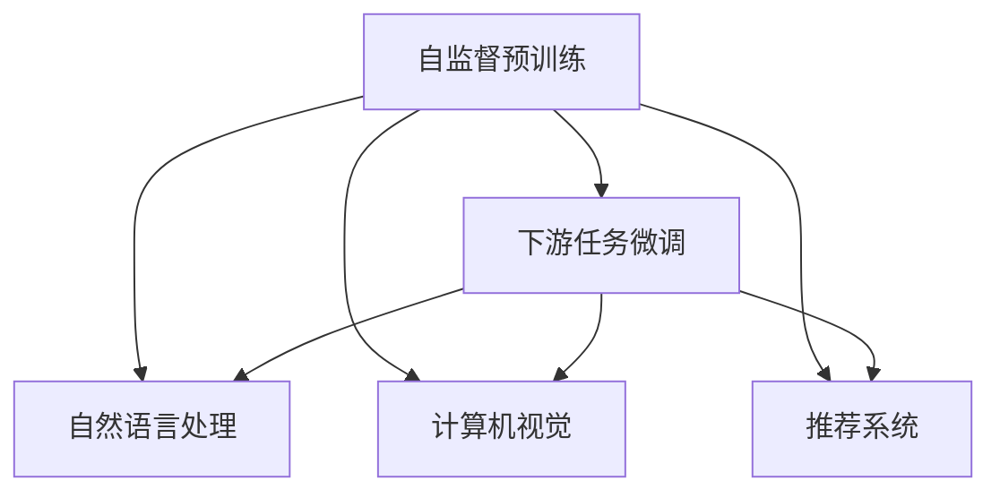

                 

# 大模型技术在电商平台中的实践与挑战

## 1. 背景介绍

随着电商平台的高速发展，客户体验、商品推荐、交易安全等成为关键任务。传统的机器学习算法往往难以兼顾多样化的业务需求和实时性要求。而基于深度学习技术的大模型方法，以其强大的表示能力和高并发的性能优势，成为电商领域的一个重要选择。

### 1.1 问题由来
电商平台的应用场景多种多样，包括推荐系统、客户服务、欺诈检测、广告投放等。这些任务都需要深度学习模型的支持，而传统模型往往难以应对复杂的多模态数据和海量数据需求。

### 1.2 问题核心关键点
大模型技术通过在大规模数据上进行的预训练，学习到丰富的语言、图像、行为等知识表示，可以在特定任务上通过微调或 finetune 得到优异的性能。其核心在于：
- 自监督预训练：使用无标签数据进行预训练，学习通用的知识表示。
- 下游任务微调：在特定任务上对预训练模型进行微调，提升其在特定任务上的性能。

### 1.3 问题研究意义
大模型技术的应用可以显著提升电商平台的用户体验，降低运营成本，提高交易效率。具体来说：
- 个性化推荐系统：提升商品的推荐精度，增强用户粘性。
- 客户服务：构建智能客服，提升服务效率。
- 欺诈检测：利用多模态数据提高检测准确率，保护商家和消费者利益。
- 广告投放：提高广告投放的精准度和效果。

## 2. 核心概念与联系

### 2.1 核心概念概述

为了更好地理解大模型技术在电商平台中的应用，本节将介绍几个关键概念：

- **大模型技术**：指通过自监督预训练的方式，在大规模数据上训练深度神经网络，学习到丰富的多模态知识表示。
- **自监督预训练**：使用无标签数据进行预训练，学习通用的知识表示，包括自然语言处理（NLP）、计算机视觉（CV）、推荐系统（RS）等。
- **下游任务微调**：在特定任务上对预训练模型进行微调，使其适应具体业务需求。
- **多模态数据**：包括文本、图像、行为等多种类型的数据，电商数据往往涉及多种模态信息。

这些概念之间的联系可以通过以下 Mermaid 流程图来展示：



这个流程图展示了大模型技术的学习过程和任务适配：
1. 自监督预训练学习通用的知识表示。
2. 下游任务微调适配特定任务需求。
3. 自然语言处理、计算机视觉、推荐系统等任务，都是基于大模型技术的。

## 3. 核心算法原理 & 具体操作步骤

### 3.1 算法原理概述

大模型技术在电商平台中的应用，本质上是一个自监督预训练和下游任务微调的联合过程。其核心思想是：
1. **自监督预训练**：在无标签的大规模电商数据上训练深度模型，学习到通用的知识表示。
2. **下游任务微调**：在特定任务上对预训练模型进行微调，提升其在特定任务上的性能。

这一过程可以总结如下：
1. **数据准备**：收集电商平台的交易记录、用户行为、商品描述、图片等多模态数据。
2. **自监督预训练**：在大规模无标签数据上进行预训练，学习通用的多模态表示。
3. **下游任务微调**：在特定任务上，使用少量标注数据对预训练模型进行微调，提升其在具体任务上的性能。

### 3.2 算法步骤详解

大模型技术在电商平台中的应用主要包括以下几个步骤：

**Step 1: 准备数据集**
- 收集电商平台上的交易记录、用户行为、商品描述、图片等多模态数据。
- 清洗和预处理数据，确保数据的质量和一致性。
- 划分训练集、验证集和测试集，供模型训练和评估使用。

**Step 2: 自监督预训练**
- 使用大规模无标签数据对模型进行预训练，学习通用的多模态表示。
- 常用的预训练任务包括语言建模、掩码语言模型、图像分类、目标检测等。
- 通过自监督学习，模型可以自动学习到数据中的多模态关系，提升模型的泛化能力。

**Step 3: 下游任务微调**
- 在特定任务上，使用少量标注数据对预训练模型进行微调，提升其在具体任务上的性能。
- 常用的微调任务包括推荐系统、客户服务、欺诈检测、广告投放等。
- 微调过程中，选择合适的任务适配层，设计合适的损失函数，优化模型的超参数，避免过拟合。

**Step 4: 模型评估与部署**
- 在测试集上评估微调后的模型性能，确保模型在实际场景中能稳定运行。
- 部署模型到电商平台的业务系统中，实现业务功能。
- 持续收集新的数据，定期重新微调模型，保持模型性能的持续提升。

### 3.3 算法优缺点

大模型技术在电商平台中的应用，具有以下优点：
1. **强大的表示能力**：预训练模型学习到丰富的多模态知识表示，能够在多种业务场景下取得优异表现。
2. **泛化能力**：预训练模型在大规模数据上学习到的知识，可以在特定任务上快速适配，提升模型性能。
3. **高并发处理**：基于深度学习的模型，可以并行处理大量请求，提升系统的响应速度和处理能力。

但同时，也存在一些局限性：
1. **数据依赖性**：预训练模型的性能很大程度上依赖于数据的质量和多样性，高质量标注数据获取成本较高。
2. **计算资源消耗**：大规模预训练和微调需要大量计算资源，对硬件设施要求较高。
3. **模型复杂度**：大模型参数量巨大，对模型的压缩和加速优化要求较高。
4. **可解释性不足**：深度学习模型通常是"黑盒"模型，难以解释其内部工作机制和决策逻辑。

### 3.4 算法应用领域

大模型技术在电商平台中的应用领域十分广泛，包括但不限于以下几个方面：

- **推荐系统**：利用多模态数据进行商品推荐，提升用户的购物体验。
- **客户服务**：构建智能客服系统，提升服务效率和用户满意度。
- **欺诈检测**：利用多模态数据检测交易欺诈行为，保护商家和消费者利益。
- **广告投放**：提高广告投放的精准度和效果，提升电商平台的营销效果。

## 4. 数学模型和公式 & 详细讲解 & 举例说明

### 4.1 数学模型构建

大模型技术在电商平台中的应用，可以通过以下数学模型来表示：

设电商平台上的交易记录为 $D = \{(x_i, y_i)\}_{i=1}^N$，其中 $x_i$ 为多模态数据，$y_i$ 为交易标签。

设预训练模型为 $M_{\theta}$，其中 $\theta$ 为模型的参数。在大规模无标签数据上进行自监督预训练，学习到通用的多模态表示。

在大规模标注数据上对 $M_{\theta}$ 进行微调，得到针对特定任务 $T$ 的优化模型 $M_{\theta^*}$。

### 4.2 公式推导过程

在大规模无标签数据上进行自监督预训练时，通常使用掩码语言模型（Masked Language Model, MLM）作为预训练任务。假设训练数据为 $D=\{(x_i)\}_{i=1}^N$，模型输出的概率为 $P(x_i|M_{\theta})$。

掩码语言模型的损失函数为：

$$
\mathcal{L}_{\text{MLM}} = -\frac{1}{N}\sum_{i=1}^N \log P(x_i|M_{\theta})
$$

在大规模标注数据上对 $M_{\theta}$ 进行微调时，通常使用交叉熵损失函数。设训练数据为 $D=\{(x_i, y_i)\}_{i=1}^N$，模型输出的概率为 $P(y_i|x_i, M_{\theta})$。

微调的损失函数为：

$$
\mathcal{L}_{\text{task}} = -\frac{1}{N}\sum_{i=1}^N \log P(y_i|x_i, M_{\theta})
$$

通过优化 $\mathcal{L}_{\text{MLM}}$ 和 $\mathcal{L}_{\text{task}}$ 的组合，可以得到针对特定任务 $T$ 的优化模型 $M_{\theta^*}$。

### 4.3 案例分析与讲解

以推荐系统为例，假设推荐系统需要使用用户的历史行为数据 $D=\{(x_i, y_i)\}_{i=1}^N$ 进行微调。具体步骤如下：

1. **数据准备**：收集用户的历史行为数据，包括浏览记录、点击记录、购买记录等。
2. **自监督预训练**：使用大规模无标签数据对推荐模型进行预训练，学习到通用的用户行为表示。
3. **下游任务微调**：在推荐任务上，使用少量标注数据对预训练模型进行微调，提升其在推荐任务上的性能。

假设推荐系统需要预测用户对商品的评分 $y_i$，微调的损失函数为交叉熵损失：

$$
\mathcal{L}_{\text{task}} = -\frac{1}{N}\sum_{i=1}^N \log P(y_i|x_i, M_{\theta})
$$

其中 $x_i$ 为用户的历史行为数据，$y_i$ 为用户对商品的评分。

## 5. 项目实践：代码实例和详细解释说明

### 5.1 开发环境搭建

在进行大模型技术在电商平台中的应用实践时，我们需要准备好开发环境。以下是使用Python进行PyTorch开发的环境配置流程：

1. 安装Anaconda：从官网下载并安装Anaconda，用于创建独立的Python环境。
2. 创建并激活虚拟环境：
```bash
conda create -n pytorch-env python=3.8 
conda activate pytorch-env
```
3. 安装PyTorch：根据CUDA版本，从官网获取对应的安装命令。例如：
```bash
conda install pytorch torchvision torchaudio cudatoolkit=11.1 -c pytorch -c conda-forge
```
4. 安装Transformers库：
```bash
pip install transformers
```
5. 安装各类工具包：
```bash
pip install numpy pandas scikit-learn matplotlib tqdm jupyter notebook ipython
```

完成上述步骤后，即可在`pytorch-env`环境中开始项目实践。

### 5.2 源代码详细实现

这里以推荐系统为例，给出使用Transformers库对BERT模型进行微调的PyTorch代码实现。

首先，定义推荐系统的数据处理函数：

```python
from transformers import BertTokenizer
from torch.utils.data import Dataset
import torch

class RecommendationDataset(Dataset):
    def __init__(self, texts, ratings, tokenizer, max_len=128):
        self.texts = texts
        self.ratings = ratings
        self.tokenizer = tokenizer
        self.max_len = max_len
        
    def __len__(self):
        return len(self.texts)
    
    def __getitem__(self, item):
        text = self.texts[item]
        rating = self.ratings[item]
        
        encoding = self.tokenizer(text, return_tensors='pt', max_length=self.max_len, padding='max_length', truncation=True)
        input_ids = encoding['input_ids'][0]
        attention_mask = encoding['attention_mask'][0]
        
        # 将标签映射为向量
        rating = torch.tensor(rating, dtype=torch.long)
        
        return {'input_ids': input_ids, 
                'attention_mask': attention_mask,
                'labels': rating}

# 标签与id的映射
label2id = {0: 0, 1: 1, 2: 2, 3: 3, 4: 4, 5: 5}
id2label = {v: k for k, v in label2id.items()}

# 创建dataset
tokenizer = BertTokenizer.from_pretrained('bert-base-cased')

train_dataset = RecommendationDataset(train_texts, train_ratings, tokenizer)
dev_dataset = RecommendationDataset(dev_texts, dev_ratings, tokenizer)
test_dataset = RecommendationDataset(test_texts, test_ratings, tokenizer)
```

然后，定义模型和优化器：

```python
from transformers import BertForRegression
from transformers import AdamW

model = BertForRegression.from_pretrained('bert-base-cased')
model.train()

optimizer = AdamW(model.parameters(), lr=2e-5)
```

接着，定义训练和评估函数：

```python
from torch.utils.data import DataLoader
from tqdm import tqdm
from sklearn.metrics import mean_squared_error

device = torch.device('cuda') if torch.cuda.is_available() else torch.device('cpu')
model.to(device)

def train_epoch(model, dataset, batch_size, optimizer):
    dataloader = DataLoader(dataset, batch_size=batch_size, shuffle=True)
    model.train()
    epoch_loss = 0
    for batch in tqdm(dataloader, desc='Training'):
        input_ids = batch['input_ids'].to(device)
        attention_mask = batch['attention_mask'].to(device)
        labels = batch['labels'].to(device)
        model.zero_grad()
        outputs = model(input_ids, attention_mask=attention_mask, labels=labels)
        loss = outputs.loss
        epoch_loss += loss.item()
        loss.backward()
        optimizer.step()
    return epoch_loss / len(dataloader)

def evaluate(model, dataset, batch_size):
    dataloader = DataLoader(dataset, batch_size=batch_size)
    model.eval()
    preds, labels = [], []
    with torch.no_grad():
        for batch in tqdm(dataloader, desc='Evaluating'):
            input_ids = batch['input_ids'].to(device)
            attention_mask = batch['attention_mask'].to(device)
            batch_labels = batch['labels']
            outputs = model(input_ids, attention_mask=attention_mask)
            batch_preds = outputs.logits.argmax(dim=2).to('cpu').tolist()
            batch_labels = batch_labels.to('cpu').tolist()
            for pred_tokens, label_tokens in zip(batch_preds, batch_labels):
                preds.append(pred_tokens[:len(label_tokens)])
                labels.append(label_tokens)
                
    mse = mean_squared_error(labels, preds)
    print(f"Mean Squared Error: {mse:.3f}")
```

最后，启动训练流程并在测试集上评估：

```python
epochs = 5
batch_size = 16

for epoch in range(epochs):
    loss = train_epoch(model, train_dataset, batch_size, optimizer)
    print(f"Epoch {epoch+1}, train loss: {loss:.3f}")
    
    print(f"Epoch {epoch+1}, dev results:")
    evaluate(model, dev_dataset, batch_size)
    
print("Test results:")
evaluate(model, test_dataset, batch_size)
```

以上就是使用PyTorch对BERT进行推荐系统任务微调的完整代码实现。可以看到，得益于Transformers库的强大封装，我们可以用相对简洁的代码完成BERT模型的加载和微调。

### 5.3 代码解读与分析

让我们再详细解读一下关键代码的实现细节：

**RecommendationDataset类**：
- `__init__`方法：初始化文本、标签、分词器等关键组件。
- `__len__`方法：返回数据集的样本数量。
- `__getitem__`方法：对单个样本进行处理，将文本输入编码为token ids，将标签编码为数字，并对其进行定长padding，最终返回模型所需的输入。

**label2id和id2label字典**：
- 定义了标签与数字id之间的映射关系，用于将预测结果解码为实际标签。

**训练和评估函数**：
- 使用PyTorch的DataLoader对数据集进行批次化加载，供模型训练和推理使用。
- 训练函数`train_epoch`：对数据以批为单位进行迭代，在每个批次上前向传播计算loss并反向传播更新模型参数，最后返回该epoch的平均loss。
- 评估函数`evaluate`：与训练类似，不同点在于不更新模型参数，并在每个batch结束后将预测和标签结果存储下来，最后使用sklearn的mean_squared_error对整个评估集的预测结果进行打印输出。

**训练流程**：
- 定义总的epoch数和batch size，开始循环迭代
- 每个epoch内，先在训练集上训练，输出平均loss
- 在验证集上评估，输出均方误差
- 重复上述过程直至收敛
- 所有epoch结束后，在测试集上评估，给出最终测试结果

可以看到，PyTorch配合Transformers库使得BERT微调的代码实现变得简洁高效。开发者可以将更多精力放在数据处理、模型改进等高层逻辑上，而不必过多关注底层的实现细节。

当然，工业级的系统实现还需考虑更多因素，如模型的保存和部署、超参数的自动搜索、更灵活的任务适配层等。但核心的微调范式基本与此类似。

## 6. 实际应用场景

### 6.1 推荐系统

推荐系统是电商平台的核心应用之一，通过分析用户的历史行为数据，为用户推荐可能感兴趣的商品。基于大模型技术的推荐系统可以更准确地理解用户需求，提升推荐的个性化程度和用户体验。

以商品推荐为例，假设电商平台收集了用户的历史浏览记录、点击记录、购买记录等行为数据，使用BERT等大模型对其进行预训练，学习到通用的用户行为表示。在推荐任务上，使用少量标注数据对预训练模型进行微调，提升其在推荐任务上的性能。微调后的模型可以实时预测用户对商品的评分，进行商品推荐。

### 6.2 客户服务

电商平台需要及时响应用户咨询，提供优质的客户服务。传统的人工客服方式往往无法满足高峰期的需求，且响应速度和一致性难以保证。而基于大模型技术的客户服务系统，可以24小时不间断服务，提升服务效率和用户满意度。

以智能客服为例，假设电商平台收集了大量的客户咨询记录，将其整理为问答对数据集。使用BERT等大模型对其进行预训练，学习到通用的语义表示。在问答任务上，使用少量标注数据对预训练模型进行微调，提升其在问答任务上的性能。微调后的模型可以自动理解客户问题，匹配最合适的答案模板进行回复。对于新问题，还可以接入检索系统实时搜索相关内容，动态组织生成回答。

### 6.3 欺诈检测

电商平台需要实时监测交易行为，防止欺诈行为的发生。传统的人工审核方式成本高、效率低，且容易受主观因素影响。而基于大模型技术的欺诈检测系统，可以自动学习多模态数据中的异常特征，提升检测的准确率和效率。

以交易行为检测为例，假设电商平台收集了用户的交易记录、行为记录、图片记录等多模态数据。使用BERT等大模型对其进行预训练，学习到通用的行为表示。在欺诈检测任务上，使用少量标注数据对预训练模型进行微调，提升其在欺诈检测任务上的性能。微调后的模型可以自动检测交易中的异常行为，实时预警，保护商家和消费者利益。

### 6.4 未来应用展望

随着大模型技术的发展，其在电商平台中的应用前景将更加广阔。未来，大模型技术将在以下几个方面发挥重要作用：

1. **多模态学习**：电商数据往往涉及多种模态信息，未来的大模型技术将更加注重多模态数据的融合，提升模型的表示能力和泛化能力。
2. **实时推荐**：利用深度学习模型的并行处理能力，构建实时推荐系统，提升用户体验和交易转化率。
3. **智能客服**：构建基于大模型技术的智能客服系统，提升服务效率和用户满意度。
4. **安全检测**：利用大模型技术提升欺诈检测、恶意内容检测等安全防护能力，保障电商平台的健康发展。

## 7. 工具和资源推荐

### 7.1 学习资源推荐

为了帮助开发者系统掌握大模型技术在电商平台中的应用，这里推荐一些优质的学习资源：

1. **《Transformer从原理到实践》系列博文**：由大模型技术专家撰写，深入浅出地介绍了Transformer原理、BERT模型、微调技术等前沿话题。
2. **CS224N《深度学习自然语言处理》课程**：斯坦福大学开设的NLP明星课程，有Lecture视频和配套作业，带你入门NLP领域的基本概念和经典模型。
3. **《Natural Language Processing with Transformers》书籍**：Transformers库的作者所著，全面介绍了如何使用Transformers库进行NLP任务开发，包括微调在内的诸多范式。
4. **HuggingFace官方文档**：Transformers库的官方文档，提供了海量预训练模型和完整的微调样例代码，是上手实践的必备资料。
5. **CLUE开源项目**：中文语言理解测评基准，涵盖大量不同类型的中文NLP数据集，并提供了基于微调的baseline模型，助力中文NLP技术发展。

通过对这些资源的学习实践，相信你一定能够快速掌握大模型技术在电商平台中的应用，并用于解决实际的NLP问题。

### 7.2 开发工具推荐

高效的开发离不开优秀的工具支持。以下是几款用于大模型技术在电商平台中的应用开发的常用工具：

1. **PyTorch**：基于Python的开源深度学习框架，灵活动态的计算图，适合快速迭代研究。大部分预训练语言模型都有PyTorch版本的实现。
2. **TensorFlow**：由Google主导开发的开源深度学习框架，生产部署方便，适合大规模工程应用。同样有丰富的预训练语言模型资源。
3. **Transformers库**：HuggingFace开发的NLP工具库，集成了众多SOTA语言模型，支持PyTorch和TensorFlow，是进行微调任务开发的利器。
4. **Weights & Biases**：模型训练的实验跟踪工具，可以记录和可视化模型训练过程中的各项指标，方便对比和调优。与主流深度学习框架无缝集成。
5. **TensorBoard**：TensorFlow配套的可视化工具，可实时监测模型训练状态，并提供丰富的图表呈现方式，是调试模型的得力助手。
6. **Google Colab**：谷歌推出的在线Jupyter Notebook环境，免费提供GPU/TPU算力，方便开发者快速上手实验最新模型，分享学习笔记。

合理利用这些工具，可以显著提升大模型技术在电商平台中的应用开发效率，加快创新迭代的步伐。

### 7.3 相关论文推荐

大模型技术的发展源于学界的持续研究。以下是几篇奠基性的相关论文，推荐阅读：

1. **Attention is All You Need**：提出了Transformer结构，开启了NLP领域的预训练大模型时代。
2. **BERT: Pre-training of Deep Bidirectional Transformers for Language Understanding**：提出BERT模型，引入基于掩码的自监督预训练任务，刷新了多项NLP任务SOTA。
3. **Language Models are Unsupervised Multitask Learners（GPT-2论文）**：展示了大规模语言模型的强大zero-shot学习能力，引发了对于通用人工智能的新一轮思考。
4. **Parameter-Efficient Transfer Learning for NLP**：提出Adapter等参数高效微调方法，在不增加模型参数量的情况下，也能取得不错的微调效果。
5. **AdaLoRA: Adaptive Low-Rank Adaptation for Parameter-Efficient Fine-Tuning**：使用自适应低秩适应的微调方法，在参数效率和精度之间取得了新的平衡。
6. **Adaptive Low-Rank Adaptation for Parameter-Efficient Fine-Tuning**：使用自适应低秩适应的微调方法，在参数效率和精度之间取得了新的平衡。

这些论文代表了大模型技术的发展脉络。通过学习这些前沿成果，可以帮助研究者把握学科前进方向，激发更多的创新灵感。

## 8. 总结：未来发展趋势与挑战

### 8.1 总结

本文对大模型技术在电商平台中的应用进行了全面系统的介绍。首先阐述了大模型技术和微调方法的研究背景和意义，明确了其在推荐系统、客户服务、欺诈检测等业务场景中的重要价值。其次，从原理到实践，详细讲解了大模型技术的应用步骤和关键技术点，给出了推荐系统的微调代码实现。同时，本文还广泛探讨了大模型技术在电商平台中的应用前景，展示了其巨大的潜力。最后，本文精选了相关的学习资源和开发工具，力求为开发者提供全方位的技术指引。

通过本文的系统梳理，可以看到，大模型技术在电商平台中的应用前景广阔，能够显著提升用户体验、降低运营成本、提高交易效率。未来，随着大模型技术的不断发展，其应用范围将进一步拓展，带来更多的商业价值和社会效益。

### 8.2 未来发展趋势

展望未来，大模型技术在电商平台中的应用将呈现以下几个发展趋势：

1. **自监督学习**：使用无标签数据进行预训练，学习通用的知识表示，减少标注数据的依赖，提升模型的泛化能力。
2. **多模态学习**：利用多种模态信息进行联合学习，提升模型的表示能力和泛化能力。
3. **实时推荐**：利用深度学习模型的并行处理能力，构建实时推荐系统，提升用户体验和交易转化率。
4. **智能客服**：构建基于大模型技术的智能客服系统，提升服务效率和用户满意度。
5. **安全检测**：利用大模型技术提升欺诈检测、恶意内容检测等安全防护能力，保障电商平台的健康发展。

以上趋势凸显了大模型技术在电商平台中的广阔前景。这些方向的探索发展，必将进一步提升电商平台的用户体验，为电商产业带来更多的创新价值。

### 8.3 面临的挑战

尽管大模型技术在电商平台中的应用取得了显著效果，但在迈向更加智能化、普适化应用的过程中，仍面临诸多挑战：

1. **数据依赖性**：预训练模型的性能很大程度上依赖于数据的质量和多样性，高质量标注数据获取成本较高。如何进一步降低微调对标注样本的依赖，将是一大难题。
2. **计算资源消耗**：大规模预训练和微调需要大量计算资源，对硬件设施要求较高。如何优化计算图，提高资源利用效率，是未来的研究方向。
3. **模型复杂度**：大模型参数量巨大，对模型的压缩和加速优化要求较高。如何设计高效的压缩算法和加速策略，是重要的优化方向。
4. **可解释性不足**：深度学习模型通常是"黑盒"模型，难以解释其内部工作机制和决策逻辑。如何赋予大模型技术更强的可解释性，将是亟待攻克的难题。
5. **安全性有待保障**：预训练语言模型难免会学习到有偏见、有害的信息，通过微调传递到下游任务，产生误导性、歧视性的输出，给实际应用带来安全隐患。如何从数据和算法层面消除模型偏见，避免恶意用途，确保输出的安全性，也将是重要的研究课题。
6. **知识整合能力不足**：现有的微调模型往往局限于任务内数据，难以灵活吸收和运用更广泛的先验知识。如何让微调过程更好地与外部知识库、规则库等专家知识结合，形成更加全面、准确的信息整合能力，还有很大的想象空间。

正视大模型技术在电商平台中面临的这些挑战，积极应对并寻求突破，将是大模型技术走向成熟的必由之路。相信随着学界和产业界的共同努力，这些挑战终将一一被克服，大模型技术必将在构建人机协同的智能平台中扮演越来越重要的角色。

### 8.4 研究展望

面对大模型技术在电商平台中面临的诸多挑战，未来的研究需要在以下几个方面寻求新的突破：

1. **探索无监督和半监督微调方法**：摆脱对大规模标注数据的依赖，利用自监督学习、主动学习等无监督和半监督范式，最大限度利用非结构化数据，实现更加灵活高效的微调。
2. **研究参数高效和计算高效的微调范式**：开发更加参数高效的微调方法，在固定大部分预训练参数的同时，只更新极少量的任务相关参数。同时优化微调模型的计算图，减少前向传播和反向传播的资源消耗，实现更加轻量级、实时性的部署。
3. **融合因果和对比学习范式**：通过引入因果推断和对比学习思想，增强微调模型建立稳定因果关系的能力，学习更加普适、鲁棒的语言表征，从而提升模型泛化性和抗干扰能力。
4. **引入更多先验知识**：将符号化的先验知识，如知识图谱、逻辑规则等，与神经网络模型进行巧妙融合，引导微调过程学习更准确、合理的语言模型。同时加强不同模态数据的整合，实现视觉、语音等多模态信息与文本信息的协同建模。
5. **结合因果分析和博弈论工具**：将因果分析方法引入微调模型，识别出模型决策的关键特征，增强输出解释的因果性和逻辑性。借助博弈论工具刻画人机交互过程，主动探索并规避模型的脆弱点，提高系统稳定性。
6. **纳入伦理道德约束**：在模型训练目标中引入伦理导向的评估指标，过滤和惩罚有偏见、有害的输出倾向。同时加强人工干预和审核，建立模型行为的监管机制，确保输出符合人类价值观和伦理道德。

这些研究方向的探索，必将引领大模型技术在电商平台中迈向更高的台阶，为构建安全、可靠、可解释、可控的智能平台铺平道路。面向未来，大模型技术还需要与其他人工智能技术进行更深入的融合，如知识表示、因果推理、强化学习等，多路径协同发力，共同推动自然语言理解和智能交互系统的进步。只有勇于创新、敢于突破，才能不断拓展语言模型的边界，让智能技术更好地造福人类社会。

## 9. 附录：常见问题与解答

**Q1: 大模型技术在推荐系统中的应用与传统推荐系统有哪些不同？**

A: 大模型技术在推荐系统中的应用，与传统推荐系统相比，具有以下几个不同之处：

1. **数据依赖性不同**：大模型技术在推荐系统中，使用自监督预训练的方式，学习通用的知识表示，减少了对标注数据的依赖。而传统推荐系统往往依赖于人工标注的反馈数据。
2. **泛化能力不同**：大模型技术通过在大规模数据上学习，提升了模型的泛化能力，能够在不同的用户和商品间进行有效的推荐。而传统推荐系统则依赖于特定用户的历史行为数据，泛化能力较弱。
3. **模型复杂度不同**：大模型技术中的BERT等模型参数量较大，但可以通过参数高效微调等技术，减少微调过程中需要更新的参数量。而传统推荐系统中的模型通常较小，不需要进行微调。

综上所述，大模型技术在推荐系统中的应用，通过提升模型的泛化能力和泛化能力，能够更好地适应不同的推荐场景，提升推荐精度和用户体验。

**Q2: 大模型技术在电商平台中的计算资源消耗如何优化？**

A: 大模型技术在电商平台中的计算资源消耗较大，主要来源于大规模预训练和微调过程。为了优化计算资源消耗，可以采取以下措施：

1. **梯度积累**：将多批次的小批量数据进行累加，再一起更新模型参数，减少前向传播和反向传播的资源消耗。
2. **混合精度训练**：将模型参数和计算精度转换为16位，减少内存占用，提高计算速度。
3. **模型并行**：使用分布式训练和模型并行技术，将模型划分为多个部分并行计算，提升训练效率。
4. **知识蒸馏**：通过小规模模型的知识传递，优化大模型性能，减少计算资源消耗。
5. **模型压缩**：使用量化、剪枝等技术，优化模型参数结构，减少计算资源需求。

通过这些优化措施，可以在保证模型性能的同时，显著降低计算资源消耗，提升大模型技术在电商平台中的应用效率。

**Q3: 大模型技术在客户服务中的应用如何避免用户隐私泄露？**

A: 大模型技术在客户服务中的应用，需要处理用户的对话数据，因此用户隐私保护至关重要。以下是几种常用的隐私保护措施：

1. **数据匿名化**：对用户对话数据进行去标识化处理，如去除用户姓名、联系方式等敏感信息，保护用户隐私。
2. **差分隐私**：在模型训练过程中，加入噪声扰动，确保模型输出不会泄露个体信息。
3. **联邦学习**：在多台设备上进行本地模型训练，模型参数不进行共享，保护用户数据隐私。
4. **加密通信**：在数据传输过程中，使用加密算法保护数据安全，防止数据泄露。
5. **访问控制**：限制数据访问权限，确保只有授权人员才能访问用户对话数据。

通过这些隐私保护措施，可以在保证大模型技术在客户服务中应用的同时，保障用户隐私安全。

**Q4: 大模型技术在欺诈检测中的应用如何提高检测准确率？**

A: 大模型技术在欺诈检测中的应用，可以显著提高检测准确率。以下是几种常用的方法：

1. **多模态融合**：利用用户的交易记录、行为记录、图片记录等多模态信息进行联合学习，提升检测准确率。
2. **对抗样本训练**：在训练过程中引入对抗样本，提高模型鲁棒性，防止对抗攻击，提升检测准确率。
3. **知识图谱融合**：将知识图谱中的实体关系信息与深度模型结合，提升检测模型的表达能力。
4. **集成学习**：将多个检测模型进行集成，提高整体检测准确率。
5. **在线学习**：通过在线学习，实时更新模型参数，提升检测模型对新行为的适应能力。

通过这些方法，可以显著提升大模型技术在欺诈检测中的应用效果，保障电商平台的健康发展。

**Q5: 大模型技术在推荐系统中的应用，如何处理长尾物品的推荐问题？**

A: 大模型技术在推荐系统中，处理长尾物品的推荐问题，可以采用以下几种方法：

1. **多任务学习**：将长尾物品的推荐问题与热门物品的推荐问题一起进行训练，提高长尾物品的推荐精度。
2. **元学习**：使用元学习技术，在少量标注数据上学习长尾物品的推荐策略，提升推荐效果。
3. **迁移学习**：将热门物品的推荐模型迁移应用于长尾物品，减少长尾物品的推荐难度。
4. **协同过滤**：利用用户的协同行为信息，进行长尾物品的推荐，提升推荐多样性和覆盖度。
5. **知识图谱**：利用知识图谱中的实体关系信息，进行长尾物品的推荐，提升推荐准确率。

通过这些方法，可以有效地处理长尾物品的推荐问题，提升大模型技术在推荐系统中的应用效果。

**Q6: 大模型技术在电商平台中的可解释性如何提升？**

A: 大模型技术在电商平台中的可解释性问题，可以通过以下方法进行提升：

1. **可解释性模型**：使用可解释性模型，如决策树、线性模型等，进行推荐、客服、欺诈检测等任务，增强模型的可解释性。
2. **特征解释**：通过解释模型的输入特征，理解模型决策的逻辑和依据，提升模型可解释性。
3. **知识蒸馏**：将复杂的大模型进行蒸馏，转换为可解释的模型，提升模型的可解释性。
4. **因果分析**：通过因果分析方法，理解模型决策的关键特征和因果关系，增强模型的可解释性。
5. **用户反馈**：通过用户反馈机制，收集用户对模型输出的评价，优化模型决策逻辑。

通过这些方法，可以显著提升大模型技术在电商平台中的可解释性，增强模型的信任度和可靠性。

---

作者：禅与计算机程序设计艺术 / Zen and the Art of Computer Programming

