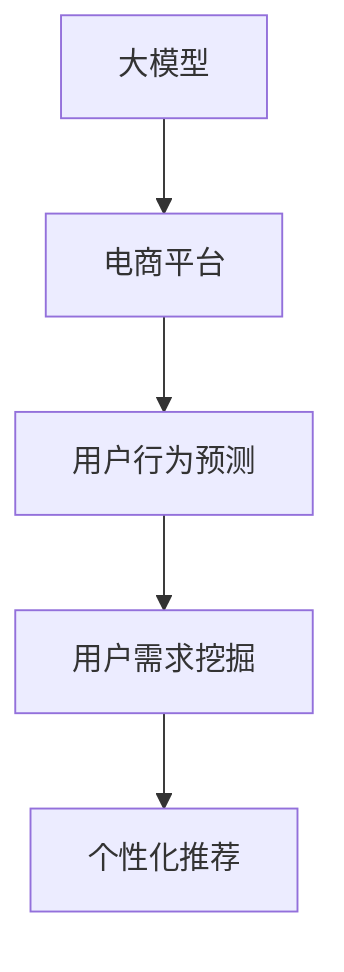

                 

# 大模型技术在电商平台用户潜在需求挖掘中的创新

## 1. 背景介绍

### 1.1 问题由来
电商平台作为线上零售的重要平台，拥有海量用户数据。通过分析用户行为数据，电商平台能够更好地理解用户需求和偏好，实现个性化推荐和精准营销。然而，传统的数据分析方法往往依赖于复杂的手动规则和特征工程，难以捕捉到用户的深层需求和行为模式。近年来，随着深度学习技术和大模型技术的发展，电商平台在用户需求挖掘上迈入了新的阶段。

### 1.2 问题核心关键点
本文聚焦于大模型技术在电商平台用户需求挖掘中的应用，具体包括：
- 如何利用大模型进行用户行为预测和需求分析
- 大模型技术在电商推荐系统中的实际应用效果
- 大模型技术面临的挑战与未来发展方向

### 1.3 问题研究意义
研究大模型技术在电商平台的应用，对于提升电商平台的用户体验和运营效率，推动电商业务的发展，具有重要意义：

1. 提升用户体验：通过个性化推荐，满足用户多样化需求，提升用户购物体验。
2. 优化运营效率：基于用户需求预测，优化库存管理和营销策略，提高平台运营效率。
3. 增强商业价值：精准挖掘用户潜在需求，开拓新的商业模式，创造更多的商业机会。
4. 促进技术进步：推动大模型技术在电商领域的落地应用，为后续的推广和应用提供借鉴。
5. 助力产业升级：结合电商平台的大数据和用户反馈，推动产业数字化转型和升级。

## 2. 核心概念与联系

### 2.1 核心概念概述

为更好地理解大模型技术在电商平台用户需求挖掘中的应用，本节将介绍几个密切相关的核心概念：

- 大模型(Big Model)：指具有大规模参数量和宽泛知识领域的深度学习模型，如BERT、GPT、T5等，能够处理大规模文本数据，提取高层次语义特征。
- 电商平台(e-Commerce Platform)：指通过互联网进行商品销售和用户服务的平台，如京东、淘宝、亚马逊等。
- 用户行为预测(User Behavior Prediction)：指利用历史数据和模型，预测用户在电商平台上的未来行为，如购买、点击、浏览等。
- 用户需求挖掘(User Demand Mining)：指通过分析用户行为数据，挖掘用户的潜在需求和行为模式，指导电商运营和推荐系统优化。
- 个性化推荐(Personalized Recommendation)：指基于用户画像和行为数据，提供符合用户需求和偏好的商品推荐。

这些核心概念之间的逻辑关系可以通过以下Mermaid流程图来展示：



这个流程图展示了大模型在电商平台应用的核心概念及其之间的关系：

1. 大模型通过大规模预训练学习通用的语言知识。
2. 电商平台通过用户行为数据，对大模型进行微调，预测用户行为。
3. 基于用户行为预测结果，挖掘用户需求。
4. 利用用户需求，提供个性化推荐，提升用户体验和运营效率。

## 3. 核心算法原理 & 具体操作步骤
### 3.1 算法原理概述

大模型在电商平台用户需求挖掘中的应用，主要基于监督学习和迁移学习的范式。其核心思想是：将大模型视作一个强大的"特征提取器"，通过电商平台的标注数据，对模型进行微调，使其能够精准预测用户行为和挖掘用户需求。

形式化地，假设电商平台的大模型为 $M_{\theta}$，其中 $\theta$ 为模型参数。给定电商平台的标注数据集 $D=\{(x_i,y_i)\}_{i=1}^N$，其中 $x_i$ 为用户行为数据，$y_i$ 为用户后续行为标签（如购买、点击、评价等）。微调的目标是找到新的模型参数 $\hat{\theta}$，使得模型在新的标注数据上的预测误差最小化。

具体步骤如下：

1. 收集电商平台的历史用户行为数据和标注数据。
2. 将数据集划分为训练集、验证集和测试集。
3. 使用大模型 $M_{\theta}$ 作为初始化参数。
4. 定义模型在电商平台的损失函数，如交叉熵损失、均方误差等。
5. 设置微调超参数，如学习率、批大小、迭代轮数等。
6. 执行梯度下降等优化算法，最小化损失函数。
7. 在测试集上评估模型性能，对比微调前后的精度提升。

### 3.2 算法步骤详解

以下是使用大模型进行电商平台用户需求挖掘的详细操作步骤：

**Step 1: 数据收集与预处理**

电商平台的标注数据通常包含用户行为数据和用户后续行为标签。用户行为数据可以是浏览记录、点击行为、评价内容等，这些数据需要预处理，转化为模型可接受的格式。常用的预处理方法包括：

1. 数据清洗：去除无关数据、异常值和噪声，确保数据质量。
2. 特征工程：提取用户行为特征，如浏览时长、点击次数、评价情绪等，构建用户行为特征向量。
3. 数据增强：通过对用户行为数据进行回译、近义替换等方式，扩充训练集，提高模型泛化能力。

**Step 2: 模型选择与初始化**

选择适合电商平台的预训练大模型，如BERT、GPT等，并初始化为电商平台的微调模型。

**Step 3: 任务适配层设计**

根据电商平台的推荐系统需求，设计合适的任务适配层。任务适配层通常包含多个全连接层和激活函数，将用户行为特征映射为用户后续行为的预测结果。

**Step 4: 微调超参数设置**

设置微调所需的超参数，如学习率、批大小、迭代轮数等。学习率一般要小于预训练时的学习率，避免破坏预训练权重。

**Step 5: 微调模型训练**

使用电商平台的标注数据，在模型适配层上进行微调训练。通过前向传播计算损失函数，反向传播更新模型参数，重复迭代直至模型收敛。

**Step 6: 模型评估与优化**

在验证集上评估模型性能，根据评估结果调整模型结构和超参数，直至模型达到预设的精度指标。

**Step 7: 模型应用与优化**

在电商平台上线微调模型，进行个性化推荐和用户需求挖掘。持续收集新数据，定期重新微调模型，优化模型性能。

### 3.3 算法优缺点

基于大模型的电商平台用户需求挖掘方法具有以下优点：
1. 精度高：大模型通过大规模预训练学习丰富的语义知识，能够精准预测用户行为。
2. 泛化能力强：模型在大规模数据上进行预训练，具有较强的泛化能力，能够适应各种用户行为模式。
3. 自动学习：大模型通过端到端的训练，能够自动学习用户行为特征，无需手工设计复杂规则。
4. 可解释性差：大模型的预测结果难以解释，难以进行深度分析。

同时，该方法也存在一些缺点：
1. 数据依赖性强：微调效果很大程度上依赖于标注数据的质量和数量。
2. 训练成本高：大模型的预训练和微调需要大量的计算资源和时间成本。
3. 模型复杂度高：大模型的结构和参数复杂，难以理解和调试。
4. 迁移能力有限：大模型往往难以迁移到其他领域，需要进行针对性的微调。

尽管存在这些局限性，但大模型技术在电商平台用户需求挖掘中仍具有显著优势，能够提升推荐系统的精度和效率，推动电商业务的智能化发展。

### 3.4 算法应用领域

大模型技术在电商平台中的应用，主要集中在以下几个方面：

1. 个性化推荐系统：基于用户行为预测，提供个性化商品推荐，提升用户体验。
2. 用户行为分析：挖掘用户行为模式和需求，指导电商运营策略。
3. 营销策略优化：预测用户点击和购买行为，优化广告投放和促销策略。
4. 库存管理：预测商品需求，优化库存管理和物流配送。
5. 风险控制：预测用户欺诈和退货行为，提升平台安全性。

除了上述这些经典应用外，大模型技术还在客户细分、广告效果评估、用户流失预测等领域得到广泛应用，为电商平台带来了显著的业务价值提升。

## 4. 数学模型和公式 & 详细讲解 & 举例说明

### 4.1 数学模型构建

本节将使用数学语言对基于大模型的电商平台用户需求挖掘过程进行更加严格的刻画。

记电商平台的大模型为 $M_{\theta}$，其中 $\theta$ 为模型参数。假设电商平台标注数据集为 $D=\{(x_i,y_i)\}_{i=1}^N, x_i \in \mathbb{R}^d, y_i \in \{0,1\}$，其中 $d$ 为特征维度。

定义模型 $M_{\theta}$ 在用户行为数据 $x_i$ 上的损失函数为 $\ell(y_i, \hat{y}_i)=L(y_i, M_{\theta}(x_i))$，其中 $\hat{y}_i$ 为模型预测的用户后续行为。在数据集 $D$ 上的经验风险为：

$$
\mathcal{L}(\theta) = \frac{1}{N} \sum_{i=1}^N \ell(y_i, M_{\theta}(x_i))
$$

微调的优化目标是最小化经验风险，即找到最优参数：

$$
\theta^* = \mathop{\arg\min}_{\theta} \mathcal{L}(\theta)
$$

在实践中，我们通常使用基于梯度的优化算法（如SGD、Adam等）来近似求解上述最优化问题。设 $\eta$ 为学习率，$\lambda$ 为正则化系数，则参数的更新公式为：

$$
\theta \leftarrow \theta - \eta \nabla_{\theta}\mathcal{L}(\theta) - \eta\lambda\theta
$$

其中 $\nabla_{\theta}\mathcal{L}(\theta)$ 为损失函数对参数 $\theta$ 的梯度，可通过反向传播算法高效计算。

### 4.2 公式推导过程

以下我们以电商平台推荐系统为例，推导交叉熵损失函数及其梯度的计算公式。

假设模型 $M_{\theta}$ 在用户行为数据 $x_i$ 上的输出为 $\hat{y}_i = M_{\theta}(x_i) \in [0,1]$，表示用户购买商品的概率。真实标签 $y_i \in \{0,1\}$。则二分类交叉熵损失函数定义为：

$$
\ell(y_i, \hat{y}_i) = -[y_i\log \hat{y}_i + (1-y_i)\log (1-\hat{y}_i)]
$$

将其代入经验风险公式，得：

$$
\mathcal{L}(\theta) = -\frac{1}{N}\sum_{i=1}^N [y_i\log M_{\theta}(x_i)+(1-y_i)\log(1-M_{\theta}(x_i))]
$$

根据链式法则，损失函数对参数 $\theta_k$ 的梯度为：

$$
\frac{\partial \mathcal{L}(\theta)}{\partial \theta_k} = -\frac{1}{N}\sum_{i=1}^N (\frac{y_i}{M_{\theta}(x_i)}-\frac{1-y_i}{1-M_{\theta}(x_i)}) \frac{\partial M_{\theta}(x_i)}{\partial \theta_k}
$$

其中 $\frac{\partial M_{\theta}(x_i)}{\partial \theta_k}$ 可进一步递归展开，利用自动微分技术完成计算。

在得到损失函数的梯度后，即可带入参数更新公式，完成模型的迭代优化。重复上述过程直至收敛，最终得到适应电商平台推荐系统需求的最优模型参数 $\theta^*$。

## 5. 项目实践：代码实例和详细解释说明

### 5.1 开发环境搭建

在进行电商平台用户需求挖掘的微调实践前，我们需要准备好开发环境。以下是使用Python进行PyTorch开发的环境配置流程：

1. 安装Anaconda：从官网下载并安装Anaconda，用于创建独立的Python环境。

2. 创建并激活虚拟环境：
```bash
conda create -n ecommerce-env python=3.8 
conda activate ecommerce-env
```

3. 安装PyTorch：根据CUDA版本，从官网获取对应的安装命令。例如：
```bash
conda install pytorch torchvision torchaudio cudatoolkit=11.1 -c pytorch -c conda-forge
```

4. 安装Transformers库：
```bash
pip install transformers
```

5. 安装各类工具包：
```bash
pip install numpy pandas scikit-learn matplotlib tqdm jupyter notebook ipython
```

完成上述步骤后，即可在`ecommerce-env`环境中开始微调实践。

### 5.2 源代码详细实现

下面我以电商平台的个性化推荐系统为例，给出使用Transformers库对BERT模型进行微调的PyTorch代码实现。

首先，定义推荐系统的数据处理函数：

```python
from transformers import BertTokenizer
from torch.utils.data import Dataset
import torch

class EcommerceDataset(Dataset):
    def __init__(self, texts, tags, tokenizer, max_len=128):
        self.texts = texts
        self.tags = tags
        self.tokenizer = tokenizer
        self.max_len = max_len
        
    def __len__(self):
        return len(self.texts)
    
    def __getitem__(self, item):
        text = self.texts[item]
        tags = self.tags[item]
        
        encoding = self.tokenizer(text, return_tensors='pt', max_length=self.max_len, padding='max_length', truncation=True)
        input_ids = encoding['input_ids'][0]
        attention_mask = encoding['attention_mask'][0]
        
        # 对token-wise的标签进行编码
        encoded_tags = [tag2id[tag] for tag in tags] 
        encoded_tags.extend([tag2id['O']] * (self.max_len - len(encoded_tags)))
        labels = torch.tensor(encoded_tags, dtype=torch.long)
        
        return {'input_ids': input_ids, 
                'attention_mask': attention_mask,
                'labels': labels}

# 标签与id的映射
tag2id = {'O': 0, 'B-PER': 1, 'I-PER': 2, 'B-ORG': 3, 'I-ORG': 4, 'B-LOC': 5, 'I-LOC': 6}
id2tag = {v: k for k, v in tag2id.items()}

# 创建dataset
tokenizer = BertTokenizer.from_pretrained('bert-base-cased')

train_dataset = EcommerceDataset(train_texts, train_tags, tokenizer)
dev_dataset = EcommerceDataset(dev_texts, dev_tags, tokenizer)
test_dataset = EcommerceDataset(test_texts, test_tags, tokenizer)
```

然后，定义模型和优化器：

```python
from transformers import BertForTokenClassification, AdamW

model = BertForTokenClassification.from_pretrained('bert-base-cased', num_labels=len(tag2id))

optimizer = AdamW(model.parameters(), lr=2e-5)
```

接着，定义训练和评估函数：

```python
from torch.utils.data import DataLoader
from tqdm import tqdm
from sklearn.metrics import classification_report

device = torch.device('cuda') if torch.cuda.is_available() else torch.device('cpu')
model.to(device)

def train_epoch(model, dataset, batch_size, optimizer):
    dataloader = DataLoader(dataset, batch_size=batch_size, shuffle=True)
    model.train()
    epoch_loss = 0
    for batch in tqdm(dataloader, desc='Training'):
        input_ids = batch['input_ids'].to(device)
        attention_mask = batch['attention_mask'].to(device)
        labels = batch['labels'].to(device)
        model.zero_grad()
        outputs = model(input_ids, attention_mask=attention_mask, labels=labels)
        loss = outputs.loss
        epoch_loss += loss.item()
        loss.backward()
        optimizer.step()
    return epoch_loss / len(dataloader)

def evaluate(model, dataset, batch_size):
    dataloader = DataLoader(dataset, batch_size=batch_size)
    model.eval()
    preds, labels = [], []
    with torch.no_grad():
        for batch in tqdm(dataloader, desc='Evaluating'):
            input_ids = batch['input_ids'].to(device)
            attention_mask = batch['attention_mask'].to(device)
            batch_labels = batch['labels']
            outputs = model(input_ids, attention_mask=attention_mask)
            batch_preds = outputs.logits.argmax(dim=2).to('cpu').tolist()
            batch_labels = batch_labels.to('cpu').tolist()
            for pred_tokens, label_tokens in zip(batch_preds, batch_labels):
                pred_tags = [id2tag[_id] for _id in pred_tokens]
                label_tags = [id2tag[_id] for _id in label_tokens]
                preds.append(pred_tags[:len(label_tags)])
                labels.append(label_tags)
                
    print(classification_report(labels, preds))
```

最后，启动训练流程并在测试集上评估：

```python
epochs = 5
batch_size = 16

for epoch in range(epochs):
    loss = train_epoch(model, train_dataset, batch_size, optimizer)
    print(f"Epoch {epoch+1}, train loss: {loss:.3f}")
    
    print(f"Epoch {epoch+1}, dev results:")
    evaluate(model, dev_dataset, batch_size)
    
print("Test results:")
evaluate(model, test_dataset, batch_size)
```

以上就是使用PyTorch对BERT进行电商平台推荐系统微调的完整代码实现。可以看到，得益于Transformers库的强大封装，我们可以用相对简洁的代码完成BERT模型的加载和微调。

### 5.3 代码解读与分析

让我们再详细解读一下关键代码的实现细节：

**EcommerceDataset类**：
- `__init__`方法：初始化文本、标签、分词器等关键组件。
- `__len__`方法：返回数据集的样本数量。
- `__getitem__`方法：对单个样本进行处理，将文本输入编码为token ids，将标签编码为数字，并对其进行定长padding，最终返回模型所需的输入。

**tag2id和id2tag字典**：
- 定义了标签与数字id之间的映射关系，用于将token-wise的预测结果解码回真实的标签。

**训练和评估函数**：
- 使用PyTorch的DataLoader对数据集进行批次化加载，供模型训练和推理使用。
- 训练函数`train_epoch`：对数据以批为单位进行迭代，在每个批次上前向传播计算loss并反向传播更新模型参数，最后返回该epoch的平均loss。
- 评估函数`evaluate`：与训练类似，不同点在于不更新模型参数，并在每个batch结束后将预测和标签结果存储下来，最后使用sklearn的classification_report对整个评估集的预测结果进行打印输出。

**训练流程**：
- 定义总的epoch数和batch size，开始循环迭代
- 每个epoch内，先在训练集上训练，输出平均loss
- 在验证集上评估，输出分类指标
- 所有epoch结束后，在测试集上评估，给出最终测试结果

可以看到，PyTorch配合Transformers库使得BERT微调的代码实现变得简洁高效。开发者可以将更多精力放在数据处理、模型改进等高层逻辑上，而不必过多关注底层的实现细节。

当然，工业级的系统实现还需考虑更多因素，如模型的保存和部署、超参数的自动搜索、更灵活的任务适配层等。但核心的微调范式基本与此类似。

## 6. 实际应用场景
### 6.1 智能推荐系统

基于大模型的电商平台用户需求挖掘技术，可以广泛应用于智能推荐系统的构建。传统推荐系统往往依赖复杂的手工规则和特征工程，难以捕捉到用户的深层需求和行为模式。而使用大模型技术，可以更好地自动学习和理解用户行为，实现更精准的个性化推荐。

在技术实现上，可以收集电商平台的用户行为数据，如浏览记录、点击行为、评价内容等，将数据转化为模型可接受的格式，使用预训练大模型进行微调。微调后的模型能够自动提取用户行为特征，并进行行为预测，从而指导推荐系统优化。

### 6.2 用户行为分析

电商平台需要实时分析用户行为数据，以便优化运营策略，提升用户体验。通过使用大模型技术，可以高效挖掘用户行为模式和需求，指导电商运营决策。

具体而言，可以收集电商平台的点击行为、浏览记录、评价内容等数据，使用大模型进行微调，提取用户行为特征，并进行行为分析。通过分析用户行为模式，电商平台能够更准确地预测用户需求，优化库存管理和广告投放，提高运营效率。

### 6.3 营销策略优化

基于用户行为预测，电商平台可以优化营销策略，提高广告投放和促销效果。使用大模型技术，可以精准预测用户点击和购买行为，指导广告投放和促销策略。例如，根据用户的历史行为和兴趣，推送个性化的广告内容，提升广告转化率。

### 6.4 库存管理

电商平台需要实时监控库存状态，及时补货和调货。使用大模型技术，可以预测商品需求，优化库存管理。通过分析用户行为数据，电商平台能够更准确地预测商品销售趋势，及时调整库存，减少缺货和滞销情况。

### 6.5 风险控制

电商平台需要防范用户欺诈和退货行为，保护平台安全。使用大模型技术，可以预测用户欺诈和退货行为，提升平台安全性。通过分析用户行为数据，电商平台能够更准确地识别异常行为，及时采取措施，减少损失。

## 7. 工具和资源推荐
### 7.1 学习资源推荐

为了帮助开发者系统掌握大模型技术在电商平台应用的理论基础和实践技巧，这里推荐一些优质的学习资源：

1. 《Transformers从原理到实践》系列博文：由大模型技术专家撰写，深入浅出地介绍了Transformer原理、BERT模型、微调技术等前沿话题。

2. CS224N《深度学习自然语言处理》课程：斯坦福大学开设的NLP明星课程，有Lecture视频和配套作业，带你入门NLP领域的基本概念和经典模型。

3. 《Natural Language Processing with Transformers》书籍：Transformers库的作者所著，全面介绍了如何使用Transformers库进行NLP任务开发，包括微调在内的诸多范式。

4. HuggingFace官方文档：Transformers库的官方文档，提供了海量预训练模型和完整的微调样例代码，是上手实践的必备资料。

5. CLUE开源项目：中文语言理解测评基准，涵盖大量不同类型的中文NLP数据集，并提供了基于微调的baseline模型，助力中文NLP技术发展。

通过对这些资源的学习实践，相信你一定能够快速掌握大模型技术在电商平台应用的关键技能，并用于解决实际的NLP问题。
###  7.2 开发工具推荐

高效的开发离不开优秀的工具支持。以下是几款用于大模型技术在电商平台应用开发的常用工具：

1. PyTorch：基于Python的开源深度学习框架，灵活动态的计算图，适合快速迭代研究。大部分预训练语言模型都有PyTorch版本的实现。

2. TensorFlow：由Google主导开发的开源深度学习框架，生产部署方便，适合大规模工程应用。同样有丰富的预训练语言模型资源。

3. Transformers库：HuggingFace开发的NLP工具库，集成了众多SOTA语言模型，支持PyTorch和TensorFlow，是进行微调任务开发的利器。

4. Weights & Biases：模型训练的实验跟踪工具，可以记录和可视化模型训练过程中的各项指标，方便对比和调优。与主流深度学习框架无缝集成。

5. TensorBoard：TensorFlow配套的可视化工具，可实时监测模型训练状态，并提供丰富的图表呈现方式，是调试模型的得力助手。

6. Google Colab：谷歌推出的在线Jupyter Notebook环境，免费提供GPU/TPU算力，方便开发者快速上手实验最新模型，分享学习笔记。

合理利用这些工具，可以显著提升大模型技术在电商平台应用的开发效率，加快创新迭代的步伐。

### 7.3 相关论文推荐

大模型技术在电商平台中的应用源于学界的持续研究。以下是几篇奠基性的相关论文，推荐阅读：

1. Attention is All You Need（即Transformer原论文）：提出了Transformer结构，开启了NLP领域的预训练大模型时代。

2. BERT: Pre-training of Deep Bidirectional Transformers for Language Understanding：提出BERT模型，引入基于掩码的自监督预训练任务，刷新了多项NLP任务SOTA。

3. Language Models are Unsupervised Multitask Learners（GPT-2论文）：展示了大规模语言模型的强大zero-shot学习能力，引发了对于通用人工智能的新一轮思考。

4. Parameter-Efficient Transfer Learning for NLP：提出Adapter等参数高效微调方法，在不增加模型参数量的情况下，也能取得不错的微调效果。

5. Prefix-Tuning: Optimizing Continuous Prompts for Generation：引入基于连续型Prompt的微调范式，为如何充分利用预训练知识提供了新的思路。

6. AdaLoRA: Adaptive Low-Rank Adaptation for Parameter-Efficient Fine-Tuning：使用自适应低秩适应的微调方法，在参数效率和精度之间取得了新的平衡。

这些论文代表了大模型技术在电商平台应用的发展脉络。通过学习这些前沿成果，可以帮助研究者把握学科前进方向，激发更多的创新灵感。

## 8. 总结：未来发展趋势与挑战

### 8.1 总结

本文对基于大模型的电商平台用户需求挖掘方法进行了全面系统的介绍。首先阐述了大模型在电商平台应用的背景和意义，明确了大模型在用户行为预测和需求分析中的独特价值。其次，从原理到实践，详细讲解了大模型在电商平台上的微调步骤和操作细节，给出了微调任务开发的完整代码实例。同时，本文还广泛探讨了大模型技术在电商平台上的实际应用效果和未来展望，展示了其在电商推荐系统、用户行为分析、营销策略优化等场景中的巨大潜力。此外，本文精选了微调技术的各类学习资源，力求为读者提供全方位的技术指引。

通过本文的系统梳理，可以看到，大模型技术在电商平台上的应用具有巨大的潜力，能够提升用户体验和运营效率，推动电商业务的智能化发展。未来，伴随大模型技术的发展和落地，电商平台将能够更好地理解用户需求，提供更精准的推荐和更优质的服务，从而在激烈的市场竞争中占据优势。

### 8.2 未来发展趋势

展望未来，大模型技术在电商平台的应用将呈现以下几个发展趋势：

1. 模型规模持续增大。随着算力成本的下降和数据规模的扩张，预训练大模型的参数量还将持续增长。超大模型通过大规模预训练学习更丰富的语义知识，能够更好地适应电商平台的复杂场景。

2. 微调方法日趋多样。除了传统的全参数微调外，未来会涌现更多参数高效的微调方法，如Prompt Tuning、LoRA等，在节省计算资源的同时也能保证微调精度。

3. 跨领域迁移能力增强。大模型通过大规模数据预训练，具备较强的跨领域迁移能力。未来能够更好地迁移到电商以外的领域，实现跨行业的智能化应用。

4. 实时化、在线化部署。大模型技术将逐步实现实时化、在线化的部署，减少数据延迟，提高响应速度，满足电商平台的实时需求。

5. 多模态融合。未来的电商平台将更加注重多模态信息的融合，结合文本、图像、语音等多模态数据进行用户需求挖掘，提升推荐系统的多样性和丰富性。

6. 端到端优化。大模型技术与电商平台的业务场景深度融合，实现端到端的优化，从用户行为数据到个性化推荐，形成完整的闭环。

以上趋势凸显了大模型技术在电商平台应用的前景广阔。这些方向的探索发展，必将进一步提升电商平台的用户体验和运营效率，推动电商业务的智能化和数字化转型。

### 8.3 面临的挑战

尽管大模型技术在电商平台的应用取得了显著进展，但在迈向更加智能化、普适化应用的过程中，仍面临诸多挑战：

1. 标注成本瓶颈。尽管大模型技术在电商平台的微调效果显著，但数据标注成本高，难以覆盖所有用户行为。如何通过无监督学习和主动学习等方法，降低标注数据的需求，是未来需要重点攻克的难题。

2. 模型复杂度高。大模型的结构复杂，难以理解和调试，特别是对于初学者和应用开发者而言。如何降低模型复杂度，提升模型可解释性，是未来研究的重点方向。

3. 资源消耗高。大模型的预训练和微调需要大量的计算资源和时间成本，如何优化模型结构，降低资源消耗，是未来需要深入探索的问题。

4. 用户隐私保护。电商平台的用户数据涉及个人隐私，如何保护用户数据安全和隐私，避免数据泄露和滥用，是未来需要重点关注的伦理问题。

5. 技术推广难度大。大模型技术对于传统IT人员而言，技术门槛高，推广难度大。如何降低技术门槛，普及大模型技术，是未来需要解决的关键问题。

6. 模型鲁棒性不足。当前的大模型技术，面对域外数据时，泛化性能往往大打折扣。如何提高大模型的鲁棒性和泛化能力，确保模型在不同场景下的稳定性和可靠性，是未来研究的重点方向。

正视大模型技术在电商平台应用面临的这些挑战，积极应对并寻求突破，将是大模型技术在电商领域走向成熟的必由之路。相信随着大模型技术的不断发展，相关挑战终将一一被克服，大模型技术必将在电商领域带来更广泛的变革和突破。

### 8.4 研究展望

未来，大模型技术在电商平台的应用将继续拓展，面向更广泛的应用场景和更高的技术要求。以下是一些可能的研究方向：

1. 探索无监督学习和半监督学习范式，降低标注数据需求，提升模型泛化能力。

2. 研究参数高效和计算高效的微调方法，在保持精度的同时，降低资源消耗，提高模型可扩展性。

3. 结合因果分析和博弈论工具，增强模型的可解释性和鲁棒性，避免模型过度拟合和过拟合。

4. 引入更多先验知识，如知识图谱、逻辑规则等，与神经网络模型进行融合，增强模型在特定领域的适应能力。

5. 融合多模态数据，提升推荐系统的多样性和丰富性，实现更精准的用户需求挖掘。

6. 探索端到端优化，从用户行为数据到个性化推荐，形成完整的闭环，提升推荐系统的整体效果。

7. 注重技术推广，降低技术门槛，普及大模型技术，实现大规模落地应用。

通过这些研究方向的研究和探索，大模型技术必将在电商领域取得更广泛的应用和突破，推动电商业务向智能化和数字化转型，为电商平台带来更广阔的发展前景。

## 9. 附录：常见问题与解答

**Q1：大模型在电商平台用户需求挖掘中的作用是什么？**

A: 大模型在电商平台用户需求挖掘中，主要通过以下方式发挥作用：
1. 自动学习用户行为特征：使用大模型对电商平台的用户行为数据进行预训练和微调，自动提取用户行为特征，减少手工规则和特征工程的复杂度。
2. 精准预测用户需求：通过微调后的模型，精准预测用户的行为和需求，实现个性化推荐和精准营销。
3. 优化运营策略：基于用户行为预测结果，指导电商平台的运营策略，提高运营效率和用户体验。

**Q2：电商平台的数据预处理主要包含哪些步骤？**

A: 电商平台的数据预处理主要包含以下步骤：
1. 数据清洗：去除无关数据、异常值和噪声，确保数据质量。
2. 特征工程：提取用户行为特征，如浏览时长、点击次数、评价情绪等，构建用户行为特征向量。
3. 数据增强：通过对用户行为数据进行回译、近义替换等方式，扩充训练集，提高模型泛化能力。
4. 数据划分：将数据划分为训练集、验证集和测试集，用于模型训练、验证和评估。

**Q3：大模型在电商平台的微调过程中，如何设置合适的超参数？**

A: 大模型在电商平台的微调过程中，选择合适的超参数对模型性能至关重要。以下是一些常用的超参数设置建议：
1. 学习率：一般建议从1e-5开始调参，逐步减小学习率，直至收敛。
2. 批大小：根据硬件资源和数据规模，选择合适的批大小，通常在16-32之间。
3. 迭代轮数：根据数据量大小和模型复杂度，设置合适的迭代轮数，通常在5-10之间。
4. 正则化系数：设置合适的正则化系数，避免模型过拟合，通常在1e-5以下。
5. 优化器：选择合适的优化器，如AdamW、SGD等，通常AdamW效果较好。

**Q4：电商平台的用户行为预测，主要包含哪些类型？**

A: 电商平台的用户行为预测，主要包含以下几种类型：
1. 点击行为预测：预测用户是否点击了某商品。
2. 购买行为预测：预测用户是否购买了某商品。
3. 浏览行为预测：预测用户是否浏览了某商品。
4. 评价行为预测：预测用户是否对某商品进行了评价。
5. 重复购买预测：预测用户是否会重复购买某商品。

**Q5：如何提高大模型在电商平台上的泛化能力？**

A: 提高大模型在电商平台上的泛化能力，主要通过以下方式：
1. 数据增强：通过回译、近义替换等方式扩充训练集，提高模型泛化能力。
2. 正则化技术：使用L2正则、Dropout、Early Stopping等技术，防止模型过度适应小规模训练集。
3. 参数高效微调：只更新少量的模型参数，避免破坏预训练权重，提升模型泛化能力。
4. 对抗训练：加入对抗样本，提高模型鲁棒性，增强泛化能力。
5. 多模型集成：训练多个微调模型，取平均输出，避免单模型过拟合。

通过以上方式，可以有效提高大模型在电商平台上的泛化能力，使其更好地适应不同场景和数据分布。

---

作者：禅与计算机程序设计艺术 / Zen and the Art of Computer Programming

