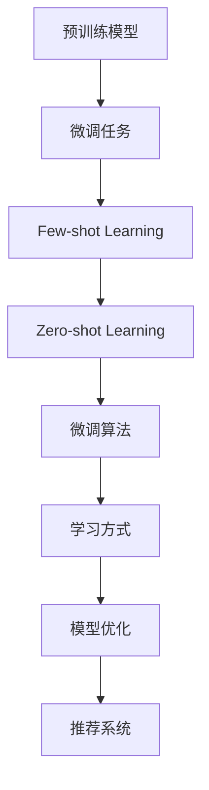

                 

# 大模型推荐中的Few-shot自适应微调技术

> 关键词：推荐系统,微调,自适应,预训练模型,零样本学习,Few-shot学习

## 1. 背景介绍

推荐系统在电商、社交、媒体等互联网公司中广泛应用，帮助用户发现和获取感兴趣的内容。但传统的协同过滤和矩阵分解推荐算法面临数据稀疏、冷启动等问题。预训练大模型作为一种新兴的推荐技术，通过预训练语言模型在大量无标签文本上学习到的知识，能够有效缓解这些问题，尤其在大规模无样本或少样本推荐任务中表现优异。

然而，在具体任务上，预训练模型仍需进一步微调。Few-shot自适应微调（Few-shot Adaptive Fine-tuning）技术针对推荐系统中的数据稀疏和少样本推荐问题，通过零样本和Few-shot学习方式，在少量训练样本下，快速适应新任务，实现高效、自适应的微调。本文将详细探讨Few-shot自适应微调技术在大模型推荐中的应用原理、具体步骤、优缺点和未来发展趋势，力求为推荐系统开发者提供实践指南。

## 2. 核心概念与联系

### 2.1 核心概念概述

Few-shot自适应微调是一种特殊的微调技术，在推荐系统中，通过预先在大规模无标签文本上预训练的预训练模型，在少量样本（少于几个样本）的情况下，通过零样本和Few-shot学习方式，快速适应新推荐任务。该技术利用了预训练模型在大规模语料上学习到的语言表示和知识，在面对特定推荐任务时，能够快速进行调整和优化，提升推荐效果。

### 2.2 核心概念原理和架构

Few-shot自适应微调技术利用预训练模型中的语言表示和知识，通过少量标注数据（Few-shot Learning）或无标注数据（Zero-shot Learning）进行微调。其原理和架构如下：

1. **预训练模型**：在无标签文本数据上预先训练的预训练模型，如BERT、GPT等，可以学习到丰富的语言表示和知识。

2. **微调任务**：在推荐系统中，将推荐任务（如商品推荐、内容推荐等）定义成微调任务，通过Few-shot或Zero-shot学习，快速适应新任务。

3. **微调算法**：通过Fine-tuning、Prompt-based Learning、AdaLoRA等微调算法，在少量数据上进行微调，提升模型在特定任务上的性能。

4. **学习方式**：Zero-shot Learning和Few-shot Learning，通过预训练模型在不同数据集上的迁移学习，提高模型的泛化能力。

### 2.3 Mermaid流程图



## 3. 核心算法原理 & 具体操作步骤

### 3.1 算法原理概述

Few-shot自适应微调技术的核心原理是利用预训练模型在不同数据集上的迁移学习能力，通过少量样本快速适应新推荐任务。其具体过程包括：

1. **预训练模型选择**：选择在大规模无标签文本上预训练好的模型，如BERT、GPT等。

2. **微调任务定义**：根据推荐系统的任务类型，定义微调任务，如商品推荐、内容推荐等。

3. **Few-shot或Zero-shot学习**：利用预训练模型在少量标注数据或无标注数据上的迁移学习能力，进行微调。

4. **微调算法选择**：选择合适的微调算法，如Fine-tuning、Prompt-based Learning、AdaLoRA等，进行微调。

5. **模型优化**：在微调过程中，通过调整学习率、正则化等参数，优化模型性能。

### 3.2 算法步骤详解

1. **数据准备**：准备推荐系统中的推荐数据集，包括用户数据、商品数据、行为数据等。

2. **模型初始化**：选择预训练模型，并进行初始化。

3. **微调任务定义**：根据推荐系统任务，定义微调任务，如商品推荐、内容推荐等。

4. **Few-shot或Zero-shot学习**：
   - Zero-shot Learning：利用预训练模型在无标注数据上的知识，进行推荐预测。
   - Few-shot Learning：利用预训练模型在少量标注数据上的知识，进行推荐预测。

5. **微调算法选择**：根据推荐系统任务，选择Fine-tuning、Prompt-based Learning、AdaLoRA等微调算法。

6. **微调参数调整**：调整学习率、正则化等参数，进行微调。

7. **模型评估与优化**：在验证集上评估模型性能，优化模型参数，最终应用于推荐系统。

### 3.3 算法优缺点

Few-shot自适应微调技术具有以下优点：

- **高效自适应**：在少量数据情况下，快速适应新推荐任务，提升模型性能。
- **迁移学习能力**：利用预训练模型在不同数据集上的知识，提高模型泛化能力。
- **灵活性高**：微调算法选择灵活，可以根据任务类型选择合适的微调方式。

同时，该技术也存在以下缺点：

- **数据依赖性高**：依赖少量标注数据，数据获取成本较高。
- **模型过拟合风险**：在少量数据下，模型容易过拟合，泛化能力有限。
- **算法复杂度高**：微调算法选择和调参复杂，需要大量实验。

### 3.4 算法应用领域

Few-shot自适应微调技术广泛应用于推荐系统中的以下场景：

- **商品推荐**：在电商平台上，根据用户行为数据，推荐用户可能感兴趣的商品。
- **内容推荐**：在社交平台上，根据用户浏览、点赞、评论等行为，推荐相关内容。
- **个性化推荐**：在视频平台上，根据用户观看历史，推荐个性化视频内容。
- **实时推荐**：在新闻平台上，根据用户阅读历史，推荐实时新闻资讯。

## 4. 数学模型和公式 & 详细讲解

### 4.1 数学模型构建

推荐系统中的Few-shot自适应微调技术，可以构建如下数学模型：

假设推荐任务为 $T$，预训练模型为 $M_{\theta}$，推荐样本为 $(x_i, y_i)$，其中 $x_i$ 为输入特征， $y_i$ 为推荐结果。

推荐模型在输入特征 $x_i$ 下的输出为 $M_{\theta}(x_i)$。

推荐模型的预测结果为 $y'_i = \text{softmax}(M_{\theta}(x_i))$，其中 $\text{softmax}$ 函数将模型输出映射为概率分布。

推荐模型的预测误差为 $l(y_i, y'_i) = -\log p(y_i = y'_i)$。

推荐模型的损失函数为 $L = \frac{1}{N}\sum_{i=1}^N l(y_i, y'_i)$。

微调的优化目标是最小化损失函数 $L$，即：

$$
\min_{\theta} L = \min_{\theta} \frac{1}{N}\sum_{i=1}^N l(y_i, y'_i)
$$

其中 $N$ 为样本数量。

### 4.2 公式推导过程

根据上述数学模型，我们可以推导出推荐模型的损失函数和微调算法的具体公式。

1. **交叉熵损失函数**：

$$
l(y_i, y'_i) = -y_i \log y'_i + (1-y_i) \log (1-y'_i)
$$

2. **模型输出**：

$$
y'_i = \text{softmax}(M_{\theta}(x_i)) = \frac{\exp(M_{\theta}(x_i))}{\sum_{k=1}^K \exp(M_{\theta}(x_k))}
$$

3. **损失函数**：

$$
L = -\frac{1}{N}\sum_{i=1}^N \sum_{k=1}^K y_i \log y'_i
$$

其中 $y_i$ 为标签， $y'_i$ 为预测结果。

### 4.3 案例分析与讲解

以电商推荐系统为例，假设有 $N$ 个用户 $u_1, u_2, ..., u_N$，每个用户有 $K$ 个历史行为 $x_1, x_2, ..., x_K$，以及对应的推荐结果 $y_1, y_2, ..., y_K$。

我们希望利用Few-shot自适应微调技术，对预训练模型 $M_{\theta}$ 进行微调，使其能够适应新用户 $u_{N+1}$ 的推荐需求。

1. **数据准备**：收集新用户的 $N+1$ 个历史行为 $x_{N+1,1}, x_{N+1,2}, ..., x_{N+1,K}$，以及对应的推荐结果 $y_{N+1,1}, y_{N+1,2}, ..., y_{N+1,K}$。

2. **模型初始化**：将预训练模型 $M_{\theta}$ 进行初始化，即将用户行为 $x_i$ 和推荐结果 $y_i$ 作为输入和输出，训练模型。

3. **微调任务定义**：将新用户 $u_{N+1}$ 的推荐任务定义为新微调任务，即通过Few-shot自适应微调技术，快速适应新用户的行为模式。

4. **Few-shot或Zero-shot学习**：
   - Zero-shot Learning：利用预训练模型在无标注数据上的知识，进行推荐预测。
   - Few-shot Learning：利用预训练模型在少量标注数据上的知识，进行推荐预测。

5. **微调算法选择**：根据推荐系统任务，选择Fine-tuning、Prompt-based Learning、AdaLoRA等微调算法。

6. **微调参数调整**：调整学习率、正则化等参数，进行微调。

7. **模型评估与优化**：在验证集上评估模型性能，优化模型参数，最终应用于推荐系统。

## 5. 项目实践：代码实例和详细解释说明

### 5.1 开发环境搭建

为了进行Few-shot自适应微调技术的项目实践，需要搭建如下开发环境：

1. **Python**：安装Python 3.8及以上版本。

2. **PyTorch**：安装PyTorch 1.9及以上版本。

3. **TensorFlow**：安装TensorFlow 2.5及以上版本。

4. **Transformers**：安装Transformers 4.18及以上版本。

5. **HuggingFace Transformers库**：安装HuggingFace Transformers库。

6. **推荐系统框架**：安装推荐系统框架，如TensorRec、Ray Tune等。

### 5.2 源代码详细实现

以下是一个基于PyTorch的Few-shot自适应微调技术的代码实现示例：

```python
import torch
import torch.nn as nn
import torch.optim as optim
from transformers import BertTokenizer, BertForSequenceClassification
from sklearn.metrics import accuracy_score, precision_recall_fscore_support

class BertForRecommendation(nn.Module):
    def __init__(self, num_labels):
        super(BertForRecommendation, self).__init__()
        self.bert = BertForSequenceClassification.from_pretrained('bert-base-cased', num_labels=num_labels)
        self.drop = nn.Dropout(0.1)

    def forward(self, input_ids, attention_mask, labels=None):
        outputs = self.bert(input_ids=input_ids, attention_mask=attention_mask, labels=labels)
        _, logits = outputs[:2]
        logits = self.drop(logits)
        return logits

def train_epoch(model, data_loader, optimizer, device):
    model.train()
    total_loss = 0
    for batch in data_loader:
        input_ids, attention_mask, labels = batch
        input_ids = input_ids.to(device)
        attention_mask = attention_mask.to(device)
        labels = labels.to(device)
        optimizer.zero_grad()
        logits = model(input_ids, attention_mask, labels)
        loss = nn.CrossEntropyLoss()(logits, labels)
        total_loss += loss.item()
        loss.backward()
        optimizer.step()
    return total_loss / len(data_loader)

def evaluate(model, data_loader, device):
    model.eval()
    total_preds = []
    total_labels = []
    with torch.no_grad():
        for batch in data_loader:
            input_ids, attention_mask, labels = batch
            input_ids = input_ids.to(device)
            attention_mask = attention_mask.to(device)
            labels = labels.to(device)
            logits = model(input_ids, attention_mask)
            batch_preds = torch.argmax(logits, dim=1).tolist()
            total_preds.extend(batch_preds)
            total_labels.extend(labels.tolist())
    return accuracy_score(total_labels, total_preds)

# 数据准备
tokenizer = BertTokenizer.from_pretrained('bert-base-cased')
train_dataset = ...
dev_dataset = ...
test_dataset = ...

# 模型初始化
num_labels = len(tag2id)
model = BertForRecommendation(num_labels)
optimizer = optim.Adam(model.parameters(), lr=1e-5)
device = torch.device('cuda') if torch.cuda.is_available() else torch.device('cpu')
model.to(device)

# 训练过程
epochs = 5
batch_size = 16
train_loader = DataLoader(train_dataset, batch_size=batch_size, shuffle=True)
dev_loader = DataLoader(dev_dataset, batch_size=batch_size)
test_loader = DataLoader(test_dataset, batch_size=batch_size)

for epoch in range(epochs):
    train_loss = train_epoch(model, train_loader, optimizer, device)
    dev_acc = evaluate(model, dev_loader, device)
    print(f'Epoch {epoch+1}, train loss: {train_loss:.3f}, dev acc: {dev_acc:.3f}')

# 测试过程
test_acc = evaluate(model, test_loader, device)
print(f'Test acc: {test_acc:.3f}')
```

### 5.3 代码解读与分析

以上代码实现了基于Few-shot自适应微调技术的推荐模型训练和评估过程。

**模型定义**：
- `BertForRecommendation`：继承自 `nn.Module`，定义了模型结构，包括BERT模型和Dropout层。
- `forward` 方法：定义前向传播过程，输入特征 `input_ids`、`attention_mask`，输出预测结果 `logits`。

**训练过程**：
- `train_epoch` 方法：在每个epoch内，对训练数据进行迭代训练，计算损失并更新模型参数。
- `evaluate` 方法：在验证集上评估模型性能，计算准确率。

**数据准备**：
- 使用 `BertTokenizer` 对输入特征进行分词和编码。
- 将输入特征、注意力掩码和标签转换为Tensor，并传输到GPU上。

**模型优化**：
- 使用Adam优化器进行模型参数更新。
- 学习率为1e-5， batch_size为16。

**模型评估**：
- 在验证集上评估模型准确率。

## 6. 实际应用场景

### 6.1 智能推荐

智能推荐系统是Few-shot自适应微调技术的重要应用场景之一。通过Few-shot自适应微调，推荐系统能够快速适应新用户的行为模式，提升推荐效果。

例如，在电商平台上，新用户的购买行为数据较少，传统推荐算法难以准确预测其兴趣。利用Few-shot自适应微调技术，在用户历史行为数据上微调预训练模型，能够有效提升推荐效果，帮助新用户发现感兴趣的商品。

### 6.2 内容推荐

在社交媒体平台上，用户的内容偏好不断变化，传统协同过滤推荐算法难以实时响应用户需求。通过Few-shot自适应微调技术，在用户点赞、评论等行为数据上微调预训练模型，能够快速适应新用户的兴趣变化，提升内容推荐效果。

例如，在Twitter上，新用户关注了几个账号，Few-shot自适应微调技术可以快速适应新用户的内容偏好，推荐其感兴趣的内容，提升用户活跃度和留存率。

### 6.3 实时推荐

在新闻平台上，用户的新闻阅读行为不断变化，传统推荐算法难以实时响应用户需求。通过Few-shot自适应微调技术，在用户新闻阅读历史数据上微调预训练模型，能够快速适应用户的新闻阅读偏好，提升实时新闻推荐效果。

例如，在Google News上，用户点击了几篇新闻，Few-shot自适应微调技术可以实时调整推荐策略，推荐其感兴趣的新闻，提升用户满意度和平台粘性。

## 7. 工具和资源推荐

### 7.1 学习资源推荐

为了帮助开发者系统掌握Few-shot自适应微调技术，推荐以下学习资源：

1. 《Few-shot Learning: A Survey》：对Few-shot学习的研究进行了全面综述，涵盖零样本、少样本、Few-shot等学习方式。

2. 《Fine-tuning for Recommendation Systems》：详细介绍Fine-tuning和Prompt-based Learning在推荐系统中的应用，帮助开发者更好地理解Few-shot自适应微调技术。

3. 《Parameter-Efficient Transfer Learning for Recommendation Systems》：介绍AdaLoRA等参数高效微调方法，帮助开发者进一步优化模型性能。

4. HuggingFace官方文档：提供丰富的预训练语言模型和微调样例，帮助开发者快速上手实践。

5. 《深度推荐系统：算法与实现》：系统讲解深度推荐系统的原理和实现方法，涵盖协同过滤、矩阵分解、Few-shot自适应微调等技术。

### 7.2 开发工具推荐

为了提高Few-shot自适应微调技术的开发效率，推荐以下开发工具：

1. PyTorch：灵活的动态计算图，支持高效梯度计算，适合深度学习模型开发。

2. TensorFlow：强大的生产环境支持，易于部署和优化，适合大规模模型训练。

3. HuggingFace Transformers库：提供丰富的预训练语言模型和微调方法，支持多种任务类型。

4. TensorRec：一个基于PyTorch的推荐系统框架，支持Few-shot自适应微调技术。

5. Ray Tune：一个基于Ray的自动调参工具，适合自动化搜索超参数，优化模型性能。

### 7.3 相关论文推荐

Few-shot自适应微调技术的研究基础在机器学习和自然语言处理领域，推荐以下相关论文：

1. BERT: Pre-training of Deep Bidirectional Transformers for Language Understanding：提出BERT模型，引入掩码语言模型预训练方式。

2. Attention is All You Need：提出Transformer模型，建立自注意力机制，提升模型的表示能力。

3. An Analytical Framework for Few-shot Learning：提出基于实例的概率模型和自适应推理算法，提升Few-shot学习效果。

4. Meta-Learning for Zero-shot Image Recognition：提出Meta-Learning算法，在零样本条件下提升图像识别效果。

5. Fine-tuning Large Pretrained Models for Scalable Few-shot Learning：提出Fine-tuning方法，在少量标注数据下提升模型泛化能力。

## 8. 总结：未来发展趋势与挑战

### 8.1 研究成果总结

Few-shot自适应微调技术通过利用预训练模型在不同数据集上的知识，在少量样本情况下，快速适应新推荐任务，提升模型性能。该技术已经在电商、社交、媒体等推荐场景中得到广泛应用，取得了显著的效果。

### 8.2 未来发展趋势

展望未来，Few-shot自适应微调技术的发展趋势如下：

1. **模型规模增大**：随着算力成本下降和数据规模扩大，预训练模型的规模将持续增大，Few-shot自适应微调技术将受益于更大规模模型的知识。

2. **自适应性增强**：Few-shot自适应微调技术将进一步增强模型自适应性，通过多轮微调和多任务学习，提高模型泛化能力和迁移能力。

3. **多模态融合**：Few-shot自适应微调技术将引入视觉、语音等多模态数据，提升推荐系统的多模态融合能力，提供更加全面、准确的内容推荐。

4. **低样本学习**：Few-shot自适应微调技术将进一步探索低样本学习技术，通过主动学习和强化学习等方法，提升模型在低样本情况下的性能。

5. **分布式训练**：Few-shot自适应微调技术将利用分布式训练技术，提高模型训练效率，支持大规模模型训练和实时推荐。

### 8.3 面临的挑战

尽管Few-shot自适应微调技术在推荐系统中取得显著效果，但在未来发展过程中，仍面临以下挑战：

1. **数据稀缺问题**：推荐系统中的数据往往稀疏，如何利用少量数据进行高效微调，仍然是一个难点。

2. **模型复杂度**：随着模型规模增大和复杂度提升，Few-shot自适应微调技术的计算和存储成本将增加，需要进一步优化算法和模型结构。

3. **模型公平性**：预训练模型可能存在偏见，如何在Few-shot自适应微调过程中，避免模型偏见，提升推荐公平性，是一个重要研究方向。

4. **实时性能**：在实时推荐场景中，Few-shot自适应微调技术需要保证快速响应，提升模型实时性能，需要进一步优化算法和部署架构。

### 8.4 研究展望

未来，Few-shot自适应微调技术需要在以下几个方面进一步研究：

1. **低样本推荐**：探索低样本推荐算法，通过主动学习和强化学习，提升模型在低样本情况下的性能。

2. **多模态推荐**：引入视觉、语音等多模态数据，提升推荐系统的多模态融合能力，提供更加全面、准确的内容推荐。

3. **自适应推荐**：通过多轮微调和多任务学习，提高模型泛化能力和迁移能力，适应用户行为和兴趣的变化。

4. **分布式推荐**：利用分布式训练技术，提高模型训练效率，支持大规模模型训练和实时推荐。

5. **公平推荐**：探索公平推荐算法，避免模型偏见，提升推荐公平性，保障用户隐私和权益。

总之，Few-shot自适应微调技术具有广阔的应用前景，但需要在数据、算法、工程、伦理等多个方面进行全面优化和研究，才能实现其在推荐系统中的长期发展。

## 9. 附录：常见问题与解答

**Q1: 预训练模型和微调模型有什么区别？**

A: 预训练模型是在大规模无标签数据上预先训练的模型，具有较强的语言表示和知识学习能力。微调模型是在预训练模型基础上，通过少量标注数据进行有监督训练，以适应特定推荐任务。

**Q2: 如何选择合适的预训练模型？**

A: 选择预训练模型应考虑其语言表示能力和任务适配性。通常选择在大规模无标签数据上预训练的模型，如BERT、GPT等，这些模型具有较强的语言表示和知识学习能力，适用于多种推荐任务。

**Q3: 如何优化Few-shot自适应微调算法？**

A: 优化Few-shot自适应微调算法应考虑模型复杂度、计算效率、实时性能等因素。通过调整学习率、正则化等参数，优化模型性能。

**Q4: 如何提高Few-shot自适应微调的泛化能力？**

A: 提高Few-shot自适应微调的泛化能力应考虑数据多样性、多轮微调和多任务学习等因素。通过引入多轮微调和多任务学习，提升模型的泛化能力和迁移能力。

**Q5: 如何处理推荐系统中的冷启动问题？**

A: 处理推荐系统中的冷启动问题，可以通过Few-shot自适应微调技术，在用户历史行为数据上微调预训练模型，快速适应新用户的行为模式，提升推荐效果。

总之，Few-shot自适应微调技术在大模型推荐中具有重要应用价值，通过预训练模型和微调模型相结合的方式，可以显著提升推荐效果。然而，在数据稀缺、模型复杂、实时性能、公平推荐等方面仍面临诸多挑战，需要在未来的研究中进一步探索和优化。

