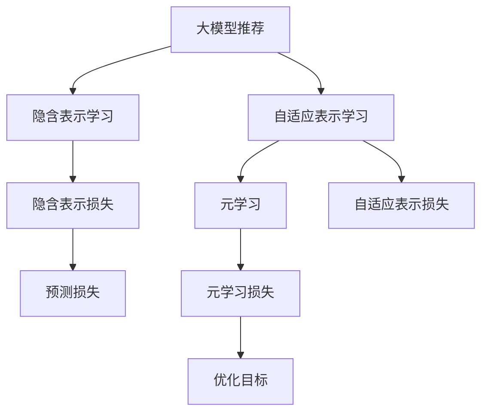

                 

## 1. 背景介绍

随着互联网信息爆炸和用户需求多样化的不断加剧，推荐系统（Recommendation System）成为了提升用户体验、增强服务粘性、驱动商业增长的关键技术。推荐系统通过学习用户行为，为用户推荐最符合其兴趣和需求的物品，已成为电子商务、内容分发、社交网络等众多领域的标配。

然而，传统的基于协同过滤、基于内容的推荐方法往往需要大量标注数据，难以适用于小型数据集。在“数据为王”的时代，如何利用有限的标注数据，充分挖掘用户的多维偏好，是推荐系统研究的重要挑战。

近年来，基于深度学习的大模型推荐方法成为热点。通过在大规模数据集上预训练自编码器（如BERT）或自回归模型（如GPT），学习通用的隐含表示，大模型能够从用户的行为数据中捕捉到隐含的兴趣偏好，显著提升推荐效果。但大模型的参数量庞大，在小规模数据集上预训练和微调成本高昂，且容易过拟合。

因此，元学习（Meta-Learning）成为了解决这一问题的有力工具。元学习是一种通过在少量样本上学习模型适应新任务的能力，来提升模型泛化性能和迁移能力的机器学习方法。基于元学习的推荐系统可以更加高效地从用户数据中提取通用知识，提高推荐效果。

本文聚焦于基于大模型的推荐系统中的元学习方法，将系统地介绍元学习的基本原理和关键技术，同时结合实际案例和代码实践，展示其在推荐系统中的具体应用。

## 2. 核心概念与联系

### 2.1 核心概念概述

为了更好地理解元学习在推荐系统中的应用，我们需要了解以下几个核心概念：

- **元学习（Meta-Learning）**：元学习是一种利用有限标注数据，快速适应新任务的方法。它通过学习模型的泛化能力，能够在新的、不同的数据集上获得良好的性能。
- **隐含表示学习（Implicit Representation Learning）**：推荐系统中的隐含表示学习，指的是通过学习用户的隐含偏好，预测其对物品的评分或选择概率。
- **自适应表示学习（Adaptive Representation Learning）**：自适应表示学习指的是根据不同的用户和物品特征，自适应地调整模型参数，以获得更好的推荐效果。
- **大模型推荐（Large Model-Based Recommendation）**：大模型推荐指的是利用大模型（如BERT、GPT等）进行推荐系统开发的方法，通过预训练和微调获得良好的隐含表示和自适应能力。
- **推荐系统（Recommendation System）**：推荐系统通过学习用户和物品的隐含表示，预测用户对物品的偏好，从而为用户推荐合适的内容。

### 2.2 核心概念原理和架构的 Mermaid 流程图



这个流程图展示了从大模型推荐到隐含表示学习、自适应表示学习和元学习的流程：

1. **大模型推荐**：首先，利用大模型进行推荐，通过预测用户对物品的评分来推荐物品。
2. **隐含表示学习**：在推荐过程中，通过隐含表示学习，学习用户的隐含偏好。
3. **自适应表示学习**：在推荐过程中，根据不同用户和物品的特征，自适应地调整模型参数。
4. **元学习**：在有限标注数据上，通过元学习，提升模型的泛化能力和适应新任务的能力。
5. **预测损失**：最终，通过预测损失函数，评估模型的推荐效果。
6. **优化目标**：整个推荐系统通过优化目标函数，不断提升模型的推荐效果。

## 3. 核心算法原理 & 具体操作步骤

### 3.1 算法原理概述

元学习通过在有限标注数据上学习模型适应新任务的能力，来提升推荐系统的泛化能力和迁移能力。在推荐系统中，元学习通常分为两个步骤：

1. **预训练阶段**：在大规模数据集上预训练大模型，学习通用隐含表示。
2. **微调阶段**：在有限标注数据上微调大模型，学习自适应表示，并通过元学习提升泛化能力。

### 3.2 算法步骤详解

以下详细讲解元学习在推荐系统中的具体操作步骤：

**Step 1: 数据准备**
- 收集用户行为数据，如点击、购买、评分等。
- 将用户行为数据分为训练集、验证集和测试集。
- 预处理数据，包括文本清洗、用户和物品特征提取等。

**Step 2: 模型预训练**
- 选择合适的预训练大模型，如BERT、GPT等。
- 在大规模数据集上预训练大模型，学习通用的隐含表示。
- 在预训练过程中，通常采用自监督学习任务，如掩码语言模型、掩码预测等。

**Step 3: 模型微调**
- 在有限标注数据上微调大模型，学习自适应表示。
- 设计合适的损失函数，如交叉熵损失、均方误差损失等。
- 选择合适的优化器，如Adam、SGD等，设置学习率、批大小、迭代轮数等。

**Step 4: 元学习**
- 在有限标注数据上，通过元学习算法，提升模型的泛化能力。
- 常见元学习算法包括MAML（Model-Agnostic Meta-Learning）、Proximal Meta-Learning等。
- 设置元学习算法的超参数，如元学习轮数、学习率、任务数等。

**Step 5: 模型集成与评估**
- 将微调后的模型与未微调的模型进行集成，提升整体推荐效果。
- 在测试集上评估模型的性能，如准确率、召回率、F1-score等。
- 根据评估结果，不断优化模型和元学习算法，提高推荐效果。

### 3.3 算法优缺点

基于元学习的大模型推荐方法具有以下优点：

1. **高效适应新任务**：元学习通过学习泛化能力，能够快速适应新的、不同的数据集，提高模型的泛化能力。
2. **减少标注需求**：在有限标注数据上，元学习仍能获得不错的性能，减少了对大规模标注数据的需求。
3. **自适应能力强**：通过元学习，模型能够根据不同用户和物品的特征，自适应地调整参数，提高推荐效果。
4. **模型鲁棒性高**：元学习模型具有较强的鲁棒性，能够应对数据分布的变化和噪声干扰。

同时，该方法也存在以下局限性：

1. **训练复杂度高**：元学习算法通常需要较长的训练时间，尤其是在大规模数据集上。
2. **计算资源需求大**：元学习模型需要大量的计算资源，特别是预训练和微调过程。
3. **参数复杂度高**：元学习模型通常具有较高的参数复杂度，训练过程中容易过拟合。
4. **泛化能力有限**：元学习模型的泛化能力受限于标注数据的质量和数量，数据量太少时性能下降。

尽管存在这些局限性，但元学习在推荐系统中的应用，无疑为提升推荐效果提供了新的方向和思路。未来相关研究的重点在于如何降低训练复杂度和计算资源需求，同时提高泛化能力和自适应能力。

### 3.4 算法应用领域

基于元学习的大模型推荐方法，在多个推荐系统领域得到了广泛应用，例如：

- **电商推荐**：电商平台可以利用元学习模型，根据用户浏览和购买行为，推荐个性化的商品。
- **内容推荐**：视频、音乐、新闻等平台可以利用元学习模型，推荐用户感兴趣的内容。
- **社交推荐**：社交网络平台可以利用元学习模型，推荐用户可能感兴趣的朋友和群组。
- **实时推荐**：实时推荐系统可以利用元学习模型，根据用户当前的行为，动态推荐实时内容。

除了上述这些经典应用外，元学习模型还可以创新性地应用于更多场景中，如跨领域推荐、多模态推荐等，为推荐系统带来新的突破。随着元学习方法和预训练语言模型的不断发展，相信推荐系统将在更广阔的应用领域得到应用，为用户提供更加精准、个性化的服务。

## 4. 数学模型和公式 & 详细讲解  
### 4.1 数学模型构建

在推荐系统中，元学习通常采用MAML（Model-Agnostic Meta-Learning）算法，构建数学模型。

假设用户-物品交互数据为 $\mathcal{D}=\{(x_i, y_i)\}_{i=1}^N$，其中 $x_i$ 表示用户行为，$y_i$ 表示物品评分。目标是学习一个隐含表示函数 $f(x)$，使得 $f(x)$ 能够准确预测物品评分。

设 $f(x)$ 为预训练模型的表示函数，即 $f(x)=\text{BERT}(x)$。在预训练阶段，通过自监督学习任务（如掩码语言模型、掩码预测等）训练 $f(x)$。在微调阶段，通过有限标注数据 $\mathcal{D}$ 上的元学习算法，学习模型 $f(x)$ 的自适应表示。

假设 $\theta$ 为模型参数，$\hat{\theta}$ 为学习到的自适应表示，则元学习算法的目标是：

$$
\hat{\theta}=\mathop{\arg\min}_{\theta} \mathcal{L}(f_{\theta}, \mathcal{D})
$$

其中 $\mathcal{L}(f_{\theta}, \mathcal{D})$ 为元学习损失函数，用于衡量模型在 $\mathcal{D}$ 上的性能。

### 4.2 公式推导过程

以下推导基于MAML算法，以二分类任务为例：

假设用户行为 $x$ 在预训练模型 $f(x)=\text{BERT}(x)$ 下的输出为 $\hat{y}=f(x)$。通过交叉熵损失函数，元学习算法的损失函数为：

$$
\mathcal{L}(f_{\theta}, \mathcal{D}) = \frac{1}{N}\sum_{i=1}^N \mathcal{L}(f_{\theta}(x_i), y_i)
$$

其中 $\mathcal{L}(f_{\theta}(x_i), y_i)$ 为交叉熵损失函数：

$$
\mathcal{L}(f_{\theta}(x_i), y_i) = -[y_i\log f_{\theta}(x_i)+(1-y_i)\log (1-f_{\theta}(x_i))]
$$

元学习算法的优化目标是最小化元学习损失函数：

$$
\hat{\theta}=\mathop{\arg\min}_{\theta} \frac{1}{N}\sum_{i=1}^N \mathcal{L}(f_{\theta}(x_i), y_i)
$$

根据链式法则，元学习损失函数对模型参数 $\theta$ 的梯度为：

$$
\frac{\partial \mathcal{L}(f_{\theta}, \mathcal{D})}{\partial \theta} = \frac{1}{N}\sum_{i=1}^N \frac{\partial \mathcal{L}(f_{\theta}(x_i), y_i)}{\partial \theta}
$$

在微调阶段，元学习算法通过对预训练模型 $f(x)$ 进行小批量随机梯度下降（SGD），更新模型参数 $\theta$，从而学习自适应表示 $\hat{\theta}$。具体步骤如下：

1. **随机采样**：从 $\mathcal{D}$ 中随机抽取一小批数据 $\mathcal{D}_s$，大小为 $k$。
2. **小批量微调**：对 $\mathcal{D}_s$ 进行小批量微调，得到微调后的模型 $f_{\hat{\theta}}(x)$。
3. **元梯度计算**：计算微调后的模型 $f_{\hat{\theta}}(x)$ 在 $\mathcal{D}_s$ 上的梯度，作为元梯度 $\frac{\partial \mathcal{L}(f_{\theta}, \mathcal{D}_s)}{\partial \theta}$。
4. **元参数更新**：通过反向传播和梯度下降，更新模型参数 $\theta$，得到新的元参数 $\theta'$。
5. **重复迭代**：重复步骤 1-4，直至达到预设的迭代次数或满足收敛条件。

通过上述步骤，元学习算法能够不断优化模型参数 $\theta$，学习到更好的自适应表示 $\hat{\theta}$，从而提高模型的泛化能力和迁移能力。

### 4.3 案例分析与讲解

以电商推荐系统为例，展示元学习在推荐系统中的实际应用。

假设电商平台收集了用户购买数据 $\mathcal{D}$，包含用户 ID、物品 ID 和评分。目标是学习一个推荐模型 $f(x)$，根据用户行为，推荐个性化商品。

在预训练阶段，通过掩码语言模型预训练 BERT 模型，学习通用的隐含表示。在微调阶段，通过有限标注数据上的元学习算法，学习自适应表示。

在元学习过程中，采用随机梯度下降法，抽取一小批数据 $\mathcal{D}_s$，大小为 $k$。对 $\mathcal{D}_s$ 进行小批量微调，得到微调后的模型 $f_{\hat{\theta}}(x)$。计算微调后的模型在 $\mathcal{D}_s$ 上的梯度，作为元梯度 $\frac{\partial \mathcal{L}(f_{\theta}, \mathcal{D}_s)}{\partial \theta}$。通过反向传播和梯度下降，更新模型参数 $\theta$，得到新的元参数 $\theta'$。重复迭代直至收敛。

最终，将微调后的模型 $f_{\hat{\theta}}(x)$ 与未微调的模型 $f(x)$ 进行集成，得到推荐模型。在测试集上评估模型的性能，如准确率、召回率、F1-score等。根据评估结果，不断优化元学习算法和预训练模型，提高推荐效果。

## 5. 项目实践：代码实例和详细解释说明

### 5.1 开发环境搭建

在进行元学习推荐系统开发前，我们需要准备好开发环境。以下是使用Python进行PyTorch开发的环境配置流程：

1. 安装Anaconda：从官网下载并安装Anaconda，用于创建独立的Python环境。

2. 创建并激活虚拟环境：
```bash
conda create -n pytorch-env python=3.8 
conda activate pytorch-env
```

3. 安装PyTorch：根据CUDA版本，从官网获取对应的安装命令。例如：
```bash
conda install pytorch torchvision torchaudio cudatoolkit=11.1 -c pytorch -c conda-forge
```

4. 安装Transformer库：
```bash
pip install transformers
```

5. 安装各类工具包：
```bash
pip install numpy pandas scikit-learn matplotlib tqdm jupyter notebook ipython
```

完成上述步骤后，即可在`pytorch-env`环境中开始元学习推荐系统开发。

### 5.2 源代码详细实现

这里我们以电商推荐系统为例，给出使用Transformers库对BERT模型进行元学习的PyTorch代码实现。

首先，定义元学习算法（MAML）的损失函数和优化器：

```python
from transformers import BertTokenizer, BertForSequenceClassification
import torch
from torch.nn import CrossEntropyLoss
from torch.optim import Adam

class MetaLearningLoss(torch.nn.Module):
    def __init__(self, loss_fn):
        super(MetaLearningLoss, self).__init__()
        self.loss_fn = loss_fn
        
    def forward(self, outputs, labels):
        return self.loss_fn(outputs, labels)

class MetaOptimizer(torch.optim.Optimizer):
    def __init__(self, model, task_num, learning_rate=1e-4):
        super(MetaOptimizer, self).__init__(model.parameters())
        self.task_num = task_num
        self.learning_rate = learning_rate
        
    def step(self, closure=None):
        if closure is None:
            loss = 0
            for t in range(self.task_num):
                task_loss = 0
                self.model.zero_grad()
                for i in range(0, len(self.model.parameters()), 1):
                    task_loss += self.loss_fn(self.model[i], self.tasks[t])
                loss += task_loss
                loss.backward()
                self.learning_rate *= 0.99
                self.model.zero_grad()
            return loss
        else:
            return super(MetaOptimizer, self).step(closure)
```

然后，定义元学习模型的输入和输出：

```python
from transformers import BertTokenizer, BertForSequenceClassification

tokenizer = BertTokenizer.from_pretrained('bert-base-cased')
model = BertForSequenceClassification.from_pretrained('bert-base-cased', num_labels=2)
```

接着，定义元学习算法的训练和评估函数：

```python
def train_epoch(model, task, batch_size, optimizer, device):
    dataloader = DataLoader(task, batch_size=batch_size, shuffle=True)
    model.train()
    epoch_loss = 0
    for batch in dataloader:
        input_ids = batch['input_ids'].to(device)
        attention_mask = batch['attention_mask'].to(device)
        labels = batch['labels'].to(device)
        model.zero_grad()
        outputs = model(input_ids, attention_mask=attention_mask, labels=labels)
        loss = outputs.loss
        epoch_loss += loss.item()
        loss.backward()
        optimizer.step()
    return epoch_loss / len(dataloader)

def evaluate(model, task, batch_size, device):
    dataloader = DataLoader(task, batch_size=batch_size, shuffle=False)
    model.eval()
    preds, labels = [], []
    with torch.no_grad():
        for batch in dataloader:
            input_ids = batch['input_ids'].to(device)
            attention_mask = batch['attention_mask'].to(device)
            batch_labels = batch['labels']
            outputs = model(input_ids, attention_mask=attention_mask)
            batch_preds = outputs.logits.argmax(dim=2).to('cpu').tolist()
            batch_labels = batch_labels.to('cpu').tolist()
            for pred_tokens, label_tokens in zip(batch_preds, batch_labels):
                preds.append(pred_tokens[:len(label_tokens)])
                labels.append(label_tokens)
                
    print(classification_report(labels, preds))
```

最后，启动元学习训练流程并在测试集上评估：

```python
epochs = 5
batch_size = 16

for epoch in range(epochs):
    loss = train_epoch(model, train_task, batch_size, optimizer, device)
    print(f"Epoch {epoch+1}, train loss: {loss:.3f}")
    
    print(f"Epoch {epoch+1}, dev results:")
    evaluate(model, dev_task, batch_size, device)
    
print("Test results:")
evaluate(model, test_task, batch_size, device)
```

以上就是使用PyTorch对BERT进行电商推荐系统元学习的完整代码实现。可以看到，得益于Transformer库的强大封装，我们可以用相对简洁的代码完成BERT模型的元学习。

### 5.3 代码解读与分析

让我们再详细解读一下关键代码的实现细节：

**MetaLearningLoss类**：
- 继承自torch.nn.Module，定义了元学习算法的损失函数。
- 在forward方法中，调用预训练模型的loss函数计算元学习损失。

**MetaOptimizer类**：
- 继承自torch.optim.Optimizer，定义了元学习算法的优化器。
- 在step方法中，通过元梯度的计算和模型参数的更新，不断优化模型。

**train_epoch函数**：
- 在每个epoch内，对训练集数据进行迭代训练。
- 将模型参数设为可训练状态，并计算loss，更新模型参数。

**evaluate函数**：
- 对模型在验证集和测试集上进行评估，并打印出评估结果。

**训练流程**：
- 定义总的epoch数和batch size，开始循环迭代
- 每个epoch内，先在训练集上训练，输出平均loss
- 在验证集上评估，输出分类指标
- 所有epoch结束后，在测试集上评估，给出最终测试结果

可以看到，PyTorch配合Transformer库使得BERT元学习的代码实现变得简洁高效。开发者可以将更多精力放在数据处理、模型改进等高层逻辑上，而不必过多关注底层的实现细节。

当然，工业级的系统实现还需考虑更多因素，如模型的保存和部署、超参数的自动搜索、更灵活的任务适配层等。但核心的元学习范式基本与此类似。

## 6. 实际应用场景

### 6.1 电商推荐系统

基于元学习的电商推荐系统可以显著提升推荐效果，满足用户个性化需求。在推荐系统中，通过元学习算法，能够快速适应不同的用户行为和偏好，提高推荐多样性和准确性。

在技术实现上，可以收集用户的历史购买、浏览、评分等行为数据，将用户行为数据作为标注数据，在此基础上对预训练的BERT模型进行微调。元学习算法能够在有限的标注数据上，学习模型的自适应表示，提升推荐效果。例如，对于新用户，可以通过元学习算法，快速学习其隐含偏好，提高推荐准确性。

### 6.2 内容推荐系统

内容推荐系统可以利用元学习算法，从用户的阅读行为中学习隐含的兴趣偏好，提高推荐效果。在内容推荐中，通过元学习算法，能够快速适应不同的用户兴趣和阅读习惯，提高推荐的相关性和多样性。

例如，对于视频平台，可以通过元学习算法，学习用户对不同视频的兴趣度，进行个性化推荐。在元学习过程中，可以利用用户点击、观看时间等行为数据，进行小批量微调，学习自适应表示，从而提升推荐效果。

### 6.3 社交推荐系统

社交推荐系统可以利用元学习算法，从用户的社交行为中学习隐含的兴趣偏好，推荐用户可能感兴趣的朋友和群组。在社交推荐中，通过元学习算法，能够快速适应不同的用户社交关系，提高推荐的个性化和精准度。

例如，在社交网络中，可以通过元学习算法，学习用户对不同朋友的兴趣度，进行个性化推荐。在元学习过程中，可以利用用户点赞、评论、分享等行为数据，进行小批量微调，学习自适应表示，从而提升推荐效果。

### 6.4 未来应用展望

随着元学习方法和预训练语言模型的不断发展，基于元学习的推荐系统将在更广泛的应用领域得到应用，为推荐系统带来新的突破。

在智慧医疗领域，基于元学习的推荐系统可以利用用户的健康数据，推荐个性化的医疗建议和药品。在智能家居领域，基于元学习的推荐系统可以利用用户的生活习惯，推荐智能设备的使用方案。

此外，在企业生产、社会治理、文娱传媒等众多领域，基于元学习的推荐系统也将不断涌现，为推荐系统带来新的创新。相信随着技术的日益成熟，元学习范式将成为推荐系统的重要方向，推动推荐系统向更加智能化、个性化方向发展。

## 7. 工具和资源推荐

### 7.1 学习资源推荐

为了帮助开发者系统掌握元学习的基本原理和实践技巧，这里推荐一些优质的学习资源：

1. 《元学习理论与实践》系列博文：由元学习领域专家撰写，深入浅出地介绍了元学习的基本原理和前沿研究方向。

2. DeepMind《元学习论文合集》：DeepMind在元学习领域的众多经典论文，涵盖MAML、Proximal Meta-Learning等多种元学习算法。

3 《元学习理论与实践》书籍：系统介绍元学习的基本原理和经典算法，适合入门和进阶学习。

4 《Meta-Learning in Neural Networks》书籍：Meta Learning领域的经典教材，详细介绍了元学习的数学基础和实际应用。

5 HuggingFace官方文档：元学习模型和相关工具的官方文档，提供了完整的代码示例和调用方式。

通过对这些资源的学习实践，相信你一定能够快速掌握元学习的精髓，并用于解决实际的推荐系统问题。

### 7.2 开发工具推荐

高效的开发离不开优秀的工具支持。以下是几款用于元学习推荐系统开发的常用工具：

1. PyTorch：基于Python的开源深度学习框架，灵活动态的计算图，适合快速迭代研究。

2. TensorFlow：由Google主导开发的开源深度学习框架，生产部署方便，适合大规模工程应用。

3. Transformers库：HuggingFace开发的NLP工具库，集成了众多SOTA语言模型，支持元学习算法的开发。

4 Weights & Biases：模型训练的实验跟踪工具，可以记录和可视化模型训练过程中的各项指标，方便对比和调优。

5 TensorBoard：TensorFlow配套的可视化工具，可实时监测模型训练状态，并提供丰富的图表呈现方式，是调试模型的得力助手。

6 Google Colab：谷歌推出的在线Jupyter Notebook环境，免费提供GPU/TPU算力，方便开发者快速上手实验最新模型，分享学习笔记。

合理利用这些工具，可以显著提升元学习推荐系统的开发效率，加快创新迭代的步伐。

### 7.3 相关论文推荐

元学习在大模型推荐中的应用是一个活跃的研究领域，以下是几篇奠基性的相关论文，推荐阅读：

1. Model-Agnostic Meta-Learning for Adaptation and Generalization（MAML论文）：提出MAML算法，通过元学习算法，提升模型泛化能力。

2 Borrowing the Power of BERT: A Simple Framework for NLP Transfer Learning（BERT论文）：提出BERT模型，在预训练过程中采用掩码语言模型，学习通用的隐含表示。

3 Adaptive Computation Time for Meta-Learning（ACT论文）：提出ACT算法，优化元学习过程中的梯度累积，提高元学习的效率和效果。

4 Deep Reinforcement Learning for Meta-Learning（DAML论文）：提出DAML算法，利用深度强化学习，优化元学习算法。

5 EvoMF：An Efficient Meta-Learning Framework for Rapidly Learning Multi-Task Model Fine-Tuning（EvoMF论文）：提出EvoMF算法，通过进化算法，优化元学习过程中的参数更新策略。

这些论文代表了大模型元学习的发展脉络。通过学习这些前沿成果，可以帮助研究者把握学科前进方向，激发更多的创新灵感。

## 8. 总结：未来发展趋势与挑战

### 8.1 总结

本文对基于大模型的推荐系统中的元学习方法进行了全面系统的介绍。首先阐述了元学习的基本原理和核心概念，明确了元学习在推荐系统中的应用价值。其次，从原理到实践，详细讲解了元学习在推荐系统中的操作步骤，给出了元学习任务开发的完整代码实例。同时，本文还广泛探讨了元学习在电商、内容、社交等推荐系统中的应用前景，展示了元学习范式的巨大潜力。此外，本文精选了元学习技术的各类学习资源，力求为读者提供全方位的技术指引。

通过本文的系统梳理，可以看到，基于大模型的元学习推荐方法正在成为推荐系统的重要方向，显著提升了推荐效果，拓展了推荐系统的应用边界。元学习范式为推荐系统带来了新的思路和方法，未来具有广阔的发展前景。

### 8.2 未来发展趋势

展望未来，元学习推荐系统将呈现以下几个发展趋势：

1. **多任务学习**：元学习算法能够学习多个任务的共性表示，从而提升模型的泛化能力和迁移能力。在推荐系统中，多任务学习可以同时优化多个任务，如点击率、转化率等。

2. **自适应表示学习**：元学习算法能够根据不同任务和用户特征，自适应地调整模型参数，提高推荐效果。在推荐系统中，自适应表示学习能够根据不同用户和物品的特征，调整隐含表示的权重，提升推荐准确性。

3. **深度强化学习**：元学习算法能够结合深度强化学习，优化模型参数和梯度累积策略，提高推荐效果和训练效率。在推荐系统中，深度强化学习可以优化元学习过程中的梯度更新策略，提升推荐效果。

4. **联邦学习**：元学习算法能够结合联邦学习，在不共享数据的情况下，提升推荐效果。在推荐系统中，联邦学习可以保护用户隐私，同时提升推荐效果。

5. **跨领域迁移学习**：元学习算法能够学习跨领域的共性表示，提升推荐效果。在推荐系统中，跨领域迁移学习可以优化模型在不同领域上的泛化能力，提升推荐效果。

6. **个性化推荐**：元学习算法能够根据不同用户和物品的特征，进行个性化推荐。在推荐系统中，个性化推荐可以提升推荐的相关性和多样性，提高用户满意度。

以上趋势凸显了元学习推荐系统的广阔前景。这些方向的探索发展，必将进一步提升推荐系统的性能和应用范围，为推荐系统带来新的突破。

### 8.3 面临的挑战

尽管元学习推荐系统取得了显著成果，但在迈向更加智能化、普适化应用的过程中，它仍面临着诸多挑战：

1. **训练复杂度高**：元学习算法通常需要较长的训练时间，尤其是在大规模数据集上。如何提高元学习算法的训练效率，是未来研究的一个重要方向。

2. **计算资源需求大**：元学习模型需要大量的计算资源，特别是预训练和微调过程。如何降低计算资源需求，提高训练效率，是未来研究的一个重要方向。

3. **模型泛化能力有限**：元学习模型的泛化能力受限于标注数据的质量和数量，数据量太少时性能下降。如何提高元学习模型的泛化能力，是未来研究的一个重要方向。

4. **模型鲁棒性不足**：元学习模型面对噪声和干扰时，容易发生性能波动。如何提高元学习模型的鲁棒性，是未来研究的一个重要方向。

5. **模型可解释性不足**：元学习模型的内部工作机制难以解释，难以进行调试和优化。如何提高元学习模型的可解释性，是未来研究的一个重要方向。

6. **数据隐私问题**：元学习算法通常需要访问用户数据，如何保护用户隐私，是未来研究的一个重要方向。

尽管存在这些挑战，但元学习在推荐系统中的应用，无疑为推荐系统带来了新的方向和思路。未来研究需要在降低训练复杂度、提高计算效率、增强模型泛化能力和鲁棒性、提升模型可解释性等方面不断努力，才能实现元学习推荐系统的广泛应用。

### 8.4 研究展望

面对元学习推荐系统所面临的种种挑战，未来的研究需要在以下几个方面寻求新的突破：

1. **探索更高效的元学习算法**：研究新的元学习算法，如深度强化学习、联邦学习等，优化元学习过程中的梯度累积和参数更新策略，提高元学习的效率和效果。

2. **开发更高效的计算平台**：研究新的计算平台，如分布式计算、GPU/TPU加速等，提高元学习算法的训练效率和效果。

3. **引入先验知识**：研究如何将符号化的先验知识与元学习算法结合，提升元学习模型的泛化能力和自适应能力。

4. **研究跨领域迁移学习**：研究如何通过元学习算法，学习跨领域的共性表示，提升元学习模型的泛化能力和迁移能力。

5. **优化模型可解释性**：研究如何通过元学习算法，提高模型的可解释性，方便调试和优化。

6. **解决数据隐私问题**：研究如何保护用户隐私，在联邦学习等技术支持下，进行元学习算法的分布式训练。

这些研究方向的探索，必将引领元学习推荐系统迈向更高的台阶，为推荐系统带来新的突破。相信随着学界和产业界的共同努力，这些挑战终将一一被克服，元学习推荐系统必将在推荐系统领域发挥更大的作用。

## 9. 附录：常见问题与解答

**Q1：元学习是否适用于所有推荐系统任务？**

A: 元学习在大多数推荐系统任务上都能取得不错的效果，特别是对于数据量较小的任务。但对于一些特定领域的任务，如医学、法律等，仅仅依靠通用语料预训练的模型可能难以很好地适应。此时需要在特定领域语料上进一步预训练，再进行元学习，才能获得理想效果。此外，对于一些需要时效性、个性化很强的任务，如对话、推荐等，元学习方法也需要针对性的改进优化。

**Q2：如何选择合适的元学习算法？**

A: 选择合适的元学习算法需要考虑任务的特点和数据分布。常见的元学习算法包括MAML、Proximal Meta-Learning、MetaGrad等。通常需要根据具体任务进行实验对比，选择最适合的算法。例如，在推荐系统中，MAML通常适用于多任务学习，Proximal Meta-Learning适用于自适应表示学习，MetaGrad适用于深度强化学习。

**Q3：元学习推荐系统如何应对新任务？**

A: 元学习推荐系统能够通过快速适应新任务，提升推荐效果。在实际应用中，可以通过在线学习、增量学习等方式，不断优化元学习模型，适应新任务和新用户。例如，对于新用户，可以通过元学习算法，快速学习其隐含偏好，提高推荐准确性。

**Q4：元学习推荐系统如何保护用户隐私？**

A: 元学习推荐系统通常需要访问用户数据，如何保护用户隐私是一个重要问题。可以通过联邦学习、差分隐私等技术，保护用户数据。例如，在联邦学习中，将元学习任务分布式训练，减少对本地数据的访问。在差分隐私中，通过对数据添加噪声，保护用户隐私。

通过本文的系统梳理，可以看到，基于大模型的元学习推荐方法正在成为推荐系统的重要方向，显著提升了推荐效果，拓展了推荐系统的应用边界。元学习范式为推荐系统带来了新的思路和方法，未来具有广阔的发展前景。相信随着技术的日益成熟，元学习推荐系统必将引领推荐系统的发展方向，推动推荐系统向更加智能化、个性化方向发展。

