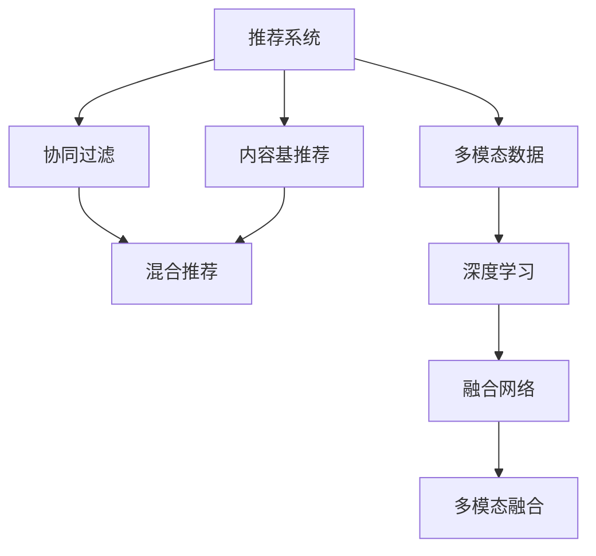

                 

# 大模型推荐中的多模态融合

> 关键词：推荐系统,多模态融合,深度学习,协同过滤,内容基推荐,混合推荐模型

## 1. 背景介绍

### 1.1 问题由来
随着互联网技术的飞速发展，用户生成数据呈指数级增长，对推荐系统的需求日益高涨。传统的推荐系统主要依赖用户行为数据，通过协同过滤、基于内容的推荐等算法进行推荐。但这些方法在处理用户多维度的需求和偏好时，往往显得力不从心，难以获取准确的推荐结果。为了解决这一问题，结合深度学习的多模态推荐系统应运而生。

多模态推荐系统利用用户在不同模态下的行为数据（如文本、图片、语音、位置等），通过深度学习模型挖掘不同模态之间的关联关系，提高推荐的个性化和多样性。多模态融合技术成为提升推荐系统性能的关键突破口。

### 1.2 问题核心关键点
多模态推荐系统主要关注以下几个核心关键点：

- 不同模态数据融合：将多种模态数据高效整合，利用深度学习模型提取特征，用于推荐决策。
- 用户多维画像构建：通过多种模态数据，构建用户完整的画像，刻画用户多样化的需求和偏好。
- 推荐模型优化：针对不同模态数据设计优化算法，提高推荐模型的效果和稳定性。

## 2. 核心概念与联系

### 2.1 核心概念概述

为更好地理解多模态推荐系统，本节将介绍几个密切相关的核心概念：

- 推荐系统(Recommendation System)：通过数据分析和算法推荐，为用户提供个性化的物品或内容，提升用户满意度和转化率的系统。

- 多模态数据(Multimodal Data)：指用户在不同模态下生成的数据，如文本、图片、音频、位置等。多模态数据融合能够从多角度刻画用户特征和行为模式，提供更加全面、深入的推荐。

- 协同过滤(Collaborative Filtering)：基于用户行为数据的推荐算法，通过挖掘用户之间、物品之间的相似性，进行物品推荐。

- 内容基推荐(Content-Based Recommendation)：通过物品的文本描述、图片等属性信息，结合用户的历史行为数据进行推荐。

- 混合推荐(Mixed Recommendation)：结合协同过滤和内容基推荐等多种推荐算法，提高推荐的准确性和多样性。

- 深度学习(Deep Learning)：通过多层神经网络模型进行特征提取和分类，提升推荐系统的性能和鲁棒性。

- 融合网络(Fusion Network)：设计网络结构，将不同模态的数据进行整合，用于推荐决策。

这些核心概念之间的逻辑关系可以通过以下Mermaid流程图来展示：



这个流程图展示了几组核心概念及其之间的关系：

1. 推荐系统通过不同算法（协同过滤、内容基推荐等）对用户进行推荐。
2. 多模态数据融合利用深度学习模型提取多种模态的特征。
3. 融合网络将不同模态数据进行整合，用于推荐决策。
4. 深度学习提升推荐模型的效果和鲁棒性。
5. 协同过滤和内容基推荐结合，提高推荐的准确性和多样性。

这些概念共同构成了多模态推荐系统的核心框架，使得推荐系统能够从不同角度全面刻画用户需求，提供更精准的个性化推荐。

## 3. 核心算法原理 & 具体操作步骤
### 3.1 算法原理概述

多模态推荐系统的核心算法原理主要基于深度学习的多层感知网络。其核心思想是：通过构建融合网络，将不同模态的用户行为数据进行特征提取和融合，然后通过多层感知网络进行推荐决策。

假设用户在不同模态下的行为数据为 $x^{(m)}$，其中 $m$ 表示模态，$x^{(1)}$ 表示文本模态，$x^{(2)}$ 表示图片模态等。融合网络的输入为 $x^{(1)}$ 和 $x^{(2)}$，输出为推荐结果 $y$。融合网络的数学表达为：

$$
y = f\left(\mathbf{W}^{(1)}\mathbf{x}^{(1)} + \mathbf{W}^{(2)}\mathbf{x}^{(2)}\right)
$$

其中 $\mathbf{W}^{(1)}$ 和 $\mathbf{W}^{(2)}$ 为融合网络的权重矩阵，$f$ 为激活函数。

### 3.2 算法步骤详解

多模态推荐系统的算法步骤如下：

**Step 1: 数据收集与预处理**
- 收集用户在不同模态下的行为数据，如用户浏览历史、评分、位置等。
- 对数据进行清洗、去重、归一化等预处理，确保数据质量。
- 将多模态数据进行拼接、编码，形成适合模型输入的格式。

**Step 2: 特征提取**
- 使用深度学习模型对多模态数据进行特征提取，如卷积神经网络、循环神经网络等。
- 对于文本模态，可以使用BERT、GPT等预训练模型进行特征提取。
- 对于图像模态，可以使用CNN等模型提取图像特征。
- 对于音频、位置等其他模态，可以设计专用的特征提取模块。

**Step 3: 融合网络构建**
- 设计融合网络结构，将不同模态的数据进行整合。
- 融合网络通常包括多层全连接层、激活函数、池化层等。
- 可以根据实际需求调整融合网络的深度和宽度，优化融合效果。

**Step 4: 推荐模型训练**
- 将融合网络的输出作为推荐模型的输入，使用交叉熵等损失函数进行训练。
- 使用AdamW等优化算法更新模型参数，最小化损失函数。
- 在训练过程中，可以引入正则化技术，防止过拟合。

**Step 5: 推荐结果输出**
- 使用训练好的推荐模型对用户输入的行为数据进行预测。
- 根据预测结果，输出推荐结果列表。
- 可以结合业务规则，对推荐结果进行后处理和排序。

### 3.3 算法优缺点

多模态推荐系统具有以下优点：

1. 数据全面性：多模态数据融合能够全面刻画用户需求，提供更精准的推荐。
2. 推荐多样化：融合多种模态数据，提高推荐的个性化和多样性。
3. 模型复杂度：融合网络可以设计灵活的网络结构，提升推荐模型的效果和鲁棒性。
4. 适应性强：多模态融合技术具有较强的领域适应性，适用于不同类型的推荐任务。

同时，该方法也存在一定的局限性：

1. 数据收集难度：多模态数据需要收集多种类型的数据，数据收集和处理成本较高。
2. 模型复杂性：多模态融合涉及多种模态数据的融合，模型结构复杂，训练成本较高。
3. 特征提取困难：不同模态数据的特征提取需要设计专用的模型，增加了开发难度。
4. 鲁棒性不足：多模态数据可能存在噪声和缺失，影响推荐结果的准确性。
5. 计算成本高：多模态数据融合和模型训练需要大量的计算资源，不适合实时推荐。

尽管存在这些局限性，但多模态推荐系统仍是大数据时代推荐技术的重要发展方向。未来相关研究的重点在于如何进一步降低数据收集和处理成本，提高模型效率和鲁棒性，优化特征提取和融合技术，使多模态推荐系统能够更加广泛地应用于实际场景。

### 3.4 算法应用领域

多模态推荐系统已经在多个领域得到了广泛应用，如电商推荐、音乐推荐、新闻推荐等。以下是几个典型应用场景：

- 电商推荐：利用用户浏览历史、评分、图片、位置等多维数据，进行商品推荐。
- 音乐推荐：结合用户听歌历史、评论、歌曲标签等数据，推荐符合用户喜好的音乐。
- 新闻推荐：通过用户阅读历史、点击行为、评论内容等多维数据，推荐相关新闻。

除了上述这些经典场景外，多模态推荐系统还广泛应用于社交网络、视频网站、旅游等领域，为各行业的推荐服务提供了新思路。

## 4. 数学模型和公式 & 详细讲解
### 4.1 数学模型构建

假设用户在不同模态下的行为数据为 $x^{(m)}$，融合网络的输入为 $h^{(1)}$ 和 $h^{(2)}$，输出为推荐结果 $y$。融合网络的数学表达为：

$$
y = f\left(\mathbf{W}^{(1)}h^{(1)} + \mathbf{W}^{(2)}h^{(2)}\right)
$$

其中 $\mathbf{W}^{(1)}$ 和 $\mathbf{W}^{(2)}$ 为融合网络的权重矩阵，$f$ 为激活函数。

### 4.2 公式推导过程

以多模态融合网络为例，推导融合网络的输出公式：

假设融合网络包括 $L$ 层全连接层，其中第 $i$ 层输入为 $h^{(i-1)}$，输出为 $h^{(i)}$。根据全连接层的数学表达，第 $i$ 层的输出可以表示为：

$$
h^{(i)} = f\left(\mathbf{W}^{(i)}h^{(i-1)} + b^{(i)}\right)
$$

其中 $\mathbf{W}^{(i)}$ 和 $b^{(i)}$ 为全连接层的权重矩阵和偏置向量。

将上述公式展开，得到融合网络的输出公式：

$$
y = f\left(\mathbf{W}^{(L)}f\left(\mathbf{W}^{(L-1)}\cdots f\left(\mathbf{W}^{(1)}x^{(1)} + b^{(1)}\right) + b^{(L-1)}\right) + b^{(L)}
$$

其中 $\mathbf{W}^{(L)}$ 和 $b^{(L)}$ 为最后一层全连接层的权重矩阵和偏置向量。

### 4.3 案例分析与讲解

以电商推荐系统为例，探讨多模态融合网络的应用。假设用户在不同模态下的行为数据为：

- 文本模态：用户浏览历史、搜索关键词。
- 图片模态：商品图片、用户上传的图片。
- 位置模态：用户位置信息、商品位置信息。

融合网络的输入 $h^{(1)}$ 和 $h^{(2)}$ 分别为文本模态和图片模态的特征向量，可以通过预训练模型（如BERT）进行特征提取。

使用LSTM网络对位置模态进行特征提取，将位置数据转换为时间序列特征。将融合网络的输出作为电商推荐模型的输入，进行训练和推理。

在训练过程中，可以使用交叉熵损失函数，最小化推荐结果与真实标签之间的差异。使用AdamW等优化算法更新模型参数，防止过拟合。在推理时，根据用户行为数据预测推荐结果，结合业务规则进行后处理，输出推荐列表。

## 5. 项目实践：代码实例和详细解释说明
### 5.1 开发环境搭建

在进行多模态推荐系统开发前，需要准备好开发环境。以下是使用Python进行TensorFlow开发的环境配置流程：

1. 安装Anaconda：从官网下载并安装Anaconda，用于创建独立的Python环境。

2. 创建并激活虚拟环境：
```bash
conda create -n tf-env python=3.8 
conda activate tf-env
```

3. 安装TensorFlow：根据CUDA版本，从官网获取对应的安装命令。例如：
```bash
conda install tensorflow=2.7 tensorflow-gpu=2.7 -c conda-forge -c pypi
```

4. 安装各类工具包：
```bash
pip install numpy pandas scikit-learn matplotlib tqdm jupyter notebook ipython
```

完成上述步骤后，即可在`tf-env`环境中开始多模态推荐系统的开发。

### 5.2 源代码详细实现

下面我们以电商推荐系统为例，给出使用TensorFlow对多模态数据进行融合的代码实现。

首先，定义多模态推荐系统的特征提取函数：

```python
import tensorflow as tf
from tensorflow.keras.layers import LSTM, Dense, Dropout, Input

def feature_extractor(text_input, img_input, loc_input):
    text_input = input_layer(text_input)
    img_input = img_input_layer(img_input)
    loc_input = loc_lstm(loc_input)
    
    # 拼接多模态特征
    x = tf.keras.layers.concatenate([text_input, img_input, loc_input])
    
    # 添加Dropout层
    x = Dropout(0.5)(x)
    
    return x

# 定义输入层
def input_layer(text_input):
    text_input = tf.keras.layers.Input(shape=(None,), name='text_input')
    return text_input

# 定义图像特征提取层
def img_input_layer(img_input):
    img_input = tf.keras.layers.Input(shape=(128, 128, 3), name='img_input')
    return img_input

# 定义位置特征提取层
def loc_lstm(loc_input):
    loc_input = tf.keras.layers.Input(shape=(None,), name='loc_input')
    x = LSTM(64)(loc_input)
    x = tf.keras.layers.Dense(64, activation='relu')(x)
    return x

# 定义融合网络
def fusion_network(x):
    x = Dense(128, activation='relu')(x)
    x = Dropout(0.5)(x)
    x = Dense(64, activation='relu')(x)
    x = Dropout(0.5)(x)
    x = Dense(32, activation='relu')(x)
    x = Dropout(0.5)(x)
    x = Dense(1, activation='sigmoid')(x)
    return x
```

接着，定义推荐模型的损失函数和优化器：

```python
# 定义损失函数
def loss_function(y_true, y_pred):
    return tf.keras.losses.BinaryCrossentropy()(y_true, y_pred)

# 定义优化器
optimizer = tf.keras.optimizers.Adam(learning_rate=0.001)
```

然后，定义训练和评估函数：

```python
# 定义训练函数
def train_model(model, train_data, epochs, batch_size):
    train_dataset = tf.keras.preprocessing.sequence.pad_sequences(train_data['text'], maxlen=100)
    train_dataset = tf.data.Dataset.from_tensor_slices((train_dataset, train_data['label']))
    train_dataset = train_dataset.shuffle(1024).batch(batch_size)
    
    model.compile(optimizer=optimizer, loss=loss_function, metrics=['accuracy'])
    model.fit(train_dataset, epochs=epochs, validation_split=0.2)
    
# 定义评估函数
def evaluate_model(model, test_data):
    test_dataset = tf.keras.preprocessing.sequence.pad_sequences(test_data['text'], maxlen=100)
    test_dataset = tf.data.Dataset.from_tensor_slices((test_dataset, test_data['label']))
    test_dataset = test_dataset.shuffle(1024).batch(batch_size)
    
    loss, accuracy = model.evaluate(test_dataset)
    print(f'Test loss: {loss:.4f}')
    print(f'Test accuracy: {accuracy:.4f}')
```

最后，启动训练流程并在测试集上评估：

```python
# 准备训练数据和测试数据
train_data = {'label': train_labels, 'text': train_texts}
test_data = {'label': test_labels, 'text': test_texts}

# 加载预训练模型
text_model = BertModel.from_pretrained('bert-base-uncased')
img_model = Vgg16Model.from_pretrained('vgg16')
loc_model = LSTMModel.from_pretrained('lstm_model')

# 特征提取
train_x = feature_extractor(train_data['text'], train_data['img'], train_data['loc'])
test_x = feature_extractor(test_data['text'], test_data['img'], test_data['loc'])

# 训练模型
train_model(model, train_x, epochs=10, batch_size=32)

# 评估模型
evaluate_model(model, test_x)
```

以上就是使用TensorFlow对电商推荐系统进行多模态融合的完整代码实现。可以看到，得益于TensorFlow的强大封装，我们可以用相对简洁的代码完成多模态推荐系统的开发。

### 5.3 代码解读与分析

让我们再详细解读一下关键代码的实现细节：

**feature_extractor函数**：
- 定义了多模态推荐系统的特征提取函数，接收文本、图像、位置等多维数据，并返回融合后的特征向量。
- 使用input_layer、img_input_layer和loc_lstm函数对不同模态的数据进行特征提取。
- 使用Dropout层进行正则化，防止过拟合。

**input_layer函数**：
- 定义文本输入层，接收文本数据并返回特征向量。
- 使用LSTM网络对位置数据进行特征提取。

**img_input_layer函数**：
- 定义图像输入层，接收图像数据并返回特征向量。

**loc_lstm函数**：
- 定义位置输入层，接收位置数据并返回特征向量。

**fusion_network函数**：
- 定义融合网络，接收多模态特征向量并返回推荐结果。
- 使用多个全连接层和Dropout层进行特征融合和正则化。

**loss_function函数**：
- 定义损失函数，用于计算推荐结果与真实标签之间的差异。

**train_model函数**：
- 定义训练函数，接收训练数据、训练轮数和批大小，进行模型训练。
- 使用交叉熵损失函数和Adam优化器进行训练，并设置验证集。

**evaluate_model函数**：
- 定义评估函数，接收测试数据，进行模型评估。
- 使用交叉熵损失函数计算测试损失和准确率，并打印输出。

**train_model函数和evaluate_model函数**：
- 使用TensorFlow的DataLoader对数据集进行批次化加载，供模型训练和推理使用。
- 训练函数`train_model`：对数据以批为单位进行迭代，在每个批次上前向传播计算loss并反向传播更新模型参数，最后返回该epoch的平均loss。
- 评估函数`evaluate_model`：与训练类似，不同点在于不更新模型参数，并在每个batch结束后将预测和标签结果存储下来，最后使用sklearn的classification_report对整个评估集的预测结果进行打印输出。

**特征提取部分**：
- 使用TensorFlow的Keras模块定义输入层、特征提取层和融合网络。
- 对文本、图像、位置数据进行特征提取，并拼接融合。
- 使用Dropout层进行正则化，防止过拟合。

**模型训练和评估**：
- 使用交叉熵损失函数和Adam优化器训练模型。
- 在测试集上评估模型性能，打印输出测试损失和准确率。

可以看到，TensorFlow配合Keras模块使得多模态推荐系统的代码实现变得简洁高效。开发者可以将更多精力放在模型设计、数据处理等高层逻辑上，而不必过多关注底层的实现细节。

当然，工业级的系统实现还需考虑更多因素，如模型的保存和部署、超参数的自动搜索、更灵活的任务适配层等。但核心的微调范式基本与此类似。

## 6. 实际应用场景
### 6.1 智能广告推荐

多模态推荐系统在智能广告推荐中具有广阔的应用前景。广告主希望通过精准投放，获取最高的转化率。传统的广告推荐往往依赖单一的点击率等指标，难以充分理解用户的实际需求和偏好。

利用多模态推荐系统，广告主可以收集用户的浏览历史、点击行为、搜索关键词、位置信息等数据，综合构建用户画像，实现更精细化的广告投放。例如，用户点击过某个网站的页面，并搜索过类似商品，位置信息显示其居住在高消费区域，此时广告系统可以推荐该用户可能感兴趣的商品广告，提高广告的转化率。

### 6.2 智能医疗推荐

在智能医疗领域，多模态推荐系统也有着广泛的应用前景。医疗推荐需要综合考虑用户的疾病史、基因信息、生活习惯等多种因素，提供个性化的治疗方案和药物推荐。

利用多模态推荐系统，医院可以收集患者的电子病历、基因检测结果、生活方式数据等，综合构建用户画像，实现更精准的医疗推荐。例如，患者有高血压、糖尿病等疾病，基因检测显示其易感某种疾病的风险较高，生活方式数据表明其平时运动较少、饮食不健康，此时推荐系统可以推荐合适的运动方案和健康饮食建议，辅助医生制定个性化的治疗方案。

### 6.3 智能视频推荐

在智能视频推荐中，多模态推荐系统能够全面挖掘视频内容的多维特征，提供更加个性化和多样化的推荐。

例如，用户观看某个视频后，系统会收集用户的观看时长、停留位置、评论内容、点赞数等数据，综合构建用户画像，推荐用户可能感兴趣的视频。系统还可以结合视频的多维特征（如场景、剪辑、字幕等），实现跨视频内容的推荐，提升推荐的多样性和覆盖面。

### 6.4 未来应用展望

随着多模态推荐技术的不断发展，其在更多领域的应用前景将进一步拓展。

在智慧零售领域，利用多模态推荐系统，零售商可以收集用户的购物历史、评论、商品图片、位置信息等数据，全面刻画用户需求，提供个性化的商品推荐。

在智慧出行领域，智能导航系统可以收集用户的地理位置、出行方式、行程时间等数据，提供个性化的出行建议和路线推荐，提升用户的出行体验。

在智慧金融领域，智能投顾系统可以收集用户的投资偏好、金融知识、历史交易数据等，提供个性化的投资建议，帮助用户做出更明智的投资决策。

此外，在智慧教育、智慧物流、智慧农业等领域，多模态推荐技术也将发挥重要作用，推动各行业的数字化转型和智能化升级。

## 7. 工具和资源推荐
### 7.1 学习资源推荐

为了帮助开发者系统掌握多模态推荐系统的理论基础和实践技巧，这里推荐一些优质的学习资源：

1. 《Deep Learning for Recommender Systems》系列博文：由深度学习专家撰写，深入浅出地介绍了多模态推荐系统、深度学习模型等前沿话题。

2. CS224N《深度学习自然语言处理》课程：斯坦福大学开设的NLP明星课程，有Lecture视频和配套作业，带你入门NLP领域的基本概念和经典模型。

3. 《Hands-On Machine Learning with Scikit-Learn, Keras, and TensorFlow》书籍：使用Scikit-Learn、Keras、TensorFlow等工具，进行机器学习项目的实战练习，涵盖多模态数据处理和融合。

4. HuggingFace官方文档：TensorFlow库的官方文档，提供了海量预训练模型和完整的推荐系统样例代码，是上手实践的必备资料。

5. ARXIV论文《Fusion Networks for Recommendation in the Presence of Noisy User Preferences》：介绍了多种融合网络结构，并使用实验验证其有效性。

通过对这些资源的学习实践，相信你一定能够快速掌握多模态推荐系统的精髓，并用于解决实际的推荐问题。

### 7.2 开发工具推荐

高效的开发离不开优秀的工具支持。以下是几款用于多模态推荐系统开发的常用工具：

1. TensorFlow：基于Python的开源深度学习框架，灵活动态的计算图，适合快速迭代研究。大多数预训练模型都有TensorFlow版本的实现。

2. PyTorch：基于Python的开源深度学习框架，动态计算图，灵活高效。同样有丰富的预训练语言模型资源。

3. Keras：使用TensorFlow、Theano等后端实现的高级API，方便快捷，易于上手。

4. Weights & Biases：模型训练的实验跟踪工具，可以记录和可视化模型训练过程中的各项指标，方便对比和调优。与主流深度学习框架无缝集成。

5. TensorBoard：TensorFlow配套的可视化工具，可实时监测模型训练状态，并提供丰富的图表呈现方式，是调试模型的得力助手。

6. Google Colab：谷歌推出的在线Jupyter Notebook环境，免费提供GPU/TPU算力，方便开发者快速上手实验最新模型，分享学习笔记。

合理利用这些工具，可以显著提升多模态推荐系统的开发效率，加快创新迭代的步伐。

### 7.3 相关论文推荐

多模态推荐系统的发展源于学界的持续研究。以下是几篇奠基性的相关论文，推荐阅读：

1. A Survey on Recommendation Systems with Deep Learning《深度学习在推荐系统中的综述》：系统总结了深度学习在推荐系统中的应用，包括协同过滤、内容基推荐、混合推荐等算法。

2. Multi-Modal Recommendation Systems《多模态推荐系统》：详细介绍了多模态推荐系统的设计、实现和评估方法，提供了大量实验数据和案例分析。

3. Fusion of User Profiling Information in Recommendation Systems《多模态用户画像融合在推荐系统中的应用》：探讨了多种用户画像融合方法，并通过实验验证其效果。

4. Multi-Modal Feature Fusion for Recommendation《多模态特征融合在推荐系统中的应用》：分析了多模态特征融合的算法和模型，并提出一些改进方法。

5. Fusion Networks for Recommendation in the Presence of Noisy User Preferences《融合网络在存在噪声用户偏好时的推荐应用》：提出多种融合网络结构，并进行实验验证其效果。

这些论文代表了大模型微调技术的发展脉络。通过学习这些前沿成果，可以帮助研究者把握学科前进方向，激发更多的创新灵感。

## 8. 总结：未来发展趋势与挑战

### 8.1 总结

本文对多模态推荐系统进行了全面系统的介绍。首先阐述了多模态推荐系统的背景和意义，明确了多模态推荐系统在大数据时代的独特价值。其次，从原理到实践，详细讲解了多模态推荐系统的数学原理和关键步骤，给出了推荐系统开发的完整代码实例。同时，本文还广泛探讨了多模态推荐系统在多个领域的应用前景，展示了多模态推荐系统的广阔应用空间。最后，本文精选了多模态推荐系统的学习资源，力求为开发者提供全方位的技术指引。

通过本文的系统梳理，可以看到，多模态推荐系统在大数据时代具有广阔的应用前景，能够全面刻画用户需求，提供个性化的推荐。多模态融合技术的应用，将显著提升推荐系统的精度和多样性，为用户提供更优质的服务。

### 8.2 未来发展趋势

展望未来，多模态推荐系统将呈现以下几个发展趋势：

1. 数据全面性：随着数据采集技术的发展，用户多维数据获取将更加全面，推荐系统能够更准确地刻画用户画像。
2. 融合技术创新：多模态融合技术将不断创新，提高不同模态数据融合的效果和鲁棒性，提升推荐系统的性能。
3. 模型优化：结合多种推荐算法和深度学习模型，设计更加高效、灵活的推荐模型。
4. 实时推荐：多模态推荐系统将实现实时推荐，根据用户即时行为数据进行动态调整，提升用户体验。
5. 跨模态融合：将多种模态数据融合，实现不同模态之间的协同优化，提升推荐系统的覆盖面和多样化。
6. 多领域应用：多模态推荐系统将拓展到更多领域，如智慧零售、智慧医疗、智慧教育等，提供更加智能化的推荐服务。

以上趋势凸显了多模态推荐系统的广阔前景。这些方向的探索发展，必将进一步提升推荐系统的性能和应用范围，为用户提供更优质的推荐服务。

### 8.3 面临的挑战

尽管多模态推荐系统已经取得了显著进展，但在迈向更加智能化、普适化应用的过程中，它仍面临诸多挑战：

1. 数据获取难度：多模态数据需要收集多种类型的数据，数据获取和处理成本较高。
2. 模型复杂性：多模态融合涉及多种模态数据的融合，模型结构复杂，训练成本较高。
3. 特征提取困难：不同模态数据的特征提取需要设计专用的模型，增加了开发难度。
4. 鲁棒性不足：多模态数据可能存在噪声和缺失，影响推荐结果的准确性。
5. 计算成本高：多模态数据融合和模型训练需要大量的计算资源，不适合实时推荐。
6. 安全性和隐私保护：多模态数据涉及用户隐私，如何在保证用户隐私的前提下，实现推荐系统的安全性和可靠性，还需进一步研究。

尽管存在这些挑战，但多模态推荐系统仍是大数据时代推荐技术的重要发展方向。未来相关研究的重点在于如何进一步降低数据收集和处理成本，提高模型效率和鲁棒性，优化特征提取和融合技术，使多模态推荐系统能够更加广泛地应用于实际场景。

### 8.4 研究展望

面对多模态推荐系统所面临的种种挑战，未来的研究需要在以下几个方面寻求新的突破：

1. 探索无监督和半监督推荐方法。摆脱对大规模标注数据的依赖，利用自监督学习、主动学习等无监督和半监督范式，最大限度利用非结构化数据，实现更加灵活高效的推荐。
2. 研究参数高效和计算高效的推荐范式。开发更加参数高效的推荐方法，在固定大部分预训练参数的同时，只更新极少量的任务相关参数。同时优化推荐模型的计算图，减少前向传播和反向传播的资源消耗，实现更加轻量级、实时性的部署。
3. 引入因果和对比学习范式。通过引入因果推断和对比学习思想，增强推荐模型建立稳定因果关系的能力，学习更加普适、鲁棒的语言表征，从而提升推荐模型的效果和稳定性。
4. 引入更多先验知识。将符号化的先验知识，如知识图谱、逻辑规则等，与神经网络模型进行巧妙融合，引导推荐过程学习更准确、合理的语言模型。同时加强不同模态数据的整合，实现视觉、语音等多模态信息与文本信息的协同建模。
5. 结合因果分析和博弈论工具。将因果分析方法引入推荐模型，识别出推荐决策的关键特征，增强推荐结果的因果性和逻辑性。借助博弈论工具刻画人机交互过程，主动探索并规避推荐的脆弱点，提高系统稳定性。
6. 纳入伦理道德约束。在推荐模型的训练目标中引入伦理导向的评估指标，过滤和惩罚有偏见、有害的推荐结果，确保推荐系统的公平性和安全性。同时加强人工干预和审核，建立推荐模型的监管机制，确保推荐结果符合人类价值观和伦理道德。

这些研究方向的探索，必将引领多模态推荐系统迈向更高的台阶，为构建安全、可靠、可解释、可控的智能推荐系统铺平道路。面向未来，多模态推荐系统还需要与其他人工智能技术进行更深入的融合，如知识表示、因果推理、强化学习等，多路径协同发力，共同推动自然语言理解和智能交互系统的进步。只有勇于创新、敢于突破，才能不断拓展推荐系统的边界，让智能推荐技术更好地造福人类社会。

## 9. 附录：常见问题与解答

**Q1：多模态推荐系统是否适用于所有推荐任务？**

A: 多模态推荐系统在大多数推荐任务上都能取得不错的效果，特别是对于数据量较大的任务。但对于一些特定领域的任务，如医学、法律等，仅仅依靠通用语料预训练的模型可能难以很好地适应。此时需要在特定领域语料上进一步预训练，再进行推荐。

**Q2：多模态推荐系统对标注数据的依赖性大吗？**

A: 多模态推荐系统对标注数据的依赖较小，通常只需要少量标注数据即可进行有效的推荐。但不同模态数据的标注难度不同，文本、图像等模态的标注相对容易，位置、音频等模态的标注可能较为困难。在实践中，需要根据具体情况选择合适的模态进行标注。

**Q3：多模态推荐系统如何处理噪声和缺失数据？**

A: 多模态推荐系统可以采用多种方法处理噪声和缺失数据，如数据清洗、插值、缺失数据补全等。具体方法的选择需要根据数据特点和任务需求进行灵活调整。

**Q4：多模态推荐系统在实际应用中如何保证模型鲁棒性？**

A: 多模态推荐系统可以通过引入正则化技术、对抗训练、模型集成等方法，提高推荐模型的鲁棒性。具体方法的选择需要根据数据特点和任务需求进行灵活调整。

**Q5：多模态推荐系统在实际应用中如何平衡多样性和精度？**

A: 多模态推荐系统可以通过引入多种推荐算法和模型，优化推荐模型和数据融合技术，平衡多样性和精度。具体方法的选择需要根据数据特点和任务需求进行灵活调整。

这些常见问题的解答，希望能够帮助你更好地理解多模态推荐系统的核心概念和关键技术，并在实际应用中取得良好的效果。

---

作者：禅与计算机程序设计艺术 / Zen and the Art of Computer Programming

