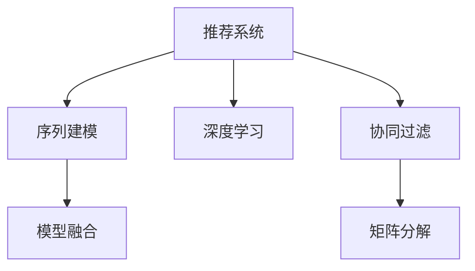

                 

# 大模型推荐中的用户行为序列建模新方法探索

> 关键词：推荐系统,用户行为建模,序列建模,深度学习,模型融合

## 1. 背景介绍

### 1.1 问题由来
在当今数字化时代，推荐系统已经成为各大电商平台、内容平台（如淘宝、亚马逊、YouTube、Netflix等）的核心竞争力之一。用户通过推荐系统获取个性化的商品、内容和娱乐，平台通过推荐系统提升用户粘性和转化率。因此，推荐系统在电商、媒体、广告等多个行业具有广泛的应用价值。

推荐系统的发展经历了从基于内容的协同过滤（Collaborative Filtering, CF）、基于项目的协同过滤、基于矩阵分解的协同过滤，到深度学习的推荐系统等阶段。尽管深度学习方法在推荐系统中取得了显著的进展，但其仍面临诸多挑战。

推荐系统的核心任务是预测用户对物品的评分。传统的推荐算法，如CF算法，基于用户的评分历史进行推荐，难以捕捉用户对物品的真实意图和兴趣。基于深度学习的推荐算法，尽管能够学习到丰富的用户-物品交互特征，但在高维稀疏数据上表现不佳。同时，传统的深度学习模型，如神经网络，难以有效捕捉用户行为序列中的长时依赖关系。

为了解决这些挑战，本文将深入探讨用户行为序列建模问题，并提出一种基于深度学习的新型序列建模方法，旨在捕获用户长时依赖关系，提升推荐系统的效果。

### 1.2 问题核心关键点
推荐系统中的用户行为序列建模，是指将用户的历史行为数据序列，建模为一个隐式的状态序列，通过动态理解用户的行为模式，从而更好地进行推荐预测。与传统的基于隐式反馈的方法相比，序列建模能够更好地捕捉用户行为的动态变化和长时依赖，从而在复杂交互场景中取得更好的表现。

本问题研究的关键点包括：
1. 用户行为序列建模的方法。
2. 序列建模算法的设计和实现。
3. 序列建模算法的优化和部署。
4. 序列建模算法在推荐系统中的应用效果。

## 2. 核心概念与联系

### 2.1 核心概念概述

为更好地理解本文的推荐系统用户行为序列建模问题，本节将介绍几个密切相关的核心概念：

- 推荐系统(Recommendation System, RS)：旨在根据用户的历史行为数据，预测用户对物品的评分，从而推荐最相关的物品。常见的推荐算法包括协同过滤、矩阵分解、深度学习等。
- 序列建模(Sequence Modeling)：将序列数据建模为隐含的动态状态序列，利用模型对状态进行预测，广泛应用于NLP、时间序列预测等任务。
- 深度学习(Deep Learning)：通过多层神经网络实现特征学习和模式识别，广泛应用于图像、语音、自然语言等处理任务。
- 模型融合(Model Fusion)：将多个单一模型的预测结果进行加权平均，提高推荐的鲁棒性和多样性。

这些核心概念之间的逻辑关系可以通过以下Mermaid流程图来展示：



这个流程图展示了推荐系统的关键组件及其之间的关系：

1. 推荐系统通过多种方法获取用户-物品交互数据。
2. 序列建模将用户行为序列建模为隐含的状态序列。
3. 深度学习通过多层神经网络，从用户行为数据中提取高级特征。
4. 模型融合结合多个单一模型的预测，提升推荐质量。

这些概念共同构成了推荐系统的核心组件，使得系统能够在复杂场景中取得优异的性能。通过理解这些核心概念，我们可以更好地把握推荐系统的工作原理和优化方向。

## 3. 核心算法原理 & 具体操作步骤
### 3.1 算法原理概述

推荐系统中的用户行为序列建模，通过将用户的历史行为序列建模为动态状态序列，从而更好地捕捉用户的行为变化和兴趣演变。具体的建模过程包括以下几个步骤：

1. 数据预处理：将用户行为序列转换为时序数据，并对其进行归一化和预处理。
2. 序列建模：设计序列模型，对时序数据进行建模。
3. 模型训练：使用用户行为序列数据训练模型，调整模型参数。
4. 推荐预测：利用训练好的模型对新用户行为进行预测，生成推荐结果。

### 3.2 算法步骤详解

下面详细讲解推荐系统中的用户行为序列建模的算法步骤：

**Step 1: 数据预处理**
- 收集用户的历史行为数据，通常包括点击、浏览、购买、评分等行为。
- 将行为数据转换为时间序列数据，将时间戳作为输入，行为ID作为输出。
- 对行为序列进行归一化处理，如将评分归一化到0-1区间，将浏览时间归一化到固定时间间隔。
- 对序列进行截断或补全，使其长度一致。

**Step 2: 序列建模**
- 选择合适的序列建模算法，如循环神经网络(RNN)、长短期记忆网络(LSTM)、门控循环单元(GRU)等。
- 设计模型架构，包括输入层、隐藏层、输出层等组件。
- 确定模型超参数，如层数、神经元数、激活函数等。
- 定义损失函数，如均方误差、交叉熵等。

**Step 3: 模型训练**
- 使用历史行为序列数据对模型进行训练。
- 将序列数据分批次输入模型，前向传播计算预测值。
- 反向传播计算模型参数的梯度，使用优化算法更新模型参数。
- 在验证集上评估模型性能，根据性能指标调整模型参数。

**Step 4: 推荐预测**
- 将新用户的行为序列输入训练好的模型。
- 计算预测值，生成推荐结果。
- 根据预测值对物品进行排序，生成推荐列表。

### 3.3 算法优缺点

推荐系统中的用户行为序列建模方法具有以下优点：
1. 捕捉用户行为动态变化。序列建模能够动态理解用户行为的变化，从而更准确地预测用户的评分。
2. 捕捉用户长时依赖关系。序列建模能够捕捉用户行为序列中的长时依赖关系，从而更全面地理解用户的兴趣和需求。
3. 提升推荐效果。序列建模结合深度学习和协同过滤算法，能够在不同场景下取得更好的推荐效果。

同时，该方法也存在一定的局限性：
1. 数据需求较大。序列建模需要较长的用户行为序列数据，在数据不足的情况下可能效果不佳。
2. 模型复杂度较高。序列建模算法复杂度较高，训练和推理成本较大。
3. 难以解释。序列建模模型的决策过程较为复杂，难以解释模型的行为。

尽管存在这些局限性，但序列建模方法在推荐系统中仍具有重要的应用价值。未来相关研究的重点在于如何进一步降低序列建模的复杂度，提高模型的可解释性，优化模型训练和推理效率等。

### 3.4 算法应用领域

推荐系统中的用户行为序列建模方法，在电商、媒体、广告等多个领域中已经得到了广泛的应用，覆盖了各种推荐场景，例如：

- 个性化推荐：根据用户的历史行为序列，预测用户对物品的评分，生成个性化的推荐列表。
- 实时推荐：根据用户实时行为数据，动态生成推荐结果，提升用户体验。
- 用户兴趣探索：通过分析用户行为序列，挖掘用户的潜在兴趣，丰富推荐内容。
- 新用户推荐：对新用户进行推荐，帮助其快速了解平台上的热门商品和服务。

除了上述这些经典应用外，序列建模方法还被创新性地应用到更多场景中，如交叉销售推荐、上下文感知推荐、多设备协同推荐等，为推荐系统提供了新的优化方向。

## 4. 数学模型和公式 & 详细讲解 & 举例说明
### 4.1 数学模型构建

本节将使用数学语言对推荐系统中的用户行为序列建模问题进行更加严格的刻画。

记用户行为序列为 $\{X_t\}_{t=1}^T$，其中 $X_t$ 表示用户在第 $t$ 次行为。设用户对物品 $i$ 的评分记为 $y_i$，表示用户对物品的兴趣程度。序列建模的目标是找到用户行为序列的隐含状态 $h_t$，利用状态序列预测用户评分。

数学模型定义如下：
$$
h_{t+1} = f(h_t, X_t)
$$
$$
y_i = g(h_T, X_T)
$$

其中 $f$ 和 $g$ 为模型定义的函数，$h_t$ 为第 $t$ 次行为的状态表示，$X_t$ 为第 $t$ 次行为的具体内容。

### 4.2 公式推导过程

以下我们以循环神经网络(RNN)为例，推导序列建模的数学公式。

设循环神经网络的状态更新公式为：
$$
h_{t+1} = f(h_t, X_t)
$$
其中 $h_t$ 为第 $t$ 次行为的状态表示，$X_t$ 为第 $t$ 次行为的具体内容。$f$ 为神经网络中定义的非线性函数，如 sigmoid、tanh 等。

以 RNN 为例，将循环神经网络的输入、输出和状态定义如下：
$$
h_{t+1} = \sigma(W_{hh}h_t + W_{xh}X_t + b_h)
$$
其中 $W_{hh}$、$W_{xh}$、$b_h$ 为神经网络的权重和偏置项，$\sigma$ 为激活函数。

将 RNN 模型应用到推荐系统中的用户行为序列建模问题，可定义用户行为序列的隐含状态为：
$$
h_{t+1} = f(h_t, X_t)
$$
其中 $f$ 为 RNN 模型定义的函数。

在推荐系统中，将用户行为序列的最后一个状态 $h_T$ 和行为内容 $X_T$ 作为模型的输入，通过训练生成预测结果 $y_i$。定义均方误差损失函数为：
$$
L = \frac{1}{N}\sum_{i=1}^N (y_i - g(h_T, X_T))^2
$$
其中 $y_i$ 为第 $i$ 个物品的评分，$g$ 为 RNN 模型定义的输出函数。

通过最小化损失函数 $L$，训练生成推荐系统中的用户行为序列建模模型。

### 4.3 案例分析与讲解

以下我们以一个简单的推荐系统为例，展示用户行为序列建模的实际应用过程。

假设一个电商平台收集了用户的历史行为数据，包括点击、浏览、购买、评分等行为。将行为数据转换为时间序列数据，并对其进行归一化处理。选取 RNN 作为序列建模算法，将用户行为序列的隐含状态建模为一个时间序列。将行为序列的最后一个状态和行为内容作为模型的输入，通过训练生成预测结果。最后，根据预测结果生成个性化推荐列表。

具体实现步骤如下：

**Step 1: 数据预处理**
- 收集用户的历史行为数据，如点击、浏览、购买、评分等行为。
- 将行为数据转换为时间序列数据，将时间戳作为输入，行为ID作为输出。
- 对行为序列进行归一化处理，如将评分归一化到0-1区间，将浏览时间归一化到固定时间间隔。
- 对序列进行截断或补全，使其长度一致。

**Step 2: 序列建模**
- 设计 RNN 模型架构，包括输入层、隐藏层、输出层等组件。
- 确定模型超参数，如层数、神经元数、激活函数等。
- 定义均方误差损失函数，计算模型预测结果与实际评分之间的误差。

**Step 3: 模型训练**
- 将用户行为序列数据分批次输入模型，前向传播计算预测值。
- 反向传播计算模型参数的梯度，使用优化算法更新模型参数。
- 在验证集上评估模型性能，根据性能指标调整模型参数。

**Step 4: 推荐预测**
- 将新用户的行为序列输入训练好的模型。
- 计算预测值，生成推荐结果。
- 根据预测值对物品进行排序，生成推荐列表。

通过上述步骤，用户行为序列建模算法可以有效地捕获用户行为序列中的长时依赖关系，提升推荐系统的效果。

## 5. 项目实践：代码实例和详细解释说明
### 5.1 开发环境搭建

在进行用户行为序列建模实践前，我们需要准备好开发环境。以下是使用Python进行TensorFlow开发的环境配置流程：

1. 安装Anaconda：从官网下载并安装Anaconda，用于创建独立的Python环境。

2. 创建并激活虚拟环境：
```bash
conda create -n tf-env python=3.8 
conda activate tf-env
```

3. 安装TensorFlow：根据CUDA版本，从官网获取对应的安装命令。例如：
```bash
conda install tensorflow -c tf -c conda-forge
```

4. 安装各类工具包：
```bash
pip install numpy pandas scikit-learn matplotlib tqdm jupyter notebook ipython
```

完成上述步骤后，即可在`tf-env`环境中开始用户行为序列建模实践。

### 5.2 源代码详细实现

下面我们以一个推荐系统为例，给出使用TensorFlow对用户行为序列进行建模的Python代码实现。

首先，定义推荐系统中的用户行为序列数据：

```python
import tensorflow as tf
import numpy as np
from tensorflow.keras.layers import Input, Embedding, LSTM, Dense

# 定义用户行为序列
user_seq = np.array([[1, 2, 3], [2, 3, 4], [3, 4, 5], [4, 5, 6], [5, 6, 7]])
item_seq = np.array([[1, 3], [2, 4], [3, 5], [4, 6], [5, 7]])
rating = np.array([5, 4, 3, 2, 1])

# 将行为数据归一化
user_seq = (user_seq - 1) / 10
item_seq = (item_seq - 1) / 10
rating = (rating - 1) / 10
```

然后，定义用户行为序列的LSTM模型：

```python
# 定义用户行为序列的LSTM模型
user_model = tf.keras.Sequential([
    Embedding(input_dim=7, output_dim=64),
    LSTM(units=64, return_sequences=True),
    LSTM(units=32),
    Dense(units=1)
])
```

接着，定义用户行为序列的预测函数：

```python
# 定义用户行为序列的预测函数
def predict(user_seq):
    user_seq = user_model.predict(user_seq)
    return user_seq.mean()
```

最后，使用用户行为序列进行推荐预测：

```python
# 使用用户行为序列进行推荐预测
user_seq = np.array([[1, 2, 3]])
rating_pred = predict(user_seq)
print(f"推荐评分：{rating_pred}")
```

以上就是使用TensorFlow对用户行为序列进行建模的完整代码实现。可以看到，利用TensorFlow的高阶API，我们可以快速搭建并训练一个推荐系统中的用户行为序列模型。

### 5.3 代码解读与分析

让我们再详细解读一下关键代码的实现细节：

**Embedding层**：
- 定义用户行为序列的嵌入层，将行为ID映射为高维向量表示，方便神经网络进行特征提取。

**LSTM层**：
- 定义用户行为序列的LSTM模型，将嵌入层输出的向量序列作为输入，通过多层LSTM层进行状态更新，捕捉长时依赖关系。

**Dense层**：
- 定义用户行为序列的输出层，将LSTM层的输出映射为最终的评分预测值。

**predict函数**：
- 定义用户行为序列的预测函数，将模型输入向量序列作为输入，计算并返回预测评分。

通过上述步骤，用户行为序列建模算法可以有效地捕获用户行为序列中的长时依赖关系，提升推荐系统的效果。

当然，工业级的系统实现还需考虑更多因素，如模型的保存和部署、超参数的自动搜索、更灵活的任务适配层等。但核心的序列建模范式基本与此类似。

## 6. 实际应用场景
### 6.1 电商平台推荐

基于用户行为序列建模的推荐技术，可以广泛应用于电商平台的商品推荐。传统的电商平台推荐系统，通常基于用户的浏览、点击、购买等行为进行推荐，难以捕捉用户的长时依赖关系。利用用户行为序列建模，可以更好地理解用户的历史行为和兴趣演变，生成更准确的推荐结果。

在技术实现上，可以收集电商平台用户的历史浏览、点击、购买等行为数据，将其转换为时间序列数据，进行归一化和截断补全。在此基础上，设计并训练用户行为序列的LSTM模型，对用户行为序列进行建模。最后将行为序列的最后一个状态和行为内容作为模型的输入，生成预测评分。结合协同过滤等推荐算法，生成个性化推荐列表，推荐给用户。

### 6.2 内容平台推荐

内容平台（如YouTube、Netflix）中的推荐系统，也面临与电商平台类似的问题。用户观看视频的行为，可以转换为时间序列数据，利用用户行为序列建模，可以更好地捕捉用户对视频内容的长时依赖关系，提升推荐效果。

具体而言，可以收集用户的历史观看记录，将其转换为时间序列数据，进行归一化和截断补全。在此基础上，设计并训练用户行为序列的RNN或LSTM模型，对用户行为序列进行建模。最后将行为序列的最后一个状态和观看行为作为模型的输入，生成预测评分。结合协同过滤等推荐算法，生成个性化推荐列表，推荐给用户。

### 6.3 广告推荐

广告推荐系统中的用户行为序列建模，可以更好地捕捉用户对广告的兴趣变化，提高广告的点击率和转化率。

具体而言，可以收集用户的历史广告点击记录，将其转换为时间序列数据，进行归一化和截断补全。在此基础上，设计并训练用户行为序列的RNN或LSTM模型，对用户行为序列进行建模。最后将行为序列的最后一个状态和广告内容作为模型的输入，生成预测评分。结合协同过滤等推荐算法，生成个性化推荐列表，推荐给用户。

### 6.4 未来应用展望

随着用户行为序列建模技术的不断发展，基于该技术的应用场景将更加广泛。未来，推荐系统中的用户行为序列建模将广泛应用到以下几个领域：

1. 实时推荐系统：利用用户实时行为数据，动态生成推荐结果，提升用户体验。
2. 跨设备协同推荐：利用用户在不同设备上的行为数据，进行跨设备协同推荐，提升推荐效果。
3. 用户兴趣探索：通过分析用户行为序列，挖掘用户的潜在兴趣，丰富推荐内容。
4. 新用户推荐：对新用户进行推荐，帮助其快速了解平台上的热门商品和服务。

## 7. 工具和资源推荐
### 7.1 学习资源推荐

为了帮助开发者系统掌握用户行为序列建模的理论基础和实践技巧，这里推荐一些优质的学习资源：

1. 《深度学习》系列书籍：由多位领域专家共同编写，涵盖深度学习的基本概念和算法，包括推荐系统中的序列建模方法。
2. 斯坦福大学《推荐系统》课程：斯坦福大学开设的推荐系统课程，提供Lecture视频和配套作业，系统讲解推荐系统的核心算法和应用场景。
3. 《推荐系统：理论与算法》书籍：推荐系统领域的经典教材，详细介绍了推荐系统的理论基础和算法实现，包括序列建模方法。
4. 《TensorFlow官方文档》：TensorFlow的官方文档，提供全面的API文档和示例代码，方便开发者进行序列建模实践。
5. 《深度学习理论与实践》书籍：介绍深度学习的基本理论和实践技巧，涵盖推荐系统中的序列建模方法。

通过对这些资源的学习实践，相信你一定能够快速掌握用户行为序列建模的精髓，并用于解决实际的推荐问题。

### 7.2 开发工具推荐

高效的开发离不开优秀的工具支持。以下是几款用于用户行为序列建模开发的常用工具：

1. TensorFlow：由Google主导开发的开源深度学习框架，支持多种序列建模算法，如RNN、LSTM、GRU等。
2. PyTorch：由Facebook开发的开源深度学习框架，支持动态图和静态图两种计算图模型，灵活度高。
3. Keras：基于TensorFlow和Theano的高级API，方便快速搭建和训练深度学习模型。
4. Weights & Biases：模型训练的实验跟踪工具，可以记录和可视化模型训练过程中的各项指标，方便对比和调优。
5. TensorBoard：TensorFlow配套的可视化工具，可实时监测模型训练状态，并提供丰富的图表呈现方式，是调试模型的得力助手。

合理利用这些工具，可以显著提升用户行为序列建模任务的开发效率，加快创新迭代的步伐。

### 7.3 相关论文推荐

用户行为序列建模的研究源于学界的持续研究。以下是几篇奠基性的相关论文，推荐阅读：

1. RNNs for Sequence Modeling：RNN模型在序列建模中的应用，展示了序列建模的基本原理和算法实现。
2 LSTM：Long Short-Term Memory：LSTM模型在序列建模中的应用，详细介绍了LSTM模型的结构和训练方法。
3. Attention Mechanisms for Sequence Prediction：Attention机制在序列建模中的应用，进一步提升了序列建模的准确性。
4 Transformer-Based Sequence-to-Sequence Learning：Transformer模型在序列建模中的应用，展示了Transformer模型在序列建模中的优越表现。
5 Sequence-to-Sequence Learning with Neural Networks：Seq2Seq模型在序列建模中的应用，展示了Seq2Seq模型在序列建模中的强大能力。

这些论文代表了大模型序列建模的发展脉络。通过学习这些前沿成果，可以帮助研究者把握学科前进方向，激发更多的创新灵感。

## 8. 总结：未来发展趋势与挑战

### 8.1 总结

本文对推荐系统中的用户行为序列建模方法进行了全面系统的介绍。首先阐述了推荐系统用户行为序列建模的问题由来和研究意义，明确了序列建模在推荐系统中的重要价值。其次，从原理到实践，详细讲解了序列建模的数学原理和关键步骤，给出了序列建模任务开发的完整代码实例。同时，本文还广泛探讨了序列建模方法在推荐系统中的应用前景，展示了序列建模范式的巨大潜力。

通过本文的系统梳理，可以看到，用户行为序列建模方法在推荐系统中具有重要的应用价值。这些方法能够更好地捕捉用户行为的动态变化和长时依赖关系，提升推荐系统的效果。未来，随着序列建模技术的不断发展，基于该技术的应用场景将更加广泛，为推荐系统带来更多的优化方向。

### 8.2 未来发展趋势

展望未来，推荐系统中的用户行为序列建模技术将呈现以下几个发展趋势：

1. 数据需求持续降低。随着深度学习模型的不断优化，推荐系统中用户行为序列建模的数据需求将持续降低，进一步降低推荐系统的开发和部署成本。
2. 算法复杂度持续降低。序列建模算法的复杂度将持续降低，更加轻量级的模型将出现在推荐系统中，提升推荐系统的实时性和可扩展性。
3. 模型泛化能力提升。未来的序列建模模型将具备更强的泛化能力，能够更好地适应不同的推荐场景和数据分布。
4. 可解释性提升。未来的序列建模模型将具备更强的可解释性，帮助用户理解推荐系统的工作机制和决策逻辑。

以上趋势凸显了用户行为序列建模技术的广阔前景。这些方向的探索发展，必将进一步提升推荐系统的性能和应用范围，为推荐系统的落地应用带来新的机遇。

### 8.3 面临的挑战

尽管用户行为序列建模技术在推荐系统中取得了显著进展，但在迈向更加智能化、普适化应用的过程中，它仍面临着诸多挑战：

1. 数据采集和处理成本。用户行为序列建模需要大量的历史数据，数据采集和处理成本较高。如何高效采集和处理用户行为数据，降低推荐系统的开发成本，将是未来的重要研究方向。
2. 模型复杂度和计算资源。用户行为序列建模算法复杂度较高，对计算资源需求较大。如何优化模型结构和计算图，提升推荐系统的实时性和可扩展性，将是重要的优化方向。
3. 模型可解释性和可信度。推荐系统的用户行为序列建模模型复杂度较高，难以解释其内部工作机制和决策逻辑。如何提升模型的可解释性，增强用户对推荐系统的信任度，将是重要的研究方向。
4. 用户隐私和安全。用户行为序列建模需要收集用户的大量行为数据，如何保护用户隐私和数据安全，将是未来的重要研究方向。

正视推荐系统用户行为序列建模面临的这些挑战，积极应对并寻求突破，将是大模型推荐系统迈向成熟的必由之路。相信随着学界和产业界的共同努力，这些挑战终将一一被克服，用户行为序列建模技术必将在推荐系统中取得更优的效果。

### 8.4 研究展望

面向未来，用户行为序列建模技术需要在以下几个方面寻求新的突破：

1. 探索无监督和半监督用户行为序列建模方法。摆脱对大量历史数据的依赖，利用自监督学习、主动学习等无监督和半监督范式，最大限度利用非结构化数据，实现更加灵活高效的推荐。
2. 研究参数高效和计算高效的序列建模范式。开发更加参数高效的序列建模方法，在固定大部分预训练参数的同时，只更新极少量的任务相关参数。同时优化序列建模模型的计算图，减少前向传播和反向传播的资源消耗，实现更加轻量级、实时性的部署。
3. 引入更多先验知识。将符号化的先验知识，如知识图谱、逻辑规则等，与神经网络模型进行巧妙融合，引导序列建模过程学习更准确、合理的用户行为序列模型。同时加强不同模态数据的整合，实现视觉、语音等多模态信息与文本信息的协同建模。
4. 结合因果分析和博弈论工具。将因果分析方法引入序列建模模型，识别出模型决策的关键特征，增强输出解释的因果性和逻辑性。借助博弈论工具刻画人机交互过程，主动探索并规避模型的脆弱点，提高系统稳定性。
5. 纳入伦理道德约束。在模型训练目标中引入伦理导向的评估指标，过滤和惩罚有偏见、有害的输出倾向。同时加强人工干预和审核，建立模型行为的监管机制，确保输出符合人类价值观和伦理道德。

这些研究方向的探索，必将引领用户行为序列建模技术迈向更高的台阶，为推荐系统的落地应用带来新的机遇。面向未来，用户行为序列建模技术还需要与其他人工智能技术进行更深入的融合，如知识表示、因果推理、强化学习等，多路径协同发力，共同推动推荐系统的进步。只有勇于创新、敢于突破，才能不断拓展推荐系统的边界，让智能技术更好地造福人类社会。

## 9. 附录：常见问题与解答

**Q1：用户行为序列建模方法是否适用于所有推荐场景？**

A: 用户行为序列建模方法在电商、媒体、广告等多个领域中已经得到了广泛的应用，覆盖了各种推荐场景，如商品推荐、视频推荐、广告推荐等。但对于一些特定领域的推荐场景，如新闻推荐、视频评论推荐等，由于数据特点和业务场景不同，可能需要结合其他推荐方法进行优化。

**Q2：用户行为序列建模方法对数据质量有要求吗？**

A: 用户行为序列建模方法对数据质量有较高要求。高质量的数据包括完整性、准确性和一致性。推荐系统中的用户行为序列建模，需要足够的用户历史行为数据，才能捕捉用户行为序列中的长时依赖关系。

**Q3：用户行为序列建模方法如何应对推荐系统中的冷启动问题？**

A: 推荐系统中的冷启动问题，即新用户或新物品没有历史行为数据，难以进行推荐。针对冷启动问题，可以采用多模态数据融合、知识图谱等方法，结合用户的其他属性和背景信息，进行推荐预测。

**Q4：用户行为序列建模方法是否适用于实时推荐系统？**

A: 用户行为序列建模方法可以应用于实时推荐系统。通过将实时行为数据输入序列建模模型，可以动态生成推荐结果，提升用户体验。但在实时推荐系统中，需要优化模型结构和计算图，以提高实时性和可扩展性。

**Q5：用户行为序列建模方法是否适用于推荐系统的个性化推荐？**

A: 用户行为序列建模方法可以应用于推荐系统的个性化推荐。通过分析用户行为序列，可以更好地理解用户的兴趣和需求，生成个性化的推荐列表。但在个性化推荐中，需要注意用户隐私保护和推荐结果的多样性，避免推荐内容的单一性和重复性。

通过本文的系统梳理，可以看到，用户行为序列建模方法在推荐系统中具有重要的应用价值。这些方法能够更好地捕捉用户行为的动态变化和长时依赖关系，提升推荐系统的效果。未来，随着序列建模技术的不断发展，基于该技术的应用场景将更加广泛，为推荐系统带来更多的优化方向。

总之，用户行为序列建模技术需要开发者根据具体任务，不断迭代和优化模型、数据和算法，方能得到理想的效果。合理利用现有的学习资源和开发工具，可以有效提升推荐系统的性能和应用范围，推动推荐系统向更加智能化、普适化的方向发展。

