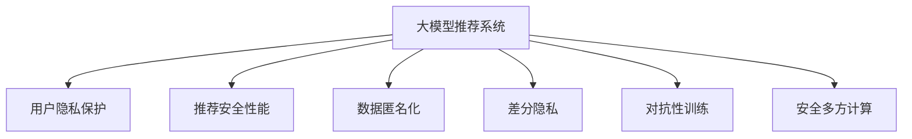

                 

# 大模型推荐中的用户隐私与安全问题思考

## 1. 背景介绍

### 1.1 问题由来
随着人工智能技术的飞速发展，尤其是深度学习和大模型的兴起，个性化推荐系统在电商、社交媒体、新闻聚合等领域得到了广泛应用。这些系统通过学习用户历史行为、兴趣偏好，自动为用户推荐物品、内容，极大地提升了用户体验和运营效率。

然而，伴随推荐系统的普及，用户隐私和安全问题也日益凸显。用户数据常常包含敏感个人信息，如浏览记录、购买历史、位置信息等。如何在保障用户隐私的前提下，提供优质的推荐服务，成为大模型推荐系统面临的重要挑战。

### 1.2 问题核心关键点
本文聚焦于大模型推荐系统中的隐私保护和安全性问题，探讨如何平衡用户隐私保护和推荐效果，构建安全可靠的推荐系统。核心问题包括：

1. **用户隐私保护**：如何防止用户隐私被泄露，保障用户数据不被滥用。
2. **推荐安全性能**：如何保障推荐模型的鲁棒性，避免推荐模型受到恶意攻击。
3. **用户隐私意识**：如何提升用户对数据隐私保护的认识，增强用户数据自我管理能力。

这些问题不仅关系到用户个人权益，还直接影响到推荐系统的公信力和长期发展。因此，在设计和构建大模型推荐系统时，必须将隐私保护和安全性纳入核心考虑。

## 2. 核心概念与联系

### 2.1 核心概念概述

为更好地理解大模型推荐系统中的隐私保护和安全问题，本节将介绍几个密切相关的核心概念：

- **大模型推荐系统**：以深度学习为基础，通过大规模预训练模型和个性化微调技术，为用户推荐物品、内容的技术系统。常见的大模型包括BERT、GPT、DenseNet等。

- **用户隐私保护**：指在数据收集、处理、存储、传输等各个环节，采取有效措施，防止用户隐私泄露或被滥用的技术手段。

- **推荐安全性能**：指在对抗性攻击、恶意数据注入等威胁下，推荐系统仍能提供稳定、可靠的推荐结果。

- **数据匿名化**：将原始数据转换为无法识别个体身份的形式，防止用户隐私泄露。

- **差分隐私**：通过加入噪声，使得个体数据的变化对总体数据的分布影响极小，保障隐私的同时保障数据有用性。

- **对抗性训练**：在模型训练中加入对抗样本，提升模型对攻击的鲁棒性，确保推荐结果的可靠性。

- **安全多方计算**：在多参与方间，通过安全协议实现数据计算，不暴露任何一方输入数据，保障数据隐私。

这些核心概念之间的逻辑关系可以通过以下Mermaid流程图来展示：



这个流程图展示了大模型推荐系统的核心概念及其之间的关系：

1. 大模型推荐系统通过收集用户数据进行推荐，涉及用户隐私保护问题。
2. 推荐系统需保障推荐安全性能，防止攻击影响推荐结果。
3. 数据匿名化和差分隐私技术可用于保护用户隐私。
4. 对抗性训练和安全多方计算可用于保障推荐系统的安全性。

## 3. 核心算法原理 & 具体操作步骤
### 3.1 算法原理概述

大模型推荐系统的核心思想是通过深度学习模型学习用户行为数据，预测用户对物品的偏好。其中，隐私保护和安全性问题是构建系统时需要重点考虑的方面。

基于大模型的推荐算法通常包括以下几个关键步骤：

1. **数据预处理**：收集用户历史行为数据，进行清洗、归一化、特征提取等预处理。
2. **模型训练**：使用大模型进行个性化微调，学习用户偏好和物品特征。
3. **推荐计算**：在给定用户输入时，使用训练好的模型计算推荐结果。

隐私保护和安全性问题通常在前两步中引入，通过数据处理和模型训练阶段的优化，构建安全可靠的推荐系统。

### 3.2 算法步骤详解

本节将详细介绍大模型推荐系统中的隐私保护和安全性技术。

**Step 1: 数据收集与预处理**

1. **数据收集**：收集用户历史行为数据，如浏览记录、购买历史、评分信息等。
2. **数据清洗**：去除无效数据、噪声数据和异常值。
3. **数据归一化**：将不同量级的数据进行标准化处理，防止模型偏向数据量大的样本。
4. **特征工程**：提取、组合、降维用户行为特征，增强模型的表达能力。

**Step 2: 隐私保护技术**

1. **数据匿名化**：
   - 去标识化(De-identification)：通过匿名化技术，去除数据中的个人标识信息，如姓名、身份证号等。
   - 伪匿名化(Pseudonymization)：将个人标识信息替换为随机生成的伪匿名标识符。
   - 数据泛化(Generalization)：将数据泛化为更广泛的用户群，隐藏个体特征。
   
2. **差分隐私**：
   - 添加噪声：在查询或训练过程中，加入高斯噪声、拉普拉斯噪声等，降低个体数据对整体分布的影响。
   - 合成数据：使用合成数据集进行训练，生成包含隐私保护的训练样本。
   - 差分隐私预算(Differential Privacy Budget)：控制隐私损失，确保个体数据的变化对模型整体分布影响有限。

**Step 3: 模型训练**

1. **参数高效微调**：在固定大部分预训练参数的情况下，只微调顶层参数，减少需优化的参数量，避免过拟合。
2. **对抗性训练**：在训练中加入对抗样本，提高模型的鲁棒性，防止对抗攻击。
3. **模型监控**：在模型训练过程中，实时监控模型性能和隐私指标，及时发现异常情况。

**Step 4: 推荐计算**

1. **推荐生成**：在给定用户输入时，使用训练好的模型计算推荐结果。
2. **结果验证**：通过A/B测试、用户反馈等手段，验证推荐结果的有效性和安全性。
3. **结果发布**：根据平台需求，选择合适的方式发布推荐结果，如API、网页、应用等。

### 3.3 算法优缺点

大模型推荐系统中的隐私保护和安全性技术具有以下优点：

1. **隐私保护**：通过数据匿名化和差分隐私等技术，有效保护用户隐私，防止数据泄露和滥用。
2. **安全性**：通过对抗性训练和安全多方计算等技术，提升模型的鲁棒性，保障推荐结果的安全性。
3. **性能优化**：通过参数高效微调，减少需优化的参数量，提升模型训练和推理效率。

同时，这些技术也存在一些局限性：

1. **数据质量要求高**：数据匿名化和差分隐私等技术需要高质量的数据支持，否则难以发挥效果。
2. **计算资源消耗大**：对抗性训练和安全多方计算等技术，需要大量的计算资源，可能影响模型训练效率。
3. **隐私保护与推荐效果权衡**：如何在隐私保护和推荐效果之间取得平衡，是技术应用中的关键问题。

尽管存在这些局限性，但总体而言，隐私保护和安全性技术在大模型推荐系统中的应用，对于保障用户隐私、提升推荐系统的可信度和可靠性具有重要意义。

### 3.4 算法应用领域

基于大模型的推荐系统，已经在电商推荐、社交媒体推荐、新闻推荐等多个领域得到了广泛应用，成为推荐技术落地的重要手段。同时，隐私保护和安全性技术也在金融、医疗、政务等领域得到关注，如：

1. **电商推荐**：基于用户历史行为数据，为用户推荐商品、优惠信息。通过隐私保护技术，保障用户数据安全。
2. **社交媒体推荐**：根据用户行为和兴趣，为用户推荐内容、好友。通过对抗性训练，防止恶意信息传播。
3. **新闻推荐**：为用户推荐新闻、专题。通过差分隐私，保障用户数据隐私。
4. **金融推荐**：为用户推荐理财产品、投资策略。通过安全多方计算，保障数据隐私和安全性。
5. **医疗推荐**：根据用户健康数据，推荐医疗服务、药品。通过数据匿名化，防止医疗数据泄露。

## 4. 数学模型和公式 & 详细讲解 & 举例说明

### 4.1 数学模型构建

在大模型推荐系统中，隐私保护和安全性问题通常通过以下数学模型进行建模：

- **用户隐私保护模型**：
  - 去标识化模型：$D_{\text{ anonymized}} = f(D)$，其中 $D$ 为原始数据集，$f$ 为去标识化函数。
  - 差分隐私模型：$Q_{\text{ priv}} = f(D_{\text{ privatized}})$，其中 $D_{\text{ privatized}}$ 为差分隐私化后的数据集。

- **推荐安全性能模型**：
  - 对抗性训练模型：$L_{\text{ adversarial}} = \mathbb{E}_{\epsilon} [\mathbb{E}_{(x,y)} [\mathbb{E}_{\delta} [\ell(f(x+\delta), y)]]]$，其中 $\delta$ 为对抗噪声，$\ell$ 为损失函数。
  - 安全多方计算模型：$C_{\text{ secure}} = f(x_1, x_2, ..., x_n)$，其中 $x_i$ 为各方输入数据。

### 4.2 公式推导过程

以下我们以差分隐私技术为例，推导差分隐私保护模型的关键公式。

假设原始数据集为 $D = \{x_1, x_2, ..., x_n\}$，其中 $x_i = (x_{i1}, x_{i2}, ..., x_{ik})$ 为 $i$ 个体的 $k$ 维特征向量。差分隐私化的目标是：在加入噪声后，个体数据的微小变化对整体分布的影响极小。

差分隐私化过程如下：
1. **计算敏感度**：$\Delta \ell = \max_x |\ell(x, \hat{y}) - \ell(x', \hat{y})|$，其中 $x$ 和 $x'$ 为两个相邻个体，$\hat{y}$ 为预测结果。
2. **添加噪声**：在原始模型输出上加入拉普拉斯噪声 $\epsilon \sim \text{Laplace}(0, \Delta \ell)$，得到差分隐私化输出 $\tilde{y} = f(x) + \epsilon$。

推导后的差分隐私化公式为：
$$
\mathcal{L}_{\text{ privatized}} = \mathbb{E}_{\epsilon} [\ell(f(x), y)] + \Delta \ell \cdot |\epsilon|
$$

其中 $\Delta \ell$ 为敏感度，$\epsilon$ 为拉普拉斯噪声。通过控制噪声强度，可以控制隐私损失。

### 4.3 案例分析与讲解

以下我们以电商推荐系统为例，探讨如何在推荐系统中引入隐私保护和安全性技术。

假设电商系统收集了用户的历史购买记录和浏览记录，并希望通过这些数据为用户推荐商品。假设原始数据集为 $D = \{(x_i, y_i)\}_{i=1}^N$，其中 $x_i$ 为用户的浏览记录和购买历史，$y_i$ 为用户对物品的评分或购买决策。

**隐私保护技术应用**：
1. **数据匿名化**：
   - 去标识化：删除用户的真实姓名、身份证号等个人标识信息。
   - 伪匿名化：将用户的真实姓名替换为随机生成的伪匿名标识符。
2. **差分隐私**：
   - 加入拉普拉斯噪声：在查询或训练过程中，加入拉普拉斯噪声。
   - 生成合成数据：使用合成数据集进行训练，确保数据匿名化。

**安全性技术应用**：
1. **对抗性训练**：
   - 生成对抗样本：使用对抗生成网络生成对抗样本，注入模型训练中。
   - 提升模型鲁棒性：使用对抗性训练提升模型的鲁棒性，防止攻击。
2. **安全多方计算**：
   - 多方数据聚合：使用安全多方计算协议，多方聚合数据，防止单方数据泄露。

通过这些隐私保护和安全性技术，电商推荐系统可以在保障用户隐私的前提下，为用户提供高质量的推荐服务。

## 5. 项目实践：代码实例和详细解释说明

### 5.1 开发环境搭建

在进行推荐系统开发前，我们需要准备好开发环境。以下是使用Python进行TensorFlow和PyTorch开发的环境配置流程：

1. 安装Anaconda：从官网下载并安装Anaconda，用于创建独立的Python环境。

2. 创建并激活虚拟环境：
```bash
conda create -n tf-env python=3.8 
conda activate tf-env
```

3. 安装TensorFlow和PyTorch：
```bash
pip install tensorflow==2.6
pip install torch torchvision torchaudio cudatoolkit=11.1 -c pytorch -c conda-forge
```

4. 安装相关库：
```bash
pip install pandas numpy scikit-learn sklearn
```

5. 安装TensorBoard：
```bash
pip install tensorboard
```

完成上述步骤后，即可在`tf-env`环境中开始推荐系统开发。

### 5.2 源代码详细实现

以下是使用TensorFlow实现电商推荐系统的示例代码。

**数据处理**

```python
import pandas as pd
import tensorflow as tf

# 读取原始数据
data = pd.read_csv('user_behavior.csv')

# 数据清洗
data = data.dropna()

# 特征提取
features = data[['item_id', 'user_id', 'timestamp']]
labels = data['purchase']
```

**模型训练**

```python
# 划分训练集和验证集
train_ratio = 0.8
train_data = features.sample(frac=train_ratio)
valid_data = features.drop(train_data.index)

# 构建模型
model = tf.keras.Sequential([
    tf.keras.layers.Dense(64, activation='relu'),
    tf.keras.layers.Dense(1, activation='sigmoid')
])

# 定义损失函数
loss_fn = tf.keras.losses.BinaryCrossentropy()

# 定义优化器
optimizer = tf.keras.optimizers.Adam()

# 编译模型
model.compile(optimizer=optimizer, loss=loss_fn, metrics=['accuracy'])

# 训练模型
model.fit(train_data, labels, epochs=10, validation_data=(valid_data, labels))
```

**推荐计算**

```python
# 加载模型
model.load_weights('model.h5')

# 推荐计算
def recommend(user_id, item_id):
    # 构造输入数据
    user_data = features[features['user_id'] == user_id]
    item_data = features[features['item_id'] == item_id]
    
    # 计算预测值
    prediction = model.predict([[user_data.iloc[0], item_data.iloc[0]]])[0]
    
    # 返回推荐结果
    return prediction
```

### 5.3 代码解读与分析

让我们再详细解读一下关键代码的实现细节：

**数据处理**

1. **数据读取**：使用Pandas库读取原始数据集，并进行初步清洗，去除无效数据。
2. **特征提取**：将用户行为数据提取为特征向量，使用ID进行编码。

**模型训练**

1. **数据划分**：将数据集划分为训练集和验证集，采用抽样方式。
2. **模型构建**：使用Sequential模型构建简单的多层感知器，输出层使用sigmoid激活函数。
3. **损失函数**：定义二分类交叉熵损失函数。
4. **优化器**：使用Adam优化器进行模型训练。
5. **模型编译**：编译模型，指定优化器和损失函数。
6. **模型训练**：使用训练集进行模型训练，并在验证集上进行验证。

**推荐计算**

1. **模型加载**：从保存的文件中加载模型权重。
2. **推荐生成**：根据用户ID和物品ID，构造输入数据，计算预测结果。

代码实现了简单的电商推荐系统，通过数据预处理和模型训练，为用户推荐了商品。需要注意的是，实际应用中还需要引入隐私保护和安全性技术，保障用户数据安全。

## 6. 实际应用场景

### 6.1 智能推荐系统

基于大模型的推荐系统已经在电商、社交媒体、新闻聚合等领域得到了广泛应用。具体场景包括：

- **电商推荐**：根据用户历史购买和浏览行为，推荐商品、优惠信息。
- **社交媒体推荐**：根据用户兴趣和行为，推荐内容、好友。
- **新闻推荐**：根据用户阅读历史，推荐新闻、专题。

这些推荐系统都需要在保障用户隐私的前提下，提供高质量的推荐服务。

### 6.2 金融推荐系统

金融行业对用户数据隐私和安全有更高的要求。基于大模型的金融推荐系统需要保障用户数据隐私，防止数据泄露和滥用。

具体场景包括：
- **理财产品推荐**：根据用户财务状况和投资偏好，推荐理财产品。
- **投资策略推荐**：根据用户历史交易记录，推荐投资策略。

这些系统需要引入隐私保护和安全性技术，保障用户数据安全，防止金融欺诈和恶意攻击。

### 6.3 医疗推荐系统

医疗数据包含大量敏感信息，如病历记录、健康数据等。基于大模型的医疗推荐系统需要确保数据隐私和安全，防止数据泄露和滥用。

具体场景包括：
- **医疗服务推荐**：根据患者历史就诊记录，推荐医疗服务。
- **药品推荐**：根据患者健康数据，推荐药品。

这些系统需要引入隐私保护和安全性技术，保障患者数据隐私，防止医疗数据泄露。

## 7. 工具和资源推荐

### 7.1 学习资源推荐

为了帮助开发者系统掌握大模型推荐系统中的隐私保护和安全技术，这里推荐一些优质的学习资源：

1. **《深度学习基础》课程**：斯坦福大学开设的深度学习入门课程，涵盖深度学习基础和推荐系统基础，是入门推荐系统的良好起点。
2. **《数据科学入门》课程**：Coursera上的数据科学入门课程，涵盖数据收集、处理、分析等基本技术，是推荐系统开发的基础。
3. **《推荐系统实践》书籍**：推荐系统领域的经典书籍，涵盖推荐系统理论、算法、实践等内容，适合深入学习。
4. **《差分隐私理论与实践》书籍**：差分隐私领域的经典书籍，涵盖差分隐私理论、算法、应用等内容，是隐私保护技术的参考。

通过这些资源的学习实践，相信你一定能够掌握大模型推荐系统中的隐私保护和安全技术的精髓，并用于解决实际的推荐系统问题。

### 7.2 开发工具推荐

高效的开发离不开优秀的工具支持。以下是几款用于大模型推荐系统开发的常用工具：

1. **TensorFlow**：基于Python的开源深度学习框架，适合大规模深度学习模型的训练和推理。
2. **PyTorch**：基于Python的开源深度学习框架，灵活性高，适合快速迭代研究。
3. **Pandas**：数据处理和分析库，适合数据清洗和特征工程。
4. **TensorBoard**：TensorFlow配套的可视化工具，可实时监测模型训练状态，帮助调试模型。
5. **Keras**：高层次深度学习框架，适合快速构建和训练模型。

合理利用这些工具，可以显著提升推荐系统开发效率，加快创新迭代的步伐。

### 7.3 相关论文推荐

大模型推荐系统中的隐私保护和安全性问题得到了广泛研究。以下是几篇奠基性的相关论文，推荐阅读：

1. **《深度学习中的隐私保护技术》**：介绍深度学习中的隐私保护技术，包括差分隐私、数据泛化等内容。
2. **《对抗性训练在推荐系统中的应用》**：研究对抗性训练在推荐系统中的效果，提升模型的鲁棒性。
3. **《安全多方计算在推荐系统中的应用》**：探讨安全多方计算在推荐系统中的应用，保障数据隐私和安全。
4. **《差分隐私在推荐系统中的应用》**：研究差分隐私在推荐系统中的应用，保障用户隐私。

这些论文代表了大模型推荐系统中的隐私保护和安全技术的发展脉络。通过学习这些前沿成果，可以帮助研究者把握学科前进方向，激发更多的创新灵感。

## 8. 总结：未来发展趋势与挑战

### 8.1 总结

本文对大模型推荐系统中的隐私保护和安全性问题进行了全面系统的介绍。首先阐述了隐私保护和安全性问题的重要性和研究背景，明确了隐私保护和安全性在推荐系统中的关键地位。其次，从原理到实践，详细讲解了隐私保护和安全性技术的应用场景和实现方法，给出了推荐系统开发的完整代码实例。同时，本文还广泛探讨了推荐系统在电商、金融、医疗等多个行业领域的应用前景，展示了推荐系统的广阔应用空间。

通过本文的系统梳理，可以看到，大模型推荐系统中的隐私保护和安全性技术正在成为推荐系统的重要保障，极大地提升了推荐系统的公信力和用户体验。未来，伴随隐私保护和安全性技术的不断发展，推荐系统必将在更多领域得到应用，为人工智能技术落地应用提供新的突破。

### 8.2 未来发展趋势

展望未来，大模型推荐系统中的隐私保护和安全性技术将呈现以下几个发展趋势：

1. **隐私保护技术创新**：隐私保护技术将不断创新，涵盖差分隐私、安全多方计算、联邦学习等更多方向，提升隐私保护效果。
2. **安全性技术演进**：对抗性训练、安全多方计算等技术将不断演进，提升推荐系统的鲁棒性和安全性。
3. **隐私保护与推荐效果融合**：隐私保护技术与推荐效果将更加紧密融合，通过隐私保护技术提升推荐系统性能。
4. **多模态隐私保护**：推荐系统将融合视觉、语音、文字等多种模态数据，提升隐私保护和推荐效果。
5. **隐私保护与业务价值融合**：隐私保护技术将与业务价值更加紧密融合，提升用户信任和平台竞争力。

这些趋势将推动大模型推荐系统向更高层次发展，为推荐系统应用提供更坚实的技术保障。

### 8.3 面临的挑战

尽管大模型推荐系统中的隐私保护和安全性技术已经取得了显著进展，但在实际应用中仍面临诸多挑战：

1. **隐私保护与推荐效果平衡**：如何在保障隐私保护的同时，提供高质量的推荐服务，是技术应用中的关键问题。
2. **计算资源消耗大**：隐私保护和安全性技术需要大量计算资源，可能影响推荐系统性能。
3. **隐私保护技术复杂**：隐私保护技术如差分隐私、安全多方计算等较为复杂，难以广泛应用。
4. **隐私保护意识薄弱**：用户对隐私保护和数据安全的认识不足，难以有效配合推荐系统进行隐私保护。

尽管存在这些挑战，但总体而言，隐私保护和安全性技术在大模型推荐系统中的应用，对于保障用户隐私、提升推荐系统的可信度和可靠性具有重要意义。

### 8.4 研究展望

面对大模型推荐系统中的隐私保护和安全性挑战，未来的研究需要在以下几个方面寻求新的突破：

1. **隐私保护技术优化**：研究如何通过优化隐私保护技术，提升隐私保护效果，降低计算资源消耗。
2. **隐私保护技术融合**：研究如何将隐私保护技术与其他AI技术进行融合，提升推荐系统性能。
3. **隐私保护意识提升**：研究如何提升用户隐私保护意识，增强用户数据自我管理能力。
4. **隐私保护技术标准化**：研究制定隐私保护技术标准，推动隐私保护技术普及应用。

这些研究方向将推动大模型推荐系统向更加智能、安全、可靠的方向发展，为推荐系统应用提供新的突破。

## 9. 附录：常见问题与解答

**Q1：大模型推荐系统中的隐私保护和安全性问题如何解决？**

A: 大模型推荐系统中的隐私保护和安全性问题，通常通过以下技术手段解决：

1. **数据匿名化**：将原始数据转换为无法识别个体身份的形式，防止用户隐私泄露。
2. **差分隐私**：在查询或训练过程中加入噪声，降低个体数据对整体分布的影响。
3. **对抗性训练**：在训练中加入对抗样本，提升模型的鲁棒性，防止攻击。
4. **安全多方计算**：在多参与方间，通过安全协议实现数据计算，不暴露任何一方输入数据。

这些技术手段在推荐系统中得到了广泛应用，保障了用户数据隐私和推荐系统安全性。

**Q2：大模型推荐系统中如何保障推荐结果的准确性和安全性？**

A: 大模型推荐系统中保障推荐结果的准确性和安全性，需要从以下几个方面考虑：

1. **数据质量**：保障原始数据的质量和完整性，减少噪声和异常值的影响。
2. **模型鲁棒性**：通过对抗性训练和安全多方计算等技术，提升模型的鲁棒性，防止攻击。
3. **隐私保护**：通过数据匿名化和差分隐私等技术，保障用户数据隐私，防止数据泄露和滥用。
4. **推荐计算**：通过A/B测试、用户反馈等手段，验证推荐结果的有效性和安全性。

这些技术手段可以相互结合，共同保障推荐结果的准确性和安全性。

**Q3：大模型推荐系统中的隐私保护和安全性问题有哪些具体措施？**

A: 大模型推荐系统中的隐私保护和安全性问题，可以通过以下具体措施解决：

1. **数据去标识化**：删除或替换用户的个人标识信息，防止数据泄露。
2. **数据泛化**：将数据泛化为更广泛的用户群，隐藏个体特征。
3. **差分隐私预算**：控制隐私损失，确保个体数据的变化对模型整体分布影响有限。
4. **对抗性训练**：生成对抗样本，提升模型的鲁棒性。
5. **安全多方计算**：使用安全协议，多方聚合数据，防止单方数据泄露。

这些措施在推荐系统中得到了广泛应用，保障了用户数据隐私和推荐系统安全性。

**Q4：大模型推荐系统中如何处理用户隐私保护和推荐效果之间的矛盾？**

A: 大模型推荐系统中，用户隐私保护和推荐效果之间存在矛盾，通常通过以下方法处理：

1. **隐私预算优化**：在差分隐私中，通过优化隐私预算，平衡隐私保护和推荐效果。
2. **数据泛化**：将数据泛化为更广泛的用户群，隐藏个体特征，减少隐私损失。
3. **对抗性训练**：通过对抗性训练提升模型鲁棒性，减少对抗攻击的影响。
4. **数据采样**：使用合成数据集进行训练，减少原始数据对隐私保护的影响。

这些方法可以相互结合，综合处理隐私保护和推荐效果之间的矛盾，保障用户隐私的同时提供高质量的推荐服务。

**Q5：大模型推荐系统中如何实现隐私保护与业务价值融合？**

A: 大模型推荐系统中，隐私保护与业务价值融合，可以通过以下方法实现：

1. **隐私保护技术创新**：研究如何通过优化隐私保护技术，提升隐私保护效果，降低计算资源消耗。
2. **业务价值引导**：在推荐系统中引入业务价值导向的指标，优化推荐效果。
3. **用户隐私意识提升**：提升用户对隐私保护的认识，增强用户数据自我管理能力。
4. **隐私保护技术标准化**：研究制定隐私保护技术标准，推动隐私保护技术普及应用。

这些方法可以相互结合，提升隐私保护与业务价值的融合度，保障用户隐私的同时提升平台竞争力。

---

作者：禅与计算机程序设计艺术 / Zen and the Art of Computer Programming

