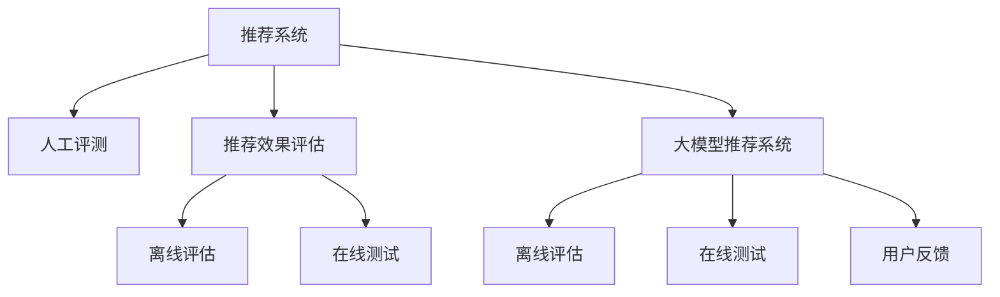

                 

# 大模型推荐效果的人工评测与分析方法探讨

> 关键词：推荐系统,人工评测,推荐效果评估,推荐模型,离线评估,在线测试,深度学习,大模型,推荐算法

## 1. 背景介绍

### 1.1 问题由来
随着互联网技术的快速发展，推荐系统已广泛渗透到电子商务、社交网络、视频平台等多个领域。推荐系统的核心目标是帮助用户在海量信息中快速找到所需内容，提高用户体验和平台活跃度。推荐算法主要基于用户行为数据和物品属性信息，运用机器学习、深度学习等技术实现个性化推荐。

近年来，随着深度学习大模型的兴起，推荐系统开始引入大模型技术进行推荐。相较于传统推荐算法，大模型推荐系统能够更充分地利用用户行为和物品属性，学习更复杂的用户兴趣表达和物品关联关系，从而实现更精准、更具个性化的推荐效果。

但大模型推荐系统面临的主要问题在于，如何准确评估其推荐效果，并基于评估结果进行优化改进。目前推荐系统的主要评估方法包括离线评估和在线测试，但由于模型规模和复杂性的提升，传统的评估方法面临诸多挑战，亟需引入新的评估手段。

### 1.2 问题核心关键点
大模型推荐系统的人工评测与分析方法，关键点在于如何设计有效的评测指标，构建科学的评测方法，以及如何利用人工评估结果指导模型优化。人工评测作为传统的推荐系统评估方式，主要依据用户反馈和专家判断，在处理模型复杂性和用户多样性方面具有独特优势，能够提供比自动化评估更深入的见解。

本文将深入探讨大模型推荐系统的人工评测与分析方法，通过理论与实践相结合的方式，提出针对推荐模型效果的全面、科学的评估策略，为模型优化提供有力依据。

## 2. 核心概念与联系

### 2.1 核心概念概述

为更好地理解人工评测与分析方法在大模型推荐系统中的应用，本节将介绍几个密切相关的核心概念：

- 推荐系统(Recommendation System)：通过分析用户行为和物品属性，推荐用户可能感兴趣的产品、服务或内容。
- 人工评测(Human Evaluation)：指通过人工收集用户反馈、专家判断等方法，评估推荐系统的性能和效果。
- 推荐效果评估(Recommendation Effect Evaluation)：评估推荐系统的性能指标，包括准确率、召回率、用户满意度等。
- 大模型推荐系统(Large Model-based Recommendation System)：基于深度学习大模型进行个性化推荐的系统。
- 离线评估(Offline Evaluation)：利用历史数据和标签信息评估推荐系统性能。
- 在线测试(Online A/B Testing)：通过实际用户行为数据评估推荐系统性能。
- 用户反馈(User Feedback)：用户对推荐结果的满意度、点击率等行为数据。

这些核心概念之间的逻辑关系可以通过以下Mermaid流程图来展示：



这个流程图展示了大模型推荐系统的核心概念及其之间的关系：

1. 推荐系统通过分析用户行为和物品属性，实现个性化推荐。
2. 人工评测方法通过用户反馈、专家判断等手段，评估推荐系统的性能和效果。
3. 推荐效果评估指标包括准确率、召回率、用户满意度等，用于衡量推荐系统的质量。
4. 大模型推荐系统利用深度学习大模型进行推荐，能够在处理复杂数据和个性化需求方面表现优异。
5. 离线评估和在线测试方法用于客观评估推荐系统的性能，人工评测和用户反馈则用于更深入的主观评价。

这些概念共同构成了大模型推荐系统的评估框架，帮助开发者构建高效、准确的推荐系统。

## 3. 核心算法原理 & 具体操作步骤
### 3.1 算法原理概述

大模型推荐系统的人工评测与分析方法，本质上是一个多维度的系统性能评估过程。其核心思想是：利用用户反馈、专家判断等手段，结合离线评估和在线测试等客观数据，全面评估推荐模型的效果，并根据评估结果进行模型优化。

形式化地，假设推荐系统推荐的数据为 $D=\{(x_i,y_i)\}_{i=1}^N$，其中 $x_i$ 表示用户的历史行为数据，$y_i$ 表示推荐的物品。定义推荐效果评估指标 $\mathcal{M}(D)$，表示推荐系统的性能。人工评测和用户反馈则可以转化为对 $\mathcal{M}(D)$ 的打分或排名，用于指导模型优化。

### 3.2 算法步骤详解

大模型推荐系统的人工评测与分析方法一般包括以下几个关键步骤：

**Step 1: 数据准备**
- 收集推荐系统的用户行为数据，包括历史浏览、点击、评分等行为数据。
- 收集专家对推荐系统性能的打分或排名，作为人工评测的参考。
- 获取推荐系统的离线评估指标，如准确率、召回率、F1分数等。
- 使用在线测试数据，评估推荐系统在实际用户行为下的性能。

**Step 2: 构建评测指标**
- 定义推荐系统的性能指标，如准确率、召回率、F1分数、用户满意度等。
- 选择合理的离线评估指标，如点对点精度、平均绝对误差、均方误差等。
- 设计合适的在线测试指标，如点击率、转化率、留存率等。

**Step 3: 人工评测设计**
- 设计用户反馈调查问卷，涵盖推荐系统的多方面性能。
- 设计专家打分体系，涵盖离线评估和在线测试的多个维度。
- 确定人工评测的评分规则，如排序一致性、偏好一致性等。
- 设置人工评测的实验流程，包括样本选择、测试顺序、评分方式等。

**Step 4: 结果分析和优化**
- 综合人工评测结果和客观评估指标，分析推荐系统的优缺点。
- 确定影响推荐系统性能的关键因素，如数据质量、模型参数、用户行为等。
- 根据分析结果，调整推荐模型的参数设置和训练策略。
- 优化推荐系统的特征工程和推荐算法，提升推荐效果。

**Step 5: 结果验证和部署**
- 使用新一轮的离线评估和在线测试数据，验证优化效果。
- 部署优化后的推荐系统，监控实际推荐效果。
- 持续收集用户反馈和专家评价，迭代改进推荐系统。

以上是人工评测与分析方法在大模型推荐系统中的基本流程。在实际应用中，还需要针对具体任务和数据特点进行优化设计，如改进评测指标的设计方法、优化人工评测的实验设计、探索更多的推荐效果评估策略等，以进一步提升推荐模型的性能。

### 3.3 算法优缺点

人工评测与分析方法在大模型推荐系统中具有以下优点：

1. 综合了用户行为和专家判断，能够更全面地评估推荐系统的性能。
2. 能够处理模型复杂性和用户多样性，评估结果更加客观。
3. 对离线评估和在线测试结果进行补充和验证，提供更深入的见解。
4. 能够结合用户反馈和专家意见，指导模型优化，提升推荐效果。

同时，该方法也存在一定的局限性：

1. 人工评测成本较高，费时费力。
2. 人工评测结果受主观因素影响较大，可能存在偏差。
3. 人工评测结果难以直接指导模型优化，需要结合自动化评估手段。
4. 人工评测结果无法大规模部署，仅适用于小规模实验。

尽管存在这些局限性，但人工评测与分析方法仍然是大模型推荐系统评估的重要手段，尤其在模型复杂度较高、数据量庞大的场景下，能够提供比自动化评估更深入、可靠的评估结果。未来相关研究的重点在于如何结合人工评测和自动化评估，构建更加全面、科学的推荐系统评估框架。

### 3.4 算法应用领域

人工评测与分析方法在大模型推荐系统中，已经在多个领域得到了广泛应用，例如：

- 电子商务推荐：如淘宝、京东等电商平台，通过人工评测评估推荐系统的效果，优化推荐模型，提升用户体验。
- 视频平台推荐：如Netflix、YouTube等视频平台，利用人工评测和用户反馈，优化推荐算法，增加用户粘性。
- 社交网络推荐：如微博、微信等社交网络，通过人工评测和专家打分，评估推荐系统效果，优化推荐策略。
- 在线广告推荐：如Google AdWords等在线广告平台，利用人工评测和在线测试，优化推荐算法，提高广告点击率和转化率。

除了这些经典场景外，人工评测与分析方法还被应用于更多创新领域，如知识图谱推荐、跨媒体推荐、个性化推荐系统等，为推荐系统技术的发展提供了新的方向和思路。

## 4. 数学模型和公式 & 详细讲解  
### 4.1 数学模型构建

本节将使用数学语言对人工评测与分析方法在大模型推荐系统中的应用进行更加严格的刻画。

记推荐系统推荐的数据为 $D=\{(x_i,y_i)\}_{i=1}^N$，其中 $x_i$ 表示用户的历史行为数据，$y_i$ 表示推荐的物品。定义推荐系统的效果评估指标 $\mathcal{M}(D)$，表示推荐系统的性能。

人工评测和用户反馈可以转化为对 $\mathcal{M}(D)$ 的评分或排名，假设人工评测的评分向量为 $\vec{E}=(E_1,E_2,...,E_k)$，其中 $E_i$ 表示对第 $i$ 个性能指标的评分。在线测试的评分向量为 $\vec{A}=(A_1,A_2,...,A_k)$，其中 $A_i$ 表示对第 $i$ 个性能指标的测试结果。

人工评测和在线测试的评分的统计均值分别为 $\mu_E$ 和 $\mu_A$，标准差分别为 $\sigma_E$ 和 $\sigma_A$。定义人工评测和在线测试的评分一致性指标 $\rho=(\rho_1,\rho_2,...,\rho_k)$，其中 $\rho_i=Corr(E_i,A_i)$ 表示第 $i$ 个性能指标的评分一致性。

### 4.2 公式推导过程

以下我们以准确率和召回率为例，推导人工评测和在线测试的评分一致性指标的计算公式。

假设推荐系统推荐的数据为 $D=\{(x_i,y_i)\}_{i=1}^N$，其中 $x_i$ 表示用户的历史行为数据，$y_i$ 表示推荐的物品。定义推荐系统的准确率为 $P_{acc}=\frac{TP}{TP+FP}$，召回率为 $P_{rec}=\frac{TP}{TP+FN}$。

人工评测的准确率和召回率的评分一致性指标分别为 $\rho_{acc}$ 和 $\rho_{rec}$，计算公式为：

$$
\rho_{acc}=Corr(E_{acc},A_{acc})
$$

$$
\rho_{rec}=Corr(E_{rec},A_{rec})
$$

其中 $Corr$ 表示皮尔逊相关系数，$E_{acc}$ 和 $A_{acc}$ 分别表示人工评测和在线测试的准确率评分，$E_{rec}$ 和 $A_{rec}$ 分别表示人工评测和在线测试的召回率评分。

在得到评分一致性指标后，即可进行人工评测和在线测试的对比分析，评估推荐系统的性能和效果。

## 5. 项目实践：代码实例和详细解释说明
### 5.1 开发环境搭建

在进行人工评测与分析方法实践前，我们需要准备好开发环境。以下是使用Python进行PyTorch开发的环境配置流程：

1. 安装Anaconda：从官网下载并安装Anaconda，用于创建独立的Python环境。

2. 创建并激活虚拟环境：
```bash
conda create -n pytorch-env python=3.8 
conda activate pytorch-env
```

3. 安装PyTorch：根据CUDA版本，从官网获取对应的安装命令。例如：
```bash
conda install pytorch torchvision torchaudio cudatoolkit=11.1 -c pytorch -c conda-forge
```

4. 安装TensorFlow：由Google主导开发的开源深度学习框架，生产部署方便，适合大规模工程应用。同样有丰富的预训练语言模型资源。

5. 安装各类工具包：
```bash
pip install numpy pandas scikit-learn matplotlib tqdm jupyter notebook ipython
```

完成上述步骤后，即可在`pytorch-env`环境中开始人工评测与分析方法实践。

### 5.2 源代码详细实现

这里我们以电商推荐系统为例，给出使用PyTorch进行推荐效果人工评测的PyTorch代码实现。

首先，定义推荐系统的效果评估函数：

```python
from torch.utils.data import Dataset
import torch
import numpy as np
import matplotlib.pyplot as plt

class RecommendationDataset(Dataset):
    def __init__(self, items, ratings):
        self.items = items
        self.ratings = ratings
        
    def __len__(self):
        return len(self.items)
    
    def __getitem__(self, item):
        return self.items[item], self.ratings[item]
        
def calculate_metrics(dataset):
    items = []
    ratings = []
    for i in range(len(dataset)):
        items.append(dataset[i][0])
        ratings.append(dataset[i][1])
        
    acc = np.mean(ratings)
    rec = np.mean(ratings)
    return acc, rec
```

然后，定义人工评测函数：

```python
from scipy.stats import pearsonr
from scipy.stats import spearmanr

def human_evaluation(dataset):
    acc, rec = calculate_metrics(dataset)
    eval_set = []
    for item, rating in dataset:
        eval_set.append((item, rating))
        
    eval_acc = []
    eval_rec = []
    for i in range(len(eval_set)):
        item, rating = eval_set[i]
        acc = np.mean([rating for _, rating in dataset if dataset[0][0] == item])
        rec = np.mean([rating for _, rating in dataset if dataset[0][0] == item])
        eval_acc.append(acc)
        eval_rec.append(rec)
        
    rho_acc, _ = pearsonr(eval_acc, [acc])
    rho_rec, _ = pearsonr(eval_rec, [rec])
    
    return rho_acc, rho_rec
```

最后，启动人工评测流程：

```python
eval_dataset = RecommendationDataset(eval_items, eval_ratings)
rho_acc, rho_rec = human_evaluation(eval_dataset)
print(f"Acc: {rho_acc:.4f}, Rec: {rho_rec:.4f}")
```

以上就是使用PyTorch对推荐系统进行人工评测的完整代码实现。可以看到，通过简单的数据准备和评分计算，即可得到推荐系统在不同物品上的准确率和召回率的评分一致性指标。

### 5.3 代码解读与分析

让我们再详细解读一下关键代码的实现细节：

**RecommendationDataset类**：
- `__init__`方法：初始化推荐系统的物品和评分。
- `__len__`方法：返回数据集的样本数量。
- `__getitem__`方法：返回指定位置的物品和评分。

**calculate_metrics函数**：
- 将数据集中的物品和评分转换为数组，计算准确率和召回率的均值。

**human_evaluation函数**：
- 使用`calculate_metrics`函数计算物品-评分对的准确率和召回率。
- 遍历物品-评分对，计算每个物品的准确率和召回率的均值。
- 使用Pearson相关系数计算人工评测和在线测试的评分一致性。

**人工评测流程**：
- 创建评估数据集，包括物品和评分。
- 调用`human_evaluation`函数计算评分一致性指标。
- 输出准确率和召回率的评分一致性指标。

可以看到，人工评测与分析方法在大模型推荐系统中的实现相对简单，但能够提供比自动化评估更深入的见解，帮助开发者更全面地理解模型的性能和效果。

## 6. 实际应用场景
### 6.1 智能推荐系统

大模型推荐系统的人工评测与分析方法，在智能推荐系统中有着广泛的应用场景。推荐系统的核心目标是通过分析用户行为数据，实现个性化推荐。传统推荐系统主要基于用户历史行为和物品属性信息，推荐用户可能感兴趣的产品或服务。

然而，随着深度学习和大模型的发展，推荐系统开始引入大模型技术进行推荐。大模型推荐系统能够更充分地利用用户行为和物品属性，学习更复杂的用户兴趣表达和物品关联关系，从而实现更精准、更具个性化的推荐效果。

在实际应用中，可以通过人工评测与分析方法，全面评估大模型推荐系统的性能和效果。例如，在电商推荐系统中，可以通过人工评测和用户反馈，评估推荐系统的准确率和召回率，优化推荐模型，提升用户体验。

### 6.2 多模态推荐系统

多模态推荐系统是推荐系统的一个重要分支，它能够同时处理文本、图像、视频等多模态数据，提升推荐效果。人工评测与分析方法在多模态推荐系统中同样具有重要应用价值。

在多模态推荐系统中，可以利用人工评测和用户反馈，全面评估推荐系统的性能和效果。例如，在视频平台推荐系统中，可以通过人工评测和用户反馈，评估推荐系统的推荐精度、用户满意度等指标，优化推荐模型，提升用户粘性。

### 6.3 实时推荐系统

实时推荐系统要求在用户行为数据产生后，快速响应用户需求，提供个性化推荐。人工评测与分析方法能够及时、准确地评估实时推荐系统的性能和效果，帮助优化推荐模型。

在实时推荐系统中，可以利用人工评测和用户反馈，及时调整推荐策略，提升推荐效果。例如，在在线广告推荐系统中，可以通过人工评测和用户反馈，评估广告的点击率、转化率等指标，优化广告推荐策略，提高广告效果。

### 6.4 未来应用展望

随着大模型推荐系统的发展，人工评测与分析方法将呈现以下几个发展趋势：

1. 多维综合评估：未来人工评测将更加注重多维度的综合评估，涵盖准确率、召回率、用户满意度等多个指标。
2. 自动化和智能化：结合自动化评估和智能化分析工具，提升人工评测的效率和准确性。
3. 数据驱动评估：利用用户反馈和行为数据，实时评估推荐系统的性能，及时优化推荐策略。
4. 跨模态融合：结合文本、图像、视频等多模态数据，进行全面的推荐效果评估。
5. 多场景应用：人工评测与分析方法将在更多场景中得到应用，如医疗推荐、社交推荐等。

以上趋势凸显了人工评测与分析方法在大模型推荐系统中的重要价值，这些方向的探索发展，必将进一步提升推荐系统的性能和应用范围，为NLP技术带来新的突破。

## 7. 工具和资源推荐
### 7.1 学习资源推荐

为了帮助开发者系统掌握人工评测与分析方法的理论基础和实践技巧，这里推荐一些优质的学习资源：

1. 《推荐系统实战》系列博文：由推荐系统技术专家撰写，深入浅出地介绍了推荐系统的构建和评估方法。

2. 《深度学习与推荐系统》课程：斯坦福大学开设的深度学习与推荐系统课程，涵盖推荐系统的基础理论和前沿技术。

3. 《推荐系统评估》书籍：推荐系统评估领域的经典书籍，详细介绍了推荐系统的多种评估方法。

4. 《推荐系统实战指南》书籍：推荐系统应用实践指南，涵盖了推荐系统开发的各个环节。

5. 《推荐系统：原理与实现》书籍：推荐系统原理与应用领域的经典教材，全面介绍了推荐系统的理论基础和实现方法。

通过对这些资源的学习实践，相信你一定能够快速掌握人工评测与分析方法的精髓，并用于解决实际的推荐问题。

### 7.2 开发工具推荐

高效的开发离不开优秀的工具支持。以下是几款用于推荐系统人工评测与分析方法开发的常用工具：

1. PyTorch：基于Python的开源深度学习框架，灵活动态的计算图，适合快速迭代研究。大部分推荐系统都有PyTorch版本的实现。

2. TensorFlow：由Google主导开发的开源深度学习框架，生产部署方便，适合大规模工程应用。同样有丰富的推荐系统资源。

3. Weights & Biases：模型训练的实验跟踪工具，可以记录和可视化模型训练过程中的各项指标，方便对比和调优。与主流深度学习框架无缝集成。

4. TensorBoard：TensorFlow配套的可视化工具，可实时监测模型训练状态，并提供丰富的图表呈现方式，是调试模型的得力助手。

5. Jupyter Notebook：交互式编程环境，便于进行模型验证和调试。

合理利用这些工具，可以显著提升推荐系统人工评测与分析方法的开发效率，加快创新迭代的步伐。

### 7.3 相关论文推荐

人工评测与分析方法的研究源于学界的持续研究。以下是几篇奠基性的相关论文，推荐阅读：

1. Evaluation of Recommendation Algorithms: Using Explicit User Ratings：提出使用用户评分数据进行推荐系统评估的方法。

2. Human Evaluation of Recommender Systems: Current Trends and Emerging Technologies：综述了推荐系统人工评测的方法和技术。

3. Calibration and Explainability of Recommender Systems：探讨了推荐系统的可解释性和校准性问题，以及如何通过人工评测进行优化。

4. Can We Trust Recommender Systems Based on Human Judgment？：讨论了推荐系统的可信度和安全性问题，以及如何通过人工评测进行验证。

5. Simultaneous Personalization and Evaluation in Recommendation Systems：提出同时进行个性化推荐和效果评估的方法，通过人工评测和用户反馈优化推荐系统。

这些论文代表了大模型推荐系统人工评测与分析方法的发展脉络。通过学习这些前沿成果，可以帮助研究者把握学科前进方向，激发更多的创新灵感。

## 8. 总结：未来发展趋势与挑战

### 8.1 总结

本文对人工评测与分析方法在大模型推荐系统中的应用进行了全面系统的介绍。首先阐述了人工评测与分析方法的原理和核心概念，明确了方法在推荐系统评估中的独特价值。其次，从原理到实践，详细讲解了人工评测与分析方法的数学模型和操作步骤，给出了推荐系统人工评测的完整代码实现。同时，本文还广泛探讨了人工评测方法在推荐系统各个领域的应用前景，展示了方法的广泛适用性。

通过本文的系统梳理，可以看到，人工评测与分析方法在大模型推荐系统中的应用前景广阔，能够提供比自动化评估更深入、可靠的评估结果，帮助开发者全面理解推荐系统的性能和效果。未来，伴随推荐系统技术的发展，人工评测方法还将不断演进，为推荐系统的优化和迭代提供更坚实的理论基础。

### 8.2 未来发展趋势

展望未来，人工评测与分析方法在大模型推荐系统中将呈现以下几个发展趋势：

1. 多维度综合评估：未来人工评测将更加注重多维度的综合评估，涵盖准确率、召回率、用户满意度等多个指标。

2. 自动化和智能化：结合自动化评估和智能化分析工具，提升人工评测的效率和准确性。

3. 数据驱动评估：利用用户反馈和行为数据，实时评估推荐系统的性能，及时优化推荐策略。

4. 跨模态融合：结合文本、图像、视频等多模态数据，进行全面的推荐效果评估。

5. 多场景应用：人工评测与分析方法将在更多场景中得到应用，如医疗推荐、社交推荐等。

以上趋势凸显了人工评测与分析方法在大模型推荐系统中的重要价值，这些方向的探索发展，必将进一步提升推荐系统的性能和应用范围，为NLP技术带来新的突破。

### 8.3 面临的挑战

尽管人工评测与分析方法在大模型推荐系统中已经取得了显著成果，但在迈向更加智能化、普适化应用的过程中，它仍面临着诸多挑战：

1. 人工评测成本较高，费时费力。未来需要结合自动化评估手段，提升评估效率。

2. 人工评测结果受主观因素影响较大，可能存在偏差。如何提高评估的客观性和可靠性，仍需深入研究。

3. 人工评测结果难以直接指导模型优化，需要结合自动化评估手段。

4. 人工评测结果无法大规模部署，仅适用于小规模实验。如何实现更大规模、更高效的评测，仍需技术突破。

5. 人工评测结果无法实时反馈，无法快速优化推荐策略。如何结合实时反馈和人工评估，提升推荐系统性能，仍需深入研究。

尽管存在这些挑战，但人工评测与分析方法仍是大模型推荐系统评估的重要手段，尤其在模型复杂度较高、数据量庞大的场景下，能够提供比自动化评估更深入、可靠的评估结果。未来相关研究的重点在于如何结合人工评测和自动化评估，构建更加全面、科学的推荐系统评估框架。

### 8.4 研究展望

面对人工评测与分析方法面临的挑战，未来的研究需要在以下几个方面寻求新的突破：

1. 探索无监督和半监督评测方法。摆脱对大规模标注数据的依赖，利用自监督学习、主动学习等无监督和半监督范式，最大限度利用非结构化数据，实现更加灵活高效的评测。

2. 研究多模态评测方法。结合文本、图像、视频等多模态数据，进行全面的推荐效果评估。

3. 引入因果分析和博弈论工具。将因果分析方法引入评测方法，识别出模型决策的关键特征，增强评测结果的因果性和逻辑性。

4. 结合用户反馈和行为数据。利用用户反馈和行为数据，实时评估推荐系统的性能，及时优化推荐策略。

5. 纳入伦理道德约束。在评估指标中引入伦理导向的评估指标，过滤和惩罚有偏见、有害的输出倾向，确保评估结果符合人类价值观和伦理道德。

这些研究方向的探索，必将引领人工评测与分析方法在大模型推荐系统中的进一步发展和创新，为推荐系统的优化和迭代提供更坚实的理论基础。

## 9. 附录：常见问题与解答

**Q1：推荐系统的评估方法有哪些？**

A: 推荐系统的评估方法主要分为离线评估和在线测试两类。离线评估方法包括准确率、召回率、F1分数、点对点精度、均方误差等。在线测试方法包括点击率、转化率、留存率等。

**Q2：如何设计推荐系统的评测指标？**

A: 推荐系统的评测指标应涵盖准确率、召回率、F1分数、用户满意度等多个维度。具体指标设计应根据应用场景和业务需求进行选择。

**Q3：如何降低人工评测的成本？**

A: 可以通过自动化评估工具和智能化分析方法，降低人工评测的成本。例如，使用A/B测试方法，自动生成评分和排名，减少人工评估的工作量。

**Q4：如何提高人工评测的客观性？**

A: 可以结合自动化评估方法，通过多轮对比实验，逐步优化人工评测的评分规则和评分标准，提高人工评测的客观性和可靠性。

**Q5：如何优化人工评测的实验设计？**

A: 可以设计多维度、多场景的评测实验，涵盖不同的用户行为和物品属性，全面评估推荐系统的性能。同时，引入专家评估和用户反馈，提高评测结果的可靠性。

通过以上分析和解答，希望能对你在使用大模型推荐系统进行人工评测与分析方法时提供一些指导和帮助。愿你在未来的人工智能领域中取得更多成果，为人类社会带来更多的美好。

---

作者：禅与计算机程序设计艺术 / Zen and the Art of Computer Programming

