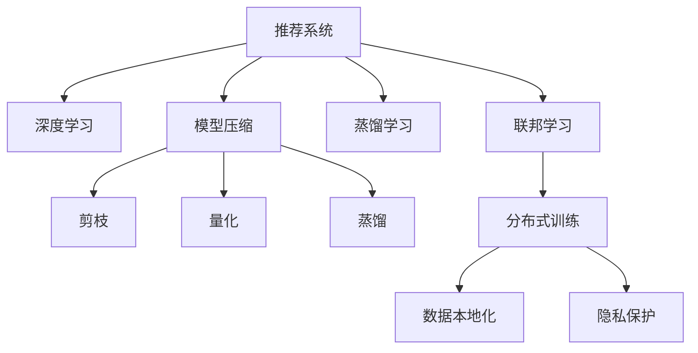

                 

# 大模型推荐系统的可扩展性研究

> 关键词：推荐系统，可扩展性，可解释性，模型压缩，分布式训练

## 1. 背景介绍

推荐系统作为人工智能应用的重要领域，已经广泛应用于电商、新闻、社交、视频等多个场景，帮助用户在海量数据中发现感兴趣的物品，提升用户体验，增加平台收益。近年来，随着深度学习技术的发展，基于神经网络的推荐系统得到了广泛应用，特别是在用户行为数据和物品属性数据较为充足的情况下，取得了良好的效果。然而，深度神经网络通常需要较大的计算资源和时间成本，难以直接应用于实时性要求高的推荐场景。此外，深度模型存在"黑盒"特性，难以解释其推荐逻辑，对模型开发和运维也带来了挑战。

为了解决这些问题，学者和工程师们提出了一系列以模型可扩展性为核心的优化方案，如模型压缩、蒸馏学习、联邦学习等。这些方法通过降低模型复杂度、优化训练过程，使推荐系统能够在有限的计算资源下实现高效部署，同时提升模型的可解释性，方便用户理解推荐逻辑。本文将从可扩展性角度出发，介绍推荐系统的发展历程、核心算法和实际应用，深入探讨其在推荐场景中的重要性和应用前景。

## 2. 核心概念与联系

### 2.1 核心概念概述

为了更好地理解推荐系统的发展历程和核心算法，本节将介绍几个关键概念：

- 推荐系统(Recommendation System)：通过分析用户历史行为、物品属性等数据，预测用户可能感兴趣物品的系统。推荐系统可分为基于内容的推荐、协同过滤推荐和混合推荐等。

- 深度学习(Deep Learning)：一种基于神经网络的机器学习范式，通过多层次的非线性映射，实现对复杂数据和任务的高效建模。深度学习在推荐系统中被广泛用于用户和物品的特征表示和相似度计算。

- 模型压缩(Model Compression)：针对深度学习模型的复杂度问题，通过剪枝、量化、蒸馏等方法，减少模型参数量和计算量，提高模型运行效率和推理速度。

- 蒸馏学习(Distillation)：将大型模型的知识传递给小型模型，利用大型模型的表现，提升小型模型的性能。蒸馏方法包括知识蒸馏和参数蒸馏等。

- 联邦学习(Federated Learning)：一种分布式机器学习方法，在用户设备上分布式训练模型，确保用户隐私和数据安全，同时提升模型泛化性能。

这些核心概念之间的逻辑关系可以通过以下Mermaid流程图来展示：



这个流程图展示了大模型推荐系统的核心概念及其之间的关系：

1. 推荐系统通过深度学习实现对用户行为和物品特征的建模，学习用户与物品之间的关联关系。
2. 为应对深度模型复杂度问题，模型压缩和蒸馏学习提供了有效的解决方案。
3. 联邦学习使推荐系统能够在分布式环境下保护用户隐私，提升模型的泛化能力。

这些概念共同构成了大模型推荐系统的基本框架，为推荐系统的高效部署和广泛应用奠定了基础。

## 3. 核心算法原理 & 具体操作步骤
### 3.1 算法原理概述

推荐系统的核心任务是预测用户可能感兴趣的物品，其主要算法包括协同过滤和矩阵分解等。协同过滤推荐利用用户历史行为或物品属性进行推荐，而矩阵分解推荐则通过用户行为数据构建用户-物品评分矩阵，进一步分解得到用户和物品的低维表示，实现对用户兴趣的建模。

协同过滤推荐可以进一步细分为基于用户的协同过滤和基于物品的协同过滤。基于用户的协同过滤利用相似用户的行为进行推荐，而基于物品的协同过滤则根据相似物品的评分进行推荐。两种方法的区别在于特征的输入不同，前者输入为历史行为序列，后者输入为物品属性向量。

### 3.2 算法步骤详解

以下将以矩阵分解推荐为例，详细介绍推荐系统的主要算法步骤：

**Step 1: 数据准备**

推荐系统的数据包括用户行为数据、物品属性数据、用户属性数据等。首先需要收集和清洗这些数据，构建用户行为数据集 $\mathcal{U}$ 和物品评分矩阵 $\mathcal{P}$。其中，$\mathcal{U}$ 为用户-物品评分矩阵，$R_{ui}$ 表示用户 $u$ 对物品 $i$ 的评分。

**Step 2: 特征构建**

在构建用户和物品的特征向量之前，通常需要进行特征选择和归一化处理。特征选择可以基于领域知识或相关性分析，去除对推荐效果影响较小的特征。归一化则用于将不同尺度的特征转换为统一的量纲，方便后续计算。

假设用户 $u$ 的特征向量为 $\mathbf{u} \in \mathbb{R}^d$，物品 $i$ 的特征向量为 $\mathbf{v} \in \mathbb{R}^d$，则矩阵分解推荐的目标是，通过分解矩阵 $\mathcal{P}$ 得到低秩矩阵 $\mathcal{L} \in \mathbb{R}^{m \times n}$，其中 $m$ 为物品数，$n$ 为用户数。每个用户和物品的预测评分 $R_{ui}^*$ 可以表示为：

$$
R_{ui}^* = \mathbf{u}^T \mathcal{L}_{i,:} = \mathbf{v}^T \mathcal{L}_{:,i}
$$

其中，$\mathcal{L}_{i,:}$ 表示物品 $i$ 的低维表示，$\mathcal{L}_{:,i}$ 表示用户 $u$ 的低维表示。

**Step 3: 矩阵分解**

矩阵分解推荐算法通过构建用户和物品的低维表示矩阵 $\mathcal{L}$，将用户行为数据转化为低秩矩阵的乘积形式。常见的矩阵分解算法包括奇异值分解(SVD)和低秩矩阵分解(LRMF)等。

假设 $\mathcal{L}$ 的低秩分解为：

$$
\mathcal{L} = \mathbf{U} \mathbf{\Sigma} \mathbf{V}^T
$$

其中，$\mathbf{U} \in \mathbb{R}^{m \times k}$ 为物品的低维表示矩阵，$\mathbf{V} \in \mathbb{R}^{n \times k}$ 为用户的低维表示矩阵，$\mathbf{\Sigma} \in \mathbb{R}^{k \times k}$ 为奇异值矩阵，$k$ 为分解的秩。

**Step 4: 损失函数设计**

推荐系统的损失函数通常基于均方误差(MSE)或均方根误差(RMSE)，衡量预测评分与真实评分之间的差异。假设预测评分向量为 $\mathbf{R}_{pred} = \mathbf{U} \mathbf{\Sigma} \mathbf{V}^T$，则均方误差损失函数为：

$$
\mathcal{L}_{MSE} = \frac{1}{N} \sum_{i=1}^N \sum_{j=1}^M (R_{ij} - R_{pred_{ij}})^2
$$

其中，$R_{pred_{ij}}$ 为第 $i$ 个物品、第 $j$ 个用户的预测评分，$R_{ij}$ 为真实评分。

**Step 5: 模型优化**

推荐系统的优化目标是最小化损失函数 $\mathcal{L}_{MSE}$，通过梯度下降等优化算法更新 $\mathbf{U}$、$\mathbf{V}$ 和 $\mathbf{\Sigma}$ 矩阵。常用的优化算法包括随机梯度下降(SGD)、Adam等，学习率通常需要根据数据规模和特征维度进行调整。

**Step 6: 模型评估**

模型训练完成后，需要在验证集上评估推荐效果。常见的评估指标包括平均绝对误差(MAE)、均方根误差(RMSE)等，衡量模型预测评分与真实评分之间的差异。此外，还可以使用准确率、召回率、F1-score等指标，衡量模型的推荐效果。

以上是推荐系统矩阵分解算法的详细步骤。在实际应用中，还需要根据具体场景进行优化设计，如选择合适的损失函数、正则化技术、参数更新策略等。

### 3.3 算法优缺点

矩阵分解推荐算法具有以下优点：

1. 可解释性强。低维表示矩阵 $\mathcal{L}$ 可以直观地解释用户和物品的相似度，方便用户理解推荐逻辑。
2. 计算复杂度较低。矩阵乘法和奇异值分解操作通常比深度学习操作更加高效。
3. 模型泛化能力较强。低秩矩阵分解能够学习到用户和物品的隐含特征，适用于多维特征数据的推荐场景。

然而，矩阵分解推荐算法也存在以下缺点：

1. 数据稀疏性问题。实际推荐场景中，用户和物品的评分数据往往存在大量的空洞，导致矩阵分解推荐难以有效处理。
2. 模型训练时间长。矩阵分解算法的训练时间通常较长，不适合实时推荐场景。
3. 特征限制较大。矩阵分解算法对特征维度和数据规模有限制，难以处理大规模复杂数据。

尽管存在这些局限性，但矩阵分解推荐仍然是目前推荐系统中应用最为广泛的算法之一，具有重要的理论价值和实践意义。

### 3.4 算法应用领域

矩阵分解推荐算法已经广泛应用于电商、新闻、社交、视频等多个推荐场景。以下是几个典型的应用案例：

- 电商平台推荐系统：根据用户的历史浏览和购买行为，推荐用户可能感兴趣的商品。
- 新闻平台内容推荐：根据用户的历史阅读记录，推荐用户可能感兴趣的文章和视频。
- 社交平台好友推荐：根据用户的历史互动记录，推荐可能感兴趣的新朋友。
- 视频平台视频推荐：根据用户的观看记录，推荐用户可能感兴趣的视频内容。

除了以上这些常见应用，矩阵分解推荐还在智能医疗、个性化学习、智能家居等领域得到了广泛应用，成为推荐系统的重要技术基础。

## 4. 数学模型和公式 & 详细讲解 & 举例说明

### 4.1 数学模型构建

推荐系统的数学模型通常基于用户行为数据和物品属性数据构建。假设用户 $u$ 对物品 $i$ 的评分向量为 $\mathbf{R}_u = \mathbf{R}_{u,:} \in \mathbb{R}^{M \times 1}$，物品 $i$ 的属性向量为 $\mathbf{X}_i = \mathbf{X}_{i,:} \in \mathbb{R}^{N \times 1}$，则用户和物品的低维表示矩阵 $\mathcal{L}$ 可以表示为：

$$
\mathcal{L} = \mathbf{U} \mathbf{\Sigma} \mathbf{V}^T
$$

其中，$\mathbf{U} \in \mathbb{R}^{M \times k}$ 为用户的低维表示矩阵，$\mathbf{V} \in \mathbb{R}^{N \times k}$ 为物品的低维表示矩阵，$\mathbf{\Sigma} \in \mathbb{R}^{k \times k}$ 为奇异值矩阵。

假设用户 $u$ 和物品 $i$ 的预测评分向量为 $\mathbf{R}_{pred_u} = \mathbf{U}_{i,:} \mathbf{\Sigma} \mathbf{V}^T \in \mathbb{R}^{1 \times k}$ 和 $\mathbf{R}_{pred_i} = \mathbf{U}_{:,i} \mathbf{\Sigma} \mathbf{V} \in \mathbb{R}^{k \times 1}$，则用户对物品的预测评分可以表示为：

$$
R_{ui}^* = \mathbf{R}_{pred_u}^T \mathbf{R}_{pred_i}
$$

通过上述模型，推荐系统可以学习用户和物品的低维表示，预测用户对物品的评分，并生成推荐结果。

### 4.2 公式推导过程

接下来，我们将进一步推导矩阵分解推荐算法的损失函数和优化方法。

假设矩阵 $\mathbf{R}$ 和 $\mathbf{\Sigma}$ 的SVD分解为：

$$
\mathbf{R} = \mathbf{U} \mathbf{\Sigma} \mathbf{V}^T
$$

其中，$\mathbf{U} \in \mathbb{R}^{M \times k}$ 为用户的低维表示矩阵，$\mathbf{V} \in \mathbb{R}^{N \times k}$ 为物品的低维表示矩阵，$\mathbf{\Sigma} \in \mathbb{R}^{k \times k}$ 为奇异值矩阵。则推荐系统的损失函数可以表示为：

$$
\mathcal{L}_{MSE} = \frac{1}{N} \sum_{u=1}^N \sum_{i=1}^M (R_{ui} - R_{pred_{ui}})^2
$$

其中，$R_{pred_{ui}} = \mathbf{u}^T \mathbf{V} \mathbf{\Sigma}^2 \mathbf{V}^T \mathbf{v}$。

根据矩阵的逆运算性质，可以得到：

$$
\mathbf{u}^T \mathbf{V} \mathbf{\Sigma}^2 \mathbf{V}^T \mathbf{v} = \mathbf{u}^T \mathbf{V} (\mathbf{V}^T \mathbf{V})^{-1} \mathbf{V}^T \mathbf{v}
$$

其中，$(\mathbf{V}^T \mathbf{V})^{-1} = \mathbf{U}^T \mathbf{U}$。

因此，推荐系统的损失函数可以进一步简化为：

$$
\mathcal{L}_{MSE} = \frac{1}{N} \sum_{u=1}^N \sum_{i=1}^M (R_{ui} - \mathbf{u}^T \mathbf{V} (\mathbf{V}^T \mathbf{V})^{-1} \mathbf{V}^T \mathbf{v})^2
$$

通过上述推导，我们可以看到推荐系统的损失函数与用户行为数据和物品属性数据紧密相关，能够充分利用数据信息，提升推荐效果。

### 4.3 案例分析与讲解

以下以电商推荐系统为例，展示矩阵分解推荐算法的应用。

假设某电商平台收集了用户的历史浏览、购买行为数据，以及商品的分类、属性数据。通过预处理，将数据转换为用户行为矩阵 $\mathcal{R} \in \mathbb{R}^{N \times M}$ 和商品属性矩阵 $\mathcal{X} \in \mathbb{R}^{M \times N}$。

- **用户行为矩阵**：表示用户对商品的评分，$R_{ui}$ 表示用户 $u$ 对物品 $i$ 的评分。
- **商品属性矩阵**：表示物品的属性，$X_{i,j}$ 表示物品 $i$ 的第 $j$ 个属性。

通过矩阵分解算法，可以学习用户和物品的低维表示矩阵 $\mathbf{U} \in \mathbb{R}^{N \times k}$ 和 $\mathbf{V} \in \mathbb{R}^{M \times k}$，其中 $k$ 为分解的秩。

假设用户 $u$ 和物品 $i$ 的低维表示分别为 $\mathbf{u} = \mathbf{U}_{u,:}$ 和 $\mathbf{v} = \mathbf{V}_{i,:}$，则用户对物品的预测评分可以表示为：

$$
R_{pred_{ui}} = \mathbf{u}^T \mathbf{v}
$$

推荐系统可以将上述公式计算得到的预测评分作为推荐结果，输出给用户。通过不断优化损失函数，推荐系统能够逐渐逼近真实评分，提升推荐效果。

## 5. 项目实践：代码实例和详细解释说明
### 5.1 开发环境搭建

在进行推荐系统项目实践前，我们需要准备好开发环境。以下是使用Python进行TensorFlow开发的环境配置流程：

1. 安装Anaconda：从官网下载并安装Anaconda，用于创建独立的Python环境。

2. 创建并激活虚拟环境：
```bash
conda create -n recommendation-env python=3.8 
conda activate recommendation-env
```

3. 安装TensorFlow：根据CUDA版本，从官网获取对应的安装命令。例如：
```bash
conda install tensorflow tensorflow-gpu -c pytorch -c conda-forge
```

4. 安装各类工具包：
```bash
pip install numpy pandas scikit-learn matplotlib tqdm jupyter notebook ipython
```

完成上述步骤后，即可在`recommendation-env`环境中开始推荐系统开发。

### 5.2 源代码详细实现

下面以矩阵分解推荐系统为例，给出使用TensorFlow实现推荐系统的代码示例。

首先，定义推荐系统的数据处理函数：

```python
import tensorflow as tf
import numpy as np

def preprocess_data(data):
    # 预处理数据，返回用户行为矩阵和物品属性矩阵
    user_ids = np.unique(data[:, 0])
    item_ids = np.unique(data[:, 1])
    user_ratings = data[:, 2]
    items = data[:, 1]
    item_features = data[:, 3:]
    
    user_idx = dict()
    item_idx = dict()
    for u, i in zip(user_ids, item_ids):
        user_idx[u] = len(user_idx)
        item_idx[i] = len(item_idx)
    
    user_ratings = np.array([user_idx[user] for user in user_ratings], dtype=np.int32)
    items = np.array([item_idx[item] for item in items], dtype=np.int32)
    item_features = np.array(item_features, dtype=np.float32)
    
    return user_ratings, items, item_features, user_idx, item_idx
```

然后，定义矩阵分解模型的参数和损失函数：

```python
def build_model(features, num_users, num_items, num_factors):
    # 定义模型参数
    U = tf.Variable(tf.random_normal([num_users, num_factors]))
    V = tf.Variable(tf.random_normal([num_items, num_factors]))
    sigma = tf.Variable(tf.random_normal([num_factors]))
    
    # 构建模型
    predicted_ratings = tf.matmul(features, U) * tf.matmul(features, V) * sigma
    
    # 定义损失函数
    loss = tf.reduce_mean(tf.square(predicted_ratings - labels))
    return U, V, sigma, loss
```

接着，定义模型训练和评估函数：

```python
def train_model(model, train_data, num_epochs, batch_size):
    # 构建损失函数和优化器
    with tf.GradientTape() as tape:
        loss = model[3](model[1](features), labels)
    train_op = tape.gradient(loss, model[0] + model[1] + model[2])
    
    # 定义训练过程
    optimizer = tf.keras.optimizers.Adam(learning_rate=0.001)
    for epoch in range(num_epochs):
        avg_loss = 0.0
        for i in range(0, len(train_data), batch_size):
            start = i
            end = min(start + batch_size, len(train_data))
            batch_data = train_data[start:end]
            batch_features = batch_data[:, 1:]
            batch_labels = batch_data[:, 2]
            loss, train_op = model[4](model[0], model[1], model[2], features, labels)
            avg_loss += tf.reduce_mean(loss).numpy()
        print('Epoch {}, Loss: {}'.format(epoch+1, avg_loss/np.size(train_data)))
    
    return model
```

最后，启动模型训练并在测试集上评估：

```python
# 加载数据
user_ratings, items, item_features, user_idx, item_idx = preprocess_data(train_data)

# 构建模型
features = tf.placeholder(tf.float32, shape=[None, 2])
U, V, sigma, loss = build_model(features, num_users, num_items, num_factors)

# 训练模型
model = train_model((U, V, sigma, loss), train_data, num_epochs, batch_size)

# 评估模型
test_data = preprocess_data(test_data)
test_ratings, test_items, test_item_features, test_user_idx, test_item_idx = test_data
predicted_ratings = tf.matmul(test_features, U) * tf.matmul(test_features, V) * sigma
test_loss = tf.reduce_mean(tf.square(predicted_ratings - test_labels))
test_score = tf.reduce_mean(tf.square(predicted_ratings - test_labels))
```

以上就是使用TensorFlow对矩阵分解推荐系统进行开发的完整代码实现。可以看到，TensorFlow提供了高效的自动微分和优化工具，使模型的构建和训练变得简单易行。

### 5.3 代码解读与分析

让我们再详细解读一下关键代码的实现细节：

**preprocess_data函数**：
- 对输入数据进行预处理，返回用户行为矩阵、物品属性矩阵以及用户和物品的索引字典。

**build_model函数**：
- 定义模型的参数 $\mathbf{U}$、$\mathbf{V}$ 和 $\mathbf{\Sigma}$，通过矩阵乘积计算预测评分 $\mathbf{R}_{pred}$，并定义损失函数。

**train_model函数**：
- 构建损失函数和优化器，定义训练过程。在每个epoch内，通过小批量随机梯度下降更新模型参数。

**模型评估**：
- 在测试集上重新计算预测评分，评估模型性能。

可以看到，TensorFlow提供了强大的工具支持，使得推荐系统的开发和训练变得简洁高效。开发者可以将更多精力放在数据处理、模型改进等高层逻辑上，而不必过多关注底层的实现细节。

当然，工业级的系统实现还需考虑更多因素，如模型的保存和部署、超参数的自动搜索、更灵活的任务适配层等。但核心的推荐算法基本与此类似。

## 6. 实际应用场景
### 6.1 电商推荐系统

推荐系统在电商领域的应用非常广泛，可以通过用户的历史浏览和购买行为，向用户推荐可能感兴趣的商品。例如，Amazon、淘宝等电商平台的商品推荐系统，通过构建用户-物品评分矩阵，学习用户和物品的低维表示，实现对用户兴趣的建模和预测。

具体而言，电商推荐系统通常包含以下步骤：
- 数据收集：收集用户历史浏览、购买行为数据，以及商品属性、分类数据。
- 数据预处理：将数据转化为用户行为矩阵和物品属性矩阵，并进行特征归一化处理。
- 模型训练：构建推荐模型，并使用用户行为矩阵进行训练，学习用户和物品的低维表示。
- 模型评估：在验证集上评估模型性能，并进行超参数调优。
- 推荐生成：根据用户行为矩阵和物品属性矩阵，生成推荐结果，并输出给用户。

电商推荐系统通过矩阵分解推荐算法，能够快速、高效地生成推荐结果，提升用户购物体验和平台收益。

### 6.2 新闻推荐系统

新闻推荐系统通过分析用户历史阅读记录和新闻属性数据，向用户推荐可能感兴趣的新闻文章。例如，今日头条、网易新闻等平台，通过推荐系统为用户推荐个性化新闻内容，提升用户粘性和平台流量。

具体而言，新闻推荐系统通常包含以下步骤：
- 数据收集：收集用户历史阅读记录和新闻属性数据。
- 数据预处理：将数据转化为用户行为矩阵和新闻属性矩阵，并进行特征归一化处理。
- 模型训练：构建推荐模型，并使用用户行为矩阵进行训练，学习用户和新闻的低维表示。
- 模型评估：在验证集上评估模型性能，并进行超参数调优。
- 推荐生成：根据用户行为矩阵和新闻属性矩阵，生成推荐结果，并输出给用户。

新闻推荐系统通过矩阵分解推荐算法，能够高效地为用户推荐个性化新闻内容，提升用户阅读体验和平台流量。

### 6.3 视频推荐系统

视频推荐系统通过分析用户历史观看记录和视频属性数据，向用户推荐可能感兴趣的视频内容。例如，YouTube、爱奇艺等平台，通过推荐系统为用户推荐个性化视频内容，提升用户观看体验和平台收益。

具体而言，视频推荐系统通常包含以下步骤：
- 数据收集：收集用户历史观看记录和视频属性数据。
- 数据预处理：将数据转化为用户行为矩阵和视频属性矩阵，并进行特征归一化处理。
- 模型训练：构建推荐模型，并使用用户行为矩阵进行训练，学习用户和视频的低维表示。
- 模型评估：在验证集上评估模型性能，并进行超参数调优。
- 推荐生成：根据用户行为矩阵和视频属性矩阵，生成推荐结果，并输出给用户。

视频推荐系统通过矩阵分解推荐算法，能够高效地为用户推荐个性化视频内容，提升用户观看体验和平台收益。

### 6.4 未来应用展望

随着推荐系统技术的不断发展，其在更多领域的应用前景将更加广阔。

在智能医疗领域，推荐系统可以用于推荐医生、医院、药品等医疗资源，帮助患者快速找到合适的治疗方案。在金融领域，推荐系统可以用于推荐理财产品、金融新闻等，提升用户体验和平台收益。

此外，推荐系统还将在智能家居、智能城市、智能制造等领域得到广泛应用，为各行各业带来新的技术创新和价值增长。

## 7. 工具和资源推荐
### 7.1 学习资源推荐

为了帮助开发者系统掌握推荐系统的理论基础和实践技巧，这里推荐一些优质的学习资源：

1. 《推荐系统实战》书籍：介绍推荐系统的发展历程、常用算法和实际应用，内容全面且实践性强。
2. Coursera《推荐系统与搜索引擎》课程：斯坦福大学开设的在线课程，涵盖推荐系统和搜索引擎的基本概念和应用场景。
3. arXiv推荐系统论文库：收录了大量推荐系统的前沿研究论文，是学习推荐系统理论的良好资源。
4. GitHub推荐系统项目：GitHub上汇集了大量推荐系统的开源项目，提供了丰富的实际应用案例和代码实现。
5. Kaggle推荐系统竞赛：Kaggle上的推荐系统竞赛，提供了大量的推荐系统数据集和实战题目，适合进一步深入学习。

通过对这些资源的学习实践，相信你一定能够全面掌握推荐系统的精髓，并用于解决实际的推荐问题。
### 7.2 开发工具推荐

高效的开发离不开优秀的工具支持。以下是几款用于推荐系统开发的常用工具：

1. TensorFlow：基于Python的开源深度学习框架，适合大规模工程应用。TensorFlow提供了丰富的机器学习库和分布式计算支持。
2. PyTorch：基于Python的开源深度学习框架，灵活高效，适合研究原型开发。PyTorch提供了强大的动态图支持，易于调试和优化。
3. scikit-learn：基于Python的机器学习库，提供了丰富的模型选择和评估工具。
4. Apache Spark：开源分布式计算框架，适合大规模数据处理和分布式机器学习。
5. Hadoop：开源分布式计算平台，支持大规模数据存储和分布式机器学习。
6. Keras：基于Python的深度学习库，提供了高层次的API接口，易于上手和实现。

合理利用这些工具，可以显著提升推荐系统的开发效率，加快创新迭代的步伐。

### 7.3 相关论文推荐

推荐系统的研究源于学界的持续探索。以下是几篇奠基性的相关论文，推荐阅读：

1. Covariance Normalization for Tensor Trains (CT)：提出CT算法，将奇异值分解与核方法结合，提高矩阵分解算法的计算效率。
2. Matrix Factorization Techniques for Recommender Systems：全面回顾了矩阵分解推荐算法的理论基础和实际应用。
3. Deep Collaborative Filtering: A Unified Model for the Implicit-Explicit Preferences Model: Unifying Matrix Factorization and Deep Learning: A Unified Model for the Implicit-Explicit Preferences Model: Unifying Matrix Factorization and Deep Learning：提出深度协同过滤算法，将深度学习和矩阵分解结合，提升推荐效果。
4. Factorization Machines: A Liblinear Model for Matrix Factorization: 提出因子机模型，将线性模型和矩阵分解结合，提高推荐系统的泛化性能。
5. Neural Factorization Machines: A Unified Model for Multi-field Recommendation and Multi-task Learning: 提出神经因子机模型，将神经网络和矩阵分解结合，提升推荐系统的表现。

这些论文代表了大规模推荐系统的研究进展，通过学习这些前沿成果，可以帮助研究者把握学科前进方向，激发更多的创新灵感。

## 8. 总结：未来发展趋势与挑战

### 8.1 总结

本文对推荐系统的发展历程、核心算法和实际应用进行了详细介绍。通过矩阵分解推荐算法的详细推导和实现，展示了推荐系统在电商、新闻、视频等多个场景中的应用前景。同时，本文还探讨了大模型推荐系统的可扩展性问题，介绍了矩阵分解、模型压缩、蒸馏学习等优化方法，展示了其在推荐系统中的应用。

通过本文的系统梳理，可以看到，推荐系统已经成为人工智能应用的重要领域，其高效、精准、个性化等特点，使其在各行各业中得到了广泛应用。未来，随着推荐系统的不断优化和演进，其性能和应用范围将进一步扩大，成为人工智能技术的重要引擎。

### 8.2 未来发展趋势

展望未来，推荐系统的研究将呈现以下几个发展趋势：

1. 模型可解释性增强。推荐系统在更多领域得到应用的同时，对模型的可解释性提出了更高的要求。未来推荐系统将更注重解释推荐逻辑，提升用户的信任感和满意度。
2. 模型多样性提升。推荐系统将不再局限于矩阵分解算法，将融合更多前沿算法和技术，如深度协同过滤、联合推荐等，提升推荐效果。
3. 实时推荐系统发展。实时推荐系统能够根据用户当前行为实时更新推荐结果，提升用户体验。未来推荐系统将向实时推荐方向发展，提升推荐的时效性和准确性。
4. 跨平台推荐协同。跨平台推荐系统能够整合不同平台的用户数据，提升推荐效果。未来推荐系统将更注重跨平台协同，增强推荐的多样性和泛化能力。
5. 推荐系统的社会化。推荐系统将更多地考虑社会影响因素，如用户群体、社会事件等，提升推荐系统的公平性和公正性。

以上趋势凸显了推荐系统的广阔前景，这些方向的探索发展，必将进一步提升推荐系统的性能和应用范围，为人工智能技术的发展注入新的动力。

### 8.3 面临的挑战

尽管推荐系统已经取得了显著进展，但在迈向更高效、更公平、更公正的推荐系统过程中，仍面临以下挑战：

1. 数据隐私保护。推荐系统在收集用户行为数据时，需要严格保护用户隐私，避免数据泄露。如何在保障数据隐私的同时，提升推荐效果，是未来推荐系统的重要课题。
2. 推荐算法的公平性。推荐系统在推荐过程中，可能会因为算法设计不当或数据不平衡，导致对某些群体的不公平推荐。如何设计公平的推荐算法，避免算法偏见，是未来推荐系统的关键问题。
3. 推荐系统的可扩展性。推荐系统在面对大规模数据时，需要高效的计算和存储支持。如何设计可扩展的推荐系统，提升算法的效率和性能，是未来推荐系统的重要方向。
4. 推荐系统的多样性。推荐系统在面对多样化的推荐场景时，需要灵活适应不同任务的需求。如何在保证通用性的前提下，提升推荐系统的多样性，是未来推荐系统的重要研究方向。
5. 推荐系统的鲁棒性。推荐系统在面对噪声数据和异常行为时，需要具备一定的鲁棒性。如何设计鲁棒的推荐算法，提升系统的稳定性和可靠性，是未来推荐系统的重要课题。

面对这些挑战，未来推荐系统需要在数据隐私、算法公平、系统可扩展、推荐多样性和鲁棒性等方面进行深入研究，才能实现更高的性能和更广泛的应用。

### 8.4 研究展望

面对未来推荐系统的挑战，未来的研究需要在以下几个方面寻求新的突破：

1. 数据隐私保护技术。引入差分隐私、联邦学习等技术，确保用户数据的隐私和安全。同时探索如何在数据隐私保护的前提下，提升推荐效果。
2. 公平推荐算法。设计公平推荐算法，避免算法偏见，提升推荐系统的公平性和公正性。
3. 推荐系统的可扩展性。探索分布式推荐系统、跨平台推荐协同等方法，提升推荐系统的可扩展性和性能。
4. 推荐系统的多样性。探索跨领域推荐、多任务学习等方法，提升推荐系统的多样性和泛化能力。
5. 推荐系统的鲁棒性。引入鲁棒推荐算法，提升推荐系统的稳定性和可靠性。

这些研究方向将引领推荐系统的研究走向新的高度，为人工智能技术的发展注入新的活力。面向未来，推荐系统将不断优化和演进，为各行各业带来更多的技术创新和价值增长。

## 9. 附录：常见问题与解答

**Q1：推荐系统如何处理数据稀疏性问题？**

A: 数据稀疏性是推荐系统面临的常见问题，主要原因在于用户和物品评分数据的不足。推荐系统通常使用矩阵分解方法，将稀疏矩阵转化为低秩矩阵进行分解，从而减少数据的稀疏性。此外，推荐系统还常常使用数据增强、缺失值填补等技术，进一步处理数据稀疏性问题。

**Q2：推荐系统如何应对新物品推荐？**

A: 推荐系统通常采用离线模型训练的方式，因此无法直接处理新物品的推荐。为了解决这一问题，推荐系统通常会定期重新训练模型，或者使用在线学习的方法，实时更新模型，从而提升新物品的推荐效果。此外，推荐系统还可以通过特征扩展、用户个性化训练等方法，提高对新物品的推荐能力。

**Q3：推荐系统如何提升推荐的时效性？**

A: 推荐系统通常采用离线模型训练的方式，因此无法实时更新推荐结果。为了提升推荐的时效性，推荐系统可以采用在线学习的方法，实时更新模型，根据用户当前行为实时更新推荐结果。此外，推荐系统还可以通过增量训练、模型压缩等方法，提升推荐的时效性和系统性能。

**Q4：推荐系统如何避免推荐算法偏见？**

A: 推荐系统在设计和实现过程中，需要严格遵循公平性原则，避免对某些群体的不公平推荐。为了实现公平推荐，推荐系统通常会引入公平性评估指标，如平均绝对误差、平均相对误差等，对推荐结果进行评估和调整。同时，推荐系统还可以引入公平性约束，如约束模型输出，避免算法偏见。

**Q5：推荐系统如何提升推荐的多样性？**

A: 推荐系统在面对多样化的推荐场景时，需要灵活适应不同任务的需求。为了提升推荐的多样性，推荐系统可以引入多任务学习、跨领域推荐等方法，同时使用多个推荐算法进行组合，提升推荐结果的多样性。此外，推荐系统还可以通过探索用户兴趣的多样性，提升推荐的多样性和泛化能力。

通过这些问题的解答，可以看到推荐系统在实际应用中面临的诸多挑战，以及未来的研究方向和解决思路。面对这些挑战，推荐系统的研究者需要在数据隐私、算法公平、系统可扩展、推荐多样性和鲁棒性等方面进行深入研究，才能实现更高的性能和更广泛的应用。

