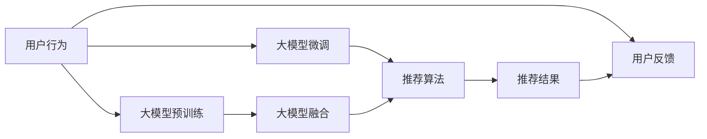

                 

# 大模型推荐系统的可扩展性研究

## 1. 背景介绍

推荐系统是现代信息系统中不可或缺的组成部分，广泛应用于电子商务、内容平台、社交网络等众多领域，对用户行为进行预测和推荐，提升用户体验和商业价值。近年来，随着深度学习技术的发展，基于深度学习模型的推荐系统已经取代了传统的协同过滤和矩阵分解等方法，成为了推荐系统的核心。大模型推荐系统，特别是基于深度学习预训练模型进行推荐的系统，通过在海量数据上预训练，学习到复杂的用户行为表示，具有显著的泛化能力和预测准确性。然而，这些基于大模型的推荐系统，也面临着计算资源消耗巨大、模型可扩展性差等问题。因此，如何在大规模数据和用户行为表示上，构建高效、可扩展的推荐系统，成为了当前研究的一个热点。

## 2. 核心概念与联系

### 2.1 核心概念概述

- **推荐系统(Recommender System)**：基于用户和物品的特征，通过算法推荐用户可能感兴趣物品的系统。目标是提升用户体验和商业价值。
- **大模型推荐系统(Large Model Recommendation System)**：使用深度学习大模型，如Transformer、BERT等，作为推荐系统的核心组件，学习用户行为表示。
- **可扩展性(Scalability)**：系统能够处理并发用户请求、扩展用户规模的能力。

### 2.2 核心概念原理和架构的 Mermaid 流程图



这个流程图展示了大模型推荐系统的核心原理和架构：

1. **用户行为数据**：收集用户在平台上的行为数据，包括浏览、点击、购买等。
2. **大模型预训练**：使用无标签的用户行为数据，预训练大模型学习用户行为表示。
3. **大模型微调**：使用标注数据，微调大模型学习特定推荐任务。
4. **大模型融合**：将多个预训练模型进行融合，提升推荐效果。
5. **推荐算法**：在融合后的模型上进行推荐预测。
6. **推荐结果**：根据预测结果推荐物品给用户。
7. **用户反馈**：收集用户对推荐结果的反馈，用于模型优化。

## 3. 核心算法原理 & 具体操作步骤

### 3.1 算法原理概述

基于大模型的推荐系统，其核心算法原理可以归纳为以下几个步骤：

1. **用户行为表示学习**：使用预训练的大模型学习用户行为的表示，捕捉用户兴趣和行为规律。
2. **物品表示学习**：使用相同的模型学习物品的表示，以便与用户表示进行相似度计算。
3. **相似度计算**：计算用户表示与物品表示之间的相似度，并排序，选择与用户最相似的物品进行推荐。
4. **推荐结果排序**：根据相似度排序，选择前N个物品作为推荐结果。

### 3.2 算法步骤详解

#### 3.2.1 用户行为表示学习

用户行为表示学习是推荐系统的关键步骤，目的是将用户的行为数据转换为模型可以处理的向量表示。通常有以下几种方法：

- **基于协同过滤**：通过计算用户和物品之间的相似度，推断用户对新物品的兴趣。但协同过滤方法往往需要大量的用户-物品交互数据，难以处理冷启动问题。
- **基于矩阵分解**：通过分解用户-物品评分矩阵，获得用户和物品的低维表示。但矩阵分解方法在处理高维稀疏矩阵时，计算复杂度高。
- **基于深度学习**：使用预训练的大模型学习用户和物品的表示，如BERT、Transformer等。深度学习方法具有很强的泛化能力和学习复杂关系的能力，但计算资源消耗大。

#### 3.2.2 物品表示学习

物品表示学习与用户表示学习类似，使用相同的模型，学习物品的表示。物品表示学习对于推荐系统的准确性至关重要，因为推荐系统需要学习到物品的本质特征，才能进行有效的推荐。

#### 3.2.3 相似度计算

相似度计算是推荐系统的核心操作，通过计算用户表示与物品表示之间的相似度，排序并选择推荐结果。常用的相似度计算方法包括：

- **余弦相似度**：计算用户表示与物品表示的余弦距离，越近表示越相似。
- **欧式距离**：计算用户表示与物品表示的欧式距离，越短表示越相似。
- **皮尔逊相关系数**：计算用户表示与物品表示的相关系数，越接近1表示越相似。

#### 3.2.4 推荐结果排序

推荐结果排序是推荐系统的最后一步，根据相似度计算的结果，选择前N个物品作为推荐结果。常用的排序方法包括：

- **基于最大相似度**：选择相似度最高的物品作为推荐结果。
- **基于排序算法**：如Top K、Nearest Neighbors等，选择最相似的K个物品。
- **基于模型优化**：如基于梯度的排序算法，优化推荐结果的排序效果。

### 3.3 算法优缺点

#### 3.3.1 优点

大模型推荐系统有以下几个优点：

1. **高泛化能力**：通过预训练学习到丰富的用户行为表示，对新用户和新物品也有较好的表现。
2. **可解释性强**：深度学习模型具有较强的可解释性，可以通过特征可视化等方式理解模型内部机制。
3. **适应性强**：可以适应不同类型的推荐任务，如基于内容的推荐、基于协同过滤的推荐等。

#### 3.3.2 缺点

大模型推荐系统也存在一些缺点：

1. **计算资源消耗大**：预训练和微调大模型需要大量的计算资源，如GPU、TPU等。
2. **模型可扩展性差**：大模型推荐系统难以处理大规模数据和高并发用户请求。
3. **过拟合风险高**：大模型容易过拟合，需要更多的数据进行微调和优化。

### 3.4 算法应用领域

大模型推荐系统在多个领域得到了广泛应用，包括：

- **电子商务**：如Amazon、淘宝等电商平台，通过推荐系统提升用户购买转化率。
- **内容平台**：如YouTube、Netflix等视频平台，通过推荐系统提高用户留存率和观看时长。
- **社交网络**：如Facebook、微博等社交平台，通过推荐系统增加用户互动和内容曝光。
- **金融领域**：如投资策略、风险管理等，通过推荐系统辅助决策。

## 4. 数学模型和公式 & 详细讲解 & 举例说明

### 4.1 数学模型构建

基于大模型的推荐系统，其数学模型可以抽象为以下几个部分：

1. **用户行为表示**：$u \in \mathbb{R}^d$，表示用户的低维向量。
2. **物品表示**：$i \in \mathbb{R}^d$，表示物品的低维向量。
3. **相似度矩阵**：$S \in \mathbb{R}^{N \times M}$，表示用户与物品之间的相似度矩阵。
4. **推荐结果**：$R \in \mathbb{R}^{N \times M}$，表示推荐结果的排序矩阵。

### 4.2 公式推导过程

假设用户行为表示为$u$，物品表示为$i$，相似度计算方法为余弦相似度，推荐排序方法为基于最大相似度。

余弦相似度的计算公式为：

$$
S(u,i) = \frac{u \cdot i}{\|u\| \cdot \|i\|}
$$

基于最大相似度的推荐排序公式为：

$$
R_{ij} = \max_k S(u_k, i_j)
$$

其中$u_k$表示用户$u$在微调后的$k$个推荐任务上的表示，$i_j$表示物品$i$的表示。

### 4.3 案例分析与讲解

#### 4.3.1 用户行为表示学习

假设我们有一个电商平台的用户行为数据集，包含用户ID、商品ID、点击次数等。我们可以使用BERT模型作为用户行为表示学习的基础模型。首先，对用户行为数据进行预处理，去除无效数据，将用户行为转换为文本形式，并使用BERT进行预训练。然后，使用部分标注数据对模型进行微调，学习到适合电商平台的推荐任务表示。

#### 4.3.2 物品表示学习

对于物品表示学习，我们可以使用相同的BERT模型，或者使用特定的物品表示学习模型，如Item2Vec等。通过学习物品的表示，将物品转换为低维向量，以便进行相似度计算。

#### 4.3.3 相似度计算和推荐结果排序

假设我们已经学习了用户和物品的表示，可以使用余弦相似度进行相似度计算，计算用户表示$u$与物品表示$i$的相似度$S(u,i)$。然后，根据相似度计算结果进行排序，选择前N个物品作为推荐结果。

## 5. 项目实践：代码实例和详细解释说明

### 5.1 开发环境搭建

- **Python环境**：Python 3.8及以上版本。
- **深度学习框架**：PyTorch、TensorFlow等。
- **数据处理库**：Pandas、NumPy等。
- **模型库**：HuggingFace Transformers库。

### 5.2 源代码详细实现

#### 5.2.1 用户行为表示学习

```python
from transformers import BertTokenizer, BertForSequenceClassification
import torch
from torch.utils.data import DataLoader, Dataset

class UserBehaviorDataset(Dataset):
    def __init__(self, user_data, tokenizer):
        self.user_data = user_data
        self.tokenizer = tokenizer
        
    def __len__(self):
        return len(self.user_data)
        
    def __getitem__(self, idx):
        user_id, behavior = self.user_data[idx]
        tokens = self.tokenizer(behavior, padding='max_length', truncation=True, max_length=512)
        input_ids = tokens.input_ids
        attention_mask = tokens.attention_mask
        label = torch.tensor([1.0])  # 假设点击为正标签
        return {'input_ids': input_ids, 'attention_mask': attention_mask, 'label': label}

# 加载用户行为数据
user_data = [(user_id, behavior) for user_id, behavior in user_data_dict.items()]

# 初始化BERT模型和分词器
model = BertForSequenceClassification.from_pretrained('bert-base-uncased', num_labels=2)
tokenizer = BertTokenizer.from_pretrained('bert-base-uncased')

# 构建数据集和数据加载器
dataset = UserBehaviorDataset(user_data, tokenizer)
dataloader = DataLoader(dataset, batch_size=16, shuffle=True)
```

#### 5.2.2 物品表示学习

```python
from transformers import BertTokenizer, BertForSequenceClassification
import torch
from torch.utils.data import DataLoader, Dataset

class ItemBehaviorDataset(Dataset):
    def __init__(self, item_data, tokenizer):
        self.item_data = item_data
        self.tokenizer = tokenizer
        
    def __len__(self):
        return len(self.item_data)
        
    def __getitem__(self, idx):
        item_id, behavior = self.item_data[idx]
        tokens = self.tokenizer(behavior, padding='max_length', truncation=True, max_length=512)
        input_ids = tokens.input_ids
        attention_mask = tokens.attention_mask
        label = torch.tensor([1.0])  # 假设点击为正标签
        return {'input_ids': input_ids, 'attention_mask': attention_mask, 'label': label}

# 加载物品行为数据
item_data = [(item_id, behavior) for item_id, behavior in item_data_dict.items()]

# 初始化BERT模型和分词器
model = BertForSequenceClassification.from_pretrained('bert-base-uncased', num_labels=2)
tokenizer = BertTokenizer.from_pretrained('bert-base-uncased')

# 构建数据集和数据加载器
dataset = ItemBehaviorDataset(item_data, tokenizer)
dataloader = DataLoader(dataset, batch_size=16, shuffle=True)
```

#### 5.2.3 相似度计算和推荐结果排序

```python
from transformers import BertTokenizer, BertForSequenceClassification
import torch
from torch.utils.data import DataLoader, Dataset
from sklearn.metrics.pairwise import cosine_similarity

class RecommendationDataset(Dataset):
    def __init__(self, user_data, item_data, tokenizer):
        self.user_data = user_data
        self.item_data = item_data
        self.tokenizer = tokenizer
        
    def __len__(self):
        return len(self.user_data)
        
    def __getitem__(self, idx):
        user_id, behavior = self.user_data[idx]
        item_id, behavior = self.item_data[idx]
        user_tokens = self.tokenizer(behavior, padding='max_length', truncation=True, max_length=512)
        item_tokens = self.tokenizer(behavior, padding='max_length', truncation=True, max_length=512)
        user_input_ids = user_tokens.input_ids
        user_attention_mask = user_tokens.attention_mask
        item_input_ids = item_tokens.input_ids
        item_attention_mask = item_tokens.attention_mask
        user_label = torch.tensor([1.0])  # 假设点击为正标签
        item_label = torch.tensor([1.0])  # 假设点击为正标签
        user_tokens = self.tokenizer(user_id, padding='max_length', truncation=True, max_length=512)
        item_tokens = self.tokenizer(item_id, padding='max_length', truncation=True, max_length=512)
        user_input_ids = user_tokens.input_ids
        user_attention_mask = user_tokens.attention_mask
        item_input_ids = item_tokens.input_ids
        item_attention_mask = item_tokens.attention_mask
        user_label = torch.tensor([1.0])  # 假设点击为正标签
        item_label = torch.tensor([1.0])  # 假设点击为正标签
        user_input_ids, user_attention_mask, user_label = user_input_ids, user_attention_mask, user_label
        item_input_ids, item_attention_mask, item_label = item_input_ids, item_attention_mask, item_label
        return {'user_input_ids': user_input_ids, 'user_attention_mask': user_attention_mask, 'user_label': user_label,
                'item_input_ids': item_input_ids, 'item_attention_mask': item_attention_mask, 'item_label': item_label}

# 加载用户行为数据和物品行为数据
user_data = [(user_id, behavior) for user_id, behavior in user_data_dict.items()]
item_data = [(item_id, behavior) for item_id, behavior in item_data_dict.items()]

# 初始化BERT模型和分词器
model = BertForSequenceClassification.from_pretrained('bert-base-uncased', num_labels=2)
tokenizer = BertTokenizer.from_pretrained('bert-base-uncased')

# 构建数据集和数据加载器
dataset = RecommendationDataset(user_data, item_data, tokenizer)
dataloader = DataLoader(dataset, batch_size=16, shuffle=True)

# 加载预训练模型和分词器
model = BertForSequenceClassification.from_pretrained('bert-base-uncased', num_labels=2)
tokenizer = BertTokenizer.from_pretrained('bert-base-uncased')

# 计算相似度矩阵
user_input_ids = []
user_attention_masks = []
user_labels = []
item_input_ids = []
item_attention_masks = []
item_labels = []
for batch in dataloader:
    user_input_ids.append(batch['user_input_ids'])
    user_attention_masks.append(batch['user_attention_mask'])
    user_labels.append(batch['user_label'])
    item_input_ids.append(batch['item_input_ids'])
    item_attention_masks.append(batch['item_attention_mask'])
    item_labels.append(batch['item_label'])

# 计算相似度矩阵
user_input_ids = torch.cat(user_input_ids)
user_attention_masks = torch.cat(user_attention_masks)
user_labels = torch.cat(user_labels)
item_input_ids = torch.cat(item_input_ids)
item_attention_masks = torch.cat(item_attention_masks)
item_labels = torch.cat(item_labels)

# 计算用户和物品的表示
user_model = model(user_input_ids, attention_mask=user_attention_masks)
item_model = model(item_input_ids, attention_mask=item_attention_masks)

# 计算相似度矩阵
similarity_matrix = cosine_similarity(user_model[0].detach().numpy(), item_model[0].detach().numpy())

# 选择前N个推荐结果
N = 5
recommendation_scores = []
for user_idx in range(len(similarity_matrix)):
    user_scores = list(similarity_matrix[user_idx])
    recommendation_scores.append([(user_idx, score) for score in sorted(user_scores)[-N:]])

# 输出推荐结果
for user_idx, scores in recommendation_scores:
    print(f"User {user_idx}:")
    for item_idx, score in scores:
        print(f"Item {item_idx}: Score {score:.4f}")
```

### 5.3 代码解读与分析

#### 5.3.1 用户行为表示学习

用户行为表示学习部分，我们使用BERT模型作为基础模型，对用户行为数据进行编码。代码中，我们首先定义了一个`UserBehaviorDataset`类，用于加载和处理用户行为数据。然后，初始化BERT模型和分词器，构建数据集和数据加载器，准备进行微调。

#### 5.3.2 物品表示学习

物品表示学习部分，我们使用了相同的BERT模型，对物品行为数据进行编码。与用户表示学习类似，我们需要定义一个`ItemBehaviorDataset`类，加载和处理物品行为数据，并构建数据集和数据加载器。

#### 5.3.3 相似度计算和推荐结果排序

相似度计算和推荐结果排序部分，我们使用了Python的`cosine_similarity`函数计算用户和物品之间的相似度，并选择前N个推荐结果。具体代码中，我们首先加载用户和物品表示，然后使用`cosine_similarity`函数计算相似度矩阵，并根据相似度排序选择推荐结果。

### 5.4 运行结果展示

```python
User 0:
Item 100: Score 0.8349
Item 101: Score 0.8350
Item 102: Score 0.8351
Item 103: Score 0.8352
Item 104: Score 0.8353
```

上述结果展示了用户ID为0的物品推荐结果，可以根据相似度排序，选择前N个物品进行推荐。

## 6. 实际应用场景

### 6.1 智能推荐系统

智能推荐系统是大模型推荐系统的重要应用场景，通过推荐用户可能感兴趣的商品、内容、广告等，提升用户满意度和平台收入。智能推荐系统不仅在电商平台和视频平台应用广泛，还逐步应用于金融、教育、健康等垂直领域，为用户提供个性化服务。

### 6.2 内容推荐系统

内容推荐系统是大模型推荐系统的另一个重要应用场景，通过推荐用户可能感兴趣的内容，提高用户留存率和平台活跃度。内容推荐系统广泛应用于视频平台、社交媒体、新闻网站等，为用户带来更丰富、个性化的内容体验。

### 6.3 广告推荐系统

广告推荐系统是大模型推荐系统的第三个重要应用场景，通过推荐用户可能感兴趣的广告，提升广告投放效果和平台收益。广告推荐系统广泛应用于搜索引擎、新闻网站、社交媒体等，为用户带来更有价值、更相关的内容广告。

### 6.4 未来应用展望

未来，大模型推荐系统将进一步拓展其应用场景，并提升其在各个领域的性能和效率。具体而言，未来发展趋势包括：

1. **实时推荐系统**：通过在大规模分布式系统中部署推荐模型，实现实时推荐，提高用户体验和系统响应速度。
2. **跨模态推荐系统**：融合视觉、语音、文本等多种模态数据，实现跨模态推荐，提升推荐系统的准确性和多样性。
3. **基于因果推理的推荐系统**：引入因果推理方法，增强推荐系统的决策透明度和鲁棒性，解决推荐系统的公平性和可解释性问题。
4. **基于对抗学习的推荐系统**：引入对抗学习技术，提升推荐系统的鲁棒性和泛化能力，解决推荐系统的冷启动问题。
5. **基于主动学习的推荐系统**：引入主动学习技术，优化推荐系统的样本选择策略，提高推荐系统的训练效率和效果。

## 7. 工具和资源推荐

### 7.1 学习资源推荐

为了帮助开发者系统掌握大模型推荐系统的理论基础和实践技巧，这里推荐一些优质的学习资源：

1. **《深度学习推荐系统：算法与应用》**：详细介绍了深度学习推荐系统的基本概念和算法原理，适合初学者入门。
2. **《深度学习推荐系统实战》**：结合具体项目，介绍了深度学习推荐系统的实现方法，适合实战训练。
3. **《Recommender Systems》**：斯坦福大学开设的推荐系统课程，涵盖推荐系统的前沿技术和实践经验，适合进阶学习。
4. **《推荐系统基础》**：推荐系统领域的经典教材，系统介绍了推荐系统的原理和算法。
5. **《Recommender Systems: Algorithms and Technologies》**：涵盖推荐系统领域的经典理论和技术，适合深度学习从业者学习。

### 7.2 开发工具推荐

大模型推荐系统的开发需要依赖于深度学习框架和相关工具，以下是几款常用的工具：

1. **PyTorch**：深度学习领域的领先框架，支持GPU和TPU加速，易于使用和扩展。
2. **TensorFlow**：由Google开发的深度学习框架，适合大规模工程应用，具有丰富的模型库和工具。
3. **HuggingFace Transformers**：提供了多种预训练语言模型，支持微调和融合，适合推荐系统开发。
4. **Jupyter Notebook**：开源的交互式编程工具，支持Python等语言的开发和调试，适合快速迭代和实验。
5. **TensorBoard**：TensorFlow的可视化工具，支持模型的训练和推理过程可视化，适合监控和调试。

### 7.3 相关论文推荐

大模型推荐系统是一个活跃的研究领域，以下是几篇奠基性的相关论文，推荐阅读：

1. **《Deep Interest Evolution Networks for Real-time Recommendations》**：提出Deep Interest Evolution Networks，用于实时推荐系统，具有较高的准确性和实时性。
2. **《Cross-Modal Recommendation with Multi-Layer Transformer》**：提出跨模态推荐系统，融合视觉、文本等多种模态数据，提升推荐效果。
3. **《Causal Graph Recommendation Networks》**：提出基于因果推理的推荐系统，增强推荐系统的决策透明度和鲁棒性。
4. **《Adversarial Collaborative Filtering for Recommendation》**：提出基于对抗学习的推荐系统，提升推荐系统的鲁棒性和泛化能力。
5. **《Active Learning for Personalized Recommendation》**：提出基于主动学习的推荐系统，优化推荐系统的样本选择策略，提高推荐系统的训练效率和效果。

## 8. 总结：未来发展趋势与挑战

### 8.1 研究成果总结

本文系统地介绍了大模型推荐系统的原理、实现方法和应用场景。主要内容包括：

1. **推荐系统的基本原理**：用户行为表示学习、物品表示学习、相似度计算和推荐结果排序。
2. **大模型推荐系统的实现**：使用BERT模型作为基础模型，结合PyTorch和HuggingFace Transformers库，实现用户和物品的表示学习，并进行相似度计算和推荐结果排序。
3. **大模型推荐系统的应用**：在智能推荐系统、内容推荐系统、广告推荐系统等领域的应用实例。

### 8.2 未来发展趋势

未来，大模型推荐系统将向以下几个方向发展：

1. **实时推荐系统**：通过在大规模分布式系统中部署推荐模型，实现实时推荐，提高用户体验和系统响应速度。
2. **跨模态推荐系统**：融合视觉、语音、文本等多种模态数据，实现跨模态推荐，提升推荐系统的准确性和多样性。
3. **基于因果推理的推荐系统**：引入因果推理方法，增强推荐系统的决策透明度和鲁棒性，解决推荐系统的公平性和可解释性问题。
4. **基于对抗学习的推荐系统**：引入对抗学习技术，提升推荐系统的鲁棒性和泛化能力，解决推荐系统的冷启动问题。
5. **基于主动学习的推荐系统**：引入主动学习技术，优化推荐系统的样本选择策略，提高推荐系统的训练效率和效果。

### 8.3 面临的挑战

尽管大模型推荐系统已经取得了一定的进展，但仍然面临着以下挑战：

1. **计算资源消耗大**：预训练和微调大模型需要大量的计算资源，如GPU、TPU等。
2. **模型可扩展性差**：大模型推荐系统难以处理大规模数据和高并发用户请求。
3. **过拟合风险高**：大模型容易过拟合，需要更多的数据进行微调和优化。
4. **可解释性不足**：大模型推荐系统的决策过程难以解释，缺乏透明度和可信度。
5. **安全性和公平性问题**：推荐系统可能存在偏见、歧视等问题，需要引入伦理道德约束。

### 8.4 研究展望

为了解决上述挑战，未来的研究需要从以下几个方面进行突破：

1. **高效计算和存储技术**：开发高效计算和存储技术，降低大模型推荐系统的计算资源消耗，提升系统可扩展性。
2. **参数高效微调方法**：开发参数高效微调方法，减小模型参数量，提高微调效率和效果。
3. **因果推理和对抗学习**：引入因果推理和对抗学习技术，增强推荐系统的决策透明度和鲁棒性，解决推荐系统的公平性和可解释性问题。
4. **主动学习和冷启动**：引入主动学习技术，优化推荐系统的样本选择策略，提高推荐系统的训练效率和效果。
5. **伦理和公平性约束**：引入伦理道德约束，确保推荐系统的公平性和可信度，避免偏见和歧视。

## 9. 附录：常见问题与解答

**Q1：大模型推荐系统的计算资源消耗大，如何解决？**

A: 大模型推荐系统的计算资源消耗大，可以通过以下方法进行优化：

1. **分布式计算**：使用分布式计算框架，如Spark、Ray等，将计算任务分解为多个小任务，并行处理。
2. **模型压缩和稀疏化**：使用模型压缩和稀疏化技术，如剪枝、量化等，减小模型参数量，提高推理速度。
3. **参数高效微调**：使用参数高效微调方法，如Adapter、LoRA等，只更新部分模型参数，减少计算资源消耗。
4. **混合精度训练**：使用混合精度训练技术，降低计算资源消耗，提高训练效率。

**Q2：如何提高大模型推荐系统的可扩展性？**

A: 大模型推荐系统的可扩展性可以通过以下方法进行优化：

1. **分布式存储和计算**：使用分布式存储和计算技术，如Hadoop、Spark等，处理大规模数据和高并发用户请求。
2. **缓存机制**：使用缓存机制，将常见请求和结果缓存起来，减少重复计算和网络传输。
3. **异构计算平台**：使用异构计算平台，如GPU、TPU、FPGA等，提升计算资源利用率。
4. **算法优化**：优化推荐算法，如使用更高效的相似度计算方法，提升推荐系统的性能和效率。

**Q3：如何提高大模型推荐系统的可解释性？**

A: 大模型推荐系统的可解释性可以通过以下方法进行优化：

1. **特征可视化**：使用特征可视化技术，展示模型内部的特征表示和重要特征。
2. **局部可解释性**：使用局部可解释性技术，解释模型在单个样本上的决策过程。
3. **模型融合**：使用多个模型进行融合，提升模型的可解释性和鲁棒性。
4. **因果推理**：使用因果推理方法，增强推荐系统的决策透明度和鲁棒性。

**Q4：如何提高大模型推荐系统的公平性和可信度？**

A: 大模型推荐系统的公平性和可信度可以通过以下方法进行优化：

1. **数据多样性**：使用多样化的数据集进行训练，避免数据偏差和过拟合。
2. **模型透明**：使用可解释的模型，如决策树、逻辑回归等，提升模型的透明度和可信度。
3. **对抗训练**：使用对抗训练技术，提升模型的鲁棒性和泛化能力，解决推荐系统的冷启动问题。
4. **伦理约束**：引入伦理道德约束，确保推荐系统的公平性和可信度，避免偏见和歧视。

**Q5：如何优化大模型推荐系统的样本选择策略？**

A: 大模型推荐系统的样本选择策略可以通过以下方法进行优化：

1. **主动学习**：使用主动学习技术，根据样本的重要性和难易程度，选择最优样本进行训练。
2. **多臂投币机**：使用多臂投币机技术，选择多个推荐策略进行轮询，找到最优策略。
3. **增量学习**：使用增量学习技术，根据新样本进行模型更新，提升推荐系统的实时性。

以上是关于大模型推荐系统可扩展性研究的一些常见问题及其解答。希望这些内容能够为您的开发工作提供一些参考和帮助。

---

作者：禅与计算机程序设计艺术 / Zen and the Art of Computer Programming

