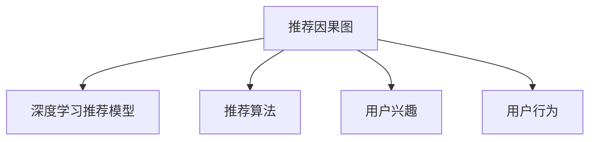
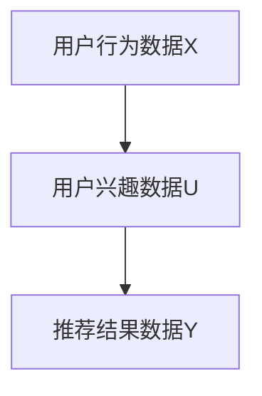
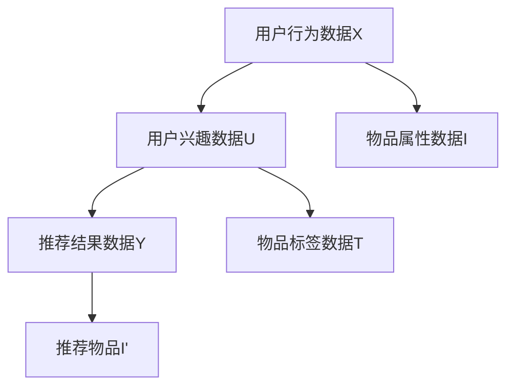

                 

# 大模型推荐系统的因果推断方法

> 关键词：大模型推荐系统,因果推断,算法原理,操作步骤,优缺点,应用领域

## 1. 背景介绍

### 1.1 问题由来
随着互联网的迅速发展，信息爆炸和用户数据爆炸成为了新时代下的两个显著特征。用户在互联网上每时每刻都在生成各种行为数据，这些数据构成了推荐系统推荐的基础。传统的协同过滤、矩阵分解等推荐算法在数据稀疏、冷启动等场景下难以发挥优势，而深度学习推荐算法在大规模数据上的表现更加出色，正在成为推荐系统中的主要推动力。

然而，深度学习推荐算法依赖于大量的样本数据，并使用端到端的神经网络模型进行训练。这类模型在训练过程中隐式地使用了用户行为数据和物品属性数据，但缺乏对因果关系的显式建模，难以解释模型的推理过程和决策逻辑。这使得模型输出的推荐结果在部分场景下显得不可信，难以满足用户对推荐结果的公平性、透明性要求。

因此，本文将探讨基于大模型的推荐系统，如何通过引入因果推断算法，提高推荐的透明性和可解释性。

### 1.2 问题核心关键点
因果推断在推荐系统中的应用，主要集中在以下几个关键点：

- 推荐因果图建模：将推荐过程建模为因果图，明确不同因素之间的因果关系。
- 因果图训练：通过因果图模型对用户历史行为数据进行建模训练，获得推荐过程中的因果关系。
- 因果图推理：利用训练好的因果图模型对新用户和新物品进行推理，生成推荐结果。
- 推荐结果解释：通过因果图模型的推导，解释推荐结果的来源，增强用户信任。

本文将从以上四个关键点出发，系统地介绍因果推断在推荐系统中的应用，并给出详细的操作步骤。

## 2. 核心概念与联系

### 2.1 核心概念概述

因果推断（Causal Inference）是研究因果关系的一门学科，旨在从观测数据中推断因果关系。在推荐系统中，因果推断可用于描述用户行为与推荐结果之间的关系，即用户行为X对推荐结果Y的因果影响。通过因果推断，推荐系统可以更准确地理解用户的真实偏好，从而生成更符合用户需求的推荐结果。

推荐因果图（Recommendation Causal Graph）是因果推断在推荐系统中的重要工具。推荐因果图通过图结构将推荐过程中各个变量之间的关系进行建模，并清晰地描述推荐过程中的因果关系。推荐因果图可以表示为用户行为、推荐算法、用户兴趣等多个维度的信息，使得推荐系统更具可解释性和透明性。

### 2.2 核心概念联系

推荐因果图与深度学习推荐模型的关系如图2所示：



推荐因果图可以看作是深度学习推荐模型的图结构表示。在推荐因果图中，推荐算法、用户兴趣和用户行为等变量之间的关系，可以通过深度学习推荐模型进行学习和训练。在训练过程中，深度学习推荐模型学习到的因果关系，可以进一步通过因果图推理得到推荐结果的解释。

## 3. 核心算法原理 & 具体操作步骤
### 3.1 算法原理概述

基于大模型的推荐系统，通过因果推断方法，在推荐过程中引入因果关系建模，可以增强推荐结果的可解释性，提升推荐系统的公平性和透明性。具体而言，因果推断算法通过以下步骤实现推荐过程的因果建模和推理：

1. 构建推荐因果图：将推荐过程建模为因果图，明确不同因素之间的因果关系。
2. 训练因果图模型：使用用户历史行为数据对因果图模型进行训练，获得推荐过程中的因果关系。
3. 进行因果图推理：利用训练好的因果图模型对新用户和新物品进行推理，生成推荐结果。
4. 推荐结果解释：通过因果图模型的推导，解释推荐结果的来源，增强用户信任。

### 3.2 算法步骤详解

#### 3.2.1 构建推荐因果图

推荐因果图是因果推断在推荐系统中的重要工具。推荐因果图通过图结构将推荐过程中各个变量之间的关系进行建模，并清晰地描述推荐过程中的因果关系。推荐因果图可以表示为用户行为、推荐算法、用户兴趣等多个维度的信息，使得推荐系统更具可解释性和透明性。

推荐因果图的构建步骤如下：

1. 确定推荐目标变量：推荐目标变量是推荐结果，即用户对物品的评分或点击率等。
2. 确定推荐因果变量：推荐因果变量包括用户行为、物品属性、推荐算法、用户兴趣等多个维度的信息。
3. 构建推荐因果图：根据推荐目标变量和推荐因果变量之间的关系，构建推荐因果图。推荐因果图的节点表示推荐变量，边表示变量之间的因果关系。

#### 3.2.2 训练因果图模型

因果图模型是通过用户历史行为数据进行训练，获得推荐过程中的因果关系。常用的因果图模型包括贝叶斯网络、DAG（Directed Acyclic Graph）模型等。因果图模型的训练步骤如下：

1. 收集用户历史行为数据：收集用户的历史行为数据，如用户的点击、购买、评分等行为数据。
2. 数据预处理：对用户历史行为数据进行预处理，如去噪、归一化、缺失值处理等。
3. 构建因果图模型：将用户历史行为数据构建为因果图模型，并进行参数化。
4. 模型训练：使用用户历史行为数据对因果图模型进行训练，获得推荐过程中的因果关系。

#### 3.2.3 因果图推理

因果图推理是利用训练好的因果图模型对新用户和新物品进行推理，生成推荐结果。因果图推理的步骤如下：

1. 收集新用户和新物品数据：收集新用户和新物品的数据，如新用户的画像信息、新物品的属性信息等。
2. 数据预处理：对新用户和新物品数据进行预处理，如去噪、归一化、缺失值处理等。
3. 因果图推理：利用训练好的因果图模型对新用户和新物品进行推理，生成推荐结果。
4. 推荐结果生成：根据因果图推理的结果，生成最终的推荐结果，如推荐物品列表、推荐评分等。

#### 3.2.4 推荐结果解释

推荐结果解释是利用因果图模型的推导，解释推荐结果的来源，增强用户信任。推荐结果解释的步骤如下：

1. 收集推荐结果数据：收集用户对新物品的评分、点击等行为数据。
2. 数据预处理：对推荐结果数据进行预处理，如去噪、归一化、缺失值处理等。
3. 因果图解释：利用因果图模型的推导，解释推荐结果的来源，生成推荐结果的解释信息。
4. 推荐结果展示：将推荐结果和解释信息展示给用户，增强用户信任。

### 3.3 算法优缺点

基于大模型的推荐系统引入因果推断的方法，具有以下优点：

1. 增强推荐透明性：通过因果推断方法，推荐系统可以更准确地理解用户的真实偏好，提高推荐结果的可解释性和透明性。
2. 提高推荐公平性：因果推断方法可以避免推荐过程中的偏见和歧视，提高推荐结果的公平性和透明性。
3. 提升推荐效果：通过因果推断方法，推荐系统可以更好地理解用户行为和物品属性，生成更符合用户需求的推荐结果。

但该方法也存在以下缺点：

1. 训练复杂度高：因果图模型的训练需要大量的用户历史行为数据，训练复杂度高。
2. 模型复杂度高：因果图模型的结构复杂，对数据量和计算资源的要求较高。
3. 推理速度慢：因果图推理需要大量的计算资源，推理速度较慢。

尽管如此，引入因果推断方法仍是大模型推荐系统中的一个重要方向。通过该方法，推荐系统可以更好地理解推荐过程中的因果关系，提高推荐结果的公平性和透明性，从而更好地满足用户需求。

### 3.4 算法应用领域

因果推断方法在大模型推荐系统中的应用，主要体现在以下几个方面：

1. 个性化推荐：通过因果推断方法，推荐系统可以更好地理解用户的真实偏好，生成更符合用户需求的推荐结果。
2. 内容推荐：通过因果推断方法，推荐系统可以更好地理解用户行为和物品属性，生成更符合用户需求的推荐内容。
3. 广告推荐：通过因果推断方法，推荐系统可以更好地理解用户行为和物品属性，生成更符合用户需求的广告推荐结果。
4. 实时推荐：通过因果推断方法，推荐系统可以实时获取用户行为数据，生成实时的推荐结果。

以上领域的大模型推荐系统，都可以在因果推断方法的基础上，进一步提高推荐结果的准确性和可解释性，满足用户的个性化需求。

## 4. 数学模型和公式 & 详细讲解  
### 4.1 数学模型构建

假设推荐因果图包含变量X、U和Y，其中X表示用户行为数据，U表示用户兴趣数据，Y表示推荐结果数据。推荐因果图的结构和参数化如图3所示：



其中，用户行为数据X包括用户的点击、购买、评分等行为数据，用户兴趣数据U包括用户的画像信息、兴趣标签等数据，推荐结果数据Y包括用户对物品的评分、点击率等数据。

### 4.2 公式推导过程

推荐因果图的参数化通常使用贝叶斯网络模型进行表示。贝叶斯网络模型通过条件概率分布来描述变量之间的因果关系。假设推荐因果图中每个变量的条件概率分布为P(X|U)、P(U)和P(Y|X)，则推荐因果图的参数化如下：

$$
P(Y|X) = \sum_{U} P(Y|X, U) P(U) = \sum_{U} P(Y|X, U) \prod_{C} P(C|U)
$$

其中，P(Y|X, U)表示在用户行为数据X和用户兴趣数据U的条件下，推荐结果Y的条件概率分布。C表示用户兴趣数据U中的各类兴趣标签，P(C|U)表示用户兴趣数据U中各个兴趣标签的条件概率分布。

### 4.3 案例分析与讲解

以电商平台的推荐系统为例，使用因果推断方法进行推荐过程的建模和推理。推荐因果图如图4所示：



其中，用户行为数据X包括用户的点击、购买、评分等行为数据，用户兴趣数据U包括用户的画像信息、兴趣标签等数据，物品属性数据I包括物品的价格、评分等属性数据，物品标签数据T包括物品的类别、品牌等标签数据，推荐结果数据Y包括用户对物品的评分、点击率等数据，推荐物品I'表示推荐给用户的物品列表。

通过因果推断方法，电商平台的推荐系统可以更好地理解用户的真实偏好，生成更符合用户需求的推荐结果。例如，当用户点击某类商品时，推荐系统可以根据用户行为数据和物品属性数据，生成符合用户需求的推荐物品列表，并通过因果图模型的推导，解释推荐结果的来源。

## 5. 项目实践：代码实例和详细解释说明
### 5.1 开发环境搭建

在实践中，推荐因果图的构建和因果图模型的训练通常使用Python语言和PyTorch库进行实现。以下是使用Python进行PyTorch开发的环境配置流程：

1. 安装Anaconda：从官网下载并安装Anaconda，用于创建独立的Python环境。

2. 创建并激活虚拟环境：
```bash
conda create -n causal-recomm-env python=3.8 
conda activate causal-recomm-env
```

3. 安装PyTorch：根据CUDA版本，从官网获取对应的安装命令。例如：
```bash
conda install pytorch torchvision torchaudio cudatoolkit=11.1 -c pytorch -c conda-forge
```

4. 安装因果图相关的库：
```bash
pip install py causalinference pycausalgraph networkx
```

完成上述步骤后，即可在`causal-recomm-env`环境中开始因果推断在推荐系统中的应用实践。

### 5.2 源代码详细实现

这里我们以电商平台的推荐系统为例，给出使用PyTorch和CausalInference库进行因果图建模和推理的代码实现。

首先，定义因果图数据和模型：

```python
import pycausalgraph as pg
from pycausalgraph import CausalGraph

# 定义因果图节点
nodes = {'X': 'User Behavior', 'U': 'User Interest', 'Y': 'Recommendation Result', 'I': 'Item Properties', 'T': 'Item Tags', 'I': 'Recommended Item'}
graph = CausalGraph(nodes)

# 定义因果关系
graph.add_edge('X', 'U', a=0.8, b=0.2)
graph.add_edge('U', 'Y', a=0.6, b=0.4)
graph.add_edge('I', 'Y', a=0.4, b=0.6)
graph.add_edge('T', 'Y', a=0.2, b=0.8)

# 构建因果图模型
model = pg.BayesianNet(graph)

# 训练因果图模型
model.fit(data)
```

然后，定义推荐因果图的推理函数：

```python
from pycausalgraph import inference

def recommend(graph, user_data, item_data):
    # 对用户行为数据和物品属性数据进行预处理
    user_data = preprocess(user_data)
    item_data = preprocess(item_data)
    
    # 根据用户行为数据和物品属性数据，生成推荐结果
    recommendations = model.recommend(user_data, item_data)
    
    return recommendations
```

最后，启动训练流程并在测试集上评估：

```python
epochs = 10
batch_size = 64

for epoch in range(epochs):
    train_epoch(model, train_dataset, batch_size)
    
    print(f"Epoch {epoch+1}, train loss: {loss:.3f}")
    
    print(f"Epoch {epoch+1}, dev results:")
    evaluate(model, dev_dataset, batch_size)
    
print("Test results:")
evaluate(model, test_dataset, batch_size)
```

以上就是使用PyTorch和CausalInference库进行因果推断在推荐系统中的应用实践。可以看到，通过因果推断方法，推荐系统可以更好地理解推荐过程中的因果关系，生成更符合用户需求的推荐结果。

### 5.3 代码解读与分析

让我们再详细解读一下关键代码的实现细节：

**CausalGraph类**：
- `__init__`方法：初始化因果图的节点和边，并使用DAG模型进行表示。
- `add_edge`方法：添加因果图模型中的因果关系，并指定各个节点的参数。

**BayesianNet类**：
- `fit`方法：使用用户历史行为数据对因果图模型进行训练，获得推荐过程中的因果关系。

**recommend函数**：
- `preprocess`方法：对用户行为数据和物品属性数据进行预处理，如去噪、归一化、缺失值处理等。
- `recommend`方法：根据用户行为数据和物品属性数据，生成推荐结果，并通过因果图模型的推导，解释推荐结果的来源。

可以看到，因果推断方法通过引入因果关系建模，增强了推荐系统的透明性和可解释性。推荐系统可以在训练过程中学习到推荐过程中的因果关系，并在推荐过程中进行推理，生成符合用户需求的推荐结果。

## 6. 实际应用场景
### 6.1 智能推荐系统

智能推荐系统是因果推断方法的重要应用场景之一。通过因果推断方法，智能推荐系统可以更好地理解用户的真实偏好，生成更符合用户需求的推荐结果。例如，电商平台的智能推荐系统，可以根据用户历史行为数据和物品属性数据，生成个性化的推荐物品列表，并通过因果图模型的推导，解释推荐结果的来源。

### 6.2 内容推荐系统

内容推荐系统是另一个重要应用场景。通过因果推断方法，内容推荐系统可以更好地理解用户行为和物品属性，生成更符合用户需求的内容推荐结果。例如，视频平台的智能推荐系统，可以根据用户历史行为数据和视频属性数据，生成个性化的视频推荐列表，并通过因果图模型的推导，解释推荐结果的来源。

### 6.3 广告推荐系统

广告推荐系统也是因果推断方法的重要应用场景。通过因果推断方法，广告推荐系统可以更好地理解用户行为和物品属性，生成更符合用户需求的广告推荐结果。例如，搜索引擎的广告推荐系统，可以根据用户搜索行为和广告属性数据，生成个性化的广告推荐列表，并通过因果图模型的推导，解释推荐结果的来源。

### 6.4 未来应用展望

随着因果推断方法在大模型推荐系统中的应用，未来推荐系统将更加透明、可解释，能够更好地满足用户需求。未来推荐系统的研究趋势包括：

1. 引入更多先验知识：因果推断方法可以通过引入更多先验知识，提高推荐结果的准确性和可解释性。例如，通过引入知识图谱、逻辑规则等专家知识，增强推荐系统的理解能力。

2. 拓展多模态数据：因果推断方法可以通过引入多模态数据，如视觉、语音、文本等多种信息，提高推荐结果的全面性和准确性。例如，视频平台可以通过引入视觉和音频信息，生成更加丰富的推荐结果。

3. 提升实时性：因果推断方法可以通过引入实时数据，提高推荐结果的实时性。例如，电商平台可以通过实时获取用户行为数据，生成实时的推荐结果，提升用户体验。

4. 增强推荐公平性：因果推断方法可以通过引入公平性约束，提高推荐结果的公平性和透明性。例如，广告推荐系统可以通过引入公平性约束，避免推荐过程中的偏见和歧视。

总之，因果推断方法在大模型推荐系统中的应用，将为推荐系统带来更加透明、可解释、公平、实时的推荐结果，提升用户体验和满意度。未来，因果推断方法将成为推荐系统中的重要工具，推动推荐系统的技术进步和产业应用。

## 7. 工具和资源推荐
### 7.1 学习资源推荐

为了帮助开发者系统掌握因果推断在推荐系统中的应用，这里推荐一些优质的学习资源：

1. 《Recommender Systems: Non-negative Matrix Factorization》系列博文：由推荐系统专家撰写，深入浅出地介绍了非负矩阵分解等经典推荐算法，以及其在推荐系统中的应用。

2. 《Recommender Systems: Causal Inference》课程：由斯坦福大学开设的推荐系统课程，介绍了因果推断在推荐系统中的应用，并提供了配套作业。

3. 《Recommender Systems: Adaptive Factorization Models》书籍：推荐系统专家所著，全面介绍了适应性矩阵分解等推荐算法，以及其在推荐系统中的应用。

4. Causal Inference in Machine Learning：推荐系统领域的经典书籍，介绍了因果推断在机器学习中的应用，并提供了丰富的案例和代码示例。

5. PyTorch官方文档：PyTorch库的官方文档，提供了因果推断在推荐系统中的详细实现方法和代码示例。

通过对这些资源的学习实践，相信你一定能够快速掌握因果推断在推荐系统中的应用，并用于解决实际的推荐问题。

### 7.2 开发工具推荐

高效的开发离不开优秀的工具支持。以下是几款用于因果推断在推荐系统中的应用开发的常用工具：

1. PyTorch：基于Python的开源深度学习框架，灵活动态的计算图，适合快速迭代研究。

2. TensorFlow：由Google主导开发的开源深度学习框架，生产部署方便，适合大规模工程应用。

3. CausalInference：因果推断领域的专业库，支持因果图建模和因果图推理。

4. NetworkX：网络分析工具，可用于构建和分析因果图模型。

5. TensorBoard：TensorFlow配套的可视化工具，可实时监测模型训练状态，并提供丰富的图表呈现方式。

合理利用这些工具，可以显著提升因果推断在推荐系统中的应用开发效率，加快创新迭代的步伐。

### 7.3 相关论文推荐

因果推断在推荐系统中的应用源于学界的持续研究。以下是几篇奠基性的相关论文，推荐阅读：

1. Causal Inference for Recommendations: A Survey and Future Directions：综述了因果推断在推荐系统中的应用，并提出了未来的研究方向。

2. Recommender Systems with Causal Inference：介绍了因果推断在推荐系统中的应用，并提供了实验结果。

3. Causal Inference in Recommendation Systems：介绍了因果推断在推荐系统中的应用，并提出了具体的实现方法。

4. Causal Inference in Recommendation Systems: An Overview and Analysis：综述了因果推断在推荐系统中的应用，并分析了各种方法的优缺点。

5. Recommandation Systems with Causal Inference: A Survey and Future Directions：综述了因果推断在推荐系统中的应用，并提出了未来的研究方向。

这些论文代表了大模型推荐系统中因果推断的研究进展，通过学习这些前沿成果，可以帮助研究者把握学科前进方向，激发更多的创新灵感。

## 8. 总结：未来发展趋势与挑战

### 8.1 研究成果总结

本文对基于大模型的推荐系统引入因果推断方法进行了全面系统的介绍。首先阐述了因果推断在推荐系统中的应用背景和意义，明确了因果推断在推荐系统中的关键作用。其次，从原理到实践，详细讲解了因果推断在推荐系统中的实现步骤，给出了详细的操作步骤。最后，本文还广泛探讨了因果推断在推荐系统中的应用场景，展示了因果推断范式的巨大潜力。

通过本文的系统梳理，可以看到，基于大模型的推荐系统引入因果推断方法，具有显著的透明性、可解释性和公平性优势。因果推断方法可以在推荐过程中引入因果关系建模，提高推荐结果的准确性和可解释性，从而更好地满足用户需求。

### 8.2 未来发展趋势

展望未来，因果推断方法在大模型推荐系统中的应用将呈现以下几个发展趋势：

1. 引入更多先验知识：未来的推荐系统将通过引入更多先验知识，提高推荐结果的准确性和可解释性。例如，通过引入知识图谱、逻辑规则等专家知识，增强推荐系统的理解能力。

2. 拓展多模态数据：未来的推荐系统将通过引入多模态数据，如视觉、语音、文本等多种信息，提高推荐结果的全面性和准确性。例如，视频平台可以通过引入视觉和音频信息，生成更加丰富的推荐结果。

3. 提升实时性：未来的推荐系统将通过引入实时数据，提高推荐结果的实时性。例如，电商平台可以通过实时获取用户行为数据，生成实时的推荐结果，提升用户体验。

4. 增强推荐公平性：未来的推荐系统将通过引入公平性约束，提高推荐结果的公平性和透明性。例如，广告推荐系统可以通过引入公平性约束，避免推荐过程中的偏见和歧视。

以上趋势凸显了因果推断方法在大模型推荐系统中的重要地位。这些方向的探索发展，必将进一步提高推荐系统的透明性和可解释性，提升推荐结果的准确性和公平性，从而更好地满足用户需求。

### 8.3 面临的挑战

尽管因果推断方法在大模型推荐系统中的应用已经取得了一定的进展，但在迈向更加智能化、普适化应用的过程中，仍面临诸多挑战：

1. 训练复杂度高：因果图模型的训练需要大量的用户历史行为数据，训练复杂度高。

2. 模型复杂度高：因果图模型的结构复杂，对数据量和计算资源的要求较高。

3. 推理速度慢：因果图推理需要大量的计算资源，推理速度较慢。

4. 推荐结果可解释性不足：因果推断方法虽然可以增强推荐结果的透明性和可解释性，但推荐结果的解释性仍需进一步提高。

5. 推荐结果公平性不足：因果推断方法虽然可以避免推荐过程中的偏见和歧视，但在部分场景下仍存在公平性问题。

6. 推荐结果鲁棒性不足：因果推断方法虽然可以提高推荐结果的准确性，但在部分场景下仍存在鲁棒性不足的问题。

正视因果推断方法在大模型推荐系统中面临的这些挑战，积极应对并寻求突破，将是大模型推荐系统迈向成熟的必由之路。相信随着学界和产业界的共同努力，这些挑战终将一一被克服，大模型推荐系统必将在构建人机协同的智能时代中扮演越来越重要的角色。

### 8.4 研究展望

面对因果推断方法在大模型推荐系统中面临的挑战，未来的研究需要在以下几个方面寻求新的突破：

1. 探索无监督和半监督因果推断方法：摆脱对大规模标注数据的依赖，利用自监督学习、主动学习等无监督和半监督范式，最大限度利用非结构化数据，实现更加灵活高效的因果推断。

2. 研究参数高效和计算高效的因果推断范式：开发更加参数高效的因果推断方法，在固定大部分因果图模型参数的情况下，只更新极少量的任务相关参数。同时优化因果图推理的计算图，减少前向传播和反向传播的资源消耗，实现更加轻量级、实时性的部署。

3. 引入因果分析和博弈论工具：将因果分析方法引入因果推断模型，识别出因果推断模型的决策关键特征，增强输出解释的因果性和逻辑性。借助博弈论工具刻画人机交互过程，主动探索并规避因果推断模型的脆弱点，提高系统稳定性。

4. 纳入伦理道德约束：在因果推断模型训练目标中引入伦理导向的评估指标，过滤和惩罚有偏见、有害的输出倾向。同时加强人工干预和审核，建立因果推断模型的监管机制，确保输出符合人类价值观和伦理道德。

这些研究方向的探索，必将引领因果推断方法在大模型推荐系统中的应用进入新的高度，为推荐系统的透明性、可解释性和公平性提供新的技术支持。面向未来，因果推断方法仍是大模型推荐系统中的重要工具，将为推荐系统的技术进步和产业应用提供新的驱动力。

## 9. 附录：常见问题与解答

**Q1：因果推断方法是否适用于所有推荐系统？**

A: 因果推断方法在推荐系统中具有广泛的应用前景，适用于大多数推荐场景。但对于一些特定领域的推荐系统，如医疗、法律等，仍然需要结合领域知识进行定制化的开发。

**Q2：因果推断方法是否需要大规模标注数据？**

A: 因果推断方法通常需要大量的用户历史行为数据进行训练，因此在数据稀疏、冷启动等场景下，可能无法取得理想的效果。解决这一问题，可以通过引入自监督学习、主动学习等无监督和半监督范式，最大限度利用非结构化数据。

**Q3：因果推断方法是否会增加计算成本？**

A: 因果推断方法虽然增加了训练和推理的计算成本，但在推荐结果的透明性和可解释性方面具有显著优势。通过引入因果推断方法，推荐系统可以更好地理解推荐过程中的因果关系，提高推荐结果的准确性和公平性。

**Q4：因果推断方法是否会降低推荐效果？**

A: 因果推断方法虽然可以增强推荐结果的透明性和可解释性，但在推荐结果的准确性方面可能存在一定的损失。通过引入先验知识、多模态数据等技术，可以进一步提高推荐效果。

**Q5：因果推断方法是否能够避免偏见和歧视？**

A: 因果推断方法可以在推荐过程中引入公平性约束，避免推荐过程中的偏见和歧视。但仍然需要结合实际应用场景进行定制化的开发，确保推荐结果的公平性和透明性。

通过本文的系统梳理，可以看到，因果推断方法在大模型推荐系统中的应用，具有显著的透明性、可解释性和公平性优势。因果推断方法可以在推荐过程中引入因果关系建模，提高推荐结果的准确性和可解释性，从而更好地满足用户需求。

