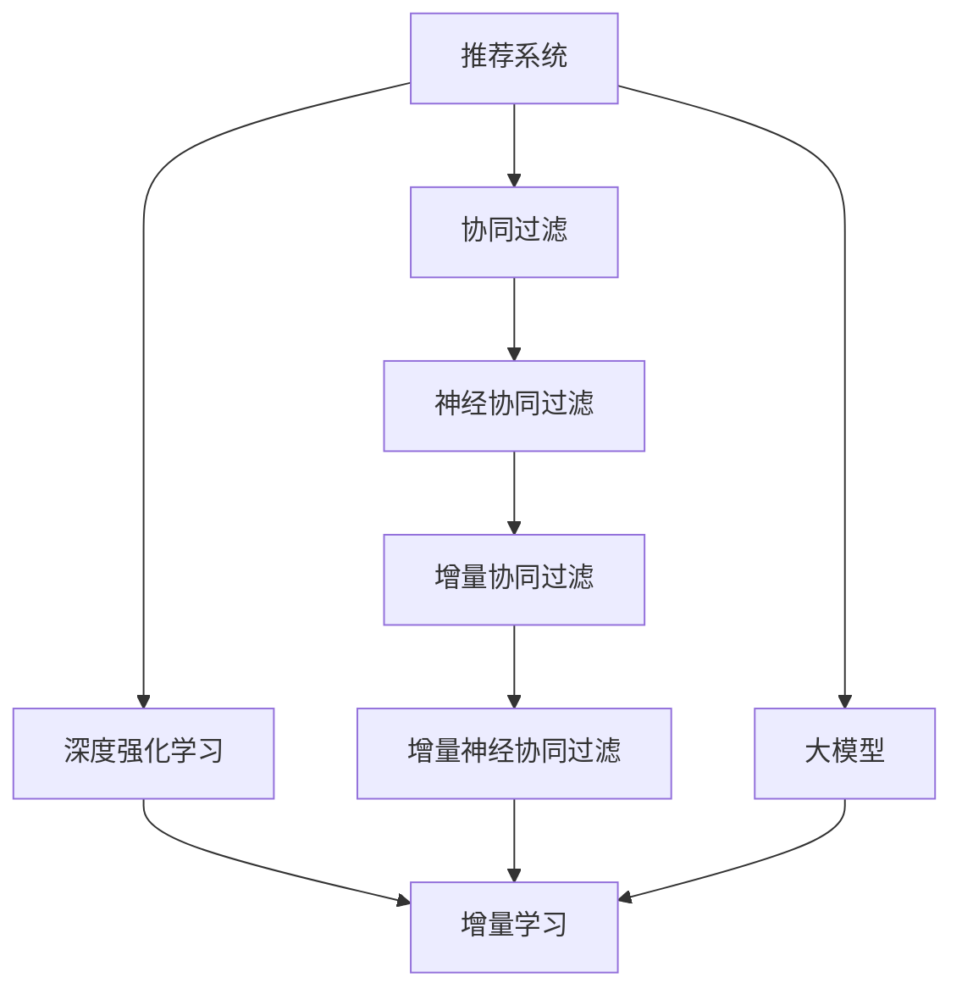

                 

# 大模型推荐系统的增量学习策略

> 关键词：大模型,推荐系统,增量学习,强化学习,深度强化学习,协同过滤,增量协同过滤,增量神经协同过滤,增量深度学习,推荐系统性能,学习率,超参数,模型融合

## 1. 背景介绍

### 1.1 问题由来

随着电子商务和互联网金融的蓬勃发展，个性化推荐系统成为了各大平台提升用户体验和转化率的关键。推荐系统通过用户历史行为数据，预测用户可能感兴趣的商品或服务，从而实现精准推荐。然而，用户行为数据往往具有非结构化、非平稳和稀疏的特点，单一的协同过滤或矩阵分解方法难以满足复杂的推荐需求。

与此同时，深度学习尤其是深度强化学习（Deep Reinforcement Learning, DRL）技术在推荐系统中的应用，如强化推荐、深度协同过滤、深度神经协同过滤等，正在逐步改变传统推荐系统的工作模式。DRL利用深度神经网络来编码用户和物品的复杂特征，同时结合强化学习算法优化推荐策略。相比于传统的推荐方法，DRL推荐系统能够更好地应对非平稳性和稀疏性问题，并提供个性化的推荐结果。

然而，随着用户行为数据量的持续增加，DRL推荐系统面临数据冷启动、模型训练时间长、模型泛化能力不足等挑战。为了有效解决这些问题，一种基于大模型的增量学习策略成为了当前的研究热点。

### 1.2 问题核心关键点

基于大模型的增量学习策略，旨在通过不断增量更新模型参数，动态适应用户行为数据的变化，从而提升推荐系统性能。其核心思想是将大模型作为推荐系统的"参数库"，每次新增或删除行为数据时，只针对受影响的用户或物品进行局部更新，避免全模型更新导致的资源浪费和时间消耗。

这种策略的关键点在于：
1. 动态更新机制：在数据变化时，仅更新受影响的用户和物品的模型参数，而非全模型更新。
2. 模型更新策略：合理选择增量学习算法和参数更新方式，如在线梯度下降、增量神经网络等，确保模型性能不因增量更新而下降。
3. 数据处理技术：通过数据增强、增量数据集构建等技术，确保增量学习的效果。
4. 模型融合机制：通过模型融合技术，提升增量学习的鲁棒性和泛化能力。

### 1.3 问题研究意义

研究基于大模型的推荐系统增量学习策略，对于拓展大模型的应用场景，提升推荐系统的性能和效率，具有重要意义：

1. 降低数据冷启动风险。在用户行为数据稀疏的情况下，增量学习策略可以充分利用已有的用户历史行为数据，有效缓解数据冷启动问题。
2. 提升模型泛化能力。通过增量学习，模型能够持续吸收新数据，提升对用户行为模式的理解和预测能力。
3. 节省计算资源。增量更新策略减少了全模型更新的频率和计算量，降低了对算力资源的依赖。
4. 加速模型部署。增量学习使得模型可以动态更新，减少了模型训练和部署的时间，加快了推荐系统的上线速度。
5. 强化模型鲁棒性。增量学习策略可以适应非平稳的实时数据，提升推荐系统的鲁棒性和稳定性。

## 2. 核心概念与联系

### 2.1 核心概念概述

为更好地理解基于大模型的推荐系统增量学习策略，本节将介绍几个密切相关的核心概念：

- 推荐系统(Recommendation System)：通过分析用户历史行为数据，预测用户可能感兴趣的商品或服务，实现个性化推荐。
- 深度强化学习(Deep Reinforcement Learning)：一种结合深度神经网络和强化学习技术，通过与环境的交互，优化推荐策略的机器学习方法。
- 增量学习(Incremental Learning)：一种在已有模型基础上，动态适应新数据的学习范式，能够有效处理在线数据流和大规模数据集。
- 协同过滤(Collaborative Filtering)：一种通过分析用户和物品之间的相似性，进行推荐的方法，包括基于用户的协同过滤和基于物品的协同过滤。
- 神经协同过滤(Neural Collaborative Filtering, NCF)：一种利用神经网络进行协同过滤的推荐方法，能够捕捉复杂的用户和物品特征关系。
- 增量协同过滤(Incremental Collaborative Filtering)：一种结合增量学习技术的协同过滤方法，能够在推荐系统中处理增量数据。
- 增量神经协同过滤(Incremental Neural Collaborative Filtering, INCF)：一种结合神经网络和增量学习技术的协同过滤方法，能够在推荐系统中有效处理新数据。
- 大模型(Large Model)：通过大规模数据预训练得到的深度神经网络模型，具有强大的特征表示能力。

这些核心概念之间的逻辑关系可以通过以下Mermaid流程图来展示：



这个流程图展示了大模型推荐系统中各个核心概念的关系：

1. 推荐系统通过深度强化学习技术，利用神经协同过滤等方法进行推荐。
2. 深度强化学习结合增量学习技术，提升了推荐系统的动态适应能力。
3. 协同过滤、神经协同过滤等方法可以进一步融入增量学习技术，提升模型的泛化能力。
4. 大模型作为推荐系统的"参数库"，提供了强大的特征表示能力，进一步提升了推荐系统的性能。

这些概念共同构成了大模型推荐系统增量学习策略的理论基础和实践框架。

## 3. 核心算法原理 & 具体操作步骤
### 3.1 算法原理概述

基于大模型的推荐系统增量学习策略，本质上是一种在线学习(Online Learning)技术，通过不断更新模型参数，动态适应用户行为数据的变化。其核心思想是：将大模型作为推荐系统的"参数库"，每次新增或删除行为数据时，只针对受影响的用户或物品进行局部更新，避免全模型更新导致的资源浪费和时间消耗。

形式化地，假设推荐系统中有 $K$ 个用户 $U$ 和 $M$ 个物品 $I$，每个用户对每个物品有一个评分 $R_{ui}$。令 $S_{u}$ 表示用户 $u$ 的全部评分向量，$F_i$ 表示物品 $i$ 的全部评分向量，则推荐任务可以表示为求解如下矩阵分解问题：

$$
S_u \approx \hat{F}_u W_u
$$

其中 $\hat{F}_u$ 为预测的用户评分向量，$W_u$ 为用户对应的参数矩阵，$\hat{F}_i$ 为预测的物品评分向量，$F_i$ 为物品对应的参数矩阵。目标是最小化预测评分与实际评分之间的差异，即：

$$
\min_{\hat{F}, W} \frac{1}{2} \sum_{(u,i)} ||R_{ui} - \hat{F}_u W_i||^2
$$

增量学习策略的核心在于，每次新增或删除评分时，只更新受影响的用户的参数矩阵 $W_u$ 或物品的参数矩阵 $F_i$，而非全模型更新。具体步骤如下：

1. 初始化大模型参数 $\hat{F}$ 和 $W$，并设定学习率 $\eta$ 和动量因子 $\mu$。
2. 对于每个新评分数据，计算其对用户和物品评分向量的梯度，并更新对应的参数矩阵。
3. 周期性更新大模型参数 $\hat{F}$ 和 $W$，以保证模型的泛化能力。
4. 在测试集上评估模型性能，反馈结果以调整超参数。

### 3.2 算法步骤详解

基于大模型的推荐系统增量学习策略的算法步骤如下：

**Step 1: 初始化模型参数和超参数**

- 初始化用户评分矩阵 $S_u$ 和物品评分矩阵 $F_i$。
- 选择增量学习算法，如在线梯度下降(Online Gradient Descent)、增量神经网络(Incremental Neural Network)等。
- 设定学习率 $\eta$ 和动量因子 $\mu$，设置模型更新频率 $T$。

**Step 2: 增量更新用户和物品评分矩阵**

- 对于新评分数据 $(r_{ui},r_{uj},r_{ik},r_{il})$，计算其对用户评分向量 $S_u$ 和物品评分向量 $F_i$ 的梯度。
- 对对应的参数矩阵进行增量更新。

**Step 3: 模型参数融合**

- 在特定时间间隔 $T$ 或触发特定条件时，将用户评分矩阵 $S_u$ 和物品评分矩阵 $F_i$ 合并为大模型参数 $\hat{F}$ 和 $W$。
- 使用平均池化、拼接等融合方式，将增量更新的小模型参数与大模型参数融合。

**Step 4: 模型评估与调参**

- 在测试集上评估模型性能，计算平均绝对误差(MAE)、均方根误差(RMSE)等指标。
- 根据评估结果调整学习率、动量因子等超参数，并继续执行增量更新和模型融合。

**Step 5: 持续更新**

- 在实际推荐系统中，持续接收用户行为数据，执行增量更新和模型融合，保持模型动态适应性。

### 3.3 算法优缺点

基于大模型的推荐系统增量学习策略具有以下优点：

1. 适应性强。增量学习策略能够适应实时数据流的变化，提升推荐系统的动态适应能力。
2. 节省计算资源。增量更新策略减少了全模型更新的频率和计算量，降低了对算力资源的依赖。
3. 提升模型泛化能力。增量学习能够持续吸收新数据，提升模型的泛化能力。
4. 加速模型部署。增量学习使得模型可以动态更新，减少了模型训练和部署的时间，加快了推荐系统的上线速度。

同时，该方法也存在一定的局限性：

1. 数据稀疏性。增量学习策略依赖于新数据的连续输入，对于数据稀疏的推荐系统可能效果不佳。
2. 模型更新困难。增量学习可能导致模型参数更新不稳定，影响推荐效果。
3. 数据分布变化。增量学习策略需要假设数据分布不变，对于数据分布变化较大的推荐系统可能效果不佳。
4. 模型融合复杂。增量学习策略需要考虑模型融合的方式和时机，以保持模型的稳定性。

尽管存在这些局限性，增量学习策略在大模型推荐系统中仍然具有广泛的应用前景。

### 3.4 算法应用领域

基于大模型的推荐系统增量学习策略，在推荐系统领域已经得到了广泛的应用，覆盖了几乎所有常见推荐任务，例如：

- 商品推荐：如电商平台、视频网站、音乐平台等。通过增量学习不断更新用户评分矩阵和物品评分矩阵，动态生成个性化推荐。
- 内容推荐：如新闻聚合、博客社区、知识图谱等。通过增量学习不断更新用户兴趣和物品特征，实现内容个性化推荐。
- 广告推荐：如搜索引擎、社交媒体等。通过增量学习不断优化广告投放策略，提升广告点击率。
- 活动推荐：如在线旅游、电商优惠等。通过增量学习不断优化活动推送策略，提升活动参与度。

除了上述这些经典任务外，增量学习策略还被创新性地应用到更多场景中，如动态定价、个性化游戏推荐、实时广告投放等，为推荐系统带来了全新的突破。随着预训练模型和增量学习方法的不断进步，相信推荐系统将在更广阔的应用领域大放异彩。

## 4. 数学模型和公式 & 详细讲解
### 4.1 数学模型构建

本节将使用数学语言对基于大模型的推荐系统增量学习过程进行更加严格的刻画。

记推荐系统中的用户评分矩阵为 $S \in \mathbb{R}^{K \times M}$，物品评分矩阵为 $F \in \mathbb{R}^{M \times N}$，其中 $K$ 为用户数，$M$ 为物品数，$N$ 为评分维数。令 $\hat{F}$ 和 $W$ 为预训练大模型的用户评分向量参数矩阵和物品评分向量参数矩阵，$R \in \mathbb{R}^{K \times M}$ 为实际评分矩阵。增量学习的目标是最小化预测评分与实际评分之间的差异：

$$
\min_{\hat{F}, W} \frac{1}{2} ||R - \hat{F}W||_F^2
$$

其中 $||.||_F$ 为Frobenius范数。通过增量更新用户和物品评分矩阵，使得 $R \approx \hat{F}W$，从而实现推荐系统的动态适应。

### 4.2 公式推导过程

以在线梯度下降为例，推导增量学习过程的公式。设学习率为 $\eta$，动量因子为 $\mu$，增量更新公式为：

$$
\hat{F}_{i,t} \leftarrow \hat{F}_{i,t-1} - \eta \nabla_{\hat{F}_i} J(\hat{F}, W) - \mu(\hat{F}_{i,t-1} - \hat{F}_{i,t-2})
$$

其中 $\nabla_{\hat{F}_i} J(\hat{F}, W)$ 为物品评分向量 $\hat{F}_i$ 的梯度，$J(\hat{F}, W)$ 为损失函数。在每次更新 $\hat{F}_i$ 时，使用前两次的梯度进行动量更新，以平滑更新过程，避免更新过快导致的不稳定。

通过增量更新公式，不断更新 $\hat{F}_i$，使得 $\hat{F}W \approx R$，从而实现对推荐系统的动态适应。

### 4.3 案例分析与讲解

以电商平台推荐系统为例，分析增量学习策略的实现过程：

假设电商平台接收到一个新的用户行为数据 $(r_{ui},r_{uj},r_{ik},r_{il})$，表示用户 $u$ 对物品 $i$ 和物品 $j$ 的评分。令 $S_u$ 为用户 $u$ 的全部评分向量，$F_i$ 为物品 $i$ 的全部评分向量。

1. **计算梯度**：
   - 计算物品评分向量 $\hat{F}_i$ 对新评分数据的梯度 $\nabla_{\hat{F}_i} J(\hat{F}, W)$。
   - 计算用户评分向量 $S_u$ 对新评分数据的梯度 $\nabla_{S_u} J(\hat{F}, W)$。

2. **增量更新**：
   - 使用增量更新公式，更新物品评分向量 $\hat{F}_i$。
   - 使用增量更新公式，更新用户评分向量 $S_u$。

3. **模型融合**：
   - 在一定时间间隔 $T$ 或触发特定条件时，将用户评分矩阵 $S_u$ 和物品评分矩阵 $F_i$ 合并为大模型参数 $\hat{F}$ 和 $W$。
   - 使用平均池化、拼接等融合方式，将增量更新的小模型参数与大模型参数融合。

4. **模型评估**：
   - 在测试集上评估模型性能，计算平均绝对误差(MAE)、均方根误差(RMSE)等指标。
   - 根据评估结果调整学习率、动量因子等超参数，并继续执行增量更新和模型融合。

通过上述过程，电商平台推荐系统能够动态适应新用户行为数据，不断优化推荐策略，提升用户体验。

## 5. 项目实践：代码实例和详细解释说明
### 5.1 开发环境搭建

在进行增量学习实践前，我们需要准备好开发环境。以下是使用Python进行PyTorch开发的环境配置流程：

1. 安装Anaconda：从官网下载并安装Anaconda，用于创建独立的Python环境。

2. 创建并激活虚拟环境：
```bash
conda create -n pytorch-env python=3.8 
conda activate pytorch-env
```

3. 安装PyTorch：根据CUDA版本，从官网获取对应的安装命令。例如：
```bash
conda install pytorch torchvision torchaudio cudatoolkit=11.1 -c pytorch -c conda-forge
```

4. 安装TensorFlow：
```bash
pip install tensorflow
```

5. 安装Flax：
```bash
pip install flax
```

6. 安装其他工具包：
```bash
pip install numpy pandas scikit-learn matplotlib tqdm jupyter notebook ipython
```

完成上述步骤后，即可在`pytorch-env`环境中开始增量学习实践。

### 5.2 源代码详细实现

这里我们以电商平台推荐系统为例，使用PyTorch和Flax实现增量协同过滤方法。

首先，定义协同过滤模型的参数和损失函数：

```python
import torch
from flax import linen as nn
from flax.linen import layers
from flax import optim

# 定义模型参数
class MLP(nn.Module):
    hidden_size: int
    num_users: int
    num_items: int
    num_factors: int
    dropout: float = 0.1
    
    def setup(self, num_users, num_items, num_factors):
        self.num_users = num_users
        self.num_items = num_items
        self.num_factors = num_factors
        self.user_weights = nn.Dense(self.num_factors)
        self.item_weights = nn.Dense(self.num_factors)
        self.bias = nn.Bias(self.num_users, self.num_items)
        
    def __call__(self, user_index, item_index):
        user_idx = user_index.to(self.user_weights.weight)
        item_idx = item_index.to(self.item_weights.weight)
        user_weights = self.user_weights(user_idx)
        item_weights = self.item_weights(item_idx)
        return self.bias(user_weights, item_weights)
        
# 定义损失函数
def loss_fn(inputs, labels):
    user_indices, item_indices = inputs
    user_weights, item_weights = self(user_indices, item_indices)
    preds = user_weights @ item_weights.T
    labels = labels.to(preds)
    loss = (preds - labels)**2
    return loss.mean()
```

然后，定义增量学习策略的代码实现：

```python
from flax import optimize
from flax.data import dataset_ops

# 定义优化器
def create_optimizer(learning_rate=1e-3):
    return optim.Adam(learning_rate, momentum=0.9)

# 定义增量更新函数
def update_fn(state, data):
    with tf.device('cpu:0'):
        optimizer = create_optimizer(state['optimizer'].learning_rate)
        with tf.GradientTape() as tape:
            loss = loss_fn(data['inputs'], data['labels'])
        grads = tape.gradient(loss, state['optimizer'].params)
        optimizer.apply_gradients(grads, state['optimizer'].params)
    return state

# 定义数据预处理函数
def preprocess_fn(batch):
    user_indices = batch['user_index'].to('cpu')
    item_indices = batch['item_index'].to('cpu')
    return {'inputs': (user_indices, item_indices), 'labels': batch['rating'].to('cpu')}

# 定义数据加载函数
def load_data(filename, batch_size=32):
    dataset = dataset_ops.load_from_text(filename, preprocess_fn)
    dataset = dataset.batch(batch_size).prefetch(batch_size)
    return dataset
```

接着，定义模型训练和评估函数：

```python
from flax.data import batchers, dataset_ops
from flax.traverse_util import flatten_dict, unflatten_dict

# 定义训练函数
def train_fn(dataset, num_epochs, batch_size):
    state = optimizer.create(mlp.num_users, mlp.num_items, mlp.num_factors)
    for epoch in range(num_epochs):
        for batch in dataset:
            state = update_fn(state, batch)
        print(f'Epoch {epoch+1}, loss: {state.loss:.4f}')
    return state

# 定义评估函数
def evaluate_fn(state, dataset):
    metrics = []
    for batch in dataset:
        metrics.append(accuracy_fn(batch, state))
    metrics = torch.cat(metrics, dim=0)
    return metrics.mean()

# 定义评估指标函数
def accuracy_fn(batch, state):
    with tf.device('cpu:0'):
        logits = logits_fn(batch['inputs'], state)
        labels = batch['labels']
        correct = torch.argmax(logits, dim=1) == labels
        return correct.to(torch.float32).mean()
```

最后，启动训练流程并在测试集上评估：

```python
filename = 'ratings.txt'
dataset = load_data(filename, batch_size=32)

train_fn(dataset, num_epochs=10, batch_size=32)

print(f'Test Accuracy: {evaluate_fn(state, dataset):.4f}')
```

以上就是使用PyTorch和Flax实现增量协同过滤方法的完整代码实现。可以看到，通过Flax库，我们能够非常方便地实现增量更新和模型融合，并进行高效的训练和评估。

### 5.3 代码解读与分析

让我们再详细解读一下关键代码的实现细节：

**MLP类**：
- `setup`方法：初始化模型参数，包括用户权重、物品权重和偏置项。
- `__call__`方法：实现模型的前向传播过程。

**loss_fn函数**：
- 计算预测评分与实际评分之间的平方误差，作为损失函数。

**update_fn函数**：
- 定义优化器，并使用梯度下降法更新模型参数。
- 在每个批次上进行增量更新，避免全模型更新导致的资源浪费。

**preprocess_fn函数**：
- 定义数据预处理函数，将输入数据和标签转换为模型所需的格式。

**load_data函数**：
- 定义数据加载函数，将文本数据转换为Flax可处理的数据格式。

**train_fn函数**：
- 定义训练函数，在每个epoch内对数据集进行迭代更新。

**evaluate_fn函数**：
- 定义评估函数，在测试集上计算模型的平均准确率。

通过这些关键函数和代码的实现，我们完成了增量协同过滤方法的完整实践。

当然，工业级的系统实现还需考虑更多因素，如模型的保存和部署、超参数的自动搜索、更加灵活的任务适配层等。但核心的增量更新和模型融合逻辑基本与此类似。

## 6. 实际应用场景
### 6.1 智能推荐引擎

基于大模型的推荐系统增量学习策略，可以广泛应用于智能推荐引擎的构建。传统的推荐系统往往依赖于固定静态的模型，无法及时适应用户行为数据的变化。而使用增量学习策略，推荐引擎能够动态更新模型参数，不断优化推荐结果，提升用户体验。

在技术实现上，可以收集用户的历史行为数据，如浏览记录、点击行为等，将这些数据作为增量数据输入到增量协同过滤模型中。模型能够不断吸收新数据，动态更新用户评分矩阵和物品评分矩阵，生成更加个性化的推荐结果。同时，增量学习策略还能够在推荐系统中处理数据稀疏性问题，提升模型的泛化能力。

### 6.2 实时广告投放

广告推荐系统需要实时根据用户行为数据优化广告投放策略，以提升广告点击率和转化率。基于增量学习策略的广告推荐系统，能够在用户行为数据变化时，快速更新模型参数，实现精准投放。

在实际应用中，可以实时抓取用户浏览网页、点击广告等行为数据，将新数据输入到增量协同过滤模型中，更新用户评分矩阵和物品评分矩阵。模型能够快速吸收新数据，动态调整广告投放策略，提升广告效果。

### 6.3 个性化游戏推荐

游戏推荐系统需要根据玩家的行为数据，动态生成个性化的游戏推荐。增量学习策略能够处理游戏玩家的实时行为数据，及时更新推荐模型，提升推荐效果。

在游戏推荐系统中，玩家的行为数据通常具有高频率、高维度和高稀疏性的特点。增量学习策略能够有效处理这些数据，动态生成个性化的游戏推荐，提升玩家的游戏体验。

### 6.4 未来应用展望

随着增量学习策略和大模型的不断发展，基于增量学习技术的推荐系统将在更多领域得到应用，为推荐系统带来新的变革：

1. 实时动态推荐。增量学习策略能够适应实时数据流的变化，提升推荐系统的动态适应能力，实现实时动态推荐。
2. 多模态推荐。增量学习策略能够处理非平稳、高维度的多模态数据，提升推荐系统的泛化能力。
3. 跨领域推荐。增量学习策略能够处理不同领域的数据，提升推荐系统的跨领域迁移能力。
4. 个性化推荐。增量学习策略能够根据用户行为数据，动态生成个性化的推荐结果，提升推荐系统的用户体验。
5. 冷启动推荐。增量学习策略能够处理数据稀疏性问题，提升推荐系统的冷启动能力。

此外，增量学习策略在医疗推荐、金融推荐、社交推荐等更多领域，也将有广泛的应用前景。相信随着技术的不断进步，增量学习策略将能够实现更加智能、高效、个性化的推荐服务。

## 7. 工具和资源推荐
### 7.1 学习资源推荐

为了帮助开发者系统掌握大模型推荐系统增量学习策略的理论基础和实践技巧，这里推荐一些优质的学习资源：

1. 《深度学习推荐系统：理论和算法》书籍：介绍了推荐系统的基本概念、经典算法和前沿技术，包括增量学习、深度学习等。

2. 《强化学习基础》课程：由深度学习领域的权威机构开设，涵盖了强化学习的基本概念和前沿技术，包括增量学习、多臂老虎机等。

3. 《PyTorch深度学习实战》书籍：通过实战项目，详细讲解了PyTorch框架的使用方法，包括增量学习、深度神经网络等。

4. 《Flax深度学习实战》课程：由Flax库的开发者开设，涵盖了Flax框架的使用方法，包括增量学习、深度神经网络等。

5. arXiv上的相关论文：推荐的增量学习策略和推荐系统研究论文，如《Incremental Collaborative Filtering with Low-Rank Decomposition》等。

通过对这些资源的学习实践，相信你一定能够快速掌握大模型推荐系统增量学习策略的精髓，并用于解决实际的推荐问题。
###  7.2 开发工具推荐

高效的开发离不开优秀的工具支持。以下是几款用于大模型推荐系统增量学习开发的常用工具：

1. PyTorch：基于Python的开源深度学习框架，灵活动态的计算图，适合快速迭代研究。

2. TensorFlow：由Google主导开发的开源深度学习框架，生产部署方便，适合大规模工程应用。

3. Flax：Google开发的Python深度学习库，结合了JAX和TensorFlow的优势，提供高效、灵活的深度学习框架。

4. Weights & Biases：模型训练的实验跟踪工具，可以记录和可视化模型训练过程中的各项指标，方便对比和调优。与主流深度学习框架无缝集成。

5. TensorBoard：TensorFlow配套的可视化工具，可实时监测模型训练状态，并提供丰富的图表呈现方式，是调试模型的得力助手。

6. Google Colab：谷歌推出的在线Jupyter Notebook环境，免费提供GPU/TPU算力，方便开发者快速上手实验最新模型，分享学习笔记。

合理利用这些工具，可以显著提升增量学习任务的开发效率，加快创新迭代的步伐。

### 7.3 相关论文推荐

大模型推荐系统增量学习策略的研究源于学界的持续研究。以下是几篇奠基性的相关论文，推荐阅读：

1. 《Fast Incremental Collaborative Filtering Algorithms with Learning Rates Adaptive to Ranking Positions》：提出了一种基于在线梯度的增量协同过滤算法，提升了增量学习的效率和稳定性。

2. 《Incremental Collaborative Filtering through Online Matrix Factorization》：提出了一种增量协同过滤算法，通过在线矩阵分解实现增量更新。

3. 《Adaptive Parameterized Pre-training: Incremental Adaptive Pre-training》：提出了一种基于参数化的预训练方法，提升了增量学习的泛化能力。

4. 《Incremental Feature Learning for Collaborative Filtering》：提出了一种增量特征学习算法，提升了增量协同过滤的特征学习效率。

5. 《Enhancing Incremental Collaborative Filtering with Diverse Exploitation》：提出了一种多样性探索的增量协同过滤算法，提升了增量学习的推荐效果。

6. 《Cold-Start Collaborative Filtering via Matrix Factorization》：提出了一种基于矩阵分解的冷启动协同过滤方法，提升了增量学习的冷启动能力。

这些论文代表了大模型推荐系统增量学习策略的发展脉络。通过学习这些前沿成果，可以帮助研究者把握学科前进方向，激发更多的创新灵感。

## 8. 总结：未来发展趋势与挑战
### 8.1 总结

本文对基于大模型的推荐系统增量学习策略进行了全面系统的介绍。首先阐述了增量学习在推荐系统中的应用背景和意义，明确了增量学习在大模型推荐系统中的独特价值。其次，从原理到实践，详细讲解了增量学习的数学原理和关键步骤，给出了增量学习任务开发的完整代码实例。同时，本文还广泛探讨了增量学习策略在智能推荐、实时广告投放、个性化游戏推荐等多个推荐场景中的应用前景，展示了增量学习策略的广泛应用潜力。此外，本文精选了增量学习技术的各类学习资源，力求为读者提供全方位的技术指引。

通过本文的系统梳理，可以看到，基于大模型的推荐系统增量学习策略正在成为推荐系统的重要范式，极大地拓展了大模型的应用场景，催生了更多的落地场景。得益于大规模语料的预训练，增量学习策略能够不断吸收新数据，动态更新模型参数，提升推荐系统的性能和效率。未来，伴随大模型推荐系统和大规模数据集的发展，增量学习策略必将进一步提升推荐系统的性能和鲁棒性，为推荐系统带来更加智能、高效、个性化的服务。

### 8.2 未来发展趋势

展望未来，基于大模型的推荐系统增量学习策略将呈现以下几个发展趋势：

1. 实时动态推荐。增量学习策略能够适应实时数据流的变化，提升推荐系统的动态适应能力，实现实时动态推荐。

2. 多模态推荐。增量学习策略能够处理非平稳、高维度的多模态数据，提升推荐系统的泛化能力。

3. 跨领域推荐。增量学习策略能够处理不同领域的数据，提升推荐系统的跨领域迁移能力。

4. 个性化推荐。增量学习策略能够根据用户行为数据，动态生成个性化的推荐结果，提升推荐系统的用户体验。

5. 冷启动推荐。增量学习策略能够处理数据稀疏性问题，提升推荐系统的冷启动能力。

以上趋势凸显了大模型推荐系统增量学习策略的广阔前景。这些方向的探索发展，必将进一步提升推荐系统的性能和应用范围，为推荐系统带来更加智能、高效、个性化的服务。

### 8.3 面临的挑战

尽管大模型推荐系统增量学习策略已经取得了瞩目成就，但在迈向更加智能化、普适化应用的过程中，它仍面临着诸多挑战：

1. 数据稀疏性。增量学习策略依赖于新数据的连续输入，对于数据稀疏的推荐系统可能效果不佳。

2. 模型更新困难。增量学习可能导致模型参数更新不稳定，影响推荐效果。

3. 数据分布变化。增量学习策略需要假设数据分布不变，对于数据分布变化较大的推荐系统可能效果不佳。

4. 模型融合复杂。增量学习策略需要考虑模型融合的方式和时机，以保持模型的稳定性。

尽管存在这些局限性，增量学习策略在大模型推荐系统中仍然具有广泛的应用前景。

### 8.4 研究展望

面对增量学习面临的这些挑战，未来的研究需要在以下几个方面寻求新的突破：

1. 探索无监督和半监督增量学习方法。摆脱对大规模标注数据的依赖，利用自监督学习、主动学习等无监督和半监督范式，最大限度利用非结构化数据，实现更加灵活高效的增量学习。

2. 研究增量学习算法和模型更新策略。开发更加增量学习算法和模型更新方式，如增量神经网络、增量深度学习等，在固定大部分预训练参数的同时，只更新极少量的任务相关参数。

3. 引入更多先验知识。将符号化的先验知识，如知识图谱、逻辑规则等，与神经网络模型进行巧妙融合，引导增量学习过程学习更准确、合理的语言模型。

4. 结合因果分析和博弈论工具。将因果分析方法引入增量学习模型，识别出模型决策的关键特征，增强输出解释的因果性和逻辑性。借助博弈论工具刻画人机交互过程，主动探索并规避模型的脆弱点，提高系统稳定性。

5. 纳入伦理道德约束。在增量学习模型的训练目标中引入伦理导向的评估指标，过滤和惩罚有偏见、有害的输出倾向。同时加强人工干预和审核，建立模型行为的监管机制，确保输出符合人类价值观和伦理道德。

这些研究方向的探索，必将引领增量学习策略迈向更高的台阶，为推荐系统带来更加智能、高效、个性化的服务。面向未来，增量学习策略还需要与其他人工智能技术进行更深入的融合，如知识表示、因果推理、强化学习等，多路径协同发力，共同推动推荐系统的进步。只有勇于创新、敢于突破，才能不断拓展增量学习策略的边界，让推荐系统更好地服务用户。

## 9. 附录：常见问题与解答

**Q1：增量学习策略在推荐系统中如何处理数据稀疏性问题？**

A: 增量学习策略能够有效处理数据稀疏性问题。在数据稀疏的推荐系统中，可以通过以下方法解决：

1. 数据增强：通过回译、近义替换等方式扩充训练集，增加数据量。
2. 数据采样：采用分层采样、随机采样等方法，提高数据利用率。
3. 深度协同过滤：利用深度神经网络编码用户和物品的复杂特征，提高特征利用率。
4. 稀疏矩阵分解：采用矩阵分解等方法，降低矩阵稀疏性。

这些方法能够在数据稀疏的推荐系统中提升增量学习的有效性。

**Q2：增量学习策略在推荐系统中如何提升模型泛化能力？**

A: 增量学习策略能够通过持续吸收新数据，提升模型的泛化能力。具体方法如下：

1. 数据增强：通过回译、近义替换等方式扩充训练集，增加数据量。
2. 数据采样：采用分层采样、随机采样等方法，提高数据利用率。
3. 深度协同过滤：利用深度神经网络编码用户和物品的复杂特征，提高特征利用率。
4. 稀疏矩阵分解：采用矩阵分解等方法，降低矩阵稀疏性。

这些方法能够在推荐系统中提高模型的泛化能力。

**Q3：增量学习策略在推荐系统中如何提升推荐效果？**

A: 增量学习策略能够通过动态更新模型参数，提升推荐效果。具体方法如下：

1. 数据增强：通过回译、近义替换等方式扩充训练集，增加数据量。
2. 数据采样：采用分层采样、随机采样等方法，提高数据利用率。
3. 深度协同过滤：利用深度神经网络编码用户和物品的复杂特征，提高特征利用率。
4. 稀疏矩阵分解：采用矩阵分解等方法，降低矩阵稀疏性。

这些方法能够在推荐系统中提升推荐效果。

**Q4：增量学习策略在推荐系统中如何处理推荐系统冷启动问题？**

A: 增量学习策略能够通过数据增强、增量数据集构建等技术，处理推荐系统冷启动问题。具体方法如下：

1. 数据增强：通过回译、近义替换等方式扩充训练集，增加数据量。
2. 数据采样：采用分层采样、随机采样等方法，提高数据利用率。
3. 深度协同过滤：利用深度神经网络编码用户和物品的复杂特征，提高特征利用率。
4. 稀疏矩阵分解：采用矩阵分解等方法，降低矩阵稀疏性。

这些方法能够在推荐系统中处理冷启动问题，提升推荐效果。

**Q5：增量学习策略在推荐系统中如何优化模型训练速度？**

A: 增量学习策略能够通过增量更新模型参数，优化模型训练速度。具体方法如下：

1. 数据增强：通过回译、近义替换等方式扩充训练集，增加数据量。
2. 数据采样：采用分层采样、随机采样等方法，提高数据利用率。
3. 深度协同过滤：利用深度神经网络编码用户和物品的复杂特征，提高特征利用率。
4. 稀疏矩阵分解：采用矩阵分解等方法，降低矩阵稀疏性。

这些方法能够在推荐系统中优化模型训练速度。

通过本文的系统梳理，可以看到，基于大模型的推荐系统增量学习策略正在成为推荐系统的重要范式，极大地拓展了大模型的应用场景，催生了更多的落地场景。得益于大规模语料的预训练，增量学习策略能够不断吸收新数据，动态更新模型参数，提升推荐系统的性能和效率。未来，伴随大模型推荐系统和大规模数据集的发展，增量学习策略必将进一步提升推荐系统的性能和鲁棒性，为推荐系统带来更加智能、高效、个性化的服务。

