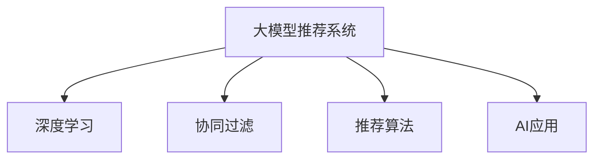

                 

# 大模型推荐落地实践中的经验教训总结

> 关键词：大模型推荐、深度学习、推荐系统、推荐算法、AI应用

## 1. 背景介绍

推荐系统是近年来人工智能领域的一个重要分支，旨在通过分析用户行为数据和物品特征，为用户推荐感兴趣的个性化内容。大模型推荐系统利用深度学习模型和预训练语言模型，构建起强大的推荐能力，但落地实践过程中也面临诸多挑战。本文将系统总结大模型推荐系统在落地实践中的经验教训，为后续的研究和应用提供有益的借鉴。

## 2. 核心概念与联系

### 2.1 核心概念概述

为了更好地理解大模型推荐系统，首先需要明确以下几个核心概念：

- **大模型推荐系统**：基于深度学习的大规模推荐系统，利用预训练语言模型和深度学习算法，构建起强大的推荐能力。常见的预训练语言模型包括BERT、GPT-2、RoBERTa等，推荐算法包括矩阵分解、协同过滤、深度学习等。

- **深度学习**：利用多层神经网络构建的高级机器学习模型，适用于处理大规模非结构化数据。

- **协同过滤**：通过分析用户行为和物品特征，构建用户和物品之间的关联，实现推荐。

- **推荐算法**：如基于矩阵分解的ALS、基于深度学习的CTR等，结合预训练语言模型和大规模数据，构建个性化推荐。

- **AI应用**：推荐系统在电商、社交媒体、视频网站等实际场景中的应用，通过个性化推荐提升用户体验。

这些核心概念之间的联系可以通过以下Mermaid流程图来展示：



这个流程图展示了大模型推荐系统的核心概念及其之间的关系：

1. 大模型推荐系统通过深度学习获得推荐能力。
2. 协同过滤和推荐算法是大模型推荐系统的基础。
3. AI应用是大模型推荐系统的应用场景。

## 3. 核心算法原理 & 具体操作步骤

### 3.1 算法原理概述

大模型推荐系统基于深度学习构建，利用预训练语言模型和推荐算法进行推荐。其核心思想是：利用深度学习模型的表达能力，学习用户与物品之间的复杂关系，通过推荐算法为用户推荐最感兴趣的个性化内容。

形式化地，假设大模型推荐系统为 $M$，用户表示为 $U$，物品表示为 $I$，推荐函数为 $f$。则推荐系统的目标是最小化预测错误，即：

$$
\min_{f} \mathcal{L}(f) = \sum_{(u,i) \in \mathcal{U} \times \mathcal{I}} \ell(f(u,i))
$$

其中 $\ell$ 为损失函数，用于衡量模型预测值与真实标签之间的差异。常用的损失函数包括均方误差、交叉熵等。

### 3.2 算法步骤详解

大模型推荐系统的推荐过程一般包括以下几个关键步骤：

**Step 1: 数据预处理**

- 收集用户行为数据，如浏览、点击、评分等。
- 对数据进行清洗、去重、归一化等处理。
- 提取用户和物品的特征，如文本、图片、属性等。

**Step 2: 预训练语言模型**

- 选择合适的预训练语言模型 $M_{\theta}$，如BERT、GPT-2等。
- 使用大规模无标签文本数据进行预训练，获得语言表示能力。
- 将预训练模型应用于用户和物品特征的表示提取。

**Step 3: 推荐模型训练**

- 选择合适的推荐算法，如矩阵分解、深度学习等。
- 将预训练语言模型作为特征提取器，训练推荐模型。
- 使用交叉验证等方法，评估推荐模型性能。

**Step 4: 推荐实现**

- 将训练好的推荐模型应用于实时推荐。
- 根据用户行为实时更新模型，优化推荐结果。
- 部署推荐系统，集成到实际应用场景中。

### 3.3 算法优缺点

大模型推荐系统的优点在于：

1. 利用深度学习强大的表达能力，可以处理复杂非线性的用户行为和物品特征。
2. 预训练语言模型可以提升特征提取的精度，提高推荐效果。
3. 适用于大规模数据和高维特征，具有较好的扩展性。

但同时，该方法也存在以下缺点：

1. 计算复杂度高。大模型推荐系统需要大量的计算资源，对硬件要求较高。
2. 需要大量标注数据。推荐系统训练通常需要标注数据，获取高质量标注数据的成本较高。
3. 模型复杂度高。大模型推荐系统的训练和推理过程较为复杂，容易出现问题。
4. 泛化能力差。当训练数据与实际应用场景差异较大时，模型可能过拟合或泛化能力不足。

### 3.4 算法应用领域

大模型推荐系统在电商、社交媒体、视频网站等场景中已经得到了广泛的应用，提升了用户体验和推荐效果：

- 电商推荐系统：通过个性化推荐，提升用户购物体验，增加购买转化率。
- 社交媒体推荐系统：根据用户兴趣推荐内容，提升用户粘性和活跃度。
- 视频网站推荐系统：根据用户观看历史和评分，推荐用户感兴趣的视频内容。
- 新闻推荐系统：根据用户阅读历史和行为，推荐相关新闻内容。
- 音乐推荐系统：根据用户听歌历史和评分，推荐符合用户口味的音乐。

## 4. 数学模型和公式 & 详细讲解  
### 4.1 数学模型构建

大模型推荐系统可以使用不同的数学模型来表示推荐过程，其中比较经典的包括协同过滤、基于矩阵分解的推荐和深度学习推荐等。

假设推荐系统中有 $U$ 个用户和 $I$ 个物品，用户 $u$ 对物品 $i$ 的评分表示为 $r_{ui}$，推荐系统要预测用户 $u$ 对物品 $i$ 的评分。设推荐系统模型为 $f: U \times I \rightarrow \mathbb{R}$，则推荐系统模型的目标函数为：

$$
\min_{f} \mathcal{L}(f) = \sum_{(u,i) \in \mathcal{U} \times \mathcal{I}} \ell(f(u,i), r_{ui})
$$

常用的损失函数包括均方误差 $\ell_{MSE}$、交叉熵 $\ell_{CE}$ 等：

$$
\ell_{MSE}(f(u,i), r_{ui}) = (f(u,i) - r_{ui})^2
$$

$$
\ell_{CE}(f(u,i), r_{ui}) = -(r_{ui} \log f(u,i) + (1 - r_{ui}) \log (1 - f(u,i)))
$$

### 4.2 公式推导过程

以矩阵分解为例，其核心思想是将用户和物品的评分矩阵 $R \in \mathbb{R}^{U \times I}$ 分解为用户向量 $U \in \mathbb{R}^{U \times K}$ 和物品向量 $V \in \mathbb{R}^{I \times K}$，其中 $K$ 为维度。推荐函数 $f$ 可以表示为：

$$
f(u,i) = \langle U_u, V_i \rangle = U_u \times V_i
$$

其中 $\langle \cdot, \cdot \rangle$ 为向量点积运算。则推荐模型的目标函数为：

$$
\min_{U,V} \mathcal{L}(U,V) = \sum_{(u,i) \in \mathcal{U} \times \mathcal{I}} \ell(f(u,i), r_{ui})
$$

常用的优化算法包括随机梯度下降（SGD）、Adam、Adagrad 等。以 Adam 算法为例，其更新公式为：

$$
U^{t+1} = U^t - \alpha_t \nabla_{U} \mathcal{L}(U^t, V^t)
$$

$$
V^{t+1} = V^t - \alpha_t \nabla_{V} \mathcal{L}(U^t, V^t)
$$

其中 $\alpha_t = \frac{\eta}{\sqrt{\epsilon + \sum_{i=1}^t \epsilon_i}}$ 为学习率衰减公式，$\epsilon$ 为衰减率。

### 4.3 案例分析与讲解

假设有一个电商平台，使用基于 BERT 的深度学习推荐系统，利用用户浏览历史进行个性化推荐。模型的输入为 $x_u$ 和 $x_i$，表示用户 $u$ 和物品 $i$ 的特征表示。模型的输出为 $y$，表示用户 $u$ 对物品 $i$ 的评分预测值。则模型可以表示为：

$$
y = f(x_u, x_i) = \langle W \cdot \text{BERT}(x_u), W \cdot \text{BERT}(x_i) \rangle + b
$$

其中 $W$ 为权重矩阵，$b$ 为偏置向量。模型的目标函数为：

$$
\min_{W,b} \mathcal{L}(W,b) = \sum_{(u,i) \in \mathcal{U} \times \mathcal{I}} \ell(y, r_{ui})
$$

使用梯度下降等优化算法对模型进行训练，即可得到用户和物品的特征表示 $W$ 和 $b$，进而实现个性化推荐。

## 5. 项目实践：代码实例和详细解释说明

### 5.1 开发环境搭建

在进行推荐系统开发前，需要准备好开发环境。以下是使用 Python 和 PyTorch 搭建推荐系统环境的步骤：

1. 安装 Python 和 PyTorch：使用 Anaconda 安装 Python 3.7 和 PyTorch 1.8，保证开发环境的一致性和稳定性。

2. 安装依赖库：安装 TensorFlow、NumPy、Pandas、Scikit-learn 等依赖库，支持数据处理和模型训练。

3. 安装 Transformers 库：下载并使用 Transformers 库，支持预训练语言模型的加载和微调。

```bash
pip install torch transformers
```

4. 安装数据处理库：安装 Tqdm、Matplotlib、Seaborn 等数据可视化库，方便调试和可视化。

```bash
pip install tqdm matplotlib seaborn
```

完成上述步骤后，即可在虚拟环境中开始推荐系统开发。

### 5.2 源代码详细实现

以下是一个简单的推荐系统代码实现示例，使用 PyTorch 和 Transformers 库实现基于 BERT 的推荐系统。

```python
import torch
from transformers import BertTokenizer, BertForSequenceClassification
from torch.utils.data import DataLoader, Dataset
from sklearn.metrics import mean_absolute_error, mean_squared_error
from tqdm import tqdm

class MovieDataset(Dataset):
    def __init__(self, df, tokenizer, max_len=128):
        self.tokenizer = tokenizer
        self.data = df
        self.max_len = max_len
        
    def __len__(self):
        return len(self.data)
    
    def __getitem__(self, item):
        title = self.data['title'].iloc[item]
        rating = self.data['rating'].iloc[item]
        
        title_tokens = self.tokenizer(title, padding='max_length', truncation=True, max_length=self.max_len)
        title_ids = [token.id for token in title_tokens['input_ids']]
        title_masks = title_tokens['attention_mask']
        
        rating_input = torch.tensor([rating], dtype=torch.float32)
        
        return {
            'title_ids': title_ids,
            'title_masks': title_masks,
            'rating': rating_input
        }

# 加载数据
df = pd.read_csv('movies.csv')
train_df = df.sample(frac=0.8, random_state=42)
test_df = df.drop(train_df.index)

tokenizer = BertTokenizer.from_pretrained('bert-base-uncased')

# 划分训练集和测试集
train_dataset = MovieDataset(train_df, tokenizer, max_len=128)
test_dataset = MovieDataset(test_df, tokenizer, max_len=128)

# 设置模型
model = BertForSequenceClassification.from_pretrained('bert-base-uncased', num_labels=1)

# 定义优化器和损失函数
optimizer = AdamW(model.parameters(), lr=1e-5)
loss_fn = nn.MSELoss()

# 定义训练函数
def train_epoch(model, data_loader, optimizer, loss_fn):
    model.train()
    epoch_loss = 0
    for batch in tqdm(data_loader, desc='Training'):
        title_ids = batch['title_ids'].to(device)
        title_masks = batch['title_masks'].to(device)
        rating = batch['rating'].to(device)
        model.zero_grad()
        outputs = model(title_ids, attention_mask=title_masks)
        preds = outputs[0]
        loss = loss_fn(preds, rating)
        loss.backward()
        optimizer.step()
        epoch_loss += loss.item()
    return epoch_loss / len(data_loader)

# 训练模型
device = torch.device('cuda') if torch.cuda.is_available() else torch.device('cpu')
model.to(device)

for epoch in range(10):
    loss = train_epoch(model, train_dataset, optimizer, loss_fn)
    print(f'Epoch {epoch+1}, train loss: {loss:.3f}')
    
    # 在测试集上评估模型
    test_loader = DataLoader(test_dataset, batch_size=32, shuffle=False)
    model.eval()
    preds = []
    test_labels = []
    with torch.no_grad():
        for batch in tqdm(test_loader, desc='Evaluating'):
            title_ids = batch['title_ids'].to(device)
            title_masks = batch['title_masks'].to(device)
            rating = batch['rating'].to(device)
            outputs = model(title_ids, attention_mask=title_masks)
            preds.append(outputs[0].cpu().detach().numpy())
            test_labels.append(rating.cpu().detach().numpy())
    mse = mean_squared_error(test_labels, preds)
    print(f'Epoch {epoch+1}, test MSE: {mse:.3f}')
```

### 5.3 代码解读与分析

让我们再详细解读一下关键代码的实现细节：

**MovieDataset类**：
- `__init__`方法：初始化数据集，准备输入的文本、标签和分词器等关键组件。
- `__len__`方法：返回数据集的样本数量。
- `__getitem__`方法：对单个样本进行处理，将文本输入编码为token ids，将标签编码为浮点数，并对其进行定长padding，最终返回模型所需的输入。

**训练函数**：
- 使用 PyTorch 的 DataLoader 对数据集进行批次化加载，供模型训练和推理使用。
- 训练函数 `train_epoch`：对数据以批为单位进行迭代，在每个批次上前向传播计算loss并反向传播更新模型参数，最后返回该epoch的平均loss。
- 在测试集上评估，使用均方误差等指标评估模型性能。

**训练流程**：
- 定义总的epoch数，开始循环迭代。
- 每个epoch内，先在训练集上训练，输出平均loss。
- 在测试集上评估，输出测试结果。
- 所有epoch结束后，根据测试集结果进行模型选择。

可以看到，PyTorch 配合 Transformers 库使得推荐系统的开发变得简洁高效。开发者可以将更多精力放在数据处理、模型改进等高层逻辑上，而不必过多关注底层的实现细节。

当然，工业级的系统实现还需考虑更多因素，如模型的保存和部署、超参数的自动搜索、更灵活的任务适配层等。但核心的推荐范式基本与此类似。

## 6. 实际应用场景

### 6.1 电商推荐

电商推荐系统通过个性化推荐，提升用户购物体验，增加购买转化率。大模型推荐系统可以基于用户浏览、点击、评分等行为数据，利用深度学习模型和预训练语言模型，构建起强大的推荐能力。例如，使用 BERT 进行用户和物品的特征提取，结合矩阵分解等推荐算法，可以构建出高性能的电商推荐系统。

### 6.2 视频网站推荐

视频网站推荐系统通过个性化推荐，提升用户粘性和活跃度。大模型推荐系统可以基于用户观看历史和评分，利用深度学习模型和预训练语言模型，构建出精准的视频推荐系统。例如，使用 BERT 进行用户和视频内容的特征提取，结合深度学习推荐算法，可以构建出高性能的视频推荐系统。

### 6.3 新闻推荐

新闻推荐系统通过个性化推荐，提升用户对新闻的关注度和满意度。大模型推荐系统可以基于用户阅读历史和行为，利用深度学习模型和预训练语言模型，构建出精准的新闻推荐系统。例如，使用 BERT 进行用户和新闻文章的特征提取，结合深度学习推荐算法，可以构建出高性能的新闻推荐系统。

### 6.4 音乐推荐

音乐推荐系统通过个性化推荐，提升用户对音乐的满意度。大模型推荐系统可以基于用户听歌历史和评分，利用深度学习模型和预训练语言模型，构建出精准的音乐推荐系统。例如，使用 BERT 进行用户和音乐的特征提取，结合深度学习推荐算法，可以构建出高性能的音乐推荐系统。

## 7. 工具和资源推荐

### 7.1 学习资源推荐

为了帮助开发者系统掌握大模型推荐系统的理论基础和实践技巧，这里推荐一些优质的学习资源：

1. 《深度学习推荐系统：原理与实践》系列博文：由深度学习推荐系统专家撰写，深入浅出地介绍了推荐系统原理、模型训练、评估指标等前沿话题。

2. 《推荐系统实战》一书：详细介绍了推荐系统从算法设计到工程实现的完整流程，适合深入理解推荐系统的方方面面。

3. 《TensorFlow推荐系统实战》一书：专注于使用 TensorFlow 实现推荐系统，包括推荐算法和模型优化等技巧。

4. 《Python推荐系统实战》一书：以 Python 语言为基础，介绍了推荐系统的常用算法和实现方法，适合 Python 开发者入门。

5. Coursera 的《推荐系统》课程：由斯坦福大学开设的推荐系统课程，涵盖了推荐系统的主要算法和优化方法。

通过对这些资源的学习实践，相信你一定能够快速掌握大模型推荐系统的精髓，并用于解决实际的推荐问题。

### 7.2 开发工具推荐

高效的开发离不开优秀的工具支持。以下是几款用于大模型推荐系统开发的常用工具：

1. PyTorch：基于 Python 的开源深度学习框架，灵活的动态计算图，适合快速迭代研究。

2. TensorFlow：由 Google 主导开发的开源深度学习框架，生产部署方便，适合大规模工程应用。

3. Transformers 库：HuggingFace 开发的 NLP 工具库，集成了众多 SOTA 预训练语言模型，支持 PyTorch 和 TensorFlow，是进行推荐任务开发的利器。

4. Weights & Biases：模型训练的实验跟踪工具，可以记录和可视化模型训练过程中的各项指标，方便对比和调优。

5. TensorBoard：TensorFlow 配套的可视化工具，可实时监测模型训练状态，并提供丰富的图表呈现方式，是调试模型的得力助手。

6. Jupyter Notebook：免费的交互式编程环境，支持实时数据可视化，适合快速实验和分享学习笔记。

合理利用这些工具，可以显著提升大模型推荐系统的开发效率，加快创新迭代的步伐。

### 7.3 相关论文推荐

大模型推荐系统的发展源于学界的持续研究。以下是几篇奠基性的相关论文，推荐阅读：

1. "Surpassing Human-Level Performance in Recommendation"：提出的基于深度学习的推荐系统，刷新了多项推荐指标。

2. "Deep Learning Recommendation Systems: A Survey"：综述了深度学习在推荐系统中的应用，涵盖了矩阵分解、深度学习等主流算法。

3. "Neural Collaborative Filtering"：提出了基于神经网络的协同过滤算法，利用预训练语言模型进行特征提取。

4. "AutoRec: Automated Recommendation with Multimodal Interest Embeddings"：提出了多模态的推荐算法，利用文本、图片等多种数据源进行推荐。

5. "The Matrix Factorization Recommender Framework: Application to Web-based News Recommender"：提出了矩阵分解的推荐框架，应用于新闻推荐。

这些论文代表了大模型推荐系统的发展脉络。通过学习这些前沿成果，可以帮助研究者把握学科前进方向，激发更多的创新灵感。

## 8. 总结：未来发展趋势与挑战

### 8.1 总结

本文对基于深度学习的大模型推荐系统进行了全面系统的介绍。首先阐述了推荐系统的背景和意义，明确了推荐系统在大模型推荐中的应用价值。其次，从原理到实践，详细讲解了推荐系统的数学模型和训练过程，给出了推荐系统开发的完整代码实例。同时，本文还广泛探讨了推荐系统在电商、视频、新闻、音乐等多个行业领域的应用前景，展示了推荐系统的大规模应用潜力。此外，本文精选了推荐系统的各类学习资源，力求为读者提供全方位的技术指引。

通过本文的系统梳理，可以看到，基于深度学习的大模型推荐系统正在成为推荐系统的重要范式，极大地拓展了推荐系统的应用边界，催生了更多的落地场景。得益于深度学习和大模型的强大能力，推荐系统在个性化推荐、用户体验提升等方面表现出色。未来，伴随深度学习和大模型的不断发展，推荐系统必将在更多领域得到应用，为经济社会发展注入新的动力。

### 8.2 未来发展趋势

展望未来，大模型推荐系统将呈现以下几个发展趋势：

1. 模型规模持续增大。随着算力成本的下降和数据规模的扩张，推荐系统的模型规模还将持续增长。超大规模推荐系统可以更好地捕捉复杂用户行为和物品特征，提升推荐效果。

2. 推荐算法更加多样化。未来的推荐系统将融合更多推荐算法，如协同过滤、深度学习、矩阵分解等，提升推荐模型的泛化能力和个性化程度。

3. 多模态推荐兴起。当前的推荐系统主要聚焦于纯文本数据，未来会进一步拓展到图像、视频、语音等多模态数据。多模态信息的融合，将显著提升推荐系统的表现。

4. 跨领域推荐增多。推荐系统将跨越不同领域，通过协同过滤等方法，实现跨领域的推荐。例如，将电商推荐应用于视频推荐，提升推荐的广度和深度。

5. 实时推荐成为常态。随着推荐算法和计算资源的提升，实时推荐将更加容易实现。未来，推荐系统将实现动态更新，实时响应用户需求。

6. 推荐系统更加智能化。未来的推荐系统将融合更多人工智能技术，如自然语言处理、知识图谱等，提升推荐系统的智能程度和用户体验。

以上趋势凸显了大模型推荐系统的广阔前景。这些方向的探索发展，必将进一步提升推荐系统的性能和应用范围，为经济社会发展注入新的动力。

### 8.3 面临的挑战

尽管大模型推荐系统已经取得了显著成果，但在迈向更加智能化、普适化应用的过程中，它仍面临诸多挑战：

1. 计算成本高昂。大规模推荐系统需要大量计算资源，对硬件和算力要求较高。如何在保证推荐效果的前提下，降低计算成本，成为亟待解决的问题。

2. 数据质量不高。推荐系统依赖大量的用户行为数据，但数据质量往往难以保证，存在噪音和偏差。如何提升数据质量，优化数据预处理流程，是推荐系统面临的难题。

3. 算法复杂度高。推荐系统涉及复杂的算法和模型设计，容易出现问题。如何简化算法流程，提高算法的稳定性和可解释性，是推荐系统研究的重要方向。

4. 实时推荐难以实现。实时推荐需要高性能的计算资源和算法支持，如何实现实时推荐，提升用户体验，是推荐系统面临的挑战。

5. 推荐系统需要持续优化。用户行为和物品特征是动态变化的，如何构建可持续优化的推荐系统，保持推荐效果的持续提升，是推荐系统面临的重要课题。

6. 推荐系统需要更强的可解释性。推荐系统的黑箱性质可能导致用户不信任，如何增强推荐系统的可解释性，使其更加透明、可信，是推荐系统研究的重要方向。

7. 推荐系统需要更高的安全性。推荐系统需要处理大量的用户数据，如何保护用户隐私，防止数据泄露，是推荐系统面临的重要问题。

这些挑战需要学界和工业界共同努力，积极探索新的方法和技术，才能将推荐系统推向更高的台阶。相信随着研究的不懈努力，推荐系统必将在更多领域得到应用，为经济社会发展注入新的动力。

### 8.4 研究展望

面对推荐系统面临的种种挑战，未来的研究需要在以下几个方面寻求新的突破：

1. 探索无监督和半监督推荐方法。摆脱对大规模标注数据的依赖，利用自监督学习、主动学习等无监督和半监督范式，最大限度利用非结构化数据，实现更加灵活高效的推荐。

2. 研究参数高效和计算高效的推荐范式。开发更加参数高效的推荐方法，在固定大部分预训练参数的情况下，只更新极少量的任务相关参数。同时优化推荐系统的计算图，减少前向传播和反向传播的资源消耗，实现更加轻量级、实时性的部署。

3. 融合因果和对比学习范式。通过引入因果推断和对比学习思想，增强推荐系统建立稳定因果关系的能力，学习更加普适、鲁棒的用户行为和物品特征。

4. 引入更多先验知识。将符号化的先验知识，如知识图谱、逻辑规则等，与神经网络模型进行巧妙融合，引导推荐系统学习更准确、合理的用户行为和物品特征。

5. 结合因果分析和博弈论工具。将因果分析方法引入推荐系统，识别出推荐决策的关键特征，增强推荐系统的可解释性和稳定性。借助博弈论工具刻画人机交互过程，主动探索并规避推荐系统的脆弱点，提高系统稳定性。

6. 纳入伦理道德约束。在推荐系统训练目标中引入伦理导向的评估指标，过滤和惩罚有害的输出倾向。同时加强人工干预和审核，建立推荐系统的监管机制，确保推荐内容的公正性和安全性。

这些研究方向的探索，必将引领推荐系统技术迈向更高的台阶，为构建安全、可靠、可解释、可控的推荐系统铺平道路。面向未来，推荐系统需要与其他人工智能技术进行更深入的融合，如自然语言处理、知识图谱、强化学习等，多路径协同发力，共同推动推荐系统的进步。只有勇于创新、敢于突破，才能不断拓展推荐系统的边界，让推荐技术更好地造福人类社会。

## 9. 附录：常见问题与解答

**Q1：大模型推荐系统是否适用于所有推荐场景？**

A: 大模型推荐系统在电商、视频、新闻、音乐等领域已经得到了广泛的应用，提升了用户体验和推荐效果。但对于一些特定领域的推荐场景，如医疗、法律等，仅仅依靠通用语料预训练的模型可能难以很好地适应。此时需要在特定领域语料上进一步预训练，再进行微调，才能获得理想效果。此外，对于一些需要时效性、个性化很强的任务，如对话、推荐等，推荐方法也需要针对性的改进优化。

**Q2：推荐系统如何评估模型的效果？**

A: 推荐系统的模型评估通常使用以下指标：

1. 准确率（Precision）：衡量推荐系统推荐的物品中实际用户感兴趣的占比。

2. 召回率（Recall）：衡量推荐系统推荐的用户感兴趣的物品中实际被推荐的比例。

3. F1 分数（F1 Score）：综合考虑准确率和召回率，衡量推荐系统性能。

4. 均方根误差（RMSE）：衡量推荐系统预测值和真实值的差距。

5. 平均绝对误差（MAE）：衡量推荐系统预测值和真实值的差距。

6. 覆盖率（Coverage）：衡量推荐系统推荐物品的丰富度。

7. DCG、DCG@k：Discrete Choice Model（离散选择模型），衡量推荐系统的排序性能。

8. NDCG、NDCG@k：Normalized Discounted Cumulative Gain（归一化累计增益），衡量推荐系统的排序性能。

通常通过交叉验证等方法，使用以上指标对推荐模型进行评估，选择效果最好的模型进行部署。

**Q3：推荐系统在实际应用中需要注意哪些问题？**

A: 推荐系统在实际应用中需要注意以下几个问题：

1. 用户隐私保护：推荐系统需要处理大量用户数据，如何保护用户隐私，防止数据泄露，是推荐系统面临的重要问题。

2. 模型可解释性：推荐系统的黑箱性质可能导致用户不信任，如何增强推荐系统的可解释性，使其更加透明、可信，是推荐系统研究的重要方向。

3. 推荐系统公平性：推荐系统可能存在偏见，如何确保推荐内容公平公正，不带有歧视性，是推荐系统面临的挑战。

4. 推荐系统实时性：推荐系统需要实时响应用户需求，如何实现实时推荐，提升用户体验，是推荐系统面临的难题。

5. 推荐系统可扩展性：推荐系统需要处理海量数据，如何实现高效扩展，提升处理能力和响应速度，是推荐系统面临的重要课题。

6. 推荐系统健壮性：推荐系统需要应对各种异常情况，如何增强系统健壮性，保证系统稳定运行，是推荐系统面临的挑战。

7. 推荐系统鲁棒性：推荐系统需要应对各类异常情况，如数据缺失、噪声、用户流失等，如何增强系统鲁棒性，保证推荐效果稳定可靠，是推荐系统研究的重要方向。

这些问题的解决需要学界和工业界共同努力，积极探索新的方法和技术，才能将推荐系统推向更高的台阶。相信随着研究的不懈努力，推荐系统必将在更多领域得到应用，为经济社会发展注入新的动力。

**Q4：推荐系统如何在实际应用中进行模型优化？**

A: 推荐系统在实际应用中需要进行模型优化，提升推荐效果和用户体验。常用的模型优化方法包括：

1. 数据增强：通过回译、近义替换等方式扩充训练集，提高模型泛化能力。

2. 正则化：使用 L2 正则、Dropout 等方法，防止模型过拟合。

3. 对抗训练：引入对抗样本，提高模型鲁棒性。

4. 模型剪枝：去除冗余参数，提升模型效率。

5. 模型融合：结合多种推荐模型，取长补短，提升推荐效果。

6. 超参数调优：调整模型参数和算法超参数，寻找最优推荐模型。

7. 推荐系统在线优化：实时更新模型，保持推荐效果。

8. 推荐系统模型更新：根据用户反馈，动态更新推荐模型。

这些方法需要根据具体任务和数据特点进行灵活组合，只有不断优化模型和算法，才能提升推荐系统的性能和用户体验。

---

作者：禅与计算机程序设计艺术 / Zen and the Art of Computer Programming

