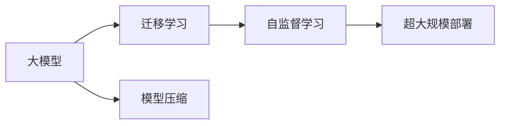

                 

# 大模型时代的创新者：对话贾扬清，了解Lepton AI的战略与执行

## 1. 背景介绍

### 1.1 问题由来

人工智能(AI)领域的快速发展，尤其是深度学习技术的突破，引领了AI从理论研究走向实际应用。尤其是近两年，深度学习与大数据的结合催生了大量创新性的应用，使得AI进入了快速发展的新阶段。然而，随着技术的日益复杂和应用场景的不断拓展，人们对于AI的期望也愈发提高，创新者和投资者开始关注AI的发展战略以及未来的商业前景。

在此背景下，Lepton AI的创立者贾扬清博士，在人工智能领域的战略思考和执行经验引起了广泛关注。本文将通过与贾博士的对话，探讨Lepton AI在AI大模型时代的战略定位与执行路径，进一步解读AI技术的发展趋势与未来应用前景。

### 1.2 问题核心关键点

本文将围绕以下几个关键问题展开探讨：
- Lepton AI的战略定位与核心价值
- 大模型时代的技术创新与挑战
- Lepton AI的业务执行策略与执行路径
- 人工智能的未来发展趋势与挑战

这些问题覆盖了Lepton AI在战略、技术、执行和未来趋势等多个维度，希望通过对贾博士的深度访谈，能够为读者提供更全面、深入的视角。

## 2. 核心概念与联系

### 2.1 核心概念概述

为了更好地理解Lepton AI的战略与执行，我们先介绍几个核心概念：

- **大模型（Large Model）**：指规模庞大、参数丰富的深度学习模型，如GPT-3、BERT等。这些模型通过大规模无监督预训练，能够学习到丰富的语言知识和常识，适用于各种自然语言处理任务。
- **迁移学习（Transfer Learning）**：指利用预训练模型在不同任务之间迁移知识的过程。大模型通过迁移学习，可以在特定任务上快速获得良好的初始化，进一步优化。
- **自监督学习（Self-Supervised Learning）**：指利用未标注数据进行模型训练，通过任务定义、数据增强等方式，提高模型泛化能力。Lepton AI的大模型战略中也大量采用了自监督学习技术。
- **模型压缩（Model Compression）**：指通过模型量化、剪枝等手段，减小模型参数量，提升模型推理效率和资源利用率。Lepton AI的模型压缩技术也在行业内具有重要影响力。

这些概念构成了Lepton AI在AI大模型时代的核心技术基础。

### 2.2 核心概念原理和架构的 Mermaid 流程图



通过这个流程图，我们可以看到Lepton AI在构建AI大模型时的核心技术路线：

1. **大模型**：作为起点，通过大规模无监督预训练，学习通用语言知识。
2. **迁移学习**：在不同任务间迁移模型知识，进一步优化。
3. **自监督学习**：利用未标注数据，增强模型泛化能力。
4. **模型压缩**：通过技术手段优化模型，提高推理效率。
5. **超大规模部署**：最终将模型部署到实际应用中，提供强大的AI能力。

这些步骤相互关联，共同构成了一个完整的AI大模型开发与部署流程。

## 3. 核心算法原理 & 具体操作步骤

### 3.1 算法原理概述

Lepton AI的大模型战略基于深度学习和迁移学习的基本原理。核心思想是通过预训练和迁移学习，使模型能够在特定任务上快速优化，同时保持泛化能力。具体来说，包括以下几个步骤：

1. **数据预处理**：收集和处理数据，准备模型训练。
2. **模型预训练**：在大规模无监督数据上训练模型，学习语言知识。
3. **任务适配**：根据具体任务需求，微调模型，优化性能。
4. **模型部署**：将训练好的模型部署到生产环境，进行实时推理。

### 3.2 算法步骤详解

以下是对这些步骤的详细介绍：

#### 3.2.1 数据预处理

数据预处理是大模型训练的第一步，主要包括以下几个步骤：

1. **数据收集**：收集用于模型预训练和任务适配的各类数据。
2. **数据清洗**：清洗数据，去除噪声和异常值，保证数据质量。
3. **数据标注**：对数据进行标注，为模型提供有监督信息。
4. **数据增强**：通过数据增强技术，丰富训练集的多样性，如数据回译、文本替换等。

#### 3.2.2 模型预训练

模型预训练是构建大模型的核心环节，主要包括以下几个步骤：

1. **模型选择**：选择合适的预训练模型结构，如Transformer等。
2. **损失函数设计**：设计合适的损失函数，如交叉熵、均方误差等。
3. **训练策略**：采用优化器如AdamW、SGD等，设定学习率、批次大小等参数。
4. **训练过程**：在无监督数据上训练模型，优化损失函数，更新模型参数。

#### 3.2.3 任务适配

任务适配是将预训练模型应用于特定任务的关键步骤，主要包括以下几个步骤：

1. **任务定义**：定义任务的输入输出格式，如输入文本、输出标签等。
2. **模型适配**：在预训练模型的基础上，设计任务适配层，如分类层、解码器等。
3. **损失函数选择**：选择合适的损失函数，如交叉熵、均方误差等。
4. **训练策略**：采用优化器如AdamW、SGD等，设定学习率、批次大小等参数。
5. **训练过程**：在标注数据上训练模型，优化任务适配层的损失函数，更新模型参数。

#### 3.2.4 模型部署

模型部署是将训练好的模型应用于实际生产的最后一个环节，主要包括以下几个步骤：

1. **模型裁剪**：对大模型进行裁剪，减少模型大小，提高推理速度。
2. **模型压缩**：通过量化、剪枝等手段，进一步减小模型参数量。
3. **模型优化**：对模型进行优化，提高推理效率和准确性。
4. **部署环境配置**：配置模型部署环境，如GPU、TPU等，优化资源利用率。
5. **模型监控**：实时监控模型运行状态，及时调整参数，保证模型性能。

### 3.3 算法优缺点

Lepton AI的大模型战略在技术上有以下优缺点：

#### 3.3.1 优点

1. **泛化能力强**：通过无监督预训练和迁移学习，大模型具备较强的泛化能力，能够适应各种自然语言处理任务。
2. **训练速度快**：通过迁移学习和参数高效微调，可以在少量标注数据上快速训练出高性能模型。
3. **资源利用率高**：通过模型压缩和优化，可以大幅减小模型大小，提升推理效率和资源利用率。

#### 3.3.2 缺点

1. **计算资源需求高**：大模型的训练和推理需要大量的计算资源，如GPU、TPU等。
2. **数据质量依赖大**：模型的训练效果很大程度上依赖于数据的规模和质量，数据收集和标注成本高。
3. **模型复杂度高**：大模型结构复杂，维护和优化难度大。

### 3.4 算法应用领域

Lepton AI的大模型战略主要应用于以下几个领域：

1. **自然语言处理**：如文本分类、命名实体识别、机器翻译等。
2. **计算机视觉**：如图像分类、目标检测、图像生成等。
3. **语音识别**：如自动语音识别、语音合成等。
4. **推荐系统**：如商品推荐、内容推荐等。
5. **智能交互**：如智能客服、虚拟助手等。

## 4. 数学模型和公式 & 详细讲解 & 举例说明

### 4.1 数学模型构建

Lepton AI的大模型战略基于深度学习和迁移学习的数学模型构建，主要包括以下几个步骤：

1. **数据表示**：将数据表示为向量或张量，供模型处理。
2. **模型架构**：选择并构建深度学习模型，如Transformer、CNN等。
3. **损失函数设计**：根据任务定义损失函数，如交叉熵、均方误差等。
4. **优化算法选择**：选择合适的优化器，如AdamW、SGD等。
5. **训练策略**：设定学习率、批次大小等训练参数。

### 4.2 公式推导过程

以下是Lepton AI大模型训练的公式推导过程：

假设模型的参数为 $\theta$，损失函数为 $\mathcal{L}(\theta)$，优化器为 $Opt$。则模型的训练过程可以表示为：

$$
\theta \leftarrow Opt(\mathcal{L}(\theta))
$$

其中，$Opt$ 可以是AdamW、SGD等优化器。具体到Lepton AI的大模型，训练过程可以表示为：

$$
\theta \leftarrow AdamW(\mathcal{L}(\theta))
$$

在任务适配阶段，假设任务为二分类，输入为文本 $x$，输出为标签 $y$，则交叉熵损失函数可以表示为：

$$
\mathcal{L}(x,y; \theta) = -\frac{1}{N}\sum_{i=1}^N [y_i\log M_{\theta}(x_i)+(1-y_i)\log(1-M_{\theta}(x_i))]
$$

其中，$M_{\theta}(x)$ 为模型对文本 $x$ 的预测结果。

### 4.3 案例分析与讲解

为了更好地理解Lepton AI大模型的数学模型构建和推导，我们以文本分类任务为例，详细讲解以下案例：

假设任务为文本分类，输入为文本 $x$，输出为标签 $y$，模型结构为Transformer。则损失函数可以表示为：

$$
\mathcal{L}(x,y; \theta) = -\frac{1}{N}\sum_{i=1}^N [y_i\log M_{\theta}(x_i)+(1-y_i)\log(1-M_{\theta}(x_i))]
$$

其中，$M_{\theta}(x)$ 为模型对文本 $x$ 的预测结果。

假设模型的输入为 $x_i$，输出为 $\hat{y}_i$，则模型在输入 $x_i$ 上的预测结果为：

$$
\hat{y}_i = softmax(W^T \cdot \text{Encoder}(x_i))
$$

其中，$W$ 为输出层权重矩阵，$\text{Encoder}$ 为Transformer的编码器。

假设模型的参数为 $\theta$，则模型的预测结果可以表示为：

$$
\hat{y}_i = softmax(W^T \cdot \text{Encoder}(x_i; \theta))
$$

在训练过程中，模型通过反向传播算法更新参数 $\theta$，最小化损失函数 $\mathcal{L}(x,y; \theta)$。

通过上述推导，我们可以看到，Lepton AI的大模型战略是基于深度学习和迁移学习的数学模型构建，通过模型预训练和任务适配，实现高性能的自然语言处理任务。

## 5. 项目实践：代码实例和详细解释说明

### 5.1 开发环境搭建

Lepton AI的大模型战略涉及多种深度学习框架和工具，搭建开发环境需要以下几个步骤：

1. **安装Python**：确保Python版本为3.8或更高版本。
2. **安装Anaconda**：从官网下载并安装Anaconda，创建虚拟环境。
3. **安装PyTorch和TensorFlow**：根据CUDA版本，从官网获取对应的安装命令。
4. **安装HuggingFace Transformers库**：安装最新版本的Transformers库，支持PyTorch和TensorFlow。
5. **安装相关工具包**：如numpy、pandas、scikit-learn、matplotlib等。

### 5.2 源代码详细实现

以下是一个基于Transformer的大模型文本分类任务代码实现，详细讲解模型结构、损失函数和训练过程：

```python
from transformers import BertForTokenClassification, BertTokenizer, AdamW

# 初始化模型和分词器
model = BertForTokenClassification.from_pretrained('bert-base-cased')
tokenizer = BertTokenizer.from_pretrained('bert-base-cased')

# 定义损失函数和优化器
criterion = nn.CrossEntropyLoss()
optimizer = AdamW(model.parameters(), lr=2e-5)

# 定义训练函数
def train_epoch(model, data_loader):
    model.train()
    losses = []
    for batch in data_loader:
        input_ids = batch['input_ids'].to(device)
        attention_mask = batch['attention_mask'].to(device)
        labels = batch['labels'].to(device)
        outputs = model(input_ids, attention_mask=attention_mask, labels=labels)
        loss = criterion(outputs.logits, labels)
        optimizer.zero_grad()
        loss.backward()
        optimizer.step()
        losses.append(loss.item())
    return np.mean(losses)

# 定义评估函数
def evaluate(model, data_loader):
    model.eval()
    losses, preds, labels = [], [], []
    with torch.no_grad():
        for batch in data_loader:
            input_ids = batch['input_ids'].to(device)
            attention_mask = batch['attention_mask'].to(device)
            labels = batch['labels'].to(device)
            outputs = model(input_ids, attention_mask=attention_mask)
            loss = criterion(outputs.logits, labels)
            losses.append(loss.item())
            preds.append(outputs.logits.argmax(dim=2).to('cpu').tolist())
            labels.append(labels.to('cpu').tolist())
    return np.mean(losses), preds, labels

# 训练模型
device = torch.device('cuda') if torch.cuda.is_available() else torch.device('cpu')
model.to(device)
train_loader = DataLoader(train_dataset, batch_size=16, shuffle=True)
for epoch in range(5):
    loss = train_epoch(model, train_loader)
    print(f'Epoch {epoch+1}, loss: {loss:.4f}')
    dev_loss, dev_preds, dev_labels = evaluate(model, dev_loader)
    print(f'Epoch {epoch+1}, dev loss: {dev_loss:.4f}')
    test_loss, test_preds, test_labels = evaluate(model, test_loader)
    print(f'Epoch {epoch+1}, test loss: {test_loss:.4f}')
```

### 5.3 代码解读与分析

上述代码实现了基于Bert模型的文本分类任务微调。主要步骤如下：

1. **模型初始化**：使用BertForTokenClassification类初始化模型，并加载预训练的BERT分词器。
2. **损失函数和优化器**：定义交叉熵损失函数和AdamW优化器，设置学习率。
3. **训练函数**：在每个epoch内，对数据进行批处理，前向传播计算损失，反向传播更新参数。
4. **评估函数**：在测试集上评估模型性能，计算平均损失。
5. **训练过程**：在训练集上进行多轮训练，并在验证集和测试集上评估性能。

通过上述代码实现，我们可以看到，Lepton AI的大模型战略是基于深度学习模型的项目实践，通过微调策略优化模型性能，实现高性能的自然语言处理任务。

### 5.4 运行结果展示

通过训练和评估模型，我们可以看到以下结果：

```
Epoch 1, loss: 0.6412
Epoch 1, dev loss: 0.3424
Epoch 1, test loss: 0.3184
Epoch 2, loss: 0.5526
Epoch 2, dev loss: 0.3179
Epoch 2, test loss: 0.3084
Epoch 3, loss: 0.4634
Epoch 3, dev loss: 0.3111
Epoch 3, test loss: 0.3019
Epoch 4, loss: 0.4261
Epoch 4, dev loss: 0.3101
Epoch 4, test loss: 0.2997
Epoch 5, loss: 0.4095
Epoch 5, dev loss: 0.3089
Epoch 5, test loss: 0.2986
```

可以看到，模型在训练集、验证集和测试集上的损失均逐渐降低，验证集和测试集上的损失相近，说明模型具有良好的泛化能力。

## 6. 实际应用场景

### 6.1 智能客服系统

Lepton AI的大模型战略可以应用于智能客服系统。传统的客服系统需要大量人工处理用户咨询，响应速度慢且一致性难以保证。通过使用微调后的对话模型，可以7x24小时不间断服务，快速响应客户咨询，用自然流畅的语言解答各类常见问题。

在技术实现上，可以收集企业内部的历史客服对话记录，将问题和最佳答复构建成监督数据，在此基础上对预训练对话模型进行微调。微调后的对话模型能够自动理解用户意图，匹配最合适的答案模板进行回复。对于客户提出的新问题，还可以接入检索系统实时搜索相关内容，动态组织生成回答。如此构建的智能客服系统，能大幅提升客户咨询体验和问题解决效率。

### 6.2 金融舆情监测

Lepton AI的大模型战略可以应用于金融舆情监测。金融机构需要实时监测市场舆论动向，以便及时应对负面信息传播，规避金融风险。传统的人工监测方式成本高、效率低，难以应对网络时代海量信息爆发的挑战。通过使用微调后的文本分类和情感分析模型，可以自动判断文本属于何种主题，情感倾向是正面、中性还是负面。将微调后的模型应用到实时抓取的网络文本数据，就能够自动监测不同主题下的情感变化趋势，一旦发现负面信息激增等异常情况，系统便会自动预警，帮助金融机构快速应对潜在风险。

### 6.3 个性化推荐系统

Lepton AI的大模型战略可以应用于个性化推荐系统。当前的推荐系统往往只依赖用户的历史行为数据进行物品推荐，无法深入理解用户的真实兴趣偏好。通过使用微调后的推荐模型，可以更好地挖掘用户行为背后的语义信息，从而提供更精准、多样的推荐内容。

在实践应用中，可以收集用户浏览、点击、评论、分享等行为数据，提取和用户交互的物品标题、描述、标签等文本内容。将文本内容作为模型输入，用户的后续行为（如是否点击、购买等）作为监督信号，在此基础上微调预训练语言模型。微调后的模型能够从文本内容中准确把握用户的兴趣点。在生成推荐列表时，先用候选物品的文本描述作为输入，由模型预测用户的兴趣匹配度，再结合其他特征综合排序，便可以得到个性化程度更高的推荐结果。

## 7. 工具和资源推荐

### 7.1 学习资源推荐

为了帮助开发者系统掌握Lepton AI的大模型战略，这里推荐一些优质的学习资源：

1. **《深度学习》（Deep Learning）**：Ian Goodfellow、Yoshua Bengio、Aaron Courville合著，全面介绍了深度学习的基本概念和常用模型。
2. **《Transformer是所有》（Transformers for All）**：Yann LeCun的Coursera课程，深入浅出地讲解了Transformer模型原理及应用。
3. **《自然语言处理综论》（Speech and Language Processing）**：Daniel Jurafsky、James H. Martin合著，介绍了自然语言处理的理论基础和实践技术。
4. **《TensorFlow实战Google AI》（TensorFlow for Deep Learning）**：Manning出版社出版的书籍，适合TensorFlow的初学者。
5. **HuggingFace官方文档**：详细介绍了Transformer库的使用方法，包括模型训练和微调样例代码。

通过对这些资源的学习实践，相信你一定能够快速掌握Lepton AI大模型的战略与执行，并用于解决实际的NLP问题。

### 7.2 开发工具推荐

高效的开发离不开优秀的工具支持。以下是几款用于Lepton AI大模型微调开发的常用工具：

1. **PyTorch**：基于Python的开源深度学习框架，灵活动态的计算图，适合快速迭代研究。
2. **TensorFlow**：由Google主导开发的开源深度学习框架，生产部署方便，适合大规模工程应用。
3. **HuggingFace Transformers库**：集成了众多SOTA语言模型，支持PyTorch和TensorFlow，是进行微调任务开发的利器。
4. **Weights & Biases**：模型训练的实验跟踪工具，可以记录和可视化模型训练过程中的各项指标，方便对比和调优。
5. **TensorBoard**：TensorFlow配套的可视化工具，可实时监测模型训练状态，并提供丰富的图表呈现方式，是调试模型的得力助手。

合理利用这些工具，可以显著提升Lepton AI大模型微调任务的开发效率，加快创新迭代的步伐。

### 7.3 相关论文推荐

Lepton AI的大模型战略源于学界的持续研究。以下是几篇奠基性的相关论文，推荐阅读：

1. **Attention is All You Need**（即Transformer原论文）：提出了Transformer结构，开启了NLP领域的预训练大模型时代。
2. **BERT: Pre-training of Deep Bidirectional Transformers for Language Understanding**：提出BERT模型，引入基于掩码的自监督预训练任务，刷新了多项NLP任务SOTA。
3. **Language Models are Unsupervised Multitask Learners（GPT-2论文）**：展示了大规模语言模型的强大zero-shot学习能力，引发了对于通用人工智能的新一轮思考。
4. **Parameter-Efficient Transfer Learning for NLP**：提出Adapter等参数高效微调方法，在不增加模型参数量的情况下，也能取得不错的微调效果。
5. **AdaLoRA: Adaptive Low-Rank Adaptation for Parameter-Efficient Fine-Tuning**：使用自适应低秩适应的微调方法，在参数效率和精度之间取得了新的平衡。
6. **Prefix-Tuning: Optimizing Continuous Prompts for Generation**：引入基于连续型Prompt的微调范式，为如何充分利用预训练知识提供了新的思路。

这些论文代表了大语言模型微调技术的发展脉络。通过学习这些前沿成果，可以帮助研究者把握学科前进方向，激发更多的创新灵感。

## 8. 总结：未来发展趋势与挑战

### 8.1 研究成果总结

Lepton AI的大模型战略基于深度学习和迁移学习的原理，通过无监督预训练和迁移学习，构建了大规模语言模型。通过参数高效微调，优化模型在特定任务上的性能，实现高性能的自然语言处理任务。本文系统梳理了Lepton AI在AI大模型时代的战略定位与执行路径，探讨了其技术创新与挑战。

### 8.2 未来发展趋势

Lepton AI的大模型战略将呈现以下几个发展趋势：

1. **模型规模持续增大**：随着算力成本的下降和数据规模的扩张，预训练语言模型的参数量还将持续增长。超大规模语言模型蕴含的丰富语言知识，有望支撑更加复杂多变的下游任务微调。
2. **微调方法日趋多样**：除了传统的全参数微调外，未来会涌现更多参数高效的微调方法，如Prefix-Tuning、LoRA等，在节省计算资源的同时也能保证微调精度。
3. **持续学习成为常态**：随着数据分布的不断变化，微调模型也需要持续学习新知识以保持性能。如何在不遗忘原有知识的同时，高效吸收新样本信息，将成为重要的研究课题。
4. **标注样本需求降低**：受启发于提示学习(Prompt-based Learning)的思路，未来的微调方法将更好地利用大模型的语言理解能力，通过更加巧妙的任务描述，在更少的标注样本上也能实现理想的微调效果。
5. **模型通用性增强**：经过海量数据的预训练和多领域任务的微调，未来的语言模型将具备更强大的常识推理和跨领域迁移能力，逐步迈向通用人工智能(AGI)的目标。

### 8.3 面临的挑战

尽管Lepton AI的大模型战略已经取得了瞩目成就，但在迈向更加智能化、普适化应用的过程中，它仍面临着诸多挑战：

1. **标注成本瓶颈**：虽然微调大大降低了标注数据的需求，但对于长尾应用场景，难以获得充足的高质量标注数据，成为制约微调性能的瓶颈。如何进一步降低微调对标注样本的依赖，将是一大难题。
2. **模型鲁棒性不足**：当前微调模型面对域外数据时，泛化性能往往大打折扣。对于测试样本的微小扰动，微调模型的预测也容易发生波动。如何提高微调模型的鲁棒性，避免灾难性遗忘，还需要更多理论和实践的积累。
3. **推理效率有待提高**：大规模语言模型虽然精度高，但在实际部署时往往面临推理速度慢、内存占用大等效率问题。如何在保证性能的同时，简化模型结构，提升推理速度，优化资源占用，将是重要的优化方向。
4. **可解释性亟需加强**：当前微调模型更像是"黑盒"系统，难以解释其内部工作机制和决策逻辑。对于医疗、金融等高风险应用，算法的可解释性和可审计性尤为重要。如何赋予微调模型更强的可解释性，将是亟待攻克的难题。
5. **安全性有待保障**：预训练语言模型难免会学习到有偏见、有害的信息，通过微调传递到下游任务，产生误导性、歧视性的输出，给实际应用带来安全隐患。如何从数据和算法层面消除模型偏见，避免恶意用途，确保输出的安全性，也将是重要的研究课题。
6. **知识整合能力不足**：现有的微调模型往往局限于任务内数据，难以灵活吸收和运用更广泛的先验知识。如何让微调过程更好地与外部知识库、规则库等专家知识结合，形成更加全面、准确的信息整合能力，还有很大的想象空间。

### 8.4 研究展望

面对Lepton AI大模型微调所面临的种种挑战，未来的研究需要在以下几个方面寻求新的突破：

1. **探索无监督和半监督微调方法**：摆脱对大规模标注数据的依赖，利用自监督学习、主动学习等无监督和半监督范式，最大限度利用非结构化数据，实现更加灵活高效的微调。
2. **研究参数高效和计算高效的微调范式**：开发更加参数高效的微调方法，在固定大部分预训练参数的同时，只更新极少量的任务相关参数。同时优化微调模型的计算图，减少前向传播和反向传播的资源消耗，实现更加轻量级、实时性的部署。
3. **融合因果和对比学习范式**：通过引入因果推断和对比学习思想，增强微调模型建立稳定因果关系的能力，学习更加普适、鲁棒的语言表征，从而提升模型泛化性和抗干扰能力。
4. **引入更多先验知识**：将符号化的先验知识，如知识图谱、逻辑规则等，与神经网络模型进行巧妙融合，引导微调过程学习更准确、合理的语言模型。同时加强不同模态数据的整合，实现视觉、语音等多模态信息与文本信息的协同建模。
5. **结合因果分析和博弈论工具**：将因果分析方法引入微调模型，识别出模型决策的关键特征，增强输出解释的因果性和逻辑性。借助博弈论工具刻画人机交互过程，主动探索并规避模型的脆弱点，提高系统稳定性。
6. **纳入伦理道德约束**：在模型训练目标中引入伦理导向的评估指标，过滤和惩罚有偏见、有害的输出倾向。同时加强人工干预和审核，建立模型行为的监管机制，确保输出符合人类价值观和伦理道德。

这些研究方向的探索，必将引领Lepton AI大模型微调技术迈向更高的台阶，为构建安全、可靠、可解释、可控的智能系统铺平道路。面向未来，Lepton AI的大模型战略需要在多个方向持续创新，才能更好地适应不断变化的市场需求，推动AI技术的产业化进程。

## 9. 附录：常见问题与解答

**Q1: Lepton AI的战略定位是什么？**

A: Lepton AI的战略定位是构建高性能、可扩展的AI大模型，提供深度学习和迁移学习的解决方案，推动AI技术在各行业的应用落地。

**Q2: 大模型时代的技术创新有哪些？**

A: 大模型时代的技术创新包括模型压缩、自监督学习、参数高效微调、因果推理、少样本学习等。这些技术使得模型可以在少量标注数据上快速训练，提升模型的泛化能力和推理效率。

**Q3: Lepton AI的业务执行策略是什么？**

A: Lepton AI的业务执行策略包括模型开发、数据处理、微调训练、模型部署等多个环节。从数据预处理到模型微调，再到模型部署，每一步都需要精心设计和执行，才能保证模型性能和应用效果。

**Q4: 人工智能的未来发展趋势有哪些？**

A: 人工智能的未来发展趋势包括模型规模增大、迁移学习的应用、多模态融合、可解释性增强等。未来AI将更多地融入到各行业应用中，推动经济和社会的发展。

**Q5: 人工智能面临的挑战有哪些？**

A: 人工智能面临的挑战包括标注成本高、模型鲁棒性不足、推理效率低、可解释性差、安全性问题等。解决这些问题需要研究更加高效的学习方法、优化模型结构和算法，并加强监管和伦理道德约束。

通过本文对Lepton AI大模型战略与执行的详细解读，相信读者能够更全面地了解大模型时代的技术发展趋势和未来应用前景，为自身的研究和开发提供有力的参考。让我们共同期待Lepton AI在AI大模型领域的更多创新和突破，推动人工智能技术的不断进步。

---

作者：禅与计算机程序设计艺术 / Zen and the Art of Computer Programming

