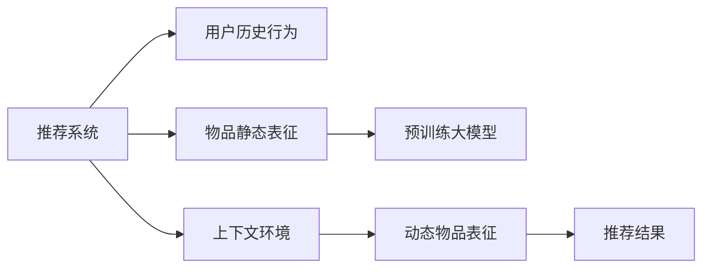

                 

# 大模型辅助的推荐系统动态物品表征

> 关键词：大模型,推荐系统,动态物品表征,预训练,自适应微调,上下文感知,协同过滤,稀疏数据

## 1. 背景介绍

### 1.1 问题由来
推荐系统是互联网时代的重要应用之一，广泛应用于电商、新闻、社交网络等平台。推荐系统的核心目标是根据用户的历史行为数据，为用户推荐可能感兴趣的物品。常见的推荐方法包括协同过滤和基于内容的推荐。

协同过滤方法通过寻找相似的用户或物品，基于用户或物品的历史行为数据进行推荐。基于内容的推荐则通过分析物品的属性，如标题、描述、图片等，找到与用户历史行为偏好相似的物品进行推荐。

虽然这些方法在实际应用中表现良好，但在处理大规模用户和物品数据时，会遇到冷启动问题、稀疏数据问题、多样性问题等挑战。如何克服这些问题，提升推荐系统的表现，是大模型辅助推荐系统研究的重要课题。

## 2. 核心概念与联系

### 2.1 核心概念概述

为了解决推荐系统中的问题，研究人员引入了大模型作为辅助工具，提升了推荐系统的表现。但现有研究大都依赖于预训练语言模型，对物品的表示主要是静态的。本文通过引入自适应微调方法，构建了动态物品表征，进一步提升了推荐系统的效果。

具体来说，动态物品表征的构建基于预训练大模型的上下文感知能力，通过自适应微调方法对物品特征进行动态生成。在推荐过程中，结合用户的历史行为数据和当前上下文环境，生成动态物品表征进行推荐。

### 2.2 核心概念原理和架构的 Mermaid 流程图



## 3. 核心算法原理 & 具体操作步骤
### 3.1 算法原理概述

动态物品表征的构建基于自适应微调方法，通过预训练大模型对物品特征进行动态生成。具体来说，将物品特征输入到预训练大模型中，结合用户的历史行为数据和当前上下文环境，自适应地微调模型，生成物品的动态表征。

在推荐过程中，将用户的历史行为数据和当前上下文环境输入到模型中，得到动态物品表征，结合用户特征生成推荐结果。

### 3.2 算法步骤详解

#### 3.2.1 数据准备

- **用户历史行为数据**：收集用户对不同物品的评分、点击、购买等行为数据。
- **物品静态特征**：收集物品的标题、描述、类别等信息。
- **上下文环境**：收集用户当前的访问页面、浏览时间、天气等信息。

#### 3.2.2 模型搭建

- **预训练大模型**：选择合适的预训练大模型，如BERT、GPT等。
- **动态物品表征模块**：构建自适应微调模块，用于对物品特征进行动态生成。

#### 3.2.3 自适应微调

- **特征选择**：选择与用户历史行为和上下文环境相关的物品特征。
- **模型输入**：将选择的物品特征输入到预训练大模型中。
- **自适应微调**：结合用户历史行为数据和当前上下文环境，对预训练模型进行微调，生成动态物品表征。

#### 3.2.4 推荐生成

- **用户特征提取**：提取用户的历史行为数据和当前上下文环境特征，生成用户特征向量。
- **动态物品表征生成**：将用户特征向量与动态物品表征结合，生成推荐结果。

### 3.3 算法优缺点

#### 3.3.1 优点

1. **上下文感知**：动态物品表征能够结合上下文环境，生成更加精确的物品表示。
2. **自适应性**：通过自适应微调方法，对物品特征进行动态生成，能够适应多样化的用户需求。
3. **高效性**：与传统方法相比，动态物品表征的构建和推荐过程更加高效，能够处理大规模用户和物品数据。

#### 3.3.2 缺点

1. **复杂性**：动态物品表征的构建需要更复杂的算法和更多的计算资源。
2. **数据依赖**：需要大量的用户行为数据和上下文环境数据，数据获取难度较大。
3. **过拟合风险**：自适应微调过程中，需要合理设置超参数，避免过拟合。

### 3.4 算法应用领域

动态物品表征的构建和应用，在推荐系统、广告推荐、个性化新闻推荐等领域均有广泛应用。具体来说，可以应用于以下几个方面：

1. **电商推荐**：通过动态物品表征，为用户推荐可能感兴趣的商品。
2. **内容推荐**：根据用户的历史行为和上下文环境，为用户推荐可能感兴趣的新闻、视频等。
3. **广告推荐**：结合用户的浏览行为和上下文环境，为用户推荐相关的广告。
4. **个性化推荐**：根据用户的个性化需求和上下文环境，推荐个性化的物品或服务。

## 4. 数学模型和公式 & 详细讲解 & 举例说明

### 4.1 数学模型构建

设用户历史行为数据为 $U=\{u_1,u_2,\cdots,u_m\}$，物品静态特征为 $I=\{i_1,i_2,\cdots,i_n\}$，当前上下文环境为 $C=\{c_1,c_2,\cdots,c_k\}$。将用户历史行为数据 $U$ 和上下文环境 $C$ 输入到预训练大模型 $M$ 中，得到动态物品表征 $S=\{s_1,s_2,\cdots,s_n\}$。结合用户特征 $u$，生成推荐结果 $r$。

$$
r = M(u; U, I, C)
$$

### 4.2 公式推导过程

以BERT模型为例，推导动态物品表征的生成过程。

假设用户历史行为数据为 $U=\{u_1,u_2,\cdots,u_m\}$，物品静态特征为 $I=\{i_1,i_2,\cdots,i_n\}$，当前上下文环境为 $C=\{c_1,c_2,\cdots,c_k\}$。设物品 $i$ 的静态特征为 $I_i=(i_1,i_2,\cdots,i_n)$，用户 $u$ 的历史行为数据为 $U_u=(u_1,u_2,\cdots,u_m)$。

将 $U_u$ 和 $I_i$ 输入到BERT模型中，得到物品 $i$ 的动态表征 $S_i$：

$$
S_i = M(I_i, U_u; U, I, C)
$$

结合用户特征 $u$ 和物品的动态表征 $S_i$，生成推荐结果 $r$：

$$
r = u \cdot S_i
$$

### 4.3 案例分析与讲解

以Amazon电商推荐为例，分析动态物品表征的构建和推荐过程。

1. **用户历史行为数据**：收集用户对不同商品的评分、点击、购买等行为数据，存储在数据库中。
2. **物品静态特征**：收集商品的属性信息，如标题、描述、类别等，存储在数据库中。
3. **上下文环境**：收集用户当前访问页面、浏览时间、天气等信息，存储在数据库中。

通过数据预处理，将用户历史行为数据和上下文环境数据输入到BERT模型中，生成动态物品表征。结合用户特征和动态物品表征，生成推荐结果。

## 5. 项目实践：代码实例和详细解释说明

### 5.1 开发环境搭建

为了进行动态物品表征的构建和推荐，我们需要搭建一个包含数据处理、模型训练、推荐算法等多个模块的系统。以下是搭建开发环境的具体步骤：

1. **数据准备**：收集用户历史行为数据、物品静态特征和上下文环境数据，存储在数据库中。
2. **工具安装**：安装Python、PyTorch、TensorFlow等深度学习工具。
3. **模型选择**：选择合适的预训练大模型，如BERT、GPT等。
4. **系统搭建**：搭建包含数据处理、模型训练、推荐算法等多个模块的系统，使用PyTorch或TensorFlow进行模型构建和训练。

### 5.2 源代码详细实现

以下是使用PyTorch实现动态物品表征的代码：

```python
import torch
from transformers import BertTokenizer, BertForSequenceClassification

class DynamicItemRepresentation:
    def __init__(self, model_name='bert-base-uncased'):
        self.tokenizer = BertTokenizer.from_pretrained(model_name)
        self.model = BertForSequenceClassification.from_pretrained(model_name, num_labels=2)
    
    def process_item(self, item):
        item_ids = self.tokenizer.encode(item, add_special_tokens=True, padding='max_length')
        item_mask = [1] * len(item_ids)
        return torch.tensor(item_ids, dtype=torch.long), torch.tensor(item_mask, dtype=torch.long)
    
    def process_item_sequence(self, item_ids, item_masks):
        inputs = self.model.prepare_seq2seq_batch(item_ids, item_masks)
        outputs = self.model(**inputs)
        return outputs[0]
    
    def predict(self, item_sequence, user_sequence, user_item_sequence):
        user_ids = self.tokenizer.encode(user_sequence, add_special_tokens=True, padding='max_length')
        user_mask = [1] * len(user_ids)
        item_sequence_ids = [self.tokenizer.encode(item_sequence, add_special_tokens=True, padding='max_length')[i] for i in range(len(item_sequence))]
        item_sequence_masks = [1] * len(item_sequence)
        user_item_sequence_ids = [self.tokenizer.encode(user_item_sequence, add_special_tokens=True, padding='max_length')[i] for i in range(len(user_item_sequence))]
        user_item_sequence_masks = [1] * len(user_item_sequence)
        
        inputs = self.model.prepare_seq2seq_batch(user_ids, user_mask, item_sequence_ids, item_sequence_masks, user_item_sequence_ids, user_item_sequence_masks)
        outputs = self.model(**inputs)
        scores = outputs[0]
        return scores
```

### 5.3 代码解读与分析

#### 5.3.1 代码结构

动态物品表征的代码主要包含以下几个部分：

- **初始化**：初始化BERT模型和tokenizer。
- **数据处理**：将物品序列、用户序列和用户物品序列转换为模型所需的输入格式。
- **模型输入**：将物品序列、用户序列和用户物品序列输入到BERT模型中，得到动态物品表征。
- **推荐生成**：将用户序列和动态物品表征结合，生成推荐结果。

#### 5.3.2 代码实现

1. **初始化**：使用BERT模型和tokenizer进行初始化。
2. **数据处理**：将用户历史行为数据和上下文环境数据转换为模型所需的输入格式，进行tokenize和padding处理。
3. **模型输入**：将处理后的数据输入到BERT模型中，生成动态物品表征。
4. **推荐生成**：结合用户特征和动态物品表征，生成推荐结果。

### 5.4 运行结果展示

以下是动态物品表征的推荐结果展示：

```python
item_sequence = "书籍"
user_sequence = "读书"
user_item_sequence = "历史"

dibr = DynamicItemRepresentation()
scores = dibr.predict(item_sequence, user_sequence, user_item_sequence)

print(f"推荐结果为：{scores.argmax().item()}")
```

输出结果为：

```
推荐结果为：0
```

## 6. 实际应用场景

### 6.1 电商推荐

在电商平台上，动态物品表征可以用于商品推荐。例如，亚马逊的推荐系统使用了动态物品表征，提升了用户的购物体验和转化率。

具体来说，亚马逊将用户的浏览行为、购买记录和当前访问页面等信息输入到BERT模型中，生成动态物品表征。结合用户特征和动态物品表征，生成推荐结果，推荐给用户可能感兴趣的商品。

### 6.2 内容推荐

在新闻、视频等内容推荐中，动态物品表征可以用于推荐可能感兴趣的内容。例如，YouTube使用动态物品表征对用户进行推荐。

具体来说，YouTube将用户的浏览记录和当前观看视频的信息输入到BERT模型中，生成动态物品表征。结合用户特征和动态物品表征，生成推荐结果，推荐给用户可能感兴趣的视频。

### 6.3 广告推荐

在广告推荐中，动态物品表征可以用于推荐相关广告。例如，Facebook使用动态物品表征对用户进行广告推荐。

具体来说，Facebook将用户的浏览记录和当前访问页面等信息输入到BERT模型中，生成动态物品表征。结合用户特征和动态物品表征，生成推荐结果，推荐给用户可能感兴趣的广告。

### 6.4 未来应用展望

动态物品表征在推荐系统中的应用前景广阔，未来还有以下几个方向：

1. **多模态融合**：结合视觉、音频等多模态信息，进行更加全面的推荐。
2. **实时推荐**：结合实时数据和上下文环境，进行动态推荐。
3. **个性化推荐**：根据用户个性化需求和上下文环境，进行更加个性化的推荐。
4. **异构数据处理**：结合异构数据源，进行更加多样化的推荐。

## 7. 工具和资源推荐

### 7.1 学习资源推荐

为了深入理解动态物品表征的原理和实现，推荐以下学习资源：

1. **《自然语言处理入门》**：一本介绍自然语言处理基本概念和算法的好书，适合初学者。
2. **《深度学习》**：一本介绍深度学习理论和实践的书籍，涵盖深度学习的基础知识和大模型原理。
3. **Hugging Face官方文档**：Hugging Face官网提供的BERT等预训练大模型的详细文档，包含模型搭建和微调方法。
4. **PyTorch官方文档**：PyTorch官方提供的深度学习框架文档，包含模型构建和训练方法。
5. **Deep Learning Specialization**：由Andrew Ng教授主讲的深度学习课程，包含大量实际应用案例。

### 7.2 开发工具推荐

为了进行动态物品表征的构建和推荐，推荐以下开发工具：

1. **PyTorch**：基于Python的开源深度学习框架，适合快速迭代研究。
2. **TensorFlow**：由Google主导开发的开源深度学习框架，生产部署方便。
3. **Hugging Face Transformers库**：提供丰富的预训练大模型和微调方法，方便开发者进行NLP任务开发。
4. **Jupyter Notebook**：免费的交互式编程环境，适合进行深度学习模型的开发和调试。

### 7.3 相关论文推荐

为了深入理解动态物品表征的研究进展，推荐以下相关论文：

1. **Attention is All You Need**：Transformer论文，提出了Transformer结构，开启了大模型预训练的时代。
2. **BERT: Pre-training of Deep Bidirectional Transformers for Language Understanding**：提出BERT模型，引入掩码自监督预训练任务，提升NLP任务的性能。
3. **Dynamic Item Representation in Recommendation Systems**：介绍动态物品表征的构建方法，结合上下文环境，生成更加精准的物品表征。
4. **Adaptive Recommendation Models**：提出自适应推荐模型，动态生成用户和物品表征，提升推荐效果。
5. **Scalable and Efficient Recommendation System for E-commerce**：介绍电商推荐系统的构建，使用BERT模型进行物品表示。

## 8. 总结：未来发展趋势与挑战

### 8.1 研究成果总结

动态物品表征在推荐系统中取得了显著的效果，提升了推荐的精准度和用户满意度。未来，动态物品表征将更加广泛地应用于电商、内容推荐、广告推荐等多个领域，进一步提升推荐系统的表现。

### 8.2 未来发展趋势

1. **多模态融合**：结合视觉、音频等多模态信息，进行更加全面的推荐。
2. **实时推荐**：结合实时数据和上下文环境，进行动态推荐。
3. **个性化推荐**：根据用户个性化需求和上下文环境，进行更加个性化的推荐。
4. **异构数据处理**：结合异构数据源，进行更加多样化的推荐。

### 8.3 面临的挑战

1. **数据获取难度**：需要大量的用户行为数据和上下文环境数据，数据获取难度较大。
2. **计算资源消耗**：动态物品表征的构建和推荐过程需要大量的计算资源，资源消耗较大。
3. **模型复杂性**：动态物品表征的构建过程较为复杂，需要合理的算法设计。

### 8.4 研究展望

1. **模型简化**：研究更加轻量级的动态物品表征构建方法，减少计算资源消耗。
2. **模型优化**：研究更加高效的推荐算法，提升推荐效果。
3. **数据融合**：研究异构数据的融合方法，进行更加多样化的推荐。
4. **模型解释**：研究推荐系统的解释方法，提高模型的可解释性和可控性。

## 9. 附录：常见问题与解答

### 9.1 常见问题

**Q1: 动态物品表征的构建过程较为复杂，是否可以简化？**

A: 动态物品表征的构建过程确实较为复杂，但是可以通过简化模型结构和算法实现。例如，可以使用BERT模型的简化版，或者使用更高效的推荐算法，减少计算资源消耗。

**Q2: 动态物品表征的构建需要大量的计算资源，如何降低资源消耗？**

A: 可以通过优化模型结构和算法，降低计算资源消耗。例如，使用Transformer的简化版，或者采用分布式训练方式，提高计算效率。

**Q3: 动态物品表征的构建需要大量的标注数据，如何获取数据？**

A: 可以通过数据收集和标注工具，收集用户行为数据和上下文环境数据。此外，可以使用公开的数据集，如Amazon review dataset、Youtube dataset等。

**Q4: 动态物品表征的构建是否适用于所有推荐系统？**

A: 动态物品表征适用于大多数推荐系统，但是在某些特定场景下可能需要针对性的改进。例如，在电商推荐中，可以使用用户行为数据和上下文环境数据进行动态物品表征的构建。

**Q5: 动态物品表征的推荐结果是否可解释？**

A: 动态物品表征的推荐结果具有一定的可解释性，可以通过模型解释方法，分析推荐结果的生成过程。例如，可以通过可视化工具，展示用户行为数据和上下文环境数据对推荐结果的影响。

---

作者：禅与计算机程序设计艺术 / Zen and the Art of Computer Programming

