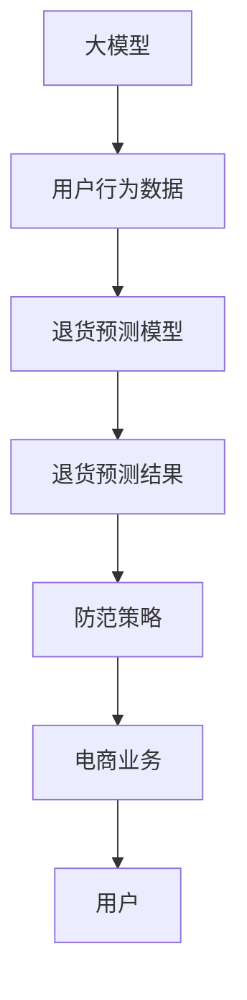

                 

# 大模型驱动的电商个性化退货预测与防范策略

> 关键词：大模型, 个性化退货预测, 防范策略, 电商业务, 推荐系统

## 1. 背景介绍

随着电商行业的高速发展，个性化推荐已成为电商平台提升用户体验、增加用户粘性和销售转化的重要手段。传统的推荐系统主要依赖用户行为数据进行个性化建模，但这种基于历史数据的推荐方式无法及时响应用户需求的变化。特别是在退货这一环节，传统推荐系统无法预测用户的退货意愿，导致电商企业面临着较高的运营风险和经济损失。

为应对这一挑战，利用大模型技术进行个性化退货预测与防范策略的研究成为热点。通过结合电商行业的大规模数据和大模型技术，能够实现对用户退货意愿的精准预测，从而制定针对性的防范策略，显著降低电商平台的退货率，提升业务运营效率和客户满意度。

## 2. 核心概念与联系

### 2.1 核心概念概述

为了更好地理解大模型驱动的个性化退货预测与防范策略，我们首先需要介绍几个核心概念：

- **大模型(Large Model)**：指通过大规模数据预训练得到的深度学习模型，如BERT、GPT等。这些模型能够学习到丰富的语言和结构化知识，具有强大的泛化能力。

- **个性化退货预测**：指利用用户的电商行为数据，结合大模型的知识，预测用户退货意愿的过程。预测结果可以用于提前干预，减少无谓退货。

- **防范策略**：指基于退货预测结果，采取的针对性的干预措施，如调整产品描述、优惠活动、物流服务等，提升用户满意度，降低退货率。

- **电商业务**：指通过互联网平台进行的商品买卖活动，包括用户搜索、浏览、购买、退货等环节。电商业务需要高效、精准的推荐系统支持。

- **推荐系统**：指通过用户行为数据和商品特征，为用户推荐最相关商品的系统。推荐系统的目标在于提升用户满意度、增加销售转化和平台收入。

- **用户行为数据**：指用户在电商平台上的搜索、浏览、购买、评价等行为数据，是推荐系统和大模型预测的基础。

- **产品描述**：指商品的文字、图片、视频等描述信息，用于吸引用户购买。

- **优惠活动**：指电商平台为了促销而设置的各种折扣、红包、满减等活动，吸引用户购买。

- **物流服务**：指商品从商家到用户的运输服务，包括快递、自提等。

这些核心概念之间通过电商业务这一主线紧密联系起来，形成了一个完整的预测与防范策略体系。

### 2.2 核心概念原理和架构的 Mermaid 流程图



该图展示了大模型在电商个性化退货预测与防范策略中的作用流程。首先，大模型通过电商用户行为数据进行预训练，获得通用的电商领域知识。然后，利用这些知识进行退货预测，并根据预测结果制定针对性的防范策略。这些策略最终反馈到电商业务环节，提升用户满意度和平台运营效率。

## 3. 核心算法原理 & 具体操作步骤

### 3.1 算法原理概述

大模型驱动的个性化退货预测与防范策略，其核心原理是基于大模型的自监督预训练和微调，结合电商业务数据进行退货预测和防范。具体步骤如下：

1. **数据收集与预处理**：从电商平台收集用户的搜索、浏览、购买、评价等行为数据，并进行预处理和清洗，形成电商行为数据集。

2. **大模型预训练**：使用电商行为数据集对大模型进行预训练，学习电商领域的语言和结构化知识。

3. **数据增强**：通过对电商行为数据进行增强，如数据合成、对抗样本生成等，提高模型的泛化能力和鲁棒性。

4. **微调与训练**：在大模型预训练的基础上，结合用户退货数据，对模型进行微调，提升退货预测的准确性。

5. **预测与策略生成**：利用微调后的模型，对新用户行为数据进行预测，生成退货防范策略。

6. **策略执行与反馈**：根据预测结果，执行相应的防范策略，并通过用户反馈调整模型和策略。

### 3.2 算法步骤详解

#### 步骤1：数据收集与预处理

电商行为数据包括用户ID、商品ID、购买时间、浏览时间、评价内容等。数据预处理主要包括以下步骤：

- **去重与清洗**：去除重复数据和无效数据，确保数据的质量。
- **归一化与标准化**：对数据进行归一化处理，如将商品价格归一化到0-1之间。
- **缺失值处理**：对缺失值进行填充或删除，确保数据的完整性。

#### 步骤2：大模型预训练

大模型的预训练通常采用自监督学习方法，如掩码语言模型(Masked Language Model, MLM)和自回归语言模型(Next Sentence Prediction, NSP)。具体步骤如下：

- **数据划分**：将电商行为数据集划分为训练集和验证集，确保数据集的代表性。
- **数据增强**：通过数据合成、对抗样本生成等方式，增强数据集的多样性和难度。
- **模型预训练**：使用Transformer等模型架构，在大规模电商数据上预训练，学习电商领域的语言和结构化知识。

#### 步骤3：数据增强

数据增强的目的是提高模型的泛化能力和鲁棒性。常见的方法包括：

- **数据合成**：通过对电商行为数据进行合成，生成更多的训练样本。如随机改变商品价格、生成虚假订单等。
- **对抗样本生成**：利用对抗样本生成技术，生成能够误导模型预测的样本，提高模型的鲁棒性。
- **迁移学习**：利用其他领域的数据进行迁移学习，提高模型对新领域数据的适应能力。

#### 步骤4：微调与训练

微调是将预训练的大模型应用于特定任务的过程。退货预测微调的目标是提高模型对用户退货意愿的预测准确性。具体步骤如下：

- **模型初始化**：将预训练模型作为初始化参数，保留大部分预训练权重。
- **损失函数设计**：设计适合退货预测任务的损失函数，如交叉熵损失、均方误差损失等。
- **超参数设置**：设置合适的学习率、批大小、迭代轮数等超参数。
- **梯度下降优化**：使用梯度下降等优化算法，更新模型参数，最小化损失函数。
- **验证集评估**：在验证集上评估模型性能，调整模型参数，防止过拟合。

#### 步骤5：预测与策略生成

预测阶段的目标是根据新用户行为数据，预测其退货意愿，生成退货防范策略。具体步骤如下：

- **输入数据准备**：将新用户行为数据预处理为模型输入格式。
- **模型前向传播**：将输入数据输入微调后的模型，进行前向传播计算。
- **预测结果生成**：根据模型的输出，生成用户退货意愿的预测结果。
- **策略生成**：根据预测结果，生成针对性的防范策略，如调整产品描述、提供优惠活动、改进物流服务等。

#### 步骤6：策略执行与反馈

策略执行是将生成的策略应用于电商业务环节，提升用户满意度和平台运营效率。具体步骤如下：

- **策略执行**：根据预测结果和防范策略，调整电商平台的相关业务环节，如修改产品描述、设置优惠活动、优化物流服务等。
- **用户反馈收集**：收集用户对策略执行的反馈，如满意度评分、评价内容等。
- **模型与策略优化**：根据用户反馈，优化模型和策略，提高预测准确性和策略效果。

### 3.3 算法优缺点

#### 优点

1. **高效性**：大模型通过自监督预训练学习通用知识，在微调阶段可以快速适应特定任务，提升预测精度。
2. **泛化能力**：大模型能够学习到电商领域的通用知识，对新用户的退货预测也有较好的泛化能力。
3. **可解释性**：大模型的预训练和微调过程透明，容易解释和调试。
4. **动态调整**：模型和策略可以根据用户反馈进行动态调整，提高预测准确性和策略效果。

#### 缺点

1. **数据依赖**：大模型的性能很大程度上依赖于电商数据的数量和质量，获取高质量标注数据成本较高。
2. **计算资源消耗**：大模型需要大量的计算资源进行预训练和微调，对硬件设备要求较高。
3. **对抗样本鲁棒性**：大模型可能对对抗样本较为敏感，鲁棒性有待提升。
4. **过拟合风险**：在标注数据较少的情况下，模型可能出现过拟合，影响预测效果。

### 3.4 算法应用领域

大模型驱动的个性化退货预测与防范策略，可以广泛应用于以下电商业务领域：

- **个性化推荐系统**：结合退货预测结果，优化推荐算法，减少因退货导致的推荐偏差。
- **用户行为分析**：分析用户退货行为，发现潜在的用户流失风险，进行提前干预。
- **客户服务优化**：根据退货预测结果，优化客服人员的响应策略，提升用户满意度。
- **库存管理**：预测退货率，优化库存管理策略，减少库存积压和缺货现象。
- **营销策略调整**：根据退货预测结果，调整优惠活动和推广策略，提高销售转化率。
- **物流服务改进**：预测退货率，优化物流服务流程，减少退货投诉和物流成本。

## 4. 数学模型和公式 & 详细讲解 & 举例说明

### 4.1 数学模型构建

退货预测模型的目标是通过用户行为数据，预测其退货意愿。假设用户行为数据集为 $\{(x_i, y_i)\}_{i=1}^N$，其中 $x_i$ 为行为数据，$y_i$ 为退货标记（0表示不退货，1表示退货）。退货预测模型的数学模型可以表示为：

$$
\hat{y} = M(x)
$$

其中 $M$ 为预测模型，$\hat{y}$ 为预测结果，$x$ 为用户行为数据。

### 4.2 公式推导过程

假设 $M$ 为深度学习模型，其参数为 $\theta$。退货预测模型的训练目标是最小化损失函数 $\mathcal{L}$，即：

$$
\mathcal{L}(\theta) = \frac{1}{N}\sum_{i=1}^N \ell(\hat{y_i}, y_i)
$$

其中 $\ell$ 为损失函数，通常选择交叉熵损失或均方误差损失。

为了推导损失函数的梯度，首先需要计算预测结果 $\hat{y_i}$ 和真实标签 $y_i$ 之间的交叉熵损失：

$$
\ell(\hat{y_i}, y_i) = -y_i\log \hat{y_i} - (1-y_i)\log (1-\hat{y_i})
$$

将上式代入损失函数 $\mathcal{L}$，得：

$$
\mathcal{L}(\theta) = -\frac{1}{N}\sum_{i=1}^N [y_i\log \hat{y_i} + (1-y_i)\log (1-\hat{y_i})]
$$

根据链式法则，损失函数对参数 $\theta$ 的梯度为：

$$
\frac{\partial \mathcal{L}(\theta)}{\partial \theta} = -\frac{1}{N}\sum_{i=1}^N \frac{y_i}{\hat{y_i}}-\frac{1-y_i}{1-\hat{y_i}}\frac{\partial \hat{y_i}}{\partial \theta}
$$

其中 $\frac{\partial \hat{y_i}}{\partial \theta}$ 为预测模型的梯度，可以通过反向传播算法高效计算。

### 4.3 案例分析与讲解

以电商平台的用户退货预测为例，假设有一个电商行为数据集 $\{(x_i, y_i)\}_{i=1}^N$，其中 $x_i$ 为历史订单信息，$y_i$ 为退货标记。我们可以通过以下步骤进行退货预测：

1. **数据收集与预处理**：从电商平台收集用户订单信息，进行数据清洗和归一化处理。
2. **大模型预训练**：使用电商行为数据集对BERT等大模型进行预训练，学习电商领域的语言和结构化知识。
3. **数据增强**：通过数据合成和对抗样本生成，提高模型的泛化能力和鲁棒性。
4. **微调与训练**：在大模型预训练的基础上，对退货预测任务进行微调，提升模型预测准确性。
5. **预测与策略生成**：利用微调后的模型，对新订单信息进行预测，生成退货防范策略。
6. **策略执行与反馈**：根据预测结果和防范策略，调整电商平台的相关业务环节，收集用户反馈，优化模型和策略。

## 5. 项目实践：代码实例和详细解释说明

### 5.1 开发环境搭建

在进行大模型驱动的退货预测与防范策略开发前，我们需要准备好开发环境。以下是使用Python进行TensorFlow开发的示例：

1. **安装Anaconda**：从官网下载并安装Anaconda，用于创建独立的Python环境。

2. **创建并激活虚拟环境**：
```bash
conda create -n tf-env python=3.8 
conda activate tf-env
```

3. **安装TensorFlow**：根据CUDA版本，从官网获取对应的安装命令。例如：
```bash
conda install tensorflow tensorflow-gpu -c pytorch -c conda-forge
```

4. **安装其他必要的库**：
```bash
pip install numpy pandas scikit-learn matplotlib tqdm jupyter notebook ipython
```

完成上述步骤后，即可在`tf-env`环境中开始项目实践。

### 5.2 源代码详细实现

下面以电商平台的用户退货预测为例，给出使用TensorFlow对BERT模型进行微调的示例代码。

```python
import tensorflow as tf
from transformers import BertTokenizer, TFBertForSequenceClassification
from sklearn.metrics import accuracy_score
import pandas as pd

# 数据准备
train_data = pd.read_csv('train.csv', sep=',')
test_data = pd.read_csv('test.csv', sep=',')

# 分词与预处理
tokenizer = BertTokenizer.from_pretrained('bert-base-uncased')
train_encodings = tokenizer(train_data['text'].tolist(), truncation=True, padding=True)
test_encodings = tokenizer(test_data['text'].tolist(), truncation=True, padding=True)

# 模型初始化
model = TFBertForSequenceClassification.from_pretrained('bert-base-uncased', num_labels=2)

# 模型训练
def train_step(encodings, labels):
    model.train()
    with tf.GradientTape() as tape:
        outputs = model(encodings['input_ids'], attention_mask=encodings['attention_mask'], labels=labels)
        loss = outputs.loss
    loss = tf.reduce_mean(loss)
    gradients = tape.gradient(loss, model.trainable_variables)
    optimizer.apply_gradients(zip(gradients, model.trainable_variables))

# 模型评估
def evaluate_step(encodings, labels):
    model.eval()
    with tf.GradientTape() as tape:
        outputs = model(encodings['input_ids'], attention_mask=encodings['attention_mask'], labels=labels)
        predictions = tf.argmax(outputs.logits, axis=1)
    return accuracy_score(labels, predictions)

# 训练模型
epochs = 5
batch_size = 32
optimizer = tf.keras.optimizers.Adam(learning_rate=2e-5)

for epoch in range(epochs):
    for i in range(0, len(train_data), batch_size):
        batch_encodings, batch_labels = train_encodings[i:i+batch_size], train_data['label'][i:i+batch_size]
        train_step(batch_encodings, batch_labels)
    print(f'Epoch {epoch+1}, training accuracy: {evaluate_step(test_encodings, test_data['label']):.4f}')

# 模型保存
model.save('predict_model')
```

在这个示例中，我们使用了TensorFlow和HuggingFace的Transformers库。首先，通过Pandas加载训练数据和测试数据，进行分词和预处理。然后，初始化BERT模型，并定义训练和评估函数。最后，通过TensorFlow的GradientTape进行梯度计算，并使用Adam优化器进行模型训练。在每个epoch结束时，评估模型在测试集上的准确率，并保存到文件。

### 5.3 代码解读与分析

下面是代码中关键部分的解读与分析：

- **数据准备**：使用Pandas加载训练数据和测试数据，并进行分词和预处理。
- **模型初始化**：通过HuggingFace的BertTokenizer分词，并将模型初始化为BertForSequenceClassification。
- **模型训练**：定义训练函数train_step，使用GradientTape进行梯度计算，并使用Adam优化器更新模型参数。
- **模型评估**：定义评估函数evaluate_step，计算模型在测试集上的准确率。
- **训练过程**：循环迭代训练数据，使用小批量数据进行梯度下降优化。
- **模型保存**：使用TensorFlow的model.save方法将模型保存到文件，以便后续使用。

## 6. 实际应用场景

### 6.1 智能客服

在智能客服领域，退货预测与防范策略能够帮助电商平台提前识别可能出现退货的用户，采取针对性的服务措施。例如，对于退货意愿高的用户，智能客服可以主动联系用户，了解其退换货原因，并提供相应的解决方案，如更换商品、提供优惠券等，提升用户满意度。

### 6.2 物流管理

在物流管理环节，退货预测与防范策略可以帮助电商平台优化物流流程，减少因退货导致的物流成本和时间浪费。例如，对于退货率较高的商品，平台可以优化物流线路，提升配送效率，或者提供更多的物流选择，降低用户退货的可能性。

### 6.3 个性化推荐

在个性化推荐系统方面，退货预测与防范策略可以优化推荐算法，减少因退货导致的推荐偏差。例如，对于退货率较高的商品，推荐系统可以减少该商品的推荐频率，避免用户再次下单。

### 6.4 库存管理

在库存管理方面，退货预测与防范策略可以帮助电商平台更好地预测库存需求，避免库存积压和缺货现象。例如，根据退货预测结果，平台可以调整库存策略，减少因退货导致的库存浪费。

## 7. 工具和资源推荐

### 7.1 学习资源推荐

为了帮助开发者系统掌握大模型驱动的退货预测与防范策略，以下是一些优质的学习资源：

1. **《深度学习入门：基于Python的理论与实现》**：这本书系统介绍了深度学习的理论基础和Python实现，适合初学者入门。
2. **CS229《机器学习》课程**：斯坦福大学开设的机器学习课程，涵盖深度学习、优化算法等内容，适合进阶学习。
3. **《自然语言处理综论》**：本书深入介绍了自然语言处理的基本概念和算法，适合深入研究。
4. **HuggingFace官方文档**：HuggingFace提供的模型和工具文档，涵盖模型介绍、使用方法、案例分析等内容，是学习大模型的重要资源。
5. **Kaggle竞赛**：Kaggle平台上有多个退货预测竞赛，可以参与竞赛实践，提升技能。

### 7.2 开发工具推荐

为了高效开发大模型驱动的退货预测与防范策略，以下是一些常用的开发工具：

1. **TensorFlow**：TensorFlow是Google开源的深度学习框架，支持分布式计算和动态图，适合复杂模型的训练和推理。
2. **PyTorch**：PyTorch是Facebook开源的深度学习框架，支持动态图和静态图，易于调试和优化。
3. **HuggingFace Transformers**：HuggingFace提供的NLP工具库，支持多种预训练模型和微调方法，是进行自然语言处理的重要工具。
4. **Jupyter Notebook**：Jupyter Notebook是一个开源的交互式笔记本环境，适合进行数据处理、模型训练和结果展示。
5. **GitHub**：GitHub是一个代码托管平台，适合团队协作开发和代码版本控制。

### 7.3 相关论文推荐

大模型驱动的退货预测与防范策略是一个新兴的研究方向，以下是几篇有代表性的相关论文：

1. **"Predicting Customer Churn"**：该论文研究了电商用户流失预测问题，提出了基于机器学习的预测模型，并结合用户行为数据进行优化。
2. **"Deep Learning for Customer Retention"**：该论文研究了客户保留问题，提出了基于深度学习的预测模型，并结合用户行为数据进行优化。
3. **"Generative Adversarial Networks for Customer Churn Prediction"**：该论文研究了客户流失预测问题，提出了基于生成对抗网络的预测模型，并结合用户行为数据进行优化。
4. **"Customer Churn Prediction Using Data Mining and Machine Learning Techniques"**：该论文研究了客户流失预测问题，提出了基于数据挖掘和机器学习的预测模型，并结合用户行为数据进行优化。

## 8. 总结：未来发展趋势与挑战

### 8.1 研究成果总结

大模型驱动的退货预测与防范策略是一个前沿的NLP技术，已经在电商领域得到了广泛应用。通过结合大模型预训练和微调技术，该方法能够对用户的退货意愿进行精准预测，并制定针对性的防范策略，显著降低电商平台的退货率，提升业务运营效率和客户满意度。

### 8.2 未来发展趋势

未来，大模型驱动的退货预测与防范策略将呈现以下几个发展趋势：

1. **模型规模增大**：随着算力成本的下降和数据规模的扩张，大模型的参数量将持续增长，提升模型的泛化能力和预测精度。
2. **算法优化**：研究更加高效、轻量级的模型和算法，如模型压缩、参数高效微调等，提升模型的运行效率和实用性。
3. **数据增强**：研究更加多样、有效的数据增强方法，如对抗样本生成、数据合成等，提升模型的泛化能力和鲁棒性。
4. **多模态融合**：研究将视觉、语音等多模态数据与文本数据进行融合的方法，提升模型的跨领域适应能力和性能。
5. **自监督学习**：研究基于自监督学习的大模型预训练方法，减少对标注数据的依赖，提高模型的泛化能力和鲁棒性。
6. **因果推断**：研究引入因果推断方法，增强模型预测结果的可解释性和可控性，提升模型的可信度和应用价值。

### 8.3 面临的挑战

虽然大模型驱动的退货预测与防范策略已经取得了显著进展，但仍面临一些挑战：

1. **数据质量问题**：电商行为数据的质量对模型性能有重要影响，数据不完整、不一致等问题可能导致模型过拟合或欠拟合。
2. **计算资源消耗**：大模型的预训练和微调需要大量计算资源，对硬件设备要求较高。
3. **对抗样本鲁棒性**：大模型可能对对抗样本较为敏感，鲁棒性有待提升。
4. **过拟合风险**：在标注数据较少的情况下，模型可能出现过拟合，影响预测效果。
5. **模型解释性**：大模型往往是"黑盒"系统，难以解释其内部工作机制和决策逻辑。

### 8.4 研究展望

为了应对以上挑战，未来的研究需要在以下几个方面寻求新的突破：

1. **数据质量提升**：研究数据清洗、去重、归一化等技术，提升电商行为数据的质量。
2. **计算资源优化**：研究模型压缩、分布式训练等技术，优化大模型的计算资源消耗。
3. **对抗样本防御**：研究对抗样本生成和防御技术，提升模型的鲁棒性。
4. **过拟合控制**：研究数据增强、正则化等技术，控制模型的过拟合风险。
5. **模型可解释性**：研究可解释性方法，如因果推断、对抗样本生成等，提升模型的可解释性和可信度。

总之，大模型驱动的退货预测与防范策略是电商领域的重要研究方向，具有广阔的应用前景。通过不断优化模型和算法，提升数据质量，控制计算资源消耗，增强模型鲁棒性和可解释性，相信该方法将为电商行业带来更多的创新和变革。

## 9. 附录：常见问题与解答

**Q1：大模型驱动的退货预测与防范策略的主要优势是什么？**

A: 大模型驱动的退货预测与防范策略的主要优势包括：

1. **精准预测**：利用大模型强大的泛化能力，对用户的退货意愿进行精准预测，减少因退货导致的损失。
2. **动态调整**：根据用户反馈进行动态调整，优化模型和策略，提高预测准确性和策略效果。
3. **鲁棒性强**：通过数据增强和对抗样本生成，提高模型的鲁棒性和泛化能力，减少对抗样本对模型的影响。
4. **灵活性高**：结合电商业务特点，灵活设计退货预测模型和防范策略，满足不同场景的需求。

**Q2：如何提高电商行为数据的质量？**

A: 电商行为数据的质量对退货预测模型的性能有重要影响，可以通过以下方法提升数据质量：

1. **数据清洗**：去除重复数据、无效数据和异常值，确保数据的完整性和一致性。
2. **数据归一化**：对数据进行归一化处理，如将商品价格归一化到0-1之间，提升模型的泛化能力。
3. **数据合成**：通过数据合成技术，生成更多的训练样本，提高模型的泛化能力和鲁棒性。
4. **数据标注**：对部分数据进行标注，提升模型的训练效果。

**Q3：如何控制模型的过拟合风险？**

A: 控制模型的过拟合风险是退货预测模型训练中的重要问题，可以通过以下方法进行控制：

1. **数据增强**：通过数据合成和对抗样本生成，提高模型的泛化能力和鲁棒性，减少过拟合风险。
2. **正则化**：使用L2正则、Dropout等正则化技术，限制模型复杂度，防止过拟合。
3. **早停策略**：在验证集上监测模型性能，一旦性能不再提升，立即停止训练，避免过拟合。

**Q4：如何提升模型的可解释性？**

A: 提升模型的可解释性是退货预测模型应用中的重要问题，可以通过以下方法进行提升：

1. **可解释性方法**：使用因果推断、对抗样本生成等方法，增强模型的可解释性和可信度。
2. **可视化工具**：使用可视化工具，如TensorBoard、Jupyter Notebook等，展示模型的输入输出、参数分布等信息，增强模型的可解释性。
3. **用户反馈**：收集用户反馈，了解模型的决策依据，调整模型和策略，提升模型的可解释性。

---

作者：禅与计算机程序设计艺术 / Zen and the Art of Computer Programming

