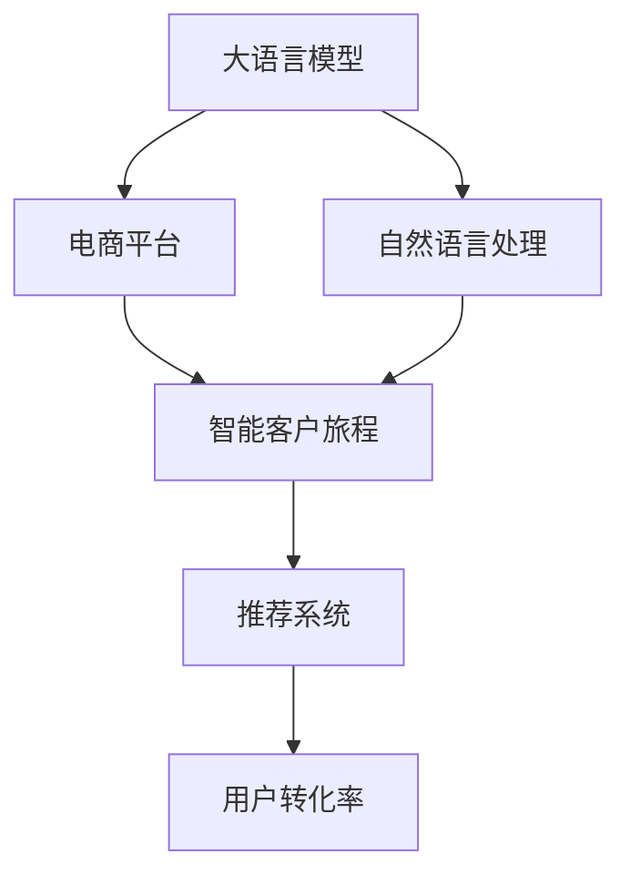

                 

# 大模型驱动的电商平台智能客户旅程规划

## 1. 背景介绍

随着互联网技术的快速发展，电商平台在各行各业中的重要性日益凸显。如何通过精准的用户行为分析和智能推荐，提升用户体验和转化率，成为了各大电商平台亟待解决的关键问题。传统的数据驱动分析方法，往往依赖于对历史数据的统计和模式匹配，难以捕捉用户即时的行为变化和需求动态。

大语言模型作为人工智能领域的最新突破，结合了深度学习和自然语言处理的能力，能够在海量的用户评论、聊天记录、搜索记录等文本数据中，深度挖掘用户的真实需求和情感倾向，提供更加精准的个性化服务。本文将探讨如何使用大语言模型驱动电商平台构建智能客户旅程，提升用户互动体验和转化率。

## 2. 核心概念与联系

### 2.1 核心概念概述

为更好地理解大模型驱动的电商平台智能客户旅程规划，我们需要了解几个关键的概念：

- 大语言模型(Large Language Model, LLM)：以自回归(如GPT)或自编码(如BERT)模型为代表的大规模预训练语言模型。通过在海量无标签文本语料上进行预训练，学习通用的语言表示，具备强大的语言理解和生成能力。

- 电商平台：一种通过互联网交易商品或服务的在线平台。用户可以通过浏览、搜索、购买等行为，实现商品展示、购买、评价等功能。

- 智能客户旅程(智能用户路径)：指用户在电商平台上的行为路径，包括浏览、搜索、咨询、购买、评价等环节，以及每个环节的转换行为和用户情感。

- 自然语言处理(Natural Language Processing, NLP)：使计算机能够理解和处理人类自然语言的技术，包括分词、命名实体识别、情感分析、意图识别等。

- 推荐系统：根据用户的历史行为和偏好，智能推荐相关商品或服务的技术，提高用户满意度和转化率。

这些概念之间的联系可以通过以下Mermaid流程图来展示：



这个流程图展示了从大语言模型到智能客户旅程，再到推荐系统的逻辑关系：

1. 大语言模型通过学习海量文本数据，提取用户的真实需求和情感。
2. 电商平台通过自然语言处理技术，分析用户行为和情感，构建智能客户旅程。
3. 智能客户旅程数据输入推荐系统，生成个性化的商品推荐。
4. 推荐系统提升用户转化率，从而提升电商平台的业务价值。

## 3. 核心算法原理 & 具体操作步骤

### 3.1 算法原理概述

大语言模型驱动的电商平台智能客户旅程规划，主要利用大模型的语言理解和生成能力，通过自然语言处理技术，分析用户的行为和情感，从而构建智能客户旅程，最终驱动推荐系统提供个性化的商品推荐。

具体来说，步骤如下：

1. **数据预处理**：从电商平台的日志和评论中收集用户数据，包括浏览记录、搜索关键词、评价内容等。对数据进行清洗、分词、去噪等处理。
2. **大模型微调**：在预训练的大语言模型基础上，进行任务适配微调，如情感分析、意图识别、命名实体识别等，学习用户的行为模式和情感倾向。
3. **智能客户旅程构建**：通过自然语言处理技术，对用户行为数据进行情感分析、意图识别和实体抽取，构建完整的智能客户旅程，识别用户的转换行为和情感变化。
4. **推荐系统优化**：将智能客户旅程数据输入推荐系统，根据用户的当前行为和历史偏好，生成个性化的商品推荐。

### 3.2 算法步骤详解

以下将详细介绍大模型驱动的电商平台智能客户旅程规划的算法步骤：

**Step 1: 数据预处理**

1. **数据收集**：从电商平台的日志和评论中收集用户数据，包括浏览记录、搜索关键词、评价内容等。使用API接口、爬虫等方式获取数据。
2. **数据清洗**：去除噪音数据和错误信息，如去除重复记录、无效关键词、错误评价等。
3. **数据标注**：对数据进行标注，包括用户行为、情感、意图等标签。可以使用专家标注、机器学习自动标注等方式。
4. **数据划分**：将数据划分为训练集、验证集和测试集，保证模型训练和评估的独立性。

**Step 2: 大模型微调**

1. **选择合适的预训练模型**：如BERT、GPT等，作为初始化参数，利用其强大的语言理解和生成能力。
2. **任务适配微调**：根据具体任务，选择合适的微调任务，如情感分析、意图识别、命名实体识别等。
3. **微调训练**：使用GPU等高性能设备，对模型进行微调训练，最小化损失函数。
4. **模型评估**：在验证集上评估模型性能，选择合适的模型参数，防止过拟合。

**Step 3: 智能客户旅程构建**

1. **用户行为分析**：通过自然语言处理技术，对用户的行为数据进行情感分析、意图识别和实体抽取，构建智能客户旅程。
2. **用户情感分析**：对用户评论、聊天记录进行分析，了解用户的情感倾向，如满意、不满意、困惑等。
3. **用户意图识别**：通过用户搜索关键词和评价内容，识别用户的购买意图和需求，如快速购买、对比商品、寻找评价等。
4. **用户实体抽取**：从用户评论中抽取命名实体，如品牌、型号、价格等，了解用户关注的产品属性。

**Step 4: 推荐系统优化**

1. **用户画像生成**：根据用户的行为和情感，生成用户画像，包括兴趣、偏好、需求等。
2. **商品特征抽取**：提取商品的特征信息，如价格、品牌、属性等，构建商品特征向量。
3. **相似度计算**：计算用户画像与商品特征向量之间的相似度，找到推荐的商品。
4. **推荐结果排序**：根据用户的当前行为和历史偏好，对推荐结果进行排序，提高推荐的个性化程度。

### 3.3 算法优缺点

大语言模型驱动的电商平台智能客户旅程规划方法具有以下优点：

1. **准确性高**：通过大模型的语言理解和生成能力，能够准确捕捉用户的行为和情感，构建精准的智能客户旅程。
2. **实时性**：自然语言处理技术的实时性，能够即时捕捉用户的行为和情感变化，提供实时的个性化推荐。
3. **个性化强**：利用大模型的强大表达能力，能够根据用户的个性化需求，提供更加贴合的推荐结果。
4. **成本低**：相比传统的数据驱动分析方法，大模型方法可以显著降低对历史数据的依赖，减少数据标注和存储成本。

同时，该方法也存在一定的局限性：

1. **数据依赖性强**：大模型的效果很大程度上依赖于标注数据的质量和数量，获取高质量标注数据的成本较高。
2. **可解释性不足**：大模型的决策过程往往缺乏可解释性，难以对其推理逻辑进行分析和调试。
3. **隐私风险**：用户的评论和聊天记录中可能包含敏感信息，需要确保数据隐私和安全。
4. **跨领域泛化能力有限**：大模型在特定领域的应用效果较好，但跨领域泛化能力有限。

尽管存在这些局限性，但大语言模型驱动的电商平台智能客户旅程规划方法仍是大数据分析和推荐系统领域的重要范式。未来相关研究的重点在于如何进一步降低对标注数据的依赖，提高模型的跨领域泛化能力，同时兼顾可解释性和隐私保护等因素。

### 3.4 算法应用领域

大语言模型驱动的电商平台智能客户旅程规划方法，已经在电商、金融、医疗等多个领域得到了广泛的应用，例如：

1. **电商平台**：通过分析用户的评论、聊天记录和搜索记录，提升用户的购买体验和转化率。
2. **金融服务**：利用用户的投资记录和评价内容，进行金融产品的推荐和用户画像分析。
3. **医疗健康**：根据患者的医疗记录和反馈信息，提供个性化的医疗服务和产品推荐。
4. **旅游出行**：通过分析用户的旅游评价和历史记录，推荐个性化的旅游路线和产品。

除了上述这些经典应用外，大语言模型驱动的智能客户旅程方法还将被创新性地应用到更多场景中，如智能客服、在线教育、智慧交通等，为各行各业带来全新的客户体验和服务模式。

## 4. 数学模型和公式 & 详细讲解  
### 4.1 数学模型构建

本节将使用数学语言对大语言模型驱动的电商平台智能客户旅程规划过程进行更加严格的刻画。

记大语言模型为 $M_{\theta}:\mathcal{X} \rightarrow \mathcal{Y}$，其中 $\mathcal{X}$ 为用户行为数据，$\mathcal{Y}$ 为用户情感、意图等标签。假设电商平台的用户数据集为 $D=\{(x_i,y_i)\}_{i=1}^N$，其中 $x_i$ 为用户行为数据，$y_i$ 为用户情感、意图等标签。

定义模型 $M_{\theta}$ 在数据样本 $(x,y)$ 上的损失函数为 $\ell(M_{\theta}(x),y)$，则在数据集 $D$ 上的经验风险为：

$$
\mathcal{L}(\theta) = \frac{1}{N} \sum_{i=1}^N \ell(M_{\theta}(x_i),y_i)
$$

微调的优化目标是最小化经验风险，即找到最优参数：

$$
\theta^* = \mathop{\arg\min}_{\theta} \mathcal{L}(\theta)
$$

在实践中，我们通常使用基于梯度的优化算法（如SGD、Adam等）来近似求解上述最优化问题。设 $\eta$ 为学习率，$\lambda$ 为正则化系数，则参数的更新公式为：

$$
\theta \leftarrow \theta - \eta \nabla_{\theta}\mathcal{L}(\theta) - \eta\lambda\theta
$$

其中 $\nabla_{\theta}\mathcal{L}(\theta)$ 为损失函数对参数 $\theta$ 的梯度，可通过反向传播算法高效计算。

### 4.2 公式推导过程

以下我们以情感分析任务为例，推导交叉熵损失函数及其梯度的计算公式。

假设模型 $M_{\theta}$ 在输入 $x$ 上的输出为 $\hat{y}=M_{\theta}(x) \in [0,1]$，表示样本属于正类的概率。真实标签 $y \in \{0,1\}$。则二分类交叉熵损失函数定义为：

$$
\ell(M_{\theta}(x),y) = -[y\log \hat{y} + (1-y)\log (1-\hat{y})]
$$

将其代入经验风险公式，得：

$$
\mathcal{L}(\theta) = -\frac{1}{N}\sum_{i=1}^N [y_i\log M_{\theta}(x_i)+(1-y_i)\log(1-M_{\theta}(x_i))]
$$

根据链式法则，损失函数对参数 $\theta_k$ 的梯度为：

$$
\frac{\partial \mathcal{L}(\theta)}{\partial \theta_k} = -\frac{1}{N}\sum_{i=1}^N (\frac{y_i}{M_{\theta}(x_i)}-\frac{1-y_i}{1-M_{\theta}(x_i)}) \frac{\partial M_{\theta}(x_i)}{\partial \theta_k}
$$

其中 $\frac{\partial M_{\theta}(x_i)}{\partial \theta_k}$ 可进一步递归展开，利用自动微分技术完成计算。

在得到损失函数的梯度后，即可带入参数更新公式，完成模型的迭代优化。重复上述过程直至收敛，最终得到适应电商平台智能客户旅程的最优模型参数 $\theta^*$。

## 5. 项目实践：代码实例和详细解释说明
### 5.1 开发环境搭建

在进行微调实践前，我们需要准备好开发环境。以下是使用Python进行PyTorch开发的环境配置流程：

1. 安装Anaconda：从官网下载并安装Anaconda，用于创建独立的Python环境。

2. 创建并激活虚拟环境：
```bash
conda create -n pytorch-env python=3.8 
conda activate pytorch-env
```

3. 安装PyTorch：根据CUDA版本，从官网获取对应的安装命令。例如：
```bash
conda install pytorch torchvision torchaudio cudatoolkit=11.1 -c pytorch -c conda-forge
```

4. 安装Transformers库：
```bash
pip install transformers
```

5. 安装各类工具包：
```bash
pip install numpy pandas scikit-learn matplotlib tqdm jupyter notebook ipython
```

完成上述步骤后，即可在`pytorch-env`环境中开始微调实践。

### 5.2 源代码详细实现

下面我们以电商平台情感分析任务为例，给出使用Transformers库对BERT模型进行微调的PyTorch代码实现。

首先，定义情感分析任务的数据处理函数：

```python
from transformers import BertTokenizer
from torch.utils.data import Dataset
import torch

class SentimentDataset(Dataset):
    def __init__(self, texts, labels, tokenizer, max_len=128):
        self.texts = texts
        self.labels = labels
        self.tokenizer = tokenizer
        self.max_len = max_len
        
    def __len__(self):
        return len(self.texts)
    
    def __getitem__(self, item):
        text = self.texts[item]
        label = self.labels[item]
        
        encoding = self.tokenizer(text, return_tensors='pt', max_length=self.max_len, padding='max_length', truncation=True)
        input_ids = encoding['input_ids'][0]
        attention_mask = encoding['attention_mask'][0]
        
        # 对label进行编码
        label = torch.tensor(label, dtype=torch.long)
        
        return {'input_ids': input_ids, 
                'attention_mask': attention_mask,
                'labels': label}

# 标签与id的映射
label2id = {'negative': 0, 'positive': 1}
id2label = {v: k for k, v in label2id.items()}

# 创建dataset
tokenizer = BertTokenizer.from_pretrained('bert-base-cased')

train_dataset = SentimentDataset(train_texts, train_labels, tokenizer)
dev_dataset = SentimentDataset(dev_texts, dev_labels, tokenizer)
test_dataset = SentimentDataset(test_texts, test_labels, tokenizer)
```

然后，定义模型和优化器：

```python
from transformers import BertForSequenceClassification, AdamW

model = BertForSequenceClassification.from_pretrained('bert-base-cased', num_labels=len(label2id))

optimizer = AdamW(model.parameters(), lr=2e-5)
```

接着，定义训练和评估函数：

```python
from torch.utils.data import DataLoader
from tqdm import tqdm
from sklearn.metrics import classification_report

device = torch.device('cuda') if torch.cuda.is_available() else torch.device('cpu')
model.to(device)

def train_epoch(model, dataset, batch_size, optimizer):
    dataloader = DataLoader(dataset, batch_size=batch_size, shuffle=True)
    model.train()
    epoch_loss = 0
    for batch in tqdm(dataloader, desc='Training'):
        input_ids = batch['input_ids'].to(device)
        attention_mask = batch['attention_mask'].to(device)
        labels = batch['labels'].to(device)
        model.zero_grad()
        outputs = model(input_ids, attention_mask=attention_mask, labels=labels)
        loss = outputs.loss
        epoch_loss += loss.item()
        loss.backward()
        optimizer.step()
    return epoch_loss / len(dataloader)

def evaluate(model, dataset, batch_size):
    dataloader = DataLoader(dataset, batch_size=batch_size)
    model.eval()
    preds, labels = [], []
    with torch.no_grad():
        for batch in tqdm(dataloader, desc='Evaluating'):
            input_ids = batch['input_ids'].to(device)
            attention_mask = batch['attention_mask'].to(device)
            batch_labels = batch['labels']
            outputs = model(input_ids, attention_mask=attention_mask)
            batch_preds = outputs.logits.argmax(dim=2).to('cpu').tolist()
            batch_labels = batch_labels.to('cpu').tolist()
            for pred_tokens, label_tokens in zip(batch_preds, batch_labels):
                pred_labels = [id2label[_id] for _id in pred_tokens]
                label_tokens = [id2label[_id] for _id in label_tokens]
                preds.append(pred_labels[:len(label_tokens)])
                labels.append(label_tokens)
                
    print(classification_report(labels, preds))
```

最后，启动训练流程并在测试集上评估：

```python
epochs = 5
batch_size = 16

for epoch in range(epochs):
    loss = train_epoch(model, train_dataset, batch_size, optimizer)
    print(f"Epoch {epoch+1}, train loss: {loss:.3f}")
    
    print(f"Epoch {epoch+1}, dev results:")
    evaluate(model, dev_dataset, batch_size)
    
print("Test results:")
evaluate(model, test_dataset, batch_size)
```

以上就是使用PyTorch对BERT进行电商平台情感分析任务微调的完整代码实现。可以看到，得益于Transformers库的强大封装，我们可以用相对简洁的代码完成BERT模型的加载和微调。

### 5.3 代码解读与分析

让我们再详细解读一下关键代码的实现细节：

**SentimentDataset类**：
- `__init__`方法：初始化文本、标签、分词器等关键组件。
- `__len__`方法：返回数据集的样本数量。
- `__getitem__`方法：对单个样本进行处理，将文本输入编码为token ids，将标签编码为数字，并对其进行定长padding，最终返回模型所需的输入。

**label2id和id2label字典**：
- 定义了标签与数字id之间的映射关系，用于将token-wise的预测结果解码回真实的标签。

**训练和评估函数**：
- 使用PyTorch的DataLoader对数据集进行批次化加载，供模型训练和推理使用。
- 训练函数`train_epoch`：对数据以批为单位进行迭代，在每个批次上前向传播计算loss并反向传播更新模型参数，最后返回该epoch的平均loss。
- 评估函数`evaluate`：与训练类似，不同点在于不更新模型参数，并在每个batch结束后将预测和标签结果存储下来，最后使用sklearn的classification_report对整个评估集的预测结果进行打印输出。

**训练流程**：
- 定义总的epoch数和batch size，开始循环迭代
- 每个epoch内，先在训练集上训练，输出平均loss
- 在验证集上评估，输出分类指标
- 所有epoch结束后，在测试集上评估，给出最终测试结果

可以看到，PyTorch配合Transformers库使得BERT微调的代码实现变得简洁高效。开发者可以将更多精力放在数据处理、模型改进等高层逻辑上，而不必过多关注底层的实现细节。

当然，工业级的系统实现还需考虑更多因素，如模型的保存和部署、超参数的自动搜索、更灵活的任务适配层等。但核心的微调范式基本与此类似。

## 6. 实际应用场景
### 6.1 智能客服系统

基于大语言模型微调的对话技术，可以广泛应用于智能客服系统的构建。传统客服往往需要配备大量人力，高峰期响应缓慢，且一致性和专业性难以保证。而使用微调后的对话模型，可以7x24小时不间断服务，快速响应客户咨询，用自然流畅的语言解答各类常见问题。

在技术实现上，可以收集企业内部的历史客服对话记录，将问题和最佳答复构建成监督数据，在此基础上对预训练对话模型进行微调。微调后的对话模型能够自动理解用户意图，匹配最合适的答案模板进行回复。对于客户提出的新问题，还可以接入检索系统实时搜索相关内容，动态组织生成回答。如此构建的智能客服系统，能大幅提升客户咨询体验和问题解决效率。

### 6.2 金融舆情监测

金融机构需要实时监测市场舆论动向，以便及时应对负面信息传播，规避金融风险。传统的人工监测方式成本高、效率低，难以应对网络时代海量信息爆发的挑战。基于大语言模型微调的文本分类和情感分析技术，为金融舆情监测提供了新的解决方案。

具体而言，可以收集金融领域相关的新闻、报道、评论等文本数据，并对其进行主题标注和情感标注。在此基础上对预训练语言模型进行微调，使其能够自动判断文本属于何种主题，情感倾向是正面、中性还是负面。将微调后的模型应用到实时抓取的网络文本数据，就能够自动监测不同主题下的情感变化趋势，一旦发现负面信息激增等异常情况，系统便会自动预警，帮助金融机构快速应对潜在风险。

### 6.3 个性化推荐系统

当前的推荐系统往往只依赖用户的历史行为数据进行物品推荐，无法深入理解用户的真实兴趣偏好。基于大语言模型微调技术，个性化推荐系统可以更好地挖掘用户行为背后的语义信息，从而提供更加精准的个性化服务。

在实践中，可以收集用户浏览、点击、评论、分享等行为数据，提取和用户交互的物品标题、描述、标签等文本内容。将文本内容作为模型输入，用户的后续行为（如是否点击、购买等）作为监督信号，在此基础上微调预训练语言模型。微调后的模型能够从文本内容中准确把握用户的兴趣点。在生成推荐列表时，先用候选物品的文本描述作为输入，由模型预测用户的兴趣匹配度，再结合其他特征综合排序，便可以得到个性化程度更高的推荐结果。

### 6.4 未来应用展望

随着大语言模型和微调方法的不断发展，基于微调范式将在更多领域得到应用，为传统行业带来变革性影响。

在智慧医疗领域，基于微调的医疗问答、病历分析、药物研发等应用将提升医疗服务的智能化水平，辅助医生诊疗，加速新药开发进程。

在智能教育领域，微调技术可应用于作业批改、学情分析、知识推荐等方面，因材施教，促进教育公平，提高教学质量。

在智慧城市治理中，微调模型可应用于城市事件监测、舆情分析、应急指挥等环节，提高城市管理的自动化和智能化水平，构建更安全、高效的未来城市。

此外，在企业生产、社会治理、文娱传媒等众多领域，基于大模型微调的人工智能应用也将不断涌现，为经济社会发展注入新的动力。相信随着技术的日益成熟，微调方法将成为人工智能落地应用的重要范式，推动人工智能技术在垂直行业的规模化落地。

## 7. 工具和资源推荐
### 7.1 学习资源推荐

为了帮助开发者系统掌握大语言模型微调的理论基础和实践技巧，这里推荐一些优质的学习资源：

1. 《Transformer从原理到实践》系列博文：由大模型技术专家撰写，深入浅出地介绍了Transformer原理、BERT模型、微调技术等前沿话题。

2. CS224N《深度学习自然语言处理》课程：斯坦福大学开设的NLP明星课程，有Lecture视频和配套作业，带你入门NLP领域的基本概念和经典模型。

3. 《Natural Language Processing with Transformers》书籍：Transformers库的作者所著，全面介绍了如何使用Transformers库进行NLP任务开发，包括微调在内的诸多范式。

4. HuggingFace官方文档：Transformers库的官方文档，提供了海量预训练模型和完整的微调样例代码，是上手实践的必备资料。

5. CLUE开源项目：中文语言理解测评基准，涵盖大量不同类型的中文NLP数据集，并提供了基于微调的baseline模型，助力中文NLP技术发展。

通过对这些资源的学习实践，相信你一定能够快速掌握大语言模型微调的精髓，并用于解决实际的NLP问题。
###  7.2 开发工具推荐

高效的开发离不开优秀的工具支持。以下是几款用于大语言模型微调开发的常用工具：

1. PyTorch：基于Python的开源深度学习框架，灵活动态的计算图，适合快速迭代研究。大部分预训练语言模型都有PyTorch版本的实现。

2. TensorFlow：由Google主导开发的开源深度学习框架，生产部署方便，适合大规模工程应用。同样有丰富的预训练语言模型资源。

3. Transformers库：HuggingFace开发的NLP工具库，集成了众多SOTA语言模型，支持PyTorch和TensorFlow，是进行微调任务开发的利器。

4. Weights & Biases：模型训练的实验跟踪工具，可以记录和可视化模型训练过程中的各项指标，方便对比和调优。与主流深度学习框架无缝集成。

5. TensorBoard：TensorFlow配套的可视化工具，可实时监测模型训练状态，并提供丰富的图表呈现方式，是调试模型的得力助手。

6. Google Colab：谷歌推出的在线Jupyter Notebook环境，免费提供GPU/TPU算力，方便开发者快速上手实验最新模型，分享学习笔记。

合理利用这些工具，可以显著提升大语言模型微调任务的开发效率，加快创新迭代的步伐。

### 7.3 相关论文推荐

大语言模型和微调技术的发展源于学界的持续研究。以下是几篇奠基性的相关论文，推荐阅读：

1. Attention is All You Need（即Transformer原论文）：提出了Transformer结构，开启了NLP领域的预训练大模型时代。

2. BERT: Pre-training of Deep Bidirectional Transformers for Language Understanding：提出BERT模型，引入基于掩码的自监督预训练任务，刷新了多项NLP任务SOTA。

3. Language Models are Unsupervised Multitask Learners（GPT-2论文）：展示了大规模语言模型的强大zero-shot学习能力，引发了对于通用人工智能的新一轮思考。

4. Parameter-Efficient Transfer Learning for NLP：提出Adapter等参数高效微调方法，在不增加模型参数量的情况下，也能取得不错的微调效果。

5. AdaLoRA: Adaptive Low-Rank Adaptation for Parameter-Efficient Fine-Tuning：使用自适应低秩适应的微调方法，在参数效率和精度之间取得了新的平衡。

这些论文代表了大语言模型微调技术的发展脉络。通过学习这些前沿成果，可以帮助研究者把握学科前进方向，激发更多的创新灵感。

## 8. 总结：未来发展趋势与挑战

### 8.1 总结

本文对大语言模型驱动的电商平台智能客户旅程规划方法进行了全面系统的介绍。首先阐述了电商平台智能客户旅程构建的背景和意义，明确了智能客户旅程在电商平台中的重要性。其次，从原理到实践，详细讲解了大语言模型驱动的智能客户旅程构建的数学原理和关键步骤，给出了具体的微调代码实现。同时，本文还广泛探讨了该方法在电商、金融、医疗等多个领域的应用前景，展示了智能客户旅程构建的巨大潜力。

通过本文的系统梳理，可以看到，大语言模型驱动的电商平台智能客户旅程规划方法不仅能够提升用户互动体验和转化率，还能够推动电商平台的业务价值最大化。未来，伴随大语言模型和微调方法的持续演进，基于智能客户旅程的个性化推荐将变得更加精准和高效，为电商平台的成功运营提供坚实的基础。

### 8.2 未来发展趋势

展望未来，大语言模型驱动的电商平台智能客户旅程规划方法将呈现以下几个发展趋势：

1. **数据质量提升**：随着NLP技术的不断进步，对于用户数据的理解和分析将变得更加深入，数据的标注质量和数量将显著提升，从而提高模型的准确性和泛化能力。

2. **模型跨领域泛化能力增强**：大语言模型将在更多领域得到应用，通过微调获得跨领域的泛化能力，从而解决不同场景下的个性化推荐问题。

3. **智能客户旅程构建自动化**：结合自然语言处理技术和深度学习算法，智能客户旅程构建将实现自动化，提高效率和准确性。

4. **实时性提升**：随着计算资源的提升和算法优化，大语言模型驱动的推荐系统将具备更高的实时性，能够及时响应用户行为变化。

5. **隐私保护和数据安全**：随着隐私保护意识的提升，如何在推荐系统中保护用户隐私和数据安全将成为重要研究方向。

6. **多模态融合**：未来的推荐系统将结合文本、图像、音频等多模态信息，提供更加全面、个性化的推荐服务。

以上趋势凸显了大语言模型驱动的智能客户旅程构建的广阔前景。这些方向的探索发展，必将进一步提升推荐系统的性能和用户体验，为电商平台的发展注入新的动力。

### 8.3 面临的挑战

尽管大语言模型驱动的电商平台智能客户旅程规划方法已经取得了一定的成效，但在迈向更加智能化、普适化应用的过程中，它仍面临着诸多挑战：

1. **数据依赖性强**：模型效果很大程度上依赖于标注数据的质量和数量，获取高质量标注数据的成本较高，数据获取和处理难度较大。

2. **模型泛化能力有限**：模型在不同领域和场景下的泛化能力有限，难以应对跨领域和跨场景的个性化推荐需求。

3. **用户隐私风险**：用户行为数据的隐私保护成为关键问题，如何在推荐系统中保护用户隐私和数据安全还需要更多的技术和法律保障。

4. **计算资源需求高**：大语言模型驱动的推荐系统需要大量计算资源，如何降低计算成本，提高资源利用率，仍然是一个重要课题。

5. **用户需求变化快**：用户需求变化快，如何在推荐系统中实现动态调整和实时更新，保持模型的长期有效性，是一个需要深入研究的问题。

6. **推荐结果多样性**：如何生成多样化的推荐结果，避免推荐内容的同质化和过度拟合，是一个有待解决的问题。

尽管存在这些挑战，但大语言模型驱动的智能客户旅程构建方法仍是大数据分析和推荐系统领域的重要范式。未来相关研究的重点在于如何进一步降低对标注数据的依赖，提高模型的跨领域泛化能力，同时兼顾隐私保护和计算效率。

### 8.4 研究展望

面对大语言模型驱动的电商平台智能客户旅程构建所面临的挑战，未来的研究需要在以下几个方面寻求新的突破：

1. **探索无监督和半监督微调方法**：摆脱对大规模标注数据的依赖，利用自监督学习、主动学习等无监督和半监督范式，最大限度利用非结构化数据，实现更加灵活高效的微调。

2. **研究参数高效和计算高效的微调范式**：开发更加参数高效的微调方法，在固定大部分预训练参数的同时，只更新极少量的任务相关参数。同时优化微调模型的计算图，减少前向传播和反向传播的资源消耗，实现更加轻量级、实时性的部署。

3. **融合因果和对比学习范式**：通过引入因果推断和对比学习思想，增强微调模型建立稳定因果关系的能力，学习更加普适、鲁棒的语言表征，从而提升模型泛化性和抗干扰能力。

4. **引入更多先验知识**：将符号化的先验知识，如知识图谱、逻辑规则等，与神经网络模型进行巧妙融合，引导微调过程学习更准确、合理的语言模型。同时加强不同模态数据的整合，实现视觉、语音等多模态信息与文本信息的协同建模。

5. **结合因果分析和博弈论工具**：将因果分析方法引入微调模型，识别出模型决策的关键特征，增强输出解释的因果性和逻辑性。借助博弈论工具刻画人机交互过程，主动探索并规避模型的脆弱点，提高系统稳定性。

6. **纳入伦理道德约束**：在模型训练目标中引入伦理导向的评估指标，过滤和惩罚有偏见、有害的输出倾向。同时加强人工干预和审核，建立模型行为的监管机制，确保输出符合人类价值观和伦理道德。

这些研究方向的探索，必将引领大语言模型微调技术迈向更高的台阶，为构建安全、可靠、可解释、可控的智能系统铺平道路。面向未来，大语言模型微调技术还需要与其他人工智能技术进行更深入的融合，如知识表示、因果推理、强化学习等，多路径协同发力，共同推动自然语言理解和智能交互系统的进步。只有勇于创新、敢于突破，才能不断拓展语言模型的边界，让智能技术更好地造福人类社会。

## 9. 附录：常见问题与解答

**Q1：大语言模型驱动的电商平台智能客户旅程规划是否适用于所有电商平台？**

A: 大语言模型驱动的智能客户旅程规划方法对数据质量和标注数据依赖较大，因此适用于数据量和标注数据相对充足的大型电商平台。对于数据量较小、标注数据较少的电商平台，推荐采用更加轻量级、无监督或半监督的推荐方法。

**Q2：如何处理电商平台数据不平衡问题？**

A: 电商平台数据往往存在不平衡问题，部分类别的用户行为数据较少。为解决这一问题，可以采用数据增强、类别平衡、损失函数调整等方法。例如，在微调时增加负样本比例，或者使用类别不平衡的交叉熵损失函数，提高少数类别的微调效果。

**Q3：电商平台数据分布变化如何处理？**

A: 电商平台的用户行为数据分布会随着时间、季节等因素发生变化。为应对这一变化，可以定期重新训练模型，或者使用增量学习、在线学习等技术，保证模型的长期有效性。同时，定期收集和标注新数据，持续更新模型参数。

**Q4：电商平台用户行为数据如何清洗和预处理？**

A: 电商平台的用户行为数据往往包含噪音和错误信息，需要进行清洗和预处理。例如，去除无效的搜索记录、过滤垃圾评论、统一数据格式等。还可以结合自然语言处理技术，对文本数据进行分词、去噪、标准化等处理，提高数据的准确性和一致性。

**Q5：电商平台推荐系统如何保证个性化推荐效果？**

A: 电商平台的推荐系统需要兼顾个性化和多样性。为保证个性化推荐效果，可以采用基于用户画像的推荐方法，根据用户的兴趣和行为特征，生成个性化的推荐结果。同时，引入多样性约束，避免推荐内容的同质化，提高推荐的多样性。

综上所述，大语言模型驱动的电商平台智能客户旅程规划方法在提升用户体验和转化率方面具有巨大的潜力。通过不断优化模型、数据和算法，相信该方法将为电商平台带来更多的智能化的业务价值，为电商行业的数字化转型提供新的动力。

