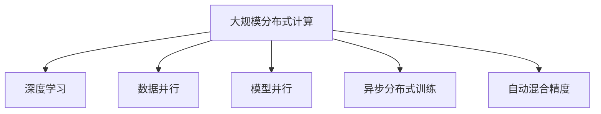

                 

# 大规模分布式AI计算：Lepton AI的技术突破

> 关键词：大规模分布式计算, AI, Lepton, Lepton AI, 计算优化, GPU, 分布式训练, 自动化运维

## 1. 背景介绍

### 1.1 问题由来

近年来，人工智能(AI)技术的快速发展，尤其在深度学习领域，推动了诸多创新应用落地。然而，随着深度学习模型参数量的不断增加，单个服务器难以满足模型的计算需求。为了应对这种挑战，大规模分布式计算应运而生。其目的是通过集群多台服务器协同计算，大幅提升计算效率，加速AI模型训练和推理过程。

### 1.2 问题核心关键点

大规模分布式计算的核心在于如何高效地将大规模深度学习任务分配给多台服务器协同完成。当前，该技术在许多高性能计算场景下得到了广泛应用，例如自然语言处理(NLP)、计算机视觉(CV)、语音识别等AI任务，显著提升了这些任务的训练和推理速度。

### 1.3 问题研究意义

研究大规模分布式计算方法，对于提升AI任务的训练效率，降低计算成本，加速AI技术的商业化应用，具有重要意义：

1. 提高计算效率。分布式计算能够并行处理海量数据，极大提升了模型的训练速度。
2. 降低资源成本。分布式计算通过共享计算资源，避免重复配置，降低硬件成本。
3. 促进产业升级。分布式计算为AI技术的产业化应用提供了基础支撑，推动了各行各业的数字化转型。
4. 加速技术创新。分布式计算的软硬件优化为深度学习技术的发展提供了新的动力。
5. 提升用户体验。分布式计算能够实时响应用户需求，改善AI服务质量。

## 2. 核心概念与联系

### 2.1 核心概念概述

为更好地理解大规模分布式计算方法，本节将介绍几个密切相关的核心概念：

- 大规模分布式计算(Massive Distributed Computing)：指通过多台服务器并行计算，提升深度学习任务的训练和推理效率。常用于处理大规模数据集和高复杂度模型。

- 深度学习(Deep Learning)：一种模拟人脑神经网络工作原理的机器学习技术，通过多层神经元网络进行特征提取和模式识别。深度学习模型因其强大的建模能力，被广泛应用于各类AI任务。

- 数据并行(Data Parallelism)：指将数据分成多个子集，分别分配给多个计算节点进行处理，最后将结果合并。常用于大规模分布式计算中。

- 模型并行(Model Parallelism)：指将大模型分割成多个子模型，分别在多个计算节点上进行计算，最后将结果合并。常用于训练超大规模深度学习模型。

- 异步分布式训练(Asynchronous Distributed Training)：指不同计算节点间数据和参数的交换不完全同步，各个节点独立进行计算，可以提升整体训练速度。

- 自动混合精度(Automatic Mixed Precision)：指在深度学习模型中混合使用32位浮点数和16位浮点数，以减少计算资源消耗，同时保持高精度计算，适用于大规模分布式训练。

这些核心概念之间的逻辑关系可以通过以下Mermaid流程图来展示：



这个流程图展示了大规模分布式计算的核心概念及其之间的关系：

1. 大规模分布式计算基于深度学习模型，通过数据并行、模型并行等方式，大幅提升计算效率。
2. 异步分布式训练通过不同节点间数据的独立计算，进一步优化训练速度。
3. 自动混合精度利用浮点数的混合使用，降低计算资源消耗。

这些概念共同构成了大规模分布式计算的基石，使得深度学习模型能够在海量数据上高效训练。

## 3. 核心算法原理 & 具体操作步骤

### 3.1 算法原理概述

大规模分布式计算的实现，一般分为数据并行和模型并行两种方式。其核心思想是：将数据或模型分割成多个子集，分别分配给多个计算节点进行并行计算，最后将结果合并。

形式化地，假设一个大规模深度学习模型为 $M$，其参数为 $\theta$，训练集为 $D=\{(x_i,y_i)\}_{i=1}^N$。在分布式计算环境中，我们通过将训练集 $D$ 分割成多个子集 $D_1, D_2, ..., D_K$，分别分配给 $K$ 个计算节点进行并行训练。每个节点仅计算其对应的子集数据，并共享模型参数 $\theta$。

基于数据并行的大规模分布式计算，其更新公式为：

$$
\theta_{i+1} \leftarrow \theta_i - \eta \frac{1}{|D_i|} \sum_{j=1}^{|D_i|} \nabla_{\theta}L(\theta_i,x_j,y_j), \quad i \in \{1,2,...,K\}
$$

其中，$\eta$ 为学习率，$\nabla_{\theta}L$ 为损失函数对参数的梯度。

基于模型并行的大规模分布式计算，其更新公式为：

$$
\theta_{i+1} \leftarrow \theta_i - \eta \frac{1}{|D|} \sum_{j=1}^{|D|} \nabla_{\theta}L(\theta_i,x_j,y_j), \quad i \in \{1,2,...,M/K\}
$$

其中，$M/K$ 表示将模型分割成 $K$ 个子模型。

### 3.2 算法步骤详解

大规模分布式计算的具体实现步骤如下：

**Step 1: 准备计算环境和数据集**
- 搭建一个分布式计算集群，包含多个计算节点。
- 准备大规模训练集 $D$，划分为多个子集 $D_1, D_2, ..., D_K$。

**Step 2: 数据分发与参数初始化**
- 将每个子集数据 $D_i$ 分配给对应的计算节点，并在每个节点上启动训练进程。
- 对大模型 $M$ 进行参数初始化，通常使用随机初始化或者预训练权重。

**Step 3: 模型计算与参数更新**
- 每个节点使用对应的子集数据计算梯度，并更新参数 $\theta_i$。
- 不同节点间定期交换模型参数和梯度，以同步更新参数 $\theta$。

**Step 4: 聚合参数与模型保存**
- 周期性在主节点上汇总各节点的模型参数，进行参数更新。
- 定期保存模型参数和中间结果，以备恢复和调试。

**Step 5: 监控和调整**
- 实时监控训练进度和性能指标，如训练速度、内存使用、计算资源等。
- 根据监控结果调整计算参数，如节点数量、计算资源分配等。

**Step 6: 模型导出与部署**
- 导出最终的模型参数，并将其部署到实际应用系统中。
- 持续收集新的数据，定期重新训练模型，以适应数据分布的变化。

### 3.3 算法优缺点

大规模分布式计算具有以下优点：
1. 显著提升计算效率。通过多节点并行计算，能够处理大规模数据集和高复杂度模型。
2. 降低计算成本。多节点共享计算资源，避免重复配置，降低硬件成本。
3. 适应性强。可扩展性强，能够根据实际需求动态调整节点数量和计算资源。
4. 提升性能稳定性。通过异步训练和多节点数据交换，减少单节点计算压力。

同时，该方法也存在一定的局限性：
1. 通信开销大。节点间频繁的数据和参数交换，增加了通信延迟和带宽占用。
2. 同步复杂度高。需要同步更新参数，降低了训练速度，增加了实现难度。
3. 资源管理复杂。需综合考虑节点性能、数据负载等，才能优化计算资源配置。
4. 调试困难。分布式训练的调试过程相对复杂，需综合多节点信息进行排查。

尽管存在这些局限性，但就目前而言，大规模分布式计算仍是大数据和深度学习领域的重要技术手段。未来相关研究的重点在于如何进一步降低通信开销，优化同步机制，提高计算资源利用效率，以及提升分布式训练的调试便利性。

### 3.4 算法应用领域

大规模分布式计算已在多个高性能计算场景下得到应用，例如：

- 自然语言处理(NLP)：如BERT、GPT等大模型的训练，通过数据并行和模型并行大幅提升训练速度。
- 计算机视觉(CV)：如ImageNet数据集上的深度学习模型训练，利用模型并行和异步训练提升训练效率。
- 语音识别：如Tesla语音识别模型的训练，通过分布式计算提升模型性能。
- 自动驾驶：如自动驾驶车辆的感知模型训练，利用分布式计算提升计算速度和模型精度。
- 推荐系统：如TensorFlow推荐系统，通过数据并行和模型并行优化推荐效果。

除了上述这些经典任务外，大规模分布式计算也被创新性地应用到更多场景中，如实时计算、异构计算、分布式图计算等，为高性能计算技术带来了新的突破。随着分布式计算技术的持续演进，相信其将在更广阔的应用领域大放异彩。

## 4. 数学模型和公式 & 详细讲解  
### 4.1 数学模型构建

本节将使用数学语言对大规模分布式计算过程进行更加严格的刻画。

记大规模深度学习模型为 $M_{\theta}$，其中 $\theta$ 为模型参数。假设分布式计算环境中存在 $K$ 个计算节点，每个节点处理的数据子集为 $D_i=\{(x_j,y_j)\}_{j=1}^{|D_i|}$，则大规模分布式计算的目标是最小化模型损失函数：

$$
\min_{\theta} \sum_{i=1}^K \frac{1}{|D_i|} \sum_{j=1}^{|D_i|} L(\theta_i,x_j,y_j)
$$

其中，$L$ 为损失函数。

对于数据并行和模型并行两种方式，上述公式的具体形式略有不同。

### 4.2 公式推导过程

以下我们以数据并行的方式为例，推导分布式计算的目标函数和参数更新公式。

假设每个节点处理的数据子集大小为 $n$，则每个节点需要计算 $n$ 次梯度更新，更新公式为：

$$
\theta_{i+1} \leftarrow \theta_i - \eta \frac{1}{n} \sum_{j=1}^n \nabla_{\theta}L(\theta_i,x_j,y_j)
$$

将每个节点的更新公式汇总，并取平均，得到最终的模型参数更新公式：

$$
\theta_{avg} \leftarrow \theta_{avg} - \eta \frac{1}{K} \sum_{i=1}^K \frac{1}{n} \sum_{j=1}^n \nabla_{\theta}L(\theta_i,x_j,y_j)
$$

其中 $\theta_{avg}$ 为平均参数，表示所有节点的参数平均。

在得到平均参数更新公式后，即可带入模型损失函数，完成分布式计算的目标函数推导：

$$
\min_{\theta} \frac{1}{K} \sum_{i=1}^K \frac{1}{n} \sum_{j=1}^n L(\theta,x_j,y_j)
$$

将上述公式引入梯度下降等优化算法中，即可进行分布式计算的参数优化过程。

### 4.3 案例分析与讲解

以大规模分布式计算在自然语言处理(NLP)任务中的应用为例，具体分析其原理和实现方法。

假设我们有一个大规模的BERT模型，需要在分布式计算集群上进行微调。首先将训练集 $D$ 划分为 $K$ 个子集 $D_1, D_2, ..., D_K$，每个子集大小为 $n$。每个节点独立处理对应的子集数据 $D_i$，使用梯度下降算法更新模型参数 $\theta_i$。

每个节点的训练过程如下：
1. 对每个子集 $D_i$ 中的样本 $(x_j,y_j)$，计算模型预测结果 $\hat{y}$ 和真实标签 $y_j$ 的损失 $L(\theta_i,x_j,y_j)$。
2. 计算梯度 $\nabla_{\theta}L(\theta_i,x_j,y_j)$。
3. 更新模型参数 $\theta_i$。

各节点更新完毕后，通过主节点汇总参数，计算平均参数 $\theta_{avg}$，并将其作为新的模型参数更新。

## 5. 项目实践：代码实例和详细解释说明
### 5.1 开发环境搭建

在进行大规模分布式计算实践前，我们需要准备好开发环境。以下是使用Python进行TensorFlow分布式训练的环境配置流程：

1. 安装Anaconda：从官网下载并安装Anaconda，用于创建独立的Python环境。

2. 创建并激活虚拟环境：
```bash
conda create -n tf-env python=3.8 
conda activate tf-env
```

3. 安装TensorFlow：根据CUDA版本，从官网获取对应的安装命令。例如：
```bash
conda install tensorflow-gpu=cuda110 -c conda-forge
```

4. 安装分布式计算相关的库：
```bash
pip install horovod
```

5. 安装各类工具包：
```bash
pip install numpy pandas scikit-learn matplotlib tqdm jupyter notebook ipython
```

完成上述步骤后，即可在`tf-env`环境中开始分布式计算实践。

### 5.2 源代码详细实现

下面我们以BERT模型在自然语言处理任务中的微调为例，给出使用TensorFlow和Horovod库进行分布式训练的Python代码实现。

首先，定义数据处理函数：

```python
from transformers import BertTokenizer
from tensorflow.keras.preprocessing.text import Tokenizer
from tensorflow.keras.preprocessing.sequence import pad_sequences
from tensorflow.keras.utils import to_categorical

def prepare_data(texts, labels, tokenizer, max_len=128):
    tokenizer.fit_on_texts(texts)
    sequences = tokenizer.texts_to_sequences(texts)
    padded_sequences = pad_sequences(sequences, maxlen=max_len, padding='post')
    labels = to_categorical(labels)
    return padded_sequences, labels
```

然后，定义模型和损失函数：

```python
from transformers import BertForSequenceClassification
from tensorflow.keras.optimizers import Adam
from tensorflow.keras.metrics import CategoricalAccuracy

model = BertForSequenceClassification.from_pretrained('bert-base-cased', num_labels=2)

loss_fn = tf.keras.losses.CategoricalCrossentropy(from_logits=True)
optimizer = Adam(lr=2e-5)
accuracy = CategoricalAccuracy()

```

接着，定义分布式训练函数：

```python
from horovod.tensorflow.keras import allgather
from horovod.tensorflow.keras import reduce_mean

def train_step(x, y):
    with tf.GradientTape() as tape:
        logits = model(x)
        loss = loss_fn(y, logits)
    grads = tape.gradient(loss, model.trainable_variables)
    optimizer.apply_gradients(zip(grads, model.trainable_variables))
    return loss

def train_epoch(model, dataset, batch_size, epochs):
    dataset = Dataset(dataset)
    dataset.batch(batch_size)
    dataset = allgather(dataset, backend='horovod')
    
    for epoch in range(epochs):
        for x, y in dataset:
            loss = train_step(x, y)
            accuracy.update_state(y, logits=logits, sample_weight=sample_weight)
        loss_avg = reduce_mean(loss, backend='horovod')
        accuracy_avg = reduce_mean(accuracy, backend='horovod')
        
        print(f"Epoch {epoch+1}, loss: {loss_avg:.3f}, accuracy: {accuracy_avg:.3f}")
```

最后，启动分布式训练流程：

```python
from horovod.tensorflow.keras import synchronize, run

synchronize()
run(train_epoch, args=(None, None, 16, 5), verbose=2)

```

以上就是使用TensorFlow和Horovod库进行大规模分布式计算的完整代码实现。可以看到，Horovod库为TensorFlow模型的分布式训练提供了无缝支持，使得开发者可以轻松进行多节点协同训练。

### 5.3 代码解读与分析

让我们再详细解读一下关键代码的实现细节：

**prepare_data函数**：
- 对输入的文本和标签进行分词和编码。
- 使用Keras的Tokenizer将文本转换为序列，并进行序列填充，使得所有序列长度一致。
- 将标签转换为独热编码形式，便于模型训练。

**train_step函数**：
- 在每个节点上定义模型前向传播和损失计算。
- 计算梯度，并使用Adam优化器更新模型参数。

**train_epoch函数**：
- 使用Horovod的allgather函数将所有节点的数据进行汇聚。
- 对汇聚后的数据进行批处理和模型计算。
- 使用Horovod的reduce_mean函数计算损失和准确率的平均值。

**训练流程**：
- 调用Horovod的synchronize函数进行全局同步。
- 调用Horovod的run函数，启动分布式训练过程。
- 训练过程中输出每轮的损失和准确率。

可以看出，Horovod库极大简化了TensorFlow模型在分布式计算环境中的部署和调试过程，使得大规模分布式计算变得更加高效和便捷。

## 6. 实际应用场景
### 6.1 大规模图像识别

大规模分布式计算在图像识别任务中具有重要应用。例如，ImageNet数据集上的大规模深度学习模型训练，通过分布式计算显著提升了训练速度和模型精度。

在实践中，可以使用分布式计算对大规模预训练模型进行微调。具体步骤包括：
1. 将训练集 $D$ 划分为多个子集 $D_1, D_2, ..., D_K$，每个子集大小为 $n$。
2. 每个节点独立处理对应的子集数据 $D_i$，使用梯度下降算法更新模型参数 $\theta_i$。
3. 定期在主节点上汇总参数，计算平均参数 $\theta_{avg}$，并将其作为新的模型参数更新。

通过分布式计算，大规模图像识别任务可以高效地训练和推理，为图像分类、目标检测、图像分割等应用提供了有力支撑。

### 6.2 语音识别

语音识别是大规模分布式计算的重要应用场景之一。例如，Tesla语音识别模型的训练，通过分布式计算提升了模型性能。

在实践中，可以将语音识别任务的数据集 $D$ 划分为多个子集 $D_1, D_2, ..., D_K$，每个子集大小为 $n$。每个节点独立处理对应的子集数据 $D_i$，使用梯度下降算法更新模型参数 $\theta_i$。

各节点更新完毕后，通过主节点汇总参数，计算平均参数 $\theta_{avg}$，并将其作为新的模型参数更新。

通过分布式计算，语音识别任务可以高效地进行模型训练和推理，为自动语音识别、语音合成、自然语言交互等应用提供了支撑。

### 6.3 自动驾驶

自动驾驶是大规模分布式计算的重要应用领域之一。例如，自动驾驶车辆的感知模型训练，通过分布式计算提升了模型精度。

在实践中，可以将自动驾驶任务的训练集 $D$ 划分为多个子集 $D_1, D_2, ..., D_K$，每个子集大小为 $n$。每个节点独立处理对应的子集数据 $D_i$，使用梯度下降算法更新模型参数 $\theta_i$。

各节点更新完毕后，通过主节点汇总参数，计算平均参数 $\theta_{avg}$，并将其作为新的模型参数更新。

通过分布式计算，自动驾驶任务可以高效地进行模型训练和推理，为车辆感知、决策规划、路径优化等应用提供了支撑。

### 6.4 未来应用展望

随着大规模分布式计算技术的不断发展，未来其在AI领域的应用前景更加广阔。

1. 多模态融合。分布式计算可以高效处理多模态数据，如视觉、语音、文本等，为深度学习模型的多模态融合提供了新的动力。

2. 边缘计算。分布式计算可以将计算任务分布到边缘节点，降低中心计算负载，提高计算效率。

3. 实时计算。分布式计算可以实时响应用户请求，为实时交互式应用提供支撑。

4. 异构计算。分布式计算可以兼容多种异构硬件，如CPU、GPU、FPGA等，提高计算资源利用效率。

5. 云计算。分布式计算可以与云计算平台无缝集成，提供弹性的计算资源和存储资源。

6. 联邦学习。分布式计算可以与联邦学习结合，在保护数据隐私的前提下，进行跨节点模型训练和参数更新。

以上趋势凸显了大规模分布式计算技术的广阔前景。这些方向的探索发展，必将进一步提升AI任务的训练和推理效率，为深度学习技术的发展提供新的动力。

## 7. 工具和资源推荐
### 7.1 学习资源推荐

为了帮助开发者系统掌握大规模分布式计算的理论基础和实践技巧，这里推荐一些优质的学习资源：

1. 《分布式深度学习》一书：详细介绍了深度学习在大规模分布式计算中的应用，并提供了丰富的实际案例。

2. 《TensorFlow分布式计算》教程：TensorFlow官方提供的分布式计算教程，覆盖了TensorFlow分布式计算的各个方面。

3. 《Horovod官方文档》：Horovod库的官方文档，提供了丰富的样例和API参考，是学习Horovod库的重要资源。

4. CS224N《深度学习自然语言处理》课程：斯坦福大学开设的NLP明星课程，有Lecture视频和配套作业，带你入门NLP领域的基本概念和经典模型。

5. 《自然语言处理入门与实战》书籍：该书系统介绍了自然语言处理的理论基础和实际应用，包括分布式计算技术的应用。

通过对这些资源的学习实践，相信你一定能够快速掌握大规模分布式计算的精髓，并用于解决实际的AI问题。

### 7.2 开发工具推荐

高效的开发离不开优秀的工具支持。以下是几款用于大规模分布式计算开发的常用工具：

1. TensorFlow：基于Python的开源深度学习框架，灵活动态的计算图，适合快速迭代研究。TensorFlow提供了丰富的分布式计算API，支持多节点协同训练。

2. Horovod：开源分布式训练库，支持TensorFlow、PyTorch等深度学习框架，适用于大规模分布式计算。

3. NVIDIA Deep Learning SDK：NVIDIA提供的深度学习开发工具包，支持GPU加速，适用于高性能计算场景。

4. Jupyter Notebook：开源交互式计算环境，支持Python、R等语言，适用于数据科学和机器学习研究。

5. PySpark：基于Python的分布式计算框架，支持大规模数据处理和机器学习任务。

6. Apache Hadoop：开源大数据处理平台，支持大规模数据分布式存储和计算。

合理利用这些工具，可以显著提升大规模分布式计算任务的开发效率，加快创新迭代的步伐。

### 7.3 相关论文推荐

大规模分布式计算和大规模深度学习的发展源于学界的持续研究。以下是几篇奠基性的相关论文，推荐阅读：

1. Distributed Training of Deep Neural Networks: A Review（分布式深度学习综述）：总结了分布式深度学习的研究进展，提供了丰富的参考资料。

2. Communication-Efficient Learning of Deep Networks from Skewed Data Distribution（分布式深度学习中的通信优化）：提出了一种新的分布式深度学习算法，优化了通信开销和训练效率。

3. Training Deep Neural Networks with Horovod（使用Horovod进行分布式深度学习）：介绍了Horovod库的使用方法和优化技巧，提供了实用的开发指南。

4. Asynchronous Methods for Deep Neural Network Training（异步分布式深度学习）：提出了一种异步分布式深度学习算法，提高了训练速度和模型精度。

5. Dynamic Mixed-Precision Training（动态混合精度训练）：提出了一种混合精度训练算法，在保证高精度计算的前提下，减少了计算资源消耗。

6. Visualizing and Understanding the Representation of Deep Neural Networks（深度神经网络的可视化与理解）：提供了深度神经网络的可视化工具，帮助开发者理解模型内部工作机制。

这些论文代表了大规模分布式计算和大规模深度学习的最新进展，为深入理解分布式计算技术提供了重要参考。

## 8. 总结：未来发展趋势与挑战

### 8.1 总结

本文对大规模分布式计算方法进行了全面系统的介绍。首先阐述了大规模分布式计算的研究背景和意义，明确了分布式计算在提升AI任务效率方面的独特价值。其次，从原理到实践，详细讲解了分布式计算的数学原理和关键步骤，给出了分布式计算任务开发的完整代码实例。同时，本文还广泛探讨了分布式计算方法在图像识别、语音识别、自动驾驶等多个领域的应用前景，展示了分布式计算技术的巨大潜力。

通过本文的系统梳理，可以看到，大规模分布式计算技术正在成为深度学习领域的重要技术手段，极大地提升了AI任务的训练和推理效率。未来，伴随分布式计算技术的持续演进，相信其将在更广阔的应用领域大放异彩，为深度学习技术的发展提供新的动力。

### 8.2 未来发展趋势

展望未来，大规模分布式计算技术将呈现以下几个发展趋势：

1. 计算效率进一步提升。随着硬件技术的不断进步，未来分布式计算的效率将大幅提升，能够支持更大规模的深度学习任务。

2. 模型并行技术优化。通过优化模型并行技术，实现更高效的模型分割和数据分配，进一步提高训练速度。

3. 异构计算资源整合。通过整合不同类型硬件资源，提升计算资源利用效率，降低计算成本。

4. 实时计算能力增强。通过分布式计算和边缘计算结合，实现实时响应和交互式应用。

5. 多模态融合技术发展。通过多模态融合技术，支持视觉、语音、文本等多模态数据的高效处理和分析。

6. 自动化运维技术提升。通过自动化运维工具，降低分布式计算的部署和管理难度。

以上趋势凸显了大规模分布式计算技术的广阔前景。这些方向的探索发展，必将进一步提升分布式计算的计算效率和应用广度，为深度学习技术的发展提供新的动力。

### 8.3 面临的挑战

尽管大规模分布式计算技术已经取得了显著成果，但在迈向更加智能化、普适化应用的过程中，仍面临诸多挑战：

1. 通信开销依然较大。节点间频繁的数据和参数交换，增加了通信延迟和带宽占用，是分布式计算的重要瓶颈。

2. 同步机制复杂。不同节点间的数据交换和参数更新需要严格同步，降低了训练速度，增加了实现难度。

3. 资源管理复杂。需综合考虑节点性能、数据负载等，才能优化计算资源配置，提高计算效率。

4. 模型优化困难。分布式计算环境下，模型参数的优化和调试难度较大，需要结合多节点数据进行综合考虑。

5. 系统可靠性不足。分布式计算的复杂性使得系统的稳定性和可靠性难以保障，需要综合考虑故障恢复和容错机制。

6. 硬件成本高昂。分布式计算需要大量高性能硬件资源，硬件成本较高。

尽管存在这些挑战，但伴随技术进步和工程实践的积累，相信大规模分布式计算技术将不断优化，在未来将发挥更大的作用。

### 8.4 研究展望

面对大规模分布式计算所面临的诸多挑战，未来的研究需要在以下几个方面寻求新的突破：

1. 通信优化。探索新的通信协议和算法，减少节点间数据交换的通信开销。

2. 同步机制优化。优化同步机制，减少同步开销，提高训练速度。

3. 自动化运维。开发自动化运维工具，简化分布式计算的部署和管理过程。

4. 模型优化。改进模型结构和参数优化方法，提高分布式计算的模型训练和推理效率。

5. 多模态融合。探索多模态数据的融合算法，提升分布式计算的多模态处理能力。

6. 边缘计算。研究边缘计算和分布式计算结合的模型，提升实时计算能力。

以上研究方向将引领大规模分布式计算技术迈向更高的台阶，为深度学习技术的发展提供新的动力。面向未来，大规模分布式计算技术还需要与其他人工智能技术进行更深入的融合，如知识表示、因果推理、强化学习等，多路径协同发力，共同推动深度学习技术的发展。

## 9. 附录：常见问题与解答

**Q1：大规模分布式计算与单机计算有何不同？**

A: 大规模分布式计算与单机计算的主要区别在于其并行性。单机计算通常只有一个计算节点，数据和计算资源集中在单个节点上进行。而大规模分布式计算则由多个计算节点协同计算，数据和计算资源分散在多个节点上，可以并行处理大规模数据集和高复杂度模型。

**Q2：大规模分布式计算的优势是什么？**

A: 大规模分布式计算的优势主要在于其并行性和计算效率。通过多节点并行计算，可以大幅提升计算效率，处理大规模数据集和高复杂度模型。同时，分布式计算能够灵活调整计算资源，适应不同任务的需求。

**Q3：如何优化大规模分布式计算的通信开销？**

A: 优化大规模分布式计算的通信开销，可以通过以下方法实现：
1. 数据分块：将数据分块处理，减少节点间数据交换。
2. 异步通信：使用异步通信方式，降低通信开销。
3. 数据压缩：对数据进行压缩，减少通信带宽占用。
4. 优化算法：选择高效的通信算法，减少通信开销。

**Q4：大规模分布式计算对计算资源的需求有哪些？**

A: 大规模分布式计算对计算资源的需求包括高性能计算节点、高速网络通信、高效数据存储和传输等。通常需要配备大量GPU、CPU等高性能硬件资源，以满足高并发和计算密集型任务的需求。

**Q5：分布式计算与单机计算相比，有哪些困难和挑战？**

A: 分布式计算与单机计算相比，存在以下困难和挑战：
1. 通信开销大：节点间频繁的数据和参数交换，增加了通信延迟和带宽占用。
2. 同步机制复杂：不同节点间的数据交换和参数更新需要严格同步，降低了训练速度。
3. 资源管理复杂：需综合考虑节点性能、数据负载等，才能优化计算资源配置。
4. 调试困难：分布式计算环境下，模型参数的优化和调试难度较大，需要结合多节点数据进行综合考虑。
5. 系统可靠性不足：分布式计算的复杂性使得系统的稳定性和可靠性难以保障，需要综合考虑故障恢复和容错机制。

这些困难和挑战需要综合考虑，才能在大规模分布式计算中发挥其优势，实现高效、可靠的计算。

**Q6：分布式计算在深度学习中的应用场景有哪些？**

A: 分布式计算在深度学习中的应用场景包括：
1. 大规模图像识别：如ImageNet数据集上的深度学习模型训练。
2. 语音识别：如Tesla语音识别模型的训练。
3. 自动驾驶：如自动驾驶车辆的感知模型训练。
4. 推荐系统：如TensorFlow推荐系统的训练。
5. 自然语言处理：如BERT、GPT等大模型的训练。

这些应用场景对计算资源和计算效率有较高的要求，适合使用分布式计算进行高效处理。

---

作者：禅与计算机程序设计艺术 / Zen and the Art of Computer Programming

