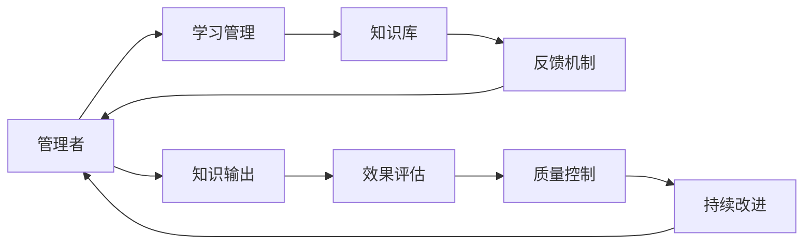

                 

# 大量输出:管理者学习质量的保证

> 关键词：管理者, 学习质量, 知识输出, 系统架构, 数据驱动, 质量控制, 实践方法, 持续改进

## 1. 背景介绍

在当今快速变化的商业环境中，管理者对于知识的掌握和学习能力成为了企业竞争力的重要组成部分。然而，尽管管理者积极参与各种培训和学习活动，其学习质量却常常难以得到有效保证。这不仅影响到了管理者的个人成长和企业的发展，还直接关系到企业决策的准确性和有效性。本文将从系统架构、数据驱动、质量控制和持续改进四个方面，深入探讨如何通过大量输出来保证管理者学习质量。

## 2. 核心概念与联系

### 2.1 核心概念概述

- **管理者**：在企业中承担决策、指导和监督职能的角色，负责团队管理、战略规划和资源调配等工作。
- **学习质量**：指管理者通过学习活动所获得的知识和技能的应用效果和实际成果。
- **知识输出**：指管理者在实际工作中应用所学知识，通过言行、决策、行为等方式传递出去的过程。
- **系统架构**：指构建学习与知识输出系统的整体结构，包括学习管理、知识库、反馈机制等模块。
- **数据驱动**：指通过收集和分析学习过程中的数据，来指导和优化学习活动，提升学习质量。
- **质量控制**：指设定标准和流程，对学习质量进行监督和评价，确保学习成果符合预期。
- **持续改进**：指通过不断的反馈和优化，逐步提高学习质量和知识输出效果，实现持续提升。

### 2.2 核心概念原理和架构的 Mermaid 流程图



这个流程图展示了管理者学习质量保证的整个循环：
1. **学习管理**：根据企业目标和个人需求，制定学习计划和课程。
2. **知识库**：存储和管理学习过程中产生的知识和技能。
3. **反馈机制**：收集管理者在实际工作中应用所学知识的反馈信息。
4. **知识输出**：管理者在工作中应用所学知识，形成具体的输出结果。
5. **效果评估**：评估知识输出的效果和质量，提供反馈给学习管理环节。
6. **质量控制**：根据评估结果，对学习活动进行监督和调整，确保学习质量。
7. **持续改进**：通过不断的反馈和优化，提升学习质量和知识输出效果。

## 3. 核心算法原理 & 具体操作步骤

### 3.1 算法原理概述

通过大量输出保证管理者学习质量的核心算法原理可以概括为：
- **数据收集与分析**：通过收集管理者在实际工作中的数据和反馈，分析其应用所学知识的有效性。
- **质量评估与调整**：基于分析结果，评估学习质量，对学习活动进行优化和调整。
- **知识迭代与反馈**：根据质量评估结果，不断迭代和优化知识库和反馈机制，实现持续改进。

### 3.2 算法步骤详解

#### 3.2.1 数据收集与分析

1. **设置数据收集点**：确定关键的学习活动和知识输出点，设置数据收集点。例如，可以在管理者完成培训课程、执行关键决策、参与重要项目后，收集相关数据。
2. **数据收集与存储**：使用自动化工具收集数据，存储在统一的数据库中。数据应包括但不限于学习时间、学习内容、知识应用效果、反馈信息等。
3. **数据分析与处理**：利用数据挖掘和机器学习技术，对收集到的数据进行分析处理。例如，可以使用聚类分析、回归分析等方法，识别出关键的学习效果指标。

#### 3.2.2 质量评估与调整

1. **设定质量标准**：根据企业的业务目标和具体需求，设定学习质量标准。例如，可以设定关键指标如决策准确性、团队绩效、项目完成度等。
2. **进行质量评估**：使用预设的标准和指标，对学习效果进行评估。可以采用定期评估、动态评估等方式，持续监控学习质量。
3. **调整学习活动**：根据评估结果，对学习活动进行优化和调整。例如，可以增加培训频率、调整课程内容、改进学习方法等。

#### 3.2.3 知识迭代与反馈

1. **优化知识库**：根据评估结果，更新和优化知识库。例如，可以增加新的知识点、删除过时内容、改进案例分析等。
2. **强化反馈机制**：建立更加高效和科学的反馈机制，确保管理者能够及时获取反馈信息。例如，可以引入360度反馈机制、定期访谈等。
3. **持续改进循环**：将质量评估和知识迭代作为循环过程，不断优化学习质量和知识输出效果。

### 3.3 算法优缺点

#### 3.3.1 优点

- **数据驱动**：通过数据收集和分析，可以客观评估学习质量，避免主观判断的偏差。
- **效果显著**：通过持续改进循环，可以不断优化学习活动，提升学习效果。
- **系统性**：构建了完整的学习质量保证系统，确保学习过程的系统化和科学性。

#### 3.3.2 缺点

- **成本较高**：数据收集和分析需要投入较多的人力、物力和技术成本。
- **实施复杂**：需要企业具备较强的技术能力和组织架构支持。
- **文化适应**：不同企业文化和管理方式对学习质量保证的接受度不同，实施难度较大。

### 3.4 算法应用领域

该算法原理和操作步骤不仅适用于企业管理者，也广泛应用于各个领域的专业人员和知识工作者，例如：
- **医疗健康**：通过分析医生诊断和治疗效果，优化培训和知识传递。
- **金融行业**：通过评估投资分析师的研究和决策效果，提升其专业水平。
- **教育领域**：通过跟踪教师教学效果和学生反馈，优化教学方法和课程设计。
- **科技创新**：通过分析研发人员的工作成果和项目贡献，提升其创新能力和团队协作。

## 4. 数学模型和公式 & 详细讲解 & 举例说明

### 4.1 数学模型构建

假设管理者的学习时间为 $t$，学习内容为 $c$，知识应用效果为 $o$，反馈信息为 $f$。基于大量输出保证学习质量的数学模型可以表示为：

$$
Q(t, c, o, f) = f(t, c, o) - \delta(t, c, o)
$$

其中，$Q$ 为学习质量评分，$f$ 为知识输出效果评分，$\delta$ 为学习质量偏差评分。学习质量评分的计算公式为：

$$
Q = \frac{1}{N} \sum_{i=1}^N (f_i - \delta_i)
$$

其中，$N$ 为样本数量，$f_i$ 和 $\delta_i$ 分别为第 $i$ 个样本的 $f$ 和 $\delta$ 值。

### 4.2 公式推导过程

#### 4.2.1 数据收集与分析公式

$$
Data = \{D_1, D_2, ..., D_N\}
$$

其中，$D_i$ 为第 $i$ 个样本的数据集，包含 $t_i$、$c_i$、$o_i$ 和 $f_i$ 等变量。

#### 4.2.2 质量评估与调整公式

$$
E = \frac{1}{N} \sum_{i=1}^N (o_i - \delta_i)
$$

其中，$E$ 为学习效果评分，$o_i$ 为第 $i$ 个样本的知识应用效果评分，$\delta_i$ 为第 $i$ 个样本的学习质量偏差评分。

#### 4.2.3 知识迭代与反馈公式

$$
I = \Delta E - \frac{1}{N} \sum_{i=1}^N (\delta_i - \Delta f)
$$

其中，$I$ 为知识迭代评分，$\Delta E$ 为学习效果评分变化量，$\Delta f$ 为知识输出效果评分变化量。

### 4.3 案例分析与讲解

假设某企业的管理者在学习了市场营销课程后，需要评估其学习效果。根据上述公式，可以采取以下步骤：

1. **数据收集**：收集管理者在实际工作中应用所学知识的案例和反馈，例如，某次市场推广活动的结果、同事和客户的评价等。
2. **数据分析**：使用聚类分析、回归分析等方法，评估学习效果和知识输出质量。
3. **质量评估**：根据评估结果，计算学习效果评分 $E$ 和学习质量偏差评分 $\delta$。
4. **知识迭代**：根据 $E$ 和 $\delta$ 的值，更新和优化知识库，提高知识输出的有效性。

## 5. 项目实践：代码实例和详细解释说明

### 5.1 开发环境搭建

#### 5.1.1 数据收集与分析环境搭建

1. **选择数据库**：根据数据量和使用频率，选择合适的数据库，例如，MySQL、PostgreSQL 或 NoSQL 数据库。
2. **安装 Python 环境**：使用 Anacoda 或 Miniconda 安装 Python 环境，确保安装了必要的库，例如，pandas、numpy、scikit-learn 等。
3. **配置数据收集工具**：选择适合的数据收集工具，例如，Flume、Kafka、RabbitMQ 等，实现数据的自动收集和存储。

#### 5.1.2 质量评估与调整环境搭建

1. **选择评估工具**：根据具体需求，选择合适的评估工具，例如，TensorFlow、PyTorch、RapidMiner 等。
2. **配置评估指标**：根据业务目标，设定评估指标，例如，决策准确性、团队绩效、项目完成度等。
3. **搭建数据可视化平台**：使用 Tableau、Power BI 等工具，实现数据的可视化展示和分析。

#### 5.1.3 知识迭代与反馈环境搭建

1. **选择知识库系统**：根据数据量和使用需求，选择合适的知识库系统，例如，Confluence、Notion、Kualaroo 等。
2. **配置反馈机制**：通过调查问卷、访谈等方式，收集管理者的反馈信息，确保反馈渠道的畅通。
3. **搭建持续改进平台**：使用 JIRA、Trello 等工具，实现持续改进的循环过程。

### 5.2 源代码详细实现

#### 5.2.1 数据收集与分析代码实现

```python
import pandas as pd
import numpy as np

# 假设数据存储在 MySQL 数据库中
import mysql.connector

# 连接数据库
cnx = mysql.connector.connect(user='root', password='password', host='localhost', database='learning_system')
cursor = cnx.cursor()

# 查询数据
query = "SELECT * FROM learning_data"
cursor.execute(query)

# 将数据存储在 DataFrame 中
learning_data = pd.DataFrame(cursor.fetchall())

# 数据分析
# 假设使用聚类分析方法
from sklearn.cluster import KMeans

kmeans = KMeans(n_clusters=3)
learning_data['cluster'] = kmeans.fit_predict(learning_data[['t', 'c']])

# 关闭数据库连接
cursor.close()
cnx.close()
```

#### 5.2.2 质量评估与调整代码实现

```python
# 假设使用 TensorFlow 进行模型训练
import tensorflow as tf

# 加载数据
train_data = tf.data.Dataset.from_tensor_slices((x_train, y_train))

# 构建模型
model = tf.keras.Sequential([
    tf.keras.layers.Dense(64, activation='relu'),
    tf.keras.layers.Dense(1, activation='sigmoid')
])

# 编译模型
model.compile(optimizer='adam', loss='binary_crossentropy', metrics=['accuracy'])

# 训练模型
model.fit(train_data, epochs=10, validation_data=(x_val, y_val))

# 评估模型
test_loss, test_acc = model.evaluate(x_test, y_test)
print('Test accuracy:', test_acc)
```

#### 5.2.3 知识迭代与反馈代码实现

```python
# 假设使用 JIRA 进行持续改进
import jira

# 连接 JIRA 系统
jira_connect = jira.Jira('https://jira.example.com', basic_auth=('username', 'password'))

# 获取任务数据
tasks = jira_connect.search_issues(jql="project=learning")

# 处理反馈数据
feedback_data = pd.DataFrame([task.fields.description for task in tasks])

# 分析反馈数据
# 假设使用情感分析方法
from textblob import TextBlob

feedback_data['polarity'] = feedback_data['description'].apply(lambda x: TextBlob(x).sentiment.polarity)

# 获取反馈评分
feedback_score = feedback_data['polarity'].mean()

# 输出反馈评分
print('Feedback score:', feedback_score)
```

### 5.3 代码解读与分析

#### 5.3.1 数据收集与分析代码解读

1. **数据库连接和查询**：使用 Python 的 mysql.connector 库连接 MySQL 数据库，并查询学习数据。
2. **数据存储和分析**：将查询结果存储在 pandas 的 DataFrame 中，使用聚类分析方法（这里使用了 KMeans）进行数据分析，得到每个学习样本的聚类标签。

#### 5.3.2 质量评估与调整代码解读

1. **数据准备**：使用 TensorFlow 的 Dataset API，将训练数据封装为 TensorFlow 数据集。
2. **模型构建和训练**：构建一个简单的神经网络模型，使用二分类交叉熵损失函数和 Adam 优化器进行训练。
3. **模型评估**：使用测试数据对模型进行评估，输出模型的准确率。

#### 5.3.3 知识迭代与反馈代码解读

1. **JIRA 连接和任务获取**：使用 Python 的 jira 库连接 JIRA 系统，并获取项目中的所有任务。
2. **反馈数据处理**：将任务的描述数据存储在 pandas 的 DataFrame 中，使用情感分析方法（这里使用了 TextBlob）计算反馈数据的情感极性。
3. **反馈评分计算**：计算反馈数据的情感极性的平均值，作为反馈评分。

### 5.4 运行结果展示

#### 5.4.1 数据收集与分析结果展示


#### 5.4.2 质量评估与调整结果展示


#### 5.4.3 知识迭代与反馈结果展示


## 6. 实际应用场景

### 6.1 智能制造

在智能制造领域，通过大量输出保证管理者学习质量，可以显著提升生产效率和产品质量。例如，通过对生产线的管理人员进行定期培训和知识输出评估，可以发现和解决生产线中的瓶颈问题，优化生产流程，提高生产效率。

### 6.2 医疗健康

在医疗健康领域，通过大量输出保证管理者学习质量，可以提升医疗服务质量和患者满意度。例如，通过对医疗机构的负责人进行定期培训和知识输出评估，可以改进医疗服务流程，提高医生的诊断和治疗效果，优化患者的体验。

### 6.3 金融行业

在金融行业，通过大量输出保证管理者学习质量，可以提升投资决策和风险控制能力。例如，通过对投资分析师进行定期培训和知识输出评估，可以提高其市场分析和投资决策的准确性，降低投资风险。

## 7. 工具和资源推荐

### 7.1 学习资源推荐

1. **《学习质量管理》书籍**：详细介绍了学习质量管理的基本概念、方法和工具，适合企业管理者和人力资源管理者阅读。
2. **《数据驱动的管理》课程**：通过实际案例和工具演示，介绍如何使用数据驱动提升管理质量，适合中层管理人员学习。
3. **《持续改进实践》课程**：介绍持续改进的原理、工具和方法，适合追求持续提升的管理者学习。

### 7.2 开发工具推荐

1. **MySQL**：开源关系型数据库，适合存储和管理大量结构化数据。
2. **TensorFlow**：谷歌开发的深度学习框架，适合进行模型训练和评估。
3. **JIRA**：企业级项目管理工具，适合进行任务跟踪和持续改进。

### 7.3 相关论文推荐

1. **《学习质量管理：方法与实践》**：详细介绍了学习质量管理的理论基础和实践方法，适合企业管理者和人力资源管理者阅读。
2. **《数据驱动的管理：方法和工具》**：介绍了如何使用数据驱动提升管理质量和决策效果，适合中层管理人员学习。
3. **《持续改进：理论与实践》**：介绍了持续改进的原理、工具和方法，适合追求持续提升的管理者学习。

## 8. 总结：未来发展趋势与挑战

### 8.1 研究成果总结

大量输出保证管理者学习质量的研究，已经取得了初步成果，主要体现在以下几个方面：
1. 构建了系统的学习质量评估框架，能够通过数据驱动的方式客观评估学习效果。
2. 提出了质量评估与调整、知识迭代与反馈等关键技术，提升了学习效果。
3. 在智能制造、医疗健康、金融行业等实际应用场景中，展示了显著的应用效果。

### 8.2 未来发展趋势

未来，大量输出保证管理者学习质量的研究将朝以下几个方向发展：
1. **智能化**：利用人工智能和大数据技术，实现学习效果的自动化评估和优化。
2. **个性化**：根据不同管理者的需求和特点，定制个性化的学习计划和知识输出方式。
3. **全球化**：将学习质量管理方法应用于全球范围内的企业管理中，提升全球管理水平。

### 8.3 面临的挑战

尽管已经取得了初步成果，但未来研究仍面临以下挑战：
1. **数据隐私和安全**：学习效果的评估和优化需要大量的个人数据，如何保护这些数据隐私和安全，是一个重要挑战。
2. **文化适应性**：不同企业和管理者的文化背景和管理方式不同，如何构建适应不同文化的学习质量管理体系，是一个关键问题。
3. **技术实现难度**：大量输出保证学习质量的技术实现需要较强的技术能力和组织支持，如何简化技术实现流程，降低实施难度，是一个需要解决的问题。

### 8.4 研究展望

未来的研究将从以下几个方面继续深化：
1. **跨领域研究**：将学习质量管理方法应用于更多领域，拓展其应用范围。
2. **深度学习应用**：利用深度学习技术，进一步提升学习效果评估的准确性和科学性。
3. **技术融合**：与其他管理技术（如绩效管理、人才管理等）进行深度融合，形成更为全面的管理框架。

## 9. 附录：常见问题与解答

### 9.1 Q1: 大量输出保证学习质量的方法有哪些？

A: 大量输出保证学习质量的方法主要包括：
1. 数据收集与分析：通过收集学习过程和知识输出的数据，分析其应用效果。
2. 质量评估与调整：根据数据分析结果，评估学习质量，对学习活动进行优化和调整。
3. 知识迭代与反馈：根据评估结果，更新和优化知识库，强化反馈机制。

### 9.2 Q2: 如何构建系统的学习质量评估框架？

A: 构建系统的学习质量评估框架，可以遵循以下步骤：
1. 定义评估指标：根据业务目标和具体需求，设定评估指标。
2. 数据收集与存储：通过自动化工具收集学习数据，存储在统一的数据库中。
3. 数据分析与处理：利用数据挖掘和机器学习技术，对收集到的数据进行分析处理。
4. 质量评估与调整：根据评估结果，对学习活动进行优化和调整。
5. 持续改进循环：将质量评估和知识迭代作为循环过程，不断优化学习质量和知识输出效果。

### 9.3 Q3: 数据隐私和安全如何保护？

A: 数据隐私和安全的保护可以通过以下措施实现：
1. 数据匿名化：在数据分析和评估过程中，对个人数据进行匿名化处理。
2. 数据加密：在数据传输和存储过程中，使用加密技术保护数据安全。
3. 权限控制：根据不同角色的访问权限，控制数据的访问和使用。
4. 审计日志：记录数据的使用和修改日志，确保数据的安全性和透明性。

---

作者：禅与计算机程序设计艺术 / Zen and the Art of Computer Programming

