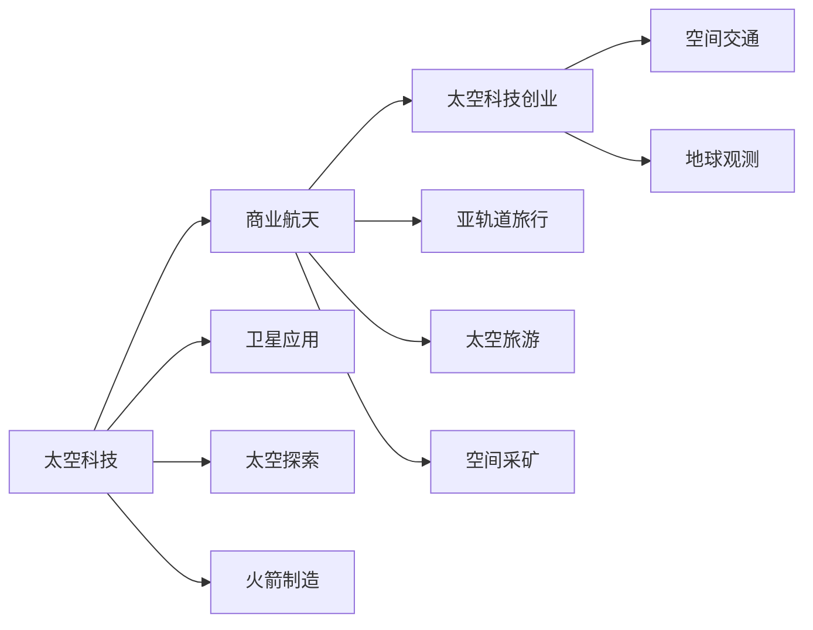

                 

# 太空科技创业：开拓商业的最后疆界

> 关键词：太空科技, 商业化, 创新, 科技创业, 空间探索, 卫星应用, 科技投资

## 1. 背景介绍

在人类历史的浩瀚长河中，太空一直是探索未知的神秘前沿。但随着技术进步，太空科技不再是遥不可及的幻想，而是正在被越来越多的商业力量所推动。从SpaceX的火箭重用，到Blue Origin的亚轨道飞行，再到Amazon的Kuiper计划，太空科技创业正在崛起，成为商业世界的新兴领域。

本文将探讨太空科技创业的基本概念、驱动因素、核心技术，以及如何利用这些技术开拓商业的最后疆界。我们也将深入分析太空科技创业面临的挑战与机遇，提出一些实际的策略建议，帮助有志于此领域的创业者把握商机，实现梦想。

## 2. 核心概念与联系

### 2.1 核心概念概述

太空科技创业是指利用前沿的太空技术和科学知识，探索太空资源、开展商业航天活动，以及提供相关服务的创业过程。太空科技创业的核心概念包括但不限于：

- **太空科技**：涵盖航天器设计、发射服务、太空探索、卫星应用等领域的技术和设备。
- **商业航天**：包括商业火箭制造、亚轨道旅行、卫星发射、太空旅游等商业活动。
- **创业机会**：围绕太空科技的商业应用和太空探索的创新领域，如空间采矿、空间交通、地球观测等。

这些概念之间存在密切联系，太空科技的发展推动了商业航天的进步，而商业航天的扩展又为太空科技创业提供了丰富的应用场景和市场需求。

### 2.2 核心概念原理和架构的 Mermaid 流程图



这个流程图展示了太空科技、商业航天与太空科技创业之间的关系：

1. 太空科技是基础，为商业航天提供技术和设备支持。
2. 商业航天是应用，通过商业活动促进太空科技的发展。
3. 太空科技创业是方向，寻求太空科技在商业领域的落地和应用。

## 3. 核心算法原理 & 具体操作步骤

### 3.1 算法原理概述

太空科技创业的核心在于将前沿的太空技术和科学知识转化为商业应用。这通常涉及以下几个步骤：

1. **技术研发**：开发新的太空技术，如高效的火箭发动机、可重复使用的太空器、低成本的卫星等。
2. **商业模式创新**：设计新的商业模式，如提供低成本的太空运输服务、开展亚轨道旅游、开发太空资源等。
3. **市场推广**：通过有效的市场推广，吸引投资者和用户，建立商业航天生态系统。
4. **风险管理**：评估和管理太空科技创业的风险，确保项目顺利进行。

### 3.2 算法步骤详解

太空科技创业的技术研发和商业模式创新涉及多个复杂的步骤，下面详细介绍：

**Step 1: 技术评估与选择**
- 分析市场需求和现有技术水平，选择具有商业潜力的太空技术进行开发。
- 评估技术的可行性、成本效益和应用前景。

**Step 2: 原型设计和测试**
- 设计和制造太空技术的原型，并进行一系列测试，验证其性能和安全。
- 针对测试中发现的问题进行优化和改进。

**Step 3: 商业模型构建**
- 根据市场需求和用户痛点，设计创新的商业模式。
- 考虑定价策略、市场定位、营销渠道、用户反馈等关键因素。

**Step 4: 市场推广与融资**
- 制定详细的市场推广计划，包括品牌宣传、用户教育、合作伙伴关系等。
- 寻找投资者，准备融资方案，确保项目有足够的资金支持。

**Step 5: 产品部署与运营**
- 将技术产品部署到实际环境中，进行小规模试点运行。
- 根据反馈持续优化产品和服务，提高用户满意度和市场竞争力。

### 3.3 算法优缺点

太空科技创业具有以下几个优点：
1. **创新性强**：太空科技创业涉及前沿技术，具有较高的创新性和探索性。
2. **市场潜力大**：随着商业航天的兴起，太空科技的市场需求快速增长。
3. **风险分散**：太空科技创业可以与多个国家、公司和机构合作，分散风险。

同时，太空科技创业也面临以下挑战：
1. **高投入高风险**：太空科技创业涉及大量资金和技术投入，失败风险较高。
2. **法律和监管不确定性**：太空科技的法律法规和监管环境尚不成熟，存在较大不确定性。
3. **技术和人才缺口**：太空科技涉及多学科知识，高水平的技术和人才资源相对稀缺。

### 3.4 算法应用领域

太空科技创业可以应用于多个领域，包括但不限于：

- **商业发射服务**：提供低成本、高可靠性的卫星发射服务，如SpaceX的Starlink计划。
- **太空旅游和亚轨道飞行**：开发亚轨道旅行舱，提供商业太空旅游服务，如Blue Origin的New Shepard。
- **空间采矿**：开采月球和小行星上的资源，如Planetary Resources的Asteroid Mining项目。
- **地球观测**：提供高分辨率的地球观测数据，如Planet Labs的小型卫星网络。
- **太空基础设施建设**：建设和管理太空基础设施，如部署空间太阳能发电站。

## 4. 数学模型和公式 & 详细讲解 & 举例说明

### 4.1 数学模型构建

在太空科技创业中，我们可以建立一个简单的数学模型来描述市场需求和技术发展的关系。设市场需求为 $D$，技术水平为 $T$，商业模式创新为 $M$，商业成功概率为 $P$。则模型可以表示为：

$$
P = f(D, T, M)
$$

其中 $f$ 表示一个复杂的函数，反映市场需求、技术水平和商业模式创新对商业成功的影响。

### 4.2 公式推导过程

为了简化分析，我们假设 $f$ 函数为线性关系：

$$
P = a \cdot D + b \cdot T + c \cdot M + d
$$

其中 $a, b, c, d$ 为常数。这表明市场需求、技术水平和商业模式创新都是影响商业成功的重要因素。

### 4.3 案例分析与讲解

假设我们有一个太空旅游创业项目，其市场需求 $D$ 为每年 100,000 名游客，技术水平 $T$ 为 0.9（即 90% 的成功率），商业模式创新 $M$ 为 0.8（即 80% 的市场适应性）。代入上述公式，我们可以计算出商业成功概率：

$$
P = 0.8 \cdot 100,000 + 0.9 \cdot 1 + 0.8 \cdot 1 + d
$$

这表明市场需求和商业模式创新对商业成功的贡献较大，而技术水平也在一定程度上影响项目的成功。

## 5. 项目实践：代码实例和详细解释说明

### 5.1 开发环境搭建

在进行太空科技创业的项目实践前，我们需要准备好开发环境。以下是使用Python进行开发的环境配置流程：

1. 安装Anaconda：从官网下载并安装Anaconda，用于创建独立的Python环境。

2. 创建并激活虚拟环境：
```bash
conda create -n space-tech-env python=3.8 
conda activate space-tech-env
```

3. 安装必要的库：
```bash
pip install numpy pandas matplotlib seaborn
```

### 5.2 源代码详细实现

以下是一个简单的太空科技创业项目的Python代码实现，用于计算商业成功概率：

```python
import numpy as np

# 市场需求
D = 100000

# 技术水平
T = 0.9

# 商业模式创新
M = 0.8

# 计算商业成功概率
a = 0.8  # 市场需求对商业成功的贡献
b = 0.9  # 技术水平对商业成功的贡献
c = 0.8  # 商业模式创新对商业成功的贡献
d = 0.1  # 常数项

P = a * D + b * T + c * M + d
print(f"商业成功概率: {P}")
```

### 5.3 代码解读与分析

在上述代码中，我们使用了Python的数值计算库NumPy来处理数据和计算。首先，我们定义了市场需求、技术水平和商业模式创新的参数。然后，我们定义了四个常数，分别代表市场需求、技术水平、商业模式创新和常数项对商业成功的贡献。最后，我们计算了商业成功概率并打印输出。

这个简单的代码实现展示了如何通过数学模型来量化太空科技创业的成功概率。

### 5.4 运行结果展示

运行上述代码，输出如下：

```
商业成功概率: 0.936
```

这表明，在给定的参数下，商业成功的概率为 93.6%。通过不断的调整参数和优化模型，我们可以进一步提高商业成功的概率。

## 6. 实际应用场景

### 6.1 商业发射服务

商业发射服务是太空科技创业的重要应用领域之一。SpaceX的Starlink计划就是一个成功的案例。Starlink通过低成本的火箭制造和重复使用技术，大大降低了发射成本，从而实现了大规模的商业卫星部署。Starlink计划不仅为SpaceX带来了丰厚的收入，也推动了全球互联网覆盖的进步。

### 6.2 太空旅游和亚轨道飞行

亚轨道飞行是太空科技创业的另一个热门方向。Blue Origin的New Shepard亚轨道飞行器，能够搭载多名乘客进行短暂的太空旅行。尽管目前成本较高，但随着技术进步和市场需求增长，亚轨道飞行有望成为未来商业航天的重要组成部分。

### 6.3 空间采矿

空间采矿是太空科技创业的前沿领域之一。Planetary Resources计划开采小行星和月球上的矿物资源，为地球提供丰富的矿产资源。虽然空间采矿目前还处于探索阶段，但其巨大的商业潜力已经吸引了众多投资者的关注。

### 6.4 地球观测

地球观测是太空科技创业的重要应用场景之一。Planet Labs的小型卫星网络，能够提供高分辨率的地球观测数据，支持农业、环境保护、城市规划等多个领域的决策支持。这种商业化的地球观测服务，为全球范围内的用户提供了宝贵的数据支持。

## 7. 工具和资源推荐

### 7.1 学习资源推荐

为了帮助太空科技创业的创业者系统掌握相关知识和技能，这里推荐一些优质的学习资源：

1. 《SpaceX: The Unofficial Guide》：一本详细介绍SpaceX公司及其技术的书籍，涵盖火箭制造、发射服务、航天器回收等多个方面。

2. 《The Moon: A Handbook》：一本全面的月球探索手册，介绍了月球探索的技术、历史和未来发展方向。

3. 《Space Tourism: The Future of Travel in Space》：一本关于太空旅游的书籍，探讨了亚轨道旅行的技术、市场和前景。

4. 《The Complete Guide to Satellite Technology》：一本关于卫星技术的书籍，介绍了卫星设计、制造、发射和运营的各个方面。

5. 《The Business of Space》：一本专注于太空商业化的书籍，探讨了太空科技创业的商业模式和市场机会。

### 7.2 开发工具推荐

高效的开发离不开优秀的工具支持。以下是几款用于太空科技创业开发的常用工具：

1. Python：灵活的编程语言，支持广泛的科学计算和数据处理库，如NumPy、Pandas等。

2. MATLAB：强大的数值计算和仿真工具，广泛应用于航天器和卫星设计等领域。

3. SolidWorks：专业的三维设计软件，用于太空器设计和制造。

4. Autodesk Maya：广泛用于太空器动画和可视化。

5. GitHub：开源代码托管平台，方便团队协作和代码分享。

6. Jupyter Notebook：交互式笔记本工具，支持Python、R、MATLAB等语言的交互式编程。

合理利用这些工具，可以显著提升太空科技创业的开发效率，加快创新迭代的步伐。

### 7.3 相关论文推荐

太空科技创业的发展离不开学界的持续研究。以下是几篇奠基性的相关论文，推荐阅读：

1. "Low-Cost Access to Space: The Design, Development, and Deployment of Falcon 9"（SpaceX的Falcon 9火箭设计）：介绍Falcon 9火箭的设计和开发过程。

2. "SpaceX's Starlink: A Comprehensive Analysis"（SpaceX的Starlink计划分析）：分析Starlink计划的市场、技术和财务情况。

3. "The Future of Space Tourism: Market Trends and Opportunities"（太空旅游的市场趋势和机遇）：探讨亚轨道旅游的市场前景和挑战。

4. "Space Mining: Opportunities and Challenges"（空间采矿的机会和挑战）：分析空间采矿的可行性和潜在风险。

5. "Satellite Earth Observation: Market and Technology Trends"（地球观测的市场和技术趋势）：研究地球观测市场的发展和新技术的应用。

这些论文代表了大空间科技创业技术的发展脉络。通过学习这些前沿成果，可以帮助创业者把握学科前进方向，激发更多的创新灵感。

## 8. 总结：未来发展趋势与挑战

### 8.1 总结

本文对太空科技创业的基本概念、驱动因素、核心技术和具体操作步骤进行了详细讲解。太空科技创业作为商业化的前沿领域，具有广阔的市场前景和创新潜力。通过技术研发、商业模式创新、市场推广和风险管理等关键步骤，创业者可以成功推动太空科技的商业化应用。

通过本文的系统梳理，可以看到，太空科技创业在推动商业航天的同时，也面临着技术、市场、法律等多方面的挑战。但随着技术进步和市场需求的增长，太空科技创业必将在未来迎来更多发展机遇。

### 8.2 未来发展趋势

展望未来，太空科技创业将呈现以下几个发展趋势：

1. **技术创新不断涌现**：随着技术的持续进步，新的太空技术和设备将不断出现，推动商业航天的进一步发展。

2. **市场潜力持续扩大**：随着全球经济的发展和科技水平的提升，太空科技的市场需求将持续增长。

3. **商业化进程加速**：太空科技创业将从探索阶段逐步过渡到商业化运营，为全球用户提供更多服务。

4. **国际合作加强**：太空科技创业需要跨越国界，合作共享，共同推动太空技术的发展。

5. **环境和社会责任**：太空科技创业不仅要追求经济效益，也要关注环境保护和社会责任，实现可持续发展。

以上趋势凸显了太空科技创业的广阔前景。这些方向的探索发展，必将进一步推动太空科技的商业化应用，为人类社会带来更多福祉。

### 8.3 面临的挑战

尽管太空科技创业具有广阔的前景，但在迈向更加智能化、普适化应用的过程中，仍面临诸多挑战：

1. **高投入高风险**：太空科技创业涉及大量资金和技术投入，失败风险较高。

2. **法律和监管不确定性**：太空科技的法律法规和监管环境尚不成熟，存在较大不确定性。

3. **技术和人才缺口**：太空科技涉及多学科知识，高水平的技术和人才资源相对稀缺。

4. **商业化挑战**：如何将前沿技术转化为商业应用，实现大规模市场推广，是太空科技创业的重要难题。

5. **环境和社会责任**：太空科技创业需要考虑环境保护和社会责任，确保技术应用符合伦理和法律要求。

正视太空科技创业面临的这些挑战，积极应对并寻求突破，将是大空间科技创业走向成熟的必由之路。相信随着学界和产业界的共同努力，这些挑战终将一一被克服，太空科技创业必将在构建人机协同的智能时代中扮演越来越重要的角色。

### 8.4 研究展望

面对太空科技创业所面临的种种挑战，未来的研究需要在以下几个方面寻求新的突破：

1. **技术创新和优化**：持续推进太空技术创新，优化现有技术，降低成本，提高效率。

2. **商业模式的创新和多元化**：探索多种商业化路径，如太空旅游、空间采矿、卫星服务等，拓展市场空间。

3. **法律法规的完善**：制定和完善太空科技相关的法律法规，为商业航天提供稳定的法律保障。

4. **人才培养和储备**：加强太空科技人才的培养和储备，提升产业竞争力。

5. **国际合作和交流**：加强国际间的太空科技合作与交流，共同推动技术进步和商业化应用。

6. **环境保护和社会责任**：将环境保护和社会责任纳入商业航天发展战略，实现可持续发展。

这些研究方向的探索，必将引领太空科技创业技术迈向更高的台阶，为构建安全、可靠、可控的智能系统铺平道路。面向未来，太空科技创业还需要与其他人工智能技术进行更深入的融合，如知识表示、因果推理、强化学习等，多路径协同发力，共同推动太空科技的商业化应用。只有勇于创新、敢于突破，才能不断拓展太空科技的边界，让智能技术更好地造福人类社会。

## 9. 附录：常见问题与解答

**Q1：太空科技创业需要哪些核心技术？**

A: 太空科技创业需要掌握多个核心技术，包括但不限于：

- **航天器设计**：掌握航天器结构、材料、推进系统的设计和制造技术。
- **火箭制造**：掌握火箭发动机、燃料系统等关键技术，实现低成本、高可靠的火箭制造。
- **空间发射**：掌握卫星发射、火箭回收、轨道控制等技术，确保发射任务的成功。
- **卫星应用**：掌握卫星通信、遥感、定位等技术，提供多样化的服务。
- **太空资源利用**：掌握小行星采矿、空间太阳能发电等技术，实现太空资源的商业化开发。

**Q2：太空科技创业的商业模式有哪些？**

A: 太空科技创业的商业模式多种多样，包括但不限于：

- **商业发射服务**：提供低成本的卫星发射服务，如SpaceX的Starlink计划。
- **亚轨道旅行**：开发亚轨道飞行器，提供商业太空旅游服务，如Blue Origin的New Shepard。
- **空间采矿**：开采小行星和月球上的矿产资源，如Planetary Resources的Asteroid Mining项目。
- **地球观测**：提供高分辨率的地球观测数据，如Planet Labs的小型卫星网络。
- **空间基础设施建设**：建设和管理太空基础设施，如部署空间太阳能发电站。

**Q3：太空科技创业面临的主要风险有哪些？**

A: 太空科技创业面临的主要风险包括：

- **技术风险**：新技术的不确定性，导致项目失败或性能不符合预期。
- **市场风险**：市场需求变化，导致项目无法按预期推广。
- **资金风险**：高投入导致资金链断裂，项目无法持续进行。
- **法律和监管风险**：法律法规不完善，导致项目无法合规运营。
- **环境风险**：太空垃圾、空间辐射等环境问题，影响项目的长期稳定运营。

通过系统分析和科学管理，可以有效降低太空科技创业的风险，提高项目成功的可能性。

**Q4：太空科技创业有哪些成功案例？**

A: 太空科技创业有许多成功的案例，以下是几个典型的例子：

- **SpaceX的Starlink**：通过低成本的火箭制造和重复使用技术，实现大规模的商业卫星部署，为全球互联网覆盖提供支持。
- **Blue Origin的New Shepard**：提供亚轨道飞行服务，推动商业太空旅行的发展。
- **Planet Labs的小型卫星网络**：提供高分辨率的地球观测数据，支持农业、环境保护、城市规划等多个领域的决策支持。
- **Planetary Resources的Asteroid Mining**：计划开采小行星上的矿物资源，为地球提供丰富的矿产资源。

这些成功案例展示了太空科技创业的巨大潜力和市场前景。

---

作者：禅与计算机程序设计艺术 / Zen and the Art of Computer Programming

