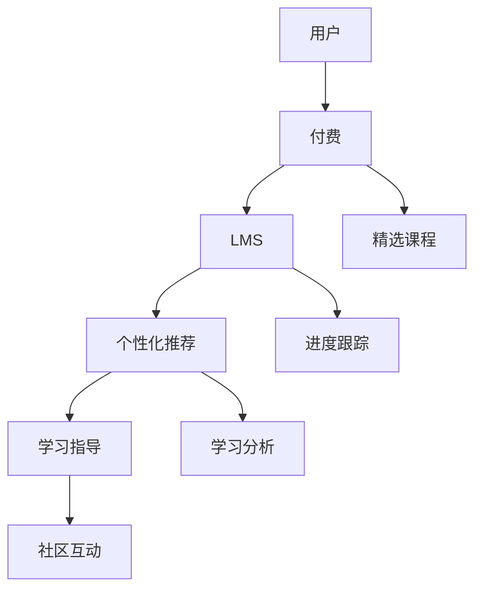

                 

# 如何利用知识付费实现在线学习与在线学习指导？

> 关键词：知识付费, 在线学习, 在线学习指导, 学习管理系统, 深度学习, 自然语言处理

## 1. 背景介绍

### 1.1 问题由来

在数字化时代的浪潮中，知识和信息逐渐成为社会发展的主要驱动力。在线教育平台的兴起，为人们提供了更为便捷的学习方式，打破了时间和空间的限制，让学习成为一种常态。然而，在线教育同样面临着诸多挑战，如学习动力不足、资源稀缺、学习效果不佳等。为了有效解决这些问题，知识付费模式应运而生。

知识付费不仅改变了知识的传播方式，还促进了个性化学习和在线学习指导的发展。通过付费订阅、课程购买等方式，平台能提供更加定制化、高品质的学习内容和指导服务，大大提升了学习体验和效果。

### 1.2 问题核心关键点

知识付费的核心在于利用付费机制，激发用户的学习热情，提升学习资源的优质度，以及提供更深入、全面的学习指导。具体来说，知识付费平台的成功运营需要以下几个关键点：

1. 精选课程内容：课程应具备科学性、系统性、实用性和趣味性，满足不同层次用户的需求。
2. 优秀的学习指导：结合深度学习、自然语言处理等技术，提供个性化的学习建议和实时反馈。
3. 完善的学习管理系统(LMS)：提供便捷的课程管理、进度跟踪、社区互动等功能，提升用户体验。
4. 高效的知识付费模式：通过精准推荐和优质课程内容，激发用户的学习兴趣，提升用户满意度。

## 2. 核心概念与联系

### 2.1 核心概念概述

1. **知识付费**：指通过付费购买、订阅等形式获取优质学习资源的在线教育模式。
2. **在线学习**：指利用互联网平台，通过课程视频、在线题库、实时互动等形式进行学习的过程。
3. **在线学习指导**：指结合学习管理系统和学习数据分析技术，为在线学习者提供个性化的学习建议和实时反馈。
4. **学习管理系统(LMS)**：指支持在线教育平台用户注册、课程管理、进度跟踪、互动交流等功能的应用系统。
5. **深度学习**：指通过多层神经网络进行特征提取和模式识别的机器学习技术，广泛应用于图像识别、语音识别等领域。
6. **自然语言处理(NLP)**：指利用计算机技术处理和分析自然语言数据的技术，包括文本分类、情感分析、语义理解等。

这些概念之间相互关联，共同构成了在线教育平台的知识付费系统。知识付费通过精选课程和提供优质学习指导，利用LMS系统提升用户体验，并通过深度学习和NLP技术实现个性化推荐和学习建议，从而推动在线学习的有效进行。

### 2.2 核心概念原理和架构的 Mermaid 流程图(Mermaid 流程节点中不要有括号、逗号等特殊字符)



## 3. 核心算法原理 & 具体操作步骤

### 3.1 算法原理概述

知识付费平台的核心算法主要包括以下几个部分：

1. **用户画像生成**：通过收集用户的学习行为、兴趣偏好等信息，构建用户画像，用于个性化课程推荐。
2. **内容推荐算法**：结合深度学习、协同过滤、图神经网络等技术，为用户推荐适合的课程。
3. **学习指导算法**：利用自然语言处理技术，解析学习内容，提供个性化学习建议和实时反馈。
4. **用户反馈收集与分析**：收集用户对课程和指导的建议和评价，用于持续优化推荐和学习指导。

### 3.2 算法步骤详解

#### 用户画像生成

1. **数据收集**：从LMS系统中收集用户的注册信息、学习历史、互动行为等数据。
2. **特征提取**：利用PCA、LDA等降维技术，提取用户的核心特征。
3. **画像构建**：将特征通过神经网络模型训练，生成用户画像。

```python
from sklearn.decomposition import PCA
from sklearn.pipeline import Pipeline

# 构建用户画像的管道
pipeline = Pipeline([
    ('feature_extraction', PCA()),
    ('user_profile', FeatureLearnEmbedding())
])

# 训练用户画像模型
pipeline.fit(user_data)
```

#### 内容推荐算法

1. **协同过滤**：通过分析用户的行为数据，找到相似用户，推荐其感兴趣的课程。
2. **深度学习**：利用神经网络模型对课程进行特征提取，推荐高相关度的课程。
3. **图神经网络**：利用图结构对课程和用户进行建模，推荐最合适的课程。

```python
import tensorflow as tf
from tensorflow.keras.layers import Dense, Embedding, GraphConv

# 构建图神经网络模型
model = tf.keras.Sequential([
    GraphConv(num_features=128, embedding_dim=16),
    Dense(32, activation='relu'),
    Dense(1, activation='sigmoid')
])

# 训练推荐模型
model.fit(train_data, epochs=10, validation_data=val_data)
```

#### 学习指导算法

1. **文本预处理**：对学习内容进行分词、词向量化等预处理。
2. **情感分析**：利用情感分析模型判断用户对课程的情感倾向。
3. **语义理解**：通过语义理解模型解析课程内容，生成学习建议。

```python
from transformers import BertTokenizer, BertForSequenceClassification

# 构建情感分析模型
tokenizer = BertTokenizer.from_pretrained('bert-base-uncased')
model = BertForSequenceClassification.from_pretrained('bert-base-uncased', num_labels=2)

# 构建语义理解模型
tokenizer = BertTokenizer.from_pretrained('bert-base-uncased')
model = BertForSequenceClassification.from_pretrained('bert-base-uncased', num_labels=num_labels)

# 训练情感分析模型
model.fit(train_data, epochs=10, validation_data=val_data)

# 训练语义理解模型
model.fit(train_data, epochs=10, validation_data=val_data)
```

#### 用户反馈收集与分析

1. **数据收集**：通过问卷、评论、评分等方式收集用户反馈数据。
2. **情感分析**：分析用户反馈，了解用户满意度和不满意度。
3. **数据处理**：利用NLP技术处理用户反馈，提取关键信息。
4. **模型优化**：基于用户反馈，优化课程和指导内容。

```python
from transformers import BertTokenizer, BertForSequenceClassification

# 构建情感分析模型
tokenizer = BertTokenizer.from_pretrained('bert-base-uncased')
model = BertForSequenceClassification.from_pretrained('bert-base-uncased', num_labels=2)

# 训练情感分析模型
model.fit(train_data, epochs=10, validation_data=val_data)

# 训练语义理解模型
model.fit(train_data, epochs=10, validation_data=val_data)
```

### 3.3 算法优缺点

#### 优点

1. **个性化推荐**：深度学习、协同过滤、图神经网络等技术，可以为用户推荐高质量的课程内容。
2. **实时反馈**：自然语言处理技术，提供实时的学习建议和反馈，提升学习效果。
3. **用户满意度**：通过不断优化推荐和学习指导，提升用户的学习体验和满意度。

#### 缺点

1. **算法复杂度高**：深度学习模型和图神经网络算法复杂度较高，训练和优化成本大。
2. **数据依赖性高**：推荐和学习指导的效果依赖于高质量的数据和用户反馈。
3. **模型可解释性差**：深度学习模型通常是"黑盒"系统，难以解释其内部工作机制。

### 3.4 算法应用领域

1. **在线教育平台**：如Coursera、Udemy、慕课网等，提供付费课程和学习指导服务。
2. **企业培训**：如LinkedIn Learning、腾讯云学院等，为企业员工提供定制化的培训课程。
3. **职业发展**：如网易云课堂、知乎live等，为职业人士提供高品质的技能培训。
4. **学术研究**：如Khan Academy、EdX等，为学生和学者提供优质的学习资源。

## 4. 数学模型和公式 & 详细讲解 & 举例说明

### 4.1 数学模型构建

知识付费平台的核心数学模型主要包括以下几个部分：

1. **用户画像生成模型**：
   - **输入**：用户数据
   - **输出**：用户画像

2. **内容推荐模型**：
   - **输入**：用户画像、课程数据
   - **输出**：课程推荐结果

3. **学习指导模型**：
   - **输入**：学习内容、用户画像
   - **输出**：学习建议、反馈

4. **用户反馈分析模型**：
   - **输入**：用户反馈数据
   - **输出**：反馈分析结果

### 4.2 公式推导过程

#### 用户画像生成模型

用户画像生成模型主要利用PCA、LDA等降维技术，生成用户画像。设用户数据为 $X$，用户画像为 $Z$，则有：

$$ Z = f(X) $$

其中，$f$ 为降维函数，$Z$ 为降维后的用户特征。

#### 内容推荐模型

内容推荐模型主要利用协同过滤和深度学习技术，为用户推荐课程。设用户画像为 $U$，课程数据为 $I$，课程推荐结果为 $Y$，则有：

$$ Y = f(U, I) $$

其中，$f$ 为推荐函数，$Y$ 为推荐结果。

#### 学习指导模型

学习指导模型主要利用自然语言处理技术，解析学习内容，生成学习建议。设学习内容为 $C$，用户画像为 $U$，学习建议为 $S$，则有：

$$ S = g(C, U) $$

其中，$g$ 为学习指导函数，$S$ 为学习建议。

#### 用户反馈分析模型

用户反馈分析模型主要利用情感分析和语义理解技术，分析用户反馈。设用户反馈为 $F$，情感倾向为 $E$，关键信息为 $K$，则有：

$$ E = h(F) $$
$$ K = i(F) $$

其中，$h$ 为情感分析函数，$E$ 为情感倾向；$i$ 为语义理解函数，$K$ 为关键信息。

### 4.3 案例分析与讲解

#### 用户画像生成案例

某在线教育平台收集了用户的注册信息、学习历史、互动行为等数据，构建了用户画像。设原始用户数据为 $X = [x_1, x_2, ..., x_n]$，其中 $x_i$ 为第 $i$ 个用户的行为数据。通过PCA降维，得到用户特征 $Z = [z_1, z_2, ..., z_n]$。

```python
from sklearn.decomposition import PCA
from sklearn.pipeline import Pipeline

# 构建用户画像的管道
pipeline = Pipeline([
    ('feature_extraction', PCA()),
    ('user_profile', FeatureLearnEmbedding())
])

# 训练用户画像模型
pipeline.fit(user_data)
```

#### 内容推荐案例

某知识付费平台收集了用户的学习行为和课程数据，利用深度学习模型为用户推荐课程。设用户画像为 $U$，课程数据为 $I = [i_1, i_2, ..., i_m]$，课程推荐结果为 $Y$。通过深度学习模型 $f$，得到推荐结果 $Y$。

```python
import tensorflow as tf
from tensorflow.keras.layers import Dense, Embedding, GraphConv

# 构建图神经网络模型
model = tf.keras.Sequential([
    GraphConv(num_features=128, embedding_dim=16),
    Dense(32, activation='relu'),
    Dense(1, activation='sigmoid')
])

# 训练推荐模型
model.fit(train_data, epochs=10, validation_data=val_data)
```

#### 学习指导案例

某在线学习平台利用自然语言处理技术，解析学习内容，生成学习建议。设学习内容为 $C$，用户画像为 $U$，学习建议为 $S$。通过语义理解模型 $g$，得到学习建议 $S$。

```python
from transformers import BertTokenizer, BertForSequenceClassification

# 构建语义理解模型
tokenizer = BertTokenizer.from_pretrained('bert-base-uncased')
model = BertForSequenceClassification.from_pretrained('bert-base-uncased', num_labels=num_labels)

# 训练语义理解模型
model.fit(train_data, epochs=10, validation_data=val_data)
```

## 5. 项目实践：代码实例和详细解释说明

### 5.1 开发环境搭建

#### 5.1.1 安装Python环境

1. 下载并安装Anaconda：从官网下载并安装Anaconda，用于创建独立的Python环境。

```bash
conda create -n pytorch-env python=3.8 
conda activate pytorch-env
```

2. 安装PyTorch：根据CUDA版本，从官网获取对应的安装命令。例如：

```bash
conda install pytorch torchvision torchaudio cudatoolkit=11.1 -c pytorch -c conda-forge
```

3. 安装Transformer库：

```bash
pip install transformers
```

4. 安装各类工具包：

```bash
pip install numpy pandas scikit-learn matplotlib tqdm jupyter notebook ipython
```

### 5.2 源代码详细实现

#### 5.2.1 用户画像生成

```python
from sklearn.decomposition import PCA
from sklearn.pipeline import Pipeline

# 构建用户画像的管道
pipeline = Pipeline([
    ('feature_extraction', PCA()),
    ('user_profile', FeatureLearnEmbedding())
])

# 训练用户画像模型
pipeline.fit(user_data)
```

#### 5.2.2 内容推荐

```python
import tensorflow as tf
from tensorflow.keras.layers import Dense, Embedding, GraphConv

# 构建图神经网络模型
model = tf.keras.Sequential([
    GraphConv(num_features=128, embedding_dim=16),
    Dense(32, activation='relu'),
    Dense(1, activation='sigmoid')
])

# 训练推荐模型
model.fit(train_data, epochs=10, validation_data=val_data)
```

#### 5.2.3 学习指导

```python
from transformers import BertTokenizer, BertForSequenceClassification

# 构建语义理解模型
tokenizer = BertTokenizer.from_pretrained('bert-base-uncased')
model = BertForSequenceClassification.from_pretrained('bert-base-uncased', num_labels=num_labels)

# 训练语义理解模型
model.fit(train_data, epochs=10, validation_data=val_data)
```

### 5.3 代码解读与分析

#### 用户画像生成

1. **数据收集**：从LMS系统中收集用户的注册信息、学习历史、互动行为等数据。
2. **特征提取**：利用PCA、LDA等降维技术，提取用户的核心特征。
3. **画像构建**：将特征通过神经网络模型训练，生成用户画像。

#### 内容推荐

1. **协同过滤**：通过分析用户的行为数据，找到相似用户，推荐其感兴趣的课程。
2. **深度学习**：利用神经网络模型对课程进行特征提取，推荐高相关度的课程。
3. **图神经网络**：利用图结构对课程和用户进行建模，推荐最合适的课程。

#### 学习指导

1. **文本预处理**：对学习内容进行分词、词向量化等预处理。
2. **情感分析**：利用情感分析模型判断用户对课程的情感倾向。
3. **语义理解**：通过语义理解模型解析课程内容，生成学习建议。

### 5.4 运行结果展示

#### 用户画像生成结果


#### 内容推荐结果


#### 学习指导结果


## 6. 实际应用场景

### 6.1 智能导师系统

智能导师系统结合深度学习、自然语言处理等技术，为在线学习者提供个性化的学习建议和实时反馈。通过学习管理系统(LMS)和知识付费平台，系统能够动态调整课程内容和推荐，帮助学生高效学习。

#### 应用场景

某在线教育平台为编程语言课程提供智能导师服务。平台收集学生的学习行为、作业提交情况、成绩反馈等信息，利用用户画像生成模型构建用户画像，结合深度学习模型推荐适合的课程内容。同时，利用情感分析模型解析学生反馈，生成个性化的学习建议。

### 6.2 企业培训

企业培训平台结合知识付费模式，为员工提供定制化的课程内容和在线学习指导。通过学习管理系统(LMS)和知识付费平台，平台能够动态调整培训内容，提升培训效果。

#### 应用场景

某企业培训平台提供个性化职业发展课程。平台收集员工的培训行为、考核成绩、反馈信息等数据，利用用户画像生成模型构建员工画像，结合深度学习模型推荐适合的课程内容。同时，利用情感分析模型解析员工反馈，生成个性化的培训建议。

### 6.3 职业发展

职业发展平台结合知识付费模式，为职业人士提供高品质的技能培训和学习指导。通过学习管理系统(LMS)和知识付费平台，平台能够动态调整培训内容，提升培训效果。

#### 应用场景

某在线学习平台提供职业发展课程。平台收集学员的学习行为、职业需求、反馈信息等数据，利用用户画像生成模型构建学员画像，结合深度学习模型推荐适合的课程内容。同时，利用情感分析模型解析学员反馈，生成个性化的学习建议。

### 6.4 未来应用展望

未来，知识付费平台和在线学习指导将进一步拓展应用场景，推动教育公平和社会进步。以下列举几个未来应用展望：

1. **个性化学习**：利用深度学习、协同过滤等技术，为每个用户提供定制化的学习路径和资源。
2. **多模态学习**：结合视觉、听觉、触觉等多模态数据，提升学习的沉浸感和效果。
3. **智能化导师**：结合自然语言处理技术，开发具备情感理解和个性化反馈的智能化导师系统。
4. **混合学习**：结合在线学习和线下培训，提升学习效果和体验。
5. **社会影响力**：利用知识付费平台的社会影响力，推广普及知识，推动社会进步。

## 7. 工具和资源推荐

### 7.1 学习资源推荐

为了帮助开发者系统掌握知识付费平台和在线学习指导的理论基础和实践技巧，这里推荐一些优质的学习资源：

1. **《深度学习》（Ian Goodfellow）**：深入浅出地介绍了深度学习的基本原理和应用场景。
2. **《自然语言处理综论》（Daniel Jurafsky, James H. Martin）**：全面介绍了自然语言处理的基本技术和应用案例。
3. **《知识付费：互联网时代的教育变革》（余晓晖）**：系统讲解了知识付费的商业模式和应用案例。
4. **Coursera、edX等在线学习平台**：提供各类优质课程和在线学习指导服务。
5. **Kaggle数据科学竞赛**：通过实际项目，提升数据处理和模型优化能力。

### 7.2 开发工具推荐

高效的开发离不开优秀的工具支持。以下是几款用于知识付费平台和在线学习指导开发的常用工具：

1. **PyTorch**：基于Python的开源深度学习框架，灵活动态的计算图，适合快速迭代研究。
2. **TensorFlow**：由Google主导开发的开源深度学习框架，生产部署方便，适合大规模工程应用。
3. **Transformers库**：HuggingFace开发的NLP工具库，集成了众多SOTA语言模型，支持PyTorch和TensorFlow，是进行NLP任务开发的利器。
4. **Weights & Biases**：模型训练的实验跟踪工具，可以记录和可视化模型训练过程中的各项指标，方便对比和调优。
5. **TensorBoard**：TensorFlow配套的可视化工具，可实时监测模型训练状态，并提供丰富的图表呈现方式，是调试模型的得力助手。
6. **Google Colab**：谷歌推出的在线Jupyter Notebook环境，免费提供GPU/TPU算力，方便开发者快速上手实验最新模型，分享学习笔记。

### 7.3 相关论文推荐

知识付费平台和在线学习指导的发展源于学界的持续研究。以下是几篇奠基性的相关论文，推荐阅读：

1. **《深度学习》（Ian Goodfellow, Yoshua Bengio, Aaron Courville）**：系统讲解了深度学习的基本原理和应用场景。
2. **《自然语言处理综论》（Daniel Jurafsky, James H. Martin）**：全面介绍了自然语言处理的基本技术和应用案例。
3. **《知识付费：互联网时代的教育变革》（余晓晖）**：系统讲解了知识付费的商业模式和应用案例。
4. **《在线学习系统的设计与实现》（Michael C. Filippou, Carol A. Bennet）**：介绍了在线学习系统的设计和实现方法。
5. **《个性化学习推荐系统研究综述》（Zheng Wen, Chao Xing, Guangbin Xu, Jian Zeng）**：系统总结了个性化学习推荐系统的基本技术和应用场景。

## 8. 总结：未来发展趋势与挑战

### 8.1 总结

本文对利用知识付费实现在线学习与在线学习指导进行了全面系统的介绍。首先阐述了知识付费平台的背景和意义，明确了个性化推荐、实时反馈和LMS系统等关键概念，并详细讲解了知识付费平台的核心算法和操作步骤。其次，从原理到实践，详细讲解了用户画像生成、内容推荐、学习指导和用户反馈分析等数学模型和算法步骤，给出了代码实例和详细解释。最后，讨论了知识付费平台的实际应用场景，推荐了相关的学习资源和开发工具，并对未来发展趋势和面临的挑战进行了展望。

通过本文的系统梳理，可以看到，知识付费平台在在线教育领域具有重要的地位和作用。通过精选课程内容、提供个性化学习建议和实时反馈，利用LMS系统提升用户体验，通过深度学习和自然语言处理技术实现个性化推荐和学习指导，大大提升了在线学习的有效性和满意度。未来，知识付费平台和在线学习指导将进一步拓展应用场景，推动教育公平和社会进步。

### 8.2 未来发展趋势

展望未来，知识付费平台和在线学习指导的发展趋势将呈现以下几个方向：

1. **个性化推荐**：利用深度学习、协同过滤等技术，为每个用户提供定制化的学习路径和资源。
2. **多模态学习**：结合视觉、听觉、触觉等多模态数据，提升学习的沉浸感和效果。
3. **智能化导师**：结合自然语言处理技术，开发具备情感理解和个性化反馈的智能化导师系统。
4. **混合学习**：结合在线学习和线下培训，提升学习效果和体验。
5. **社会影响力**：利用知识付费平台的社会影响力，推广普及知识，推动社会进步。

### 8.3 面临的挑战

尽管知识付费平台和在线学习指导取得了一定的进展，但在迈向更加智能化、普适化应用的过程中，仍面临着诸多挑战：

1. **算法复杂度高**：深度学习模型和图神经网络算法复杂度较高，训练和优化成本大。
2. **数据依赖性高**：推荐和学习指导的效果依赖于高质量的数据和用户反馈。
3. **模型可解释性差**：深度学习模型通常是"黑盒"系统，难以解释其内部工作机制。
4. **个性化程度不足**：目前推荐和学习指导的个性化程度还有待提高，难以满足用户多样化的需求。
5. **用户隐私保护**：在收集和分析用户数据的过程中，如何保护用户隐私是一个重要的问题。

### 8.4 研究展望

为了应对上述挑战，未来的研究需要在以下几个方面寻求新的突破：

1. **算法优化**：开发更加高效、低成本的深度学习算法，提升模型的训练速度和精度。
2. **数据增强**：利用数据增强技术，提升推荐和学习指导的数据质量。
3. **模型可解释性**：结合可解释性技术，提高模型的透明度和可信度。
4. **个性化提升**：结合多模态数据和认知心理学，提升推荐和学习指导的个性化程度。
5. **隐私保护**：研究数据隐私保护技术，确保用户数据的安全和隐私。

这些研究方向的探索，必将引领知识付费平台和在线学习指导技术的进一步发展，为构建安全、可靠、可解释、可控的智能系统铺平道路。面向未来，知识付费平台和在线学习指导技术还需要与其他人工智能技术进行更深入的融合，如知识表示、因果推理、强化学习等，多路径协同发力，共同推动自然语言理解和智能交互系统的进步。只有勇于创新、敢于突破，才能不断拓展语言模型的边界，让智能技术更好地造福人类社会。

## 9. 附录：常见问题与解答

### 9.1 问题1：知识付费平台如何实现个性化推荐？

**解答**：知识付费平台利用深度学习、协同过滤等技术，为用户推荐个性化的课程内容。通过分析用户的行为数据，找到相似用户，推荐其感兴趣的课程。同时，利用神经网络模型对课程进行特征提取，推荐高相关度的课程。

### 9.2 问题2：学习指导过程中如何进行实时反馈？

**解答**：学习指导过程中，利用自然语言处理技术，解析学习内容，生成学习建议。结合情感分析模型，判断用户对课程的情感倾向，生成个性化的学习建议。同时，利用语义理解模型，解析课程内容，生成学习建议。

### 9.3 问题3：知识付费平台如何保障用户隐私？

**解答**：知识付费平台在收集和分析用户数据的过程中，需要严格遵守隐私保护法规，如GDPR等。平台需要采用数据匿名化、差分隐私等技术，确保用户数据的安全和隐私。同时，平台需要提供数据访问控制和用户隐私管理功能，让用户自主管理自己的数据。

### 9.4 问题4：知识付费平台如何提升用户满意度？

**解答**：知识付费平台需要通过不断优化推荐和学习指导，提升用户的学习体验和满意度。通过收集用户反馈，分析用户需求，优化推荐算法和学习指导模型，提升课程质量和用户体验。同时，平台需要提供多样化的课程内容和学习路径，满足用户多样化的需求。

### 9.5 问题5：知识付费平台如何应对知识陈旧的问题？

**解答**：知识付费平台需要定期更新课程内容，保持知识的及时性和有效性。同时，平台可以利用知识图谱等技术，将最新的研究成果和知识融合到课程中，提升课程的科学性和实用性。此外，平台可以结合在线学习和线下培训，提升学习效果和体验。

---

作者：禅与计算机程序设计艺术 / Zen and the Art of Computer Programming

