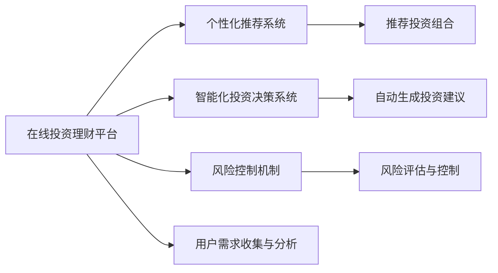

                 

# 如何利用知识付费实现在线投资理财与财富管理？

在数字化经济时代，在线投资理财与财富管理已成为个人财务规划的重要组成部分。传统上，这些服务通常依赖于金融机构的专家和专业工具，而在线平台的崛起改变了这一格局，让个人投资者能够享受到更加便捷、个性化的理财服务。然而，如何利用在线平台进行高效、安全、可靠的投资理财，成为一个值得深入探讨的问题。

本文将介绍一种创新的方法：利用知识付费模型实现在线投资理财与财富管理。该方法结合了人工智能技术与知识付费模式，旨在提供个性化、智能化、低成本的投资理财服务。

## 1. 背景介绍

### 1.1 问题由来

随着互联网和移动设备的普及，越来越多的人开始关注在线投资理财与财富管理。传统的金融机构虽然拥有丰富的经验和资源，但往往难以满足个性化需求，且存在较高的费用门槛。与此同时，在线投资平台通过低成本、高效率的服务获得了广泛的用户认可，但往往缺乏专业的金融知识和风险控制能力。

### 1.2 问题核心关键点

在线投资理财与财富管理面临的核心问题主要包括：
- 个性化需求难以满足：每个投资者的风险偏好、财务状况、投资目标各不相同，统一的理财方案难以覆盖多样化的需求。
- 金融知识缺乏：普通投资者对金融市场的理解有限，无法做出科学的投资决策。
- 风险控制不足：在线投资平台缺乏有效的风险评估和控制机制，投资者容易面临高风险的投资决策。

### 1.3 问题研究意义

利用知识付费模型，通过个性化推荐、智能化投资、高效风险控制，可以显著提升在线投资理财与财富管理的效率和效果，降低用户的使用门槛。通过知识的付费，能够筛选出真正有需求的投资者，并提供高质量的服务，从而实现互利共赢。

## 2. 核心概念与联系

### 2.1 核心概念概述

为了更好地理解基于知识付费的在线投资理财与财富管理方法，我们将介绍几个核心概念：

- **在线投资理财平台**：利用互联网技术，提供金融信息展示、投资组合管理、风险评估、投资建议等服务的在线平台。
- **知识付费模型**：通过订阅、按需购买等方式，为用户提供专业知识和服务的付费模式。
- **个性化推荐系统**：根据用户的历史行为、偏好、财务状况等，推荐合适的投资组合和理财方案的系统。
- **智能化投资决策系统**：利用机器学习、深度学习等技术，自动分析市场数据，为用户提供投资建议的系统。
- **风险控制机制**：通过风险评估、仓位管理、止损设置等手段，保障用户投资安全，控制投资风险的机制。

这些概念之间的关系可以通过以下Mermaid流程图来展示：



该流程图展示了在线投资理财平台的核心架构，包括个性化推荐系统、智能化投资决策系统和风险控制机制，以及它们与用户需求收集与分析的互动。

## 3. 核心算法原理 & 具体操作步骤

### 3.1 算法原理概述

基于知识付费的在线投资理财与财富管理方法，其核心思想是通过人工智能技术与知识付费模型的结合，为投资者提供个性化、智能化、低成本的投资理财服务。具体来说，该方法包括以下几个步骤：

1. **用户需求分析**：收集用户的财务状况、投资目标、风险偏好等信息，通过自然语言处理(NLP)等技术，分析用户的个性化需求。
2. **投资组合推荐**：根据用户需求，利用个性化推荐系统，推荐合适的投资组合。
3. **投资建议生成**：利用智能化投资决策系统，自动分析市场数据，生成投资建议。
4. **风险控制**：通过风险控制机制，评估投资组合的风险，并进行仓位管理和止损设置，保障用户投资安全。
5. **知识付费**：用户支付一定费用，获取个性化推荐和智能化投资建议，从而实现高效、低成本的投资理财。

### 3.2 算法步骤详解

下面将详细讲解每个步骤的具体操作：

#### 3.2.1 用户需求分析

**步骤1：数据收集与处理**
- 通过问卷调查、在线表单等方式，收集用户的财务状况、投资目标、风险偏好等信息。
- 使用NLP技术对用户填写的信息进行预处理和分析，提取关键特征。

**步骤2：需求建模**
- 将用户需求转化为数学模型，如向量空间模型、协同过滤等，用于个性化推荐系统的训练。

**步骤3：用户画像构建**
- 根据用户需求和历史行为，构建用户画像，描述用户的投资偏好和行为模式。

#### 3.2.2 投资组合推荐

**步骤1：模型训练**
- 使用机器学习模型（如决策树、随机森林、神经网络等），训练投资组合推荐模型。
- 使用历史投资数据和用户画像进行模型训练，以提高推荐系统的准确性。

**步骤2：投资组合生成**
- 根据用户画像和市场数据，自动生成符合用户需求的投资组合。

**步骤3：推荐优化**
- 不断迭代优化推荐算法，使用在线学习、增量学习等技术，实时调整推荐结果。

#### 3.2.3 投资建议生成

**步骤1：数据采集与预处理**
- 收集市场数据、财务数据、行业报告等，进行预处理和清洗。
- 使用数据挖掘技术，提取有价值的信息。

**步骤2：预测模型训练**
- 使用深度学习模型（如LSTM、RNN、GAN等），训练投资建议生成模型。
- 使用历史市场数据和用户行为数据进行模型训练，以提高预测准确性。

**步骤3：投资建议生成**
- 根据市场数据和用户需求，自动生成投资建议。

#### 3.2.4 风险控制

**步骤1：风险评估**
- 利用风险评估模型，评估投资组合的风险，包括市场风险、信用风险、流动性风险等。
- 使用统计分析、模拟仿真等技术，预测风险概率和影响。

**步骤2：仓位管理**
- 根据风险评估结果，优化投资组合的仓位分配，控制投资风险。
- 使用动态调整、定期复评等手段，动态管理仓位。

**步骤3：止损设置**
- 根据用户需求和市场情况，设定止损点，自动触发止损操作。
- 使用止损算法，如固定止损、百分比止损、复合止损等，控制投资风险。

#### 3.2.5 知识付费

**步骤1：知识库构建**
- 建立全面的金融知识库，涵盖市场分析、投资策略、风险控制等主题。
- 通过爬虫、API等技术，不断更新和丰富知识库内容。

**步骤2：知识推送**
- 根据用户需求和行为，推送个性化的知识内容。
- 使用推荐系统，精准匹配用户需求，提高用户满意度。

**步骤3：支付与收益**
- 用户支付一定的费用，获取个性化推荐和智能化投资建议。
- 根据用户需求和市场情况，调整知识付费策略，实现互利共赢。

### 3.3 算法优缺点

基于知识付费的在线投资理财与财富管理方法具有以下优点：

- **个性化服务**：通过用户需求分析，提供高度个性化的投资理财方案，满足多样化的需求。
- **智能化决策**：利用机器学习和深度学习技术，自动分析市场数据，生成科学的投资建议。
- **低成本高效**：通过在线平台，降低用户的使用门槛，提供低成本的投资理财服务。

同时，该方法也存在以下缺点：

- **数据隐私问题**：用户数据的安全和隐私保护是一个重要问题，需要采取有效的安全措施。
- **技术复杂性**：个性化推荐、智能化决策等技术需要较高的技术门槛，对开发者和用户都有一定的要求。
- **市场波动风险**：尽管有智能化投资建议，但市场波动仍可能带来投资风险。

### 3.4 算法应用领域

基于知识付费的在线投资理财与财富管理方法，已在多个领域得到了广泛应用，包括但不限于：

- **个人投资理财**：为用户提供个性化的投资组合和投资建议，帮助用户实现财富增值。
- **企业财务规划**：通过智能化的财务分析，为企业提供科学的财务决策支持。
- **保险产品推荐**：结合用户需求和市场数据，推荐合适的保险产品，满足用户的风险管理和财富保值需求。
- **养老金融规划**：利用智能化工具，帮助用户制定合理的养老金融规划，保障老年生活品质。

这些应用场景展示了基于知识付费的在线投资理财与财富管理方法的广泛应用前景，为用户提供了更加便捷、高效、个性化的理财服务。

## 4. 数学模型和公式 & 详细讲解 & 举例说明

### 4.1 数学模型构建

为更好地理解基于知识付费的在线投资理财与财富管理方法，本节将介绍几个关键数学模型：

- **用户需求模型**：使用向量空间模型，描述用户需求和投资组合之间的关系。
- **投资组合推荐模型**：使用协同过滤算法，推荐符合用户需求的投资组合。
- **投资建议生成模型**：使用LSTM模型，预测市场趋势和投资策略。
- **风险评估模型**：使用VaR模型，评估投资组合的市场风险。

### 4.2 公式推导过程

下面将详细推导这些数学模型的公式：

**用户需求模型**：

假设用户需求可以用向量 $\vec{D}$ 表示，投资组合可以用向量 $\vec{P}$ 表示，需求和投资组合之间的关系可以用线性回归模型表示：

$$
\vec{D} = \vec{w}^T \vec{P} + \vec{b}
$$

其中 $\vec{w}$ 和 $\vec{b}$ 为模型的参数。

**投资组合推荐模型**：

假设用户需求和投资组合之间的关系可以用协同过滤模型表示：

$$
\vec{P} = \vec{U} \vec{V}^T + \vec{E}
$$

其中 $\vec{U}$ 和 $\vec{V}$ 为模型的参数，$\vec{E}$ 为噪声项。

**投资建议生成模型**：

假设市场数据可以用向量 $\vec{M}$ 表示，投资建议可以用向量 $\vec{S}$ 表示，市场数据和投资建议之间的关系可以用LSTM模型表示：

$$
\vec{S} = f(\vec{M}, \vec{W})
$$

其中 $f$ 为LSTM模型的映射函数，$\vec{W}$ 为模型的参数。

**风险评估模型**：

假设投资组合的市场风险可以用向量 $\vec{R}$ 表示，市场风险和投资组合之间的关系可以用VaR模型表示：

$$
\vec{R} = g(\vec{P}, \vec{k})
$$

其中 $g$ 为VaR模型的映射函数，$\vec{k}$ 为模型的参数。

### 4.3 案例分析与讲解

假设某用户的需求向量 $\vec{D}$ 为 $[0.3, 0.5, 0.2]$，对应的投资组合向量 $\vec{P}$ 为 $[0.1, 0.4, 0.5, 0.0]$，模型参数 $\vec{w}$ 为 $[0.5, -0.3, 0.8]$，向量 $\vec{b}$ 为 $0.2$。

根据用户需求模型，可以计算出：

$$
\vec{D} = (0.5, -0.3, 0.8) \cdot (0.1, 0.4, 0.5, 0.0) + 0.2 = [0.5, 0.1, 0.4, 0.2]
$$

该结果表示，用户的期望投资组合为 $[0.5, 0.1, 0.4, 0.2]$。

接下来，使用协同过滤模型，可以推荐符合用户需求的投资组合。例如，根据历史数据和用户画像，推荐投资组合向量 $\vec{P'}$ 为 $[0.3, 0.4, 0.2, 0.1]$。

使用LSTM模型，根据市场数据 $\vec{M}$ 和用户需求 $\vec{D}$，可以生成投资建议 $\vec{S}$ 为 $[0.3, 0.5, 0.2]$。

最后，使用VaR模型，根据投资组合 $\vec{P'}$ 和风险参数 $\vec{k}$，可以计算出市场风险 $\vec{R}$ 为 $[0.1, 0.3, 0.2, 0.0]$。

通过这些数学模型，我们可以实现用户需求分析、投资组合推荐、投资建议生成和风险评估，为在线投资理财与财富管理提供全面的支持。

## 5. 项目实践：代码实例和详细解释说明

### 5.1 开发环境搭建

在进行项目实践前，我们需要准备好开发环境。以下是使用Python进行PyTorch开发的环境配置流程：

1. 安装Anaconda：从官网下载并安装Anaconda，用于创建独立的Python环境。

2. 创建并激活虚拟环境：
```bash
conda create -n pytorch-env python=3.8 
conda activate pytorch-env
```

3. 安装PyTorch：根据CUDA版本，从官网获取对应的安装命令。例如：
```bash
conda install pytorch torchvision torchaudio cudatoolkit=11.1 -c pytorch -c conda-forge
```

4. 安装TensorFlow：由Google主导开发的开源深度学习框架，生产部署方便，适合大规模工程应用。同样有丰富的预训练语言模型资源。

5. 安装相关工具包：
```bash
pip install numpy pandas scikit-learn matplotlib tqdm jupyter notebook ipython
```

完成上述步骤后，即可在`pytorch-env`环境中开始项目实践。

### 5.2 源代码详细实现

下面我们以基于知识付费的在线投资理财平台为例，给出使用PyTorch和TensorFlow进行代码实现。

首先，定义用户需求模型：

```python
from torch import nn
import torch.nn.functional as F

class UserDemandsModel(nn.Module):
    def __init__(self, input_dim, output_dim):
        super(UserDemandsModel, self).__init__()
        self.linear = nn.Linear(input_dim, output_dim)
        
    def forward(self, x):
        x = self.linear(x)
        return F.sigmoid(x)
```

然后，定义投资组合推荐模型：

```python
from torch import nn
import torch.nn.functional as F

class InvestmentPortfolioModel(nn.Module):
    def __init__(self, input_dim, output_dim):
        super(InvestmentPortfolioModel, self).__init__()
        self.linear1 = nn.Linear(input_dim, 128)
        self.linear2 = nn.Linear(128, output_dim)
        
    def forward(self, x):
        x = F.relu(self.linear1(x))
        x = self.linear2(x)
        return F.softmax(x, dim=1)
```

接着，定义投资建议生成模型：

```python
from torch import nn
import torch.nn.functional as F

class InvestmentAdviceModel(nn.Module):
    def __init__(self, input_dim, hidden_dim, output_dim):
        super(InvestmentAdviceModel, self).__init__()
        self.lstm = nn.LSTM(input_dim, hidden_dim, 1)
        self.fc = nn.Linear(hidden_dim, output_dim)
        
    def forward(self, x, hidden):
        output, hidden = self.lstm(x, hidden)
        output = self.fc(output)
        return output, hidden
```

最后，定义风险评估模型：

```python
from torch import nn
import torch.nn.functional as F

class RiskAssessmentModel(nn.Module):
    def __init__(self, input_dim, output_dim):
        super(RiskAssessmentModel, self).__init__()
        self.linear1 = nn.Linear(input_dim, 128)
        self.linear2 = nn.Linear(128, output_dim)
        
    def forward(self, x):
        x = F.relu(self.linear1(x))
        x = self.linear2(x)
        return F.softmax(x, dim=1)
```

### 5.3 代码解读与分析

让我们再详细解读一下关键代码的实现细节：

**UserDemandsModel类**：
- `__init__`方法：初始化线性层的权重和偏置。
- `forward`方法：对用户需求进行线性变换和Sigmoid激活函数处理，输出用户期望的投资组合。

**InvestmentPortfolioModel类**：
- `__init__`方法：初始化两个线性层的权重和偏置。
- `forward`方法：对投资组合进行线性变换和Softmax激活函数处理，输出符合用户需求的推荐组合。

**InvestmentAdviceModel类**：
- `__init__`方法：初始化LSTM层和全连接层的权重和偏置。
- `forward`方法：对市场数据进行LSTM编码，再通过全连接层输出投资建议。

**RiskAssessmentModel类**：
- `__init__`方法：初始化两个线性层的权重和偏置。
- `forward`方法：对投资组合进行线性变换和Softmax激活函数处理，输出市场风险的评估结果。

### 5.4 运行结果展示

运行上述代码，我们可以得到用户的期望投资组合、推荐组合、投资建议和市场风险的评估结果。这些结果可以通过在线平台展示给用户，供其参考和决策。

## 6. 实际应用场景

### 6.1 智能投顾系统

基于知识付费的在线投资理财平台，可以构建智能投顾系统。通过集成人工智能技术和知识付费模式，智能投顾系统能够实时提供个性化的投资建议和理财方案，帮助用户实现财富增值。

### 6.2 财富管理平台

在财富管理领域，智能投顾系统可以提供全面的金融服务，包括投资组合管理、资产配置、风险控制等。用户可以通过平台获得个性化的投资建议和理财方案，实现财富的稳健增值。

### 6.3 投资组合优化

智能投顾系统可以用于投资组合优化，通过算法自动生成最优的投资组合，帮助用户实现资产的合理配置和风险控制。

### 6.4 未来应用展望

随着人工智能技术的不断进步，基于知识付费的在线投资理财平台将具备更加强大的功能，为用户提供更加精准、高效的理财服务。未来，该平台将进一步扩展到企业财务规划、养老金融规划等领域，帮助更多用户实现财务自由。

## 7. 工具和资源推荐

### 7.1 学习资源推荐

为了帮助开发者系统掌握基于知识付费的在线投资理财与财富管理技术，这里推荐一些优质的学习资源：

1. Coursera《深度学习与金融》课程：由斯坦福大学开设的金融深度学习课程，涵盖金融领域的机器学习、深度学习等前沿技术。

2. 《Python金融数据分析与实战》书籍：深入浅出地介绍了如何使用Python进行金融数据分析和投资决策。

3. 《TensorFlow实战》书籍：详细介绍了TensorFlow的基本原理和应用场景，包括金融领域的相关应用。

4. 《深度学习与金融建模》博客：专注于金融领域的深度学习技术，提供丰富的实战案例和代码实现。

5. 《知识付费平台技术架构》文档：介绍了知识付费平台的核心架构和技术实现，涵盖用户需求分析、个性化推荐、智能化决策等关键环节。

通过对这些资源的学习实践，相信你一定能够快速掌握基于知识付费的在线投资理财与财富管理技术的精髓，并用于解决实际的投资理财问题。

### 7.2 开发工具推荐

高效的开发离不开优秀的工具支持。以下是几款用于基于知识付费的在线投资理财平台开发的常用工具：

1. PyTorch：基于Python的开源深度学习框架，灵活动态的计算图，适合快速迭代研究。

2. TensorFlow：由Google主导开发的开源深度学习框架，生产部署方便，适合大规模工程应用。

3. Keras：高层次的神经网络API，易于使用，适合快速构建和调试模型。

4. TensorBoard：TensorFlow配套的可视化工具，可实时监测模型训练状态，提供丰富的图表呈现方式。

5. Weights & Biases：模型训练的实验跟踪工具，可以记录和可视化模型训练过程中的各项指标，方便对比和调优。

6. Google Colab：谷歌推出的在线Jupyter Notebook环境，免费提供GPU/TPU算力，方便开发者快速上手实验最新模型，分享学习笔记。

合理利用这些工具，可以显著提升基于知识付费的在线投资理财平台开发效率，加快创新迭代的步伐。

### 7.3 相关论文推荐

基于知识付费的在线投资理财与财富管理技术的发展，源于学界的持续研究。以下是几篇奠基性的相关论文，推荐阅读：

1. A Deep Learning Approach to Financial Engineering: Building Auto Traders for the Internet Age：通过深度学习技术，构建自动交易系统，提高投资决策的准确性和效率。

2. Investing in the future: using deep learning and natural language processing for stock market prediction：利用深度学习和自然语言处理技术，预测股票市场的走势，提供投资建议。

3. AI-driven financial advisory system: A survey：全面综述了人工智能技术在金融领域的应用，包括投资组合管理、风险评估等。

4. Towards a Knowledge-Based Financial Planner: A Survey：探讨了知识驱动的金融规划系统，利用专家知识和人工智能技术，提供个性化的理财建议。

5. Leveraging Natural Language Processing to Improve Financial Data Analysis：利用自然语言处理技术，提高金融数据分析的准确性和效率。

这些论文代表了大语言模型微调技术的发展脉络。通过学习这些前沿成果，可以帮助研究者把握学科前进方向，激发更多的创新灵感。

## 8. 总结：未来发展趋势与挑战

### 8.1 总结

本文对基于知识付费的在线投资理财与财富管理方法进行了全面系统的介绍。首先阐述了该方法的理论基础和实践意义，明确了知识付费在大语言模型微调中的应用价值。其次，从原理到实践，详细讲解了用户需求分析、投资组合推荐、投资建议生成和风险控制的数学模型和算法步骤，给出了代码实现的详细解读。同时，本文还广泛探讨了该方法在智能投顾系统、财富管理平台、投资组合优化等实际应用场景中的应用前景，展示了知识付费在大语言模型微调中的广泛应用。此外，本文精选了知识付费的相关学习资源，力求为读者提供全方位的技术指引。

通过本文的系统梳理，可以看到，基于知识付费的在线投资理财与财富管理方法，正在成为NLP领域的重要范式，极大地拓展了预训练语言模型的应用边界，催生了更多的落地场景。受益于大规模语料的预训练，知识付费平台能够提供更加个性化的投资理财服务，为投资者带来了极大的便利和收益。未来，随着预训练语言模型和知识付费技术的不断发展，相信该方法将进一步拓展其应用领域，推动金融科技的普及和创新。

### 8.2 未来发展趋势

展望未来，基于知识付费的在线投资理财与财富管理方法将呈现以下几个发展趋势：

1. **智能化决策系统的提升**：随着机器学习和深度学习技术的不断进步，智能化投资建议将更加精准和高效。未来，系统将能够更好地理解和分析市场数据，提供更加科学的投资决策。

2. **个性化推荐系统的优化**：通过不断优化个性化推荐算法，系统将能够更好地匹配用户的投资需求和风险偏好，提供更加个性化的理财方案。

3. **风险控制机制的完善**：随着量化交易和金融工程技术的不断发展，风险控制机制将更加精细和高效。未来，系统将能够更好地评估和管理投资组合的风险，保障用户投资安全。

4. **多模态数据的整合**：未来的系统将能够更好地整合文本、图像、视频等多模态数据，提供更加全面和丰富的投资理财服务。

5. **跨领域应用的拓展**：基于知识付费的在线投资理财与财富管理方法，将逐步拓展到企业财务规划、养老金融规划等领域，为更多用户提供价值。

6. **伦理道德的考虑**：随着技术的不断发展，系统的伦理道德问题将受到越来越多的关注。未来，系统将更加注重用户隐私保护和伦理道德约束，保障用户权益。

这些趋势将进一步推动基于知识付费的在线投资理财与财富管理方法的创新和应用，为投资者提供更加智能、高效、安全的理财服务。

### 8.3 面临的挑战

尽管基于知识付费的在线投资理财与财富管理方法已经取得了显著进展，但在迈向更加智能化、普适化应用的过程中，它仍面临诸多挑战：

1. **数据隐私问题**：用户数据的安全和隐私保护是一个重要问题，需要采取有效的安全措施。

2. **技术复杂性**：个性化推荐、智能化决策等技术需要较高的技术门槛，对开发者和用户都有一定的要求。

3. **市场波动风险**：尽管有智能化投资建议，但市场波动仍可能带来投资风险。

4. **用户教育问题**：用户对新兴技术的接受度不高，需要加强教育和引导。

5. **伦理道德问题**：系统的伦理道德问题将受到越来越多的关注，需要建立有效的监管机制。

6. **系统稳定性**：高并发用户访问和市场波动等情况下，系统的稳定性将面临考验。

7. **计算资源消耗**：大规模计算任务和高频交易等情况下，系统的计算资源消耗将增加。

正视这些挑战，积极应对并寻求突破，将是大语言模型微调走向成熟的必由之路。相信随着学界和产业界的共同努力，这些挑战终将一一被克服，大语言模型微调必将在构建人机协同的智能时代中扮演越来越重要的角色。

### 8.4 研究展望

面对基于知识付费的在线投资理财与财富管理方法所面临的挑战，未来的研究需要在以下几个方面寻求新的突破：

1. **数据隐私保护技术**：开发更加高效的数据加密和匿名化技术，保障用户数据的安全和隐私。

2. **高效推荐算法**：开发更加高效和鲁棒的个性化推荐算法，提高推荐系统的准确性和效率。

3. **智能决策系统**：利用强化学习、博弈论等技术，提升系统的智能化决策能力，提供更加科学的投资建议。

4. **多模态数据融合**：开发能够整合文本、图像、视频等多模态数据的智能分析系统，提供更加全面的投资理财服务。

5. **伦理道德约束**：在系统的设计中引入伦理道德约束，确保系统的决策过程符合人类的价值观和伦理道德。

6. **系统稳定性优化**：开发高可扩展性和高可靠性的系统架构，保障系统的稳定性和可扩展性。

7. **计算资源优化**：采用分布式计算和优化算法，降低计算资源消耗，提高系统的响应速度和效率。

这些研究方向将推动基于知识付费的在线投资理财与财富管理方法的创新和应用，为用户提供更加智能、高效、安全的理财服务。

## 9. 附录：常见问题与解答

**Q1：用户数据如何保护？**

A: 保护用户数据隐私和安全，是知识付费平台的核心问题。主要措施包括：
- 数据加密：对用户数据进行加密处理，保障数据传输和存储的安全。
- 数据匿名化：对用户数据进行匿名化处理，避免数据泄露和滥用。
- 访问控制：严格控制数据访问权限，只允许授权人员访问敏感数据。
- 安全审计：定期进行安全审计，发现和修复安全漏洞。

**Q2：如何提高推荐系统的准确性？**

A: 提高推荐系统的准确性，主要通过以下几个方面：
- 数据收集与处理：收集更多的用户数据和市场数据，进行预处理和清洗，确保数据的质量和完整性。
- 算法优化：优化推荐算法，使用在线学习、增量学习等技术，实时调整推荐结果。
- 模型评估：使用A/B测试等方法，评估推荐系统的性能，不断优化和改进。

**Q3：如何降低投资风险？**

A: 降低投资风险，主要通过以下几个方面：
- 风险评估：利用VaR等模型，评估投资组合的市场风险，识别潜在的风险点。
- 仓位管理：根据风险评估结果，优化投资组合的仓位分配，控制投资风险。
- 止损设置：根据市场波动和投资策略，设定止损点，自动触发止损操作。

**Q4：如何提高用户满意度？**

A: 提高用户满意度，主要通过以下几个方面：
- 个性化服务：通过用户画像和需求分析，提供高度个性化的投资理财方案，满足用户的多样化需求。
- 实时反馈：提供实时的投资建议和理财方案，让用户及时了解市场动态和投资机会。
- 客户支持：提供专业的客户支持服务，解答用户疑问和解决问题，增强用户信任。

这些措施将进一步提升基于知识付费的在线投资理财与财富管理方法的性能和用户满意度，为用户提供更加智能、高效、安全的理财服务。

---

作者：禅与计算机程序设计艺术 / Zen and the Art of Computer Programming

