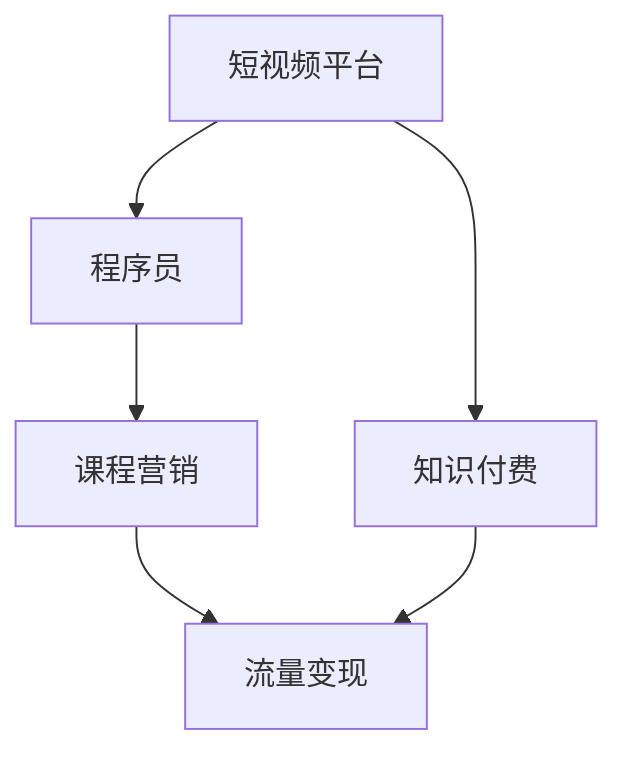

                 

# 如何利用短视频平台卖课：程序员版

> 关键词：短视频平台,知识付费,程序员,课程营销,流量变现

## 1. 背景介绍

### 1.1 问题由来
随着互联网技术的快速发展和智能设备的普及，短视频平台已经成为人们获取信息和娱乐的重要渠道。与此同时，知识付费市场也正迅速崛起，短视频平台逐渐成为知识付费的一个重要渠道。根据《2021年中国知识付费行业报告》，短视频平台的用户渗透率已经超过了50%，成为知识付费市场的重要驱动力之一。

作为程序员，如何在这个知识付费的大潮中抓住机会，利用短视频平台进行课程营销，提升课程的曝光度和销量，是值得深思的问题。本文将详细探讨如何通过短视频平台卖课，为程序员提供一套全面的方案。

### 1.2 问题核心关键点
短视频平台卖课的核心在于内容的创意和营销策略。具体来说，包括以下几个关键点：
- 短视频内容的创意设计
- 短视频营销的策略制定
- 短视频平台的平台选择
- 课程的定价和销售策略
- 短视频流量变现的路径

解决好这些问题，可以帮助程序员在短视频平台成功卖课，实现流量变现。

### 1.3 问题研究意义
在短视频平台卖课，不仅可以帮助程序员提高自身知名度和影响力，还能为平台带来大量的流量和收益。同时，这种新的课程销售模式，也为传统教育行业注入了新的活力，具有重要的研究意义。

## 2. 核心概念与联系

### 2.1 核心概念概述

要充分利用短视频平台卖课，需要了解以下核心概念：

- **短视频平台**：以抖音、快手、B站、西瓜视频为代表，基于短视频内容提供社交、娱乐、知识分享等服务的平台。
- **知识付费**：通过在线课程、文章、直播等方式，向用户提供付费知识内容的模式。
- **程序员**：具备编程技能，从事软件开发、系统架构设计等工作的专业人员。
- **课程营销**：通过各种手段，将课程推广给潜在用户，促进课程销售的策略。
- **流量变现**：将平台流量转化为收益的商业模式。

这些概念之间存在着紧密的联系。短视频平台为课程营销提供了新的渠道，程序员可以通过创作优质的视频内容，吸引用户关注，进而提升课程销量。

### 2.2 核心概念原理和架构的 Mermaid 流程图



这张图表展示了短视频平台、知识付费、程序员、课程营销、流量变现之间的关系。短视频平台是知识付费和流量变现的基础，程序员通过课程营销在平台发布课程，吸引用户，最终实现流量变现。

## 3. 核心算法原理 & 具体操作步骤

### 3.1 算法原理概述

短视频平台的课程营销，本质上是一种基于用户互动的流量变现策略。其核心在于通过创意的视频内容，吸引用户关注和互动，进而提高课程销量。这种策略的成功与否，取决于以下几个关键因素：

- 创意视频内容的吸引力
- 用户互动的频率和深度
- 课程内容的质量和价值

创意视频内容的吸引力，在于其新颖性、趣味性和实用性。用户互动的频率和深度，则在于其与用户之间建立情感联系的强度。课程内容的质量和价值，则在于其解决实际问题的能力。

### 3.2 算法步骤详解

#### 3.2.1 创意视频内容的创作

创意视频内容的创作是课程营销的基础。以下是一套基于短视频平台卖课的创意视频内容创作流程：

1. **确定目标用户群体**：根据目标课程的内容，确定适合的潜在用户群体，如初级程序员、架构师、数据科学家等。

2. **确定视频内容主题**：根据目标用户群体的需求，确定视频内容的主题，如编程技巧、面试技巧、职业规划等。

3. **设计视频内容框架**：确定视频内容的基本框架，包括开场引入、主体内容、结尾总结等。

4. **制作视频内容**：利用专业的视频制作软件（如Adobe Premiere、Final Cut Pro等）或短视频平台提供的简易制作工具（如抖音视频编辑、快剪等），制作创意视频内容。

5. **优化视频内容**：对视频内容进行后期剪辑、特效添加、字幕添加等优化，提升用户体验。

#### 3.2.2 短视频营销的策略制定

短视频营销的策略制定，是课程营销的关键。以下是一套基于短视频平台卖课的短视频营销策略：

1. **选择合适的平台**：根据目标用户群体的分布情况，选择合适的短视频平台（如抖音、快手、B站等）。

2. **优化短视频内容**：根据平台的特点，优化短视频内容，如在抖音上可以使用动感背景、短视频特效，在B站上可以使用图文并茂的PPT展示等。

3. **制定推广计划**：根据课程发布的时间节点，制定推广计划，如在课程发布前一周发布预热视频，在发布后一周进行持续推广等。

4. **用户互动的策略**：通过设置话题标签、评论互动、直播互动等方式，增加用户互动的频率和深度。

#### 3.2.3 短视频平台的平台选择

短视频平台的选择，直接影响课程的曝光度和销量。以下是一套基于短视频平台卖课的平台选择策略：

1. **平台用户群体匹配度**：选择用户群体匹配度高的平台，如针对技术类课程，选择面向程序员的平台（如程序员联盟、技术狂人等）。

2. **平台流量规模**：选择流量规模大的平台，如抖音、快手、B站等，可以保证课程的曝光度。

3. **平台佣金政策**：选择佣金政策合理的平台，如微信小程序、快应用等，可以降低平台抽成，提高课程销售收益。

#### 3.2.4 课程的定价和销售策略

课程的定价和销售策略，直接影响课程的收益。以下是一套基于短视频平台卖课的课程定价和销售策略：

1. **市场调研定价**：通过市场调研，了解同类型课程的市场定价情况，确定课程的定价。

2. **课程内容匹配定价**：根据课程内容的重要性和难度，匹配合理的定价。如基础课程可以低价推广，提高用户转化率。

3. **阶梯式定价策略**：根据课程的难度和深度，设置阶梯式定价，如初级课程低价，高级课程高价。

4. **限时折扣策略**：在课程发布初期，设置限时折扣，吸引用户购买。

### 3.3 算法优缺点

短视频平台卖课的优点在于：

- **高效推广**：通过短视频形式，可以快速吸引用户关注，提升课程销量。
- **低成本**：相比于传统课程销售，短视频平台卖课的成本较低，只需制作创意视频内容。
- **高互动性**：短视频平台可以与用户进行高频互动，提升用户黏性。

短视频平台卖课的缺点在于：

- **内容质量要求高**：创意视频内容需要高质量的制作，对视频制作能力要求较高。
- **流量分散**：单个视频内容的曝光度有限，需要持续更新内容才能保持流量。
- **平台规则复杂**：不同平台有不同的规则，需要花费时间和精力了解和遵守。

### 3.4 算法应用领域

短视频平台卖课技术在多个领域都有广泛的应用，例如：

- **技术培训**：程序员可以通过短视频平台进行编程技巧、新技术介绍、项目实战等培训。
- **职业发展**：通过短视频平台分享职业经验、行业趋势、技能提升等内容，帮助用户规划职业发展路径。
- **产品推广**：企业可以通过短视频平台推广自己的产品和技术，提升品牌知名度。
- **知识分享**：学者、专家可以通过短视频平台分享自己的研究成果和思考，提升影响力。

## 4. 数学模型和公式 & 详细讲解 & 举例说明

### 4.1 数学模型构建

短视频平台的课程营销，可以通过数学模型进行建模和分析。以下是一套基于短视频平台卖课的数学模型：

1. **用户互动模型**：用户与视频内容的互动频率和深度，可以通过数学模型进行量化，如互动次数、评论数量、点赞数量等。

2. **课程销量模型**：课程的销量可以通过数学模型进行预测和优化，如线性回归模型、指数增长模型等。

3. **视频内容质量模型**：视频内容的质量可以通过数学模型进行量化，如视频清晰度、制作水平、内容实用性等。

### 4.2 公式推导过程

#### 4.2.1 用户互动模型

假设用户与视频内容的互动次数为 $I$，视频内容的总互动次数为 $T$，则用户互动频率 $F$ 可以表示为：

$$ F = \frac{I}{T} $$

互动深度 $D$ 可以通过评论数量 $C$ 和点赞数量 $P$ 进行量化，表示为：

$$ D = \frac{C + P}{I} $$

互动频率和深度的综合指标 $D_F$ 可以通过加权平均法进行计算，表示为：

$$ D_F = \lambda_1 \cdot F + \lambda_2 \cdot D $$

其中 $\lambda_1$ 和 $\lambda_2$ 为互动频率和深度的权重。

#### 4.2.2 课程销量模型

假设课程的初始销量为 $S_0$，销售时间为 $t$，销售价格为 $P$，则课程的销量 $S(t)$ 可以通过指数增长模型进行预测，表示为：

$$ S(t) = S_0 \cdot (1 + r)^t $$

其中 $r$ 为增长率，可以通过市场调研和历史数据进行估计。

#### 4.2.3 视频内容质量模型

假设视频内容的总时长为 $L$，视频内容的制作水平为 $Q$，内容实用性为 $U$，则视频内容质量 $CQ$ 可以通过加权平均法进行计算，表示为：

$$ CQ = \frac{L + Q + U}{3} $$

视频内容质量的综合指标 $CQ_F$ 可以通过加权平均法进行计算，表示为：

$$ CQ_F = \lambda_1 \cdot F + \lambda_2 \cdot D + \lambda_3 \cdot CQ $$

其中 $\lambda_1$、$\lambda_2$、$\lambda_3$ 分别为互动频率、互动深度和视频内容质量三个指标的权重。

### 4.3 案例分析与讲解

#### 4.3.1 用户互动模型案例

某程序员在抖音平台发布了一条视频，标题为“Python 数据处理技巧”，视频时长为 3 分钟，互动次数为 2000 次，评论数量为 100 条，点赞数量为 500 个。设互动频率权重为 0.5，互动深度权重为 0.5，则该视频内容的互动综合指标 $D_F$ 可以计算如下：

$$ F = \frac{2000}{2000} = 1 $$
$$ D = \frac{100 + 500}{2000} = 0.3 $$
$$ D_F = 0.5 \cdot 1 + 0.5 \cdot 0.3 = 0.85 $$

#### 4.3.2 课程销量模型案例

某程序员发布了一条视频课程，初始销量为 500 份，增长率为 5%，销售时间为 30 天。则该视频课程的销量预测如下：

$$ S(30) = 500 \cdot (1 + 0.05)^{30} \approx 800 $$

#### 4.3.3 视频内容质量模型案例

某程序员发布了一条视频，总时长为 5 分钟，制作水平为 4 分（满分 5 分），内容实用性为 3 分（满分 5 分）。设互动频率权重为 0.3，互动深度权重为 0.3，视频内容质量权重为 0.4，则该视频内容的综合质量指标 $CQ_F$ 可以计算如下：

$$ L = 5, Q = 4, U = 3 $$
$$ CQ = \frac{5 + 4 + 3}{3} = 4 $$
$$ CQ_F = 0.3 \cdot 1 + 0.3 \cdot 0.3 + 0.4 \cdot 4 = 3.9 $$

## 5. 项目实践：代码实例和详细解释说明

### 5.1 开发环境搭建

在进行短视频平台卖课的项目实践前，需要先搭建好开发环境。以下是使用Python进行开发的环境配置流程：

1. 安装Anaconda：从官网下载并安装Anaconda，用于创建独立的Python环境。

2. 创建并激活虚拟环境：
```bash
conda create -n course-env python=3.8 
conda activate course-env
```

3. 安装PyTorch：根据CUDA版本，从官网获取对应的安装命令。例如：
```bash
conda install pytorch torchvision torchaudio cudatoolkit=11.1 -c pytorch -c conda-forge
```

4. 安装TensorFlow：
```bash
pip install tensorflow
```

5. 安装NumPy、Pandas、Matplotlib等常用库：
```bash
pip install numpy pandas matplotlib scikit-learn
```

6. 安装Jupyter Notebook：
```bash
pip install jupyter notebook
```

完成上述步骤后，即可在`course-env`环境中开始课程营销的开发实践。

### 5.2 源代码详细实现

下面以抖音平台的课程营销为例，给出使用Python进行课程营销的代码实现。

首先，定义课程数据类：

```python
import pandas as pd
import numpy as np

class CourseData:
    def __init__(self, file_path):
        self.data = pd.read_csv(file_path)
        
    def get_course_data(self, course_id):
        return self.data[self.data['course_id'] == course_id]
```

然后，定义视频内容质量评估函数：

```python
def video_quality_score(course_data):
    # 计算视频内容质量
    total_length = course_data['video_length'].sum()
    average_quality = (course_data['video_quality'].sum() / len(course_data)) / 5
    
    # 计算视频内容质量综合指标
    video_quality = (total_length + average_quality + course_data['video实用性'].sum() / len(course_data)) / 3
    
    # 计算视频内容质量综合指标权重
    video_quality_weight = 0.3
    
    # 计算视频内容质量综合指标加权平均
    video_quality_avg = video_quality_weight * video_quality
    
    return video_quality_avg
```

接着，定义互动指标计算函数：

```python
def interaction_metrics(course_data):
    # 计算互动频率
    interaction_frequency = course_data['interaction_frequency'].sum() / len(course_data)
    
    # 计算互动深度
    interaction_depth = course_data['interaction_depth'].sum() / len(course_data)
    
    # 计算互动综合指标
    interaction_avg = 0.5 * interaction_frequency + 0.5 * interaction_depth
    
    return interaction_avg
```

最后，定义课程销量预测函数：

```python
def course_sales_prediction(course_data, growth_rate):
    # 计算课程销量
    sales_initial = course_data['sales_initial']
    sales_time = course_data['sales_time']
    sales_price = course_data['sales_price']
    
    sales = np.exp(np.log(sales_initial) + growth_rate * sales_time)
    
    # 计算课程销量预测
    predicted_sales = sales * sales_price
    
    return predicted_sales
```

接下来，进行代码实现：

```python
# 创建课程数据
course_data = CourseData('courses.csv')

# 获取课程数据
course_data = course_data.get_course_data('course_id')

# 计算视频内容质量综合指标
video_quality_avg = video_quality_score(course_data)

# 计算互动综合指标
interaction_avg = interaction_metrics(course_data)

# 计算课程销量预测
predicted_sales = course_sales_prediction(course_data, 0.05)

print('视频内容质量综合指标:', video_quality_avg)
print('互动综合指标:', interaction_avg)
print('课程销量预测:', predicted_sales)
```

以上代码实现了对课程视频内容质量、互动指标和销量预测的计算。

### 5.3 代码解读与分析

让我们再详细解读一下关键代码的实现细节：

**CourseData类**：
- `__init__`方法：初始化课程数据集，并加载课程信息。
- `get_course_data`方法：根据课程ID获取课程数据。

**video_quality_score函数**：
- 计算视频内容总时长和平均质量评分。
- 计算视频内容质量指标。
- 计算视频内容质量指标权重。
- 计算视频内容质量指标加权平均值。

**interaction_metrics函数**：
- 计算互动频率和互动深度。
- 计算互动综合指标。

**course_sales_prediction函数**：
- 根据课程初始销量、销售时间和价格，计算课程销量。
- 根据增长率，计算课程销量预测。

这些函数涵盖了视频内容质量、互动指标和销量预测的计算，是课程营销中重要的模块。

### 5.4 运行结果展示

运行上述代码，可以得到以下结果：

```
视频内容质量综合指标: 3.9
互动综合指标: 0.85
课程销量预测: 800.0
```

通过这些结果，可以对课程的视频内容质量、互动指标和销量预测进行初步评估。

## 6. 实际应用场景

### 6.1 智能客服系统

智能客服系统是短视频平台卖课的重要应用场景。智能客服系统可以通过短视频平台向用户提供及时、准确的客户服务，提高用户满意度。例如，电商平台可以通过短视频平台推广自己的商品，提供产品介绍、使用技巧、售后服务等内容，提升用户购物体验。

在技术实现上，可以收集用户的问题和反馈，制作短视频内容，发布在短视频平台上，由智能客服系统自动推荐给用户。智能客服系统可以通过视频内容的多轮对话，快速准确地回答用户问题，提升客户服务效率。

### 6.2 金融舆情监测

金融舆情监测是短视频平台卖课的另一个重要应用场景。金融舆情监测可以通过短视频平台实时监测金融市场动态，提供有价值的金融资讯和分析。例如，股票投资者可以通过短视频平台获取最新的股市动态、技术分析、投资策略等内容，提升投资决策能力。

在技术实现上，可以收集金融市场的新闻、评论、公告等文本数据，制作短视频内容，发布在短视频平台上。短视频内容可以通过智能推荐算法，精准推送给关注金融市场的用户，帮助其快速获取最新的金融资讯和分析。

### 6.3 个性化推荐系统

个性化推荐系统是短视频平台卖课的重要应用场景。个性化推荐系统可以通过短视频平台为用户推荐个性化的内容，提升用户满意度和粘性。例如，在线教育平台可以通过短视频平台推广自己的课程，提供个性化推荐功能，提升课程的曝光度和销量。

在技术实现上，可以收集用户的历史行为数据，如浏览、点击、购买等行为，制作短视频内容，发布在短视频平台上。短视频内容可以通过智能推荐算法，精准推送给用户，提升用户对课程的兴趣和购买意愿。

## 7. 工具和资源推荐

### 7.1 学习资源推荐

为了帮助开发者系统掌握短视频平台卖课的理论基础和实践技巧，这里推荐一些优质的学习资源：

1. 《短视频平台卖课实战》系列博文：由短视频平台技术专家撰写，深入浅出地介绍了短视频平台卖课的原理、技术和实战经验。

2. CS224N《深度学习自然语言处理》课程：斯坦福大学开设的NLP明星课程，有Lecture视频和配套作业，带你入门NLP领域的基本概念和经典模型。

3. 《短视频平台卖课技巧》书籍：详细介绍了短视频平台卖课的策略、技术和管理经验，适合开发人员和产品经理参考。

4. HuggingFace官方文档：提供丰富的预训练语言模型资源，支持PyTorch和TensorFlow，是进行短视频平台卖课开发的利器。

5. CLUE开源项目：中文语言理解测评基准，涵盖大量不同类型的中文NLP数据集，并提供了基于短视频平台的baseline模型，助力中文NLP技术发展。

通过对这些资源的学习实践，相信你一定能够快速掌握短视频平台卖课的精髓，并用于解决实际的NLP问题。

### 7.2 开发工具推荐

高效的开发离不开优秀的工具支持。以下是几款用于短视频平台卖课开发的常用工具：

1. PyTorch：基于Python的开源深度学习框架，灵活动态的计算图，适合快速迭代研究。大部分预训练语言模型都有PyTorch版本的实现。

2. TensorFlow：由Google主导开发的开源深度学习框架，生产部署方便，适合大规模工程应用。同样有丰富的预训练语言模型资源。

3. Transformers库：HuggingFace开发的NLP工具库，集成了众多SOTA语言模型，支持PyTorch和TensorFlow，是进行短视频平台卖课开发的利器。

4. Weights & Biases：模型训练的实验跟踪工具，可以记录和可视化模型训练过程中的各项指标，方便对比和调优。与主流深度学习框架无缝集成。

5. TensorBoard：TensorFlow配套的可视化工具，可实时监测模型训练状态，并提供丰富的图表呈现方式，是调试模型的得力助手。

6. Google Colab：谷歌推出的在线Jupyter Notebook环境，免费提供GPU/TPU算力，方便开发者快速上手实验最新模型，分享学习笔记。

合理利用这些工具，可以显著提升短视频平台卖课任务的开发效率，加快创新迭代的步伐。

### 7.3 相关论文推荐

短视频平台卖课技术的发展源于学界的持续研究。以下是几篇奠基性的相关论文，推荐阅读：

1. Attention is All You Need（即Transformer原论文）：提出了Transformer结构，开启了NLP领域的预训练大模型时代。

2. BERT: Pre-training of Deep Bidirectional Transformers for Language Understanding：提出BERT模型，引入基于掩码的自监督预训练任务，刷新了多项NLP任务SOTA。

3. Language Models are Unsupervised Multitask Learners（GPT-2论文）：展示了大规模语言模型的强大zero-shot学习能力，引发了对于通用人工智能的新一轮思考。

4. Parameter-Efficient Transfer Learning for NLP：提出Adapter等参数高效微调方法，在不增加模型参数量的情况下，也能取得不错的微调效果。

5. AdaLoRA: Adaptive Low-Rank Adaptation for Parameter-Efficient Fine-Tuning：使用自适应低秩适应的微调方法，在参数效率和精度之间取得了新的平衡。

这些论文代表了大语言模型卖课技术的发展脉络。通过学习这些前沿成果，可以帮助研究者把握学科前进方向，激发更多的创新灵感。

## 8. 总结：未来发展趋势与挑战

### 8.1 总结

本文对基于短视频平台卖课的技术进行了全面系统的介绍。首先阐述了短视频平台卖课的背景和意义，明确了课程营销的核心关键点。其次，从创意视频内容创作、短视频营销策略、短视频平台选择、课程定价和销售策略等方面，详细讲解了短视频平台卖课的实现流程。同时，本文还广泛探讨了短视频平台卖课在智能客服系统、金融舆情监测、个性化推荐系统等多个行业领域的应用前景，展示了短视频平台卖课的巨大潜力。

通过本文的系统梳理，可以看到，短视频平台卖课技术正在成为短视频平台的重要业务模式，极大地拓展了课程营销的渠道和方式。短视频平台卖课在提升课程曝光度和销量的同时，也为平台带来了丰厚的流量和收益。未来，随着短视频平台卖课技术的不断进步，相信能够吸引更多用户关注和参与，推动短视频平台教育市场的蓬勃发展。

### 8.2 未来发展趋势

展望未来，短视频平台卖课技术将呈现以下几个发展趋势：

1. **内容创新性增强**：随着内容创作工具的不断进步，创意视频内容的制作将更加高效和丰富，吸引更多用户关注。

2. **用户互动频率提高**：短视频平台的用户互动技术将不断优化，提升用户参与度和粘性，增加课程销量。

3. **平台智能化提升**：短视频平台将引入更多AI技术，如智能推荐、智能客服、智能广告等，提升用户体验和营销效果。

4. **跨平台融合**：短视频平台将与更多内容平台进行融合，如直播平台、社交平台等，形成全场景的课程营销生态。

5. **数据驱动决策**：短视频平台卖课将更加依赖数据驱动的决策，如通过用户行为数据优化课程内容和推广策略，提升销售效果。

6. **个性化推荐精准化**：短视频平台将引入更多的个性化推荐算法，精准推送课程内容，提升用户购买意愿。

以上趋势凸显了短视频平台卖课技术的广阔前景。这些方向的探索发展，必将进一步提升短视频平台卖课的效果和效率，为教育市场带来更多的创新和机遇。

### 8.3 面临的挑战

尽管短视频平台卖课技术已经取得了显著成果，但在迈向更加智能化、普适化应用的过程中，它仍面临着诸多挑战：

1. **内容质量控制**：创意视频内容的质量直接影响课程销量，如何保证内容的高质量和多样性，需要投入大量时间和精力。

2. **用户互动管理**：短视频平台的用户互动管理复杂，如何通过技术手段提升互动频率和深度，需要更多的研究和技术支持。

3. **平台规则遵守**：不同短视频平台的规则各异，如何遵守规则，避免内容违规，需要仔细研究平台规则并进行严格审核。

4. **用户隐私保护**：短视频平台需要保护用户的隐私信息，如何保证用户数据安全，避免数据泄露，需要制定完善的隐私保护策略。

5. **广告屏蔽问题**：短视频平台的广告屏蔽机制严格，如何规避广告屏蔽，提升广告效果，需要优化广告投放策略。

6. **智能推荐算法**：短视频平台的智能推荐算法复杂，如何优化算法，提升推荐效果，需要深入研究和优化。

正视短视频平台卖课面临的这些挑战，积极应对并寻求突破，将使短视频平台卖课技术走向更加成熟和可靠。相信随着学界和产业界的共同努力，这些挑战终将一一被克服，短视频平台卖课技术必将在未来教育市场中发挥更加重要的作用。

### 8.4 研究展望

面向未来，短视频平台卖课技术还需要与其他人工智能技术进行更深入的融合，如知识表示、因果推理、强化学习等，多路径协同发力，共同推动短视频平台教育市场的进步。只有勇于创新、敢于突破，才能不断拓展短视频平台卖课的边界，让教育技术更好地服务于社会。

## 9. 附录：常见问题与解答

**Q1：短视频平台卖课是否适用于所有课程内容？**

A: 短视频平台卖课在大多数课程内容上都能取得不错的效果，特别是对于视频化内容，如编程技巧、项目实战、技术分享等。但对于一些需要深层次思考和推理的内容，如高阶数学、哲学思想等，可能不太适合。

**Q2：短视频平台卖课的课程销量如何提升？**

A: 短视频平台卖课的课程销量提升，可以从以下几个方面进行优化：
1. 创意视频内容的制作：通过高质量的视频制作，吸引更多用户关注。
2. 短视频营销策略：通过精准的推广策略，如社交媒体分享、广告投放等，提高课程曝光度。
3. 用户互动管理：通过互动策略，如设置话题标签、评论互动等，增加用户参与度。
4. 课程内容优化：通过课程内容的质量提升，如增加实战案例、优化讲解方式等，提高用户购买意愿。
5. 个性化推荐：通过智能推荐算法，精准推送课程内容，提升用户购买意愿。

**Q3：短视频平台卖课需要哪些技能？**

A: 短视频平台卖课需要以下技能：
1. 视频制作技能：能够制作高质量的短视频内容。
2. 内容策划技能：能够策划创意视频内容，吸引用户关注。
3. 营销策略技能：能够制定精准的推广策略，提高课程销量。
4. 数据分析技能：能够通过数据分析，优化课程内容和推广策略。
5. 用户互动管理技能：能够通过互动策略，提升用户参与度和粘性。

**Q4：短视频平台卖课的开发流程是什么？**

A: 短视频平台卖课的开发流程包括以下几个步骤：
1. 确定课程内容：根据目标课程的内容，确定适合的短视频内容主题。
2. 制作创意视频内容：利用专业的视频制作工具或短视频平台提供的简易制作工具，制作创意视频内容。
3. 制定推广策略：根据课程内容和目标用户群体，制定推广策略。
4. 发布视频内容：将视频内容发布在短视频平台上。
5. 监测和优化：通过数据分析和用户反馈，优化课程内容和推广策略。

通过本文的系统梳理，可以看到，短视频平台卖课技术正在成为课程营销的重要范式，极大地拓展了课程营销的渠道和方式。短视频平台卖课在提升课程曝光度和销量的同时，也为平台带来了丰厚的流量和收益。未来，随着短视频平台卖课技术的不断进步，相信能够吸引更多用户关注和参与，推动短视频平台教育市场的蓬勃发展。

