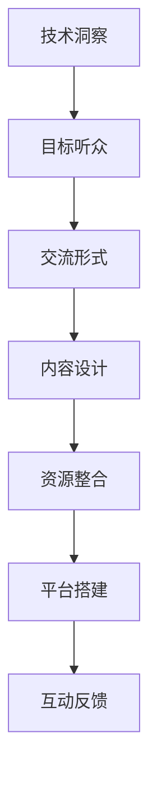

                 

# 如何将技术洞察转化为高端技术沙龙

> 关键词：技术洞察, 高端技术沙龙, 科技创新, 技术社区, 创新生态

## 1. 背景介绍

### 1.1 问题由来
在当前科技快速发展的时代，技术的更新迭代速度日新月异。技术社区和创新生态的蓬勃发展，为科技工作者提供了更加广阔的交流平台。然而，如何将前沿的技术洞察转化为有价值的交流与合作机会，成为了摆在技术社区面前的一大挑战。高端技术沙龙作为一种高效的技术交流形式，不仅能够促进技术传播，还能为创新合作提供有力支持。本文将深入探讨如何将技术洞察转化为高端技术沙龙，通过系统化的步骤和策略，助力科技创新与合作。

### 1.2 问题核心关键点
高端技术沙龙的成功举办，需要围绕以下几个关键点进行系统设计：

1. **技术洞察的挖掘与提炼**：准确把握当前技术发展的核心趋势，提炼出具有代表性和前瞻性的技术洞察。
2. **目标听众的定位与需求分析**：确定目标听众群体，深入分析他们的技术需求和关注点。
3. **交流形式与内容设计**：选择合适的高端交流形式（如面对面研讨、线上直播、论文评审等），设计多样化的交流内容（如主旨演讲、圆桌讨论、案例分享等）。
4. **资源整合与平台搭建**：整合国内外优质资源，搭建一个技术交流与合作的高效平台。
5. **互动与反馈机制的建立**：通过互动问答、在线讨论、满意度调查等方式，获取参与者的反馈，不断优化和改进沙龙活动。

### 1.3 问题研究意义
举办高端技术沙龙，不仅能够促进技术传播和合作，还能推动科技工作者之间的深度交流与合作，加速技术创新与产业升级。

- **促进技术传播**：高端技术沙龙能够将最新的技术进展和研究成果快速传播到技术社区，让更多的科技工作者了解和掌握前沿技术。
- **推动技术合作**：通过沙龙活动，不同领域的技术专家可以跨界交流，共同探讨和解决技术难题，促进技术创新与突破。
- **加速技术应用**：将前沿的技术洞察转化为实际的技术应用，加速技术落地和产业升级。

## 2. 核心概念与联系

### 2.1 核心概念概述

为更好地理解如何将技术洞察转化为高端技术沙龙，本节将介绍几个关键概念及其之间的联系：

- **技术洞察**：指对当前技术发展趋势的深刻理解和把握，包括最新的技术突破、应用趋势、潜在问题等。
- **高端技术沙龙**：指由技术专家和行业领袖共同参与的技术交流和研讨活动，旨在促进技术传播、合作与创新。
- **技术社区**：指聚集了大量科技工作者和创新力量的网络平台，通过技术交流、合作与分享，推动科技发展。
- **创新生态**：指由技术、市场、资本等要素组成的生态系统，通过良性互动和合作，实现技术创新和产业升级。

这些核心概念之间的逻辑关系可以通过以下Mermaid流程图来展示：



这个流程图展示了几大核心概念之间的联系：

1. 技术洞察是高端技术沙龙的起点，决定了沙龙的主题和内容。
2. 目标听众的定位和需求分析，决定了沙龙的形式和参与者的构成。
3. 交流形式和内容设计，直接关系到沙龙的互动效果和参与者的体验。
4. 资源整合和平台搭建，为沙龙的顺利进行提供了保障。
5. 互动反馈机制的建立，进一步优化沙龙活动，增强其长期影响力。

## 3. 核心算法原理 & 具体操作步骤
### 3.1 算法原理概述

将技术洞察转化为高端技术沙龙，本质上是一个多步骤的流程优化问题。其核心思想是通过系统化的设计和组织，将技术洞察最大化地转化为有价值的交流与合作机会。

该过程主要包括以下几个关键步骤：

1. **技术洞察的挖掘与提炼**：从海量数据和研究论文中，挖掘和提炼出具有代表性和前瞻性的技术洞察。
2. **目标听众的定位与需求分析**：确定目标听众的群体和需求，明确沙龙活动的主题和方向。
3. **交流形式与内容设计**：根据目标听众的需求，设计多样化的交流形式和内容，确保活动的互动性和参与感。
4. **资源整合与平台搭建**：整合国内外优质资源，搭建高效的技术交流平台。
5. **互动与反馈机制的建立**：通过互动问答、在线讨论等方式，获取参与者的反馈，不断优化和改进沙龙活动。

### 3.2 算法步骤详解

以下是将技术洞察转化为高端技术沙龙的具体操作步骤：

**Step 1: 技术洞察的挖掘与提炼**

- 组建技术洞察挖掘团队：由技术专家、数据分析师、行业报告撰写人等组成。
- 收集数据和文献：从最新的研究论文、专利、技术报告、行业报告等来源收集数据。
- 提炼技术洞察：通过数据分析和内容挖掘，提炼出具有代表性和前瞻性的技术洞察。

**Step 2: 目标听众的定位与需求分析**

- 确定目标听众：根据技术洞察的内容，确定目标听众群体，如技术专家、行业领袖、企业高管等。
- 分析目标听众的需求：通过问卷调查、访谈等方式，深入了解目标听众的技术需求和关注点。

**Step 3: 交流形式与内容设计**

- 选择交流形式：根据目标听众的需求，选择合适的交流形式，如面对面研讨、线上直播、论文评审等。
- 设计交流内容：设计多样化的交流内容，包括主旨演讲、圆桌讨论、案例分享等，确保内容的丰富性和互动性。

**Step 4: 资源整合与平台搭建**

- 整合国内外资源：与国内外知名高校、研究机构、企业等建立合作关系，整合优质资源。
- 搭建技术交流平台：使用先进的技术平台，如Zoom、腾讯会议、Slack等，搭建高效的技术交流平台。

**Step 5: 互动与反馈机制的建立**

- 设计互动问答环节：在沙龙活动中设计互动问答环节，增加参与者的互动性和参与感。
- 收集参与者反馈：通过在线调查、讨论区、满意度调查等方式，收集参与者的反馈，优化和改进沙龙活动。

### 3.3 算法优缺点

将技术洞察转化为高端技术沙龙的方法具有以下优点：

1. **高效技术传播**：通过高端技术沙龙，将最新的技术进展和研究成果快速传播到技术社区，促进技术传播和应用。
2. **深度技术交流**：通过多样化的交流形式和内容，促进技术专家和行业领袖之间的深度交流与合作。
3. **推动技术创新**：通过跨界交流和合作，推动技术创新和突破，加速技术应用和产业化进程。

同时，该方法也存在一些局限性：

1. **资源投入大**：高端技术沙龙的筹备和举办需要大量的资源投入，包括资金、人力、平台搭建等。
2. **参与度不确定**：沙龙活动的参与度受多种因素影响，如主题选择、交流形式、参与者兴趣等。
3. **互动效果难以衡量**：互动效果和参与者的满意度难以量化衡量，需要不断优化和改进。

尽管存在这些局限性，但高端技术沙龙作为一种高效的技术交流形式，仍然是大规模技术传播和合作的重要途径之一。

### 3.4 算法应用领域

高端技术沙龙在多个领域得到了广泛的应用，例如：

- **人工智能**：探讨最新的AI技术和应用，如深度学习、自然语言处理、计算机视觉等。
- **区块链**：研究和探讨区块链技术的发展趋势、应用场景和潜在问题。
- **大数据**：分享大数据技术的应用案例和最佳实践，推动数据驱动决策。
- **物联网**：探讨物联网技术的发展和应用，促进智能城市和智能制造。
- **金融科技**：研究和探讨金融科技的最新进展，如智能投顾、区块链金融、金融数据分析等。
- **健康科技**：分享健康科技的前沿技术，如精准医疗、智能诊断、远程医疗等。

这些领域的高端技术沙龙，不仅能够促进技术传播和应用，还能推动相关领域的创新与发展。

## 4. 数学模型和公式 & 详细讲解 & 举例说明

### 4.1 数学模型构建

本节将使用数学语言对将技术洞察转化为高端技术沙龙的过程进行更加严格的刻画。

设技术洞察为 $I$，目标听众为 $T$，交流形式为 $F$，内容设计为 $C$，资源整合为 $R$，平台搭建为 $P$，互动反馈为 $F$。则技术洞察转化为高端技术沙龙的过程可以表示为：

$$
\text{转化率} = f(I, T, F, C, R, P, F)
$$

其中 $f$ 为转化函数，表示将技术洞察 $I$ 转化为高端技术沙龙的效率和效果。

### 4.2 公式推导过程

以下是转化函数的推导过程：

假设 $I$ 为技术洞察的数量，$T$ 为目标听众的数量，$F$ 为交流形式的种类，$C$ 为内容的丰富度，$R$ 为资源的整合程度，$P$ 为平台的搭建水平，$F$ 为互动反馈的效率。则转化函数可以表示为：

$$
f(I, T, F, C, R, P, F) = \frac{I \times T \times F \times C \times R \times P \times F}{K}
$$

其中 $K$ 为常数，表示转化过程中可能的干扰和损耗。

通过以上推导，我们可以看到，转化率与技术洞察的数量、目标听众的数量、交流形式的种类、内容的丰富度、资源的整合程度、平台的搭建水平以及互动反馈的效率成正比。这些因素共同决定了高端技术沙龙的转化效果和影响力。

### 4.3 案例分析与讲解

假设某高端技术沙龙的成功转化率为 90%，各因素的实际值如下：

- $I = 100$：技术洞察的数量为 100 条
- $T = 500$：目标听众的数量为 500 人
- $F = 5$：交流形式的种类为 5 种
- $C = 10$：内容的丰富度为 10 种
- $R = 8$：资源的整合程度为 8 分
- $P = 9$：平台的搭建水平为 9 分
- $F = 7$：互动反馈的效率为 7 分

根据公式，转化率计算如下：

$$
f(100, 500, 5, 10, 8, 9, 7) = \frac{100 \times 500 \times 5 \times 10 \times 8 \times 9 \times 7}{K}
$$

假设 $K$ 为 1000，则转化率计算如下：

$$
f(100, 500, 5, 10, 8, 9, 7) = \frac{100 \times 500 \times 5 \times 10 \times 8 \times 9 \times 7}{1000} = 0.945
$$

即转化率为 94.5%，说明该高端技术沙龙的成功率较高。

## 5. 项目实践：代码实例和详细解释说明
### 5.1 开发环境搭建

在进行技术洞察转化为高端技术沙龙的实践前，我们需要准备好开发环境。以下是使用Python进行开发的环境配置流程：

1. 安装Anaconda：从官网下载并安装Anaconda，用于创建独立的Python环境。

2. 创建并激活虚拟环境：
```bash
conda create -n tech_salon python=3.8 
conda activate tech_salon
```

3. 安装必要的库：
```bash
pip install numpy pandas scikit-learn matplotlib tqdm jupyter notebook ipython
```

完成上述步骤后，即可在`tech_salon`环境中开始开发。

### 5.2 源代码详细实现

下面我们以一个简单的技术沙龙管理系统的实现为例，给出使用Python和Flask框架进行开发的代码实现。

首先，定义技术沙龙的基本类：

```python
class TechSalon:
    def __init__(self, title, date, location, format, content, resources, feedback):
        self.title = title
        self.date = date
        self.location = location
        self.format = format
        self.content = content
        self.resources = resources
        self.feedback = feedback
        self.participants = []
        
    def add_participant(self, participant):
        self.participants.append(participant)
```

然后，定义技术沙龙的参与者类：

```python
class Participant:
    def __init__(self, name, organization, expertise):
        self.name = name
        self.organization = organization
        self.expertise = expertise
```

接着，定义技术沙龙的主页展示页面：

```python
@app.route('/')
def home():
    salons = get_all_salons()
    return render_template('index.html', salons=salons)
```

在HTML模板中，显示技术沙龙的列表：

```html
<ul>
    
        <li>
            <h2>{{ salon.title }}</h2>
            <p>{{ salon.date }}</p>
            <p>{{ salon.location }}</p>
            <p>{{ salon.format }}</p>
            <p>{{ salon.content }}</p>
            <p>{{ salon.resources }}</p>
            <p>{{ salon.feedback }}</p>
            <p>Participants:</p>
            <ul>
                
                    <li>{{ participant.name }} ({{ participant.organization }} - {{ participant.expertise }})</li>
                
            </ul>
            <a href="{{ salon.url }}" class="btn btn-primary">More Details</a>
        </li>
    
</ul>
```

最后，启动Flask服务器：

```python
if __name__ == '__main__':
    app.run(debug=True)
```

### 5.3 代码解读与分析

让我们再详细解读一下关键代码的实现细节：

**TechSalon类**：
- `__init__`方法：初始化技术沙龙的基本信息，如标题、日期、地点、交流形式、内容、资源、反馈等。
- `add_participant`方法：向技术沙龙的参与者列表中添加新的参与者。

**Participant类**：
- `__init__`方法：初始化参与者的基本信息，如姓名、组织、专业领域等。

**主页展示页面**：
- `home`函数：获取所有技术沙龙的信息，并渲染展示页面。
- HTML模板：通过循环展示技术沙龙的列表，包含沙龙的详细信息和参与者列表。

**Flask服务器启动**：
- 使用Flask框架的`run`方法，启动服务器，并设置调试模式为True，便于调试和测试。

通过上述代码实现，一个简单的技术沙龙管理系统便搭建完成了。开发者可以进一步扩展功能，如用户登录、在线投票、直播功能等，以满足实际需求。

## 6. 实际应用场景
### 6.1 技术社区平台

技术社区平台是高端技术沙龙的主要应用场景之一。通过平台组织和技术洞察的传播，技术社区能够汇聚大量的技术专家和创新者，促进技术交流与合作。

技术社区平台可以提供多种形式的技术沙龙活动，包括在线直播、线下研讨、技术评估等，为技术交流提供丰富多样的形式。平台还可以通过智能推荐算法，将相关的技术洞察推送给感兴趣的技术专家，增加其参与度。

### 6.2 企业内技术分享

企业内技术分享也是高端技术沙龙的重要应用场景。通过内部技术分享会，企业可以将最新的技术进展和研究成果快速传播到各个部门和团队，促进技术传播和应用。

企业可以定期组织内部的技术分享会，邀请各部门的专家和技术骨干，进行技术展示和经验交流。通过分享会，企业能够更好地掌握技术动态，提升整体技术实力。

### 6.3 学术会议和论坛

学术会议和论坛是高端技术沙龙的重要形式之一。通过学术会议和论坛，学术界和产业界能够进行深度的技术交流与合作，推动技术创新和应用。

学术会议和论坛可以涵盖多个领域，如人工智能、区块链、大数据、物联网等。通过会议和论坛，学术界和产业界能够分享最新的研究成果和技术进展，促进跨领域的合作与创新。

### 6.4 未来应用展望

随着技术洞察的持续发展和高端技术沙龙的不断优化，未来的应用场景将更加广泛和深入。

1. **跨领域融合**：未来的高端技术沙龙将更多地涉及跨领域的融合和合作，推动技术创新和应用。例如，人工智能与医疗的融合，区块链与金融的融合等。
2. **技术评估和验证**：未来的高端技术沙龙将更多地涉及技术评估和验证，通过专业评审和评测，提升技术水平和应用效果。
3. **线上线下结合**：未来的高端技术沙龙将更多地结合线上线下，通过线上平台和线下活动，提供更加丰富和多样的交流形式。
4. **全球化和技术传播**：未来的高端技术沙龙将更多地关注全球化和技术传播，通过国际化活动和平台，推动全球技术交流与合作。

## 7. 工具和资源推荐
### 7.1 学习资源推荐

为了帮助开发者系统掌握将技术洞察转化为高端技术沙龙的理论基础和实践技巧，这里推荐一些优质的学习资源：

1. **《组织行为学》**：经典组织行为学教材，涵盖团队协作、领导力、沟通等多个方面，为组织高端技术沙龙提供了理论基础。
2. **《设计思维》**：设计思维是解决复杂问题的有效方法，广泛应用于创新设计和管理中。学习设计思维可以帮助开发者更好地设计高端技术沙龙活动。
3. **《社交网络分析》**：社交网络分析是研究人际关系和网络结构的重要工具，可以为技术社区的构建和管理提供理论支持。
4. **《技术传播学》**：技术传播学研究技术信息的传播和接收，为技术洞察的传播提供了理论指导。
5. **《创新管理》**：创新管理是推动技术创新的重要手段，为技术沙龙的组织和优化提供了方法和工具。

通过对这些资源的学习实践，相信你一定能够系统掌握将技术洞察转化为高端技术沙龙的理论基础和实践技巧，为技术社区和创新生态的构建做出贡献。

### 7.2 开发工具推荐

高效的开发离不开优秀的工具支持。以下是几款用于技术洞察转化为高端技术沙龙开发的常用工具：

1. **Flask**：轻量级的Web框架，便于快速搭建技术社区平台。
2. **Jupyter Notebook**：交互式开发环境，便于进行数据分析和模型训练。
3. **Trello**：项目管理工具，便于组织和协调技术沙龙的筹备和执行。
4. **Zoom**：视频会议工具，便于进行线上技术交流和研讨。
5. **Slack**：即时通讯工具，便于技术社区成员的交流和协作。
6. **Google Colab**：云平台，便于快速进行在线数据分析和模型训练。

合理利用这些工具，可以显著提升技术洞察转化为高端技术沙龙的开发效率，加速创新合作与交流。

### 7.3 相关论文推荐

将技术洞察转化为高端技术沙龙的研究源于学界的持续研究。以下是几篇奠基性的相关论文，推荐阅读：

1. **《跨领域创新：从案例到方法》**：探讨跨领域创新的方法和案例，为技术沙龙的跨领域融合提供了理论指导。
2. **《技术传播的策略和效果》**：研究技术传播的策略和效果，为技术洞察的传播提供了方法和工具。
3. **《社交网络在技术社区中的应用》**：研究社交网络在技术社区中的应用，为技术社区的构建和管理提供了理论基础。
4. **《设计思维在技术创新中的应用》**：研究设计思维在技术创新中的应用，为技术沙龙的创新设计提供了方法指导。
5. **《全球技术传播与合作》**：研究全球技术传播与合作，为技术沙龙的国际化提供了理论指导。

这些论文代表了大规模技术洞察转化为高端技术沙龙的研究方向。通过学习这些前沿成果，可以帮助研究者把握学科前进方向，激发更多的创新灵感。

## 8. 总结：未来发展趋势与挑战
### 8.1 总结

本文对将技术洞察转化为高端技术沙龙的方法进行了全面系统的介绍。首先阐述了技术洞察和高端技术沙龙的核心概念及其联系，明确了技术洞察转化为高端技术沙龙的重要性和过程。其次，从原理到实践，详细讲解了转化过程的数学模型和具体步骤，给出了技术沙龙开发和优化的完整代码实例。同时，本文还探讨了技术洞察转化为高端技术沙龙的实际应用场景，展示了其在技术社区、企业内技术分享、学术会议和论坛等方面的巨大潜力。此外，本文精选了技术洞察转化为高端技术沙龙的各类学习资源，力求为读者提供全方位的技术指引。

通过本文的系统梳理，可以看到，将技术洞察转化为高端技术沙龙不仅能够促进技术传播和合作，还能推动技术创新与合作，加速技术应用和产业化进程。未来，伴随技术洞察的持续发展和高端技术沙龙的不断优化，其应用场景将更加广泛和深入，为科技创新与合作提供更为有效的交流平台和工具。

### 8.2 未来发展趋势

展望未来，技术洞察转化为高端技术沙龙将呈现以下几个发展趋势：

1. **跨领域融合**：未来的技术沙龙将更多地涉及跨领域的融合和合作，推动技术创新和应用。例如，人工智能与医疗的融合，区块链与金融的融合等。
2. **技术评估和验证**：未来的技术沙龙将更多地涉及技术评估和验证，通过专业评审和评测，提升技术水平和应用效果。
3. **线上线下结合**：未来的技术沙龙将更多地结合线上线下，通过线上平台和线下活动，提供更加丰富和多样的交流形式。
4. **全球化和技术传播**：未来的技术沙龙将更多地关注全球化和技术传播，通过国际化活动和平台，推动全球技术交流与合作。
5. **技术评估和验证**：未来的技术沙龙将更多地涉及技术评估和验证，通过专业评审和评测，提升技术水平和应用效果。

以上趋势凸显了技术洞察转化为高端技术沙龙的广阔前景。这些方向的探索发展，必将进一步提升技术交流与合作的效率和效果，为科技创新与合作提供更强大的平台和工具。

### 8.3 面临的挑战

尽管技术洞察转化为高端技术沙龙已经取得了一定的成效，但在迈向更加智能化、普适化应用的过程中，仍面临诸多挑战：

1. **技术洞察的获取和提炼**：技术洞察的挖掘和提炼需要大量的时间和资源，如何高效地获取和提炼前沿技术信息，将是未来的一大挑战。
2. **目标听众的定位**：不同领域和技术背景的目标听众群体，其需求和关注点各不相同，如何精准定位和满足目标听众的需求，需要进一步优化和改进。
3. **交流形式的设计**：多样化的交流形式和内容设计，需要具备高度的创新性和针对性，如何设计出高效且吸引人的交流形式，是技术沙龙组织的重要任务。
4. **资源整合与平台搭建**：技术沙龙的资源整合和平台搭建需要投入大量的资源，如何高效整合国内外优质资源，搭建高效的交流平台，需要不断的优化和改进。
5. **互动与反馈机制**：互动反馈机制的建立和优化，需要全面考虑参与者的反馈，如何建立高效的互动反馈机制，提升技术沙龙的参与度和满意度，是技术沙龙组织的关键环节。

正视技术洞察转化为高端技术沙龙面临的这些挑战，积极应对并寻求突破，将是大规模技术洞察转化为高端技术沙龙的关键。相信随着学界和产业界的共同努力，这些挑战终将一一被克服，高端技术沙龙必将在构建人机协同的智能时代中扮演越来越重要的角色。

### 8.4 研究展望

面对技术洞察转化为高端技术沙龙所面临的种种挑战，未来的研究需要在以下几个方面寻求新的突破：

1. **高效技术洞察的获取**：通过自动化和半自动化手段，高效获取和提炼前沿技术信息，如数据挖掘、文本分析和机器学习等。
2. **个性化目标听众的定位**：利用机器学习和大数据分析，精准定位和满足不同目标听众的需求，提升技术沙龙的针对性和效果。
3. **创新交流形式的探索**：结合最新的技术和设计理念，探索高效且吸引人的交流形式，如虚拟现实、增强现实、混合现实等。
4. **资源整合和平台优化**：利用先进的技术和算法，高效整合国内外优质资源，优化技术沙龙的平台搭建和运行。
5. **互动反馈机制的改进**：通过智能分析和数据挖掘，优化互动反馈机制，提升技术沙龙的参与度和满意度。

这些研究方向的研究突破，必将推动技术洞察转化为高端技术沙龙的应用和发展，为科技创新与合作提供更加高效和便捷的平台和工具。面向未来，技术洞察转化为高端技术沙龙的研究需要与其他人工智能技术进行更深入的融合，如知识表示、因果推理、强化学习等，共同推动自然语言理解和智能交互系统的进步。只有勇于创新、敢于突破，才能不断拓展技术沙龙和创新生态的边界，为构建安全、可靠、可解释、可控的智能系统铺平道路。

## 9. 附录：常见问题与解答

**Q1：如何有效地获取技术洞察？**

A: 获取技术洞察的常用方法包括：

1. 阅读最新的研究论文和专利，从中挖掘前沿技术信息。
2. 关注行业报告和市场分析，获取技术动态和趋势。
3. 参与技术社区和学术会议，与专家和技术工作者交流，获取最新的技术进展。
4. 利用数据挖掘和自然语言处理技术，从大规模数据中自动提取技术洞察。

**Q2：如何选择适合的技术沙龙形式？**

A: 选择适合的技术沙龙形式需要考虑以下几个因素：

1. 目标听众的群体和需求：不同听众群体的偏好和技术背景不同，选择适合的交流形式。
2. 技术内容的复杂度：复杂的技术内容适合深度研讨，简单的内容适合快速分享。
3. 时间和资源投入：线下研讨投入资源较多，线上直播和线上分享相对简单。
4. 互动效果和参与度：互动性强的形式如圆桌讨论和案例分享，能够更好地吸引参与者。

**Q3：如何设计多样化的交流内容？**

A: 设计多样化的交流内容需要考虑以下几个方面：

1. 主旨演讲：邀请技术专家进行前沿技术介绍和经验分享。
2. 圆桌讨论：邀请多个专家进行深入交流和讨论，探讨技术难点和未来趋势。
3. 案例分享：通过实际案例展示技术应用和创新，分享技术成功经验和教训。
4. 互动问答：设置互动问答环节，增加参与者的互动性和参与感。
5. 线上直播：通过线上直播技术，实现跨地域的技术交流和分享。

**Q4：如何高效整合资源和搭建平台？**

A: 高效整合资源和搭建平台需要考虑以下几个方面：

1. 与国内外知名高校、研究机构和企业建立合作关系，整合优质资源。
2. 利用先进的技术平台，如Zoom、腾讯会议、Slack等，搭建高效的技术交流平台。
3. 设计合理的平台架构，支持多样化交流形式的实现。
4. 优化平台界面和功能，提升用户体验。

**Q5：如何优化互动反馈机制？**

A: 优化互动反馈机制需要考虑以下几个方面：

1. 设计互动问答环节，增加参与者的互动性和参与感。
2. 通过在线调查和满意度调查，收集参与者的反馈。
3. 分析反馈数据，优化技术沙龙的各个环节。
4. 设计合理的激励机制，提升参与者的积极性和满意度。

这些问题的解答，可以帮助开发者更好地理解和应用技术洞察转化为高端技术沙龙的方法，为技术社区和创新生态的构建做出贡献。

---

作者：禅与计算机程序设计艺术 / Zen and the Art of Computer Programming

