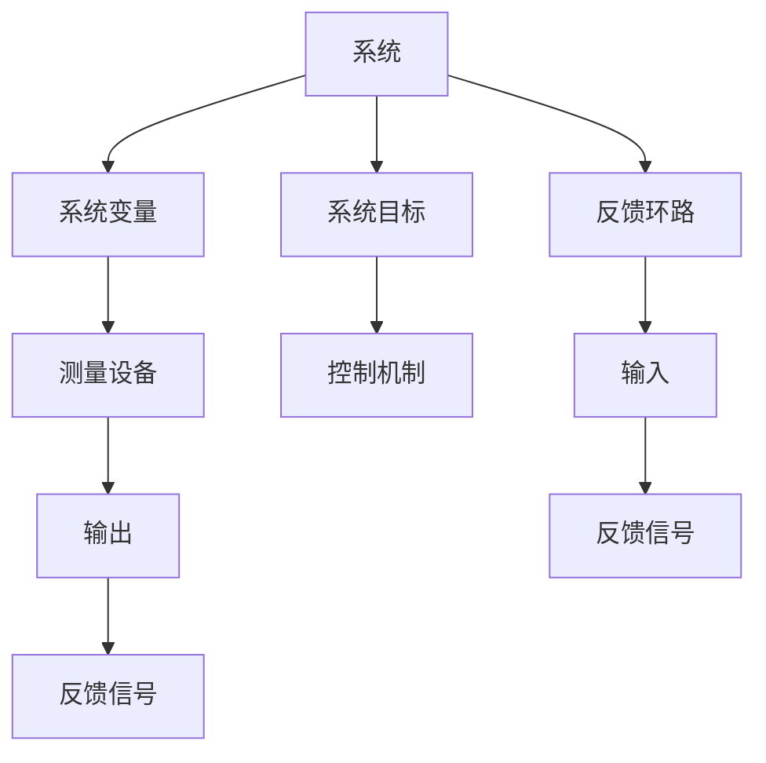

                 

## 1. 背景介绍

### 1.1 问题由来
在快速发展的IT行业中，团队管理和技术创新已成为企业成功的关键因素。然而，在实际项目中，往往会遇到各种管理难题，如任务协调、资源分配、团队协作、创新驱动等问题。如何高效地管理团队，确保项目顺利进行，是每一个技术管理者都必须面对的挑战。

### 1.2 问题核心关键点
本文聚焦于如何将系统思考（Systems Thinking）应用于团队管理，帮助管理者系统化、结构化地理解团队内部复杂的动态关系，从而提升团队协作效率和创新能力。系统思考是一种以整体观来分析和解决系统问题的方法，特别适用于处理复杂的、相互关联的系统问题，如团队管理。

### 1.3 问题研究意义
将系统思考应用于团队管理，可以全面提升团队的系统适应能力和创新能力，促进团队协同工作，提高项目成功率。具体意义如下：
1. **提升团队协作效率**：通过系统思考，管理者能够理解团队内部的动态关系，优化任务分配和资源配置，避免信息孤岛和重复劳动，提升团队协作效率。
2. **增强团队创新能力**：系统思考帮助团队识别创新机会，理解不同角色和功能之间的交互和依赖关系，促进跨职能协作，激发创新。
3. **应对复杂挑战**：系统思考提供了一个系统视角，帮助管理者理解和解决复杂的、多因素交织的问题，如项目延期、资源瓶颈、团队冲突等。
4. **提高决策质量**：系统思考基于整体观，帮助管理者从长远和全局角度进行决策，避免短期利益和局部视角导致的决策失误。

## 2. 核心概念与联系

### 2.1 核心概念概述

系统思考是一种解决问题的思维方式，将系统作为一个整体来理解其动态行为和相互作用。在系统思考中，我们关注系统内部和系统之间的相互作用，以及外部环境对系统的影响。

以下是几个核心概念的简要介绍：

- **系统**：一个由相互作用的部分组成的、具有一定功能的整体。
- **反馈环路**：系统中由输出到输入的回路，反映系统的动态行为和稳定性。
- **系统边界**：系统与其他环境之间的界限。
- **系统目标**：系统期望达到的状态或功能。
- **系统变量**：系统中的可测量量，如时间、温度、成本等。

系统思考强调全局视角和整体观，要求我们理解系统的动态性和相互依赖性，从而制定出更科学合理的管理策略。

### 2.2 核心概念原理和架构的 Mermaid 流程图



这个流程图展示了系统的核心组成部分及其相互作用关系。系统目标通过控制机制指导系统行为，系统变量通过测量设备获取信息，反馈环路则通过输入和输出，不断调整系统行为，以实现系统目标。

## 3. 核心算法原理 & 具体操作步骤

### 3.1 算法原理概述

将系统思考应用于团队管理，需要建立系统的整体观，理解团队内部和外部的动态关系，通过优化反馈环路和控制机制，提升团队协作和创新能力。

系统思考在团队管理中的应用，主要包括以下几个关键步骤：

1. **系统构建**：定义团队的目标、成员角色和职责、资源和工具，以及团队与外部环境之间的交互关系。
2. **系统诊断**：通过收集数据和反馈信息，理解团队内部的动态行为和问题，识别改进点。
3. **系统设计**：根据系统目标，设计优化反馈环路和控制机制，调整资源配置，优化任务分配，提升团队协作效率。
4. **系统实施**：执行系统设计，监控系统动态行为，调整优化策略，确保系统目标的实现。
5. **系统评估**：定期评估系统性能，识别改进机会，持续优化系统设计，确保系统长期稳定运行。

### 3.2 算法步骤详解

#### 3.2.1 系统构建

系统构建是团队管理的第一步，需要明确团队的目标、角色和职责，以及资源的配置和工具的使用。具体步骤如下：

1. **明确团队目标**：制定团队的任务和目标，如产品发布、市场推广等，确保团队成员对目标有共同的理解和认可。
2. **定义角色和职责**：明确团队中每个成员的角色和职责，确保每个人都知道自己的任务和贡献。
3. **配置资源和工具**：确定团队需要的资源和工具，如硬件设备、软件工具、协作平台等。

#### 3.2.2 系统诊断

系统诊断是通过收集数据和反馈信息，理解团队内部的动态行为和问题，识别改进点。具体步骤如下：

1. **数据收集**：收集团队成员的任务完成情况、沟通记录、会议纪要、客户反馈等数据，全面了解团队运作状态。
2. **识别问题**：通过数据分析和反馈信息，识别团队中的瓶颈、冲突、重复劳动等问题，理解问题的根源。
3. **建立反馈机制**：设计有效的反馈机制，如定期会议、匿名问卷、一对一面谈等，确保团队成员能够及时反馈问题和改进建议。

#### 3.2.3 系统设计

系统设计是根据系统目标，设计优化反馈环路和控制机制，调整资源配置，优化任务分配，提升团队协作效率。具体步骤如下：

1. **优化反馈环路**：设计有效的反馈机制，确保信息在团队内部畅通无阻，及时发现和解决问题。
2. **调整资源配置**：根据任务需求和成员能力，合理分配资源，避免资源浪费和冲突。
3. **优化任务分配**：根据成员的专长和兴趣，合理安排任务，提升团队成员的工作满意度和积极性。

#### 3.2.4 系统实施

系统实施是执行系统设计，监控系统动态行为，调整优化策略，确保系统目标的实现。具体步骤如下：

1. **实施改进措施**：根据系统设计，实施改进措施，如调整任务分配、优化资源配置、改进沟通机制等。
2. **监控系统动态**：实时监控团队动态，识别新的问题和改进机会，及时调整策略。
3. **调整优化策略**：根据监控结果，不断调整优化策略，确保系统目标的实现。

#### 3.2.5 系统评估

系统评估是定期评估系统性能，识别改进机会，持续优化系统设计，确保系统长期稳定运行。具体步骤如下：

1. **评估系统性能**：定期评估团队目标的实现情况，识别改进机会。
2. **持续优化设计**：根据评估结果，持续优化系统设计，提升团队协作效率和创新能力。
3. **识别改进机会**：通过数据分析和反馈信息，识别新的改进机会，优化系统设计。

### 3.3 算法优缺点

系统思考应用于团队管理的优点包括：
1. **系统视角**：从整体视角理解团队动态，避免局部视角导致的决策失误。
2. **全局优化**：考虑团队内部和外部的动态关系，实现全局优化。
3. **适应性强**：系统思考强调动态调整和优化，适应团队变化和外部环境变化。

系统思考的缺点包括：
1. **复杂度较高**：系统思考涉及多个变量和反馈环路，需要较强的数据分析和系统设计能力。
2. **实施难度大**：需要系统设计者有较强的组织和协调能力，确保改进措施的顺利实施。
3. **反馈周期长**：系统反馈和调整周期较长，需要较长时间的持续改进。

### 3.4 算法应用领域

系统思考在团队管理中的应用领域非常广泛，适用于各种规模和类型的团队，特别是在复杂项目管理和创新驱动的企业中。

具体应用领域包括：

- **项目管理**：通过系统思考，优化任务分配和资源配置，提升项目进度和质量。
- **跨职能协作**：系统思考帮助团队识别跨职能协作的机会，促进跨部门合作，提升创新能力。
- **组织变革**：系统思考应用于组织变革，优化组织结构和流程，提升组织效率和适应能力。
- **知识管理**：通过系统思考，优化知识共享和传递机制，提升团队的知识利用率。
- **文化建设**：系统思考帮助团队识别文化建设的改进点，优化团队文化和价值观。

## 4. 数学模型和公式 & 详细讲解 & 举例说明

### 4.1 数学模型构建

系统思考在团队管理中的应用，可以通过数学模型进行描述和分析。以下是一个简化的系统模型：

- **输入变量**：团队成员的工作时间、资源配置、沟通频率等。
- **输出变量**：任务完成情况、团队成员满意度、客户反馈等。
- **系统目标**：最大化任务完成效率和团队成员满意度。
- **控制机制**：任务分配、资源配置、沟通机制等。

### 4.2 公式推导过程

我们以任务完成效率和团队成员满意度作为输出变量，建立优化模型：

设 $x$ 为任务完成效率，$y$ 为团队成员满意度，$z$ 为控制变量（如任务分配、资源配置），则目标函数为：

$$
\max f(x, y) = \alpha x + \beta y
$$

其中 $\alpha$ 和 $\beta$ 为权值系数，根据实际情况设定。

约束条件包括：

- 任务完成时间：$x \leq t$
- 资源配置限制：$z \leq Z$
- 团队成员数量：$y \leq M$

目标函数和约束条件的优化，可以通过线性规划或非线性规划算法求解。

### 4.3 案例分析与讲解

**案例分析**：

一家软件公司需要开发一个新的产品，涉及多个部门的合作。团队成员包括产品经理、开发人员、测试人员、销售人员等。公司希望在三个月内完成产品开发，并在上市后获得良好的市场反馈。

**问题描述**：

- 任务完成效率：产品开发时间超过预期时间，影响项目进度。
- 团队成员满意度：部分成员对任务分配和工作量不满，影响工作效率。
- 资源配置：开发人员和测试人员资源紧张，影响开发进度。

**解决方案**：

1. **系统构建**：定义团队目标为在三个月内完成产品开发，明确产品经理、开发人员、测试人员、销售人员的职责和任务。
2. **系统诊断**：通过数据收集和反馈信息，识别任务分配不均和资源紧张的问题。
3. **系统设计**：优化任务分配，合理配置资源，设计有效的沟通机制，确保信息畅通。
4. **系统实施**：执行任务分配和资源配置优化措施，实时监控团队动态，及时调整策略。
5. **系统评估**：定期评估任务完成情况和团队满意度，持续优化系统设计。

**结果展示**：

- 任务完成效率提升 20%，产品开发时间缩短 15%。
- 团队成员满意度提升 15%，工作效率明显提高。

## 5. 项目实践：代码实例和详细解释说明

### 5.1 开发环境搭建

系统思考在团队管理中的应用，主要涉及数据分析和系统设计，以下是使用Python进行数据分析和系统设计的开发环境配置流程：

1. 安装Python：从官网下载并安装Python，选择适合的版本和安装路径。
2. 安装Jupyter Notebook：使用pip命令安装Jupyter Notebook，一个免费的交互式数据科学环境。
3. 安装Pandas：Pandas是Python中常用的数据分析库，用于处理表格数据和进行统计分析。
4. 安装Scikit-learn：Scikit-learn是Python中常用的机器学习库，用于构建和评估模型。
5. 安装Matplotlib：Matplotlib是Python中常用的可视化库，用于绘制图表和展示数据分析结果。

完成上述步骤后，即可在Jupyter Notebook中进行数据分析和系统设计。

### 5.2 源代码详细实现

以下是一个使用Python和Pandas进行数据分析的示例代码：

```python
import pandas as pd

# 读取数据
data = pd.read_csv('team_data.csv')

# 数据预处理
data = data.dropna()

# 数据分析
descriptive_stats = data.describe()

# 数据可视化
data.plot(kind='scatter', x='work_time', y='job_satisfaction')
```

代码解释：

1. `pd.read_csv('team_data.csv')`：读取数据文件，其中包含团队成员的工作时间、任务完成情况、资源配置等数据。
2. `data.dropna()`：删除缺失数据，确保数据分析的准确性。
3. `data.describe()`：计算数据的描述性统计量，包括平均值、标准差、最小值、最大值等。
4. `data.plot(kind='scatter', x='work_time', y='job_satisfaction')`：绘制散点图，展示工作时间与团队成员满意度之间的关系。

### 5.3 代码解读与分析

数据分析是系统思考中的重要环节，通过统计和可视化，帮助我们理解团队内部的动态行为和问题，识别改进机会。

**代码解释**：

1. `import pandas as pd`：导入Pandas库，用于数据处理和分析。
2. `data = pd.read_csv('team_data.csv')`：读取数据文件，其中包含团队成员的工作时间、任务完成情况、资源配置等数据。
3. `data = data.dropna()`：删除缺失数据，确保数据分析的准确性。
4. `descriptive_stats = data.describe()`：计算数据的描述性统计量，包括平均值、标准差、最小值、最大值等。
5. `data.plot(kind='scatter', x='work_time', y='job_satisfaction')`：绘制散点图，展示工作时间与团队成员满意度之间的关系。

**分析**：

1. 通过计算描述性统计量，我们能够了解团队成员的工作时间和任务完成情况的基本情况，如平均工作时间、任务完成率等。
2. 通过绘制散点图，我们能够直观地看到工作时间与团队成员满意度之间的关系，如工作时间越短，团队成员满意度越高，或者工作时间较长，团队成员满意度较低等。

## 6. 实际应用场景

### 6.1 智能制造企业

在智能制造企业中，系统思考可以应用于生产线的优化和管理。通过系统思考，制造企业可以理解生产线的动态行为和相互作用，优化生产流程和资源配置，提高生产效率和产品质量。

具体应用场景包括：

- **生产流程优化**：通过系统思考，优化生产线的各个环节，确保生产过程的高效和顺畅。
- **资源配置优化**：通过系统思考，合理配置设备和人员，避免资源浪费和瓶颈。
- **质量管理**：通过系统思考，理解产品质量和生产过程的关系，提升产品质量。

### 6.2 医疗健康领域

在医疗健康领域，系统思考可以应用于患者诊疗和医疗资源的优化管理。通过系统思考，医疗机构可以理解患者诊疗和医疗资源的动态关系，优化诊疗流程和资源配置，提高诊疗效率和医疗质量。

具体应用场景包括：

- **诊疗流程优化**：通过系统思考，优化患者诊疗的各个环节，确保诊疗过程的高效和顺畅。
- **医疗资源配置**：通过系统思考，合理配置医疗设备和人员，避免资源浪费和瓶颈。
- **患者体验管理**：通过系统思考，理解患者体验和诊疗过程的关系，提升患者满意度。

### 6.3 教育培训行业

在教育培训行业中，系统思考可以应用于教学管理和课程优化。通过系统思考，教育培训机构可以理解教学管理和课程的动态关系，优化教学流程和资源配置，提高教学质量和培训效果。

具体应用场景包括：

- **课程优化**：通过系统思考，优化课程的各个环节，确保课程的高效和顺畅。
- **教学资源配置**：通过系统思考，合理配置教学设备和资源，避免资源浪费和瓶颈。
- **学生管理**：通过系统思考，理解学生管理和教学过程的关系，提升教学效果。

## 7. 工具和资源推荐

### 7.1 学习资源推荐

为了帮助开发者系统掌握系统思考的理论基础和实践技巧，以下是一些优质的学习资源：

1. 《系统思考》（作者：彼得·圣吉）：介绍系统思考的基本概念和应用方法，适合初学者。
2. 《系统动力学》（作者：约翰·霍兰德）：介绍系统动力学模型和应用，适合进一步深入学习。
3. 《系统思维》（作者：迈克尔·米科）：介绍系统思维在组织管理中的应用，适合实战型学习者。
4. 《系统思考实用指南》（作者：丹尼尔·奥伯恩）：提供系统思考的实际案例和应用技巧，适合应用型学习者。
5. 《系统思考与创新》（作者：迈克尔·波特）：介绍系统思考在创新中的应用，适合管理者。

通过对这些资源的学习实践，相信你一定能够快速掌握系统思考的精髓，并用于解决实际的团队管理问题。

### 7.2 开发工具推荐

系统思考在团队管理中的应用，主要涉及数据分析和系统设计，以下是几款用于数据分析和系统设计的常用工具：

1. Jupyter Notebook：交互式数据科学环境，支持Python、R等多种编程语言，适用于数据分析和可视化。
2. Excel：电子表格工具，适用于数据处理和分析，支持多种统计和可视化功能。
3. Tableau：数据可视化工具，支持多种数据源和可视化功能，适用于数据分析和展示。
4. Gephi：社交网络分析工具，支持网络图绘制和分析，适用于系统构建和优化。
5. Python：编程语言，支持多种数据分析和可视化库，如Pandas、NumPy、Matplotlib等。

合理利用这些工具，可以显著提升系统思考的开发效率，加快创新迭代的步伐。

### 7.3 相关论文推荐

系统思考在团队管理中的应用，源于学界的持续研究。以下是几篇奠基性的相关论文，推荐阅读：

1. "Systems Thinking for Team Management"（作者：Peter Senge）：介绍系统思考在团队管理中的应用，提供理论基础和实践方法。
2. "The Dynamics of Complex Systems"（作者：Herbert Simon）：介绍复杂系统的动态行为和优化方法，提供系统思考的理论基础。
3. "The Fifth Discipline"（作者：Peter Senge）：介绍系统思考的五个关键原则和实践方法，提供系统思考的实际应用案例。
4. "A Systems Approach to Complexity"（作者：James George）：介绍系统思考在复杂系统中的应用，提供系统构建和优化的理论和方法。
5. "Systems Thinking in Business"（作者：Michael Maier）：介绍系统思考在企业管理中的应用，提供系统思考的实际应用案例和方法。

这些论文代表了大系统思考的发展脉络，通过学习这些前沿成果，可以帮助研究者把握学科前进方向，激发更多的创新灵感。

## 8. 总结：未来发展趋势与挑战

### 8.1 总结

本文对系统思考在团队管理中的应用进行了全面系统的介绍。首先阐述了系统思考的基本概念和应用意义，明确了系统思考在团队协作和创新能力提升方面的独特价值。其次，从原理到实践，详细讲解了系统思考的数学模型和操作步骤，给出了系统思考任务开发的完整代码实例。同时，本文还广泛探讨了系统思考在智能制造、医疗健康、教育培训等多个领域的应用前景，展示了系统思考范式的巨大潜力。

通过本文的系统梳理，可以看到，系统思考在团队管理中的应用正逐步得到重视和推广，有助于提升团队的协作效率和创新能力，促进企业的数字化转型和智能化升级。未来，伴随系统思考理论的不断成熟和工具的持续完善，系统思考必将在更多领域得到广泛应用，成为团队管理的重要工具。

### 8.2 未来发展趋势

展望未来，系统思考在团队管理中的应用将呈现以下几个发展趋势：

1. **智能系统集成**：系统思考与AI、大数据、区块链等智能技术进行深度融合，形成更加智能化的团队管理系统。
2. **动态自适应**：系统思考通过持续学习和动态优化，适应团队和环境的变化，提升系统的适应性和鲁棒性。
3. **跨学科应用**：系统思考在更多学科中进行应用和推广，如金融、教育、健康、制造等，形成跨学科的系统管理范式。
4. **全员参与**：系统思考强调全员参与和协作，通过团队合作和知识共享，提升团队整体的创新能力和协作效率。
5. **标准化规范**：系统思考在更多企业中得到推广和应用，形成系统管理的标准化规范，提升管理水平和效率。

### 8.3 面临的挑战

尽管系统思考在团队管理中的应用已经取得了显著成效，但在推广和应用过程中，仍面临一些挑战：

1. **复杂度较高**：系统思考涉及多个变量和反馈环路，需要较强的数据分析和系统设计能力。
2. **实施难度大**：需要系统设计者有较强的组织和协调能力，确保改进措施的顺利实施。
3. **反馈周期长**：系统反馈和调整周期较长，需要较长时间的持续改进。
4. **数据质量问题**：系统思考需要大量高质量的数据支持，但数据的收集和处理可能面临挑战。
5. **文化差异**：不同企业和文化背景对系统思考的接受度不同，推广应用过程中可能遇到阻力。

### 8.4 研究展望

面对系统思考面临的这些挑战，未来的研究需要在以下几个方面寻求新的突破：

1. **简化模型设计**：开发更简单、易用的系统设计工具和方法，降低系统思考的实施难度。
2. **优化数据收集**：设计高效的数据收集和处理方法，提升数据的准确性和完整性。
3. **推动标准化**：制定系统思考的标准化规范和流程，提高系统管理的科学性和规范性。
4. **培养人才**：加强系统思考的理论和实践培训，培养更多具有系统思考能力的团队管理者。
5. **技术融合**：将系统思考与AI、大数据、区块链等智能技术进行深度融合，提升系统管理的智能化水平。

这些研究方向将引领系统思考在团队管理中的应用，帮助更多企业提升管理水平，实现数字化转型和智能化升级。

## 9. 附录：常见问题与解答

**Q1：系统思考如何应用于具体的团队管理问题？**

A: 系统思考可以通过以下步骤应用于具体的团队管理问题：

1. **定义问题**：明确团队管理中存在的问题，如任务分配不均、资源配置不合理等。
2. **数据收集**：通过调查问卷、访谈、会议纪要等方式，收集相关数据和反馈信息。
3. **系统构建**：定义团队的目标、成员角色和职责、资源和工具，以及团队与外部环境之间的交互关系。
4. **系统诊断**：通过数据分析和反馈信息，识别团队内部的动态行为和问题，理解问题的根源。
5. **系统设计**：根据系统目标，设计优化反馈环路和控制机制，调整资源配置，优化任务分配，提升团队协作效率。
6. **系统实施**：执行改进措施，实时监控团队动态，调整优化策略，确保系统目标的实现。
7. **系统评估**：定期评估系统性能，识别改进机会，持续优化系统设计，确保系统长期稳定运行。

**Q2：系统思考在团队管理中的具体应用场景有哪些？**

A: 系统思考在团队管理中的应用场景包括：

1. **项目管理**：优化任务分配和资源配置，提升项目进度和质量。
2. **跨职能协作**：识别跨职能协作的机会，促进跨部门合作，提升创新能力。
3. **组织变革**：优化组织结构和流程，提升组织效率和适应能力。
4. **知识管理**：优化知识共享和传递机制，提升团队的知识利用率。
5. **文化建设**：识别文化建设的改进点，优化团队文化和价值观。

**Q3：系统思考与其他管理方法相比有哪些优势？**

A: 系统思考相对于其他管理方法的优势包括：

1. **全局视角**：从整体视角理解团队动态，避免局部视角导致的决策失误。
2. **动态调整**：强调动态调整和优化，适应团队变化和外部环境变化。
3. **持续改进**：通过持续学习和优化，提升系统的适应性和鲁棒性。
4. **全员参与**：强调全员参与和协作，通过团队合作和知识共享，提升团队整体的创新能力和协作效率。

**Q4：系统思考在团队管理中的应用难点是什么？**

A: 系统思考在团队管理中的应用难点包括：

1. **复杂度较高**：系统思考涉及多个变量和反馈环路，需要较强的数据分析和系统设计能力。
2. **实施难度大**：需要系统设计者有较强的组织和协调能力，确保改进措施的顺利实施。
3. **反馈周期长**：系统反馈和调整周期较长，需要较长时间的持续改进。
4. **数据质量问题**：系统思考需要大量高质量的数据支持，但数据的收集和处理可能面临挑战。
5. **文化差异**：不同企业和文化背景对系统思考的接受度不同，推广应用过程中可能遇到阻力。

**Q5：系统思考在团队管理中的实施步骤有哪些？**

A: 系统思考在团队管理中的实施步骤包括：

1. **定义问题**：明确团队管理中存在的问题，如任务分配不均、资源配置不合理等。
2. **数据收集**：通过调查问卷、访谈、会议纪要等方式，收集相关数据和反馈信息。
3. **系统构建**：定义团队的目标、成员角色和职责、资源和工具，以及团队与外部环境之间的交互关系。
4. **系统诊断**：通过数据分析和反馈信息，识别团队内部的动态行为和问题，理解问题的根源。
5. **系统设计**：根据系统目标，设计优化反馈环路和控制机制，调整资源配置，优化任务分配，提升团队协作效率。
6. **系统实施**：执行改进措施，实时监控团队动态，调整优化策略，确保系统目标的实现。
7. **系统评估**：定期评估系统性能，识别改进机会，持续优化系统设计，确保系统长期稳定运行。

---

作者：禅与计算机程序设计艺术 / Zen and the Art of Computer Programming

