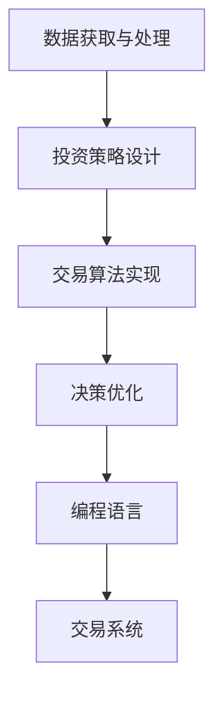

                 

# 如何将编程技能应用于自动化投资

> 关键词：自动化投资,量化交易,算法交易,数据科学,投资策略,决策优化,编程语言,交易系统

## 1. 背景介绍

随着人工智能和金融科技的不断发展，投资领域正在经历一场深刻的变革。传统投资方式已经无法满足现代市场的需求，越来越多的投资者开始转向利用编程技能进行自动化投资。通过编写交易算法，构建数据驱动的投资模型，投资者能够以更高的效率、更低的成本进行投资决策，从而在竞争激烈的市场中获得优势。

### 1.1 问题由来

自动化投资，即利用算法和计算机程序进行股票、期货等金融资产的交易，已经广泛应用于全球金融市场。其核心思想是通过数据分析、机器学习等技术手段，构建出能够适应市场变化的投资策略，并通过编程实现该策略的自动执行。自动化投资能够有效减少人为情绪的影响，提高交易的客观性和准确性，从而获得更好的投资回报。

### 1.2 问题核心关键点

自动化投资的核心在于如何构建有效的投资模型和交易策略，并通过编程实现其自动执行。具体来说，需要解决以下关键问题：

1. **数据获取与处理**：自动化投资依赖于大量的市场数据，如历史价格、交易量、财务报表等。如何高效地获取和处理这些数据，是构建投资模型的基础。
2. **投资策略设计**：投资策略的性能直接决定投资回报。如何设计出既简单又有效的策略，并根据市场变化进行动态调整，是关键所在。
3. **交易算法实现**：将投资策略转化为具体的交易算法，并通过编程实现其自动执行。如何在保证算法效率的同时，避免频繁的订单执行和滑点成本，是实现自动化的难点。
4. **风险管理与优化**：自动化投资面临的最大挑战之一是如何平衡风险与回报。如何构建有效的风险管理系统，优化交易策略，以实现稳定且可观的投资收益。

### 1.3 问题研究意义

将编程技能应用于自动化投资，对于提高投资效率、降低投资成本、增强投资决策的科学性和客观性具有重要意义：

1. **提高效率**：自动化投资能够实时处理大量数据，快速响应市场变化，减少人为决策带来的延误和误差。
2. **降低成本**：通过编程实现的交易系统能够大幅度降低交易手续费和滑点成本，提高整体投资收益。
3. **增强决策科学性**：利用数据科学和机器学习技术，投资模型能够更准确地预测市场趋势，提高投资决策的科学性和准确性。
4. **提升投资回报**：自动化投资策略能够更快速、更灵活地应对市场变化，从而实现更高的投资回报。
5. **增强风险管理**：通过编程实现的风险管理系统，能够实时监控投资组合的风险，及时调整策略，降低投资风险。

## 2. 核心概念与联系

### 2.1 核心概念概述

为更好地理解如何将编程技能应用于自动化投资，本节将介绍几个密切相关的核心概念：

- **自动化投资**：利用计算机程序进行金融资产交易的过程。通过编程实现自动化交易，能够提高交易的效率和精确度。
- **量化交易**：通过数学模型和算法进行金融决策，以实现自动化交易。量化交易依赖于大量的数据分析和模型构建，是自动化投资的重要分支。
- **算法交易**：基于预设规则或数学模型，自动化地进行金融资产交易。算法交易的核心在于构建高效的交易策略，并实现其自动执行。
- **数据科学**：利用统计学、机器学习等技术手段，分析和处理数据，以提取有价值的信息。在自动化投资中，数据科学是构建投资模型和交易策略的基础。
- **投资策略**：指导自动化投资的具体方法，包括市场分析、风险控制、资产配置等方面。有效的投资策略能够提高投资回报，降低风险。
- **决策优化**：通过数学优化手段，优化交易策略，最大化投资回报。决策优化依赖于有效的数学模型和算法。
- **编程语言**：实现自动化投资的核心工具，如Python、R、C++等。选择适合的编程语言，能够提高开发效率和系统性能。
- **交易系统**：包括数据获取、策略实现、订单执行、风险管理等在内的完整交易流程。构建高效的交易系统，是自动化投资成功的关键。

这些核心概念之间的逻辑关系可以通过以下Mermaid流程图来展示：



这个流程图展示了大语言模型微调的各个关键环节，以及它们之间的相互作用。

## 3. 核心算法原理 & 具体操作步骤
### 3.1 算法原理概述

自动化投资的核心算法原理主要包括以下几个方面：

1. **数据分析与预处理**：通过编程技能对历史市场数据进行获取、清洗、特征提取等预处理，为后续模型构建提供高质量的数据基础。
2. **投资策略设计**：利用数据科学和机器学习技术，构建出能够适应市场变化的投资策略，如基于统计学方法的均值回归策略、基于机器学习的回归模型等。
3. **交易算法实现**：将投资策略转化为具体的交易算法，如趋势跟踪算法、均值回归算法、动量策略等。交易算法需要高效、低延迟地实现，以确保交易速度和稳定性。
4. **风险管理与优化**：构建有效的风险管理系统，对交易策略进行实时监控和调整，以平衡风险与回报。

### 3.2 算法步骤详解

自动化投资的一般流程可以分为以下几个步骤：

**Step 1: 数据获取与预处理**
- 使用Python等编程语言，编写数据获取脚本，从金融市场、交易所等渠道获取历史市场数据。
- 使用Pandas、NumPy等库进行数据清洗和预处理，去除异常值、填补缺失值、进行特征提取等。

**Step 2: 投资策略设计**
- 选择合适的统计学或机器学习算法，如线性回归、决策树、随机森林等，构建投资策略。
- 利用历史数据对模型进行训练和验证，评估模型的预测性能。
- 结合市场因素，对模型进行调整和优化，确保其适应当前市场环境。

**Step 3: 交易算法实现**
- 将投资策略转化为具体的交易算法，如趋势跟踪算法、均值回归算法、动量策略等。
- 使用Python编写交易算法，利用订单执行库（如PyAlgoTrade、Backtrader）实现自动化交易。
- 进行算法回测，评估交易算法的性能和稳定性，并进行必要的优化。

**Step 4: 风险管理与优化**
- 构建风险管理系统，实时监控投资组合的风险水平。
- 根据风险水平，自动调整交易策略，避免过度集中投资或风险失控。
- 利用数据分析和机器学习技术，对交易策略进行持续优化，提高投资回报。

### 3.3 算法优缺点

自动化投资的算法有以下几个优点：

1. **高效性**：自动化投资能够实时处理大量数据，快速响应市场变化，减少人为决策带来的延误和误差。
2. **客观性**：自动化投资基于数据驱动的模型，能够避免人为情绪和偏见的影响，提高交易的客观性和准确性。
3. **灵活性**：自动化投资策略可以根据市场变化进行动态调整，适应不同的市场环境。
4. **稳定性**：通过编程实现的交易系统，能够持续稳定地执行交易策略，减少人为错误和操作风险。

同时，该方法也存在一些局限性：

1. **模型依赖性**：自动化投资依赖于模型的准确性和适应性，如果模型设计不当或市场环境变化，可能导致投资策略失效。
2. **计算资源要求高**：自动化投资需要大量的计算资源，进行数据处理和模型训练，对硬件设备要求较高。
3. **复杂性高**：构建有效的投资模型和交易算法，需要深厚的数学和编程功底，对从业者技术要求高。
4. **风险难以完全消除**：尽管有风险管理系统，但市场波动和突发事件仍可能导致投资损失，难以完全消除风险。

### 3.4 算法应用领域

自动化投资的应用领域非常广泛，主要包括但不限于以下方面：

- **股票交易**：利用数据分析和机器学习技术，构建股票投资策略，实现自动化交易。
- **期货交易**：构建期货投资策略，利用杠杆效应，获取更高的投资回报。
- **外汇交易**：构建外汇交易策略，利用汇率变化进行自动化交易。
- **加密货币交易**：构建加密货币交易策略，利用区块链技术，进行自动化交易。
- **算法交易**：构建复杂的算法交易策略，进行高频交易、套利交易等。

## 4. 数学模型和公式 & 详细讲解 & 举例说明
### 4.1 数学模型构建

在本节中，我们将使用数学语言对自动化投资的各个环节进行更详细的刻画。

假设市场价格数据为 $P_t$，其中 $t$ 表示时间。投资策略的收益率为 $R_t$，交易量为 $Q_t$。则交易策略的累积收益 $G$ 可以表示为：

$$ G = \sum_{t=1}^T R_t $$

其中 $T$ 为交易周期。

### 4.2 公式推导过程

接下来，我们将推导投资策略的数学模型。以简单的均值回归策略为例：

假设市场价格 $P_t$ 服从随机游走模型：

$$ P_t = P_{t-1} + \epsilon_t $$

其中 $\epsilon_t$ 为随机扰动项，服从均值为0，方差为 $\sigma^2$ 的正态分布。

均值回归策略的目标是找到最优的交易量 $Q_t$，使得长期累积收益最大化。根据策略收益的定义，有：

$$ R_t = \frac{P_t - P_{t-1}}{P_{t-1}} Q_t $$

将上式代入累积收益的表达式，得：

$$ G = \sum_{t=1}^T \frac{P_t - P_{t-1}}{P_{t-1}} Q_t $$

通过数学推导，可以发现均值回归策略的收益与市场价格变化密切相关。当市场价格上涨时，收益为正；价格下跌时，收益为负。因此，均值回归策略的核心在于识别市场价格的趋势，并根据趋势调整交易量。

### 4.3 案例分析与讲解

以股票市场的技术分析为例，均值回归策略可以通过计算股票价格的历史波动率和移动平均线，预测未来的价格趋势，并据此调整交易量。具体步骤如下：

1. 计算股票价格的日波动率 $V_t$：

$$ V_t = \frac{P_t - P_{t-1}}{P_{t-1}} $$

2. 计算股票价格的移动平均线 $M_t$：

$$ M_t = \frac{1}{N} \sum_{i=1}^N P_i $$

其中 $N$ 为移动平均线窗口大小。

3. 判断市场价格的趋势，并调整交易量 $Q_t$：

当 $V_t > 0$ 且 $M_t > 0$ 时，市场价格处于上涨趋势，可以增加交易量。
当 $V_t < 0$ 且 $M_t < 0$ 时，市场价格处于下跌趋势，可以减少交易量。

通过以上步骤，均值回归策略能够根据市场价格的波动和移动平均线，动态调整交易量，实现投资回报的最大化。

## 5. 项目实践：代码实例和详细解释说明
### 5.1 开发环境搭建

在进行自动化投资项目开发前，我们需要准备好开发环境。以下是使用Python进行自动化投资项目开发的环境配置流程：

1. 安装Anaconda：从官网下载并安装Anaconda，用于创建独立的Python环境。

2. 创建并激活虚拟环境：
```bash
conda create -n trading-env python=3.8 
conda activate trading-env
```

3. 安装Python的科学计算库：
```bash
conda install numpy pandas scikit-learn matplotlib statsmodels scipy statsmodels tradinglib
```

4. 安装Python的金融库：
```bash
conda install yfinance TA-Lib
```

5. 安装Python的交易系统库：
```bash
conda install pyalgotrade backtrader
```

6. 安装Python的可视化库：
```bash
conda install matplotlib
```

完成上述步骤后，即可在`trading-env`环境中开始自动化投资项目的开发。

### 5.2 源代码详细实现

下面我们以股票交易的均值回归策略为例，给出使用PyAlgoTrade进行自动化投资项目的PyTorch代码实现。

首先，定义均值回归策略的类：

```python
from pyalgotrade import strategy
from pyalgotrade.technical import ma
from pyalgotrade.technical import cross
import numpy as np
import yfinance as yf

class MeanReversionStrategy(strategy.BacktestingStrategy):
    def __init__(self, feed, instrument, sma_period, threshold):
        super(MeanReversionStrategy, self).__init__(feed, 1000.0)
        self.__instrument = instrument
        self.__sma = ma.SimpleMovingAverage(feed[instrument].getPriceDataSeries(), period=sma_period)
        self.__threshold = threshold

    def onEnterOk(self, position):
        execInfo = position.getEntryOrder().getExecutionInfo()
        self.info("BUY at $%.2f" % (execInfo.getPrice()))

    def onEnterCanceled(self, position):
        self.__sma = ma.SimpleMovingAverage(self.getFeed()[self.__instrument].getPriceDataSeries(), period=self.__sma.period)
        self.__sma.setPeriod(self.__sma.period)

    def onExitOk(self, position):
        execInfo = position.getExitOrder().getExecutionInfo()
        self.info("SELL at $%.2f" % (execInfo.getPrice()))
        self.__sma = ma.SimpleMovingAverage(self.getFeed()[self.__instrument].getPriceDataSeries(), period=self.__sma.period)
        self.__sma.setPeriod(self.__sma.period)

    def onExitCanceled(self, position):
        # If the exit was canceled, re-submit it.
        self.__sma = ma.SimpleMovingAverage(self.getFeed()[self.__instrument].getPriceDataSeries(), period=self.__sma.period)
        self.__sma.setPeriod(self.__sma.period)

    def onBars(self, bars):
        # If a position was not opened, check if we should enter a long position.
        if self.getBroker().getNumLongPositions() == 0:
            if bars[self.__instrument].getPrice() < self.__sma.getPrice():
                # If the current price is below the Simple Moving Average, enter a long position.
                shares = int(self.getBroker().getCash() * 0.9 / bars[self.__instrument].getPrice())
                cost = bars[self.__instrument].getPrice() * shares
                self.entryPosition(self.__instrument, shares, True, True)
        # If a position was already opened, check if we should exit it.
        elif bars[self.__instrument].getPrice() > self.__sma.getPrice():
            # If the current price is above the Simple Moving Average, exit the position.
            self.exitPosition(self.__instrument)

    def onOrderSubmit(self, submit):
        pass

    def onOrderCancel(self, cancel):
        pass
```

然后，定义回测函数：

```python
from pyalgotrade import backtesting

def run_backtest(strategy_class, sma_period, threshold):
    # Load data from Yahoo Finance
    instrument = "AAPL"
    feed = backtesting.Feed()
    data = yf.Ticker(instrument)
    data.history(period="1d", start="2020-01-01", end="2022-12-31", progress=True)
    feed.addBarsFromData(data)

    # Define the strategy
    strategy = strategy_class(feed, sma_period, threshold)

    # Run the backtest
    cerebro = backtesting.BacktestingEngine()
    cerebro.addStrategy(strategy)
    cerebro.run()

    # Analyze the results
    position = strategy.getEntryPosition()
    exitOrder = strategy.getExitOrder()
    if position is not None and exitOrder is not None:
        exitPrice = exitOrder.getExecutionInfo().getPrice()
        gain = (exitPrice - position.getEntryPrice()) / position.getEntryPrice()
        print("Profit: $%.2f (%.2f%%)" % (gain * position.getShares(), gain * 100.0))
    else:
        print("Position was never opened")

run_backtest(MeanReversionStrategy, 20, 0.02)
```

最后，启动回测并输出结果：

```python
run_backtest(MeanReversionStrategy, 20, 0.02)
```

### 5.3 代码解读与分析

让我们再详细解读一下关键代码的实现细节：

**MeanReversionStrategy类**：
- `__init__`方法：初始化策略，接收交易数据源、股票代码、移动平均线窗口大小和阈值。
- `onEnterOk`方法：交易进入时触发，记录进入价格。
- `onEnterCanceled`方法：交易进入被取消时触发，重新计算移动平均线。
- `onExitOk`方法：交易退出时触发，记录退出价格。
- `onExitCanceled`方法：交易退出被取消时触发，重新计算移动平均线。
- `onBars`方法：每根K线图接收时触发，根据价格和移动平均线，决定是否进行买卖操作。
- `onOrderSubmit`方法：订单提交时触发，记录提交时间。
- `onOrderCancel`方法：订单取消时触发，记录取消时间。

**run_backtest函数**：
- 加载股票数据。
- 定义策略实例。
- 运行回测。
- 分析回测结果，输出获利情况。

可以看到，PyAlgoTrade提供了简单易用的接口，用于构建和回测各种自动化投资策略。开发者可以灵活地实现自己的策略逻辑，并通过回测评估其效果。

当然，在实际应用中，还需要考虑更多因素，如市场环境、交易成本、数据质量等。通过不断迭代和优化，可以构建出稳定、高效的自动化投资系统。

## 6. 实际应用场景
### 6.1 智能投顾系统

自动化投资技术可以应用于智能投顾系统的构建。智能投顾系统通过自动化交易策略，为用户提供个性化的投资建议和资产配置。智能投顾系统能够根据用户的风险偏好、财务状况等信息，构建定制化的投资组合，实现自动化的交易操作。

在技术实现上，智能投顾系统可以分为以下几个步骤：

1. 用户注册和信息采集：用户填写问卷，输入个人财务信息、风险偏好等。
2. 构建投资组合：根据用户信息，使用自动化投资策略构建投资组合。
3. 自动化交易：将投资组合转化为具体的交易策略，并进行自动化交易。
4. 风险监控和调整：实时监控投资组合的风险水平，并根据市场变化进行动态调整。

### 6.2 高频交易系统

高频交易系统利用自动化投资技术，实现高频交易，获取更大利润。高频交易系统通过高频交易算法，快速响应市场变化，进行高频买卖操作，获取微小价格波动带来的收益。

在技术实现上，高频交易系统需要考虑以下几个因素：

1. 数据获取与处理：高频交易需要高频、实时获取市场数据，并进行预处理。
2. 交易算法设计：设计高效、低延迟的交易算法，如动量策略、套利算法等。
3. 订单执行与监控：实现高效的订单执行，实时监控交易系统的稳定性和运行效率。
4. 风险管理与优化：构建有效的风险管理系统，进行实时监控和调整。

### 6.3 量化投资平台

量化投资平台提供一站式自动化投资服务，集成多种自动化投资策略和工具，帮助用户构建和管理投资组合。量化投资平台需要具备以下几个关键功能：

1. 策略管理与选择：提供多种自动化投资策略，供用户选择和优化。
2. 数据可视化：提供数据可视化工具，帮助用户分析市场趋势和投资策略效果。
3. 订单执行与监控：实现高效的订单执行，实时监控交易系统的稳定性和运行效率。
4. 风险管理与优化：构建有效的风险管理系统，进行实时监控和调整。

### 6.4 未来应用展望

随着自动化投资技术的不断发展，未来的应用场景将更加多样化，涵盖更多领域。以下是几个可能的应用方向：

1. **金融科技**：自动化投资技术将广泛应用于金融科技领域，推动金融服务的智能化和普惠化。
2. **智能投顾**：智能投顾系统将利用自动化投资技术，提供个性化的投资建议和资产配置，提升用户体验。
3. **高频交易**：高频交易系统将利用自动化投资技术，快速响应市场变化，获取高频交易带来的收益。
4. **量化投资平台**：量化投资平台将集成多种自动化投资策略和工具，提供一站式自动化投资服务。
5. **加密货币交易**：自动化投资技术将应用于加密货币交易，利用区块链技术，实现自动化交易。
6. **算法交易**：复杂的算法交易策略将利用自动化投资技术，进行高频交易、套利交易等。

## 7. 工具和资源推荐
### 7.1 学习资源推荐

为了帮助开发者系统掌握自动化投资的理论基础和实践技巧，这里推荐一些优质的学习资源：

1. 《量化交易：策略、风险与绩效》：涵盖了量化交易的核心概念和实践技巧，适合初学者和进阶者。
2. 《Python量化投资》：讲解了如何使用Python进行量化投资开发，包括数据获取、策略设计、回测等方面。
3. 《算法交易策略》：介绍了多种自动化交易策略，如动量策略、均值回归策略等，适合有一定编程基础的读者。
4. 《Python与金融》：讲解了如何使用Python进行金融数据处理和分析，适合对金融市场有一定了解的读者。
5. 《金融数据分析与建模》：介绍了金融数据分析和建模的基本方法，适合需要深入了解金融市场的读者。

通过对这些资源的学习实践，相信你一定能够快速掌握自动化投资的核心技术，并用于解决实际的投资问题。
###  7.2 开发工具推荐

高效的开发离不开优秀的工具支持。以下是几款用于自动化投资开发的常用工具：

1. Python：Python是自动化投资开发的主流语言，具有丰富的库和框架，如NumPy、Pandas、Scikit-learn、SciPy等。
2. R：R语言也是自动化投资开发的重要工具，适合进行统计分析和数据建模。
3. Python交易系统库：如PyAlgoTrade、Backtrader、QuantConnect等，提供了简单易用的接口，用于实现自动化交易。
4. 可视化工具：如Matplotlib、Seaborn、Plotly等，用于数据可视化和分析。
5. 金融数据获取工具：如Yahoo Finance API、Alpha Vantage API等，用于获取实时和历史金融数据。
6. 风险管理系统：如VaR、ES、CVaR等，用于实时监控投资组合的风险水平。

合理利用这些工具，可以显著提升自动化投资开发的效率，加快创新迭代的步伐。

### 7.3 相关论文推荐

自动化投资技术的发展源于学界的持续研究。以下是几篇奠基性的相关论文，推荐阅读：

1. "Algorithmic Trading: Winning Strategies and Their Rationale"：介绍了多种自动化交易策略，如动量策略、均值回归策略等。
2. "High-Frequency Trading: A Practical Guide to Algorithmic Strategies and Trading Systems"：讲解了高频交易的核心概念和实践技巧。
3. "Quantitative Trading: How to Build Your Own Algorithmic Trading Business"：介绍了量化投资的核心概念和实践技巧，适合初学者和进阶者。
4. "Machine Learning for Algorithmic Trading"：介绍了机器学习在自动化交易中的应用，适合有一定数学和编程基础的读者。
5. "Quantitative Risk Management"：讲解了量化风险管理的核心概念和实践技巧，适合需要深入了解风险管理的读者。

这些论文代表了大语言模型微调技术的发展脉络。通过学习这些前沿成果，可以帮助研究者把握学科前进方向，激发更多的创新灵感。

## 8. 总结：未来发展趋势与挑战
### 8.1 总结

本文对将编程技能应用于自动化投资的方法进行了全面系统的介绍。首先阐述了自动化投资的背景和研究意义，明确了其在大数据和金融科技领域的独特价值。其次，从原理到实践，详细讲解了自动化投资的数学模型和核心算法，给出了具体的代码实例。同时，本文还探讨了自动化投资在多个实际应用场景中的应用前景，展示了其广阔的想象空间。最后，本文精选了自动化投资的学习资源、开发工具和相关论文，力求为读者提供全方位的技术指引。

通过本文的系统梳理，可以看到，将编程技能应用于自动化投资，对于提高投资效率、降低投资成本、增强投资决策的科学性和客观性具有重要意义。未来，随着人工智能和金融科技的不断发展，自动化投资技术必将在更广泛的领域得到应用，为金融市场带来深远影响。

### 8.2 未来发展趋势

展望未来，自动化投资技术将呈现以下几个发展趋势：

1. **智能投顾普及化**：智能投顾系统将成为普及化的金融服务，帮助用户实现个性化的投资决策和资产配置。
2. **高频交易技术提升**：高频交易系统将利用更加高效、智能的交易算法，实现更高效的买卖操作，获取更大利润。
3. **量化投资平台多样化**：量化投资平台将提供更多样化的投资策略和工具，满足用户的多样化需求。
4. **算法交易复杂化**：复杂的算法交易策略将利用更多的数据和模型，进行高频交易、套利交易等。
5. **加密货币交易自动化**：自动化投资技术将应用于加密货币交易，利用区块链技术，实现自动化交易。
6. **多模态数据融合**：自动化投资技术将融合金融数据、社交数据、新闻数据等多种模态信息，进行更全面的市场分析。

这些趋势凸显了自动化投资技术的广阔前景。这些方向的探索发展，必将进一步提升自动化投资系统的性能和应用范围，为金融市场带来深远影响。

### 8.3 面临的挑战

尽管自动化投资技术已经取得了显著进展，但在迈向更加智能化、普适化应用的过程中，仍面临诸多挑战：

1. **数据获取与处理**：自动化投资依赖于高质量的市场数据，但数据获取和处理的复杂性和成本较高。如何高效地获取和处理大规模金融数据，仍需进一步优化。
2. **模型复杂性**：自动化投资策略的设计和实现需要深厚的数学和编程功底，模型的复杂性和可解释性仍需提升。
3. **风险管理**：自动化投资系统面临的市场波动和突发事件，可能导致投资损失。如何构建有效的风险管理系统，降低投资风险，仍需深入研究。
4. **算法效率**：高频交易等自动化投资系统对算法效率和延迟要求较高，如何在保证算法高效性的同时，避免高频订单带来的滑点成本，仍需优化。
5. **系统稳定性和可扩展性**：自动化投资系统需要在高并发、高频率交易环境下保持稳定性和高效性，系统可扩展性和稳定性仍需进一步提升。

### 8.4 研究展望

面对自动化投资面临的诸多挑战，未来的研究需要在以下几个方面寻求新的突破：

1. **数据获取与处理优化**：探索更高效的数据获取和处理方法，如分布式数据处理、异步数据处理等，提高数据处理效率。
2. **模型简化与可解释性**：探索更加简单、可解释的模型，如基于规则的交易策略，提高模型的可解释性和可靠性。
3. **风险管理系统改进**：构建更加全面、精确的风险管理系统，实时监控投资组合的风险水平，及时调整策略，降低投资风险。
4. **算法优化与效率提升**：优化高频交易等自动化投资算法的效率和稳定性，减少高频订单带来的滑点成本，提高系统效率。
5. **系统稳定性与可扩展性提升**：通过分布式系统架构、缓存机制、消息队列等技术手段，提高自动化投资系统的可扩展性和稳定性。

这些研究方向的探索，必将引领自动化投资技术迈向更高的台阶，为构建安全、可靠、可解释、可控的智能系统铺平道路。面向未来，自动化投资技术还需要与其他人工智能技术进行更深入的融合，如自然语言处理、图像识别等，多路径协同发力，共同推动金融市场的进步。

## 9. 附录：常见问题与解答

**Q1：自动化投资技术是否适用于所有投资者？**

A: 自动化投资技术适合有一定编程基础和金融知识的投资者。对于没有编程基础的投资者，可以使用智能投顾系统等工具，实现自动化投资。但对于有高度定制化需求的投资者，仍需具备一定的编程技能和金融知识。

**Q2：自动化投资是否能够避免人为情绪的影响？**

A: 自动化投资能够避免人为情绪对投资决策的影响，但无法完全消除市场波动和突发事件带来的风险。投资者仍需结合市场分析和风险管理，进行综合决策。

**Q3：自动化投资是否能够实现100%的收益？**

A: 自动化投资无法保证100%的收益，市场波动和突发事件仍可能导致投资损失。投资者需理性看待自动化投资，结合市场分析和风险管理，进行综合决策。

**Q4：自动化投资是否需要持续学习和优化？**

A: 自动化投资系统需要持续学习和优化，以适应市场变化和提高投资回报。投资者应定期回测和优化交易策略，保持系统的先进性和稳定性。

**Q5：自动化投资是否需要高昂的计算资源？**

A: 自动化投资需要较高的计算资源，特别是高频交易等系统。但随着计算技术的不断进步，未来自动化投资系统的计算资源需求将逐步降低。

**Q6：自动化投资是否存在数据泄露风险？**

A: 自动化投资系统需要严格的数据安全和隐私保护，防止数据泄露和滥用。投资者应选择可靠的数据源和交易平台，确保数据安全和隐私。

**Q7：自动化投资是否存在法律和道德风险？**

A: 自动化投资需要遵守相关的法律法规和道德规范，防止非法交易和滥用。投资者应了解相关法律法规，确保交易行为的合规性。

通过以上问答，可以看出，自动化投资技术在实际应用中仍然面临一些挑战和风险，需要投资者具备一定的技术知识和风险意识，结合市场分析和风险管理，进行综合决策。

---

作者：禅与计算机程序设计艺术 / Zen and the Art of Computer Programming

