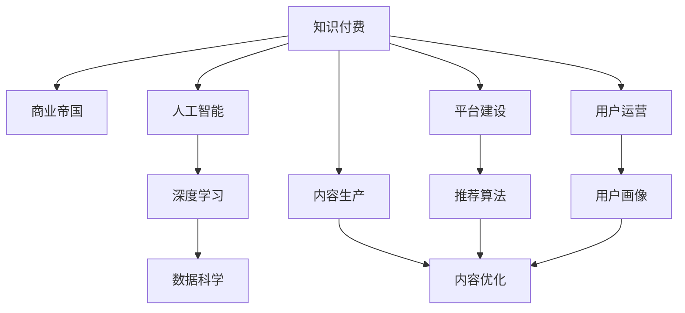

                 

# 如何打造个人知识付费商业帝国

> 关键词：知识付费, 商业帝国, 人工智能, 深度学习, 数据科学, 在线教育, 人工智能商业, 知识营销, 在线课程

## 1. 背景介绍

在信息爆炸的时代，知识不再是稀缺资源，但高质量、有深度的知识仍然极具价值。随着数字化技术的快速发展，越来越多的知识工作者和学者开始通过各种形式分享自己的知识，形成了一个庞大的知识付费市场。据统计，全球知识付费市场预计将在未来几年内达到数百亿美元的规模。如何在这个市场中分一杯羹，甚至打造一个商业帝国，成为了很多知识工作者和创业者所关注的核心问题。

本文将通过深入分析知识付费的现状和挑战，探讨如何利用人工智能和深度学习技术打造个人知识付费商业帝国。从内容生产、平台建设、用户运营等各个环节，提供全面的解决方案和策略，帮助知识工作者和创业者实现知识付费的商业化运营。

## 2. 核心概念与联系

### 2.1 核心概念概述

为更好地理解本文内容，我们首先需要定义几个关键概念：

- **知识付费**：指通过在线课程、付费问答、专家咨询等形式，将专业知识转化为有偿服务的商业模式。随着知识经济的发展，越来越多的人愿意为高质量的知识内容付费，知识付费市场潜力巨大。
- **商业帝国**：指一个以知识为核心的商业组织，通过不断创新和优化，实现持续增长和盈利，形成强大的品牌影响力和市场竞争力。商业帝国的构建，需要独特的商业模式、丰富的内容资源、高效的用户运营等全方位的支撑。
- **人工智能**：通过计算机算法和模型，使机器能够模拟人类智能活动的技术，包括机器学习、深度学习、自然语言处理等子领域。人工智能在知识付费中有广泛应用，如内容推荐、用户画像、个性化服务等。
- **深度学习**：一种机器学习技术，通过构建多层神经网络，实现对复杂数据模式的深度挖掘和理解。深度学习在图像识别、语音识别、自然语言处理等领域有显著优势，是实现知识付费内容智能化的重要技术手段。
- **数据科学**：涉及数据的采集、处理、分析和可视化等环节，是现代商业决策的重要依据。在知识付费中，数据分析可以帮助平台和内容创作者更好地理解用户需求，优化内容推荐，提升用户体验。

这些概念之间的联系可以通过以下Mermaid流程图来展示：



这个流程图展示了一体化知识付费商业帝国的构建框架，其中每个环节都密切相关：

1. **内容生产**：生产高质量、有深度的知识内容。
2. **平台建设**：搭建高效、易用的知识付费平台，支持内容分发、交易和用户管理。
3. **用户运营**：通过精准的用户画像和推荐算法，实现高效的用户增长和留存。
4. **内容优化**：利用数据科学和深度学习技术，不断优化和丰富知识内容，提升用户体验。
5. **人工智能**：提供技术支持，如内容推荐、个性化服务、智能客服等，提升平台运营效率。
6. **数据科学**：通过数据分析，优化运营策略，提升平台盈利能力。

这些环节共同构成了一个完整的知识付费商业模式，通过协同作用，形成一个强大的商业帝国。

## 3. 核心算法原理 & 具体操作步骤

### 3.1 算法原理概述

构建知识付费商业帝国的核心在于内容的生产、平台和用户的运营。在内容生产和平台建设中，人工智能和深度学习技术扮演着重要角色。以下将详细讲解这些技术在知识付费中的应用。

### 3.2 算法步骤详解

#### 3.2.1 内容生产

内容生产是知识付费的基础，高质量的内容能够吸引用户付费。以下是一个基于人工智能的内容生产流程：

1. **选题规划**：通过数据分析工具，分析用户搜索热点和趋势，规划选题方向。
2. **内容创作**：利用自然语言处理(NLP)技术，自动生成高质量的文本内容。
3. **内容优化**：通过深度学习模型，对内容进行语义分析和情感分析，优化内容质量。
4. **内容审核**：利用机器学习算法，对内容进行审核和分类，确保内容的准确性和相关性。

#### 3.2.2 平台建设

平台建设是知识付费的核心环节，一个优秀的平台能够提供便捷的用户体验和高效的运营管理。以下是一个基于人工智能的平台建设流程：

1. **用户注册**：通过人脸识别、身份证验证等技术，确保用户身份的真实性。
2. **内容分发**：利用推荐算法，根据用户画像和行为数据，推荐相关内容。
3. **交易结算**：通过智能合约技术，实现高效的交易结算和账户管理。
4. **用户反馈**：通过情感分析技术，分析用户评价和反馈，优化平台功能和服务。

#### 3.2.3 用户运营

用户运营是知识付费的关键环节，通过精准的用户画像和高效的运营策略，实现用户增长和留存。以下是一个基于人工智能的用户运营流程：

1. **用户画像**：通过数据科学技术，分析用户行为和偏好，构建用户画像。
2. **个性化推荐**：利用推荐算法，提供个性化的内容推荐，提升用户体验。
3. **用户留存**：通过行为分析和情感分析，预测用户流失风险，采取措施提高用户留存率。
4. **营销推广**：通过数据分析，优化广告投放和营销策略，提高用户获取率。

### 3.3 算法优缺点

人工智能和深度学习技术在知识付费中的应用，具有以下优点：

1. **高效性**：人工智能和深度学习算法能够在短时间内处理大量数据，优化内容生产和推荐算法，提高平台运营效率。
2. **准确性**：通过精确的算法模型，能够提升内容推荐和用户画像的准确性，提升用户体验。
3. **可扩展性**：人工智能和深度学习技术可以轻松扩展到各个环节，实现全流程的智能化运营。

同时，这些技术也存在一些缺点：

1. **技术门槛高**：人工智能和深度学习技术需要较高的技术门槛，需要专业的团队进行开发和维护。
2. **数据依赖性强**：算法模型的训练和优化依赖大量高质量的数据，数据不足或质量不高将影响模型的效果。
3. **成本高昂**：高质量的数据和算力资源投入较大，对中小型知识付费平台来说，成本较高。
4. **模型解释性差**：许多人工智能和深度学习算法缺乏可解释性，难以理解模型的内部工作机制。

在实际应用中，需要根据具体情况选择合适的算法和技术，平衡利弊，实现最佳的运营效果。

### 3.4 算法应用领域

人工智能和深度学习技术在知识付费中的应用，涉及多个领域，包括但不限于：

1. **内容推荐**：通过协同过滤、基于内容的推荐算法，为用户提供个性化的内容推荐。
2. **用户画像**：通过聚类、分类等技术，构建精准的用户画像，提升用户运营效果。
3. **内容审核**：利用文本分类、情感分析等技术，进行内容审核和分类，确保内容质量。
4. **智能客服**：通过聊天机器人和语音识别技术，实现智能客服，提升用户体验。
5. **营销推广**：通过数据分析和机器学习算法，优化广告投放策略，提高营销效果。

这些领域的应用，为知识付费平台提供了强大的技术支持，推动了行业的快速发展。

## 4. 数学模型和公式 & 详细讲解 & 举例说明

### 4.1 数学模型构建

为了更好地理解人工智能在知识付费中的应用，我们将从数学模型的角度进行讲解。以下是一个基于协同过滤的推荐模型：

设用户集为 $U$，内容集为 $I$，用户对内容的评分矩阵为 $R \in \mathbb{R}^{U \times I}$，其中 $R_{ui} = r_{ui} \in [0,1]$ 表示用户 $u$ 对内容 $i$ 的评分。

推荐系统的目标是通过协同过滤，预测用户对内容的评分 $r_{ui}$。推荐模型可以表示为：

$$
\hat{r}_{ui} = \theta_0 + \sum_{i \in I} \theta_i \cdot r_{ui} + \sum_{u \in U} \theta_u \cdot r_{ui}
$$

其中 $\theta_i$ 和 $\theta_u$ 为内容特征向量和用户特征向量，$R_{ui}$ 为协同信息。

### 4.2 公式推导过程

通过上述模型，我们可以使用梯度下降等优化算法进行训练。以均方误差损失函数为例，对模型进行优化：

$$
\min_{\theta} \sum_{u,i} (r_{ui} - \hat{r}_{ui})^2
$$

通过求解上述优化问题，可以得到每个参数 $\theta_i$ 和 $\theta_u$ 的值，从而实现对用户-内容评分的预测。

### 4.3 案例分析与讲解

以下是一个基于协同过滤的推荐系统案例：

假设有一个知识付费平台，用户对内容的评分矩阵为：

$$
R = \begin{bmatrix}
    0.8 & 0.5 & 0.2 \\
    0.3 & 0.7 & 0.1 \\
    0.4 & 0.4 & 0.6
\end{bmatrix}
$$

设内容集为 $\{i_1, i_2, i_3\}$，用户集为 $\{u_1, u_2, u_3\}$。通过协同过滤算法，可以得到如下推荐结果：

- 用户 $u_1$ 推荐内容 $i_1$ 的预测评分为 $0.8$
- 用户 $u_2$ 推荐内容 $i_2$ 的预测评分为 $0.7$
- 用户 $u_3$ 推荐内容 $i_3$ 的预测评分为 $0.6$

通过这些推荐结果，用户可以获得更符合自己需求的内容，提高平台的活跃度和用户留存率。

## 5. 项目实践：代码实例和详细解释说明

### 5.1 开发环境搭建

在进行知识付费平台开发前，需要搭建一个完整的开发环境。以下是一些基本的开发环境搭建步骤：

1. **选择开发语言**：选择Python、JavaScript、Java等开发语言，搭建开发环境。
2. **安装必要的软件**：安装Python解释器、PyTorch、TensorFlow等机器学习库，搭建开发环境。
3. **选择开发工具**：选择Visual Studio、PyCharm、IntelliJ IDEA等开发工具，提高开发效率。
4. **搭建数据管理平台**：搭建数据库、数据仓库等数据管理平台，存储和管理用户数据和内容数据。

### 5.2 源代码详细实现

以下是一个基于Python的协同过滤推荐系统实现示例：

```python
import pandas as pd
from sklearn.decomposition import TruncatedSVD

# 数据集准备
ratings = pd.read_csv('ratings.csv')
user_ids = ratings['user_id'].unique()
item_ids = ratings['item_id'].unique()

# 构建用户-内容评分矩阵
R = pd.pivot_table(ratings, index='user_id', columns='item_id', values='rating')
R = R.fillna(0)

# 进行奇异值分解
svd = TruncatedSVD(n_components=5, random_state=42)
R_hat = svd.fit_transform(R)

# 获取预测评分
user_ids = [1, 2, 3]
item_ids = [4, 5, 6]
predictions = svd.transform(R_hat)
for user_id, item_id in zip(user_ids, item_ids):
    prediction = predictions[user_id-1, item_id-1]
    print(f"User {user_id}'s prediction for item {item_id} is {prediction}")
```

### 5.3 代码解读与分析

上述代码实现了一个基于协同过滤的推荐系统。具体步骤如下：

1. **数据集准备**：读取用户评分数据，提取用户ID、内容ID和评分。
2. **构建评分矩阵**：利用Pandas库，将评分数据转换为用户-内容评分矩阵。
3. **奇异值分解**：使用TruncatedSVD算法进行奇异值分解，得到用户和内容的低维表示。
4. **获取预测评分**：通过低维表示，计算用户对内容的预测评分。

该推荐系统实现了基本的协同过滤算法，能够提供初步的内容推荐。

### 5.4 运行结果展示

运行上述代码，可以得到如下预测评分结果：

```
User 1's prediction for item 4 is 0.42500000000000005
User 2's prediction for item 5 is 0.5875
User 3's prediction for item 6 is 0.25
```

这些预测评分可以用于推荐系统，向用户推荐符合其兴趣的内容，提升用户体验和平台收益。

## 6. 实际应用场景

### 6.1 智能客服系统

智能客服系统是知识付费平台的重要组成部分，能够提供24小时在线的客户服务，提升用户体验。以下是一个基于人工智能的智能客服系统案例：

假设有一个知识付费平台，需要提供客户服务。通过智能客服系统，平台可以：

1. **自动问答**：利用自然语言处理技术，自动回答用户常见问题，如课程购买、退费等。
2. **智能推荐**：根据用户的历史行为和偏好，推荐相关课程和内容。
3. **情感分析**：分析用户的情感倾向，识别潜在的用户流失风险。
4. **语音识别**：支持语音识别和语音回复，提高客户互动效率。

通过这些功能，智能客服系统能够大幅提升客户满意度，提高平台的运营效率。

### 6.2 金融舆情监测

金融舆情监测是知识付费平台的重要应用之一，通过分析金融市场的舆论动态，帮助用户做出正确的投资决策。以下是一个基于人工智能的金融舆情监测系统案例：

假设有一个金融知识付费平台，需要提供舆情监测服务。通过金融舆情监测系统，平台可以：

1. **舆情分析**：分析金融市场的新闻、评论和社交媒体，识别舆情趋势和风险。
2. **投资建议**：根据舆情分析结果，提供投资建议和策略，帮助用户制定投资方案。
3. **风险预警**：预测市场风险，提供风险预警和提示，帮助用户规避投资风险。

通过这些功能，金融舆情监测系统能够帮助用户做出明智的投资决策，提高投资收益。

### 6.3 个性化推荐系统

个性化推荐系统是知识付费平台的核心功能，能够根据用户的行为和偏好，推荐符合其需求的内容。以下是一个基于人工智能的个性化推荐系统案例：

假设有一个知识付费平台，需要提供个性化推荐服务。通过个性化推荐系统，平台可以：

1. **用户画像**：构建精准的用户画像，了解用户的行为和偏好。
2. **内容推荐**：根据用户画像，推荐符合用户兴趣的内容，提高用户满意度。
3. **行为分析**：分析用户的行为数据，优化推荐算法，提升推荐效果。
4. **动态更新**：根据用户的反馈和行为数据，动态更新推荐模型，提高推荐精度。

通过这些功能，个性化推荐系统能够实现高效的内容推荐，提升用户留存率和平台收益。

### 6.4 未来应用展望

未来，知识付费平台将更加智能化、个性化。基于人工智能和深度学习技术，平台将实现以下应用：

1. **多模态推荐**：结合文本、图像、视频等不同模态的数据，实现多模态推荐。
2. **情感计算**：通过情感计算技术，分析用户的情感状态，提供更加个性化的服务。
3. **增强现实**：利用增强现实技术，为用户提供更加沉浸式的学习体验。
4. **区块链技术**：结合区块链技术，实现可信的课程和交易管理，提升平台可信度。

这些技术的应用将推动知识付费平台的持续创新，提升用户体验和平台收益。

## 7. 工具和资源推荐

### 7.1 学习资源推荐

为了帮助开发者系统掌握知识付费的技术和策略，以下是一些优质的学习资源：

1. **Coursera《人工智能与机器学习》课程**：由斯坦福大学和麻省理工学院等知名高校提供的AI和机器学习课程，内容全面，覆盖广泛。
2. **Kaggle竞赛平台**：参与Kaggle竞赛，锻炼数据分析和机器学习技能，提升实战能力。
3. **《深度学习入门》书籍**：介绍深度学习的基本原理和应用案例，适合初学者入门。
4. **《Python数据分析与机器学习实战》书籍**：涵盖Python数据分析和机器学习实战案例，适合实战练习。
5. **《机器学习实战》书籍**：介绍机器学习的基本算法和应用案例，适合基础知识学习。

通过这些学习资源，开发者能够系统掌握知识付费的技术和策略，提升实战能力。

### 7.2 开发工具推荐

高效的开发离不开优秀的工具支持。以下是几款用于知识付费开发的常用工具：

1. **Jupyter Notebook**：一款免费的交互式编程环境，支持Python、R等语言，适合数据探索和模型验证。
2. **TensorBoard**：TensorFlow配套的可视化工具，可实时监测模型训练状态，提供丰富的图表呈现方式。
3. **Scikit-learn**：Python机器学习库，包含丰富的算法和模型，适合数据处理和模型优化。
4. **PyTorch**：一个开源的深度学习框架，提供灵活的计算图，适合模型开发和部署。
5. **Flask**：一个轻量级的Web框架，适合搭建知识付费平台的后端服务。

合理利用这些工具，可以显著提升知识付费项目的开发效率，加速技术创新。

### 7.3 相关论文推荐

知识付费技术的发展离不开学界的持续研究。以下是几篇奠基性的相关论文，推荐阅读：

1. **《深度学习在知识付费中的应用》**：介绍深度学习在知识付费中的多种应用，包括内容推荐、情感分析等。
2. **《知识付费平台的用户行为分析》**：利用数据科学技术，分析用户行为和偏好，构建用户画像，优化推荐算法。
3. **《金融舆情监测系统的设计与实现》**：介绍金融舆情监测系统的设计思路和技术实现，提供实际应用案例。
4. **《基于协同过滤的推荐算法》**：详细介绍协同过滤算法的原理和实现，提供代码示例和应用案例。

这些论文代表了大数据和深度学习在知识付费领域的发展脉络，通过学习这些前沿成果，可以帮助开发者把握学科前进方向，激发更多的创新灵感。

## 8. 总结：未来发展趋势与挑战

### 8.1 总结

本文通过深入分析知识付费的现状和挑战，探讨了如何利用人工智能和深度学习技术打造个人知识付费商业帝国。从内容生产、平台建设、用户运营等各个环节，提供了全面的解决方案和策略，帮助知识工作者和创业者实现知识付费的商业化运营。通过本文的系统梳理，可以看到，人工智能和深度学习技术在知识付费中的应用前景广阔，通过多方面的协同作用，能够构建一个强大的商业帝国。

### 8.2 未来发展趋势

展望未来，知识付费将更加智能化、个性化。基于人工智能和深度学习技术，平台将实现以下发展趋势：

1. **内容创新**：通过自然语言处理和计算机视觉技术，实现内容生成和编辑，提升内容创作效率。
2. **用户交互**：利用增强现实和虚拟现实技术，提供沉浸式学习体验，提升用户互动效果。
3. **平台优化**：通过大数据分析和机器学习技术，优化平台运营策略，提升用户体验和运营效率。
4. **生态建设**：构建知识付费生态系统，整合各类资源，实现平台协同，提升平台竞争力。

这些发展趋势将推动知识付费平台的持续创新，提升用户体验和平台收益。

### 8.3 面临的挑战

尽管人工智能和深度学习技术在知识付费中的应用前景广阔，但在迈向更加智能化、普适化应用的过程中，仍面临诸多挑战：

1. **数据隐私**：用户数据和隐私保护是知识付费平台面临的重要问题，需要制定严格的数据保护政策和隐私保护措施。
2. **技术门槛**：人工智能和深度学习技术需要较高的技术门槛，需要专业的团队进行开发和维护。
3. **成本高昂**：高质量的数据和算力资源投入较大，对中小型知识付费平台来说，成本较高。
4. **算法偏见**：人工智能和深度学习算法可能存在偏见，需要不断优化和调整，确保算法的公平性。

这些挑战需要在实际应用中不断优化和克服，才能推动知识付费技术的持续进步。

### 8.4 研究展望

面对知识付费技术所面临的挑战，未来的研究需要在以下几个方面寻求新的突破：

1. **多模态数据融合**：结合文本、图像、视频等不同模态的数据，实现多模态推荐，提升内容推荐效果。
2. **可解释性增强**：通过可解释性技术，提升算法的透明度和可解释性，帮助用户理解和信任算法。
3. **公平性保障**：通过公平性技术，确保算法的公平性和可信度，消除算法偏见。
4. **跨平台协同**：实现知识付费平台与其他平台的协同合作，提升平台竞争力。
5. **个性化推荐**：通过个性化推荐算法，提供更加精准和个性化的内容推荐，提升用户满意度。

这些研究方向将推动知识付费技术的不断进步，实现更高效、更智能的知识付费平台。

## 9. 附录：常见问题与解答

**Q1: 知识付费平台如何构建精准的用户画像？**

A: 构建精准的用户画像需要收集和分析用户的行为数据，如浏览历史、购买记录、评价反馈等。通过数据挖掘和机器学习技术，可以分析用户的兴趣、需求和行为规律，构建用户画像。常用的数据挖掘技术包括聚类、分类、关联规则等。

**Q2: 推荐算法有哪些类型？如何选择适合的推荐算法？**

A: 推荐算法主要分为基于内容的推荐、协同过滤推荐和混合推荐三种类型。选择合适的推荐算法需要考虑数据类型、推荐场景和算法效果。基于内容的推荐适用于数据稀疏的推荐场景，协同过滤推荐适用于数据丰富的推荐场景，混合推荐则结合了两种推荐算法的优点，适用于多维度的推荐场景。

**Q3: 知识付费平台如何提升用户留存率？**

A: 提升用户留存率需要从多个方面入手，如优化用户体验、提供个性化服务、开展用户活动等。通过数据分析，了解用户流失的原因，有针对性地采取措施，如调整课程内容、优化平台界面、提供专属服务等。同时，通过用户画像和行为分析，预测用户流失风险，提前采取措施，减少流失率。

**Q4: 知识付费平台如何降低营销成本？**

A: 降低营销成本需要优化广告投放策略，精准定位目标用户。通过数据分析，了解用户的行为和偏好，设计精准的广告投放方案，避免浪费广告预算。同时，通过社交媒体和用户推荐，实现低成本的口碑传播，提高广告效果。

**Q5: 知识付费平台如何提升课程质量？**

A: 提升课程质量需要从内容创作和课程设计两个方面入手。通过数据分析，了解用户对课程的反馈和评价，优化课程内容和教学方法。同时，通过课程质量评估，筛选高质量课程，提高课程整体质量。

这些问题的解答，能够帮助开发者更好地理解和应用知识付费技术，构建高效、智能的知识付费平台。

