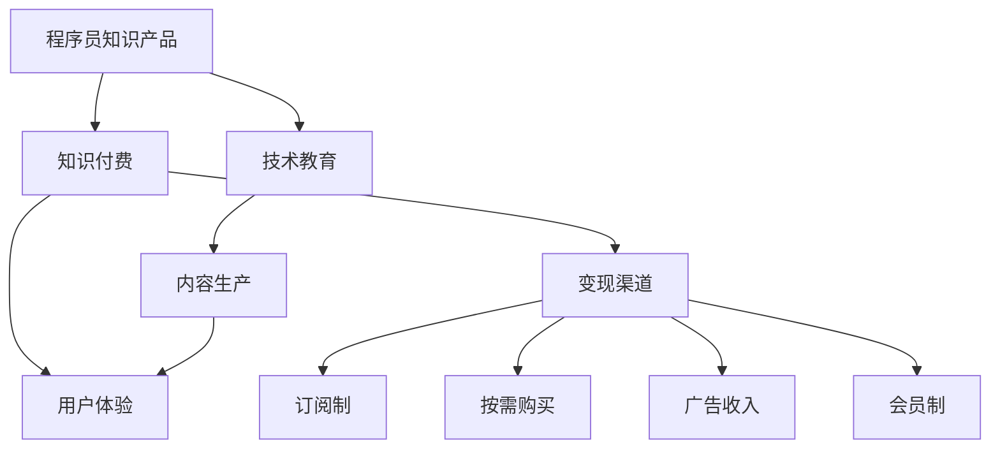

                 

# 如何打造高盈利性的程序员知识产品

> 关键词：程序员知识产品,知识付费,盈利模式,技术教育,内容生产,市场调研,用户体验,变现渠道,技术变现,创业指导,职业发展

## 1. 背景介绍

在信息爆炸的互联网时代，程序员和技术人员的知识技能，成为企业发展和个人职业发展的核心竞争力。而高质量、专业化的知识产品，正是对应这一需求的有效供给。通过打造高盈利性的程序员知识产品，不仅能够为程序员提供持续的学习成长动力，也为企业带来了源源不断的收益。本文将从市场需求、产品构建、盈利模式等多个维度出发，探讨如何打造高盈利性的程序员知识产品。

## 2. 核心概念与联系

### 2.1 核心概念概述

为更好地理解打造高盈利性程序员知识产品的方法，本节将介绍几个密切相关的核心概念：

- 程序员知识产品：指的是针对程序员和技术人员的学习、提升、技能训练、职业规划等知识需求的在线课程、图书、文档、视频教程、在线直播等产品。

- 知识付费：指用户为获取知识产品或服务支付费用的商业模式。知识付费模式通过对知识内容的稀缺性和深度进行收费，确保了产品的高质量和高价值。

- 技术教育：围绕编程技能、软件开发、网络安全、数据科学等技术领域的学习、教育与培训活动。技术教育产品旨在提升技术人员的综合能力和职业素养。

- 内容生产：指通过编写、录制、整理、制作等方式，创作高质量的知识内容，包括文字、视频、音频等形式。内容生产是知识产品开发的核心环节。

- 用户体验：指用户在使用知识产品过程中的主观感受和满意程度。良好的用户体验能够提升用户粘性，增加产品盈利能力。

- 变现渠道：指知识产品通过不同方式进行收费或变现的渠道。常见的变现渠道包括订阅制、按需购买、广告收入、会员制等。

这些核心概念之间的逻辑关系可以通过以下Mermaid流程图来展示：



这个流程图展示了几者之间的关系：

1. 知识产品是知识付费的基础。
2. 技术教育是知识产品的重要组成部分。
3. 内容生产是知识产品的主要来源。
4. 用户体验影响知识产品的盈利能力。
5. 变现渠道是知识产品盈利的主要方式。

## 3. 核心算法原理 & 具体操作步骤
### 3.1 算法原理概述

打造高盈利性程序员知识产品，本质上是一个多目标优化问题。其核心目标包括：

- 吸引和留住目标用户。
- 提升用户满意度。
- 增加用户留存和转化率。
- 实现收益最大化。

为了达到这些目标，可以采用以下几种关键策略：

1. **市场调研**：通过用户需求分析，了解目标用户的痛点和需求，从而设计和生产符合用户期望的产品。
2. **内容质量优化**：确保内容的高质量、专业性和实用性，以吸引和留住用户。
3. **用户体验提升**：优化产品界面和功能，提升用户的操作体验和使用效率。
4. **精准变现策略**：通过多元化的变现渠道，最大化产品收益。
5. **持续迭代改进**：根据用户反馈和市场变化，不断优化和升级产品。

### 3.2 算法步骤详解

打造高盈利性程序员知识产品的具体步骤包括：

**Step 1: 市场调研**

- 定义目标用户：如初级开发者、中级开发者、高级开发者、技术管理者等。
- 调研用户需求：通过问卷调查、用户访谈、竞品分析等方式，了解用户的学习需求、技能短板、学习方式等。
- 分析竞品优劣：对比竞品，了解竞品的成功经验和不足之处。

**Step 2: 内容设计与生产**

- 确定课程内容：根据调研结果，设计符合用户需求的内容体系，包括课程大纲、课程目标、课程亮点等。
- 制作优质内容：聘请行业专家和技术大咖，制作高质量的视频教程、文字资料、代码示例等。
- 组织内容审查：确保内容的正确性、严谨性和实用性，避免误导用户。

**Step 3: 产品设计与开发**

- 设计用户界面：采用简洁、易用的界面设计，确保用户能够顺畅地完成学习。
- 实现功能模块：包括课程浏览、在线测试、讨论交流、即时反馈等。
- 优化用户体验：采用A/B测试等方法，不断迭代优化用户体验。

**Step 4: 推广与营销**

- 制定推广策略：通过SEO、社交媒体、邮件营销等方式推广产品。
- 优化转化路径：设计简洁高效的购买流程，减少用户流失。
- 开展市场活动：如免费试用、优惠促销等，吸引新用户。

**Step 5: 运营与维护**

- 用户数据分析：利用数据监控用户行为，如学习进度、课程完成率、用户满意度等。
- 调整产品策略：根据用户反馈和数据分析结果，调整产品内容和功能。
- 技术迭代升级：定期更新技术栈，确保产品稳定性和可靠性。

### 3.3 算法优缺点

打造高盈利性程序员知识产品的优势在于：

- 构建专业品牌：通过优质的内容和技术专家的参与，可以打造品牌，提升产品知名度。
- 实现高收益：通过知识付费和多种变现模式，实现盈利最大化。
- 提升技术水平：用户通过系统化学习，能够提升自身技术水平，更好地适应行业发展。

但同时，该方法也存在一定的局限性：

- 开发成本高：内容生产和产品开发需要投入大量人力和财力，初期成本较高。
- 用户获取难度大：高质量的程序员知识产品往往价格不菲，需要花费精力推广获取用户。
- 用户流失风险高：用户对于知识产品内容质量、价格等因素十分敏感，一旦不满意容易流失。

尽管存在这些局限性，但通过精细化的运营和管理，高盈利性程序员知识产品依然具备巨大的市场潜力和商业价值。

### 3.4 算法应用领域

高盈利性程序员知识产品可以应用于以下多个领域：

- **技术教育培训**：如面向初级开发者、中级开发者、高级开发者的各类编程语言、框架、技术栈培训。
- **职业发展规划**：包括简历优化、面试指导、项目管理、团队协作等综合技能提升。
- **特定技能学习**：如区块链技术、人工智能、机器学习、网络安全等高需求领域的专业技能培训。
- **软件开发工具**：提供针对各类IDE、版本控制、CI/CD等工具的使用和配置指导。
- **实战项目实战**：通过提供真实项目案例和实战代码，帮助用户积累实战经验。

这些领域都是程序员和技术人员职业发展中的重要环节，通过高盈利性知识产品的构建，可以有效提升用户的技术水平和职业素养。

## 4. 数学模型和公式 & 详细讲解  
### 4.1 数学模型构建

本节将使用数学语言对打造高盈利性程序员知识产品的方法进行更加严格的刻画。

假设程序员知识产品为 $P$，其中包含内容 $C$、用户体验 $U$、营销策略 $M$ 和变现模式 $V$。我们的目标是最大化产品收益 $R$，即：

$$
\max_{P} R = f(C, U, M, V)
$$

其中 $f$ 为收益函数，根据具体的变现模式和营销策略进行调整。

### 4.2 公式推导过程

以订阅制为例，收益函数可以简化为：

$$
R = n \cdot C \cdot p - C \cdot c
$$

其中：

- $n$：订阅用户数
- $C$：内容生产成本
- $p$：订阅价格
- $c$：用户流失率

将收益最大化问题转化为目标函数：

$$
\max_{n, p} n \cdot p - C \cdot c
$$

约束条件包括：

1. 订阅用户数 $n$ 的增加：
   $$
   \frac{\partial n}{\partial p} > 0
   $$
   表示提高订阅价格会增加订阅用户数。

2. 用户流失率 $c$ 的减少：
   $$
   \frac{\partial c}{\partial p} < 0
   $$
   表示提高订阅价格会增加用户流失率。

3. 内容生产成本 $C$ 的固定：
   $$
   \frac{\partial C}{\partial n} = 0
   $$
   表示内容生产成本与订阅用户数无关。

通过优化上述目标函数和约束条件，可以找到最优的订阅价格和订阅用户数，从而最大化产品收益。

### 4.3 案例分析与讲解

**案例分析：编程技能课程订阅平台**

假设有编程技能课程订阅平台，提供多种技术栈的课程，如Python、Java、Web开发、移动开发等。平台采用订阅制，每月订阅费用为 $10，用户数上限为10万。

**公式推导**：
假设每增加1000用户，平台需增加额外500元的内容制作和运营成本，即 $C=500$。用户流失率为 $c=10\%$。

根据公式：

$$
R = n \cdot p - C \cdot c
$$

假设用户订阅数量 $n$ 的增加比例与订阅价格 $p$ 的提高成正比，即 $\frac{\partial n}{\partial p}=1.2$。用户流失率 $c$ 与订阅价格 $p$ 的增加呈反比，即 $\frac{\partial c}{\partial p}=-0.01$。

**求解过程**：

1. 根据收益函数：
   $$
   R = n \cdot p - 500 \cdot 0.1
   $$
   代入已知条件：
   $$
   R = n \cdot p - 50
   $$

2. 对收益函数求导：
   $$
   \frac{\partial R}{\partial p} = n + 10n - 50
   $$

3. 令导数为0，求解最优价格 $p$：
   $$
   n + 10n - 50 = 0 \Rightarrow 11n = 50 \Rightarrow n = \frac{50}{11} \approx 4.55
   $$

4. 代入 $n=4.55$ 求解 $p$：
   $$
   R = 4.55 \cdot p - 50 \Rightarrow p = \frac{R + 50}{4.55}
   $$

通过上述计算，得到最优的订阅价格和订阅用户数，从而最大化产品收益。

## 5. 项目实践：代码实例和详细解释说明
### 5.1 开发环境搭建

在进行知识产品开发前，我们需要准备好开发环境。以下是使用Python进行Flask框架开发的环境配置流程：

1. 安装Python：从官网下载并安装Python，版本需为3.8及以上。

2. 安装Flask：通过pip安装Flask框架。
```bash
pip install Flask
```

3. 安装Flask扩展库：安装所需库，如Jinja2、SQLAlchemy等。
```bash
pip install Jinja2 SQLAlchemy
```

4. 创建虚拟环境：
```bash
python -m venv myenv
source myenv/bin/activate
```

完成上述步骤后，即可在虚拟环境中开始知识产品开发。

### 5.2 源代码详细实现

以下是一个简单的知识产品平台，包括课程浏览、订阅、购买、学习等功能。

```python
from flask import Flask, render_template, request, redirect, url_for
from flask_sqlalchemy import SQLAlchemy

app = Flask(__name__)
app.config['SQLALCHEMY_DATABASE_URI'] = 'sqlite:///mydatabase.db'
db = SQLAlchemy(app)

class Course(db.Model):
    id = db.Column(db.Integer, primary_key=True)
    title = db.Column(db.String(100))
    price = db.Column(db.Float)
    url = db.Column(db.String(100))

@app.route('/')
def index():
    courses = Course.query.all()
    return render_template('index.html', courses=courses)

@app.route('/subscribe', methods=['POST'])
def subscribe():
    course_id = request.form['course_id']
    course = Course.query.filter_by(id=course_id).first()
    if course.price > 0:
        user = User.query.first()
        user.subscribed.append(course)
        db.session.commit()
        return redirect(url_for('learning'))
    else:
        return 'Course is free, you can access it directly.'

@app.route('/learning', methods=['GET'])
def learning():
    course_id = request.args.get('course_id')
    course = Course.query.filter_by(id=course_id).first()
    return render_template('learning.html', course=course)

if __name__ == '__main__':
    app.run(debug=True)
```

**代码解读与分析**：

**Flask框架**：Flask是一个轻量级的Web框架，可以快速搭建基于Python的应用。

**SQLAlchemy库**：SQLAlchemy是Python的ORM库，可以方便地与数据库进行交互。

**Course模型**：定义课程模型，包含课程标题、价格、URL等属性。

**index路由**：展示所有课程，用户可以浏览课程信息。

**subscribe路由**：处理订阅逻辑，用户可以选择订阅课程，并跳转到学习页面。

**learning路由**：展示用户订阅的课程，并展示课程学习内容。

可以看到，上述代码实现了一个简单的知识产品平台的基本功能，包括课程浏览、订阅和购买等。

### 5.3 运行结果展示

运行上述代码，打开浏览器访问 `http://localhost:5000`，即可看到课程浏览页面。用户可以浏览所有课程，并选择需要订阅的课程，点击订阅后跳转到学习页面。


## 6. 实际应用场景
### 6.1 技术培训平台

技术培训平台是一种高盈利性的程序员知识产品，为技术人员提供系统化的技术学习、技能培训和职业发展服务。平台可以涵盖多个技术栈，如Python、Java、Web开发、移动开发、人工智能等。通过与高校、企业、培训机构合作，推出行业认证课程，吸引更多用户参与学习。

### 6.2 在线编程平台

在线编程平台提供高质量的编程练习、项目实战和代码评审服务。平台可以与企业合作，提供定制化的编程练习题，帮助企业培养编程技能，提升编程质量。用户可以通过练习题和项目实战，提升编程水平，获得职业发展机会。

### 6.3 技术问答社区

技术问答社区提供编程问题解答、代码共享、技术讨论等服务，帮助技术人员解决实际问题。平台可以通过知识付费模式，为用户提供更高效、更精准的问题解答和资源共享。

### 6.4 未来应用展望

随着技术的不断进步，高盈利性程序员知识产品将面临更多新的应用场景。例如：

- **远程协作平台**：结合知识产品与远程协作工具，为全球开发者提供高效协作环境。
- **企业培训平台**：为中大型企业提供定制化的技术培训服务，帮助企业提升技术水平。
- **开源社区**：支持开源项目开发，提供技术指导和资源共享，促进开源社区的健康发展。

## 7. 工具和资源推荐
### 7.1 学习资源推荐

为了帮助开发者系统掌握知识产品的构建方法，这里推荐一些优质的学习资源：

1. **《编程大作战》**：一本经典的技术教育书籍，适合初学者入门编程。

2. **Coursera**：提供大量的在线课程，涵盖多个技术领域，适合进阶学习。

3. **Udacity**：提供职业技能培训课程，注重实际应用。

4. **edX**：提供大学级别课程，涵盖计算机科学、数据科学等领域。

5. **Kaggle**：提供数据科学竞赛平台，通过实际项目练习提升技能。

6. **Python官方文档**：全面介绍Python语言和库的使用，适合深入学习。

通过对这些资源的学习实践，相信你一定能够快速掌握知识产品的构建精髓，并用于解决实际的技术问题。

### 7.2 开发工具推荐

高效的开发离不开优秀的工具支持。以下是几款用于知识产品开发的常用工具：

1. **Jupyter Notebook**：一个交互式的开发环境，支持Python等编程语言，适合数据分析和模型训练。

2. **GitHub**：全球最大的代码托管平台，支持版本控制和代码协作，适合开发和分享开源项目。

3. **Slack**：一个团队协作工具，支持即时通讯、文件共享等功能，适合企业内部协作。

4. **Trello**：一个项目管理工具，支持任务分配、进度跟踪等功能，适合团队任务管理。

5. **Google Colab**：谷歌推出的在线Jupyter Notebook环境，免费提供GPU/TPU算力，适合快速实验。

合理利用这些工具，可以显著提升知识产品开发的效率，加快创新迭代的步伐。

### 7.3 相关论文推荐

知识产品的开发源于学界的持续研究。以下是几篇奠基性的相关论文，推荐阅读：

1. **"Designing Effective Software Development Teams"**：有关团队协作和管理的研究，为知识产品的组织架构设计提供参考。

2. **"Promoting Success in Online Learning Communities"**：关于在线学习社区的研究，为知识产品的社群建设提供指导。

3. **"The Economics of Content Creation in Online Education"**：关于内容创造和收费模式的研究，为知识产品的盈利模式设计提供思路。

4. **"User Experience Design Principles for e-Learning"**：关于用户体验设计的原理和方法，为知识产品的用户界面设计提供参考。

5. **"Integrating Technology into Higher Education"**：关于技术整合和教学方法的研究，为知识产品的技术集成提供方向。

这些论文代表了大知识产品开发的研究方向，通过学习这些前沿成果，可以帮助研究者把握学科前进方向，激发更多的创新灵感。

## 8. 总结：未来发展趋势与挑战
### 8.1 总结

本文对打造高盈利性程序员知识产品的方法进行了全面系统的介绍。首先阐述了知识产品在程序员职业发展和技术教育中的重要作用，明确了知识产品构建的商业价值。其次，从市场调研、内容设计与生产、产品设计与开发、推广与营销、运营与维护等多个维度，详细讲解了知识产品构建的详细步骤和方法。同时，本文还探讨了知识产品的多个应用场景，展示了其广泛的应用前景。此外，本文精选了知识产品构建的学习资源、开发工具和相关论文，力求为开发者提供全方位的技术指引。

通过本文的系统梳理，可以看到，打造高盈利性程序员知识产品是一个系统性工程，需要从市场、内容、产品、运营等多个环节进行全面优化。通过不断的市场调研和产品迭代，高盈利性知识产品必将在技术教育和职业发展中发挥更大的作用，带来更多的商业机会。

### 8.2 未来发展趋势

展望未来，高盈利性程序员知识产品的发展趋势包括：

1. **技术教育的普及化**：随着技术教育的普及，更多的职业者将通过知识产品进行系统化的学习，提升自身技能。

2. **知识产品的定制化**：根据用户需求和技能水平，提供个性化的知识产品，提升用户的学习效率和效果。

3. **技术产品的融合化**：知识产品将与其他技术产品（如协作工具、项目管理工具等）深度融合，提供一站式解决方案。

4. **知识产品的品牌化**：通过高质量的内容和优质的服务，打造专业品牌，提升用户信任度和满意度。

5. **知识产品的国际化**：知识产品将面向全球用户，推动技术知识和技能的全球化传播。

这些趋势凸显了知识产品构建的市场潜力和发展方向，知识产品必将在技术教育和职业发展中扮演越来越重要的角色。

### 8.3 面临的挑战

尽管高盈利性程序员知识产品具备广阔的市场前景，但在推广和运营过程中，仍面临诸多挑战：

1. **市场推广难度大**：知识产品的推广需要投入大量营销成本，如何精准触达目标用户，提升转化率，仍然是一个难题。

2. **用户留存率低**：用户对知识产品内容的需求不断变化，如何持续提供高质量内容，留住用户，是一个长期的挑战。

3. **内容生产成本高**：高质量的内容生产需要投入大量人力和时间，如何降低成本，提高生产效率，是一个重要问题。

4. **市场竞争激烈**：知识产品市场竞争激烈，如何通过差异化策略，打造核心竞争力，是一个重要的课题。

5. **法规合规风险**：知识产品涉及版权、隐私等问题，如何合规运营，避免法律风险，是一个亟待解决的难题。

尽管存在这些挑战，但通过不断的市场调研和产品优化，高盈利性程序员知识产品依然具备巨大的市场潜力和商业价值。

### 8.4 研究展望

面向未来，高盈利性程序员知识产品需要在以下几个方面进行深入研究：

1. **个性化推荐系统**：通过大数据和机器学习技术，为用户推荐个性化的课程和学习内容，提升用户学习体验。

2. **自适应学习路径**：根据用户的学习进度和反馈，动态调整学习路径，提供更加贴合用户需求的学习方案。

3. **用户行为分析**：通过分析用户行为数据，了解用户的学习习惯和需求，优化产品设计和内容生产。

4. **多元化变现模式**：探索多元化的变现方式，如课程订阅、按需购买、知识分享、广告收益等，提升产品盈利能力。

5. **国际化推广**：将知识产品推向全球市场，提升产品国际竞争力，推动技术知识和技能的全球化传播。

这些研究方向将引领高盈利性程序员知识产品迈向更高的台阶，为技术教育和职业发展带来新的变革。

## 9. 附录：常见问题与解答

**Q1：如何确定知识产品的市场定位？**

A: 确定知识产品的市场定位，需要从多个角度进行分析：

1. **目标用户**：明确产品主要服务的用户群体，如初级开发者、中级开发者、高级开发者、技术管理者等。
2. **市场需求**：通过市场调研，了解用户的学习需求和技能短板。
3. **竞品分析**：分析竞品优劣，了解竞品市场定位和用户反馈。
4. **差异化策略**：根据市场分析结果，制定差异化策略，确定产品的独特卖点和竞争优势。

**Q2：如何提升知识产品的用户留存率？**

A: 提升知识产品的用户留存率，需要从多个方面进行优化：

1. **内容质量**：确保内容的高质量和实用性，吸引用户持续学习。
2. **学习体验**：优化产品界面和功能，提升用户的操作体验和使用效率。
3. **互动交流**：提供课程讨论、社区交流等功能，增强用户粘性。
4. **学习奖励**：通过积分、证书、荣誉等方式，激励用户完成课程学习。
5. **持续更新**：定期更新课程内容，保持课程的时效性和吸引力。

**Q3：如何选择知识产品的变现模式？**

A: 选择知识产品的变现模式，需要考虑多个因素：

1. **目标用户**：根据用户的学习习惯和消费能力，选择最适合的变现模式。
2. **内容特性**：根据课程的性质和难度，选择最适合的变现模式。
3. **市场需求**：根据市场需求和用户反馈，选择最适合的变现模式。

常见的变现模式包括订阅制、按需购买、广告收入、会员制等。

**Q4：如何降低知识产品的内容生产成本？**

A: 降低知识产品的内容生产成本，需要从多个方面进行优化：

1. **内容复用**：通过制作通用模板和框架，减少重复工作。
2. **自动化工具**：使用自动化工具进行内容生成和编辑，提高生产效率。
3. **社区协作**：通过社区协作，吸引更多用户参与内容创作，减轻内容生产压力。
4. **多语言支持**：将内容生产成本分散到多个语言版本，降低单语言版本的成本。

**Q5：如何确保知识产品的质量和安全？**

A: 确保知识产品的质量和安全，需要从多个方面进行保障：

1. **内容审查**：建立内容审查机制，确保内容的正确性和实用性。
2. **用户反馈**：及时收集用户反馈，根据反馈调整产品设计和内容生产。
3. **技术检测**：使用技术手段检测和修复内容中的错误和漏洞。
4. **法规合规**：确保产品运营符合相关法律法规和政策要求，避免法律风险。

通过以上方法，可以确保知识产品的质量和安全性，提升用户信任度和满意度。

---

作者：禅与计算机程序设计艺术 / Zen and the Art of Computer Programming

