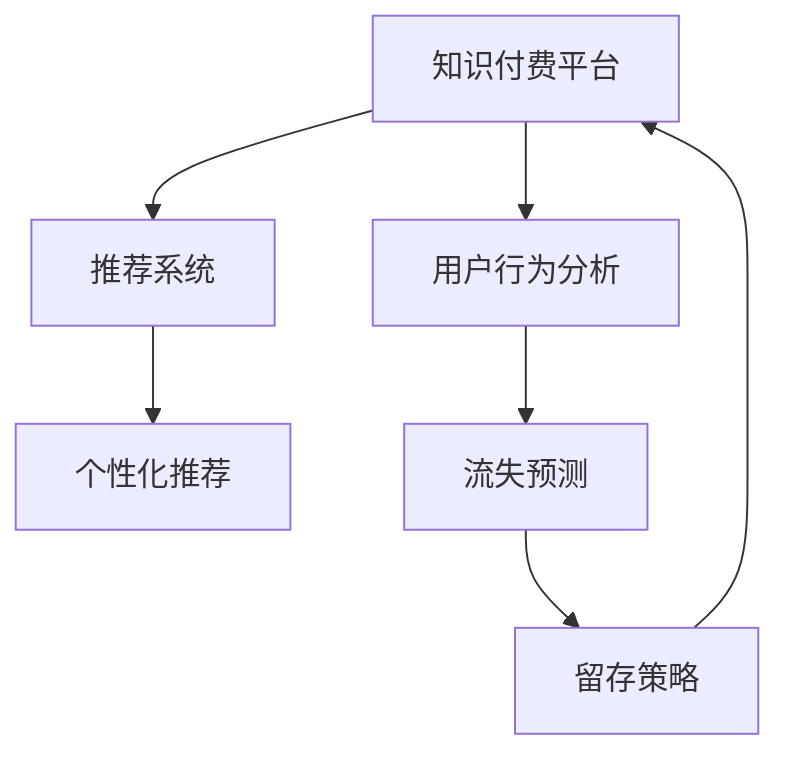

                 

# 如何提高知识付费产品的用户忠诚度

> 关键词：知识付费, 用户留存, 推荐系统, 个性化推荐, 行为数据分析

## 1. 背景介绍

随着知识经济时代的到来，知识付费成为了一种新型的经济模式，通过将专业知识和信息商品化，满足用户多样化的学习需求。然而，知识的获取并非一蹴而就，而是需要用户持续不断地学习和投入。如何在激烈的市场竞争中，提高知识付费产品的用户忠诚度，已成为众多知识付费平台需要重点关注的课题。

### 1.1 问题由来

知识付费平台面临着两大挑战：一是内容同质化问题，用户难以找到高质量、差异化的内容。二是用户流失率高，用户难以长时间持续购买订阅。如何提升用户忠诚度，成为平台高质量运营的关键。

### 1.2 问题核心关键点

提升知识付费产品用户忠诚度，需要从用户行为和内容推荐两个维度进行深入分析，并采取针对性措施。核心在于构建有效的推荐系统，根据用户的阅读行为、消费偏好等数据，生成个性化的推荐内容，使用户始终保持对平台的兴趣和依赖。

## 2. 核心概念与联系

### 2.1 核心概念概述

为更好地理解如何提升知识付费产品的用户忠诚度，本节将介绍几个关键概念：

- 知识付费：通过付费形式获取专业知识的经济模式，如在线课程、电子书、专业咨询等。

- 推荐系统：利用用户历史行为数据，为用户推荐感兴趣的内容或产品，提升用户体验和满意度。

- 个性化推荐：根据用户个体特征，推荐个性化的内容，提升用户黏性和活跃度。

- 行为数据分析：对用户的行为数据（如访问记录、浏览时间、购买行为等）进行分析，获取用户兴趣和需求。

- 流失预测：通过对用户行为和属性的分析，预测用户流失的可能性，采取相应措施。

这些核心概念之间的逻辑关系可以通过以下Mermaid流程图来展示：



这个流程图展示了几者之间的关系：

1. 用户行为分析：通过收集和分析用户数据，掌握用户的行为特征和需求。
2. 推荐系统：根据用户的行为特征，为用户推荐个性化的内容或产品。
3. 个性化推荐：进一步提升推荐精准度，增加用户的满意度和黏性。
4. 流失预测：预测用户流失风险，提前采取措施避免用户流失。
5. 留存策略：针对不同用户，设计差异化的留存策略，提升用户忠诚度。

## 3. 核心算法原理 & 具体操作步骤

### 3.1 算法原理概述

提升知识付费产品用户忠诚度的核心在于构建一个高效、精准的推荐系统，使用户始终保持对平台的兴趣和依赖。推荐系统的核心算法包括协同过滤、基于内容的推荐、矩阵分解等，本文主要介绍基于用户行为数据的协同过滤算法。

协同过滤算法分为基于用户的协同过滤和基于物品的协同过滤两种，这里介绍基于用户的协同过滤算法。其基本思想是根据用户对物品的评分数据，找到与目标用户兴趣相似的用户，进而推荐该用户评分高的未评物品。具体流程如下：

1. 用户画像构建：收集用户的浏览、购买、评分等行为数据，构建用户画像。
2. 相似度计算：计算目标用户与其他用户之间的相似度，筛选出与目标用户兴趣相似的用户集合。
3. 推荐生成：根据相似用户对物品的评分，生成目标用户可能感兴趣的物品列表。

### 3.2 算法步骤详解

基于用户的协同过滤算法的详细步骤：

**Step 1: 数据收集与预处理**
- 收集用户行为数据，包括浏览记录、评分记录、购买记录等。
- 对数据进行清洗和预处理，如去除异常数据、处理缺失值等。

**Step 2: 用户画像构建**
- 根据用户行为数据，生成用户的兴趣特征向量。如某用户常看某类型课程，则该用户在该类型课程的特征向量中对应位置取1。
- 将用户画像表示为矩阵形式，每个用户一行，每个特征一个列。

**Step 3: 相似度计算**
- 计算用户之间的相似度。常用的相似度计算方法包括余弦相似度、皮尔逊相关系数等。
- 选择与目标用户相似度较高的用户，构建相似用户集合。

**Step 4: 推荐生成**
- 根据相似用户对物品的评分，生成目标用户的推荐列表。如某用户A与用户B相似，且用户B对物品X评分较高，则推荐物品X给用户A。
- 根据相似度大小和物品评分计算推荐物品的权重，生成推荐列表。

**Step 5: 推荐更新与迭代**
- 定期更新用户画像和相似度矩阵，保持推荐系统的准确性和及时性。
- 对推荐结果进行A/B测试，优化算法参数，提升推荐效果。

### 3.3 算法优缺点

基于用户行为的协同过滤算法具有以下优点：

- 无需标注数据，只需用户行为数据即可构建推荐模型。
- 能够发现用户潜在的兴趣点，提升推荐多样性和个性化。
- 简单易懂，实现难度较低，工程上易于部署。

但该算法也存在一些局限性：

- 对新用户的推荐准确度较低，因为缺少历史行为数据。
- 数据稀疏性问题，部分用户行为数据较少，难以构建准确的相似度矩阵。
- 计算复杂度较高，尤其是在数据量较大时。

### 3.4 算法应用领域

基于用户行为的协同过滤算法，在知识付费平台的用户推荐中具有广泛应用。通过分析用户的行为数据，能够实现课程的精准推荐，使用户能够快速找到感兴趣的内容，提升用户留存率和消费转化率。该算法还能够用于个性化内容推荐，如书籍、文章、视频等，提升平台的整体用户满意度和活跃度。

## 4. 数学模型和公式 & 详细讲解  
### 4.1 数学模型构建

本节将使用数学语言对基于用户行为数据的协同过滤算法进行更加严格的刻画。

假设用户画像矩阵为 $U_{m \times n}$，其中 $m$ 为用户数，$n$ 为特征数。设用户 $u$ 的特征向量为 $u \in \mathbb{R}^n$，用户 $u$ 和用户 $v$ 的相似度为 $s_{uv}$，相似度矩阵为 $S_{m \times m}$。

**Step 1: 用户画像构建**
用户画像矩阵 $U$ 表示为：
$$
U = \left[ u_1, u_2, \ldots, u_m \right]^T
$$

**Step 2: 相似度计算**
余弦相似度公式为：
$$
s_{uv} = \cos \theta = \frac{u \cdot v}{\|u\|\|v\|}
$$

**Step 3: 推荐生成**
根据相似度矩阵 $S$，生成用户 $u$ 对物品 $i$ 的评分 $p_{ui}$ 为：
$$
p_{ui} = \sum_{v \in \mathcal{V}} s_{uv} * R_{vi}
$$

其中 $R_{vi}$ 为用户 $v$ 对物品 $i$ 的评分，$\mathcal{V}$ 为相似用户集合。

### 4.2 公式推导过程

在用户画像构建阶段，将用户行为数据转化为特征向量，可以采用如下方法：

- 行为统计：对用户的浏览、购买、评分等行为进行统计，计算各类行为占比。
- 特征映射：将统计结果映射到高维空间，生成用户特征向量。如用户 $u$ 常看课程 $C$，则特征向量 $u_C$ 中对应位置取1。

在相似度计算阶段，余弦相似度公式的推导如下：

设用户 $u$ 和用户 $v$ 的特征向量为 $u, v \in \mathbb{R}^n$，则余弦相似度为：
$$
\cos \theta = \frac{u \cdot v}{\|u\|\|v\|}
$$

在推荐生成阶段，根据相似度矩阵 $S$，生成用户 $u$ 对物品 $i$ 的评分 $p_{ui}$，可以采用矩阵乘法求解：

设用户 $v$ 对物品 $i$ 的评分向量为 $R_i \in \mathbb{R}^m$，则推荐评分公式为：
$$
p_{ui} = \sum_{v \in \mathcal{V}} s_{uv} * R_{vi}
$$

### 4.3 案例分析与讲解

以某知识付费平台为例，分析协同过滤算法在推荐系统中的应用。

1. 数据收集：平台记录用户访问、购买、评分等行为数据，形成用户画像矩阵 $U$ 和物品评分矩阵 $R$。

2. 用户画像构建：对用户画像矩阵 $U$ 进行特征映射，生成用户特征向量 $u$。

3. 相似度计算：根据余弦相似度公式，计算用户 $u$ 与其他用户 $v$ 的相似度 $s_{uv}$。

4. 推荐生成：根据相似度矩阵 $S$ 和物品评分矩阵 $R$，计算用户 $u$ 对物品 $i$ 的推荐评分 $p_{ui}$。

5. 推荐更新：定期更新用户画像和相似度矩阵，优化推荐结果。

通过上述过程，平台能够根据用户行为数据，为用户推荐个性化的课程和内容，提升用户满意度和留存率。

## 5. 项目实践：代码实例和详细解释说明
### 5.1 开发环境搭建

在进行推荐系统开发前，我们需要准备好开发环境。以下是使用Python进行推荐系统开发的常见环境配置流程：

1. 安装Anaconda：从官网下载并安装Anaconda，用于创建独立的Python环境。

2. 创建并激活虚拟环境：
```bash
conda create -n recommendation-env python=3.8 
conda activate recommendation-env
```

3. 安装推荐系统所需库：
```bash
conda install scikit-learn pandas numpy joblib tqdm scikit-cluster joblib -c conda-forge
```

4. 安装优化库：
```bash
pip install pyflink
```

完成上述步骤后，即可在`recommendation-env`环境中开始推荐系统实践。

### 5.2 源代码详细实现

这里我们以协同过滤算法为例，给出使用Python实现的推荐系统代码示例。

首先，定义推荐系统的相关类和函数：

```python
import numpy as np
from sklearn.metrics.pairwise import cosine_similarity
from scipy.sparse import csr_matrix

class RecommendationSystem:
    def __init__(self, user_num, item_num, similarity_method='cosine'):
        self.user_num = user_num
        self.item_num = item_num
        self.similarity_matrix = None
        self.item_ratings = None
        self.similarity_method = similarity_method
    
    def fit(self, user_data, item_data):
        self.user_ratings = np.zeros((self.user_num, self.item_num))
        self.similarity_matrix = np.zeros((self.user_num, self.user_num))
        
        for user, items in user_data.items():
            for item, rating in items.items():
                self.user_ratings[user, item] = rating
                self.similarity_matrix[user, user] = 1
        
        for user in range(self.user_num):
            for other_user in range(self.user_num):
                if user != other_user:
                    self.similarity_matrix[user, other_user] = self.calculate_similarity(user, other_user)
        
        self.item_ratings = np.transpose(self.user_ratings)
    
    def calculate_similarity(self, user1, user2):
        user1_ratings = self.user_ratings[user1]
        user2_ratings = self.user_ratings[user2]
        similarity = cosine_similarity([user1_ratings], [user2_ratings])[0][0]
        return similarity
    
    def recommend(self, user, top_n=10):
        similar_users = self.get_similar_users(user)
        item_ratings = self.item_ratings[similar_users]
        scores = self.similarity_matrix[user, :]
        scores = scores * item_ratings
        scores /= np.max(scores)
        return np.argsort(-scores)[1:top_n+1]
```

然后，准备推荐系统所需的数据：

```python
# 用户数据
user_data = {
    1: {'item1': 4, 'item2': 3, 'item3': 1},
    2: {'item2': 5, 'item3': 4},
    3: {'item1': 2, 'item3': 2}
}

# 物品数据
item_data = {
    'item1': 4,
    'item2': 2,
    'item3': 3
}

# 创建推荐系统实例
recommender = RecommendationSystem(user_num=3, item_num=3, similarity_method='cosine')

# 训练推荐系统
recommender.fit(user_data, item_data)

# 推荐物品
recommended_items = recommender.recommend(user=1, top_n=2)
print(recommended_items)
```

### 5.3 代码解读与分析

让我们再详细解读一下关键代码的实现细节：

**RecommendationSystem类**：
- `__init__`方法：初始化推荐系统的用户数、物品数，并创建用户-用户相似度矩阵和物品评分矩阵。
- `fit`方法：根据用户行为数据，训练推荐系统模型，计算用户-用户相似度矩阵和物品评分矩阵。
- `calculate_similarity`方法：根据指定用户计算与目标用户之间的相似度。
- `recommend`方法：根据相似用户和物品评分，生成目标用户推荐物品列表。

**user_data和item_data**：
- 定义了用户行为数据和物品评分数据，分别记录用户的浏览、购买等行为，以及物品的评分。

**recommender实例**：
- 创建推荐系统实例，并指定用户数、物品数和相似度计算方法。
- 调用`fit`方法训练推荐系统模型，调用`recommend`方法生成推荐结果。

在实际应用中，还需要对推荐系统进行更深入的优化和扩展，如引入多模态信息、使用更高级的推荐算法、增加推荐的时效性等。但核心的协同过滤算法思路基本与此类似。

## 6. 实际应用场景
### 6.1 智能教育

智能教育领域，知识付费平台可以应用推荐系统，为学生推荐个性化的学习资源，提升学习效果。平台通过收集学生的学习行为数据，分析学生的兴趣偏好和学习进度，生成个性化的课程推荐，帮助学生高效学习。同时，推荐系统还可以预测学生的学习困难和问题，及时提供相应的解决方案，提升学生的学习体验和满意度。

### 6.2 金融投资

金融投资领域，知识付费平台可以应用推荐系统，为投资者推荐个性化的投资策略和知识课程，提升投资决策的科学性和有效性。平台通过分析投资者的历史投资行为和偏好，生成个性化的投资建议和课程推荐，帮助投资者快速掌握投资技能，提高投资收益。同时，推荐系统还可以预测市场的波动和风险，提供相应的风险控制建议，降低投资风险。

### 6.3 医疗健康

医疗健康领域，知识付费平台可以应用推荐系统，为患者推荐个性化的医疗咨询和健康管理方案，提升患者对疾病的认知和治疗效果。平台通过分析患者的病史和健康数据，生成个性化的健康建议和医疗咨询推荐，帮助患者科学管理健康，提高生活质量。同时，推荐系统还可以预测患者的病情变化和并发症风险，提供相应的预防和治疗建议，提升患者治疗体验和满意度。

## 7. 工具和资源推荐
### 7.1 学习资源推荐

为了帮助开发者系统掌握推荐系统的理论基础和实践技巧，这里推荐一些优质的学习资源：

1. 《推荐系统实战》系列博文：由推荐系统领域专家撰写，深入浅出地介绍了推荐系统的基本概念和算法，包括协同过滤、矩阵分解等。

2. CS 241《机器学习》课程：斯坦福大学开设的推荐系统经典课程，有Lecture视频和配套作业，带你入门推荐系统领域的基本概念和经典算法。

3. 《推荐系统：算法与应用》书籍：全面介绍了推荐系统的理论基础和实际应用，包括协同过滤、矩阵分解、深度学习等。

4. 维基百科推荐系统词条：提供了大量推荐系统的经典算法和实际应用案例，是快速了解推荐系统的好资源。

5. Coursera《Recommender Systems》课程：由John Sargent等专家教授，讲解推荐系统的经典算法和最新研究进展，适合初学者和进阶者。

通过对这些资源的学习实践，相信你一定能够快速掌握推荐系统的精髓，并用于解决实际的推荐问题。

### 7.2 开发工具推荐

高效的开发离不开优秀的工具支持。以下是几款用于推荐系统开发的常用工具：

1. PyTorch：基于Python的开源深度学习框架，灵活动态的计算图，适合快速迭代研究。适合构建推荐系统的基础模型。

2. TensorFlow：由Google主导开发的开源深度学习框架，生产部署方便，适合大规模工程应用。适合构建推荐系统的复杂模型。

3. Scikit-learn：Python的机器学习库，提供了丰富的数据处理和机器学习算法，适合构建推荐系统的算法模块。

4. Pandas：Python的数据分析库，支持大规模数据处理和数据清洗，适合构建推荐系统的数据处理模块。

5. Hadoop：Apache的分布式数据处理框架，适合处理大规模数据集，适合构建推荐系统的分布式推荐系统。

合理利用这些工具，可以显著提升推荐系统的开发效率，加快创新迭代的步伐。

### 7.3 相关论文推荐

推荐系统的发展源于学界的持续研究。以下是几篇奠基性的相关论文，推荐阅读：

1. BPR: Bayesian Personalized Ranking from Implicit Feedback：提出了基于隐式反馈的协同过滤算法，优化了推荐系统的准确性和效果。

2. Matrix Factorization Techniques for Recommender Systems：综述了矩阵分解算法的理论基础和实际应用，是推荐系统领域的经典论文。

3. collaborative filtering for implicit feedback datasets：总结了协同过滤算法的多种实现方法，为推荐系统的算法选择提供了参考。

4. Deep Neural Networks for Recommender Systems：引入了深度学习技术，提升了推荐系统的准确性和多样性。

5. Beyond Matrix Factorization: A Canonical Tensor Factorization Framework for Recommender Systems：提出了张量分解方法，提升了推荐系统的扩展性和可解释性。

这些论文代表了大数据推荐系统的发展脉络。通过学习这些前沿成果，可以帮助研究者把握学科前进方向，激发更多的创新灵感。

## 8. 总结：未来发展趋势与挑战

### 8.1 总结

本文对知识付费产品用户忠诚度的提升方法进行了全面系统的介绍。首先阐述了用户忠诚度的重要性，明确了推荐系统在提升用户忠诚度中的核心作用。其次，从算法原理和具体操作步骤两个方面，详细讲解了基于用户行为数据的协同过滤算法，并给出了推荐系统的完整代码实例。同时，本文还广泛探讨了推荐系统在智能教育、金融投资、医疗健康等多个行业领域的应用前景，展示了推荐系统的巨大潜力。

通过本文的系统梳理，可以看到，基于用户行为的协同过滤算法在推荐系统中的应用具有广泛的前景，能够有效地提升知识付费产品的用户忠诚度。推荐系统能够根据用户行为数据，生成个性化的内容推荐，使用户始终保持对平台的兴趣和依赖。未来，伴随推荐算法的持续演进，相信推荐系统必将在更多领域带来变革性影响。

### 8.2 未来发展趋势

展望未来，推荐系统将呈现以下几个发展趋势：

1. 推荐模型更加多样。未来的推荐系统将不再局限于协同过滤算法，将引入更多的推荐模型，如基于内容的推荐、基于深度学习的推荐、基于模型的推荐等，实现推荐结果的多样化和准确性。

2. 推荐系统的个性化提升。未来的推荐系统将更加注重用户的个体特征和行为差异，通过多种数据源融合，生成更加个性化、精准的推荐结果。

3. 推荐系统的实时性提升。未来的推荐系统将实现更高的处理速度和响应时间，实时根据用户行为生成推荐结果，提升用户体验。

4. 推荐系统的可解释性增强。未来的推荐系统将更加注重算法的可解释性和透明性，帮助用户理解推荐结果的来源和生成机制。

5. 推荐系统的应用场景扩展。未来的推荐系统将覆盖更多应用场景，如智能家居、智能交通、智能医疗等，提升各种应用场景下的用户体验和满意度。

以上趋势凸显了推荐系统技术的广阔前景。这些方向的探索发展，必将进一步提升推荐系统的性能和应用范围，为知识付费产品的用户忠诚度提升带来新的突破。

### 8.3 面临的挑战

尽管推荐系统已经取得了瞩目成就，但在迈向更加智能化、普适化应用的过程中，它仍面临着诸多挑战：

1. 数据稀疏性问题。推荐系统往往需要大量用户行为数据才能发挥效果，但在实际应用中，数据往往存在稀疏性，难以构建准确的相似度矩阵。

2. 推荐系统的公平性。推荐系统容易出现推荐结果的偏见和歧视，特别是对于少数群体的推荐，可能造成不公平现象。如何提升推荐系统的公平性，是未来需要解决的问题。

3. 推荐系统的可解释性。推荐系统的推荐结果往往难以解释，特别是在深度学习模型中，用户难以理解推荐机制的来源。如何提升推荐系统的可解释性，将是一个重要的研究方向。

4. 推荐系统的实时性。推荐系统需要快速响应用户的行为变化，生成实时的推荐结果。如何实现高处理速度和低延迟，是未来需要解决的问题。

5. 推荐系统的安全性。推荐系统需要处理大量用户数据，如何确保数据的安全性和隐私保护，是未来需要解决的问题。

6. 推荐系统的通用性。推荐系统需要适应不同领域和不同数据类型的推荐任务，如何构建通用推荐系统，是未来需要解决的问题。

以上挑战凸显了推荐系统技术的复杂性和挑战性，但正是这些挑战推动了推荐系统技术的不断进步和创新。相信随着学界和产业界的共同努力，推荐系统必将在各个应用场景中发挥更大的作用，提升知识付费产品的用户忠诚度。

### 8.4 研究展望

面对推荐系统所面临的挑战，未来的研究需要在以下几个方面寻求新的突破：

1. 探索多源数据的融合方法。除了用户行为数据，推荐系统可以引入更多数据源，如社交网络数据、地理位置数据、时间序列数据等，提升推荐结果的多样性和准确性。

2. 引入更多先验知识。将符号化的先验知识，如知识图谱、逻辑规则等，与神经网络模型进行巧妙融合，引导推荐过程学习更准确、合理的推荐模型。

3. 引入因果推断方法。将因果推断方法引入推荐系统，识别出用户推荐的关键特征和机制，增强推荐结果的解释性和可信度。

4. 引入强化学习。将强化学习思想引入推荐系统，通过奖励机制和反馈机制，优化推荐模型的性能。

5. 引入联邦学习。在保护用户隐私的前提下，通过分布式学习提升推荐系统的精度和可解释性。

6. 引入对抗学习。通过对抗学习技术，提升推荐系统的鲁棒性和抗干扰能力。

这些研究方向的探索，必将引领推荐系统技术迈向更高的台阶，为知识付费产品的用户忠诚度提升提供新的解决方案。面向未来，推荐系统需要与其他人工智能技术进行更深入的融合，多路径协同发力，共同推动推荐系统技术的进步。只有勇于创新、敢于突破，才能不断拓展推荐系统的边界，让推荐系统技术更好地造福用户。

## 9. 附录：常见问题与解答

**Q1：推荐系统的推荐结果如何评估？**

A: 推荐系统的推荐结果可以通过多种指标进行评估，包括准确率、召回率、F1值、均方根误差等。具体来说：

- 准确率：推荐系统正确推荐的物品数占总推荐物品数的比例。
- 召回率：推荐系统正确推荐的物品数占真实正样本物品数的比例。
- F1值：准确率和召回率的调和平均数，综合评估推荐系统的准确性和全面性。
- 均方根误差：推荐系统预测评分与真实评分之间的平均误差，评估推荐系统对评分数据拟合的准确性。

在实际应用中，通常结合多个指标进行评估，综合判断推荐系统的性能。

**Q2：推荐系统的冷启动问题如何解决？**

A: 冷启动问题是指新用户或新物品在推荐系统中没有足够的历史数据，难以获得准确的推荐结果。推荐系统可以通过以下方法解决冷启动问题：

- 基于内容的推荐：根据物品的特征信息，对新物品进行推荐，如电影推荐中的电影分类、演员等信息。
- 基于协同过滤的推荐：使用物品之间的相似度信息，对新物品进行推荐，如新加入用户对已存在用户的推荐。
- 基于混合推荐的推荐：结合基于内容的推荐和基于协同过滤的推荐，综合生成推荐结果。

**Q3：推荐系统如何应对用户行为的变化？**

A: 推荐系统需要根据用户行为的变化，实时更新推荐结果。推荐系统可以通过以下方法应对用户行为的变化：

- 实时更新用户画像和相似度矩阵：定期更新用户画像和相似度矩阵，保证推荐结果的时效性和准确性。
- 引入时间序列模型：使用时间序列模型，对用户行为进行预测和分析，生成动态推荐结果。
- 引入在线学习算法：使用在线学习算法，实时更新推荐模型，提升推荐结果的实时性和鲁棒性。

**Q4：推荐系统如何平衡多样性和准确性？**

A: 推荐系统需要平衡推荐结果的多样性和准确性，以提升用户体验。推荐系统可以通过以下方法平衡两者：

- 调整模型参数：通过调整模型参数，控制推荐结果的准确性和多样性，如引入噪声等。
- 引入多目标优化：使用多目标优化算法，同时最大化推荐结果的准确性和多样性。
- 引入双臂强盗算法：通过双臂强盗算法，在多个推荐策略中选取最优策略，实现多样性和准确性的平衡。

**Q5：推荐系统如何应对负反馈？**

A: 推荐系统需要根据用户的负反馈，及时调整推荐结果，避免推荐结果对用户产生负面影响。推荐系统可以通过以下方法应对负反馈：

- 实时调整推荐策略：根据用户的负反馈，实时调整推荐策略，重新计算推荐结果。
- 引入逆推荐算法：使用逆推荐算法，找出导致负反馈的物品，并对其进行降权或剔除。
- 引入正负样本均衡算法：平衡推荐结果中的正样本和负样本，提升推荐结果的准确性。

通过这些措施，推荐系统能够更好地应对用户行为的变化和负反馈，提升用户体验和满意度。

---

作者：禅与计算机程序设计艺术 / Zen and the Art of Computer Programming

