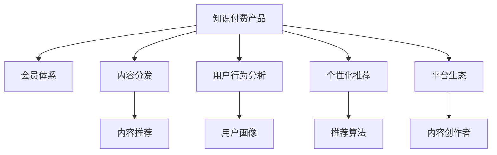

                 

## 1. 背景介绍

### 1.1 问题由来
随着知识付费行业的快速发展，越来越多的平台开始涌现，试图为用户提供差异化、高价值的服务。然而，由于会员体系设计不当，导致用户流失严重、付费转化率低，甚至导致平台商业模式无法持续。

### 1.2 问题核心关键点
会员体系的设计是知识付费产品的核心，决定了平台的收入模式、用户粘性、市场竞争力。会员体系的设计不仅包括会员类型、价格策略、内容分发等核心模块，还需要考虑用户行为分析、个性化推荐、平台生态等多个维度。

### 1.3 问题研究意义
优化会员体系，有助于提升平台用户满意度、增加用户粘性、提高转化率，同时通过精准推送提升用户留存率。更重要的是，合理的会员体系可以丰富平台收入结构，降低平台运营风险，提升平台市场竞争力。

## 2. 核心概念与联系

### 2.1 核心概念概述

为更好地理解知识付费产品会员体系的设计方法，本节将介绍几个密切相关的核心概念：

- **知识付费产品**：基于互联网的，用户为获取知识而支付费用的平台和服务。常见的形式包括在线课程、电子书、知识问答等。
- **会员体系**：用户付费后获得的会员身份和权益，包括内容访问、会员专属功能、社群活动等。
- **内容分发**：根据用户行为和偏好，将优质内容推送给用户的过程。
- **用户行为分析**：通过分析用户在平台上的浏览、学习、购买等行为，发现用户需求，指导内容推荐和会员体系设计。
- **个性化推荐**：基于用户行为数据，推荐个性化的内容和服务，提升用户粘性和满意度。
- **平台生态**：用户、内容创作者、平台三方协同共生、互利共赢的平台环境。

这些核心概念之间的逻辑关系可以通过以下Mermaid流程图来展示：



这个流程图展示了几类核心概念之间的关系：

1. 知识付费产品以会员体系为核心，通过内容分发、用户行为分析、个性化推荐、平台生态等关键模块，提供高质量的用户体验。
2. 内容分发和个性化推荐是会员体系的基础，通过精准的内容推送，提高用户满意度，增加用户粘性。
3. 用户行为分析是会员体系设计的重要依据，通过深度分析用户行为数据，发现用户需求，指导内容推荐和会员体系设计。
4. 平台生态的构建能够进一步增强平台的竞争力和用户粘性，内容创作者和用户的协同共生，可以共同创造优质内容，提升平台价值。

## 3. 核心算法原理 & 具体操作步骤
### 3.1 算法原理概述

知识付费产品会员体系的设计，本质上是一个多目标优化问题，涉及用户满意度、内容丰富度、运营成本等多个因素。其核心思想是通过组合不同的会员类型、定价策略、内容分发方式，达到平台收入最大化、用户满意度最优化的目标。

形式化地，假设平台有 $M$ 种类型会员 $T_1, T_2, \cdots, T_M$，每种类型会员价格分别为 $P_1, P_2, \cdots, P_M$，每种类型会员的内容访问权限分别为 $C_1, C_2, \cdots, C_M$，目标是最小化平台运营成本 $C$，最大化用户满意度 $S$，其中：

$$
S = \sum_{i=1}^M \alpha_i S_i
$$

$$
C = \sum_{i=1}^M P_i C_i
$$

其中 $S_i$ 表示第 $i$ 种类型会员的用户满意度，$C_i$ 表示第 $i$ 种类型会员的用户获取成本（如营销、内容制作等），$\alpha_i$ 为不同会员类型的重要度系数。

### 3.2 算法步骤详解

设计知识付费产品会员体系的一般步骤如下：

**Step 1: 用户调研**
- 通过问卷调查、用户访谈等方式，获取用户对于会员类型、内容类型、价格策略等需求。
- 分析用户数据，了解用户行为模式和偏好，发现用户需求。

**Step 2: 设定会员类型**
- 根据用户调研结果，设定不同会员类型 $T_1, T_2, \cdots, T_M$，满足不同层次用户需求。
- 确定每种类型会员的价格和内容访问权限，设计相应的会员权益。

**Step 3: 设计内容分发策略**
- 基于用户行为分析，设计内容推荐算法，优化内容分发效率。
- 引入个性化推荐系统，根据用户偏好推荐优质内容。

**Step 4: 定价策略设计**
- 设定不同的定价策略，如单次购买、月度订阅、年度订阅等。
- 考虑不同会员类型的价格敏感度和会员转换率，设计合理的定价策略。

**Step 5: 实施与优化**
- 在平台上实施会员体系，并通过A/B测试等手段，优化会员类型、定价策略、内容分发等模块。
- 持续收集用户反馈，进行数据分析，优化会员体系设计。

### 3.3 算法优缺点

知识付费产品会员体系设计具有以下优点：
1. 用户粘性提升。通过个性化推荐和丰富多样的会员权益，提高用户满意度，增加用户粘性。
2. 平台收益增加。合理的会员体系设计可以丰富平台收入结构，降低平台运营风险。
3. 用户需求满足。通过会员体系设计，能够更好地满足不同用户需求，提升用户体验。
4. 内容分发效率提高。通过精准推荐算法，提升内容分发效率，优化用户体验。

同时，该方法也存在一些局限性：
1. 成本高。会员体系设计需要大量的用户调研和数据分析，成本较高。
2. 用户差异大。不同用户对会员类型和内容的需求差异较大，难以做到一视同仁。
3. 市场竞争激烈。面对其他平台的会员体系设计，需要不断优化和调整，才能保持竞争优势。
4. 用户流失风险。不合理的设计可能导致用户流失，影响平台收入。

尽管存在这些局限性，但就目前而言，知识付费产品会员体系设计仍然是一个值得深入探索的领域。未来相关研究的重点在于如何进一步降低设计和实施成本，提高设计效率，以及如何兼顾用户需求和平台收益，实现两者的平衡。

### 3.4 算法应用领域

知识付费产品会员体系设计已经在教育、金融、技术等多个领域得到了广泛应用，涵盖了在线课程、知识问答、财务管理等众多场景。

在教育领域，知识付费产品通过会员体系，提供高质量的在线课程和个性化学习方案，满足不同层次用户的学习需求，提高用户满意度和学习效率。

在金融领域，知识付费产品通过会员体系，提供专业的金融知识、投资策略、理财工具等，帮助用户提升理财能力，增加用户粘性。

在技术领域，知识付费产品通过会员体系，提供深度技术文章、开源项目、编程工具等，帮助技术爱好者提升技术能力，增加平台影响力。

除此之外，知识付费产品会员体系还被创新性地应用到更多场景中，如智慧健康、文化娱乐、旅游出行等，为相关领域的技术和内容创造者提供了新的机会。随着知识付费行业的不断发展，相信会员体系设计将会在更广阔的应用领域大放异彩。

## 4. 数学模型和公式 & 详细讲解 & 举例说明

### 4.1 数学模型构建

知识付费产品会员体系设计可以构建如下数学模型：

假设平台有 $M$ 种类型会员，每种类型会员价格分别为 $P_1, P_2, \cdots, P_M$，每种类型会员的内容访问权限分别为 $C_1, C_2, \cdots, C_M$，每种类型会员的用户获取成本分别为 $C_1, C_2, \cdots, C_M$。

目标是最小化平台运营成本 $C$，最大化用户满意度 $S$，其中：

$$
C = \sum_{i=1}^M P_i C_i
$$

$$
S = \sum_{i=1}^M \alpha_i S_i
$$

其中 $S_i$ 表示第 $i$ 种类型会员的用户满意度，$C_i$ 表示第 $i$ 种类型会员的用户获取成本。

### 4.2 公式推导过程

以单次购买会员为例，其价格和成本如下：

假设单次购买会员的价格为 $P$，用户获取成本为 $C$。

- 用户获取成本 $C$ 包括内容制作成本、营销推广成本等。
- 用户满意度 $S$ 为 $1-C$，即用户满意度的期望值为 $1$，用户越满意，满意度越高。

根据多目标优化理论，平台的目标是最大化用户满意度 $S$，最小化用户获取成本 $C$，因此：

$$
\max S = \max \sum_{i=1}^M \alpha_i (1-C_i)
$$

$$
\min C = \min \sum_{i=1}^M P_i C_i
$$

其中 $\alpha_i$ 表示不同类型会员的重要度系数。

### 4.3 案例分析与讲解

以在线教育平台为例，平台提供基础会员、中级会员、高级会员三种类型，其价格和内容访问权限如下：

| 会员类型 | 价格（元/月） | 内容访问权限 |
| --- | --- | --- |
| 基础会员 | 199 | 观看基础课程 |
| 中级会员 | 499 | 观看基础课程 + 观看进阶课程 |
| 高级会员 | 999 | 观看基础课程 + 观看进阶课程 + 参与社区活动 |

假设平台的基础会员用户获取成本为 $C_1=200$，中级会员用户获取成本为 $C_2=300$，高级会员用户获取成本为 $C_3=400$。

目标是最小化平台运营成本，最大化用户满意度。

根据公式推导，得到如下优化模型：

$$
\max S = \max \alpha_1 (1-C_1) + \alpha_2 (1-C_2) + \alpha_3 (1-C_3)
$$

$$
\min C = \min P_1 \times 200 + P_2 \times 300 + P_3 \times 400
$$

其中 $\alpha_i$ 表示不同类型会员的重要度系数，$P_i$ 表示第 $i$ 种类型会员的价格。

假设平台将基础会员的重要度系数设为 $\alpha_1=0.3$，中级会员的重要度系数设为 $\alpha_2=0.5$，高级会员的重要度系数设为 $\alpha_3=0.2$。

通过求解上述优化模型，可以得到最优的会员类型、定价策略和运营成本。

## 5. 项目实践：代码实例和详细解释说明
### 5.1 开发环境搭建

在进行会员体系设计实践前，我们需要准备好开发环境。以下是使用Python进行Django开发的环境配置流程：

1. 安装Anaconda：从官网下载并安装Anaconda，用于创建独立的Python环境。

2. 创建并激活虚拟环境：
```bash
conda create -n pyproject python=3.8 
conda activate pyproject
```

3. 安装Django：
```bash
pip install django
```

4. 安装相关库：
```bash
pip install django-crispy-forms django-compressor django-paypal payments django-git-clone django-celery-beat
```

5. 初始化Django项目：
```bash
django-admin startproject knowledge_payments
cd knowledge_payments
```

6. 创建App：
```bash
python manage.py startapp membership
```

完成上述步骤后，即可在`pyproject`环境中开始会员体系设计实践。

### 5.2 源代码详细实现

下面我们以在线教育平台为例，给出使用Django进行会员体系设计的代码实现。

首先，定义会员类型和价格：

```python
from django.contrib.auth.models import User
from django.db import models

class Membership(models.Model):
    name = models.CharField(max_length=50)
    price = models.DecimalField(max_digits=10, decimal_places=2)

    def __str__(self):
        return self.name
```

然后，定义用户模型和会员关系：

```python
class UserProfile(models.Model):
    user = models.OneToOneField(User, on_delete=models.CASCADE)
    membership = models.ForeignKey(Membership, on_delete=models.CASCADE)

    def __str__(self):
        return f'{self.user.username} - {self.membership.name}'
```

接着，定义会员权益和内容访问权限：

```python
class Content(models.Model):
    name = models.CharField(max_length=100)
    membership = models.ManyToManyField(Membership)

    def __str__(self):
        return self.name

class UserContent(models.Model):
    user = models.ForeignKey(User, on_delete=models.CASCADE)
    content = models.ForeignKey(Content, on_delete=models.CASCADE)

    def __str__(self):
        return f'{self.user.username} - {self.content.name}'
```

然后，定义会员管理界面：

```python
from django import forms
from django.urls import reverse
from django.views.generic.edit import FormView
from .models import Membership, Content

class MembershipForm(forms.ModelForm):
    class Meta:
        model = Membership
        fields = ['name', 'price']

class MembershipListView(FormView):
    template_name = 'membership/membership_list.html'
    form_class = MembershipForm

    def form_valid(self, form):
        membership = form.save()
        form = MembershipForm(request.POST)
        if form.is_valid():
            self.success_url = reverse('membership_list')
            return super()表单成功处理

        return self.render_to_response(form)
```

最后，定义会员权益和内容推荐界面：

```python
class ContentListView(FormView):
    template_name = 'membership/content_list.html'
    form_class = MembershipForm

    def form_valid(self, form):
        membership = form.save()
        form = MembershipForm(request.POST)
        if form.is_valid():
            self.success_url = reverse('content_list')
            return super()表单成功处理

        return self.render_to_response(form)

    def get_context_data(self, **kwargs):
        context = super()get_context_data(**kwargs)
        context['content'] = Content.objects.all()
        return context
```

### 5.3 代码解读与分析

让我们再详细解读一下关键代码的实现细节：

**Membership模型**：
- `name` 和 `price` 字段分别表示会员类型和价格。
- 通过 `str` 方法，方便在管理界面中显示会员类型。

**UserProfile模型**：
- `user` 和 `membership` 字段分别表示用户和会员类型，通过 `OneToOneField` 和 `ForeignKey` 实现一对一和一对多的关系。
- 通过 `str` 方法，方便在管理界面中显示用户和会员类型。

**Content模型**：
- `name` 字段表示内容名称，通过 `ManyToManyField` 与会员类型关联。
- 通过 `str` 方法，方便在管理界面中显示内容名称。

**UserContent模型**：
- `user` 和 `content` 字段分别表示用户和内容，通过 `OneToOneField` 和 `ForeignKey` 实现一对一的关系。
- 通过 `str` 方法，方便在管理界面中显示用户和内容名称。

**MembershipForm表单**：
- 定义了会员类型和价格的表单字段，通过 `Meta` 类指定模型和字段。
- 通过 `form_valid` 方法，保存表单数据并返回成功处理后的URL。

**MembershipListView视图**：
- 通过 `Template` 和 `FormView` 类，实现会员列表管理界面。
- 通过 `form_valid` 方法，保存表单数据并返回成功处理后的URL。

**ContentListView视图**：
- 通过 `Template` 和 `FormView` 类，实现内容列表管理界面。
- 通过 `form_valid` 方法，保存表单数据并返回成功处理后的URL。
- 通过 `get_context_data` 方法，获取内容列表并传递给模板。

可以看到，Django框架使得会员体系设计的开发变得简洁高效。开发者可以将更多精力放在数据模型设计和业务逻辑上，而不必过多关注底层的实现细节。

当然，工业级的系统实现还需考虑更多因素，如用户注册、登录、密码重置等，以及与支付系统的集成。但核心的会员体系设计基本与此类似。

## 6. 实际应用场景
### 6.1 教育平台

基于知识付费产品的会员体系设计，教育平台可以为用户提供多种会员类型，满足不同层次用户的学习需求。例如，基础会员提供基本课程观看权限，中级会员提供进阶课程和在线辅导权限，高级会员提供个性化学习方案和社区互动权限。

通过会员体系设计，教育平台可以优化课程内容推荐和用户学习路径，提高用户满意度和学习效率。同时，会员体系设计还可以丰富平台收入结构，降低平台运营风险，提升平台市场竞争力。

### 6.2 金融平台

在金融领域，知识付费产品会员体系可以为用户提供个性化的理财知识、投资策略和财务管理工具。例如，基础会员提供基础理财知识，中级会员提供进阶投资策略，高级会员提供一对一理财顾问服务。

通过会员体系设计，金融平台可以提升用户理财能力，增加用户粘性，同时通过增值服务提高平台收益。此外，会员体系设计还可以提供高质量的理财内容，满足不同用户对金融知识的需求。

### 6.3 技术平台

在技术领域，知识付费产品会员体系可以为用户提供深度技术文章、开源项目和编程工具。例如，基础会员提供基础编程工具和文章，中级会员提供进阶编程技术和开源项目，高级会员提供技术社区和一对一技术支持。

通过会员体系设计，技术平台可以提升用户编程能力，增加用户粘性，同时通过高价值内容提高平台收益。此外，会员体系设计还可以提供高质量的技术内容，满足不同用户对技术知识的需求。

### 6.4 未来应用展望

随着知识付费行业的发展，基于会员体系的产品将会在更多领域得到应用，为各行各业带来变革性影响。

在医疗领域，知识付费产品可以通过会员体系提供专业的健康知识、饮食建议和心理咨询服务，帮助用户提升健康水平，增加用户粘性。

在旅游领域，知识付费产品可以通过会员体系提供丰富的旅游攻略、当地文化介绍和旅游规划服务，帮助用户规划行程，提升旅游体验。

在文化娱乐领域，知识付费产品可以通过会员体系提供高质量的影视剧、音乐、图书等文化内容，满足用户的多样化娱乐需求，提升用户满意度和平台收益。

此外，在智慧城市、智能家居、智能制造等多个领域，基于知识付费产品的会员体系设计都将带来新的应用场景，推动技术进步和社会发展。

## 7. 工具和资源推荐
### 7.1 学习资源推荐

为了帮助开发者系统掌握知识付费产品会员体系的设计方法，这里推荐一些优质的学习资源：

1. 《会员体系设计手册》系列博文：由知识付费产品技术专家撰写，系统介绍了会员体系设计的原理、方法和实践，深入浅出地讲解了各类问题及解决方案。

2. 《知识付费平台》课程：由知识付费领域知名讲师开设的课程，涵盖会员体系、内容推荐、用户分析等多个模块，适合从零开始的开发者学习。

3. 《知识付费产品设计与开发》书籍：全面介绍了知识付费产品的设计与开发方法，包括会员体系设计、内容推荐、用户体验等核心模块。

4. 《知识付费平台实战指南》博客：一线开发者经验分享，提供大量实际案例和代码示例，帮助开发者快速上手会员体系设计。

5. Kaggle会员体系设计竞赛：参加Kaggle竞赛，通过实战演练提升会员体系设计的技术水平，积累项目经验。

通过对这些资源的学习实践，相信你一定能够快速掌握知识付费产品会员体系设计的精髓，并用于解决实际的业务问题。

### 7.2 开发工具推荐

高效的开发离不开优秀的工具支持。以下是几款用于知识付费产品会员体系设计的常用工具：

1. Django：基于Python的Web框架，灵活的ORM设计，便于快速迭代开发。

2. Flask：基于Python的轻量级Web框架，适合开发中小规模应用。

3. FastAPI：基于Python的Web框架，高性能、轻量级，适合大规模应用。

4. SQLAlchemy：Python的ORM框架，方便进行数据库操作和数据模型设计。

5. Celery：Python的异步任务队列框架，方便进行任务异步处理和扩展。

6. Redis：高可用、高性能的数据缓存系统，适合进行用户行为数据分析和个性化推荐。

合理利用这些工具，可以显著提升知识付费产品会员体系设计的开发效率，加快创新迭代的步伐。

### 7.3 相关论文推荐

知识付费产品会员体系设计的研究方向涉及多个领域，以下是几篇奠基性的相关论文，推荐阅读：

1. "User-Centered Design of Membership Systems in E-commerce"：探讨了电子商务平台会员体系设计的用户中心化方法。

2. "Personalization in E-learning: A Study of Video Streaming Services"：研究了在线教育平台会员体系设计的个性化推荐算法。

3. "A Survey on User Modeling in E-Learning"：综述了在线教育平台会员体系设计中的用户建模方法。

4. "A Model-Based Approach for User Modeling in Recommendation Systems"：介绍了基于模型的推荐系统设计方法，适用于会员体系设计中的个性化推荐。

5. "A Comparative Study of Membership Models in E-commerce"：对比分析了不同会员模型的优缺点，为会员体系设计提供了理论依据。

这些论文代表了大语言模型微调技术的不断发展。通过学习这些前沿成果，可以帮助研究者把握学科前进方向，激发更多的创新灵感。

## 8. 总结：未来发展趋势与挑战

### 8.1 总结

本文对知识付费产品会员体系的设计方法进行了全面系统的介绍。首先阐述了知识付费产品的背景和会员体系设计的核心关键点，明确了会员体系设计在提升用户满意度、增加平台收益、优化内容分发等方面的重要价值。其次，从原理到实践，详细讲解了会员体系设计的数学模型和关键步骤，给出了会员体系设计实践的代码实现。同时，本文还广泛探讨了会员体系在教育、金融、技术等多个领域的应用前景，展示了会员体系设计的广阔应用场景。

通过本文的系统梳理，可以看到，知识付费产品会员体系设计正在成为平台用户服务的重要手段，极大地提升了用户体验和平台竞争力。未来，随着会员体系设计的不断优化和深入，知识付费产品必将在更多领域得到应用，为各行各业带来变革性影响。

### 8.2 未来发展趋势

展望未来，知识付费产品会员体系设计将呈现以下几个发展趋势：

1. 数据驱动。基于用户行为数据分析和推荐算法优化，会员体系设计将更加个性化、精准化。
2. 智能推荐。通过引入智能推荐系统，提升内容分发效率，优化用户体验。
3. 社交互动。引入社交功能，增强用户粘性，提升社区互动效果。
4. 场景拓展。拓展至更多垂直领域，如医疗、金融、旅游等，提升平台应用价值。
5. 跨平台整合。整合不同平台的用户数据和行为信息，实现统一的用户画像，提升平台价值。
6. 生态协同。通过引入内容创作者和用户社区，构建平台生态，实现多方共赢。

这些趋势凸显了知识付费产品会员体系设计的广阔前景。这些方向的探索发展，必将进一步提升平台的竞争力，为更多行业带来变革性影响。

### 8.3 面临的挑战

尽管知识付费产品会员体系设计已经取得了瞩目成就，但在迈向更加智能化、普适化应用的过程中，它仍面临着诸多挑战：

1. 数据隐私。会员体系设计涉及大量用户数据，如何保护用户隐私，避免数据泄露，是必须面对的问题。
2. 用户体验。如何在提供丰富会员权益的同时，避免用户付费体验不佳，是会员体系设计的重要挑战。
3. 市场竞争。面对其他平台的会员体系设计，需要不断优化和调整，才能保持竞争优势。
4. 技术壁垒。会员体系设计涉及多学科知识，包括数据科学、产品设计、市场营销等，需要多方面协同合作。
5. 用户需求变化。用户需求不断变化，如何及时调整会员体系设计，满足用户需求，是长期挑战。

尽管存在这些挑战，但知识付费产品会员体系设计仍然是一个值得深入探索的领域。未来相关研究的重点在于如何进一步降低设计和实施成本，提高设计效率，以及如何兼顾用户需求和平台收益，实现两者的平衡。

### 8.4 研究展望

面对知识付费产品会员体系设计所面临的种种挑战，未来的研究需要在以下几个方面寻求新的突破：

1. 数据隐私保护。引入区块链、联邦学习等技术，保护用户隐私，确保数据安全。
2. 用户体验优化。引入用户行为分析，优化个性化推荐，提升付费体验。
3. 市场竞争应对。通过不断的A/B测试和数据分析，优化会员体系设计，提升市场竞争力。
4. 技术协同合作。跨学科合作，引入专家知识，提升技术水平。
5. 用户需求预测。通过机器学习和深度学习，预测用户需求，及时调整会员体系设计。

这些研究方向的探索，必将引领知识付费产品会员体系设计走向更高的台阶，为构建更加智能化、普适化、安全可靠的用户服务体系铺平道路。面向未来，知识付费产品会员体系设计需要与其他人工智能技术进行更深入的融合，如自然语言处理、计算机视觉等，多路径协同发力，共同推动知识付费技术的进步。只有勇于创新、敢于突破，才能不断拓展知识付费产品会员体系设计的边界，让知识付费技术更好地造福人类社会。

## 9. 附录：常见问题与解答

**Q1：会员体系设计的核心要素有哪些？**

A: 会员体系设计的核心要素包括会员类型、价格策略、内容分发、个性化推荐等。通过合理设计这些要素，可以最大化用户满意度，最小化运营成本，优化平台收益。

**Q2：如何进行会员体系的数据分析？**

A: 会员体系的数据分析需要关注用户行为数据，如浏览历史、购买记录、评分反馈等。通过数据分析，可以发现用户需求，指导会员体系设计。常见的数据分析方法包括聚类分析、关联分析、预测分析等。

**Q3：如何优化个性化推荐算法？**

A: 个性化推荐算法的优化需要关注推荐效果、用户满意度、运营成本等多个因素。常见的优化方法包括引入深度学习模型、优化推荐模型参数、引入反馈机制等。

**Q4：如何进行会员体系的设计迭代？**

A: 会员体系的设计迭代需要关注用户反馈、市场变化、技术进展等多个因素。常见的迭代方法包括A/B测试、用户调研、数据分析等。通过不断迭代，可以优化会员体系设计，提升用户体验和平台收益。

**Q5：会员体系设计的未来方向有哪些？**

A: 会员体系设计的未来方向包括数据驱动、智能推荐、社交互动、场景拓展、跨平台整合、生态协同等。通过不断探索这些方向，可以进一步提升平台的竞争力，为更多行业带来变革性影响。

总之，知识付费产品会员体系设计是一个涉及多学科知识、多领域应用的复杂系统工程。只有不断探索和优化，才能打造出更加智能化、普适化、安全可靠的用户服务体系，让知识付费技术更好地服务于社会。

