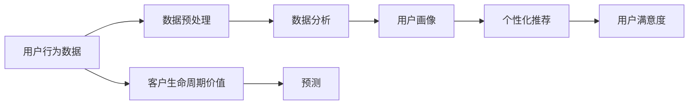

                 

# 如何进行有效的用户行为分析

在数字化时代，企业越来越依赖数据来指导决策，特别是在用户行为分析方面。通过深入理解用户的消费习惯、偏好和反馈，企业可以制定更有针对性的营销策略，提升用户体验，从而增加用户满意度和忠诚度。然而，用户行为分析并不是一项简单的任务，它需要结合数据采集、数据处理、数据分析等多个环节的综合考虑。本文将系统性地介绍如何进行有效的用户行为分析，涵盖核心概念、算法原理、具体步骤、应用场景和未来趋势等内容。

## 1. 背景介绍

### 1.1 问题由来

用户行为分析（User Behavior Analysis, UBA）是通过对用户的行为数据进行收集、存储、分析和预测，来理解用户需求和行为趋势的技术。随着互联网和移动互联网的普及，企业积累了大量的用户行为数据，包括点击流、购买记录、社交媒体互动等，这些数据成为了企业优化产品和提升服务的重要依据。然而，数据量大、维度多、结构复杂等特性使得用户行为分析变得非常复杂和具有挑战性。

### 1.2 问题核心关键点

用户行为分析的核心关键点在于：
- **数据质量**：用户行为数据的质量直接影响分析结果的准确性，需要确保数据的完整性、一致性和时效性。
- **数据采集**：如何有效地采集用户行为数据，确保数据来源的全面性和代表性。
- **数据处理**：如何清洗和预处理数据，去除噪音和异常值，保证数据质量。
- **数据分析**：如何运用合适的算法和模型，提取有价值的信息和洞察，支持业务决策。
- **预测和优化**：如何基于历史数据分析用户行为趋势，预测未来行为，优化产品和服务。

## 2. 核心概念与联系

### 2.1 核心概念概述

在进行用户行为分析时，需要关注以下几个核心概念：

- **用户行为数据**：用户在互联网上产生的数据，包括浏览、点击、购买、搜索、社交互动等行为数据。
- **数据预处理**：清洗、去重、归一化、特征工程等对原始数据进行处理的过程。
- **数据分析**：使用统计学、机器学习、深度学习等方法，从数据中提取有用信息，支持业务决策。
- **用户画像**：根据用户行为数据生成的用户概貌，包括用户的基本信息、兴趣偏好、行为习惯等。
- **个性化推荐**：根据用户画像，向用户推荐个性化内容和产品，提升用户体验。
- **用户满意度**：通过用户反馈和行为数据，评估用户对产品和服务的满意程度。
- **客户生命周期价值**（Customer Lifetime Value, CLV）：衡量用户对企业长期价值的指标，通过用户行为数据进行预测。

这些概念之间通过数据流和分析过程相互联系，形成一个完整的用户行为分析框架。

### 2.2 核心概念原理和架构的 Mermaid 流程图



这个流程图展示了用户行为分析的主要流程：从收集用户行为数据开始，经过数据预处理和分析，生成用户画像，并用于个性化推荐和用户满意度评估。最终通过预测模型，对客户生命周期价值进行预测。

## 3. 核心算法原理 & 具体操作步骤

### 3.1 算法原理概述

用户行为分析涉及多种算法和模型，主要分为以下几类：

- **统计分析方法**：如均值、方差、百分位数等，用于描述数据的基本特征。
- **聚类算法**：如K-means、层次聚类等，将用户分为不同群体，识别出行为相似的群体。
- **分类算法**：如逻辑回归、决策树、支持向量机等，用于预测用户行为（如是否购买、用户满意度等）。
- **回归分析**：如线性回归、岭回归、弹性网络等，用于预测数值型结果（如CLV）。
- **时间序列分析**：如ARIMA、LSTM等，用于分析用户行为随时间的变化趋势。
- **关联规则挖掘**：如Apriori、FP-growth等，用于发现用户行为之间的关联关系。
- **推荐算法**：如协同过滤、基于内容的推荐等，根据用户画像和行为数据推荐个性化内容。

### 3.2 算法步骤详解

#### 3.2.1 数据收集

用户行为数据的收集是用户行为分析的基础。具体步骤如下：

1. **数据源确定**：确定需要收集哪些数据源，包括网站、应用、社交媒体等。
2. **数据采集技术**：使用API、日志文件、埋点技术等方法收集数据。
3. **数据整合**：将来自不同渠道的数据整合到一个统一的数据仓库中。

#### 3.2.2 数据预处理

数据预处理是确保数据质量的关键步骤。具体步骤如下：

1. **数据清洗**：去除重复、缺失、异常值等数据。
2. **数据归一化**：将不同尺度的数据归一化到相同的范围。
3. **特征工程**：提取和构造新的特征，提高数据分析的效果。

#### 3.2.3 数据分析

数据分析是用户行为分析的核心，具体步骤如下：

1. **描述性分析**：使用统计学方法描述数据的基本特征，如均值、方差等。
2. **探索性数据分析**（Exploratory Data Analysis, EDA）：通过可视化工具发现数据中的模式和异常。
3. **建模**：选择合适的模型进行建模，如聚类、分类、回归等。
4. **模型评估**：使用交叉验证、ROC曲线、AUC等指标评估模型效果。

#### 3.2.4 结果可视化

结果可视化是将数据分析结果呈现给业务人员的重要步骤。具体步骤如下：

1. **数据可视化**：使用图表、仪表盘等工具展示分析结果。
2. **业务可视化**：将分析结果转换为业务决策指导，如用户画像、个性化推荐等。

### 3.3 算法优缺点

用户行为分析算法的主要优点包括：

- **数据驱动**：基于实际数据进行分析和决策，更加客观和可靠。
- **灵活性**：可以根据不同的业务需求选择不同的算法和模型。
- **预测能力**：通过数据分析可以预测用户行为，优化产品和服务。

但同时也存在一些缺点：

- **数据依赖**：数据质量直接影响分析结果，数据采集和处理需要大量资源。
- **模型复杂性**：不同算法和模型具有不同的假设和限制，需要根据具体业务场景选择。
- **隐私问题**：用户行为数据的收集和分析涉及隐私保护，需要遵守相关法律法规。

### 3.4 算法应用领域

用户行为分析广泛应用于以下几个领域：

- **电商**：分析用户的购买行为，提升个性化推荐和营销效果。
- **金融**：分析用户的消费习惯和风险偏好，优化信贷和保险产品。
- **医疗**：分析用户的健康行为和医疗需求，提升健康管理和医疗服务。
- **媒体**：分析用户的观看和阅读行为，优化内容推荐和广告投放。
- **交通**：分析用户的出行行为，优化交通管理和出行服务。

## 4. 数学模型和公式 & 详细讲解 & 举例说明

### 4.1 数学模型构建

用户行为分析的数学模型主要包括以下几类：

- **统计模型**：如均值、方差、标准差等，用于描述数据的基本特征。
- **聚类模型**：如K-means、层次聚类等，用于将用户分为不同群体。
- **分类模型**：如逻辑回归、决策树、支持向量机等，用于预测用户行为。
- **回归模型**：如线性回归、岭回归、弹性网络等，用于预测数值型结果。
- **时间序列模型**：如ARIMA、LSTM等，用于分析用户行为随时间的变化趋势。
- **关联规则模型**：如Apriori、FP-growth等，用于发现用户行为之间的关联关系。

### 4.2 公式推导过程

#### 4.2.1 统计模型

假设有一组数据 $x_1, x_2, ..., x_n$，其均值和方差公式如下：

$$
\mu = \frac{1}{n} \sum_{i=1}^n x_i
$$

$$
\sigma^2 = \frac{1}{n} \sum_{i=1}^n (x_i - \mu)^2
$$

#### 4.2.2 聚类模型

以K-means算法为例，假设数据集 $D = \{x_1, x_2, ..., x_n\}$，其中 $x_i = (x_{i1}, x_{i2}, ..., x_{ip})$ 是一个 $p$ 维向量，聚类中心 $C_k = (c_{k1}, c_{k2}, ..., c_{kp})$，聚类过程如下：

1. **初始化聚类中心**：随机选择 $k$ 个初始聚类中心 $C_k^{(0)}$。
2. **计算距离**：对于每个数据点 $x_i$，计算其到每个聚类中心的距离 $d_{ik}$。
3. **分配数据点**：将每个数据点分配到最近的聚类中心，形成一个 $k$ 个簇的初始划分。
4. **更新聚类中心**：计算每个簇的均值，作为新的聚类中心 $C_k^{(1)}$。
5. **迭代更新**：重复步骤2和步骤3，直到聚类中心不再变化或达到预设迭代次数。

#### 4.2.3 分类模型

以逻辑回归模型为例，假设有一组特征 $x_1, x_2, ..., x_p$，分类目标 $y$，模型参数 $\theta = (\theta_0, \theta_1, ..., \theta_p)$，目标函数如下：

$$
\log P(y|x) = \theta_0 + \sum_{i=1}^p \theta_i x_i
$$

其中 $P(y|x)$ 表示在特征 $x$ 下，预测 $y$ 的概率分布。

### 4.3 案例分析与讲解

#### 4.3.1 电商用户行为分析

电商用户行为分析的目标是提升个性化推荐和营销效果。具体步骤如下：

1. **数据收集**：收集用户购买记录、浏览历史、搜索记录等。
2. **数据预处理**：清洗和归一化数据，提取用户特征如年龄、性别、购买频率等。
3. **建模**：使用协同过滤、基于内容的推荐等算法，生成个性化推荐。
4. **模型评估**：使用AUC、准确率等指标评估推荐效果。
5. **结果可视化**：展示用户画像和推荐效果，优化推荐策略。

#### 4.3.2 金融用户行为分析

金融用户行为分析的目标是优化信贷和保险产品。具体步骤如下：

1. **数据收集**：收集用户的消费记录、信用历史、财务状况等。
2. **数据预处理**：清洗和归一化数据，提取用户特征如收入、消费习惯等。
3. **建模**：使用逻辑回归、决策树等算法，预测用户是否违约或需要保险。
4. **模型评估**：使用精确度、召回率等指标评估模型效果。
5. **结果可视化**：展示用户画像和风险评估结果，优化信贷和保险产品。

## 5. 项目实践：代码实例和详细解释说明

### 5.1 开发环境搭建

用户行为分析的开发环境搭建主要涉及以下几个步骤：

1. **选择开发语言和框架**：Python是用户行为分析的常用语言，可以选择Django、Flask等Web框架。
2. **配置数据库**：选择合适的数据库，如MySQL、PostgreSQL等，存储用户行为数据。
3. **安装数据分析库**：安装Pandas、NumPy、Scikit-learn等数据分析库，用于数据处理和建模。
4. **安装可视化库**：安装Matplotlib、Seaborn等可视化库，用于展示分析结果。

### 5.2 源代码详细实现

#### 5.2.1 电商用户行为分析

```python
import pandas as pd
import numpy as np
from sklearn.model_selection import train_test_split
from sklearn.linear_model import LogisticRegression
from sklearn.metrics import accuracy_score
import matplotlib.pyplot as plt

# 数据收集和预处理
data = pd.read_csv('user_browsing_data.csv')
data = data.dropna()
data = data[~data['click_count'].isnull()]

# 特征工程
features = ['age', 'gender', 'click_count']
X = data[features]
y = data['purchase']

# 建模
X_train, X_test, y_train, y_test = train_test_split(X, y, test_size=0.2)
model = LogisticRegression()
model.fit(X_train, y_train)
y_pred = model.predict(X_test)

# 模型评估
accuracy = accuracy_score(y_test, y_pred)
print('Accuracy:', accuracy)

# 结果可视化
plt.scatter(X_test['click_count'], y_test)
plt.plot(X_test['click_count'], y_pred, color='red')
plt.xlabel('Click Count')
plt.ylabel('Purchase')
plt.title('User Purchase Prediction')
plt.show()
```

#### 5.2.2 金融用户行为分析

```python
import pandas as pd
import numpy as np
from sklearn.model_selection import train_test_split
from sklearn.ensemble import RandomForestClassifier
from sklearn.metrics import accuracy_score
import matplotlib.pyplot as plt

# 数据收集和预处理
data = pd.read_csv('user_credit_data.csv')
data = data.dropna()
data = data[~data['income'].isnull()]

# 特征工程
features = ['income', 'age', 'debt_ratio']
X = data[features]
y = data['default']

# 建模
X_train, X_test, y_train, y_test = train_test_split(X, y, test_size=0.2)
model = RandomForestClassifier()
model.fit(X_train, y_train)
y_pred = model.predict(X_test)

# 模型评估
accuracy = accuracy_score(y_test, y_pred)
print('Accuracy:', accuracy)

# 结果可视化
plt.scatter(X_test['debt_ratio'], y_test)
plt.plot(X_test['debt_ratio'], y_pred, color='red')
plt.xlabel('Debt Ratio')
plt.ylabel('Default')
plt.title('User Credit Prediction')
plt.show()
```

### 5.3 代码解读与分析

#### 5.3.1 电商用户行为分析

1. **数据收集和预处理**：通过Pandas读取用户浏览数据，进行清洗和归一化处理。
2. **特征工程**：提取用户年龄、性别、点击次数等特征，作为模型输入。
3. **建模**：使用Logistic回归模型进行用户是否购买的预测。
4. **模型评估**：使用准确率评估模型效果。
5. **结果可视化**：使用Matplotlib绘制点击次数与购买结果的散点图，展示模型的预测效果。

#### 5.3.2 金融用户行为分析

1. **数据收集和预处理**：通过Pandas读取用户信用数据，进行清洗和归一化处理。
2. **特征工程**：提取用户收入、年龄、债务比率等特征，作为模型输入。
3. **建模**：使用随机森林模型进行用户是否违约的预测。
4. **模型评估**：使用准确率评估模型效果。
5. **结果可视化**：使用Matplotlib绘制债务比率与违约结果的散点图，展示模型的预测效果。

## 6. 实际应用场景

### 6.1 电商行业

电商行业是用户行为分析的重要应用场景之一。通过分析用户的浏览、点击、购买等行为数据，电商平台可以：

- **个性化推荐**：提升用户体验和满意度。
- **库存管理**：优化库存水平，减少缺货和积压。
- **广告投放**：精准投放广告，提升广告效果。

### 6.2 金融行业

金融行业同样需要深入分析用户的金融行为，通过用户行为数据：

- **风险管理**：评估用户的信用风险和违约概率。
- **产品优化**：优化信贷和保险产品，提高用户满意度。
- **反欺诈检测**：识别异常交易，防范金融欺诈。

### 6.3 医疗行业

医疗行业可以通过用户行为分析：

- **健康管理**：分析用户的健康行为和疾病风险，提升健康管理效果。
- **治疗建议**：根据用户的行为数据，提供个性化的治疗建议。
- **用户关怀**：提升患者对医疗服务的满意度，增加用户粘性。

## 7. 工具和资源推荐

### 7.1 学习资源推荐

为了深入学习用户行为分析，推荐以下学习资源：

1. **《用户行为分析》书籍**：详细介绍用户行为分析的基本概念、方法和实践。
2. **Coursera《数据科学专业课程》**：涵盖数据分析和机器学习的基础知识，包括统计学、Python编程等。
3. **Kaggle**：提供丰富的数据集和比赛，通过实践提升数据分析和建模技能。
4. **Python Data Science Handbook**：Python数据科学领域的经典书籍，涵盖数据处理、数据分析和可视化。
5. **Scikit-learn官方文档**：提供详细的API文档和教程，帮助学习和使用Scikit-learn库。

### 7.2 开发工具推荐

用户行为分析的开发工具推荐如下：

1. **Python**：用户行为分析的主要开发语言，简单易学，生态丰富。
2. **Pandas**：数据处理和分析的核心库，支持大规模数据处理。
3. **NumPy**：数值计算库，支持高效矩阵运算。
4. **Scikit-learn**：机器学习库，支持多种算法和模型。
5. **Matplotlib**：数据可视化库，支持丰富的图表展示。
6. **Jupyter Notebook**：交互式开发环境，方便代码调试和可视化。

### 7.3 相关论文推荐

以下是几篇用户行为分析领域的经典论文，推荐阅读：

1. **《用户行为分析综述》**：综述用户行为分析的基本方法和应用。
2. **《用户画像构建方法》**：介绍用户画像的构建过程和方法。
3. **《个性化推荐系统》**：详细介绍个性化推荐的基本原理和算法。
4. **《金融用户行为分析》**：分析金融用户的消费行为和风险偏好。
5. **《健康行为分析》**：分析用户的健康行为和疾病风险。

## 8. 总结：未来发展趋势与挑战

### 8.1 研究成果总结

用户行为分析领域已经取得了丰硕的研究成果，主要包括以下几个方面：

- **数据采集和处理技术**：通过API、埋点技术等手段，大规模收集用户行为数据。
- **数据分析和建模方法**：提出多种算法和模型，解决不同类型的问题。
- **结果可视化和应用**：通过数据可视化工具，将分析结果转化为业务决策指导。

### 8.2 未来发展趋势

用户行为分析的未来发展趋势主要包括以下几个方向：

1. **数据智能化**：通过机器学习和大数据技术，自动获取和处理用户行为数据。
2. **多模态分析**：结合多种数据源，如文本、图像、声音等，进行综合分析。
3. **实时分析**：通过流计算和实时数据处理技术，实现用户行为数据的实时分析。
4. **隐私保护**：加强数据隐私保护，确保用户数据安全。
5. **跨领域应用**：将用户行为分析应用于更多领域，如医疗、金融、交通等。

### 8.3 面临的挑战

用户行为分析仍然面临一些挑战：

1. **数据质量和隐私**：数据质量和隐私问题是用户行为分析的重要挑战，需要确保数据的完整性和安全性。
2. **算法复杂性**：用户行为分析涉及多种算法和模型，选择合适的方法需要经验和实验验证。
3. **业务场景复杂性**：不同业务场景需要不同的分析和应用方法，复杂性较高。
4. **结果可解释性**：用户行为分析的结果需要具有可解释性，方便业务人员理解和使用。
5. **计算资源**：大规模数据处理和复杂模型训练需要大量的计算资源，成本较高。

### 8.4 研究展望

未来的用户行为分析研究可以集中在以下几个方向：

1. **自动化数据分析**：开发自动化的数据分析工具，降低人工干预，提高分析效率。
2. **多领域融合**：将用户行为分析与更多领域知识结合，提升分析和预测的准确性。
3. **隐私保护技术**：研究隐私保护技术，确保用户数据的安全和合规。
4. **跨模态分析**：结合多种数据源，实现更全面、准确的用户行为分析。
5. **结果解释和可视化**：开发更高效、直观的结果解释和可视化工具，方便业务应用。

## 9. 附录：常见问题与解答

**Q1：用户行为分析的数据采集和预处理需要注意哪些问题？**

A: 用户行为数据的采集和预处理是用户行为分析的基础，需要注意以下几个问题：

1. **数据来源**：确保数据来源的全面性和代表性，覆盖不同类型的用户行为数据。
2. **数据清洗**：去除重复、缺失、异常值等数据，确保数据质量。
3. **数据归一化**：将不同尺度的数据归一化到相同的范围，方便后续分析和建模。
4. **特征工程**：提取和构造新的特征，提高数据分析的效果。

**Q2：用户行为分析中的推荐算法有哪些？**

A: 用户行为分析中的推荐算法主要包括以下几种：

1. **协同过滤**：基于用户和物品的相似性，推荐相似物品。
2. **基于内容的推荐**：根据物品的特征和用户的兴趣，推荐相似物品。
3. **混合推荐**：结合多种推荐算法，提高推荐效果。
4. **深度学习推荐**：使用深度神经网络模型，进行复杂推荐。

**Q3：用户行为分析中的数据可视化有哪些方法？**

A: 用户行为分析中的数据可视化方法主要包括以下几种：

1. **散点图**：展示两个变量的关系，如点击次数与购买行为。
2. **柱状图**：展示不同类别的数量和占比，如用户分群。
3. **饼图**：展示不同类别的比例和分布，如用户画像的特征分布。
4. **热力图**：展示数据的密度和分布，如用户行为的热力图。

**Q4：用户行为分析中的多模态分析需要注意哪些问题？**

A: 用户行为分析中的多模态分析需要注意以下几个问题：

1. **数据融合**：将不同模态的数据进行融合，确保数据的一致性和完整性。
2. **特征映射**：将不同模态的数据映射到统一的空间，方便综合分析。
3. **算法选择**：选择合适的算法和模型，处理多模态数据。
4. **结果解释**：将多模态分析结果解释为业务决策指导，方便理解和应用。

**Q5：用户行为分析中的隐私保护需要注意哪些问题？**

A: 用户行为分析中的隐私保护需要注意以下几个问题：

1. **数据匿名化**：去除或模糊化用户身份信息，保护用户隐私。
2. **数据脱敏**：对敏感数据进行脱敏处理，防止数据泄露。
3. **数据访问控制**：限制数据访问权限，防止未经授权的数据访问。
4. **合规性**：确保数据处理符合相关法律法规，如GDPR、CCPA等。

---

作者：禅与计算机程序设计艺术 / Zen and the Art of Computer Programming

