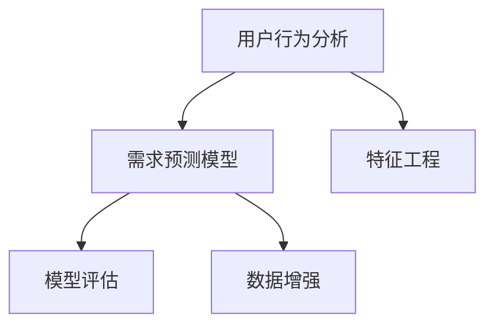

                 

# 如何进行有效的用户需求预测

> 关键词：用户行为预测，需求分析，数据分析，机器学习，模型评估，数据增强，用户调研

## 1. 背景介绍

### 1.1 问题由来
在数字化时代，企业面临的市场竞争日益激烈，如何准确把握用户需求、提升用户体验成为决定企业成败的关键。通过有效的用户需求预测，企业可以预见未来趋势，制定战略决策，优化产品设计，提升市场响应速度，增强竞争力。但用户需求预测并非易事，其涉及用户行为、市场环境、产品特性等多维度因素，复杂多变且难以量化。

### 1.2 问题核心关键点
用户需求预测的核心在于，从海量数据中挖掘出用户行为和偏好的潜在规律，并构建预测模型，实现对未来需求的准确预测。这个过程主要包括以下几个环节：

1. **数据收集**：收集用户行为数据，包括点击、浏览、购买、评价等。
2. **特征工程**：提取和选择与需求预测相关的特征，如用户特征、行为特征、环境特征等。
3. **模型训练**：使用机器学习算法构建预测模型，如随机森林、神经网络等。
4. **模型评估**：评估模型预测效果，优化模型参数和结构。
5. **结果应用**：将预测结果转化为实际决策，如产品推荐、广告投放、库存管理等。

### 1.3 问题研究意义
准确的用户需求预测对于提升企业决策效率、降低风险、提高市场反应速度具有重要意义：

1. **提升决策质量**：通过预测用户需求，企业可以更好地规划产品开发和市场推广策略，降低试错成本。
2. **优化用户体验**：基于需求预测结果，企业可以及时调整产品功能和服务，满足用户需求，提升满意度。
3. **增强竞争力**：快速响应用户需求，可以抢占市场先机，增强企业的市场竞争优势。
4. **降低风险**：通过预测销售趋势，企业可以有效管理库存，避免过多或不足的存货问题。
5. **数据驱动**：推动企业从经验决策向数据驱动转变，提升决策的科学性和可靠性。

## 2. 核心概念与联系

### 2.1 核心概念概述

为更好地理解用户需求预测，本节将介绍几个核心概念：

- **用户行为分析**：通过分析用户的行为数据，如点击、购买、搜索等，发现用户兴趣和偏好。
- **需求预测模型**：基于用户行为数据，构建的用于预测用户需求的模型，包括传统统计模型和机器学习模型。
- **特征工程**：从原始数据中提取和选择对需求预测有帮助的特征，提升模型预测能力。
- **模型评估**：评估预测模型的性能，包括准确率、召回率、F1值等指标。
- **数据增强**：通过数据增强技术，扩充训练集，提高模型泛化能力。

这些概念之间的逻辑关系可以通过以下Mermaid流程图来展示：



这个流程图展示了大语言模型的核心概念及其之间的关系：

1. 用户行为分析通过分析用户行为数据，提取特征。
2. 需求预测模型基于提取的特征，构建预测模型。
3. 模型评估用于评估预测模型的性能。
4. 数据增强用于扩充训练集，提高模型泛化能力。

这些概念共同构成了用户需求预测的学习框架，使其能够从海量数据中提取规律，准确预测用户需求。

## 3. 核心算法原理 & 具体操作步骤
### 3.1 算法原理概述

用户需求预测的本质是一个监督学习问题，即通过已知的用户历史行为数据，构建模型预测用户未来的需求。具体来说，假设用户历史行为数据为 $D=\{(x_i,y_i)\}_{i=1}^N$，其中 $x_i$ 为输入特征，$y_i$ 为输出标签。需求预测的目标是最小化损失函数 $\mathcal{L}(y_i,\hat{y}_i)$，其中 $\hat{y}_i$ 为模型的预测结果。

常用的损失函数包括均方误差损失（MSE）和交叉熵损失（Cross-Entropy Loss）。在监督学习中，常用的模型包括线性回归、决策树、随机森林、神经网络等。

### 3.2 算法步骤详解

用户需求预测的一般流程包括以下几个关键步骤：

**Step 1: 数据收集与预处理**
- 收集用户的历史行为数据，包括点击、浏览、购买等行为记录。
- 对数据进行清洗和预处理，如缺失值填充、数据格式转换、特征编码等。

**Step 2: 特征工程**
- 从原始数据中提取和选择与需求预测相关的特征，如用户特征、行为特征、环境特征等。
- 对特征进行归一化、编码、组合等处理，以便于模型训练。

**Step 3: 模型训练**
- 选择合适的预测模型，如随机森林、神经网络等。
- 使用训练集数据对模型进行训练，调整模型参数和结构。

**Step 4: 模型评估**
- 在验证集上评估模型的性能，选择性能最好的模型。
- 根据评估结果优化模型，如调整超参数、增加特征等。

**Step 5: 结果应用**
- 将训练好的模型应用于新数据，进行需求预测。
- 根据预测结果制定决策，如产品推荐、广告投放、库存管理等。

### 3.3 算法优缺点

用户需求预测具有以下优点：

1. **准确性**：基于历史数据构建的模型能够较好地预测用户需求，减少决策的盲目性。
2. **实时性**：需求预测模型可以在线部署，实时计算预测结果，响应速度快。
3. **泛化能力**：通过数据增强等方法，模型能够更好地泛化到未见过的数据，适应性强。

但同时也存在一些局限性：

1. **数据依赖性**：模型的预测性能高度依赖于数据的质量和数量，数据偏差可能导致预测偏差。
2. **过拟合风险**：若数据样本不足，模型可能过拟合，泛化性能下降。
3. **动态变化**：用户需求和市场环境变化较快，模型需要不断更新和优化。
4. **复杂性**：特征工程和模型调参过程复杂，需要专业知识支持。

### 3.4 算法应用领域

用户需求预测在多个领域中具有广泛的应用，例如：

- 电子商务：预测用户购买行为，进行个性化推荐、库存管理等。
- 广告投放：预测用户广告响应，优化广告投放策略，提高转化率。
- 金融服务：预测用户消费需求，进行风险评估和产品推荐。
- 媒体内容推荐：预测用户内容偏好，推荐相关内容，提高用户满意度。
- 在线教育：预测用户学习行为，推荐课程、优化教学策略。

## 4. 数学模型和公式 & 详细讲解 & 举例说明
### 4.1 数学模型构建

用户需求预测的数学模型构建主要包括以下几个步骤：

1. **特征表示**：将用户行为数据转化为模型可以处理的数值特征。
2. **模型选择**：选择适当的预测模型，如线性回归、决策树、随机森林等。
3. **损失函数**：定义损失函数，衡量模型预测结果与真实标签之间的差异。
4. **模型训练**：使用训练集数据最小化损失函数，优化模型参数。
5. **模型评估**：在验证集上评估模型性能，选择最优模型。

### 4.2 公式推导过程

以线性回归模型为例，公式推导如下：

假设用户需求 $y_i$ 与特征 $x_i$ 之间的关系为线性关系，即：

$$
y_i = \theta_0 + \sum_{j=1}^n \theta_j x_{ij} + \epsilon_i
$$

其中 $\epsilon_i$ 为随机误差项，$x_{ij}$ 为特征向量中的第 $j$ 个元素。模型目标是最小化损失函数，假设使用均方误差损失（MSE），则：

$$
\mathcal{L}(y_i,\hat{y}_i) = \frac{1}{2}(y_i - \hat{y}_i)^2
$$

其中 $\hat{y}_i$ 为模型预测结果。优化目标为：

$$
\mathop{\min}_{\theta} \frac{1}{N} \sum_{i=1}^N \mathcal{L}(y_i,\hat{y}_i)
$$

利用梯度下降算法，模型参数 $\theta$ 的更新公式为：

$$
\theta \leftarrow \theta - \eta \nabla_{\theta}\mathcal{L}(\theta)
$$

其中 $\eta$ 为学习率，$\nabla_{\theta}\mathcal{L}(\theta)$ 为损失函数对模型参数的梯度。

### 4.3 案例分析与讲解

假设有一家电商平台，希望通过用户历史购买数据预测用户未来的购买需求。具体流程如下：

1. **数据收集**：收集用户购买历史数据，包括购买时间、商品类别、购买金额等。
2. **特征工程**：提取特征如购买频率、购买金额、购买时间等。
3. **模型选择**：选择线性回归模型，对模型进行训练。
4. **模型评估**：在验证集上评估模型性能，选择最优模型。
5. **结果应用**：将训练好的模型应用于新用户，预测其购买需求，进行个性化推荐。

通过实际案例的讲解，读者可以更直观地理解用户需求预测的流程和方法。

## 5. 项目实践：代码实例和详细解释说明
### 5.1 开发环境搭建

在进行用户需求预测项目开发前，需要准备好开发环境。以下是使用Python进行Scikit-learn开发的Python环境配置流程：

1. 安装Anaconda：从官网下载并安装Anaconda，用于创建独立的Python环境。

2. 创建并激活虚拟环境：
```bash
conda create -n predict-env python=3.8 
conda activate predict-env
```

3. 安装Scikit-learn：
```bash
pip install scikit-learn pandas numpy matplotlib jupyter notebook ipython
```

完成上述步骤后，即可在`predict-env`环境中开始项目开发。

### 5.2 源代码详细实现

以下是使用Scikit-learn库进行用户需求预测的Python代码实现：

```python
import pandas as pd
from sklearn.model_selection import train_test_split
from sklearn.linear_model import LinearRegression
from sklearn.metrics import mean_squared_error, r2_score

# 加载数据
data = pd.read_csv('user_bean.csv')

# 特征工程
X = data[['purchase_frequency', 'purchase_amount', 'purchase_time']]
y = data['purchase']
X_train, X_test, y_train, y_test = train_test_split(X, y, test_size=0.2, random_state=42)

# 模型训练
model = LinearRegression()
model.fit(X_train, y_train)

# 模型评估
y_pred = model.predict(X_test)
mse = mean_squared_error(y_test, y_pred)
rmse = mean_squared_error(y_test, y_pred, squared=False)
r2 = r2_score(y_test, y_pred)

# 输出结果
print('MSE:', mse)
print('RMSE:', rmse)
print('R^2:', r2)
```

在上述代码中，首先加载用户购买数据，然后进行特征工程，选择购买频率、购买金额和购买时间作为特征。接着，使用线性回归模型进行训练，并在测试集上评估模型性能，输出均方误差（MSE）、均方根误差（RMSE）和决定系数（R^2）等指标。

### 5.3 代码解读与分析

让我们再详细解读一下关键代码的实现细节：

**数据加载**：
- 使用Pandas库加载CSV文件，读取用户购买数据。

**特征工程**：
- 选择购买频率、购买金额和购买时间作为模型输入特征。
- 使用train_test_split方法将数据集划分为训练集和测试集。

**模型训练**：
- 使用Scikit-learn库中的LinearRegression模型进行训练。
- 使用fit方法拟合模型，最小化损失函数。

**模型评估**：
- 在测试集上使用predict方法进行预测。
- 使用mean_squared_error和r2_score方法评估模型性能。
- 输出均方误差（MSE）、均方根误差（RMSE）和决定系数（R^2）等指标。

**结果应用**：
- 在训练好的模型上，可以对新用户的购买行为进行预测。

可以看到，Scikit-learn库提供了丰富的机器学习算法和评估工具，使得用户需求预测的实现变得更加简洁高效。开发者可以将更多精力放在数据处理、模型优化等高层逻辑上，而不必过多关注底层的实现细节。

## 6. 实际应用场景
### 6.1 电子商务

用户需求预测在电子商务中具有重要应用。电商平台通过预测用户购买行为，可以优化推荐系统，提升用户满意度，增加转化率。具体应用包括：

- **个性化推荐**：根据用户历史购买行为，预测其购买需求，推荐相关商品。
- **库存管理**：预测商品需求趋势，优化库存管理，减少库存积压和缺货。
- **价格优化**：预测市场趋势，调整商品价格，增加销售额。

### 6.2 金融服务

金融服务领域，用户需求预测可以帮助金融机构进行风险评估和产品推荐。具体应用包括：

- **用户画像**：根据用户行为数据，构建用户画像，了解用户需求。
- **贷款审批**：预测用户贷款需求，评估还款能力，优化审批流程。
- **投资推荐**：根据用户投资行为，预测投资需求，推荐合适产品。

### 6.3 媒体内容推荐

媒体内容推荐领域，用户需求预测可以帮助内容提供商优化内容推荐策略，提高用户粘性。具体应用包括：

- **视频推荐**：根据用户观看历史，预测其对新视频的需求，推荐相关内容。
- **文章推荐**：根据用户阅读历史，预测其对新文章的需求，推荐相关主题。
- **直播推荐**：根据用户观看历史，预测其对新直播的需求，推荐相关主播。

## 7. 工具和资源推荐
### 7.1 学习资源推荐

为了帮助开发者系统掌握用户需求预测的理论基础和实践技巧，这里推荐一些优质的学习资源：

1. 《机器学习实战》系列书籍：由机器学习专家撰写，涵盖了从基础到进阶的各种机器学习算法和实践案例。
2. Kaggle在线竞赛平台：提供了大量的用户需求预测竞赛，参与竞赛可以提升实战能力，学习先进技巧。
3. Coursera《机器学习》课程：由斯坦福大学教授Andrew Ng开设的机器学习课程，系统介绍了机器学习的基本概念和算法。
4. PyTorch官方文档：提供全面的PyTorch教程和样例代码，帮助开发者快速上手深度学习开发。
5. Scikit-learn官方文档：提供详细的Scikit-learn教程和样例代码，帮助开发者使用机器学习算法解决实际问题。

通过对这些资源的学习实践，相信你一定能够快速掌握用户需求预测的精髓，并用于解决实际的NLP问题。

### 7.2 开发工具推荐

高效的开发离不开优秀的工具支持。以下是几款用于用户需求预测开发的常用工具：

1. Python：Python是数据分析和机器学习的主流语言，有丰富的第三方库支持，如Scikit-learn、Pandas、Numpy等。
2. R：R是统计分析的重要工具，提供丰富的统计分析库和可视化工具。
3. Jupyter Notebook：支持Python和R等多种编程语言，便于快速迭代开发和分享学习笔记。
4. TensorBoard：TensorFlow配套的可视化工具，实时监测模型训练状态，提供丰富的图表呈现方式。
5. Weights & Biases：模型训练的实验跟踪工具，记录和可视化模型训练过程中的各项指标，方便对比和调优。

合理利用这些工具，可以显著提升用户需求预测任务的开发效率，加快创新迭代的步伐。

### 7.3 相关论文推荐

用户需求预测的研究源于学界的持续研究。以下是几篇奠基性的相关论文，推荐阅读：

1. "Predicting User Demand Using Machine Learning Models"：介绍了多种机器学习模型在用户需求预测中的应用，包括线性回归、决策树、随机森林等。
2. "User Behavior Analysis and Demand Prediction"：讨论了用户行为分析和需求预测的数学模型和算法，如协同过滤、聚类等。
3. "Big Data Analytics for User Demand Prediction"：探讨了大数据环境下用户需求预测的方法和工具，包括数据挖掘、机器学习、深度学习等。
4. "Interactive Demand Prediction in E-commerce"：研究了电子商务中的用户需求预测方法，如协同过滤、时间序列分析等。
5. "Real-time Demand Prediction for Financial Services"：讨论了金融服务中的用户需求预测方法，如随机森林、神经网络等。

这些论文代表了大语言模型微调技术的发展脉络。通过学习这些前沿成果，可以帮助研究者把握学科前进方向，激发更多的创新灵感。

## 8. 总结：未来发展趋势与挑战
### 8.1 总结

本文对用户需求预测方法进行了全面系统的介绍。首先阐述了用户需求预测的背景和意义，明确了预测在提升企业决策效率、降低风险、提高市场反应速度方面的独特价值。其次，从原理到实践，详细讲解了用户需求预测的数学原理和关键步骤，给出了预测任务开发的完整代码实例。同时，本文还广泛探讨了预测方法在电子商务、金融服务、媒体内容推荐等多个行业领域的应用前景，展示了预测范式的巨大潜力。此外，本文精选了预测技术的各类学习资源，力求为读者提供全方位的技术指引。

通过本文的系统梳理，可以看到，用户需求预测方法在企业决策中具有重要应用价值，能够提升决策效率，降低风险，提升市场响应速度。未来，伴随数据量、算法、工具等技术不断进步，用户需求预测方法将迎来更广阔的发展空间，为企业的智能化转型提供坚实的基础。

### 8.2 未来发展趋势

展望未来，用户需求预测方法将呈现以下几个发展趋势：

1. **数据规模扩大**：伴随大数据技术的不断成熟，用户行为数据的规模将持续扩大，为预测模型提供更丰富的信息。
2. **算法优化**：未来的预测方法将更加注重算法优化，提升模型的预测准确性和泛化能力。
3. **实时化预测**：通过在线预测系统，实时计算需求预测结果，提升预测的及时性和时效性。
4. **多模态融合**：结合用户行为数据、市场环境数据、社交网络数据等多模态信息，提升预测的全面性和准确性。
5. **可解释性增强**：赋予预测模型更强的可解释性，提升模型的透明度和可信度。
6. **跨领域应用**：将用户需求预测方法应用于更多行业领域，如医疗、制造、能源等，推动各行各业的智能化转型。

以上趋势凸显了用户需求预测方法的广阔前景。这些方向的探索发展，将进一步提升预测模型的性能和应用范围，为构建智能化的企业决策系统铺平道路。

### 8.3 面临的挑战

尽管用户需求预测方法已经取得了显著成就，但在迈向更加智能化、普适化应用的过程中，仍面临诸多挑战：

1. **数据质量问题**：数据质量直接影响到预测模型的准确性，数据缺失、异常、噪声等都会对模型产生负面影响。
2. **动态变化**：用户需求和市场环境快速变化，预测模型需要不断更新和优化，以保持其适用性。
3. **计算资源**：大规模预测模型的训练和推理需要高计算资源，硬件瓶颈成为限制因素。
4. **模型复杂性**：高维数据和多维度特征的处理复杂，需要先进的数据处理和特征工程技术。
5. **算法鲁棒性**：预测模型对异常数据的鲁棒性不足，容易受到异常数据的影响。
6. **隐私保护**：预测模型需要处理大量用户隐私数据，如何在保证隐私的前提下进行数据处理和模型训练。

正视这些挑战，积极应对并寻求突破，将是大数据预测方法的必然之路。

### 8.4 研究展望

面对用户需求预测方法所面临的种种挑战，未来的研究需要在以下几个方面寻求新的突破：

1. **数据治理**：建立完善的数据治理体系，提升数据质量和可用性，降低数据噪音对模型的影响。
2. **模型优化**：探索更加高效、鲁棒的预测算法，提升模型的泛化能力和鲁棒性。
3. **资源优化**：开发更加高效的计算模型和数据压缩技术，降低计算资源消耗。
4. **隐私保护**：研究数据隐私保护技术，如差分隐私、联邦学习等，确保数据隐私和安全。
5. **多模态融合**：结合多种数据源和数据类型，提升预测模型的全面性和准确性。
6. **实时预测**：探索实时预测技术，如流式数据处理、在线学习等，提升预测的及时性。

这些研究方向将推动用户需求预测方法的持续创新，为构建智能化的企业决策系统提供坚实的技术支撑。

## 9. 附录：常见问题与解答

**Q1：用户需求预测是否适用于所有应用场景？**

A: 用户需求预测在多数应用场景中都能取得不错的效果，特别是对于数据量较大的任务。但对于一些特定领域的任务，如医疗、法律等，仅仅依靠通用用户行为数据进行预测可能效果有限。此时需要在特定领域数据上进一步训练模型，以获得更好的预测效果。

**Q2：如何选择合适的预测模型？**

A: 选择合适的预测模型需要考虑多个因素，如数据量、特征复杂度、预测目标等。一般而言，对于高维数据，可以选择基于树模型的决策树、随机森林等；对于低维数据，可以选择基于线性模型的线性回归、逻辑回归等。同时，可以考虑使用深度学习模型，如神经网络、卷积神经网络等，以提升模型的预测能力。

**Q3：如何缓解预测过程中的过拟合问题？**

A: 缓解过拟合问题可以通过以下方法：
1. 数据增强：通过数据增强技术，扩充训练集，增加数据多样性。
2. 正则化：使用L2正则、Dropout等技术，防止模型过拟合。
3. 交叉验证：通过交叉验证技术，评估模型在未见过的数据上的表现。
4. 集成学习：使用集成学习方法，如Bagging、Boosting等，提升模型的泛化能力。
5. 模型简化：简化模型结构，降低模型复杂度，避免过拟合。

这些方法需要根据具体数据和任务特点进行灵活组合，以最大限度地缓解过拟合问题。

**Q4：预测模型在落地部署时需要注意哪些问题？**

A: 将预测模型转化为实际应用，还需要考虑以下问题：
1. 模型裁剪：去除不必要的层和参数，减小模型尺寸，提高推理速度。
2. 量化加速：将浮点模型转为定点模型，压缩存储空间，提高计算效率。
3. 服务化封装：将模型封装为标准化服务接口，便于集成调用。
4. 弹性伸缩：根据请求流量动态调整资源配置，平衡服务质量和成本。
5. 监控告警：实时采集系统指标，设置异常告警阈值，确保服务稳定性。
6. 安全防护：采用访问鉴权、数据脱敏等措施，保障数据和模型安全。

预测模型需要开发者根据具体应用场景，进行全面的部署优化，以确保模型能够稳定高效地运行。

---

作者：禅与计算机程序设计艺术 / Zen and the Art of Computer Programming

