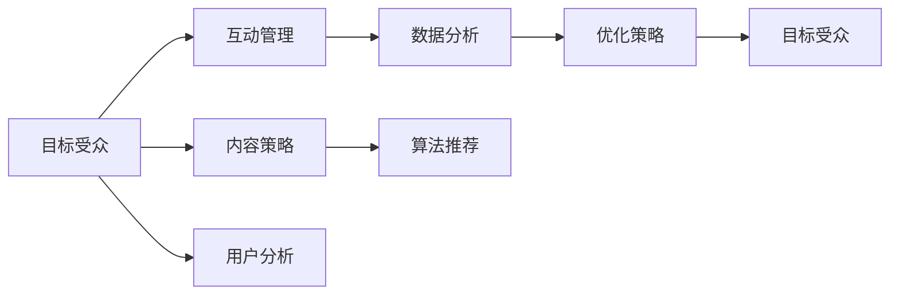
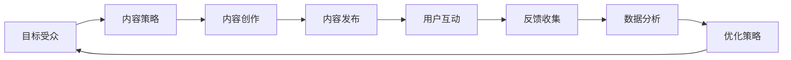

                 

## 1. 背景介绍

### 1.1 问题由来
随着互联网的迅速发展，社交媒体已经成为人们获取信息、交流互动的重要平台。社交媒体运营（Social Media Optimization，SMO）是指企业或品牌通过社交媒体平台推广产品或服务，提升品牌知名度和用户参与度的过程。然而，面对海量信息、复杂用户行为以及不断变化的社交媒体生态，如何有效运营社交媒体，提升其营销效果，已成为众多企业面临的挑战。

### 1.2 问题核心关键点
社交媒体运营的核心在于如何制定有效的策略，最大化利用社交媒体平台提供的各种资源，提升品牌曝光度和用户互动。其主要关注点包括：

- 目标受众分析：了解用户需求和偏好，定位目标受众。
- 内容策略制定：规划高质量、高频率的社交媒体内容发布。
- 互动管理：提升用户参与度和反馈。
- 数据分析与优化：持续监控和优化社交媒体运营效果。

本文将系统介绍社交媒体运营的核心概念、算法原理和具体操作步骤，并结合具体案例分析，帮助读者深入理解社交媒体运营的方法和技巧。

## 2. 核心概念与联系

### 2.1 核心概念概述

社交媒体运营涉及多个核心概念，各概念之间相互关联，共同构成了一个完整的社交媒体营销体系。

- **目标受众（Target Audience）**：明确企业希望触达的用户群体，包括年龄、性别、职业、兴趣、行为习惯等。
- **内容策略（Content Strategy）**：制定发布计划和内容形式，包括文章、图片、视频、直播等。
- **互动管理（Engagement Management）**：通过回复评论、点赞、分享等方式，提升用户参与度。
- **数据分析（Data Analytics）**：使用各种分析工具，监控社交媒体表现，分析用户行为和反馈，优化运营策略。
- **算法推荐（Algorithm Recommendation）**：社交媒体平台通过算法推荐系统，提高内容在目标受众中的曝光率。

这些概念之间的联系可以通过以下Mermaid流程图来展示：



### 2.2 核心概念原理和架构的 Mermaid 流程图



这个流程图展示了目标受众通过内容创作、内容发布、用户互动和反馈收集，最终形成数据分析和优化策略的闭环过程。

## 3. 核心算法原理 & 具体操作步骤
### 3.1 算法原理概述

社交媒体运营的核心算法主要包括内容推荐算法和用户行为分析算法。

- **内容推荐算法**：社交媒体平台通过协同过滤、基于用户的协同过滤、基于物品的协同过滤等算法，为用户推荐可能感兴趣的内容。

- **用户行为分析算法**：社交媒体平台使用机器学习算法，如聚类、分类、回归等，分析用户行为，预测用户偏好，优化内容策略。

### 3.2 算法步骤详解

社交媒体运营的算法步骤主要包括以下几个环节：

1. **数据收集**：收集社交媒体平台上的用户行为数据，包括浏览历史、点赞、评论、分享等。
2. **数据预处理**：清洗和标准化数据，处理缺失值和异常值。
3. **特征提取**：从用户行为数据中提取特征，如访问时间、互动频率、兴趣爱好等。
4. **模型训练**：使用机器学习算法训练模型，预测用户行为和内容偏好。
5. **模型评估**：通过交叉验证、ROC曲线、精确率召回率等指标评估模型性能。
6. **策略优化**：根据模型预测结果，调整内容策略和互动管理策略，提升运营效果。

### 3.3 算法优缺点

**内容推荐算法的优点**：
- 提高用户参与度：通过推荐用户感兴趣的内容，提升用户互动和停留时间。
- 降低内容获取成本：减少内容创作的频率和成本，利用用户生成内容（UGC），提高平台粘性。

**内容推荐算法的缺点**：
- 算法偏见：推荐系统可能由于训练数据偏见，推荐低质量或不符合用户喜好的内容。
- 过度依赖算法：过于依赖算法可能导致忽略用户的个性化需求和反馈。

**用户行为分析算法的优点**：
- 预测用户行为：通过分析用户行为，预测用户未来行为，优化运营策略。
- 提升广告效果：精准定位用户，提升广告的点击率和转化率。

**用户行为分析算法的缺点**：
- 数据隐私问题：用户行为数据可能包含敏感信息，数据隐私和安全问题需要重视。
- 模型复杂度高：用户行为分析算法通常需要大量的特征工程和模型调参，增加了实现难度。

### 3.4 算法应用领域

社交媒体运营的算法在以下领域得到了广泛应用：

- **广告投放优化**：通过用户行为分析，精准定位目标用户，优化广告投放策略。
- **内容推荐系统**：如抖音、YouTube、微博等平台，利用协同过滤和内容推荐算法，提升用户粘性和留存率。
- **营销效果监测**：使用数据分析工具，实时监控营销效果，优化运营策略。
- **社交媒体监测**：监控品牌在社交媒体上的表现，分析用户情感和反馈，及时调整策略。

## 4. 数学模型和公式 & 详细讲解 & 举例说明

### 4.1 数学模型构建

社交媒体运营涉及的数学模型主要包括以下几类：

- **协同过滤（Collaborative Filtering）**：使用用户-物品评分矩阵，推荐用户可能感兴趣的内容。
- **基于内容的推荐（Content-Based Recommendation）**：通过分析物品属性，推荐与用户兴趣相似的内容。
- **聚类算法（Clustering）**：将用户分为不同的兴趣群组，提升个性化推荐效果。
- **分类算法（Classification）**：预测用户行为，如购买、流失等。
- **回归算法（Regression）**：预测用户行为的结果，如广告点击率、转化率等。

### 4.2 公式推导过程

以协同过滤为例，协同过滤的数学模型如下：

设用户集合为 $U=\{u_1, u_2, ..., u_m\}$，物品集合为 $I=\{i_1, i_2, ..., i_n\}$，用户对物品的评分矩阵为 $R_{m \times n}$，其中 $R_{ui}=a_{ui}$ 表示用户 $u$ 对物品 $i$ 的评分。协同过滤的目标是预测用户 $u$ 对物品 $i$ 的评分，可以表示为：

$$
\hat{a}_{ui} = \sum_{j \in U} \alpha_{uj} a_{ji}
$$

其中 $\alpha_{uj}$ 为用户 $u$ 与用户 $j$ 的相似度，可以采用余弦相似度、皮尔逊相关系数等方法计算。

### 4.3 案例分析与讲解

假设某电商平台希望通过协同过滤算法推荐商品。收集到用户对商品的评分矩阵 $R_{m \times n}$，其中 $m=10000$ 表示用户数，$n=5000$ 表示商品数。通过余弦相似度计算用户之间的相似度 $\alpha_{uj}$，然后利用协同过滤模型计算用户 $u$ 对物品 $i$ 的评分预测 $\hat{a}_{ui}$。

## 5. 项目实践：代码实例和详细解释说明

### 5.1 开发环境搭建

社交媒体运营的开发环境搭建需要以下步骤：

1. **安装Python和相关库**：安装Python 3.7及以上版本，使用pip安装numpy、pandas、scikit-learn、scipy等库。
2. **数据收集**：使用API接口或爬虫技术，从社交媒体平台获取用户行为数据。
3. **数据预处理**：清洗和标准化数据，处理缺失值和异常值。
4. **特征提取**：提取用户行为数据中的特征，如访问时间、互动频率、兴趣爱好等。
5. **模型训练**：使用scikit-learn、TensorFlow等工具，训练机器学习模型。
6. **模型评估**：使用交叉验证、ROC曲线、精确率召回率等指标评估模型性能。
7. **策略优化**：根据模型预测结果，调整内容策略和互动管理策略。

### 5.2 源代码详细实现

以协同过滤为例，展示如何使用Python和scikit-learn实现协同过滤算法：

```python
import numpy as np
from sklearn.metrics.pairwise import cosine_similarity

# 用户-物品评分矩阵
R = np.array([[5, 4, 0, 0, 1],
             [0, 0, 5, 4, 1],
             [1, 1, 0, 0, 5]])

# 计算用户之间的相似度
alpha = cosine_similarity(R)

# 协同过滤预测
def collaborative_filtering(alpha, R):
    # 填充缺失值
    R = np.nan_to_num(R)
    
    # 计算预测值
    predictions = np.dot(alpha, R)
    
    return predictions

predictions = collaborative_filtering(alpha, R)
print(predictions)
```

### 5.3 代码解读与分析

上述代码中，首先定义了一个用户-物品评分矩阵 $R$，然后使用余弦相似度计算用户之间的相似度 $\alpha$。接着，实现了一个协同过滤函数 `collaborative_filtering`，该函数计算用户 $u$ 对物品 $i$ 的预测评分 $\hat{a}_{ui}$。最后，通过调用该函数输出预测结果。

## 6. 实际应用场景

### 6.1 广告投放优化

某电商品牌希望通过社交媒体推广其新产品。通过分析用户行为数据，利用协同过滤算法推荐用户感兴趣的商品，提升广告的点击率和转化率。同时，使用A/B测试等方法，不断优化广告内容和投放策略。

### 6.2 内容推荐系统

抖音等短视频平台通过协同过滤和基于内容的推荐算法，为用户推荐个性化视频。平台收集用户对视频的互动数据，如点赞、评论、分享等，利用这些数据训练模型，预测用户对未观看视频的评分，然后推荐评分高的视频。

### 6.3 营销效果监测

某品牌在社交媒体上开展了一次广告活动，希望了解活动效果。通过实时监控广告的曝光量、点击量、转化量等指标，使用机器学习模型预测活动效果，及时调整广告策略，提升活动效果。

## 7. 工具和资源推荐

### 7.1 学习资源推荐

1. **《社交媒体分析》课程**：由斯坦福大学开设的课程，讲解社交媒体数据分析和挖掘技术，适合初学者入门。
2. **《Python数据科学手册》书籍**：讲解Python在数据科学中的应用，包含数据分析、机器学习等内容。
3. **Kaggle平台**：Kaggle提供了大量的社交媒体数据集，适合进行实际项目练习。
4. **Apache Spark**：基于内存计算的分布式计算框架，适用于大数据分析任务。

### 7.2 开发工具推荐

1. **Jupyter Notebook**：开源的交互式编程环境，适合数据探索和模型训练。
2. **TensorFlow**：谷歌开源的深度学习框架，适合构建复杂的机器学习模型。
3. **Scikit-learn**：Python的机器学习库，包含多种经典机器学习算法和工具。
4. **NumPy**：Python的数值计算库，适合进行大规模矩阵计算。

### 7.3 相关论文推荐

1. **《推荐系统算法与实现》书籍**：介绍推荐系统的基本原理和实现方法，适合深入学习推荐算法。
2. **《社交媒体大数据分析》论文**：介绍社交媒体数据分析的方法和应用，适合了解社交媒体分析技术。

## 8. 总结：未来发展趋势与挑战

### 8.1 研究成果总结

社交媒体运营涉及的目标受众分析、内容策略制定、互动管理、数据分析和算法推荐等核心概念，共同构成了一个系统的社交媒体营销体系。通过算法优化，提升了社交媒体平台的运营效果，推动了企业品牌和产品推广。

### 8.2 未来发展趋势

未来社交媒体运营将呈现以下几个趋势：

1. **算法个性化提升**：随着深度学习和强化学习技术的发展，个性化推荐和动态优化算法将进一步提升社交媒体平台的用户体验。
2. **多模态数据融合**：结合文本、图像、视频等多模态数据，提升推荐系统的精准度和用户粘性。
3. **实时分析与预测**：利用实时数据流处理技术，实现对用户行为和市场动态的实时分析和预测。
4. **社交媒体监测与舆情分析**：通过大数据分析技术，监测品牌在社交媒体上的表现，分析用户情感和舆情变化，提升品牌形象。

### 8.3 面临的挑战

尽管社交媒体运营取得了显著成效，但仍面临以下挑战：

1. **数据隐私与安全**：用户行为数据涉及隐私问题，数据安全和隐私保护成为重要议题。
2. **用户行为变化**：用户行为和偏好不断变化，需要持续监测和优化运营策略。
3. **算法偏见与公平性**：推荐算法可能存在偏见，影响用户体验和品牌形象。
4. **资源消耗与成本**：大规模数据处理和模型训练需要高性能计算资源和成本投入。

### 8.4 研究展望

未来的社交媒体运营研究需要在以下几个方面进行深入探索：

1. **隐私保护与合规**：加强数据隐私保护，遵守法律法规，保障用户权益。
2. **跨模态数据融合**：结合多模态数据，提升推荐系统的全面性和用户粘性。
3. **实时分析与反馈**：利用实时数据流处理技术，提升运营策略的灵活性和实时性。
4. **模型公平性与可解释性**：提升推荐算法的公平性和透明性，确保模型决策的透明性和可解释性。

## 9. 附录：常见问题与解答

**Q1：如何提高社交媒体运营的点击率和转化率？**

A: 提高社交媒体运营的点击率和转化率，可以采取以下措施：
1. **优质内容创作**：创作高质量、有趣味性的内容，吸引用户点击。
2. **个性化推荐**：利用协同过滤和基于内容的推荐算法，提升内容的相关性和个性化。
3. **互动管理**：通过回复评论、点赞、分享等方式，提升用户互动和参与度。
4. **广告优化**：使用A/B测试等方法，优化广告内容和投放策略，提升广告效果。

**Q2：如何处理社交媒体运营中的数据隐私问题？**

A: 处理社交媒体运营中的数据隐私问题，可以采取以下措施：
1. **数据匿名化**：对用户数据进行匿名化处理，保护用户隐私。
2. **加密存储**：使用加密技术，保护数据存储的安全性。
3. **合规监管**：遵守相关法律法规，确保数据处理的合规性。
4. **透明公开**：向用户公开数据使用目的和方式，增加用户的信任度。

**Q3：社交媒体运营中的推荐算法有哪些类型？**

A: 社交媒体运营中的推荐算法主要包括以下几种类型：
1. **协同过滤（Collaborative Filtering）**：通过用户-物品评分矩阵，推荐用户感兴趣的内容。
2. **基于内容的推荐（Content-Based Recommendation）**：通过分析物品属性，推荐与用户兴趣相似的内容。
3. **基于模型的推荐（Model-Based Recommendation）**：使用机器学习模型，预测用户行为和内容偏好。
4. **混合推荐（Hybrid Recommendation）**：结合多种推荐算法，提升推荐效果。

**Q4：社交媒体运营中的用户行为分析有哪些方法？**

A: 社交媒体运营中的用户行为分析主要包括以下方法：
1. **聚类分析（Clustering）**：将用户分为不同的兴趣群组，提升个性化推荐效果。
2. **分类分析（Classification）**：预测用户行为，如购买、流失等。
3. **回归分析（Regression）**：预测用户行为的结果，如广告点击率、转化率等。
4. **关联分析（Association Rule）**：发现用户行为中的规律和关联关系。

**Q5：如何优化社交媒体运营中的互动管理？**

A: 优化社交媒体运营中的互动管理，可以采取以下措施：
1. **及时回复**：快速响应用户的评论和留言，增加用户互动和参与度。
2. **个性化互动**：根据用户兴趣和行为，提供个性化的互动内容。
3. **互动引导**：通过提问和引导，提升用户互动和反馈。
4. **互动分析**：分析用户互动数据，优化互动策略。

---

作者：禅与计算机程序设计艺术 / Zen and the Art of Computer Programming

