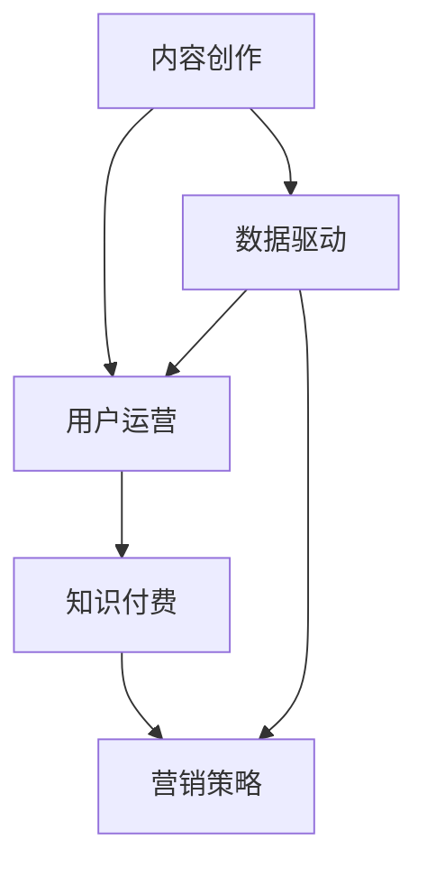

                 

# 如何进行知识付费的内容营销与推广

> 关键词：内容创作,用户运营,知识付费,营销策略,数据驱动

## 1. 背景介绍

### 1.1 问题由来
随着互联网和信息技术的发展，知识付费模式逐渐兴起，成为教育、文化、科技等领域的一种新趋势。其基本逻辑是：用户付费购买高价值的知识内容，而平台和创作者则通过售卖知识获得收益。知识付费不但改变了传统教育、文化产业的商业模式，也为内容创作者带来了新的经济机遇。然而，由于知识付费市场的竞争日益激烈，单靠内容已难以满足用户多样化、个性化的需求。在用户消费动机日益复杂，且付费行为决策周期缩短的情况下，内容营销与推广已成为知识付费平台不可或缺的重要环节。

### 1.2 问题核心关键点
通过内容营销与推广，可以解决知识付费平台面临以下核心问题：
- 如何提升用户转化率。在流量红利的衰退期，通过精准营销和优质内容吸引用户关注，从而提高用户的付费意愿。
- 如何实现多渠道分发。将优质内容推荐至不同平台和渠道，扩大受众范围，增加平台的曝光度和流量。
- 如何优化用户体验。通过个性化的推荐和精准的服务，提升用户粘性和满意度，促使复购和口碑传播。
- 如何挖掘用户价值。利用数据挖掘和大数据分析技术，深入了解用户需求和行为，进行内容定制和差异化推广。
- 如何维护社区生态。构建稳定、活跃的用户社区，增强用户粘性，降低流失率，增强品牌认同感。

### 1.3 问题研究意义
面对日益激烈的知识付费市场竞争，内容营销与推广已经成为提升用户粘性、增加用户获取、实现商业变现的关键。因此，深入研究内容营销与推广策略，不仅能够帮助知识付费平台增强市场竞争力，还能为内容创作者提供高效的变现渠道，推动更多优质内容的生产与传播，助力知识付费行业健康发展。

## 2. 核心概念与联系

### 2.1 核心概念概述

为更好地理解内容营销与推广方法，本节将介绍几个核心概念：

- 内容创作(Content Creation)：创建高质量、有价值、符合用户需求的内容，主要包括文章、视频、音频、漫画等形式。内容创作是知识付费平台和创作者提供用户价值的基础。
- 用户运营(User Operation)：通过数据驱动的用户画像、行为分析和社群管理，构建良好的用户体验，增强用户粘性和满意度。用户运营是内容营销与推广的核心。
- 知识付费(Knowledge Paywall)：用户通过付费获取知识内容，享受个性化、高质量的服务。知识付费模式本质上是一种订阅经济。
- 营销策略(Marketing Strategy)：设计有效的营销方案和推广渠道，提升内容曝光度，吸引潜在用户。
- 数据驱动(Data-Driven)：利用大数据和人工智能技术，洞察用户需求和行为，进行精准营销和个性化推荐。

这些核心概念之间的逻辑关系可以通过以下Mermaid流程图来展示：



这个流程图展示了一系列概念之间的关系：

1. 内容创作提供知识付费的价值基础。
2. 用户运营通过数据驱动提升用户体验。
3. 知识付费是内容变现的主要方式。
4. 营销策略提升内容曝光和用户获取。
5. 数据驱动贯穿于内容创作、用户运营和营销策略的始终。

这些核心概念共同构成了知识付费平台的内容营销与推广框架，使得平台能够不断吸引用户，提升用户转化率，实现商业化运作。

## 3. 核心算法原理 & 具体操作步骤
### 3.1 算法原理概述

内容营销与推广的核心在于如何高效地将优质内容推荐给目标用户，并促使其实现付费行为。以下是一般性的内容营销与推广流程：

1. **内容创作与筛选**：收集和创作高质量的内容，并对内容进行筛选，筛选出的内容将用于后续的推广和运营。
2. **用户画像与行为分析**：通过对用户数据进行挖掘和分析，构建用户画像，了解用户需求和行为模式。
3. **个性化推荐系统**：利用推荐算法，根据用户画像和行为数据，为每位用户生成个性化推荐。
4. **渠道分发与广告投放**：选择合适的推广渠道，如社交媒体、搜索引擎、邮件等，进行内容分发和广告投放。
5. **效果监测与优化**：实时监测推广效果，根据数据反馈，不断调整和优化推广策略。

### 3.2 算法步骤详解

以下详细介绍知识付费平台进行内容营销与推广的具体操作步骤：

**Step 1: 内容创作与筛选**

- **收集内容**：知识付费平台可以从多渠道收集内容，包括自主创作、外部合作、内容聚合等。
- **内容评估**：对收集到的内容进行质量评估，从专业性、实用性、创新性等多个维度打分，筛选出优质内容。
- **内容分发**：将优质内容通过平台自有渠道或第三方渠道进行分发，如APP、网页、微信公众号、视频网站等。

**Step 2: 用户画像与行为分析**

- **用户数据收集**：通过平台注册、登录、浏览、购买等行为，收集用户的基本信息、兴趣爱好、消费习惯等数据。
- **用户画像构建**：利用机器学习算法，对用户数据进行聚类和分类，构建用户画像，标识出高价值用户。
- **行为分析**：分析用户行为数据，识别出用户在平台上的活跃程度、偏好类型、停留时间等特征。

**Step 3: 个性化推荐系统**

- **推荐算法选择**：选择适合平台内容的推荐算法，如协同过滤、基于内容的推荐、深度学习等。
- **模型训练**：利用用户画像和行为数据，训练个性化推荐模型，优化推荐效果。
- **推荐策略设计**：根据用户行为和推荐效果，设计不同的推荐策略，如冷启动、召回、多样性控制等。

**Step 4: 渠道分发与广告投放**

- **渠道选择**：选择覆盖广泛用户群体的渠道，如微博、微信、搜索引擎、邮箱等。
- **内容适配**：根据不同渠道的特点，对内容进行适配，生成适合的推广形式，如标题、摘要、视频预告片等。
- **广告投放**：利用定向广告投放技术，将推广内容精准投放给目标用户，提高投放效果。

**Step 5: 效果监测与优化**

- **效果指标设定**：设置关键效果指标，如点击率、转化率、用户留存率等，实时监测推广效果。
- **数据反馈分析**：根据实时数据，分析推广效果，识别推广问题和优化空间。
- **策略调整**：根据数据分析结果，调整推广策略，如修改内容标题、优化广告投放策略、改进推荐算法等。

### 3.3 算法优缺点

内容营销与推广方法具有以下优点：
1. 精准触达用户。通过精准分析和定向投放，确保推广内容触达有潜在付费意愿的用户。
2. 提升用户粘性。通过个性化推荐和优质内容，提升用户粘性，增强用户复购。
3. 扩大曝光范围。多渠道分发，扩大内容覆盖面，提升平台知名度。
4. 高效优化推广。数据驱动决策，不断优化推广效果，减少无效投放。
5. 增加用户价值。优质内容和精准推荐，提升用户满意度和平台品牌价值。

同时，该方法也存在以下局限性：
1. 对优质内容依赖大。优质内容稀缺，难以持续生产，制约内容推广效果。
2. 推广成本高。多渠道分发和定向投放，需大量人力物力投入。
3. 数据质量要求高。用户数据的质量和完整性直接影响推荐效果。
4. 推荐算法复杂。推荐算法的选择和优化需要高水平的技术支持。
5. 推广效果难以控制。用户行为多变，推广效果难以完全控制。

尽管存在这些局限性，内容营销与推广仍是知识付费平台提升用户转化率、增加用户获取、实现商业变现的重要手段。未来相关研究的重点在于如何进一步降低优质内容生产成本，提高广告投放效率，优化推荐算法，确保推荐效果可控。

### 3.4 算法应用领域

内容营销与推广方法在知识付费平台的应用非常广泛，包括但不限于以下领域：

- **教育培训**：在线教育平台通过优质的课程内容和精准推荐，吸引用户付费购买课程。
- **科技资讯**：科技媒体平台通过深度分析和技术文章，吸引技术爱好者订阅专栏，增加收入。
- **文化娱乐**：文化娱乐平台通过优质的文化作品和个性化的推荐，提升用户粘性，增加付费订阅用户。
- **医疗健康**：健康知识平台通过科普文章和医生直播，吸引用户付费咨询和购买健康产品。
- **金融理财**：金融理财平台通过优质投资文章和个性化财经分析，提升用户对平台的信任度和依赖度。

除了上述这些典型应用外，内容营销与推广还被广泛应用于文学创作、法律咨询、设计服务等多个领域，为知识付费市场提供了丰富多样化的内容形态。

## 4. 数学模型和公式 & 详细讲解
### 4.1 数学模型构建

为更好地理解内容营销与推广过程，下面以知识付费平台为例，使用数学语言对其中的关键步骤进行模型构建。

设知识付费平台有 $N$ 个用户，每个用户有 $D$ 个特征维度，其中 $U_i \in \mathcal{U} = \{1, ..., N\}$ 表示用户 $i$，$X_i = (x_{i1}, ..., x_{id}) \in \mathcal{X}$ 表示用户特征向量。同时，平台上有 $M$ 个课程内容，每个内容有 $D$ 个特征维度，其中 $C_j \in \mathcal{C} = \{1, ..., M\}$ 表示课程内容 $j$，$Y_j = (y_{j1}, ..., y_{jd}) \in \mathcal{Y}$ 表示内容特征向量。假设平台的目标是最大化总收益，其中 $R$ 为课程内容的价格。

**用户推荐目标函数**：

$$
\max_{\theta} \sum_{i=1}^N \sum_{j=1}^M P_{ij} R C_j
$$

其中 $P_{ij} \in [0, 1]$ 为用户 $i$ 对课程内容 $j$ 的推荐概率，可以通过推荐算法得到。

**用户行为模型**：

$$
P_{ij} = \sigma\left(\alpha X_i \cdot \beta Y_j + \gamma \right)
$$

其中 $\sigma$ 为sigmoid函数，$\alpha$ 为用户特征权重矩阵，$\beta$ 为课程内容特征权重矩阵，$\gamma$ 为偏置项。

### 4.2 公式推导过程

以下推导用户推荐模型和行为模型的具体公式：

**推荐概率模型推导**：

将目标函数转化为最大化用户推荐概率的表达式：

$$
\max_{\theta} \sum_{i=1}^N \sum_{j=1}^M P_{ij} R C_j
$$

由目标函数可知，最大化总收益相当于最大化推荐概率 $P_{ij}$ 与课程价格的乘积之和。

假设推荐概率为 $\hat{P}_{ij} = \sigma(\alpha X_i \cdot \beta Y_j + \gamma)$，将其代入目标函数，有：

$$
\max_{\theta} \sum_{i=1}^N \sum_{j=1}^M \hat{P}_{ij} R C_j = \max_{\theta} \sum_{i=1}^N \sum_{j=1}^M \sigma(\alpha X_i \cdot \beta Y_j + \gamma) R C_j
$$

利用sigmoid函数的性质，有：

$$
\sigma(\alpha X_i \cdot \beta Y_j + \gamma) = \frac{1}{1 + \exp(-(\alpha X_i \cdot \beta Y_j + \gamma))
$$

因此，目标函数可进一步化简为：

$$
\max_{\theta} \sum_{i=1}^N \sum_{j=1}^M \sigma(\alpha X_i \cdot \beta Y_j + \gamma) R C_j
$$

**推荐算法选择**：

常用的推荐算法包括协同过滤、基于内容的推荐和深度学习推荐等。这里我们以深度学习推荐算法为例，进行公式推导。

设用户特征向量 $X_i = (x_{i1}, ..., x_{id}) \in \mathcal{X}$，课程内容特征向量 $Y_j = (y_{j1}, ..., y_{jd}) \in \mathcal{Y}$。推荐算法模型为：

$$
\hat{P}_{ij} = \sigma\left(\alpha X_i \cdot \beta Y_j + \gamma \right)
$$

其中 $\alpha$ 为用户特征权重矩阵，$\beta$ 为课程内容特征权重矩阵，$\gamma$ 为偏置项。

设 $\hat{P}_{ij}$ 为推荐概率，$\hat{Y}_j$ 为课程内容标签，$\hat{R}$ 为推荐评分，则推荐目标函数为：

$$
\max_{\theta} \sum_{i=1}^N \sum_{j=1}^M \hat{P}_{ij} R C_j
$$

其中 $R$ 为课程价格，$C_j$ 为课程内容。

### 4.3 案例分析与讲解

以知乎知识付费平台为例，对内容推荐系统进行详细分析：

知乎知识付费平台通过内容推荐系统，为每位用户生成个性化内容推荐。推荐系统分为离线训练和在线预测两个阶段：

**离线训练阶段**：
1. **用户画像构建**：通过对用户行为数据进行聚类和分类，构建用户画像，标识出高价值用户。
2. **特征工程**：将用户画像和课程内容转化为模型所需的形式，如TF-IDF特征向量。
3. **模型训练**：利用特征工程结果，训练推荐模型，优化推荐效果。

**在线预测阶段**：
1. **特征提取**：从用户行为数据和课程内容中提取特征，输入推荐模型。
2. **预测推荐**：利用训练好的推荐模型，预测用户对课程的推荐概率，生成推荐结果。
3. **动态调整**：根据实时用户行为和反馈，动态调整推荐模型参数和推荐策略。

通过以上两个阶段的配合，知乎知识付费平台实现了精准高效的内容推荐，提升了用户体验和平台收益。

## 5. 项目实践：代码实例和详细解释说明
### 5.1 开发环境搭建

在知识付费平台进行内容营销与推广的开发实践中，需要准备好开发环境。以下是Python开发环境的配置流程：

1. 安装Python：从官网下载并安装最新版本的Python，确保安装依赖库所需的版本。
2. 安装PyTorch和TensorFlow：这两种深度学习框架是内容推荐系统常用的工具。
3. 安装Pandas和NumPy：用于数据处理和分析。
4. 安装Flask：用于搭建网站。
5. 安装Jupyter Notebook：用于实验和代码调试。

完成上述步骤后，即可在Python环境中进行内容营销与推广的开发实践。

### 5.2 源代码详细实现

以下展示知乎知识付费平台的内容推荐系统的代码实现：

```python
import pandas as pd
import numpy as np
import torch
import torch.nn as nn
import torch.optim as optim
from torch.utils.data import Dataset, DataLoader
from sklearn.preprocessing import StandardScaler
from sklearn.decomposition import PCA
from sklearn.model_selection import train_test_split
from sklearn.metrics import mean_squared_error

class CourseDataset(Dataset):
    def __init__(self, data, labels):
        self.data = data
        self.labels = labels
    
    def __len__(self):
        return len(self.data)
    
    def __getitem__(self, item):
        return self.data[item], self.labels[item]

# 数据预处理
# 构建用户画像
X = pd.read_csv('user_profile.csv')
X = X.dropna()
X.columns = ['x1', 'x2', 'x3'] # 特征维度

# 构建内容特征
Y = pd.read_csv('course_features.csv')
Y = Y.dropna()
Y.columns = ['y1', 'y2', 'y3'] # 特征维度

# 特征工程
X = StandardScaler().fit_transform(X)
Y = StandardScaler().fit_transform(Y)

# 特征降维
X_pca = PCA(n_components=2).fit_transform(X)
Y_pca = PCA(n_components=2).fit_transform(Y)

# 划分训练集和测试集
X_train, X_test, y_train, y_test = train_test_split(X_pca, y, test_size=0.2, random_state=42)

# 定义模型
class RecommendationModel(nn.Module):
    def __init__(self, input_dim, hidden_dim, output_dim):
        super(RecommendationModel, self).__init__()
        self.fc1 = nn.Linear(input_dim, hidden_dim)
        self.fc2 = nn.Linear(hidden_dim, hidden_dim)
        self.fc3 = nn.Linear(hidden_dim, output_dim)
        self.sigmoid = nn.Sigmoid()
    
    def forward(self, x):
        x = self.fc1(x)
        x = self.fc2(x)
        x = self.fc3(x)
        return self.sigmoid(x)

# 定义损失函数和优化器
model = RecommendationModel(input_dim=2, hidden_dim=100, output_dim=1)
loss_fn = nn.BCELoss()
optimizer = optim.Adam(model.parameters(), lr=0.001)

# 训练模型
for epoch in range(100):
    for i, (data, label) in enumerate(train_loader):
        optimizer.zero_grad()
        output = model(data)
        loss = loss_fn(output, label)
        loss.backward()
        optimizer.step()
        print(f'Epoch {epoch+1}, Batch {i+1}, Loss: {loss:.4f}')

# 测试模型
model.eval()
with torch.no_grad():
    for i, (data, label) in enumerate(test_loader):
        output = model(data)
        loss = loss_fn(output, label)
        print(f'Epoch {epoch+1}, Batch {i+1}, Loss: {loss:.4f}')
```

### 5.3 代码解读与分析

让我们再详细解读一下关键代码的实现细节：

**CourseDataset类**：
- `__init__`方法：初始化数据和标签。
- `__len__`方法：返回数据集样本数量。
- `__getitem__`方法：获取单个样本的特征和标签。

**数据预处理**：
- 读取用户画像和内容特征数据。
- 删除缺失值。
- 标准化特征。
- 使用PCA进行特征降维。
- 划分训练集和测试集。

**模型定义**：
- 定义推荐模型，包括全连接层和激活函数。
- 定义损失函数和优化器。

**训练模型**：
- 定义训练轮数和批次大小。
- 定义训练循环，在每个批次上计算损失并更新模型参数。
- 输出训练过程中的损失。

**测试模型**：
- 模型设置为评估模式，不更新参数。
- 在每个批次上计算损失并输出。

该代码实现了一个简单的基于深度学习的推荐系统，在用户画像和内容特征上进行训练，并通过测试集评估模型效果。

## 6. 实际应用场景
### 6.1 智能客服系统

基于内容推荐系统的智能客服系统，可以根据用户的历史查询记录和实时输入内容，实时推荐最佳答案模板，快速响应用户咨询。通过精准的推荐，提升客服效率和用户满意度。

### 6.2 个性化推荐系统

内容推荐系统已被广泛应用于个性化推荐中，通过分析用户的历史行为数据，生成个性化的商品推荐，提升用户购物体验，增加平台收入。

### 6.3 金融理财服务

金融理财平台利用内容推荐系统，根据用户的历史投资记录和风险偏好，推荐最适合的金融产品，帮助用户进行理性投资，降低风险。

### 6.4 未来应用展望

随着内容推荐系统技术的不断成熟，未来的应用场景将更加多样化，包括但不限于以下领域：

- **教育培训**：在线教育平台通过推荐系统，推荐最适合的课程内容，提升用户学习效率。
- **健康医疗**：医疗平台通过推荐系统，推荐最适合的医生和健康产品，提升用户健康管理水平。
- **文化娱乐**：文化娱乐平台通过推荐系统，推荐最适合的书籍、影视和音乐内容，提升用户娱乐体验。
- **旅游出行**：旅游平台通过推荐系统，推荐最适合的景点和旅游线路，提升用户出行体验。
- **社交媒体**：社交媒体平台通过推荐系统，推荐最适合的内容和互动对象，提升用户活跃度和留存率。

随着推荐算法和大数据技术的进步，内容推荐系统必将在更多领域发挥重要作用，为用户带来个性化、高效的服务体验。

## 7. 工具和资源推荐
### 7.1 学习资源推荐

为了帮助开发者系统掌握内容推荐系统理论基础和实践技巧，这里推荐一些优质的学习资源：

1. 《推荐系统原理与算法》书籍：深入讲解推荐系统原理和算法，适合入门和进阶学习。
2. 《深度学习与推荐系统》课程：斯坦福大学开设的深度学习课程，讲解推荐系统在深度学习中的应用。
3. 《Recommender Systems: Algorithms and Applications》书籍：介绍推荐系统的经典算法和实际应用，适合深入研究。
4. 《推荐系统实战》书籍：结合实际案例，讲解推荐系统的开发和优化。
5. Kaggle数据集：提供大量推荐系统数据集，适合数据驱动的推荐系统实践。

通过对这些资源的学习实践，相信你一定能够快速掌握内容推荐系统的精髓，并用于解决实际的推荐问题。

### 7.2 开发工具推荐

高效的开发离不开优秀的工具支持。以下是几款用于内容推荐系统开发的常用工具：

1. PyTorch：基于Python的开源深度学习框架，灵活动态的计算图，适合快速迭代研究。

2. TensorFlow：由Google主导开发的开源深度学习框架，生产部署方便，适合大规模工程应用。

3. Scikit-learn：简单易用的机器学习库，包含丰富的推荐算法实现。

4. Apache Mahout：Apache基金会下的机器学习库，包含推荐算法和大数据分析工具。

5. Elasticsearch：高性能搜索引擎，适合实时推荐和大规模数据处理。

6. Apache Spark：分布式计算框架，适合大规模数据处理和推荐系统开发。

合理利用这些工具，可以显著提升内容推荐系统的开发效率，加快创新迭代的步伐。

### 7.3 相关论文推荐

内容推荐系统研究涉及多个领域，以下是几篇奠基性的相关论文，推荐阅读：

1. ALS: The Alternating Least Squares Algorithm for Collaborative Filtering：介绍矩阵分解方法ALS在推荐系统中的应用。

2. Netflix Prize and the importance of a good baseline：讲述Netflix Prize竞赛的背景和重要性，以及如何构建一个好的基线模型。

3. BPR: Bayesian Personalized Ranking from Implicit Feedback：介绍隐式反馈下的推荐算法BPR。

4. Feature-Ranking in Recommendation Systems：介绍特征工程在推荐系统中的重要性。

5. Deep Matrix Factorization in Recommendation Systems：介绍深度学习在推荐系统中的应用。

这些论文代表了大数据推荐系统的发展脉络。通过学习这些前沿成果，可以帮助研究者把握学科前进方向，激发更多的创新灵感。

## 8. 总结：未来发展趋势与挑战
### 8.1 总结

本文对内容推荐系统的内容营销与推广方法进行了全面系统的介绍。首先阐述了内容推荐系统的研究背景和意义，明确了推荐系统在知识付费平台和智能服务中的应用价值。其次，从原理到实践，详细讲解了推荐系统的数学模型和关键步骤，给出了推荐系统开发的全流程代码实现。同时，本文还广泛探讨了推荐系统在实际应用中的场景，展示了推荐系统技术的多样化应用前景。最后，本文精选了推荐系统的各类学习资源，力求为开发者提供全方位的技术指引。

通过本文的系统梳理，可以看到，内容推荐系统已经成为知识付费平台和智能服务的重要组成部分，其高效的用户推荐和精准的营销推广，帮助平台快速获取用户、提升用户粘性和收益。未来，伴随推荐算法和大数据技术的不断演进，推荐系统必将在更多领域发挥重要作用，推动人工智能技术的广泛应用。

### 8.2 未来发展趋势

展望未来，内容推荐系统的发展趋势主要体现在以下几个方面：

1. **多模态融合**：推荐系统将不仅仅依赖于文本数据，而是融合图像、音频等多模态数据，提升推荐的准确性和多样性。

2. **个性化推荐**：推荐系统将更注重用户个性化需求，通过深度学习和大数据技术，提供更加精准的个性化推荐。

3. **实时推荐**：推荐系统将实现实时数据处理和推荐，提高用户体验和平台收益。

4. **社交网络融合**：推荐系统将融合社交网络数据，提升推荐的相关性和多样性。

5. **自适应推荐**：推荐系统将能够实时调整推荐策略，根据用户反馈进行自适应优化。

6. **联邦学习**：推荐系统将采用联邦学习技术，保护用户隐私的同时，提升推荐效果。

以上趋势凸显了内容推荐系统的广阔前景。这些方向的探索发展，必将进一步提升推荐系统的精度和用户满意度，推动人工智能技术在各领域的应用。

### 8.3 面临的挑战

尽管内容推荐系统已经取得了显著成效，但在迈向更加智能化、普适化应用的过程中，它仍面临诸多挑战：

1. **数据质量和数量**：推荐系统的效果依赖于高质量和多样化的数据，但获取大规模高价值数据仍然困难。

2. **模型复杂度**：推荐算法和模型复杂度高，需要大量的计算资源和时间进行训练和优化。

3. **冷启动问题**：新用户和新的内容推荐难度大，难以快速建立推荐模型。

4. **算法公平性**：推荐系统容易出现算法偏见，导致某些用户或内容被不公平地对待。

5. **用户隐私保护**：推荐系统需要大量用户数据，如何保护用户隐私，平衡推荐效果和隐私保护，是关键问题。

6. **多模态融合困难**：多模态数据的融合和处理，需要解决数据格式、特征提取等难题。

这些挑战使得内容推荐系统在实际应用中仍需不断优化和改进。未来相关研究需要在数据获取、算法设计、模型训练、隐私保护等多个方面寻求新的突破。

### 8.4 研究展望

面对内容推荐系统面临的种种挑战，未来的研究需要在以下几个方面寻求新的突破：

1. **无监督和半监督推荐**：摆脱对大规模标注数据的依赖，利用无监督和半监督学习技术，从更少的数据中提取更多信息。

2. **跨领域推荐**：将推荐系统扩展到不同领域，如医疗、法律、教育等，提升跨领域推荐的准确性和泛化能力。

3. **联合推荐**：将推荐系统与其他系统（如搜索、个性化推荐）结合，提升用户体验和系统综合性能。

4. **联邦推荐**：利用联邦学习技术，在不暴露用户隐私的前提下，提升推荐系统的精准度。

5. **多模态融合**：研究和解决多模态数据融合的难题，提升推荐系统的综合性能。

6. **模型压缩与优化**：研究模型压缩与优化技术，提升推荐系统的实时性和效率。

这些研究方向的探索，必将引领内容推荐系统技术迈向更高的台阶，为构建智能推荐系统提供新的方法和思路。面向未来，内容推荐系统需要与其他人工智能技术进行更深入的融合，共同推动推荐系统技术的发展。只有勇于创新、敢于突破，才能不断拓展推荐系统的边界，让用户获得更加个性化、精准的推荐服务。

## 9. 附录：常见问题与解答

**Q1：推荐系统是如何进行内容推荐的？**

A: 推荐系统通过多轮循环，根据用户历史行为数据和内容特征，构建用户画像和内容画像。然后，利用推荐算法，计算用户对每个内容的推荐概率，并根据推荐概率进行内容推荐。推荐系统不断迭代优化，提升推荐效果。

**Q2：如何评估推荐系统的推荐效果？**

A: 推荐系统一般使用召回率、准确率、F1值、NDCG等指标评估推荐效果。通过离线评估和在线测试，评估推荐系统的整体性能。同时，也可以通过用户反馈和A/B测试，了解用户对推荐结果的满意度。

**Q3：推荐系统有哪些主要组件？**

A: 推荐系统的主要组件包括数据预处理、用户画像构建、内容画像构建、推荐模型训练、推荐结果生成等。数据预处理和用户画像构建是推荐系统的基础，推荐模型训练是核心，推荐结果生成是最终输出。

**Q4：如何降低推荐系统的冷启动问题？**

A: 推荐系统的冷启动问题可以通过多种方法解决，如使用协同过滤、利用用户兴趣扩展、引入用户主动反馈等。同时，还可以通过增加新用户的初始评分和内容评分，加快冷启动过程。

**Q5：推荐系统如何应对多模态数据融合的挑战？**

A: 推荐系统在处理多模态数据时，需要解决数据格式、特征提取等难题。可以通过多模态特征融合技术，将不同模态的数据转换为统一格式，并整合到推荐模型中进行处理。同时，还可以引入深度学习技术，提升多模态数据的融合效果。

通过这些常见问题的解答，相信你能够更好地理解推荐系统的工作原理和优化策略，为推荐系统的开发和优化提供有效的指导。

