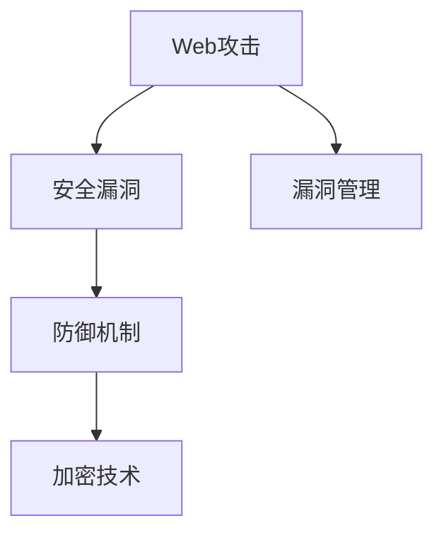

                 

# 安全编程实践：防御常见Web攻击

## 1. 背景介绍

### 1.1 问题由来

随着互联网的迅速发展，Web应用已成为企业和个人信息交流、数据交换的重要平台。然而，Web应用的复杂性和开放性也使其成为攻击者重点瞄准的对象。Web攻击不仅对应用自身造成损害，还可能对用户的隐私和数据安全构成威胁。如何有效防御这些攻击，保障Web应用的安全性，成为每个Web开发者必须面对的挑战。

### 1.2 问题核心关键点

防御Web攻击的关键在于理解和防范常见的攻击类型，并采取有效措施加固应用安全。目前常见的Web攻击包括SQL注入、跨站脚本攻击（XSS）、跨站请求伪造（CSRF）、点击劫持（Clickjacking）等。这些攻击利用了Web应用的漏洞，通过恶意手段获取敏感信息或控制用户行为。

### 1.3 问题研究意义

保障Web应用安全，不仅有助于保护企业和用户的利益，也是推动Web技术持续健康发展的基石。通过对Web攻击的深入研究，开发者可以更好地理解攻击原理，从而设计出更加安全、健壮的Web应用。

## 2. 核心概念与联系

### 2.1 核心概念概述

为更好地理解防御Web攻击的方法，本节将介绍几个密切相关的核心概念：

- Web攻击：指利用Web应用存在的漏洞，通过恶意手段对应用或用户造成损害的行为。常见的攻击类型包括SQL注入、XSS、CSRF等。
- 安全漏洞：Web应用中的设计或实现缺陷，可能被攻击者利用造成安全风险。如SQL注入利用了应用对用户输入数据的安全检查不足，XSS利用了HTML标签注入等。
- 防御机制：指通过技术手段，在Web应用中设置的多层安全保护措施。防御机制包括但不限于输入验证、输出编码、访问控制等。
- 加密技术：指将数据转换为不可读形式，以保护数据传输和存储安全的密码学技术。常见的加密方式包括对称加密和非对称加密。
- 漏洞管理：指在开发和运维过程中，持续监控和修复安全漏洞的策略和工具。

这些核心概念之间的逻辑关系可以通过以下Mermaid流程图来展示：



这个流程图展示了大语言模型的核心概念及其之间的关系：

1. Web攻击利用Web应用中的安全漏洞。
2. 防御机制通过技术手段防范和修复安全漏洞。
3. 加密技术为数据传输和存储提供安全保障。
4. 漏洞管理持续监控和修复安全漏洞。

这些概念共同构成了Web安全防护的框架，指导开发者在设计和实现Web应用时，从多维度提升应用的安全性。

## 3. 核心算法原理 & 具体操作步骤
### 3.1 算法原理概述

防御Web攻击的核心算法原理主要基于输入验证和输出编码两大类技术，结合加密技术，形成了一套全面的安全防御体系。

### 3.2 算法步骤详解

#### 3.2.1 输入验证

输入验证是防御Web攻击的第一道防线。其主要目的是确保所有用户输入的数据符合预期格式，防止恶意代码注入或数据篡改。

- 步骤1：定义输入验证规则。根据应用需求，定义数据类型、长度、格式等约束条件。
- 步骤2：对用户输入进行验证。在用户提交数据时，使用正则表达式、白名单验证等技术检查输入是否符合规则。
- 步骤3：拒绝非法输入。若用户输入不符合规则，则拒绝提交或进行数据清洗。

#### 3.2.2 输出编码

输出编码是防御Web攻击的第二道防线。其主要目的是防止攻击者通过注入恶意代码，对应用输出进行控制。

- 步骤1：选择输出编码方法。常用的输出编码方法包括HTML实体编码、JavaScript编码等。
- 步骤2：对应用输出进行编码。在应用生成输出时，自动应用选定的编码方法，将特殊字符转换为安全的输出形式。
- 步骤3：验证编码结果。检查编码后的输出是否符合安全要求，确保攻击者无法通过注入恶意代码进行攻击。

#### 3.2.3 加密技术

加密技术是保障数据传输和存储安全的重要手段。常见的加密技术包括对称加密和非对称加密。

- 步骤1：选择加密算法。根据数据传输和存储场景，选择适合的加密算法。
- 步骤2：实现数据加密。对敏感数据进行加密处理，确保数据在传输和存储过程中无法被未授权者获取。
- 步骤3：实现数据解密。在需要访问加密数据时，使用相应的密钥对数据进行解密，恢复其原始形式。

### 3.3 算法优缺点

防御Web攻击的算法具有以下优点：

- 主动防御。通过输入验证和输出编码等技术，可以在攻击发生前主动防范，而不是被动应对。
- 适用范围广。这些技术可以应用于各种Web应用，从简单的静态页面到复杂的多层Web服务。
- 成本较低。与传统的安全解决方案（如防火墙、入侵检测系统等）相比，输入验证和输出编码等技术所需的硬件和软件成本较低。

同时，这些算法也存在一些局限性：

- 攻击手段多样。攻击者可以不断尝试新的攻击手段，绕过现有防御措施。
- 易用性问题。一些输入验证和输出编码技术实现复杂，需要开发者具备一定的技术背景。
- 依赖规范。这些技术依赖于标准的输入验证规则和编码方法，如果标准被攻击者发现并利用，可能导致防御失效。

尽管存在这些局限性，但这些算法仍是当前Web安全防护的基础，必须在Web应用中得到广泛应用。

### 3.4 算法应用领域

防御Web攻击的算法在Web应用开发和运维中具有广泛的应用场景：

- 数据提交表单：如用户注册、登录、评论等。通过输入验证防止SQL注入、XSS等攻击。
- 动态页面生成：如搜索结果、动态内容展示等。通过输出编码防止跨站脚本攻击。
- 数据存储与传输：如用户数据存储、敏感信息传输等。通过加密技术保障数据安全。

这些技术在Web应用的安全防护中发挥着重要作用，保障了Web应用和用户数据的安全性。

## 4. 数学模型和公式 & 详细讲解 & 举例说明

### 4.1 数学模型构建

本节将使用数学语言对防御Web攻击的算法进行更加严格的刻画。

- 输入验证模型：假设用户输入数据为 $x$，验证规则为 $R$。验证过程可以用数学公式表示为：
$$
\text{验证结果} = \left\{
\begin{array}{ll}
\text{合法} & \text{若 } x \in R \\
\text{非法} & \text{若 } x \notin R
\end{array}
\right.
$$

- 输出编码模型：假设应用输出为 $y$，编码方法为 $C$。编码过程可以用数学公式表示为：
$$
\text{编码结果} = C(y)
$$

- 加密模型：假设原始数据为 $m$，加密算法为 $E$，密钥为 $k$。加密过程可以用数学公式表示为：
$$
\text{加密结果} = E(m, k)
$$

### 4.2 公式推导过程

#### 4.2.1 输入验证公式推导

假设输入验证规则 $R$ 为一个简单的正则表达式，表示所有合法的输入必须以字母开头，长度为5-10个字符。验证过程可以表示为：

$$
\text{验证结果} = \left\{
\begin{array}{ll}
\text{合法} & \text{若 } x \text{ 符合 } R \\
\text{非法} & \text{若 } x \text{ 不符合 } R
\end{array}
\right.
$$

- 若 $x$ 符合 $R$，则验证结果为合法。
- 若 $x$ 不符合 $R$，则验证结果为非法。

#### 4.2.2 输出编码公式推导

假设输出编码为HTML实体编码，将特殊字符转换为安全的HTML实体。编码过程可以表示为：

$$
\text{编码结果} = C(y)
$$

其中 $C$ 表示编码函数，将 $y$ 中的特殊字符 $\text{<}$、$\text{>}$、$\text{"}$、$\text{'}$ 等转换为安全的HTML实体形式。

#### 4.2.3 加密公式推导

假设对称加密算法为AES，原始数据为明文 $m$，密钥为 $k$。加密过程可以表示为：

$$
\text{加密结果} = E(m, k)
$$

其中 $E$ 表示加密函数，根据 $k$ 和 $m$ 的输入，输出对应的密文。

### 4.3 案例分析与讲解

#### 4.3.1 输入验证案例

假设有一个用户注册表单，输入验证规则为：用户名必须以字母开头，长度为5-10个字符，密码必须为8-20个字符，且包含至少一个大写字母和一个小写字母。可以设计以下Python代码实现输入验证：

```python
import re

def validate_input(username, password):
    username_pattern = r'^[a-zA-Z]\w{4,9}$'
    password_pattern = r'^(?=.*[a-z])(?=.*[A-Z])(?=.*\d)[a-zA-Z\d]{8,20}$'
    if not re.match(username_pattern, username):
        return False, '用户名不符合规则'
    if not re.match(password_pattern, password):
        return False, '密码不符合规则'
    return True, None
```

#### 4.3.2 输出编码案例

假设一个Web应用需要输出用户评论内容，为了避免XSS攻击，可以将用户评论中的HTML标签进行编码。可以设计以下Python代码实现输出编码：

```python
def output_encode(comment):
    return comment.replace('<', '&lt;').replace('>', '&gt;').replace('"', '&quot;').replace("'", '&#39;')
```

#### 4.3.3 加密案例

假设一个Web应用需要加密用户密码，以便安全传输。可以使用AES对称加密算法对用户密码进行加密。可以设计以下Python代码实现加密：

```python
from Crypto.Cipher import AES

def encrypt_password(password, key):
    cipher = AES.new(key.encode(), AES.MODE_ECB)
    encrypted_password = cipher.encrypt(password.encode())
    return encrypted_password.hex()
```

## 5. 项目实践：代码实例和详细解释说明
### 5.1 开发环境搭建

在进行Web应用开发前，我们需要准备好开发环境。以下是使用Python进行Flask框架开发的环境配置流程：

1. 安装Anaconda：从官网下载并安装Anaconda，用于创建独立的Python环境。

2. 创建并激活虚拟环境：
```bash
conda create -n flask-env python=3.8 
conda activate flask-env
```

3. 安装Flask：使用pip安装Flask框架。
```bash
pip install flask
```

4. 安装相关的安全库：
```bash
pip install flask-security flask-wtf
```

5. 安装加密库：
```bash
pip install Crypto
```

完成上述步骤后，即可在`flask-env`环境中开始Web应用开发。

### 5.2 源代码详细实现

下面我们以Web应用的用户注册页面为例，给出使用Flask和Flask-WTF进行输入验证的PyTorch代码实现。

首先，定义输入验证函数：

```python
from flask_wtf import FlaskForm
from wtforms import StringField, PasswordField, SubmitField, validators

class RegistrationForm(FlaskForm):
    username = StringField('Username', [validators.Length(min=5, max=10), validators.Regexp(r'^[a-zA-Z]\w+$')])
    password = PasswordField('Password', [validators.Length(min=8, max=20), validators.Regexp(r'^(?=.*[a-z])(?=.*[A-Z])(?=.*\d)[a-zA-Z\d]{8,20}$')])
    submit = SubmitField('Register')
```

然后，定义Web应用页面：

```python
from flask import Flask, render_template, redirect, url_for, flash
from flask_wtf import FlaskForm
from wtforms import StringField, PasswordField, SubmitField, validators
from flask_sqlalchemy import SQLAlchemy
from flask_login import LoginManager, login_user, login_required, logout_user

app = Flask(__name__)
app.config['SECRET_KEY'] = 'mysecretkey'
app.config['SQLALCHEMY_DATABASE_URI'] = 'sqlite:///test.db'
app.config['SQLALCHEMY_TRACK_MODIFICATIONS'] = False

db = SQLAlchemy(app)
login_manager = LoginManager()
login_manager.init_app(app)

class User(db.Model):
    id = db.Column(db.Integer, primary_key=True)
    username = db.Column(db.String(50), unique=True, nullable=False)
    password = db.Column(db.String(50), nullable=False)

@login_manager.user_loader
def load_user(user_id):
    return User.query.get(int(user_id))

@app.route('/')
def index():
    return render_template('index.html')

@app.route('/register', methods=['GET', 'POST'])
def register():
    form = RegistrationForm()
    if form.validate_on_submit():
        user = User(username=form.username.data, password=form.password.data)
        db.session.add(user)
        db.session.commit()
        flash('You have successfully registered!', 'success')
        return redirect(url_for('login'))
    return render_template('register.html', form=form)

@app.route('/login', methods=['GET', 'POST'])
def login():
    form = LoginForm()
    if form.validate_on_submit():
        user = User.query.filter_by(username=form.username.data).first()
        if user is None or not check_password_hash(user.password, form.password.data):
            flash('Invalid username or password', 'error')
            return redirect(url_for('login'))
        login_user(user)
        return redirect(url_for('index'))
    return render_template('login.html', form=form)

@app.route('/logout')
@login_required
def logout():
    logout_user()
    return redirect(url_for('index'))

if __name__ == '__main__':
    app.run(debug=True)
```

最后，定义Web应用的页面模板和CSS文件：

```html
<!-- index.html -->
<!DOCTYPE html>
<html>
<head>
    <title>Registration</title>
    <link rel="stylesheet" href="{{ url_for('static', filename='css/styled.css') }}">
</head>
<body>
    <h1>Registration</h1>
    <form method="post">
        {{ form.hidden_tag() }}
        {{ form.username.label }} {{ form.username() }}
        {{ form.password.label }} {{ form.password() }}
        {{ form.submit }}
    </form>
</body>
</html>

<!-- register.html -->
<!DOCTYPE html>
<html>
<head>
    <title>Register</title>
    <link rel="stylesheet" href="{{ url_for('static', filename='css/styled.css') }}">
</head>
<body>
    <h1>Register</h1>
    <form method="post">
        {{ form.hidden_tag() }}
        {{ form.username.label }} {{ form.username() }}
        {{ form.password.label }} {{ form.password() }}
        {{ form.submit }}
    </form>
</body>
</html>
```

### 5.3 代码解读与分析

让我们再详细解读一下关键代码的实现细节：

**RegistrationForm类**：
- `__init__`方法：初始化表单中的字段，包括用户名和密码。
- `validate_on_submit`方法：在表单提交时进行验证，检查用户输入是否符合规则。
- `username`和`password`字段：使用`StringField`和`PasswordField`定义字段类型和验证规则。

**Flask应用**：
- `app.config`：定义Web应用的各种配置参数，如`SECRET_KEY`、`SQLALCHEMY_DATABASE_URI`等。
- `SQLAlchemy`：定义数据库模型，创建用户表，并进行用户管理。
- `LoginManager`：实现用户登录和注销功能。

**Flask模板**：
- `index.html`：定义登录页面的基本结构和样式。
- `register.html`：定义用户注册页面的基本结构和样式。

以上就是使用Flask框架对Web应用进行输入验证的完整代码实现。可以看到，Flask-WTF使得表单验证变得简单易行，开发者只需定义验证规则，即可自动实现输入验证。

## 6. 实际应用场景
### 6.1 智能客服系统

智能客服系统是Web应用中常见的应用场景之一。智能客服系统能够快速响应客户咨询，提供24小时不间断的服务，极大提升了客户体验和满意度。

在智能客服系统中，输入验证和输出编码技术尤为重要。输入验证可以防止用户输入恶意代码，避免系统被攻击者控制；输出编码可以防止攻击者通过注入恶意代码，对系统进行控制。例如，可以使用Python的Flask-WTF库实现输入验证和输出编码，确保系统安全。

### 6.2 在线支付系统

在线支付系统涉及用户的敏感信息，如信用卡号、密码等，因此安全防护尤为关键。输入验证和加密技术是保障在线支付系统安全的基石。

在在线支付系统中，输入验证可以防止恶意用户通过输入非法字符或数据篡改进行攻击；加密技术可以确保用户输入的敏感信息在传输过程中无法被未授权者获取。例如，可以使用Python的Flask-WTF库进行输入验证，使用AES等加密算法进行加密处理，确保系统安全。

### 6.3 数据共享平台

数据共享平台是一个多用户参与的Web应用，用户可以上传、共享和访问数据。输入验证和加密技术可以确保数据共享平台的安全性。

在数据共享平台中，输入验证可以防止恶意用户上传恶意文件或脚本，避免系统被攻击；加密技术可以确保用户上传的数据在传输和存储过程中无法被未授权者获取。例如，可以使用Python的Flask-WTF库进行输入验证，使用AES等加密算法进行加密处理，确保数据安全。

### 6.4 未来应用展望

随着Web应用的发展和互联网技术的进步，Web安全防护技术也将不断演进。未来，Web安全防护将更加全面、智能、自动化，提升Web应用的安全性和用户体验。

1. 人工智能和机器学习：利用人工智能和机器学习技术，对Web攻击进行预测和防御。例如，使用机器学习算法分析攻击数据，自动调整防御策略，防范未知攻击。
2. 自动化防护工具：开发自动化防护工具，如自动修复漏洞、自动更新补丁等，提高Web防护的效率和准确性。
3. 多方协同防御：建立多方协同防御机制，如网络安全联盟、安全事件共享平台等，共享安全情报，协同应对攻击。
4. 安全教育和培训：加强安全教育和培训，提升用户和开发者的安全意识，减少安全事故的发生。

## 7. 工具和资源推荐
### 7.1 学习资源推荐

为了帮助开发者系统掌握Web安全防护的理论基础和实践技巧，这里推荐一些优质的学习资源：

1. OWASP网站：OWASP（Open Web Application Security Project）是一个国际知名的Web安全组织，提供了丰富的Web安全资料和教程。
2. Web安全攻防技术博客：如安全牛、FreeBuf等，这些网站提供了大量Web安全攻防技术文章和案例分析，是学习Web安全的宝贵资源。
3. Web应用攻防课程：如Coursera上的Web应用安全课程，由斯坦福大学、麻省理工学院等名校教授讲授，系统介绍Web安全防护理论和技术。
4. Web应用安全书籍：如《Web应用攻防实战》、《Web应用安全：原理与实践》等，这些书籍深入浅出地介绍了Web安全防护的理论和实践。

通过对这些资源的学习实践，相信你一定能够快速掌握Web安全防护的精髓，并用于解决实际的Web安全问题。
###  7.2 开发工具推荐

高效的开发离不开优秀的工具支持。以下是几款用于Web应用开发的常用工具：

1. Flask：轻量级的Web框架，简单易用，适合快速迭代开发。
2. Django：全功能的Web框架，支持ORM、模板引擎等，适合开发复杂的Web应用。
3. PyCharm：强大的Python开发工具，提供代码补全、调试、测试等功能，提升开发效率。
4. Git：版本控制工具，方便版本管理和团队协作。
5. Docker：容器化工具，方便应用程序的打包、部署和移植。
6. Jenkins：持续集成工具，自动构建和部署Web应用。

合理利用这些工具，可以显著提升Web应用开发的效率，加快创新迭代的步伐。

### 7.3 相关论文推荐

Web安全防护技术的发展源于学界的持续研究。以下是几篇奠基性的相关论文，推荐阅读：

1. A Survey of Software Vulnerabilities and Threats in Web Applications：详细介绍了Web应用中常见的安全漏洞和威胁，并提出了相应的防护措施。
2. Cross-Site Scripting Attacks: Survey and Countermeasures：全面综述了跨站脚本攻击的原理和防护技术，提出了多种防御策略。
3. SQL Injection Attacks: A Survey：总结了SQL注入攻击的原理和防护技术，提出了多种防御手段。
4. Web Application Firewall (WAF) Research Survey：介绍了Web应用防火墙的原理和实现方法，分析了其优缺点和应用场景。

这些论文代表了大语言模型微调技术的发展脉络。通过学习这些前沿成果，可以帮助研究者把握学科前进方向，激发更多的创新灵感。

## 8. 总结：未来发展趋势与挑战
### 8.1 总结

本文对防御Web攻击的方法进行了全面系统的介绍。首先阐述了Web攻击的背景和防御技术的重要性，明确了防御技术在保障Web应用安全方面的独特价值。其次，从原理到实践，详细讲解了输入验证、输出编码和加密技术的核心算法和具体操作步骤，给出了Web应用开发的完整代码实例。同时，本文还广泛探讨了Web安全防护在多个行业领域的应用前景，展示了Web安全防护技术的巨大潜力。

通过本文的系统梳理，可以看到，防御Web攻击的技术在Web应用开发和运维中具有广泛的应用场景，保障了Web应用和用户数据的安全性。

### 8.2 未来发展趋势

展望未来，Web安全防护技术将呈现以下几个发展趋势：

1. 自动化防御：利用人工智能和机器学习技术，实现Web攻击的自动化检测和防御，提升防护效率。
2. 智能防护：通过数据分析和行为监测，实现Web应用的智能防护，识别并防范未知攻击。
3. 零信任架构：采用零信任模型，对Web应用进行分层、多维度防护，确保系统安全。
4. 跨平台防护：实现Web应用的跨平台防护，覆盖桌面、移动、物联网等多种应用场景，提升防护水平。
5. 多方协同防护：建立多方协同防护机制，共享安全情报，协同应对攻击，提升防护能力。

以上趋势凸显了Web安全防护技术的广阔前景。这些方向的探索发展，必将进一步提升Web应用的安全性，保障企业和用户的利益。

### 8.3 面临的挑战

尽管Web安全防护技术已经取得了不少成果，但在保障Web应用安全的过程中，仍面临诸多挑战：

1. 攻击手段不断演进。攻击者不断尝试新的攻击手段，传统的防护措施可能无法应对。
2. 技术实现复杂。输入验证、输出编码等技术需要开发者具备一定的技术背景，实现难度较大。
3. 资源消耗较大。加密和数据加密等技术需要大量的计算资源，对硬件要求较高。
4. 用户体验影响。防护技术可能会对用户体验产生一定的影响，需要权衡安全与用户体验。
5. 漏洞管理困难。Web应用漏洞管理需要持续监控和修复，需要投入大量的人力和资源。

尽管存在这些挑战，但Web安全防护技术仍需在各个环节进行全面优化，才能真正实现Web应用的安全防护。

### 8.4 研究展望

面对Web安全防护所面临的种种挑战，未来的研究需要在以下几个方面寻求新的突破：

1. 探索更加智能的防护技术。利用人工智能和机器学习技术，实现Web攻击的自动化检测和防御。
2. 研究更加高效的加密算法。开发更加高效的加密算法，提升加密性能，降低计算资源消耗。
3. 引入多方协同防护机制。建立多方协同防护机制，共享安全情报，协同应对攻击，提升防护能力。
4. 加强安全教育和培训。提升用户和开发者的安全意识，减少安全事故的发生。

这些研究方向的研究突破，必将引领Web安全防护技术迈向更高的台阶，为构建安全、可靠、可控的Web应用铺平道路。

## 9. 附录：常见问题与解答

**Q1：Web应用中的输入验证如何实现？**

A: 输入验证是防御Web攻击的第一道防线，主要通过正则表达式、白名单验证等方式实现。可以使用Python的Flask-WTF库，定义数据类型和验证规则，自动进行输入验证。

**Q2：Web应用中的输出编码如何实现？**

A: 输出编码是防御Web攻击的第二道防线，主要通过将特殊字符转换为安全的HTML实体形式实现。可以使用Python的Flask-WTF库，将应用输出自动进行编码，确保安全。

**Q3：Web应用中的加密技术如何实现？**

A: 加密技术是保障数据传输和存储安全的重要手段，主要通过对称加密和非对称加密实现。可以使用Python的Crypto库，实现对称加密算法如AES，保障数据安全。

**Q4：Web应用中的安全漏洞如何管理？**

A: 安全漏洞管理需要持续监控和修复，主要通过定期审计、自动修复工具等方式实现。可以使用OWASP等工具，进行漏洞扫描和修复，保障系统安全。

**Q5：Web应用中的安全教育和培训如何实施？**

A: 安全教育和培训是提升用户和开发者安全意识的重要手段，主要通过安全培训课程、安全讲座等方式实现。可以使用Coursera等在线平台，提供安全教育和培训课程，提升安全意识。

这些问题的解答，可以帮助开发者更好地理解Web安全防护的实现细节，提升Web应用的安全性。

---

作者：禅与计算机程序设计艺术 / Zen and the Art of Computer Programming

