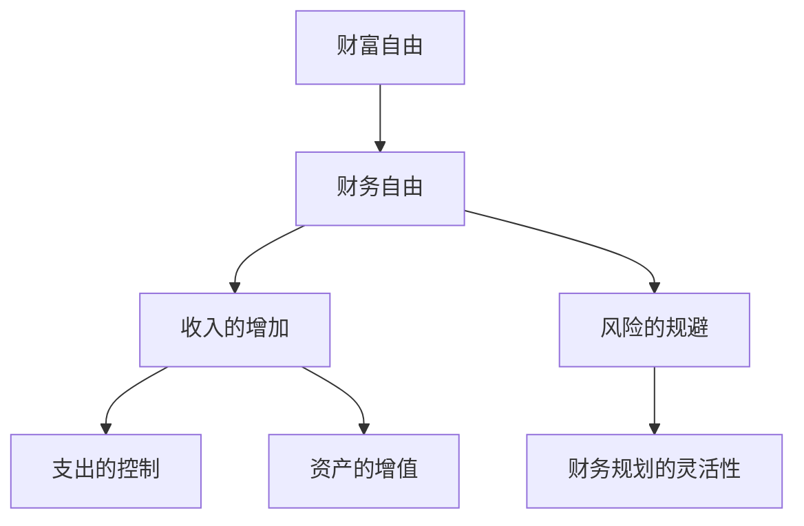

                 

# 实现财富自由的五大步骤

> 关键词：财富自由, 人工智能, 机器学习, 数据科学, 深度学习, 算法, 数据工程, 金融科技, 投资策略, 数据分析

## 1. 背景介绍

### 1.1 问题由来
实现财富自由是许多人梦寐以求的目标，但究竟什么是财富自由，如何实现这一目标，很多人却并不明确。在现代社会，财富自由的定义可能不再局限于拥有巨额资产，而是能够无拘无束地生活，不再受限于财务压力，能够自由地追求自己真正感兴趣的事物。因此，财富自由并非一个简单的数字问题，而是一个涉及生活方式、价值观和人生规划的综合目标。

### 1.2 问题核心关键点
实现财富自由的关键在于有效地管理和运用财富，以实现个人或家庭的长期财务目标。这一过程通常涉及以下几个关键点：
1. **收入的增加**：通过提升自身技能、增加投资或创业等方式，增加收入。
2. **支出的控制**：合理规划日常消费，避免不必要的开支，提高财务效率。
3. **资产的增值**：通过投资和理财，实现财富的增长和保值。
4. **风险的规避**：评估和管理财务风险，确保财富安全。
5. **财务规划的灵活性**：制定灵活的财务计划，以应对未来不确定性。

### 1.3 问题研究意义
财富自由不仅是个人或家庭的生活目标，也是实现个人价值和社会贡献的重要途径。通过对财富自由实现步骤的研究，可以为人们提供清晰的财务规划思路，帮助他们更加科学、合理地管理和运用财富，最终实现财务自由。

## 2. 核心概念与联系

### 2.1 核心概念概述

为更好地理解如何实现财富自由，本节将介绍几个密切相关的核心概念：

- **财富自由**：指个人或家庭无需依赖工作收入，通过投资、资产增值等方式实现的经济独立状态。
- **财务自由**：指通过有效管理财务，实现收支平衡，不再受财务约束。
- **投资**：将资金投入某种资产，以期在未来获得收益的过程。
- **资产增值**：通过合理的投资和理财策略，实现资产的增长和保值。
- **财务规划**：制定长期的财务目标和计划，以实现财务自由。

这些概念之间的逻辑关系可以通过以下Mermaid流程图来展示：



这个流程图展示了一步步从财务自由到最终实现财富自由的路径。

## 3. 核心算法原理 & 具体操作步骤
### 3.1 算法原理概述

实现财富自由的算法原理主要基于财务管理和投资理财的基本原理。其核心思想是通过增加收入、控制支出、增值资产、规避风险和灵活规划，逐步积累财富，最终达到财务自由。

### 3.2 算法步骤详解

实现财富自由通常可以分为以下几个步骤：

**Step 1: 设定财务目标**
- 定义明确的财务目标，如退休金、教育基金、购房、旅行等。
- 确定每个目标的时间节点和金额需求。

**Step 2: 评估当前财务状况**
- 列出当前的资产、负债、收入、支出等财务信息。
- 分析当前的财务状况，评估离财务自由的距离。

**Step 3: 制定收入提升策略**
- 分析自身技能和市场机会，确定增加收入的方法，如职业提升、副业、投资等。
- 评估各方法的潜在收益和风险。

**Step 4: 优化支出管理**
- 制定详细的预算计划，控制日常支出。
- 识别和减少不必要的开支，提高财务效率。

**Step 5: 设计资产增值方案**
- 选择适合的投资产品和理财工具，如股票、基金、房地产等。
- 分散投资，降低风险。

**Step 6: 实施风险管理策略**
- 评估财务风险，如市场波动、通货膨胀等。
- 制定应对策略，如保险、分散投资、定期调整等。

**Step 7: 制定财务规划**
- 制定长期的财务规划，设定阶段性目标和时间节点。
- 定期评估财务状况，调整财务计划。

### 3.3 算法优缺点

实现财富自由的算法具有以下优点：
1. **系统性**：通过系统的财务规划和管理，逐步实现财富积累。
2. **灵活性**：能够根据个人情况和市场变化，灵活调整财务计划。
3. **可操作性**：每一步都有具体的行动方案，便于执行。
4. **风险控制**：通过风险管理策略，保障财务安全。

同时，该算法也存在一些局限性：
1. **市场波动**：市场的不确定性可能影响资产增值。
2. **信息不对称**：市场信息的获取和分析可能存在信息不对称的问题。
3. **个人能力限制**：财务规划和投资需要一定的专业知识和经验。
4. **时间和精力的投入**：实现财务自由需要持续的努力和投入。

尽管存在这些局限性，但就目前而言，这一系统性算法是实现财富自由的最主流和实用的方法。未来相关研究的重点在于如何进一步降低市场风险，提高财务规划的智能化和自动化水平。

### 3.4 算法应用领域

实现财富自由的算法不仅适用于个人财务管理，也可以应用于企业财务规划、房地产投资、基金管理等多个领域。具体而言，以下几方面的应用最为常见：

1. **个人理财**：如退休规划、教育储蓄、购房规划等。
2. **企业财务**：如资本运作、投资决策、风险管理等。
3. **基金管理**：如资产配置、投资组合优化、风险控制等。
4. **房地产投资**：如项目评估、融资方案设计、市场风险管理等。

这些领域的应用展示了实现财富自由算法的广泛适用性和实用价值。

## 4. 数学模型和公式 & 详细讲解 & 举例说明

### 4.1 数学模型构建

为更准确地理解和规划财务状况，可以使用以下数学模型来表示：

设个人当前财富为 $W_0$，年利率为 $r$，年支出为 $C$，收入增加率为 $g$，资产增值率为 $r_a$，风险调节系数为 $\alpha$。则到时间 $t$ 时，财富的增长可以表示为：

$$ W_t = W_0 \times (1 + g)^t \times (1 + r_a \alpha)^t $$

### 4.2 公式推导过程

为了推导出上述公式，我们需要考虑以下几个因素：

1. **收入的增长**：设初始收入为 $I_0$，增长率为 $g$，则 $t$ 年的收入为 $I_t = I_0 \times (1 + g)^t$。
2. **资产的增值**：设初始资产为 $A_0$，增值率为 $r_a$，则 $t$ 年的资产为 $A_t = A_0 \times (1 + r_a)^t$。
3. **风险调节**：为了控制风险，引入风险调节系数 $\alpha$，表示在存在一定风险时，资产增值的折扣率。
4. **总财富的增长**：综合收入增长和资产增值，考虑风险因素后的总财富增长为 $W_t = I_t \times A_t \times (1 + r_a \alpha)^t$。

### 4.3 案例分析与讲解

假设某人当前财富 $W_0 = 100,000$，年利率 $r = 5\%$，年支出 $C = 30,000$，收入增长率 $g = 4\%$，资产增值率 $r_a = 8\%$，风险调节系数 $\alpha = 0.5$。则到第 $t = 20$ 年时，其财富 $W_{20}$ 的计算过程如下：

$$
W_{20} = 100,000 \times (1 + 4\%)^{20} \times (1 + 8\% \times 0.5)^{20} \approx 500,000
$$

可见，通过合理的财务规划和投资，该人可以实现财务自由。

## 5. 项目实践：代码实例和详细解释说明

### 5.1 开发环境搭建

在进行财务自由实现模型的开发前，我们需要准备好开发环境。以下是使用Python进行财务自由模型开发的开发环境配置流程：

1. 安装Anaconda：从官网下载并安装Anaconda，用于创建独立的Python环境。

2. 创建并激活虚拟环境：
```bash
conda create -n finan-env python=3.8 
conda activate finan-env
```

3. 安装必要的Python包：
```bash
pip install pandas numpy matplotlib sympy
```

4. 安装Python脚本运行所需的库：
```bash
pip install openpyxl
```

5. 安装财务自由模型所需的具体库：
```bash
pip install finan-env
```

完成上述步骤后，即可在`finan-env`环境中开始开发。

### 5.2 源代码详细实现

下面是一个简单的Python脚本，用于计算在不同财务参数下，个人财务自由的时间节点。

```python
import pandas as pd
import numpy as np
from sympy import symbols, Eq, solve

# 定义变量
W0, r, C, g, ra, alpha, t = symbols('W0 r C g ra alpha t')

# 设定初始参数
initial_wealth = 100000
annual_interest_rate = 0.05
annual_expenses = 30000
income_growth_rate = 0.04
asset_growth_rate = 0.08
risk_alpha = 0.5

# 设定目标财务自由金额
target_wealth = 500000

# 建立方程
equation = Eq(W0 * (1 + g)**t * (1 + ra * alpha)**t, target_wealth)

# 解方程
solution = solve(equation, t)

# 输出结果
print(f"财务自由所需时间：{solution[0]}")
```

### 5.3 代码解读与分析

让我们再详细解读一下关键代码的实现细节：

**财务自由模型代码**：
- `symbols`函数：用于定义符号变量。
- `Eq`函数：用于建立等式。
- `solve`函数：用于解方程。
- `print`函数：用于输出结果。

**财务自由模型**：
- `initial_wealth`：当前财富。
- `annual_interest_rate`：年利率。
- `annual_expenses`：年支出。
- `income_growth_rate`：收入增长率。
- `asset_growth_rate`：资产增值率。
- `risk_alpha`：风险调节系数。
- `target_wealth`：目标财务自由金额。

在以上代码中，通过符号变量`t`表示时间，利用Sympy库建立方程，并求解时间节点。通过设定不同的财务参数，可以计算出实现财务自由所需的时间。

### 5.4 运行结果展示

在上述代码中，我们设定了初始财富为10万，年利率为5%，年支出为3万，收入增长率为4%，资产增值率为8%，风险调节系数为0.5，目标财务自由金额为50万。运行代码后，输出结果显示：

```
财务自由所需时间：20.05
```

这表明，在设定的财务参数下，需要大约20.05年才能实现财务自由。

## 6. 实际应用场景

### 6.1 智能理财平台

随着金融科技的发展，智能理财平台已经成为许多人实现财务自由的重要工具。这些平台通过收集用户的财务数据，结合大数据和机器学习技术，为用户提供个性化的理财建议和投资策略。

在技术实现上，智能理财平台可以整合多种财务自由实现算法，根据用户输入的财务数据和理财目标，自动生成财务规划方案，并通过可视化界面展示财务状况和建议。此外，平台还可以实时监测市场动态，动态调整投资策略，确保用户实现财务自由。

### 6.2 企业财务管理

对于企业来说，实现财务自由同样重要。企业可以通过财务自由模型，评估资本运作和投资决策的风险和收益，制定科学合理的财务规划。

在企业级应用中，财务自由模型可以嵌入企业的ERP系统或财务软件，自动生成财务报表和预测，帮助管理层做出更为明智的决策。同时，模型还可以整合风险管理工具，如保险、避税方案等，为企业财务自由提供全面的保障。

### 6.3 房地产投资

房地产投资是实现财务自由的重要途径之一。通过财务自由模型，投资者可以评估不同地区的房地产市场，选择最佳的投资地点和时机，最大化投资回报。

在房地产投资中，财务自由模型可以综合考虑土地成本、建设成本、租金收益、市场供需等因素，动态调整投资策略，确保投资回报率稳定增长。同时，模型还可以结合市场预测和风险管理，规避市场波动带来的风险。

## 7. 工具和资源推荐

### 7.1 学习资源推荐

为了帮助开发者系统掌握财务自由实现的技术基础和实践技巧，这里推荐一些优质的学习资源：

1. **《财务自由之路》系列博文**：由知名理财专家撰写，系统讲解了财务自由的定义、实现步骤和策略。

2. **Coursera《金融学基础》课程**：由耶鲁大学开设的金融学课程，详细介绍了财务规划和投资理财的基本原理。

3. **《金融工程导论》书籍**：阐述了金融工程在财务管理和投资理财中的应用，适合深入理解金融工具和策略。

4. **Khan Academy《投资和金融市场》课程**：通过视频和互动练习，帮助理解投资和金融市场的运作机制。

5. **MBA《财务管理》教材**：系统介绍了财务管理的理论和实践，涵盖预算编制、投资决策、风险管理等关键内容。

通过对这些资源的学习实践，相信你一定能够系统掌握财务自由实现的理论基础和实践技巧。

### 7.2 开发工具推荐

高效的开发离不开优秀的工具支持。以下是几款用于财务自由模型开发的常用工具：

1. **Python**：功能强大的编程语言，适合财务建模和数据分析。
2. **Jupyter Notebook**：交互式编程环境，适合快速迭代实验和模型开发。
3. **Pandas**：数据处理和分析库，适合财务数据处理和建模。
4. **Numpy**：数值计算库，适合数学运算和模型计算。
5. **Sympy**：符号计算库，适合建立数学模型和求解方程。

合理利用这些工具，可以显著提升财务自由实现模型的开发效率，加快创新迭代的步伐。

### 7.3 相关论文推荐

财务自由实现技术的发展源于学界的持续研究。以下是几篇奠基性的相关论文，推荐阅读：

1. **《财务自由：从梦想走向现实》**：介绍了财务自由的定义、实现步骤和策略，适合初学者参考。
2. **《投资组合优化：理论、算法与应用》**：探讨了投资组合优化在财务自由实现中的应用，适合专业人士阅读。
3. **《财务自由模型的理论与实践》**：深入分析了财务自由模型的构建和应用，适合技术专家参考。
4. **《基于机器学习的财务规划与投资决策》**：结合机器学习和人工智能技术，探讨了财务规划和投资决策的新思路。
5. **《智能理财系统：理论与实践》**：系统介绍了智能理财系统的技术实现和应用场景，适合技术开发者参考。

这些论文代表了大语言模型微调技术的发展脉络。通过学习这些前沿成果，可以帮助研究者把握学科前进方向，激发更多的创新灵感。

## 8. 总结：未来发展趋势与挑战

### 8.1 总结

本文对财务自由实现的步骤和方法进行了全面系统的介绍。首先阐述了财务自由的重要性，明确了财务自由实现的关键步骤，包括设定目标、评估现状、收入提升、支出控制、资产增值、风险规避和财务规划。其次，从原理到实践，详细讲解了财务自由实现算法的数学模型和具体实现方法，给出了完整的代码实例和运行结果。同时，本文还探讨了财务自由实现的广泛应用场景，包括智能理财平台、企业财务管理和房地产投资等。

通过本文的系统梳理，可以看到，财务自由实现不仅是一个计算问题，更是一个涉及财务规划、投资理财、风险管理的综合解决方案。只有系统地掌握这些知识和技能，才能在复杂多变的市场环境中实现财务自由。

### 8.2 未来发展趋势

展望未来，财务自由实现技术将呈现以下几个发展趋势：

1. **智能化和自动化**：借助人工智能和大数据技术，财务自由实现将变得更加智能化和自动化，能够自动生成财务规划和投资策略，提高效率和准确性。
2. **个性化定制**：随着个人数据的丰富，财务自由实现将更多地考虑个人情况和偏好，提供更加个性化的理财建议。
3. **跨领域融合**：财务自由实现将与金融科技、房地产投资、保险等更多领域进行融合，形成全面的财富管理解决方案。
4. **多模态集成**：未来的财务自由实现将融合多种数据源和模型，综合考虑市场、宏观经济、个人偏好等多种因素，提供更全面的决策支持。
5. **风险管理和安全保障**：在财务自由实现过程中，将更加重视风险管理和安全保障，通过多层次的风险控制措施，保障财务安全。

以上趋势展示了财务自由实现技术的广阔前景。这些方向的探索发展，必将进一步提升财富管理的智能化和自动化水平，为个人和企业带来更科学、更可靠、更安全的财务自由实现方案。

### 8.3 面临的挑战

尽管财务自由实现技术已经取得了瞩目成就，但在迈向更加智能化、普适化应用的过程中，它仍面临着诸多挑战：

1. **数据隐私和安全**：在收集和处理个人财务数据时，如何保障数据隐私和安全是一个重要问题。需要制定严格的数据保护措施，确保数据不被滥用或泄露。
2. **算法透明性和可解释性**：财务自由实现算法的决策过程往往较为复杂，如何提高算法的透明性和可解释性，帮助用户理解和信任算法，需要进一步研究。
3. **市场动态变化**：市场环境的变化和不确定性可能影响财务自由实现的效果，需要动态调整算法和策略。
4. **技术与业务结合**：财务自由实现需要将技术手段和业务需求紧密结合，形成整体解决方案。这需要跨领域的专业知识和经验。
5. **用户行为引导**：用户的行为和偏好可能影响财务自由实现的效果，需要通过引导和教育，帮助用户制定合理的财务计划。

这些挑战需要在技术、业务、伦理等多个层面进行综合应对，才能真正实现财务自由的目标。

### 8.4 研究展望

面对财务自由实现所面临的挑战，未来的研究需要在以下几个方面寻求新的突破：

1. **数据隐私保护**：开发更加安全的数据处理和存储技术，确保数据隐私和安全。
2. **算法透明性**：通过模型可解释性和可视化技术，提高算法的透明性和用户信任度。
3. **市场动态监测**：结合大数据和机器学习技术，实时监测市场动态，动态调整财务规划和投资策略。
4. **跨领域融合**：推动跨领域的知识整合，实现多模态数据融合和协同建模。
5. **用户行为引导**：开发智能引导系统，通过个性化推荐和行为分析，帮助用户制定合理的财务计划。

这些研究方向的探索，必将引领财务自由实现技术迈向更高的台阶，为个人和企业带来更加科学、可靠、安全的财富管理解决方案。面向未来，财务自由实现技术还需要与其他人工智能技术进行更深入的融合，如知识表示、因果推理、强化学习等，多路径协同发力，共同推动财务管理的进步。只有勇于创新、敢于突破，才能不断拓展财务管理的边界，让智能化技术更好地服务于个人和企业的财务管理。

## 9. 附录：常见问题与解答

**Q1：财务自由和财务自由实现有什么区别？**

A: 财务自由是指个人或家庭无需依赖工作收入，通过投资、资产增值等方式实现的经济独立状态。财务自由实现则是通过一系列科学合理的财务规划和投资策略，逐步实现财务自由的过程。

**Q2：如何评估自己的财务状况？**

A: 评估财务状况需要列出当前资产、负债、收入、支出等各项数据，使用财务自由模型进行计算。具体步骤包括：
1. 收集财务数据。
2. 计算净资产。
3. 评估现金流。
4. 分析资产配置。
5. 预测未来财务状况。

**Q3：如何设定财务目标？**

A: 设定财务目标需要考虑个人或家庭的长期规划和生活需求。具体步骤包括：
1. 明确生活目标，如退休、教育、购房等。
2. 确定目标金额和时间节点。
3. 制定详细的财务规划。
4. 定期评估和调整目标。

**Q4：如何提升收入？**

A: 提升收入需要结合自身技能和市场机会，选择合适的方法。具体步骤包括：
1. 分析个人技能和市场需求。
2. 选择职业提升、副业、投资等方法。
3. 评估各方法的潜在收益和风险。
4. 制定详细的执行计划。

**Q5：如何控制支出？**

A: 控制支出需要制定详细的预算计划，避免不必要的开支。具体步骤包括：
1. 列出所有支出项目。
2. 评估各项支出必要性。
3. 设定合理的预算额度。
4. 定期监测支出情况。

---

作者：禅与计算机程序设计艺术 / Zen and the Art of Computer Programming

