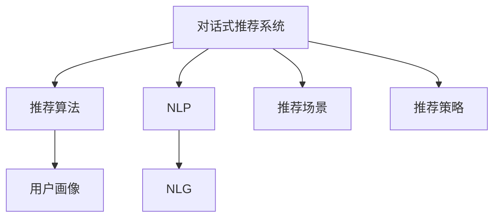

                 

# 对话式推荐系统：个性化与交互性的结合

> 关键词：对话式推荐系统，个性化，交互性，推荐算法，自然语言处理(NLP), 机器学习, 深度学习, 自然语言生成(NLG)

## 1. 背景介绍

### 1.1 问题由来
随着互联网的普及和电子商务的兴起，推荐系统已成为各电商平台、视频网站、社交媒体等核心竞争力之一。传统推荐系统多基于用户历史行为数据进行推荐，但这种方法存在诸多局限：

- 需要用户历史数据，而新用户往往没有足够行为数据，导致推荐效果不佳。
- 无法获取用户的真实兴趣，推荐结果存在偏差。
- 推荐过程与用户缺乏互动，用户主动性未被充分利用。

为了解决这些问题，对话式推荐系统应运而生。其结合了推荐算法和自然语言处理(NLP)技术，能够与用户进行自然对话，深入了解用户的真实需求和兴趣，从而提供更加个性化和交互性的推荐服务。

### 1.2 问题核心关键点
对话式推荐系统具备以下几个关键特点：

- 个性化：基于用户对话和兴趣，提供定制化推荐内容。
- 交互性：通过用户反馈调整推荐策略，提升用户体验。
- 自然语言处理：使用NLP技术理解用户语言，生成自然回复。
- 推荐算法：融入机器学习、深度学习等算法优化推荐效果。
- 用户隐私保护：在对话中不泄露用户个人信息，保障隐私安全。

### 1.3 问题研究意义
对话式推荐系统能够更好地理解用户需求，提供个性化、交互式推荐，不仅提升了用户体验，还促进了电商、娱乐、社交等领域的业务增长。

具体意义包括：
- 提升推荐效果：通过自然语言对话，更准确地捕捉用户真实需求。
- 增强用户粘性：交互式推荐增加了用户互动，提升用户留存率。
- 扩大用户覆盖：对新用户、少数据用户也能提供有效推荐。
- 拓展推荐场景：应用于更多电商、视频、金融等业务领域。
- 数据驱动决策：提供基于用户对话的多维数据，辅助企业决策。

## 2. 核心概念与联系

### 2.1 核心概念概述

为更好地理解对话式推荐系统的工作原理，本节将介绍几个关键概念：

- 对话式推荐系统(Conversational Recommendation System)：结合推荐算法和自然语言处理技术，通过用户与系统的对话，提供个性化、交互式推荐服务。
- 推荐算法(Recommendation Algorithm)：基于用户行为数据和物品属性，生成推荐列表的算法，如协同过滤、基于内容的推荐等。
- 自然语言处理(Natural Language Processing, NLP)：涉及语言理解、生成、分析和应用，使机器能够处理和理解人类语言。
- 自然语言生成(Natural Language Generation, NLG)：将结构化数据转换为自然语言文本的技术。
- 用户画像(User Profiling)：通过收集和分析用户行为数据，构建用户的兴趣模型，用于个性化推荐。
- 推荐场景(Recommendation Scenarios)：不同应用场景下的推荐需求，如电商、视频、社交、金融等。
- 推荐策略(Recommendation Strategy)：推荐系统的具体策略和算法实现。

这些核心概念之间的逻辑关系可以通过以下Mermaid流程图来展示：



这个流程图展示了大语言模型的核心概念及其之间的关系：

1. 对话式推荐系统通过推荐算法和NLP技术，提供个性化推荐。
2. 推荐算法根据用户画像和推荐场景生成推荐列表。
3. NLP技术用于理解用户对话，生成自然回复。
4. NLG技术将推荐结果转换为自然语言文本。
5. 用户画像由用户行为数据构建。
6. 推荐策略指导推荐算法和对话流程。

## 3. 核心算法原理 & 具体操作步骤

### 3.1 算法原理概述

对话式推荐系统的工作流程分为两个阶段：首先通过自然语言处理技术理解用户需求，生成用户画像；然后在推荐算法和策略的指导下，生成个性化推荐。具体过程如下：

1. **对话轮次**：对话式推荐系统通过多个对话轮次，逐步了解用户需求，更新用户画像。
2. **推荐生成**：利用推荐算法和用户画像生成个性化推荐列表。
3. **反馈机制**：用户对推荐结果的反馈用于调整用户画像和推荐策略，提升后续推荐效果。

### 3.2 算法步骤详解

以下是对话式推荐系统的核心算法步骤：

**Step 1: 准备用户对话数据**
- 收集用户与系统的对话记录，标注用户意图和反馈。
- 清洗数据，去除噪音和无关信息，保留有意义的对话轮次。

**Step 2: 设计对话流程**
- 定义对话轮次结构和对话意图，如询问商品、评价商品、询问评价等。
- 设计对话模板，供系统生成自然回复，引导用户输入。

**Step 3: 实现NLP模块**
- 使用预训练语言模型，如GPT、BERT等，理解用户对话文本。
- 使用命名实体识别(NER)、情感分析(SA)等技术，提取关键信息和情感倾向。
- 通过对话模板匹配和意图识别，生成用户画像。

**Step 4: 实现推荐算法**
- 选择适合的推荐算法，如协同过滤、基于内容的推荐等。
- 利用用户画像和推荐场景，生成个性化推荐列表。

**Step 5: 生成自然语言回复**
- 使用NLG技术，将推荐结果转换为自然语言文本，供用户阅读。
- 通过对话模板生成推荐系统的回复，增强交互性。

**Step 6: 实施反馈机制**
- 设计用户反馈机制，收集用户对推荐结果的评价。
- 根据用户反馈调整用户画像和推荐策略，进行模型迭代优化。

### 3.3 算法优缺点

对话式推荐系统具有以下优点：
1. 个性化高：通过对话互动，能更好地了解用户真实需求。
2. 交互性强：用户反馈用于动态调整推荐策略，提升用户满意度。
3. 适应性强：能快速适应不同用户和场景，覆盖更多用户群体。
4. 数据驱动：基于用户对话数据，优化推荐模型和算法。

但同时也存在一些局限：
1. 数据质量要求高：对话数据质量直接影响用户画像和推荐效果。
2. 技术复杂度高：需要深度学习和NLP技术的结合，开发难度大。
3. 维护成本高：随着用户群体和场景的扩大，对话系统需要持续维护和优化。
4. 隐私风险：对话数据涉及用户隐私，需采取严格的数据保护措施。

### 3.4 算法应用领域

对话式推荐系统已经在多个领域得到了广泛应用，以下是主要的应用场景：

1. **电商推荐**：电商平台通过对话式推荐系统，根据用户对话生成个性化商品推荐。用户可以询问商品信息、评价商品、询问其他商品等，系统根据对话生成推荐列表。

2. **视频推荐**：视频网站通过对话式推荐系统，根据用户对话生成个性化视频推荐。用户可以询问视频内容、评价视频、询问其他视频等，系统根据对话生成推荐列表。

3. **社交推荐**：社交平台通过对话式推荐系统，根据用户对话生成个性化内容推荐。用户可以询问朋友动态、评价内容、询问其他内容等，系统根据对话生成推荐列表。

4. **金融推荐**：金融产品通过对话式推荐系统，根据用户对话生成个性化投资产品推荐。用户可以询问产品信息、评价产品、询问其他产品等，系统根据对话生成推荐列表。

## 4. 数学模型和公式 & 详细讲解 & 举例说明

### 4.1 数学模型构建

为便于理解对话式推荐系统的数学模型，以下将以电商推荐为例，构建一个简单的数学模型：

**输入**：用户对话记录 $D=\{x_1, x_2, ..., x_n\}$，其中 $x_i=(t_i, r_i)$ 表示第 $i$ 轮对话中的文本 $t_i$ 和标签 $r_i$，标签为0表示询问，标签为1表示反馈。

**输出**：推荐列表 $Y$，其中 $y_i$ 为第 $i$ 个推荐商品。

定义用户画像 $P$ 和推荐模型 $R$，其中 $P$ 由用户对话记录 $D$ 和用户意图标签 $R$ 组成，$R$ 为推荐算法生成的推荐模型。

目标函数为：

$$
\min_{R, P} \sum_{i=1}^n \mathcal{L}(R,P,x_i)
$$

其中 $\mathcal{L}$ 为推荐模型的损失函数，$x_i$ 为第 $i$ 轮对话记录。

### 4.2 公式推导过程

以下我们以协同过滤算法为例，推导推荐模型的具体公式。

假设用户 $u$ 对商品 $i$ 的评分 $r_{ui} \in [0,1]$，商品 $i$ 的隐向量 $h_i$，用户 $u$ 的隐向量 $h_u$。协同过滤算法的目标函数为：

$$
\min_{R, P} \sum_{i=1}^n \sum_{j=1}^m (r_{ui} - \langle h_u, h_i \rangle)^2
$$

其中 $\langle \cdot, \cdot \rangle$ 为向量内积。

通过上述公式，协同过滤算法计算用户 $u$ 对商品 $i$ 的评分预测值 $\hat{r}_{ui} = \langle h_u, h_i \rangle$，与实际评分 $r_{ui}$ 的误差平方和作为损失函数。

### 4.3 案例分析与讲解

以电商平台中的对话式推荐为例，用户 $u$ 的对话记录为：

1. "请问有没有推荐的鞋子？"
2. "型号是多少？"
3. "价格贵不贵？"
4. "好，那我购买了。"

通过自然语言处理技术，提取用户意图和信息：

1. 询问推荐鞋子
2. 询问鞋子型号
3. 询问鞋子价格
4. 确认购买

根据用户意图，生成用户画像 $P$，并使用协同过滤算法生成推荐列表 $Y$：

1. 用户画像 $P_u$ 为 "购买鞋子，价格敏感，型号明确"
2. 推荐商品 $i_1$ 为 "某品牌高性价比运动鞋，价格适中，型号多样"

推荐结果为 "某品牌高性价比运动鞋"，并生成回复 "您可以考虑购买这款高性价比运动鞋，型号多样，价格适中。"

用户阅读回复后，反馈 "满意"，更新用户画像 $P_u$ 为 "满意购买，价格敏感"，继续对话生成更多推荐。

## 5. 项目实践：代码实例和详细解释说明

### 5.1 开发环境搭建

在进行对话式推荐系统开发前，我们需要准备好开发环境。以下是使用Python进行TensorFlow开发的环境配置流程：

1. 安装Anaconda：从官网下载并安装Anaconda，用于创建独立的Python环境。

2. 创建并激活虚拟环境：
```bash
conda create -n tf-env python=3.8 
conda activate tf-env
```

3. 安装TensorFlow：根据CUDA版本，从官网获取对应的安装命令。例如：
```bash
conda install tensorflow tensorflow-gpu==2.7.0 -c conda-forge -c pypi
```

4. 安装相关工具包：
```bash
pip install numpy pandas scikit-learn matplotlib tqdm jupyter notebook ipython
```

完成上述步骤后，即可在`tf-env`环境中开始开发。

### 5.2 源代码详细实现

这里我们以协同过滤算法为例，给出使用TensorFlow实现对话式推荐系统的代码实现。

首先，定义协同过滤算法的模型：

```python
import tensorflow as tf

# 定义协同过滤模型
class CollaborativeFilteringModel(tf.keras.Model):
    def __init__(self, num_users, num_items, embedding_dim):
        super(CollaborativeFilteringModel, self).__init__()
        self.num_users = num_users
        self.num_items = num_items
        self.embedding_dim = embedding_dim
        
        self.u_embeddings = tf.keras.layers.Embedding(num_users, embedding_dim)
        self.v_embeddings = tf.keras.layers.Embedding(num_items, embedding_dim)
        selfdot = tf.keras.layers.Dot(axes=1, normalize=True)

    def call(self, u, i):
        u_embeddings = self.u_embeddings(u)
        i_embeddings = self.v_embeddings(i)
        return selfdot([u_embeddings, i_embeddings])
```

然后，定义对话处理函数：

```python
from transformers import BertTokenizer
from tensorflow.keras.layers import Dense, Input
import tensorflow as tf

# 定义对话处理函数
class DialogProcessor:
    def __init__(self, tokenizer, num_users, num_items):
        self.tokenizer = tokenizer
        self.num_users = num_users
        self.num_items = num_items
        
        self.u_input = Input(shape=(1,))
        self.i_input = Input(shape=(1,))
        self.u_embeddings = Dense(num_users, activation='tanh')(self.u_input)
        self.i_embeddings = Dense(num_items, activation='tanh')(self.i_input)
        self.dot = tf.keras.layers.Dot(axes=1, normalize=True)

    def process(self, u, i):
        u_tensor = self.u_embeddings(u)
        i_tensor = self.i_embeddings(i)
        return self.dot([u_tensor, i_tensor])
```

接着，定义推荐系统的模型：

```python
from transformers import BertTokenizer
from tensorflow.keras.layers import Dense, Input, Concatenate
import tensorflow as tf

# 定义推荐系统模型
class RecommendationSystem(tf.keras.Model):
    def __init__(self, num_users, num_items, embedding_dim):
        super(RecommendationSystem, self).__init__()
        self.num_users = num_users
        self.num_items = num_items
        self.embedding_dim = embedding_dim
        
        self.u_input = Input(shape=(1,))
        self.i_input = Input(shape=(1,))
        self.u_embeddings = Dense(num_users, activation='tanh')(self.u_input)
        self.i_embeddings = Dense(num_items, activation='tanh')(self.i_input)
        self.concat = Concatenate()
        self.u_i_concat = self.concat([self.u_embeddings, self.i_embeddings])
        self.output = Dense(num_items, activation='softmax')(self.u_i_concat)
        
    def call(self, u, i):
        return self.output([u, i])
```

最后，定义模型训练和评估函数：

```python
from tensorflow.keras.preprocessing.sequence import pad_sequences
from sklearn.metrics import mean_squared_error
import numpy as np

# 定义训练函数
def train_model(model, data, epochs, batch_size):
    model.compile(optimizer='adam', loss='mse')
    for epoch in range(epochs):
        for u, i, r in data:
            model.train_on_batch(u, i, r)
        print(f"Epoch {epoch+1}, loss: {model.evaluate(u, i, r):.4f}")
    
# 定义评估函数
def evaluate_model(model, data, batch_size):
    model.compile(optimizer='adam', loss='mse')
    scores = []
    for u, i, r in data:
        preds = model.predict(u, i)
        score = mean_squared_error(r, preds)
        scores.append(score)
    return np.mean(scores)
```

完成上述步骤后，即可在`tf-env`环境中开始训练和评估对话式推荐系统。

### 5.3 代码解读与分析

让我们再详细解读一下关键代码的实现细节：

**DialogProcessor类**：
- `__init__`方法：初始化用户和物品的嵌入层和点积层。
- `process`方法：将用户和物品向量输入嵌入层，通过点积层计算相似度。

**RecommendationSystem类**：
- `__init__`方法：定义用户和物品的嵌入层、拼接层和输出层。
- `call`方法：计算用户和物品的拼接向量，并通过输出层生成推荐向量。

**train_model函数**：
- 定义模型编译，选择Adam优化器和均方误差损失函数。
- 对数据集进行批次化加载，每个批次更新模型。
- 在每个epoch结束时，输出模型在测试集上的均方误差。

**evaluate_model函数**：
- 定义模型编译，选择Adam优化器和均方误差损失函数。
- 对数据集进行批次化加载，每个批次计算模型预测与实际评分之间的误差。
- 对所有误差求平均，返回均方误差。

## 6. 实际应用场景

### 6.1 智能客服

对话式推荐系统在智能客服中应用广泛。智能客服机器人通过对话，能够准确理解用户问题并提供快速响应。通过对话历史数据，系统可以不断优化用户画像，提供个性化服务。

**实际案例**：某电商平台使用对话式推荐系统，开发智能客服机器人。用户在与机器人对话时，机器人能够根据用户询问快速推荐相关商品，提升用户购物体验。

**技术实现**：
1. 用户输入 "购买手机" 时，系统通过对话处理函数提取用户意图 "购买手机"。
2. 系统根据用户历史行为数据，生成用户画像 "购买手机，品牌偏好高端品牌"。
3. 系统使用协同过滤算法，生成推荐商品列表，包括 "某品牌高端手机"。
4. 系统生成回复 "推荐某品牌高端手机，品质有保障"。
5. 用户阅读回复后，反馈 "满意"，系统更新用户画像 "购买高端手机，满意度高"。
6. 继续对话，生成更多推荐。

### 6.2 视频推荐

视频推荐系统通过对话式推荐，能够更好地了解用户对视频的兴趣和需求，提供个性化推荐。用户可以通过对话与系统交互，获取推荐视频。

**实际案例**：某视频网站使用对话式推荐系统，开发视频推荐功能。用户通过与系统对话，获取个性化视频推荐。

**技术实现**：
1. 用户输入 "推荐视频"，系统通过对话处理函数提取用户意图 "推荐视频"。
2. 系统根据用户历史观看数据，生成用户画像 "喜欢科幻电影"。
3. 系统使用协同过滤算法，生成推荐视频列表，包括 "科幻电影推荐"。
4. 系统生成回复 "推荐最新科幻电影，口碑良好"。
5. 用户阅读回复后，反馈 "满意"，系统更新用户画像 "满意推荐电影"。
6. 继续对话，生成更多推荐。

### 6.3 个性化推荐

个性化推荐系统通过对话式推荐，能够更好地了解用户真实需求，提供个性化推荐。用户可以通过对话与系统交互，获取推荐内容。

**实际案例**：某社交平台使用对话式推荐系统，开发个性化内容推荐功能。用户通过与系统对话，获取个性化内容推荐。

**技术实现**：
1. 用户输入 "推荐文章"，系统通过对话处理函数提取用户意图 "推荐文章"。
2. 系统根据用户历史阅读数据，生成用户画像 "喜欢历史文章"。
3. 系统使用协同过滤算法，生成推荐文章列表，包括 "历史文章推荐"。
4. 系统生成回复 "推荐最新历史文章，内容详实"。
5. 用户阅读回复后，反馈 "满意"，系统更新用户画像 "满意历史文章"。
6. 继续对话，生成更多推荐。

## 7. 工具和资源推荐

### 7.1 学习资源推荐

为了帮助开发者系统掌握对话式推荐系统的理论基础和实践技巧，这里推荐一些优质的学习资源：

1. 《深度学习推荐系统：原理与算法》系列博文：由大模型技术专家撰写，深入浅出地介绍了推荐系统的基本概念和经典模型。

2. CS246《深度学习》课程：斯坦福大学开设的深度学习课程，涵盖深度学习理论、算法和应用，帮助你全面掌握对话式推荐系统。

3. 《自然语言处理综述与深度学习应用》书籍：详细介绍了自然语言处理技术，特别是NLP在推荐系统中的应用。

4. DeepRec官方文档：谷歌开源的推荐系统框架，提供了丰富的推荐算法和工具，适合实践对话式推荐系统。

5. Kaggle竞赛：参加Kaggle上的推荐系统竞赛，通过实际数据训练对话式推荐系统，积累实践经验。

通过对这些资源的学习实践，相信你一定能够快速掌握对话式推荐系统的精髓，并用于解决实际的推荐问题。

### 7.2 开发工具推荐

高效的开发离不开优秀的工具支持。以下是几款用于对话式推荐系统开发的常用工具：

1. TensorFlow：由Google主导开发的开源深度学习框架，生产部署方便，适合大规模工程应用。

2. PyTorch：基于Python的开源深度学习框架，灵活动态的计算图，适合快速迭代研究。

3. Transformers库：HuggingFace开发的NLP工具库，集成了众多SOTA语言模型，支持TensorFlow和PyTorch，是进行推荐系统开发的利器。

4. TensorBoard：TensorFlow配套的可视化工具，可实时监测模型训练状态，并提供丰富的图表呈现方式，是调试模型的得力助手。

5. Weights & Biases：模型训练的实验跟踪工具，可以记录和可视化模型训练过程中的各项指标，方便对比和调优。

6. Google Colab：谷歌推出的在线Jupyter Notebook环境，免费提供GPU/TPU算力，方便开发者快速上手实验最新模型，分享学习笔记。

合理利用这些工具，可以显著提升对话式推荐系统的开发效率，加快创新迭代的步伐。

### 7.3 相关论文推荐

对话式推荐系统的发展源于学界的持续研究。以下是几篇奠基性的相关论文，推荐阅读：

1. Enhancing Recommendation with Dialog: A Framework for Mining Implicit User Preferences and Feedback from Conversations（DOL）：提出Dialogue-Based Recommendation（DOL）框架，通过对话收集用户偏好和反馈，提升推荐效果。

2. Recommendation via Conversational Interfaces: Principles and Practices（CIREC）：提出基于对话的推荐系统，通过对话理解和生成推荐内容，增强用户互动。

3. Smart Assistant Based Recommendation System（SARS）：通过对话式推荐系统，开发智能助手，实现个性化推荐和用户互动。

4. Dialogue-Based Recommendation System for Smart Home（DBR）：开发智能家居推荐系统，通过对话收集用户需求和偏好，生成个性化推荐内容。

5. Conversational Recommendation System: A Survey and Future Directions（CRS）：综述对话式推荐系统的发展现状和未来趋势，提供系统性指导。

这些论文代表了大语言模型微调技术的发展脉络。通过学习这些前沿成果，可以帮助研究者把握学科前进方向，激发更多的创新灵感。

## 8. 总结：未来发展趋势与挑战

### 8.1 总结

本文对对话式推荐系统的工作原理和实际应用进行了全面系统的介绍。首先阐述了对话式推荐系统的研究背景和意义，明确了对话式推荐系统的核心技术和应用方向。其次，从原理到实践，详细讲解了对话式推荐系统的核心算法和操作步骤，给出了完整的代码实现和模型训练流程。同时，本文还广泛探讨了对话式推荐系统在智能客服、视频推荐、个性化推荐等多个领域的应用前景，展示了对话式推荐系统的广泛应用和巨大潜力。此外，本文精选了对话式推荐系统的学习资源，力求为读者提供全方位的技术指引。

通过本文的系统梳理，可以看到，对话式推荐系统通过结合自然语言处理技术和推荐算法，实现了个性化和交互式推荐，提升了用户体验和业务效果。未来，随着深度学习技术和自然语言处理技术的进一步发展，对话式推荐系统有望在更多领域得到应用，成为人工智能技术的重要组成部分。

### 8.2 未来发展趋势

展望未来，对话式推荐系统将呈现以下几个发展趋势：

1. 技术融合：对话式推荐系统将与其他人工智能技术进行更深入的融合，如知识表示、因果推理、强化学习等，形成多路径协同工作的智能推荐系统。

2. 用户画像优化：通过更复杂的用户画像构建算法，如深度神经网络、贝叶斯网络等，提升用户画像的准确性和实时性。

3. 多模态融合：对话式推荐系统将融合视觉、听觉等多种模态数据，提供更加全面和个性化的推荐服务。

4. 数据驱动：基于更多维度的用户行为数据和外部数据，优化推荐模型和算法，提升推荐效果。

5. 动态推荐：通过实时收集用户反馈和数据，动态调整推荐策略，提升推荐系统的灵活性和响应速度。

6. 交互式学习：引入强化学习等技术，通过用户反馈动态调整推荐策略，提升推荐系统性能。

以上趋势凸显了对话式推荐系统的广阔前景。这些方向的探索发展，必将进一步提升推荐系统的效果和应用范围，为智能推荐技术带来新的突破。

### 8.3 面临的挑战

尽管对话式推荐系统已经取得了瞩目成就，但在迈向更加智能化、普适化应用的过程中，它仍面临着诸多挑战：

1. 数据质量要求高：对话数据质量直接影响用户画像和推荐效果。数据噪音和歧义会导致推荐不准确。

2. 技术复杂度高：需要深度学习和NLP技术的结合，开发难度大。对话处理和推荐算法都需要高效的实现和优化。

3. 隐私风险：对话数据涉及用户隐私，需采取严格的数据保护措施。用户隐私泄露将带来法律风险。

4. 交互体验设计：如何设计自然流畅的对话流程，提升用户体验，是对话式推荐系统的重要挑战。

5. 实时响应速度：对话式推荐系统需要快速响应用户需求，生成推荐结果，这对系统的计算和存储能力提出了较高要求。

6. 模型泛化能力：如何构建通用、鲁棒的推荐模型，使其在不同场景和数据下均能取得良好效果，也是一大挑战。

正视对话式推荐系统面临的这些挑战，积极应对并寻求突破，将是大语言模型微调走向成熟的必由之路。相信随着学界和产业界的共同努力，这些挑战终将一一被克服，对话式推荐系统必将在构建人机协同的智能推荐中扮演越来越重要的角色。

### 8.4 研究展望

面对对话式推荐系统所面临的种种挑战，未来的研究需要在以下几个方面寻求新的突破：

1. 探索高效对话处理算法：开发更高效的自然语言处理技术，提升对话处理的准确性和实时性。

2. 融合多种推荐算法：结合协同过滤、基于内容的推荐、矩阵分解等多种推荐算法，提升推荐效果。

3. 引入强化学习：通过强化学习算法，优化推荐策略和对话流程，提升推荐系统的灵活性和响应速度。

4. 优化用户画像模型：通过深度神经网络等技术，构建更准确、动态的用户画像模型，提升推荐系统的个性化和实时性。

5. 多模态融合技术：开发视觉、听觉等多种模态数据的融合技术，提供更加全面和个性化的推荐服务。

6. 数据增强与迁移学习：利用迁移学习技术，通过少量标注数据实现高效的对话处理和推荐，提升模型的泛化能力。

这些研究方向的探索，必将引领对话式推荐系统技术迈向更高的台阶，为智能推荐技术带来新的突破。面向未来，对话式推荐系统还需要与其他人工智能技术进行更深入的融合，共同推动自然语言理解和智能推荐系统的进步。

## 9. 附录：常见问题与解答

**Q1：对话式推荐系统是否适用于所有NLP任务？**

A: 对话式推荐系统主要应用于电商、视频、社交等领域，通过对话了解用户需求，提供个性化推荐。其他NLP任务如问答、文本摘要等，也存在对话式推荐的可能性。

**Q2：如何构建高效的用户画像？**

A: 用户画像的构建需要综合考虑用户行为数据、历史评分、互动记录等多维数据。可以使用深度神经网络、贝叶斯网络等技术，构建准确、动态的用户画像模型。

**Q3：对话式推荐系统在实际应用中存在哪些挑战？**

A: 对话式推荐系统面临数据质量、技术复杂度、隐私风险等多方面的挑战。需要通过数据清洗、算法优化、隐私保护等措施，提升系统性能和用户体验。

**Q4：对话式推荐系统在电商推荐中的应用流程是怎样的？**

A: 电商推荐系统的对话处理流程如下：
1. 用户输入问题，如 "推荐鞋子"
2. 系统通过对话处理函数，提取用户意图 "推荐鞋子"
3. 系统生成推荐列表 "某品牌高性价比运动鞋"
4. 系统生成回复 "推荐某品牌高性价比运动鞋"
5. 用户阅读回复后，反馈满意，系统更新用户画像
6. 继续对话，生成更多推荐

**Q5：对话式推荐系统在实际应用中需要注意哪些问题？**

A: 对话式推荐系统需要注意数据质量、隐私保护、交互体验设计等多个问题。需要综合考虑用户行为数据、隐私需求和系统性能，才能实现高效的推荐服务。

---

作者：禅与计算机程序设计艺术 / Zen and the Art of Computer Programming

