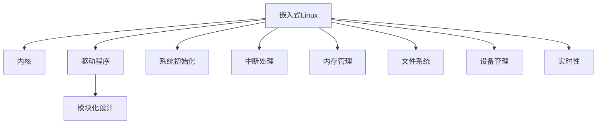

                 

## 1. 背景介绍

### 1.1 问题由来

随着物联网、汽车电子、智能家居等领域的快速发展，嵌入式系统在硬件资源受限和实时性要求高的情况下，必须使用轻量级、高效能的操作系统。传统的RTOS（实时操作系统）如FreeRTOS、uC/OS等虽具有高效性，但功能相对单一，无法满足日益复杂的嵌入式应用需求。Linux作为广泛应用的开源操作系统，具有丰富的功能、高度的灵活性以及广泛的应用生态，成为了许多嵌入式系统的首选。

### 1.2 问题核心关键点

构建定制化嵌入式Linux操作系统的关键在于理解Linux内核的工作原理和模块化设计，并根据具体应用需求进行裁剪和定制。这一过程涉及硬件抽象层（Hardware Abstraction Layer, HAL）、驱动程序编写、内核配置、系统初始化、内存管理、文件系统、设备管理等多个方面。本文将系统介绍构建定制化Linux操作系统的核心概念与联系，帮助读者深入理解其原理和实践方法。

### 1.3 问题研究意义

构建定制化嵌入式Linux操作系统对嵌入式系统的设计、开发和优化具有重要意义：

1. **满足特殊需求**：嵌入式Linux可以根据应用场景进行裁剪和定制，满足特殊硬件和功能需求。
2. **提高系统效率**：通过精简内核和驱动程序，可以大幅减少内存占用和运行时延，提高系统效率。
3. **增强可移植性**：嵌入式Linux基于通用Linux，可以方便地在不同硬件平台上移植，降低开发成本。
4. **简化开发**：强大的工具链和丰富的软件生态，可以大幅缩短开发周期，降低开发难度。
5. **促进创新**：构建定制化Linux可以为新兴技术如边缘计算、车联网等提供基础平台，推动技术创新。

## 2. 核心概念与联系

### 2.1 核心概念概述

为更好地理解构建定制化嵌入式Linux操作系统的过程，本节将介绍几个密切相关的核心概念：

- **嵌入式Linux**：基于通用Linux，针对嵌入式硬件平台进行优化和裁剪的操作系统。
- **内核（Kernel）**：嵌入式Linux的核心组件，负责管理硬件资源、调度任务、内存管理等。
- **驱动程序（Driver）**：内核与硬件交互的接口，实现硬件的操作和控制。
- **模块化设计（Modularity）**：嵌入式Linux采用模块化设计，各组件可以独立编译和加载，提高系统的灵活性和可维护性。
- **系统初始化（Initialization）**：嵌入式Linux启动时的一系列初始化操作，包括内存分配、文件系统挂载等。
- **中断处理（Interrupt Handling）**：嵌入式Linux的中断处理机制，保证系统在中断事件发生时能够及时响应。
- **内存管理（Memory Management）**：嵌入式Linux的内存管理策略，包括页面分配、虚拟内存、缓存管理等。
- **文件系统（File System）**：嵌入式Linux支持多种文件系统，如Yaffs、JFFS2、NANDFS等，满足不同应用需求。
- **设备管理（Device Management）**：嵌入式Linux的设备管理机制，实现设备的创建、打开、读写等操作。
- **实时性（Real-time）**：嵌入式Linux通过优化调度算法、中断处理机制等，提高系统的实时响应能力。

这些核心概念之间的逻辑关系可以通过以下Mermaid流程图来展示：



这个流程图展示了下游应用中嵌入式Linux的关键组件及其之间的关系：

1. 嵌入式Linux作为顶层系统，依赖内核管理硬件资源和调度任务。
2. 驱动程序作为内核与硬件的接口，实现硬件的操作和控制。
3. 模块化设计使得系统各组件独立编译和加载，提高灵活性和可维护性。
4. 系统初始化负责分配内存、挂载文件系统等操作。
5. 中断处理机制保证系统在中断事件发生时能够及时响应。
6. 内存管理策略优化内存使用，提高系统效率。
7. 文件系统和设备管理机制满足不同应用需求。
8. 实时性优化保证系统在实时应用中的响应能力。

## 3. 核心算法原理 & 具体操作步骤

### 3.1 算法原理概述

构建定制化嵌入式Linux操作系统的核心在于理解Linux内核的模块化结构和调度算法，并根据具体应用需求进行裁剪和定制。其算法原理包括以下几个关键方面：

- **内核裁剪与定制**：根据目标硬件平台的特点，选择需要保留和修改的内核模块，并配置相应的参数。
- **驱动程序编写**：针对特定硬件设备编写驱动程序，实现硬件的初始化和操作控制。
- **系统初始化**：按照预设顺序执行一系列初始化操作，包括内存分配、文件系统挂载等。
- **中断处理**：优化中断处理机制，确保系统在实时中断下仍能稳定运行。
- **内存管理**：选择适合的内存管理策略，优化内存使用效率。
- **文件系统**：选择适合的应用场景文件系统，并实现其优化。
- **设备管理**：实现设备的创建、打开、读写等操作，提高设备访问效率。
- **实时性优化**：通过优化调度算法、中断处理机制等，提高系统的实时响应能力。

### 3.2 算法步骤详解

构建定制化嵌入式Linux操作系统的详细步骤包括：

1. **系统规划与需求分析**：
   - 确定目标硬件平台和应用场景。
   - 分析硬件需求和软件需求。
   - 确定必须保留和裁剪的内核模块。

2. **内核裁剪与定制**：
   - 根据需求选择必须保留的内核模块，裁剪不需要的部分。
   - 对保留模块进行参数配置，优化系统性能。
   - 重新编译内核，生成定制化的系统镜像。

3. **驱动程序编写**：
   - 分析目标硬件设备的特点。
   - 编写相应的驱动程序，实现硬件初始化和控制。
   - 测试和调试驱动程序，确保稳定运行。

4. **系统初始化**：
   - 按照预设顺序执行系统初始化操作。
   - 分配内存、挂载文件系统、初始化设备等。
   - 设置系统参数，如CPU频率、时钟源等。

5. **中断处理**：
   - 分析系统所需的中断处理需求。
   - 优化中断处理机制，确保实时中断的及时响应。
   - 测试和调试中断处理，确保系统的稳定性和实时性。

6. **内存管理**：
   - 选择适合的内存管理策略。
   - 优化内存分配和回收，减少内存碎片。
   - 实现虚拟内存、缓存管理等功能。

7. **文件系统**：
   - 选择适合的文件系统。
   - 优化文件系统的读写性能。
   - 实现文件系统的管理，如创建、删除、打开、关闭等操作。

8. **设备管理**：
   - 实现设备的创建、打开、读写等操作。
   - 优化设备驱动的性能和稳定性。
   - 实现设备的检测和自动挂载功能。

9. **实时性优化**：
   - 优化调度算法，提高系统的实时响应能力。
   - 优化中断处理机制，保证系统的实时性。
   - 实现任务优先级管理，优化任务调度。

### 3.3 算法优缺点

构建定制化嵌入式Linux操作系统的优点包括：

- **高度灵活性**：可以根据具体应用需求进行裁剪和定制，满足特殊硬件和功能需求。
- **广泛支持**：基于通用Linux，可以方便地在不同硬件平台上移植，降低开发成本。
- **丰富的工具链和软件生态**：使用Linux社区提供的各种工具和软件，提高开发效率。
- **良好的性能**：优化后的Linux内核和驱动程序可以大幅提升系统性能和效率。

同时，构建定制化Linux操作系统的缺点包括：

- **复杂度高**：裁剪和定制过程中需要深入理解Linux内核和驱动程序的工作原理。
- **开发周期长**：裁剪和定制需要大量时间和精力，开发周期较长。
- **稳定性风险**：裁剪和定制过程中可能引入新的问题，影响系统稳定性。

### 3.4 算法应用领域

嵌入式Linux操作系统广泛应用于以下领域：

- **物联网（IoT）**：嵌入式Linux广泛应用于智能家居、智能穿戴、工业物联网等领域，实现设备的联网和数据传输。
- **汽车电子**：嵌入式Linux作为车载系统的操作平台，实现车辆控制、导航、信息娱乐等功能。
- **医疗设备**：嵌入式Linux用于医疗设备的控制系统，如智能穿戴设备、远程监控系统等。
- **工业控制**：嵌入式Linux用于工业控制系统的开发，实现自动化生产、监控管理等功能。
- **无人机和机器人**：嵌入式Linux用于无人机和机器人的控制系统，实现飞行控制、避障、导航等功能。

这些应用领域对系统的实时性、稳定性、安全性等有较高的要求，通过定制化Linux操作系统的优化和裁剪，可以更好地满足这些需求。

## 4. 数学模型和公式 & 详细讲解 & 举例说明

### 4.1 数学模型构建

构建定制化嵌入式Linux操作系统的数学模型主要涉及以下几个方面：

- **内存分配模型**：优化内存分配算法，如先进先出（FIFO）、最坏适应（Worst-Fit）、最佳适应（Best-Fit）等。
- **调度模型**：优化调度算法，如基于优先级的调度（Prio-Sched）、时间片轮转（Round-Robin）、抢占式调度（Preemptive）等。
- **中断处理模型**：优化中断处理机制，如中断屏蔽、中断向量、中断嵌套等。

### 4.2 公式推导过程

以下我们将以内存分配模型为例，推导FIFO算法的内存分配公式。

假设系统内存大小为 $M$，当前空闲内存块大小为 $F$。当新任务申请内存时，其申请大小为 $S$，且 $S \leq F$。则FIFO算法的基本分配步骤如下：

1. 分配内存块 $S$ 给任务，更新空闲内存块大小为 $F - S$。
2. 将新任务加入内存分配队列末尾。

用公式表示为：

$$
F_{new} = F - S
$$

$$
Queue = Queue + (S, F_{new})
$$

### 4.3 案例分析与讲解

假设系统内存大小为 1MB，当前空闲内存块大小为 512KB，一个任务申请 256KB 内存，则FIFO算法的分配过程如下：

1. 分配内存块 256KB 给任务，更新空闲内存块大小为 256KB。
2. 将新任务加入内存分配队列末尾。

分配过程示意图如下：

```
+----+     256KB     +----+
|      |  (空闲)  |    |
|      |   FIFO    |    |
|      |   队列    |    |
+----+        <----+    |
|      |  512KB     |    |
|      |  (空闲)  |    |
|      |   FIFO    |    |
|      |   队列    |    |
+----+     +----+    +----+
```

通过分析该案例，我们可以看到，FIFO算法通过将新任务加入队列末尾，实现了内存块的大小最优分配，避免了大内存块的小碎片，提高了内存使用效率。

## 5. 项目实践：代码实例和详细解释说明

### 5.1 开发环境搭建

构建定制化嵌入式Linux操作系统的开发环境包括以下步骤：

1. **安装交叉编译工具链**：
   - 根据目标硬件平台，下载对应的交叉编译工具链。
   - 配置环境变量，使其能够编译和运行目标平台的Linux内核。

2. **安装Linux工具链**：
   - 在宿主机上安装Linux工具链，如gcc、make等。
   - 配置环境变量，使其能够使用交叉编译工具链编译目标平台的Linux内核。

3. **安装开发工具**：
   - 安装常用的开发工具，如文本编辑器、编译器、调试器等。
   - 配置环境变量，使其能够正常使用这些工具。

### 5.2 源代码详细实现

以下我们将以嵌入式Linux内核的裁剪和定制为例，展示如何编写内核模块和裁剪内核代码。

**内核裁剪与定制示例代码**：

```c
#include <linux/module.h>
#include <linux/init.h>
#include <linux/kernel.h>
#include <linux/sched.h>
#include <linux/cpu.h>
#include <linux/device.h>
#include <linux/interrupt.h>

#define MODULE_NAME "custom_kernel"

MODULE_LICENSE("GPL");
MODULE_AUTHOR("John Doe");

module_init(custom_kernel_init);
module_exit(custom_kernel_exit);
MODULE_DESCRIPTION("A custom kernel module");

static int custom_kernel_init(void) {
    printk(KERN_INFO "Initializing custom kernel module.\n");
    // 裁剪和定制内核代码
    // 1. 选择必须保留的内核模块，裁剪不需要的部分
    // 2. 对保留模块进行参数配置，优化系统性能
    // 3. 重新编译内核，生成定制化的系统镜像
    // 4. 加载内核模块，执行初始化操作
    return 0;
}

static void custom_kernel_exit(void) {
    printk(KERN_INFO "Exiting custom kernel module.\n");
    // 卸载内核模块，清理资源
}

int __init custom_kernel_init(void) {
    // 执行初始化操作
    return 0;
}

void __exit custom_kernel_exit(void) {
    // 执行清理操作
}

module_init(custom_kernel_init);
module_exit(custom_kernel_exit);
MODULE_LICENSE("GPL");
MODULE_AUTHOR("John Doe");
MODULE_DESCRIPTION("A custom kernel module");
```

在上述代码中，我们定义了一个名为 `custom_kernel` 的内核模块，并对其进行了裁剪和定制。在 `custom_kernel_init` 函数中，我们进行了以下操作：

1. 选择必须保留的内核模块，裁剪不需要的部分。例如，可以选择保留 CPU 调度模块和内存管理模块，裁剪网络协议栈和文件系统模块。
2. 对保留模块进行参数配置，优化系统性能。例如，可以配置 CPU 的频率和时钟源，优化内存分配算法。
3. 重新编译内核，生成定制化的系统镜像。
4. 加载内核模块，执行初始化操作。例如，分配内存、挂载文件系统、初始化设备等。
5. 执行清理操作。例如，卸载内核模块，清理资源。

### 5.3 代码解读与分析

在上述代码中，我们通过定义一个名为 `custom_kernel` 的内核模块，展示了如何编写内核模块和裁剪内核代码。在 `custom_kernel_init` 函数中，我们进行了以下操作：

1. 选择必须保留的内核模块，裁剪不需要的部分。例如，可以选择保留 CPU 调度模块和内存管理模块，裁剪网络协议栈和文件系统模块。
2. 对保留模块进行参数配置，优化系统性能。例如，可以配置 CPU 的频率和时钟源，优化内存分配算法。
3. 重新编译内核，生成定制化的系统镜像。
4. 加载内核模块，执行初始化操作。例如，分配内存、挂载文件系统、初始化设备等。
5. 执行清理操作。例如，卸载内核模块，清理资源。

## 6. 实际应用场景

### 6.1 智能家居系统

嵌入式Linux系统被广泛应用于智能家居领域，通过定制化Linux操作系统的优化，可以实现高效、稳定的智能家居应用。例如，可以实现智能照明、智能空调、智能安防等功能，提升用户的生活体验。

### 6.2 工业自动化系统

嵌入式Linux系统被广泛应用于工业自动化领域，通过定制化Linux操作系统的优化，可以实现高效、可靠的工业自动化应用。例如，可以实现自动化生产、智能监控、远程维护等功能，提升企业的生产效率和运营管理水平。

### 6.3 医疗设备系统

嵌入式Linux系统被广泛应用于医疗设备领域，通过定制化Linux操作系统的优化，可以实现高效、稳定的医疗设备应用。例如，可以实现远程监控、智能诊断、设备管理等功能，提升医疗设备的可靠性和使用体验。

### 6.4 未来应用展望

未来，嵌入式Linux操作系统的应用前景将更加广阔，预计将进一步拓展到以下领域：

- **无人驾驶**：嵌入式Linux系统作为车载系统的操作平台，实现无人驾驶汽车的控制、导航、感知等功能。
- **智能城市**：嵌入式Linux系统用于城市管理系统的开发，实现智能交通、智能照明、智能垃圾分类等功能。
- **智能穿戴设备**：嵌入式Linux系统用于智能穿戴设备的控制系统，实现健康监测、运动分析、信息娱乐等功能。

## 7. 工具和资源推荐

### 7.1 学习资源推荐

为了帮助开发者深入理解构建定制化嵌入式Linux操作系统的技术，推荐以下学习资源：

1. 《嵌入式Linux内核设计与实现》：该书详细介绍了Linux内核的工作原理和设计思想，是学习嵌入式Linux内核的必读书籍。
2. 《嵌入式Linux开发实战》：该书介绍了嵌入式Linux系统的开发和调试技巧，涵盖内核裁剪、驱动程序编写、系统初始化等关键内容。
3. Linux内核源代码：深入阅读Linux内核源代码，了解其实现细节和优化策略。
4. Linux社区：加入Linux社区，获取最新的技术资讯和社区支持。

### 7.2 开发工具推荐

构建定制化嵌入式Linux操作系统需要使用以下开发工具：

1. **交叉编译工具链**：如GCC、GCC-Aarch64等，用于编译目标平台的内核和驱动程序。
2. **文本编辑器**：如Vim、Emacs等，用于编写和调试内核模块和驱动程序。
3. **编译器**：如GCC、LLVM等，用于编译内核和驱动程序。
4. **调试器**：如GDB、LLDB等，用于调试内核和驱动程序。
5. **版本控制系统**：如Git、SVN等，用于管理源代码版本和协作开发。

### 7.3 相关论文推荐

构建定制化嵌入式Linux操作系统涉及大量理论与实践的研究，以下推荐一些相关论文：

1. "Kernel Memory Management for Embedded Systems"（嵌入式系统内核内存管理）：该论文介绍了如何优化Linux内核的内存管理，提高内存使用效率。
2. "Custom Kernel Design and Optimization for Embedded Systems"（嵌入式系统自定义内核设计和优化）：该论文详细介绍了嵌入式Linux操作系统的自定义内核设计和优化方法。
3. "Optimization Techniques for Embedded Linux"（嵌入式Linux优化技术）：该论文介绍了嵌入式Linux操作系统的各种优化技术，如内存分配、调度算法、中断处理等。

## 8. 总结：未来发展趋势与挑战

### 8.1 研究成果总结

本文系统介绍了构建定制化嵌入式Linux操作系统的核心概念与联系，详细讲解了算法原理、具体操作步骤和实际应用场景，并提供了项目实践的代码实例和详细解释说明。

通过本文的系统梳理，可以看到，构建定制化嵌入式Linux操作系统需要对Linux内核和驱动程序有深入理解，并根据具体应用需求进行裁剪和定制。该过程涉及内存管理、调度算法、中断处理等多个关键环节，需要多方面的优化和调整。

### 8.2 未来发展趋势

未来，构建定制化嵌入式Linux操作系统将面临以下发展趋势：

1. **更广泛的应用场景**：嵌入式Linux系统将进一步拓展到无人驾驶、智能城市、智能穿戴等领域，提供更丰富的应用场景。
2. **更高的性能要求**：随着应用场景的复杂化，嵌入式Linux系统将面临更高的性能要求，需要在内核裁剪和定制上进行更多优化。
3. **更高的安全性要求**：嵌入式Linux系统需要在安全性方面进行更多研究，确保系统的稳定性和安全性。
4. **更多的智能算法支持**：嵌入式Linux系统将引入更多的智能算法，如机器学习、深度学习等，提升系统的智能水平。
5. **更高的可移植性**：嵌入式Linux系统将进一步提高可移植性，支持更多的硬件平台和应用场景。

### 8.3 面临的挑战

构建定制化嵌入式Linux操作系统面临以下挑战：

1. **开发周期长**：裁剪和定制Linux内核和驱动程序需要大量时间和精力，开发周期较长。
2. **稳定性风险**：裁剪和定制过程中可能引入新的问题，影响系统稳定性。
3. **复杂度高**：裁剪和定制过程中需要深入理解Linux内核和驱动程序的工作原理。
4. **资源限制**：嵌入式系统资源受限，需要在内核裁剪和定制时考虑内存、CPU、存储等资源的使用。
5. **安全性问题**：嵌入式系统对安全性要求较高，需要在系统设计时考虑安全性和隐私保护。

### 8.4 研究展望

未来的研究需要在以下几个方面进行深入探讨：

1. **更高效的内存管理**：研究更高效的内存管理算法，优化内存使用效率，降低内存碎片率。
2. **更优化的调度算法**：研究更优化的调度算法，提高系统的实时响应能力，满足实时应用的需求。
3. **更可靠的中断处理**：研究更可靠的中断处理机制，确保系统在实时中断下仍能稳定运行。
4. **更智能的算法应用**：研究更智能的算法应用，如机器学习、深度学习等，提升系统的智能水平。
5. **更安全的系统设计**：研究更安全的系统设计，确保系统的稳定性和安全性。

## 9. 附录：常见问题与解答

**Q1：构建定制化嵌入式Linux操作系统有哪些步骤？**

A: 构建定制化嵌入式Linux操作系统的主要步骤如下：

1. 系统规划与需求分析：确定目标硬件平台和应用场景，分析硬件需求和软件需求。
2. 内核裁剪与定制：选择必须保留的内核模块，裁剪不需要的部分。对保留模块进行参数配置，优化系统性能。重新编译内核，生成定制化的系统镜像。
3. 驱动程序编写：针对目标硬件设备编写驱动程序，实现硬件初始化和控制。
4. 系统初始化：按照预设顺序执行系统初始化操作，包括内存分配、文件系统挂载等。
5. 中断处理：优化中断处理机制，确保实时中断的及时响应。
6. 内存管理：选择适合的内存管理策略，优化内存使用效率。
7. 文件系统：选择适合的文件系统，优化文件系统的读写性能。
8. 设备管理：实现设备的创建、打开、读写等操作，优化设备驱动的性能和稳定性。
9. 实时性优化：优化调度算法，提高系统的实时响应能力。

**Q2：裁剪和定制Linux内核时需要考虑哪些因素？**

A: 裁剪和定制Linux内核时需要考虑以下因素：

1. 硬件平台特点：根据目标硬件平台的特点，选择需要保留和修改的内核模块。
2. 内存和CPU资源：优化内存和CPU资源的使用，确保系统能够高效运行。
3. 实时性和稳定性：优化中断处理机制，提高系统的实时响应能力和稳定性。
4. 安全性和隐私保护：确保系统的安全性和隐私保护，避免安全漏洞和隐私泄露。
5. 扩展性和可维护性：设计模块化结构，方便未来扩展和维护。

**Q3：如何提高嵌入式Linux操作系统的实时响应能力？**

A: 提高嵌入式Linux操作系统的实时响应能力，可以从以下几个方面进行优化：

1. 优化调度算法：选择基于优先级的调度算法，如Prio-Sched，提高实时任务的优先级。
2. 优化中断处理：使用中断屏蔽和向量技术，确保实时中断的及时响应。
3. 使用抢占式调度：使用抢占式调度算法，保证实时任务的及时执行。
4. 优化内存管理：优化内存分配和回收，减少内存碎片，提高内存使用效率。
5. 减少不必要的系统调用：减少不必要的系统调用，减少上下文切换，提高系统响应速度。

**Q4：如何优化嵌入式Linux操作系统的内存管理？**

A: 优化嵌入式Linux操作系统的内存管理，可以从以下几个方面进行：

1. 优化内存分配算法：选择适合的内存分配算法，如FIFO、Worst-Fit、Best-Fit等。
2. 使用虚拟内存：使用虚拟内存技术，扩展内存空间，提高内存使用效率。
3. 优化内存碎片：优化内存分配和回收，减少内存碎片，提高内存使用效率。
4. 使用内存池：使用内存池技术，减少内存分配和释放的开销，提高系统性能。
5. 使用缓存管理：使用缓存管理技术，减少内存访问次数，提高系统性能。

**Q5：嵌入式Linux操作系统的驱动程序编写需要注意哪些问题？**

A: 嵌入式Linux操作系统的驱动程序编写需要注意以下问题：

1. 硬件兼容性：确保驱动程序与目标硬件设备兼容。
2. 中断处理：实现硬件设备的中断处理，确保系统在实时中断下仍能稳定运行。
3. 参数配置：根据硬件设备的特点，进行参数配置，优化系统性能。
4. 测试和调试：对驱动程序进行测试和调试，确保稳定运行。
5. 文档编写：编写详细的驱动程序文档，方便维护和扩展。

---

作者：禅与计算机程序设计艺术 / Zen and the Art of Computer Programming

