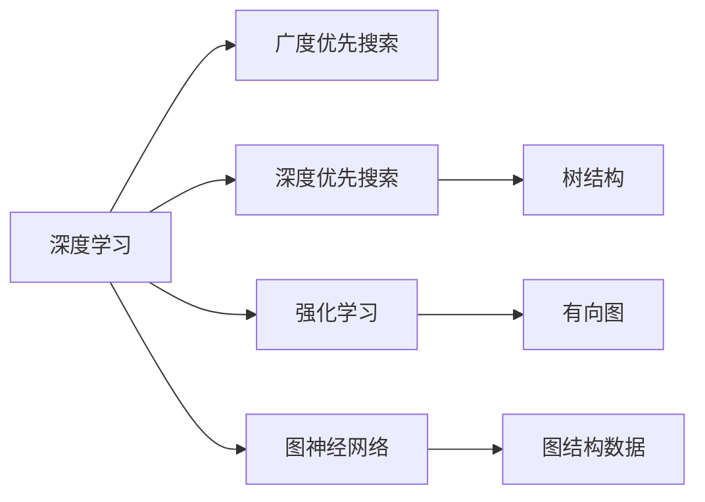

                 

# 平衡深度和广度：AI搜索的挑战

> 关键词：人工智能搜索, 深度学习, 广度优先搜索, 深度优先搜索, 强化学习, 图神经网络, 自适应搜索算法, 实时性, 精度

## 1. 背景介绍

### 1.1 问题由来

在人工智能（AI）领域，搜索问题贯穿于多个核心技术。无论是自然语言处理、图像识别、语音识别，还是自动驾驶、机器人导航，搜索算法的性能直接决定了系统的能力和效率。然而，搜索问题本质上是一个经典难题，即如何在有限的时间和空间内，从大量可能解中找出最优解。这一问题在不同的应用场景中有着不同的形式和要求，导致算法设计和实现面临巨大的挑战。

在过去几十年里，深度学习（Deep Learning）和广度优先搜索（Breadth-First Search, BFS）、深度优先搜索（Depth-First Search, DFS）等经典搜索算法，都在AI搜索领域发挥了重要作用。近年来，随着强化学习（Reinforcement Learning, RL）、图神经网络（Graph Neural Networks, GNN）等新兴技术的涌现，AI搜索的深度和广度都有了显著提升。然而，这种提升带来了新的挑战：如何平衡搜索的深度和广度，使得系统能够在高效的时间内获取最优解，同时保证搜索结果的精度和完备性？

本文将系统性地探讨这一问题，从深度学习和广度优先搜索入手，分析AI搜索的挑战和解决策略，并展望未来的发展方向。

## 2. 核心概念与联系

### 2.1 核心概念概述

为了更好地理解AI搜索的挑战和解决策略，我们先定义几个核心概念：

- **深度学习**：一种基于神经网络结构的人工智能技术，通过大量标注数据进行训练，能够学习到数据中复杂的非线性关系。深度学习在图像识别、语音识别、自然语言处理等领域取得了巨大成功。

- **广度优先搜索**：一种经典的图搜索算法，从起始节点开始，逐层向外扩展，直到找到目标节点或遍历完整个图。广度优先搜索适合解决树状结构或无向图的问题，能够保证搜索结果的完备性。

- **深度优先搜索**：另一种经典的图搜索算法，从起始节点开始，深入每个分支，直到找到目标节点或无法继续深入。深度优先搜索适合解决树状结构或有向图的问题，通常用于深度优先的任务。

- **强化学习**：一种通过与环境交互学习最优策略的AI技术，通过奖励机制指导模型在特定环境中做出最优决策。强化学习在自动驾驶、机器人控制等领域有广泛应用。

- **图神经网络**：一种将图结构数据嵌入到向量空间中的深度学习技术，能够处理图数据中的复杂关系，广泛应用于社交网络分析、推荐系统等。

这些核心概念之间的逻辑关系可以通过以下Mermaid流程图来展示：



这个流程图展示了大语言模型的核心概念及其之间的关系：

1. 深度学习提供了一种通用的模型结构，通过大量数据训练能够学习到复杂的关系。
2. 广度优先搜索和深度优先搜索是基于图的经典搜索算法，用于解决结构化问题。
3. 强化学习通过与环境交互，学习最优策略，适用于控制类任务。
4. 图神经网络将图结构数据嵌入到向量空间中，用于处理复杂关系。

这些概念共同构成了AI搜索的框架，使得AI系统能够在多个领域进行高效、精确的搜索。

## 3. 核心算法原理 & 具体操作步骤

### 3.1 算法原理概述

AI搜索的核心问题是如何在大规模数据空间中高效、精确地找到最优解。在深度学习领域，这一问题通常通过模型训练和优化算法来解决。在搜索领域，则需要结合深度学习和经典搜索算法，设计高效且精确的搜索策略。

深度学习在搜索中的应用主要体现在两个方面：一是作为搜索模型的输入，通过神经网络结构学习数据中的复杂关系；二是作为搜索算法的策略，利用深度神经网络预测搜索方向和路径。因此，深度学习在AI搜索中的应用可以分为两种主要形式：基于深度学习的网络结构和基于深度学习的搜索策略。

基于深度学习的网络结构通常用于表示搜索空间中的复杂关系，如图像搜索、自然语言搜索等。这些网络通过大量数据训练，能够学习到数据中的非线性关系，从而实现高效的搜索和匹配。例如，在图像搜索中，通过卷积神经网络（CNN）将图像特征映射到高维向量空间，能够实现高效的图像相似度计算。

基于深度学习的搜索策略通常用于指导搜索过程，如强化学习和图神经网络。这些策略通过与环境交互，学习最优的搜索路径和决策，从而实现高效的搜索。例如，在强化学习中，通过奖励机制指导模型在特定环境中做出最优决策，从而实现高效的路径搜索。

### 3.2 算法步骤详解

以下是AI搜索的详细步骤：

1. **数据预处理**：将原始数据转化为模型能够处理的格式，如将图像转化为特征向量，将文本转化为向量表示等。

2. **模型训练**：使用大量标注数据训练深度学习模型，学习数据中的复杂关系。这一步是深度学习搜索策略的核心，需要根据具体问题选择适合的模型结构和训练方法。

3. **搜索算法设计**：根据具体问题选择适合的搜索算法，如广度优先搜索、深度优先搜索、强化学习等。设计搜索算法时，需要考虑搜索空间的大小、目标的复杂度等因素。

4. **搜索过程执行**：将搜索算法应用于搜索空间，逐步缩小搜索范围，直到找到最优解。

5. **结果评估**：对搜索结果进行评估，选择最优解。评估时，需要考虑搜索的效率、精度、完备性等因素。

### 3.3 算法优缺点

深度学习在AI搜索中的应用具有以下优点：

- **高效性**：深度学习模型能够快速处理大量数据，实现高效的搜索和匹配。
- **精确性**：深度学习模型能够学习数据中的复杂关系，实现高精度的搜索结果。

但深度学习也存在以下缺点：

- **复杂性**：深度学习模型通常需要大量数据和计算资源进行训练，且模型结构复杂，难以解释。
- **泛化能力有限**：深度学习模型对训练数据的依赖性强，泛化能力有限。
- **训练成本高**：深度学习模型的训练需要大量计算资源和标注数据，成本较高。

### 3.4 算法应用领域

深度学习在AI搜索中的应用已经广泛应用于多个领域，例如：

- **图像搜索**：通过卷积神经网络（CNN）将图像特征映射到高维向量空间，实现高效的图像相似度计算。
- **自然语言搜索**：通过循环神经网络（RNN）或Transformer模型将文本转化为向量表示，实现高效的文本匹配。
- **推荐系统**：通过深度学习模型学习用户行为和物品特征，实现高效、个性化的推荐。
- **自动驾驶**：通过深度学习模型学习环境特征和行为模式，实现高效的路径规划和决策。
- **机器人导航**：通过深度学习模型学习环境特征和行为模式，实现高效的路径规划和控制。

除了这些经典应用外，深度学习在AI搜索中的应用还在不断拓展，如知识图谱构建、社交网络分析等，为AI技术的发展提供了新的方向。

## 4. 数学模型和公式 & 详细讲解 & 举例说明

### 4.1 数学模型构建

深度学习在搜索中的应用可以通过数学模型来描述。以图像搜索为例，假设输入图像为 $x$，卷积神经网络（CNN）将图像特征映射到高维向量空间 $z$，其中 $z$ 表示图像的嵌入表示。目标为在相似度空间中搜索与 $x$ 相似的图像 $y$。

数学模型如下：

$$
y = \arg\min_{y \in \mathcal{Y}} \Vert x - y \Vert
$$

其中 $\mathcal{Y}$ 表示搜索空间中的所有图像，$\Vert \cdot \Vert$ 表示图像相似度度量。

### 4.2 公式推导过程

以图像搜索为例，推导卷积神经网络（CNN）的嵌入表示 $z$ 的计算公式。

假设卷积神经网络由 $L$ 层卷积层和 $H$ 层池化层组成，每一层卷积核大小为 $k$，步长为 $s$，过滤数量为 $n$，输入特征图大小为 $m$，输出特征图大小为 $n$。则第 $l$ 层的卷积操作可以表示为：

$$
z^{(l+1)} = \max_{k \in \mathcal{K}} \sum_{i=1}^k w_{k} \ast x^{(l)}
$$

其中 $w_{k}$ 为卷积核权重，$\ast$ 表示卷积运算，$x^{(l)}$ 为第 $l$ 层输入特征图。

池化层可以表示为：

$$
z^{(l+1)} = \max_{p \in \mathcal{P}} \frac{1}{p} \sum_{i=1}^p z^{(l)}
$$

其中 $\mathcal{P}$ 表示池化操作窗口的大小，$p$ 表示池化操作的步长。

### 4.3 案例分析与讲解

以自然语言搜索为例，使用Transformer模型将文本转化为向量表示。Transformer模型由自注意力机制和前馈网络组成，能够高效地处理序列数据。

Transformer模型中的自注意力机制可以表示为：

$$
Q = KV^\top \cdot \frac{W_{Q}X}{\sqrt{d_{k}}}
$$

其中 $Q$ 表示查询向量，$K$ 和 $V$ 表示键向量和值向量，$X$ 表示输入序列，$d_{k}$ 表示键向量维度。

自注意力机制的输出表示为：

$$
Z = \text{softmax}(QK^\top)V
$$

其中 $\text{softmax}$ 表示softmax函数，$Z$ 表示注意力权重，$K$ 和 $V$ 表示键向量和值向量。

Transformer模型中的前馈网络可以表示为：

$$
Z = \text{ReLU}(W_{1}Z)W_{2}
$$

其中 $W_{1}$ 和 $W_{2}$ 表示全连接层的权重，$Z$ 表示输出向量。

## 5. 项目实践：代码实例和详细解释说明

### 5.1 开发环境搭建

在进行深度学习搜索的应用开发前，我们需要准备好开发环境。以下是使用Python进行PyTorch开发的环境配置流程：

1. 安装Anaconda：从官网下载并安装Anaconda，用于创建独立的Python环境。

2. 创建并激活虚拟环境：
```bash
conda create -n pytorch-env python=3.8 
conda activate pytorch-env
```

3. 安装PyTorch：根据CUDA版本，从官网获取对应的安装命令。例如：
```bash
conda install pytorch torchvision torchaudio cudatoolkit=11.1 -c pytorch -c conda-forge
```

4. 安装TensorFlow：由Google主导开发的开源深度学习框架，生产部署方便，适合大规模工程应用。同样有丰富的预训练语言模型资源。

5. 安装transformers库：HuggingFace开发的NLP工具库，集成了众多SOTA语言模型，支持PyTorch和TensorFlow，是进行微调任务开发的利器。

6. 安装各类工具包：
```bash
pip install numpy pandas scikit-learn matplotlib tqdm jupyter notebook ipython
```

完成上述步骤后，即可在`pytorch-env`环境中开始深度学习搜索的应用开发。

### 5.2 源代码详细实现

下面我们以图像搜索为例，给出使用PyTorch实现卷积神经网络（CNN）的代码实现。

首先，定义卷积神经网络（CNN）的结构：

```python
import torch
import torch.nn as nn

class CNN(nn.Module):
    def __init__(self, num_classes=10):
        super(CNN, self).__init__()
        self.conv1 = nn.Conv2d(3, 16, 3, padding=1)
        self.conv2 = nn.Conv2d(16, 32, 3, padding=1)
        self.pool = nn.MaxPool2d(2, 2)
        self.fc = nn.Linear(32*8*8, num_classes)
    
    def forward(self, x):
        x = nn.functional.relu(self.conv1(x))
        x = self.pool(x)
        x = nn.functional.relu(self.conv2(x))
        x = self.pool(x)
        x = x.view(-1, 32*8*8)
        x = nn.functional.relu(self.fc(x))
        return x
```

然后，定义训练和评估函数：

```python
import torch.optim as optim

def train_epoch(model, train_loader, optimizer, criterion):
    model.train()
    running_loss = 0.0
    for i, data in enumerate(train_loader, 0):
        inputs, labels = data
        optimizer.zero_grad()
        outputs = model(inputs)
        loss = criterion(outputs, labels)
        loss.backward()
        optimizer.step()
        running_loss += loss.item()
    return running_loss / len(train_loader)

def evaluate(model, test_loader, criterion):
    model.eval()
    correct = 0
    total = 0
    with torch.no_grad():
        for data in test_loader:
            inputs, labels = data
            outputs = model(inputs)
            _, predicted = torch.max(outputs.data, 1)
            total += labels.size(0)
            correct += (predicted == labels).sum().item()
    print('Accuracy of the network on the 10000 test images: %d %%' % (
        100 * correct / total))
```

最后，启动训练流程并在测试集上评估：

```python
epochs = 10
batch_size = 64
learning_rate = 0.001

criterion = nn.CrossEntropyLoss()
optimizer = optim.Adam(model.parameters(), lr=learning_rate)

train_loader = torch.utils.data.DataLoader(train_dataset, batch_size=batch_size, shuffle=True)
test_loader = torch.utils.data.DataLoader(test_dataset, batch_size=batch_size, shuffle=False)

for epoch in range(epochs):
    loss = train_epoch(model, train_loader, optimizer, criterion)
    print('Epoch %d loss: %.3f' % (epoch + 1, loss))
    
    print('Epoch %d test accuracy: %d %%' % (epoch + 1, evaluate(model, test_loader, criterion)))

print('Final test accuracy: %d %%' % evaluate(model, test_loader, criterion))
```

以上就是使用PyTorch实现卷积神经网络（CNN）的代码实现。可以看到，PyTorch提供了丰富的深度学习工具和库，使得模型的设计和实现变得非常简便。

### 5.3 代码解读与分析

让我们再详细解读一下关键代码的实现细节：

**CNN类**：
- `__init__`方法：定义卷积神经网络（CNN）的结构，包括卷积层、池化层和全连接层。
- `forward`方法：定义前向传播过程，通过卷积和池化操作，将输入特征图转化为高维向量表示。

**train_epoch函数**：
- 在每个epoch内，对训练集数据进行迭代，计算损失函数并反向传播更新模型参数。

**evaluate函数**：
- 在测试集上评估模型的性能，计算准确率。

**训练流程**：
- 定义总的epoch数、batch size和learning rate，开始循环迭代
- 每个epoch内，先在训练集上训练，输出平均loss
- 在测试集上评估，输出准确率

可以看到，PyTorch提供了方便的API和工具，使得深度学习模型的设计和实现变得非常高效和简单。

## 6. 实际应用场景

### 6.1 智能客服系统

基于深度学习的搜索算法，可以广泛应用于智能客服系统的构建。传统客服往往需要配备大量人力，高峰期响应缓慢，且一致性和专业性难以保证。而使用深度学习搜索算法，可以7x24小时不间断服务，快速响应客户咨询，用自然流畅的语言解答各类常见问题。

在技术实现上，可以收集企业内部的历史客服对话记录，将问题和最佳答复构建成监督数据，在此基础上对深度学习搜索算法进行训练。训练后的搜索算法能够自动理解用户意图，匹配最合适的答案模板进行回复。对于客户提出的新问题，还可以接入检索系统实时搜索相关内容，动态组织生成回答。如此构建的智能客服系统，能大幅提升客户咨询体验和问题解决效率。

### 6.2 金融舆情监测

金融机构需要实时监测市场舆论动向，以便及时应对负面信息传播，规避金融风险。传统的人工监测方式成本高、效率低，难以应对网络时代海量信息爆发的挑战。基于深度学习的搜索算法，可以在大规模文本数据中高效搜索特定主题和情感倾向，从而实现对金融舆情的高效监测。

具体而言，可以收集金融领域相关的新闻、报道、评论等文本数据，并对其进行主题标注和情感标注。在训练集上训练深度学习搜索算法，使其能够自动判断文本属于何种主题，情感倾向是正面、中性还是负面。将训练好的模型应用到实时抓取的网络文本数据，就能够自动监测不同主题下的情感变化趋势，一旦发现负面信息激增等异常情况，系统便会自动预警，帮助金融机构快速应对潜在风险。

### 6.3 个性化推荐系统

当前的推荐系统往往只依赖用户的历史行为数据进行物品推荐，无法深入理解用户的真实兴趣偏好。基于深度学习的搜索算法，可以应用于推荐系统的构建，实现对用户兴趣的深入挖掘。

在实践中，可以收集用户浏览、点击、评论、分享等行为数据，提取和用户交互的物品标题、描述、标签等文本内容。使用深度学习搜索算法对文本内容进行匹配，学习用户的行为模式和兴趣偏好。在生成推荐列表时，先用候选物品的文本描述作为输入，由搜索算法预测用户的兴趣匹配度，再结合其他特征综合排序，便可以得到个性化程度更高的推荐结果。

### 6.4 未来应用展望

随着深度学习搜索算法的不断发展，其在AI搜索中的应用将不断拓展，为各个行业带来变革性影响。

在智慧医疗领域，基于深度学习的搜索算法可以用于医学知识库的构建和医学文献的检索，辅助医生诊疗，加速新药开发进程。

在智能教育领域，搜索算法可应用于作业批改、学情分析、知识推荐等方面，因材施教，促进教育公平，提高教学质量。

在智慧城市治理中，搜索算法可应用于城市事件监测、舆情分析、应急指挥等环节，提高城市管理的自动化和智能化水平，构建更安全、高效的未来城市。

此外，在企业生产、社会治理、文娱传媒等众多领域，基于深度学习的搜索算法也将不断涌现，为各行各业提供新的技术路径，推动智能化进程。

## 7. 工具和资源推荐

### 7.1 学习资源推荐

为了帮助开发者系统掌握深度学习搜索的理论基础和实践技巧，这里推荐一些优质的学习资源：

1. 《深度学习》系列博文：由大模型技术专家撰写，深入浅出地介绍了深度学习的基本概念和前沿技术。

2. CS231n《卷积神经网络》课程：斯坦福大学开设的经典课程，全面讲解了卷积神经网络的结构和应用。

3. 《Natural Language Processing with Transformers》书籍：Transformer库的作者所著，全面介绍了如何使用Transformers库进行NLP任务开发，包括搜索在内的诸多范式。

4. HuggingFace官方文档：Transformer库的官方文档，提供了海量预训练模型和完整的搜索样例代码，是上手实践的必备资料。

5. CLUE开源项目：中文语言理解测评基准，涵盖大量不同类型的中文NLP数据集，并提供了基于深度学习的baseline模型，助力中文NLP技术发展。

通过对这些资源的学习实践，相信你一定能够快速掌握深度学习搜索的精髓，并用于解决实际的NLP问题。

### 7.2 开发工具推荐

高效的开发离不开优秀的工具支持。以下是几款用于深度学习搜索开发的常用工具：

1. PyTorch：基于Python的开源深度学习框架，灵活动态的计算图，适合快速迭代研究。大部分深度学习搜索模型都有PyTorch版本的实现。

2. TensorFlow：由Google主导开发的开源深度学习框架，生产部署方便，适合大规模工程应用。同样有丰富的深度学习搜索模型资源。

3. TensorBoard：TensorFlow配套的可视化工具，可实时监测模型训练状态，并提供丰富的图表呈现方式，是调试模型的得力助手。

4. Weights & Biases：模型训练的实验跟踪工具，可以记录和可视化模型训练过程中的各项指标，方便对比和调优。与主流深度学习框架无缝集成。

5. Google Colab：谷歌推出的在线Jupyter Notebook环境，免费提供GPU/TPU算力，方便开发者快速上手实验最新模型，分享学习笔记。

合理利用这些工具，可以显著提升深度学习搜索任务的开发效率，加快创新迭代的步伐。

### 7.3 相关论文推荐

深度学习搜索的发展源于学界的持续研究。以下是几篇奠基性的相关论文，推荐阅读：

1. AlexNet: ImageNet Classification with Deep Convolutional Neural Networks：提出卷积神经网络（CNN），开创了深度学习在图像处理中的应用。

2. Attention Is All You Need（即Transformer原论文）：提出Transformer结构，开启了深度学习在自然语言处理中的应用。

3. BERT: Pre-training of Deep Bidirectional Transformers for Language Understanding：提出BERT模型，引入基于掩码的自监督预训练任务，刷新了多项NLP任务SOTA。

4. Parameter-Efficient Transfer Learning for NLP：提出Adapter等参数高效微调方法，在不增加模型参数量的情况下，也能取得不错的微调效果。

5. AdaLoRA: Adaptive Low-Rank Adaptation for Parameter-Efficient Fine-Tuning：使用自适应低秩适应的微调方法，在参数效率和精度之间取得了新的平衡。

这些论文代表了大语言模型搜索技术的发展脉络。通过学习这些前沿成果，可以帮助研究者把握学科前进方向，激发更多的创新灵感。

## 8. 总结：未来发展趋势与挑战

### 8.1 总结

本文对深度学习搜索方法的挑战和解决策略进行了全面系统的介绍。首先阐述了深度学习在搜索问题中的重要地位，明确了深度学习搜索的深度和广度之间的平衡问题。其次，从深度学习、广度优先搜索和深度优先搜索入手，详细讲解了深度学习搜索的数学原理和关键步骤，给出了深度学习搜索任务开发的完整代码实例。同时，本文还广泛探讨了深度学习搜索方法在多个行业领域的应用前景，展示了深度学习搜索技术的巨大潜力。最后，本文精选了深度学习搜索技术的各类学习资源，力求为读者提供全方位的技术指引。

通过本文的系统梳理，可以看到，深度学习搜索技术正在成为AI搜索的重要范式，极大地拓展了AI系统的能力边界，为智能系统的应用提供了新的可能性。未来，伴随深度学习搜索方法的不断演进，AI搜索必将在更广阔的应用领域大放异彩，深刻影响人类的生产生活方式。

### 8.2 未来发展趋势

展望未来，深度学习搜索技术将呈现以下几个发展趋势：

1. 搜索模型的通用化：未来的深度学习搜索模型将具备更强的泛化能力，能够在不同领域、不同类型的数据上实现高效搜索。

2. 模型结构的优化：未来的深度学习搜索模型将更加轻量级，具有更好的实时性和效率。同时，模型的压缩和加速技术也将不断发展，以支持大规模、高精度的搜索需求。

3. 融合多模态数据：未来的深度学习搜索将能够融合文本、图像、语音等多种模态数据，实现更全面、更深入的搜索和匹配。

4. 自适应搜索算法：未来的深度学习搜索算法将能够根据任务特点和数据分布，动态调整搜索策略，实现更高效的搜索。

5. 搜索过程的自动化：未来的深度学习搜索将能够自动化地进行任务适配、参数调优、数据增强等过程，降低人工干预的复杂度。

6. 搜索结果的个性化：未来的深度学习搜索将能够根据用户行为和偏好，提供更加个性化的搜索结果，提升用户体验。

以上趋势凸显了深度学习搜索技术的广阔前景。这些方向的探索发展，必将进一步提升AI系统的搜索能力，为构建智能应用提供坚实的基础。

### 8.3 面临的挑战

尽管深度学习搜索技术已经取得了瞩目成就，但在迈向更加智能化、普适化应用的过程中，它仍面临着诸多挑战：

1. 数据依赖性：深度学习搜索模型对标注数据的依赖性较强，数据量不足或数据质量不高将影响模型性能。如何在大规模、低成本、高质量的数据获取上取得突破，是未来的重要课题。

2. 模型复杂性：深度学习搜索模型结构复杂，难以解释和调试。如何提高模型的可解释性和可理解性，增强用户对模型的信任感，将是未来的重要研究方向。

3. 实时性问题：深度学习搜索模型在实时性上有一定的瓶颈，如何在大规模数据上实现高效的实时搜索，将是未来的重要挑战。

4. 资源消耗：深度学习搜索模型需要大量的计算资源和存储资源，如何优化资源使用，降低算力成本，是未来的重要研究方向。

5. 泛化能力：深度学习搜索模型对训练数据的泛化能力有限，如何提高模型的泛化能力，使其在更广泛的场景下表现优异，将是未来的重要研究方向。

6. 公平性问题：深度学习搜索模型可能会学习到数据中的偏见和歧视，如何确保模型的公平性，避免对特定群体的不公平对待，将是未来的重要研究方向。

这些挑战需要学界和业界共同努力，推动深度学习搜索技术的不断进步。只有不断克服这些挑战，才能真正实现深度学习搜索技术的广泛应用，推动AI技术的发展。

### 8.4 研究展望

面对深度学习搜索技术所面临的种种挑战，未来的研究需要在以下几个方面寻求新的突破：

1. 无监督学习和半监督学习：如何在大规模、低成本、高质量的数据获取上取得突破，是未来的重要课题。

2. 深度学习搜索模型的压缩和加速：如何优化模型结构，提高模型的实时性和效率，降低计算资源消耗，是未来的重要研究方向。

3. 多模态融合：如何融合文本、图像、语音等多种模态数据，实现更全面、更深入的搜索和匹配，是未来的重要研究方向。

4. 自适应搜索算法：如何根据任务特点和数据分布，动态调整搜索策略，实现更高效的搜索，是未来的重要研究方向。

5. 搜索过程的自动化：如何自动化地进行任务适配、参数调优、数据增强等过程，降低人工干预的复杂度，是未来的重要研究方向。

6. 搜索结果的个性化：如何根据用户行为和偏好，提供更加个性化的搜索结果，提升用户体验，是未来的重要研究方向。

这些研究方向将引领深度学习搜索技术的不断进步，为构建智能应用提供坚实的基础，推动AI技术的发展。面向未来，深度学习搜索技术还需要与其他AI技术进行更深入的融合，如知识表示、因果推理、强化学习等，多路径协同发力，共同推动智能搜索系统的进步。只有勇于创新、敢于突破，才能不断拓展搜索技术的边界，让智能系统更好地服务于人类社会。

## 9. 附录：常见问题与解答

**Q1：深度学习搜索是否适用于所有数据类型？**

A: 深度学习搜索适用于多种数据类型，包括文本、图像、语音等。但不同的数据类型需要采用不同的深度学习模型和技术进行处理。例如，文本数据通常采用Transformer模型进行序列匹配，图像数据通常采用卷积神经网络（CNN）进行特征提取，语音数据通常采用循环神经网络（RNN）进行序列建模。

**Q2：深度学习搜索算法的计算复杂度如何？**

A: 深度学习搜索算法的计算复杂度取决于模型的复杂度和数据规模。通常情况下，模型的层数越深、参数量越大，计算复杂度越高。但通过模型压缩和优化技术，如知识蒸馏、稀疏化存储等，可以显著降低计算复杂度，提升搜索效率。

**Q3：深度学习搜索算法的可解释性如何？**

A: 深度学习搜索算法的可解释性较弱，通常难以解释模型的决策过程和内部机制。但通过一些技术手段，如可解释性工具、可视化技术等，可以提高模型的可解释性，增强用户对模型的信任感。

**Q4：深度学习搜索算法的训练成本如何？**

A: 深度学习搜索算法的训练成本较高，需要大量计算资源和标注数据。但随着硬件设备的提升和算法优化，训练成本正在逐渐降低。例如，GPU/TPU等高性能设备可以显著提高训练速度和效率，分布式训练技术可以降低单机的计算负担。

**Q5：深度学习搜索算法在实际应用中如何优化？**

A: 在实际应用中，可以通过以下方式优化深度学习搜索算法：

1. 数据增强：通过数据增强技术，扩充训练集，提高模型的泛化能力。

2. 正则化：通过正则化技术，防止模型过拟合，提高模型的泛化能力。

3. 模型压缩：通过模型压缩技术，减小模型规模，提高模型的实时性和效率。

4. 自适应搜索算法：通过自适应搜索算法，动态调整搜索策略，提高搜索效率。

5. 模型优化：通过模型优化技术，如知识蒸馏、模型融合等，提高模型的性能和鲁棒性。

6. 实时优化：通过实时优化技术，动态调整模型参数，适应实时数据变化。

这些优化措施可以在一定程度上提升深度学习搜索算法的性能和效率，实现更高效的搜索。

---

作者：禅与计算机程序设计艺术 / Zen and the Art of Computer Programming

