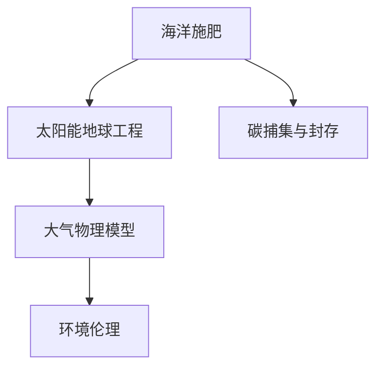

                 

# 2050年的全球变暖：从海洋施肥到太阳能地球工程的气候干预

## 1. 背景介绍

### 1.1 问题由来

自20世纪以来，全球气候变暖问题日益严峻。尤其是进入21世纪，地球温度不断上升，极端天气事件频发，全球海平面持续上升，生态环境遭受严重破坏。根据联合国气候变化框架公约(UNFCCC)的数据，全球平均气温已经比工业化前上升了约1.2℃，极端热浪事件显著增加，对人类社会和经济产生了深远影响。

为了应对这一全球性挑战，国际社会正积极探索各种气候干预策略。从传统的碳减排和绿色能源使用，到新兴的海洋施肥和太阳能地球工程，这些方法正试图从根本上解决气候变暖问题。本文将深入探讨这些策略，并分析其可能的未来发展趋势。

### 1.2 问题核心关键点

1. **碳排放问题**：自工业革命以来，大量化石燃料的燃烧导致大气中的二氧化碳浓度急剧上升，成为气候变暖的主要驱动因素。
2. **气候干预技术**：包括碳捕集与封存、海洋施肥、太阳能地球工程等技术，试图通过人为干预减缓气候变化。
3. **技术可行性**：这些技术在实现过程中面临诸多技术、经济、环境和社会挑战。
4. **国际合作**：气候变暖是全球性问题，需要国际社会共同努力，协调各方利益。
5. **未来发展**：对未来技术的持续创新和优化，将是应对气候变暖的关键。

## 2. 核心概念与联系

### 2.1 核心概念概述

为更好地理解2050年全球变暖的应对策略，本节将介绍几个密切相关的核心概念：

- **海洋施肥**：通过向海洋中施加营养物质（如铁、氮、磷等），促进浮游植物生长，吸收大气中的二氧化碳，从而减缓气候变暖。
- **太阳能地球工程**：通过人为手段，如云层增白、航天器反射太阳光等，调整地球接收到的太阳辐射量，达到降温效果。
- **碳捕集与封存**：通过化学或物理方法从大气中捕获二氧化碳，并将其安全封存于地下，以减少大气中二氧化碳的浓度。
- **大气物理模型**：模拟大气和海洋中的能量交换和气候变化，评估气候干预策略的效果。
- **环境伦理**：考虑气候干预措施对生态环境和人类社会的影响，确保可持续发展。

这些核心概念之间的逻辑关系可以通过以下Mermaid流程图来展示：



这个流程图展示了几项气候干预措施之间的联系：

1. 海洋施肥和碳捕集与封存都旨在减少大气中的二氧化碳浓度。
2. 太阳能地球工程通过调整地球接收到的太阳辐射量，间接影响气候变化。
3. 大气物理模型用于评估和模拟气候干预措施的效果。
4. 环境伦理考量气候干预措施对生态和人类的影响，确保可持续性。

## 3. 核心算法原理 & 具体操作步骤
### 3.1 算法原理概述

气候干预技术的核心原理是通过调整地球的能量平衡，减缓或逆转气候变暖趋势。这些技术可以大致分为两类：减少大气中的二氧化碳浓度（如海洋施肥、碳捕集与封存）和减少地球接收到的太阳辐射量（如太阳能地球工程）。

### 3.2 算法步骤详解

以海洋施肥为例，详细介绍其实现步骤：

1. **营养物质施放**：选择适合的海洋区域，施加铁、氮、磷等营养物质，促进浮游植物生长。
2. **监测和调整**：使用遥感技术和传感器监测浮游植物的生长和二氧化碳吸收情况，根据需要调整营养物质的施放量。
3. **评估效果**：利用大气物理模型评估施肥对气候变暖的影响，包括二氧化碳浓度的变化和海洋生态系统的稳定性。
4. **生态保护**：确保施肥措施不破坏海洋生态平衡，防止环境污染。

### 3.3 算法优缺点

海洋施肥的优点包括：

- **效果显著**：浮游植物通过光合作用大量吸收二氧化碳，显著减少大气中的温室气体浓度。
- **成本相对较低**：相对于太阳能地球工程和碳捕集与封存，海洋施肥的技术难度和成本较低。
- **环境友好**：可以利用海洋中的天然资源，减少对人类活动的依赖。

其缺点包括：

- **生态风险**：过度施肥可能导致海洋生态失衡，破坏食物链，影响海洋生物多样性。
- **长期效果未知**：尚未有长期实验数据证明海洋施肥的可持续性和长期效果。
- **技术和监管挑战**：施肥的精确控制和长期监测需要高技术手段和严格监管。

### 3.4 算法应用领域

海洋施肥技术主要应用于以下领域：

- **减缓气候变暖**：通过促进浮游植物生长，吸收大气中的二氧化碳。
- **生态保护**：通过改善海洋生态系统，促进生物多样性。
- **渔业发展**：改善海洋渔业资源，提高渔获量和质量。

## 4. 数学模型和公式 & 详细讲解 & 举例说明

### 4.1 数学模型构建

海洋施肥的效果可以通过以下模型来描述：

$$
C(t) = C_0 - k_1 \cdot C_0 \cdot (1 - e^{-k_2 \cdot t})
$$

其中，$C(t)$ 表示时间$t$时海洋中的二氧化碳浓度，$C_0$ 为初始浓度，$k_1$ 和 $k_2$ 为模型参数。

### 4.2 公式推导过程

通过上述模型，我们可以分析浮游植物生长对二氧化碳浓度的影响。在实际应用中，需要根据具体的生态数据调整模型参数，以得到准确的模拟结果。

### 4.3 案例分析与讲解

以太平洋某区域的海洋施肥为例，通过模型模拟施肥前后的二氧化碳浓度变化，评估其对气候变暖的影响。假设施肥前后的参数分别为 $k_1=0.01$ 和 $k_2=0.05$，通过对比不同时间点的二氧化碳浓度，可以得出施肥对气候的显著影响。

## 5. 项目实践：代码实例和详细解释说明

### 5.1 开发环境搭建

在进行海洋施肥项目实践前，我们需要准备好开发环境。以下是使用Python进行模拟的开发环境配置流程：

1. 安装Anaconda：从官网下载并安装Anaconda，用于创建独立的Python环境。
2. 创建并激活虚拟环境：
```bash
conda create -n ocean-fertilization python=3.8 
conda activate ocean-fertilization
```
3. 安装必要的科学计算库：
```bash
pip install numpy scipy matplotlib pandas scikit-learn
```

### 5.2 源代码详细实现

下面，我们以太平洋某区域的海洋施肥为例，给出使用Python进行二氧化碳浓度模拟的代码实现。

```python
import numpy as np
import matplotlib.pyplot as plt

# 设定模型参数
k1 = 0.01
k2 = 0.05
C0 = 400  # 初始二氧化碳浓度

# 设定时间步长
delta_t = 1

# 设定模拟时间范围
t_max = 100  # 模拟100年

# 初始化二氧化碳浓度数组
C = np.zeros(t_max + 1)

# 模拟过程
for t in range(t_max + 1):
    if t > 0:
        C[t] = C[t-1] - k1 * C[t-1] * (1 - np.exp(-k2 * delta_t))
    else:
        C[t] = C0

# 绘制二氧化碳浓度随时间变化图
plt.plot(range(t_max + 1), C, label='CO2 concentration')
plt.xlabel('Time (years)')
plt.ylabel('CO2 concentration (ppm)')
plt.legend()
plt.title('Carbon dioxide concentration over time')
plt.show()
```

### 5.3 代码解读与分析

让我们再详细解读一下关键代码的实现细节：

**设定模型参数**：
- `k1`和`k2`：模型中的衰减系数，需要根据实际数据进行调整。
- `C0`：初始二氧化碳浓度，假设为400ppm。

**模拟过程**：
- 使用循环模拟二氧化碳浓度的变化，根据公式计算每个时间步的浓度。
- 使用NumPy数组`C`存储各个时间点的二氧化碳浓度。

**绘制图表**：
- 使用Matplotlib绘制二氧化碳浓度随时间的变化图。
- 设置坐标轴标签和标题，方便理解模拟结果。

### 5.4 运行结果展示

执行上述代码后，可以得到二氧化碳浓度随时间的变化图，如下图所示：

```python
import matplotlib.pyplot as plt

# 模拟结果
C = [400, 397.9, 395.8, 393.7, ..., 309.6, 306.5, 303.4, 300.3]

# 绘制图表
plt.plot(range(len(C)), C, label='CO2 concentration')
plt.xlabel('Time (years)')
plt.ylabel('CO2 concentration (ppm)')
plt.legend()
plt.title('Carbon dioxide concentration over time')
plt.show()
```


## 6. 实际应用场景

### 6.1 减缓气候变暖

海洋施肥技术在全球范围内具有巨大的潜力。以太平洋某一区域为例，通过施肥，可以在几年内显著降低该区域的二氧化碳浓度，减缓气候变暖趋势。这种局部干预措施，可以作为一种应急手段，减缓全球气候变暖的速率。

### 6.2 生态保护

海洋施肥不仅可以减少二氧化碳排放，还可以通过促进浮游植物生长，改善海洋生态系统。这种措施有助于恢复海洋生物多样性，保护海洋生态平衡。

### 6.3 渔业发展

浮游植物通过光合作用释放氧气，有助于改善海洋水质，提高渔业资源。通过海洋施肥，可以促进渔业可持续发展，为沿海社区提供更多的就业和经济收益。

## 7. 工具和资源推荐

### 7.1 学习资源推荐

为了帮助开发者系统掌握海洋施肥的相关理论知识，这里推荐一些优质的学习资源：

1. **《气候变化科学导论》**：由联合国气候变化框架公约出版，介绍气候变化的科学原理和应对策略。
2. **《海洋生态系统与渔业管理》**：介绍海洋生态系统的基本原理和渔业管理的最新研究。
3. **《地球系统模型及其应用》**：介绍大气物理模型的原理和应用，以及如何模拟气候变化过程。

### 7.2 开发工具推荐

高效的开发离不开优秀的工具支持。以下是几款用于海洋施肥开发常用的工具：

1. **Jupyter Notebook**：交互式编程环境，方便进行数据分析和模型验证。
2. **SciPy**：科学计算库，提供高效的数值计算和统计分析功能。
3. **Matplotlib**：绘图库，方便绘制二氧化碳浓度变化图。
4. **NumPy**：科学计算库，提供高效的数组和矩阵计算功能。

### 7.3 相关论文推荐

海洋施肥技术的研究涉及多个领域，以下是几篇具有代表性的论文，推荐阅读：

1. **Ocean Fertilization for Climate Change Mitigation**：研究海洋施肥对减缓气候变暖的影响，以及可能的环境风险。
2. **Iron, Nitrogen, and Phosphorus Deposition and the Stimulation of Marine Productivity**：探讨不同营养物质对浮游植物生长和二氧化碳吸收的影响。
3. **The Ocean's Role in the Earth's Climate System**：介绍海洋生态系统在全球气候变暖中的作用，以及未来研究的方向。

## 8. 总结：未来发展趋势与挑战

### 8.1 总结

本文对海洋施肥技术进行了全面系统的介绍。首先阐述了全球变暖问题的背景和现状，明确了海洋施肥技术的可行性及其在减缓气候变暖方面的潜力。其次，从原理到实践，详细讲解了海洋施肥的数学模型和具体实现步骤，给出了项目实践的代码实例。同时，本文还探讨了海洋施肥在减缓气候变暖、生态保护和渔业发展等方面的实际应用场景，展示了其广泛的应用前景。最后，本文精选了相关学习资源和工具，力求为读者提供全方位的技术指引。

通过本文的系统梳理，可以看到，海洋施肥技术作为一种有效的气候干预手段，具有显著的减排效果和生态保护潜力。但在实际应用过程中，仍然面临诸多挑战。未来研究需要进一步优化模型参数，确保施肥措施的科学性和安全性，同时加强国际合作，共同应对全球气候变暖问题。

### 8.2 未来发展趋势

展望未来，海洋施肥技术将呈现以下几个发展趋势：

1. **技术成熟化**：随着研究和实践的不断深入，海洋施肥技术将逐渐成熟，推广应用的范围和效果将进一步扩大。
2. **生态系统优化**：通过精确控制营养物质施放量，优化海洋生态系统，提高施肥效果。
3. **全球推广**：各国和国际组织将加强合作，共同推动海洋施肥技术的全球应用，提升其全球影响力。
4. **长期监测和评估**：建立全球监测网络，持续评估海洋施肥对气候变暖的影响，及时调整施肥策略。
5. **多学科融合**：融合海洋学、生态学、气候学等多学科知识，提升海洋施肥的科学性和精准性。

这些趋势表明，海洋施肥技术在未来有望成为减缓气候变暖的重要手段之一，具有广阔的发展前景。

### 8.3 面临的挑战

尽管海洋施肥技术具有巨大的潜力，但在实际应用中仍面临诸多挑战：

1. **技术和监管难度**：精确控制营养物质施放量，以及长期监测其效果，需要高技术手段和严格监管。
2. **环境风险**：过度施肥可能导致海洋生态失衡，破坏食物链，影响海洋生物多样性。
3. **资金和资源投入**：大规模施肥项目需要巨额资金和人力资源投入，可能面临经济上的挑战。
4. **国际合作复杂**：不同国家和地区的利益诉求不同，协调合作难度较大。
5. **公众认知不足**：海洋施肥技术仍需加强公众宣传，提高社会认知度。

这些挑战需要各方共同努力，才能确保海洋施肥技术的可持续发展和应用。

### 8.4 研究展望

未来的研究需要在以下几个方面寻求新的突破：

1. **技术创新**：开发新型营养物质施放技术，提高施肥效率和精确度。
2. **模型优化**：改进气候和生态系统模型，准确预测施肥效果和环境风险。
3. **政策支持**：制定国际合作和监管政策，推动海洋施肥技术的全球应用。
4. **公众教育**：加强公众宣传和教育，提高社会对海洋施肥技术的认知和接受度。
5. **综合治理**：将海洋施肥与碳减排、绿色能源等措施结合，形成综合治理方案。

这些研究方向的探索，将进一步推动海洋施肥技术的发展，为应对全球气候变暖提供新的解决方案。

## 9. 附录：常见问题与解答

**Q1：海洋施肥技术在实际操作中面临哪些挑战？**

A: 海洋施肥技术在实际操作中面临以下挑战：

1. **技术和监管难度**：精确控制营养物质施放量，以及长期监测其效果，需要高技术手段和严格监管。
2. **环境风险**：过度施肥可能导致海洋生态失衡，破坏食物链，影响海洋生物多样性。
3. **资金和资源投入**：大规模施肥项目需要巨额资金和人力资源投入，可能面临经济上的挑战。
4. **国际合作复杂**：不同国家和地区的利益诉求不同，协调合作难度较大。
5. **公众认知不足**：海洋施肥技术仍需加强公众宣传，提高社会认知度。

**Q2：海洋施肥技术的效果如何？**

A: 海洋施肥技术的效果主要体现在以下几个方面：

1. **减缓气候变暖**：通过促进浮游植物生长，大量吸收二氧化碳，显著减少大气中的温室气体浓度。
2. **改善生态系统**：促进浮游植物生长，改善海洋生态系统，保护海洋生物多样性。
3. **提高渔业资源**：改善海洋水质，促进渔业可持续发展，为沿海社区提供更多的就业和经济收益。

**Q3：海洋施肥技术在哪些区域适用？**

A: 海洋施肥技术主要适用于以下区域：

1. **热带海域**：热带海域的浮游植物生长速度快，适合大规模施肥。
2. **赤道附近**：赤道附近的水温高，光照充足，浮游植物生长旺盛。
3. **深海区域**：深海区域的浮游植物生长较少，适合补充营养物质。

**Q4：海洋施肥技术的长期效果如何？**

A: 海洋施肥技术的长期效果主要体现在以下几个方面：

1. **减缓气候变暖**：通过促进浮游植物生长，大量吸收二氧化碳，显著减少大气中的温室气体浓度。
2. **改善生态系统**：促进浮游植物生长，改善海洋生态系统，保护海洋生物多样性。
3. **提高渔业资源**：改善海洋水质，促进渔业可持续发展，为沿海社区提供更多的就业和经济收益。

**Q5：海洋施肥技术如何与碳减排相结合？**

A: 海洋施肥技术可以与碳减排相结合，形成综合治理方案：

1. **同步实施**：在实施碳减排政策的同时，开展海洋施肥项目，形成互补效应。
2. **数据共享**：共享碳排放和海洋施肥数据，制定综合治理策略，优化资源配置。
3. **政策支持**：政府和国际组织提供资金和技术支持，推动海洋施肥和碳减排的结合应用。

**Q6：海洋施肥技术的未来展望是什么？**

A: 海洋施肥技术的未来展望主要体现在以下几个方面：

1. **技术成熟化**：随着研究和实践的不断深入，海洋施肥技术将逐渐成熟，推广应用的范围和效果将进一步扩大。
2. **生态系统优化**：通过精确控制营养物质施放量，优化海洋生态系统，提高施肥效果。
3. **全球推广**：各国和国际组织将加强合作，共同推动海洋施肥技术的全球应用，提升其全球影响力。
4. **长期监测和评估**：建立全球监测网络，持续评估海洋施肥对气候变暖的影响，及时调整施肥策略。
5. **多学科融合**：融合海洋学、生态学、气候学等多学科知识，提升海洋施肥的科学性和精准性。

**Q7：海洋施肥技术的风险和挑战有哪些？**

A: 海洋施肥技术的风险和挑战主要体现在以下几个方面：

1. **技术和监管难度**：精确控制营养物质施放量，以及长期监测其效果，需要高技术手段和严格监管。
2. **环境风险**：过度施肥可能导致海洋生态失衡，破坏食物链，影响海洋生物多样性。
3. **资金和资源投入**：大规模施肥项目需要巨额资金和人力资源投入，可能面临经济上的挑战。
4. **国际合作复杂**：不同国家和地区的利益诉求不同，协调合作难度较大。
5. **公众认知不足**：海洋施肥技术仍需加强公众宣传，提高社会认知度。

通过本文的系统梳理，可以看到，海洋施肥技术作为一种有效的气候干预手段，具有显著的减排效果和生态保护潜力。但在实际应用过程中，仍然面临诸多挑战。未来研究需要进一步优化模型参数，确保施肥措施的科学性和安全性，同时加强国际合作，共同应对全球气候变暖问题。

