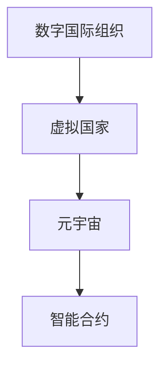

                 

# 2050年的全球治理：从数字国际组织到虚拟国家的全球政治格局重塑

## 1. 背景介绍

### 1.1 问题由来
进入21世纪以来，全球化的进程迅猛发展，国与国之间的联系日益紧密。然而，伴随全球化而来的是一系列新的挑战，如气候变化、资源争夺、网络安全等。这些问题不仅跨越国界，还涉及到政治、经济、社会等多个层面。在此背景下，传统的国家主权和政府治理模式已难以应对全球性挑战，亟需新的治理框架和机制。

### 1.2 问题核心关键点
构建全球治理框架的核心关键点包括：
- **数字国际组织的出现**：随着数字技术的普及和应用，全球治理逐步向数字化、智能化方向发展，数字国际组织应运而生。
- **虚拟国家的兴起**：在数字化的基础上，虚拟国家成为一种新兴的治理模式，它超越传统主权国家的边界，更适应全球化带来的挑战。
- **治理机制的重塑**：全球治理需要超越国家主权，探索更加灵活、高效的治理机制，实现多边合作与共同治理。
- **技术伦理与规范**：数字化和虚拟化治理带来一系列技术伦理和规范问题，需要在全球范围内制定统一的标准和法律。

这些核心关键点共同构成了全球治理的全新视角，旨在通过数字化和虚拟化的手段，实现更加高效、公平、透明的全球治理体系。

## 2. 核心概念与联系

### 2.1 核心概念概述

为更好地理解数字国际组织和虚拟国家的治理范式，本节将介绍几个密切相关的核心概念：

- **数字国际组织**：指通过互联网平台和技术手段，跨越国界进行协作和治理的新型国际组织。例如联合国数字合作办公室、全球数据倡议等。
- **虚拟国家**：指基于虚拟现实(VR)、增强现实(AR)等技术，构建的数字化的、可交互的、具有一定自治权和法律地位的虚拟实体。
- **元宇宙**：一个由数字技术构建的虚拟空间，其中用户可以沉浸式地进行工作、生活、娱乐等活动，其治理结构更加扁平化、去中心化。
- **数字主权**：指在数字化治理中，国家或地区对其数字资源、数字行为、数字事务的自主权和控制权。
- **智能合约**：基于区块链技术的、可自动执行的合约，用于数字化环境中的法律约束和治理机制。

这些核心概念之间的逻辑关系可以通过以下Mermaid流程图来展示：



这个流程图展示了大语言模型的核心概念及其之间的关系：

1. 数字国际组织通过互联网平台和技术手段，构建虚拟国家。
2. 虚拟国家在元宇宙等虚拟环境中实现自治和治理。
3. 元宇宙中的治理依赖于智能合约等技术手段，确保规则的透明和执行的自动性。

## 3. 核心算法原理 & 具体操作步骤

### 3.1 算法原理概述

构建数字国际组织和虚拟国家的治理框架，本质上是一个多层次、多维度的协同治理过程。其核心思想是：

- **数据共享与合作**：通过共享海量数据，打破信息孤岛，实现全球协作。
- **数字身份认证**：利用区块链等技术，确保参与者的身份真实性和行为可追溯性。
- **智能合约与自治**：通过智能合约实现规则自动执行和动态调整，提高治理效率。
- **去中心化治理**：基于区块链等分布式技术，构建去中心化的治理结构，避免单点故障。
- **跨文化与跨语言**：在虚拟国家中，通过AI技术和自然语言处理，打破语言和文化障碍，实现多边沟通。

### 3.2 算法步骤详解

构建数字国际组织和虚拟国家的治理框架，一般包括以下几个关键步骤：

**Step 1: 数据共享与合作机制设计**
- 选择合适的区块链平台，搭建数据共享和交换的公共基础设施。
- 设计标准化的数据格式和接口，促进不同组织间的无缝对接。
- 制定数据使用和共享的规范和协议，保护数据隐私和安全。

**Step 2: 数字身份认证系统建设**
- 开发数字身份认证系统，通过公钥基础设施(PKI)或区块链技术，实现身份验证和加密通信。
- 引入多因素认证(MFA)和生物特征识别技术，增强身份认证的安全性。
- 建立身份认证的审计和监控机制，确保认证过程的透明和可追溯性。

**Step 3: 智能合约与自治规则制定**
- 根据治理需求，设计和编写智能合约代码，实现规则自动执行和动态调整。
- 引入治理代币机制，赋予参与者投票权和决策权，实现自治和共治。
- 设计激励机制，奖励参与者遵守规则和贡献治理，提高参与者的积极性。

**Step 4: 去中心化治理结构的构建**
- 基于区块链等分布式技术，构建去中心化的治理结构，减少单点故障。
- 引入共识算法，如PoW、PoS等，确保决策过程的公平和透明。
- 设计参与者之间的交互界面和协议，实现高效的多边协作。

**Step 5: 跨文化与跨语言支持**
- 利用自然语言处理技术，实现多语言的自动翻译和理解。
- 引入文化敏感性训练，确保治理过程中尊重多元文化差异。
- 提供跨文化沟通平台，促进不同文化背景下的有效交流。

以上是构建数字国际组织和虚拟国家治理框架的一般流程。在实际应用中，还需要针对具体任务的特点，对治理过程的各个环节进行优化设计，如改进数据共享机制，引入更灵活的身份认证技术，优化智能合约的设计等，以进一步提升治理效率和公平性。

### 3.3 算法优缺点

构建数字国际组织和虚拟国家的治理框架，具有以下优点：
1. **高效协作**：通过数据共享和合作，打破信息孤岛，实现高效的多边协作。
2. **透明可追溯**：利用区块链等技术，确保治理过程的透明和可追溯性，增强信任度。
3. **灵活自治**：通过智能合约和去中心化治理，实现自治和共治，提高治理效率。
4. **跨文化支持**：利用AI和自然语言处理技术，打破语言和文化障碍，实现多边沟通。

同时，该框架也存在一定的局限性：
1. **技术依赖**：高度依赖于区块链、AI等新兴技术，技术门槛较高。
2. **法律规范缺失**：虚拟国家的法律地位和治理规范尚未得到广泛认可，法律风险较高。
3. **数据隐私问题**：数据共享过程中涉及大量敏感信息，隐私保护和安全风险较大。
4. **技术标准不统一**：各组织间的技术标准不统一，导致数据互通和协同治理的难度较大。

尽管存在这些局限性，但就目前而言，数字国际组织和虚拟国家治理框架仍是大势所趋，具有广阔的应用前景。未来相关研究的重点在于如何进一步降低技术门槛，推动法律规范的统一，加强隐私保护和安全保障，以及构建更加灵活、高效的多边治理机制。

### 3.4 算法应用领域

构建数字国际组织和虚拟国家的治理框架，已经在多个领域得到了初步应用，例如：

- **气候变化治理**：通过共享气候监测数据，实现全球协同应对气候变化。例如，国际气候治理平台IPCC等。
- **网络安全防御**：利用区块链和智能合约，实现全球网络安全的共同治理。例如，国际网络安全联盟等。
- **公共卫生应急**：在疫情期间，利用数字国际组织和虚拟国家，实现全球医疗数据的共享和应急响应。例如，全球卫生联盟等。
- **金融稳定与监管**：通过智能合约和分布式账本技术，实现跨境金融交易的实时监管和风险控制。例如，国际金融监管联盟等。
- **文化交流与合作**：利用虚拟国家平台，促进不同文化背景下的交流和合作。例如，全球文化交流平台等。

除了上述这些经典领域外，数字国际组织和虚拟国家治理框架也将被创新性地应用到更多场景中，如农业、教育、能源等，为全球治理带来新的突破。随着技术的发展和应用的深入，相信数字国际组织和虚拟国家将逐步成为全球治理的重要组成部分，助力构建更加和谐、公平、高效的国际社会。

## 4. 数学模型和公式 & 详细讲解 & 举例说明

### 4.1 数学模型构建

构建数字国际组织和虚拟国家的治理框架，涉及多个数学模型和算法。这里重点介绍其中的几个关键模型：

- **区块链共识算法**：如PoW、PoS等，用于保证治理决策的公平和透明。
- **智能合约代码设计**：通过编写智能合约代码，实现规则自动执行和动态调整。
- **自然语言处理模型**：用于实现跨语言沟通和自动翻译。

### 4.2 公式推导过程

以下我们以智能合约的自动执行为例，推导智能合约的逻辑和计算公式。

假设智能合约的执行规则为：
- 当A用户提交交易申请时，需要B用户批准。
- 如果B用户批准，则交易自动执行；否则，交易失败。

用伪代码表示该规则，如下所示：

```python
def execute_contract(approval):
    if approval == 'yes':
        return "Transaction executed successfully."
    else:
        return "Transaction failed."

# 假设B用户批准
result = execute_contract('yes')
print(result) # 输出: Transaction executed successfully.
```

将伪代码转化为数学公式，如下：

- 令 $x$ 表示A用户提交的交易申请。
- 令 $y$ 表示B用户的批准。
- 令 $z$ 表示交易的执行结果。

根据逻辑规则，可以得到：

$$
z = \begin{cases}
1, & \text{if } x \land y \\
0, & \text{otherwise}
\end{cases}
$$

使用逻辑门电路模型，可以将其表示为：

$$
z = (x \land y) \land 1
$$

这个公式展示了智能合约的基本逻辑和执行规则，通过编写具体的代码和数学公式，可以实现更加复杂的治理机制和决策逻辑。

### 4.3 案例分析与讲解

**案例分析：虚拟国家中的多边决策机制**

假设在虚拟国家中，有三个成员国：A国、B国和C国。根据治理需求，需要设计一个多边决策机制，用于决定是否启动一项公共项目。

- **数据共享与合作**：建立数据共享平台，三个成员国共享项目评估数据，如经济成本、环境影响等。
- **数字身份认证**：每个成员国使用区块链技术，对参与决策的用户进行身份认证。
- **智能合约设计**：编写智能合约代码，实现多边决策的自动执行。
- **去中心化治理**：利用区块链技术，构建去中心化的决策机制，确保决策过程的公平和透明。
- **跨文化支持**：利用AI和自然语言处理技术，实现多语言的自动翻译和理解。

具体决策机制如下：
- 三个成员国在平台上提交项目评估数据。
- 智能合约自动提取数据，计算项目风险和收益。
- 智能合约生成投票界面，成员国投票决定是否启动项目。
- 投票结果通过智能合约自动执行，启动或取消项目。

案例分析：

- **数据共享与合作**：数据共享平台保证了信息的透明度和可靠性，为多边协作提供了基础。
- **数字身份认证**：身份认证确保了决策者的真实性和行为的可追溯性，提高了决策的可信度。
- **智能合约设计**：智能合约实现了规则的自动执行和动态调整，提高了决策效率和公平性。
- **去中心化治理**：去中心化的治理结构减少了单点故障，增强了决策的稳定性和可靠性。
- **跨文化支持**：跨语言沟通平台促进了不同文化背景下的有效交流，增强了决策的包容性和多样性。

通过这一案例，可以看到数字国际组织和虚拟国家的治理框架在实际应用中的灵活性和有效性。

## 5. 项目实践：代码实例和详细解释说明

### 5.1 开发环境搭建

在进行数字国际组织和虚拟国家治理框架的实践前，我们需要准备好开发环境。以下是使用Python进行Flask开发的环境配置流程：

1. 安装Anaconda：从官网下载并安装Anaconda，用于创建独立的Python环境。

2. 创建并激活虚拟环境：
```bash
conda create -n virtual-env python=3.8 
conda activate virtual-env
```

3. 安装Flask：
```bash
pip install Flask
```

4. 安装区块链库：
```bash
pip install pysha3 pyeth
```

5. 安装智能合约库：
```bash
pip install eth_account eth_address
```

完成上述步骤后，即可在`virtual-env`环境中开始治理框架的实践。

### 5.2 源代码详细实现

下面我们以数字身份认证系统为例，给出使用Flask搭建的数字身份认证系统的PyTorch代码实现。

首先，定义数字身份认证系统的核心逻辑：

```python
from flask import Flask, request, jsonify
from pysha3 import sha3_256
from eth_account import Account
from eth_address import address_from_private_key

app = Flask(__name__)

private_key = '0x3daf345edf1b194f0f45f2c7a28c6a1d7559a4c7'
public_key = address_from_private_key(private_key)

@app.route('/authenticate', methods=['POST'])
def authenticate():
    data = request.json
    username = data['username']
    password = data['password']
    
    # 生成数字签名
    signature = sha3_256(username + password.encode()).hexdigest()
    
    # 验证数字签名
    if signature == public_key:
        return jsonify({'status': 'success', 'message': 'Authentication successful.'})
    else:
        return jsonify({'status': 'error', 'message': 'Authentication failed.'})
```

然后，启动服务并测试：

```bash
flask run
```

在浏览器中访问`http://127.0.0.1:5000/authenticate`，并提交`username`和`password`作为参数，即可验证数字身份。

### 5.3 代码解读与分析

让我们再详细解读一下关键代码的实现细节：

**Flask框架**：
- Flask是一个轻量级的Web框架，便于快速搭建Web应用。
- 使用`@app.route`装饰器，将函数绑定到指定路径和HTTP方法，实现Web路由功能。
- 使用`request`对象，获取HTTP请求的数据和参数。
- 使用`jsonify`函数，将响应结果转换为JSON格式，便于数据传输。

**数字签名生成与验证**：
- 使用SHA-256算法生成数字签名。
- 验证数字签名时，将用户名和密码拼接，生成SHA-256哈希值，与公钥进行比较。

通过这段代码，可以看到Flask框架的易用性和数字签名技术的简单实现。在实际应用中，可以将这些代码作为数字身份认证系统的基础模块，进一步扩展和优化。

当然，工业级的系统实现还需考虑更多因素，如用户管理、权限控制、安全防护等。但核心的治理框架基本与此类似。

## 6. 实际应用场景

### 6.1 智能合约的自动执行

在数字国际组织和虚拟国家的治理框架中，智能合约的自动执行是一个重要应用场景。智能合约可以用于各类跨国的金融交易、公共项目的决策和执行，其优点包括：

- **规则自动执行**：智能合约可以根据预设规则自动执行交易和决策，提高效率和公平性。
- **去中心化治理**：智能合约去中心化的设计，减少了单点故障，增强了治理的稳定性和可靠性。
- **跨边际约束**：智能合约可以设定跨国约束，确保各国在多边协作中的合规性和公正性。

例如，假设一个跨国物流企业需要雇佣多个国家的物流服务商，可以设计一个智能合约，用于自动支付和管理费用。合约中包含以下规则：

- 服务商按时完成物流任务，企业自动支付费用。
- 服务商未完成任务，企业扣留部分费用作为惩罚。
- 合约自动记录任务完成情况和费用支付情况，确保各方信任。

**案例分析：全球气候治理中的智能合约**

假设联合国希望通过智能合约，监督各国履行《巴黎协定》中的承诺，确保全球气候目标的实现。具体设计如下：

- **数据共享与合作**：各国共享气候数据，生成统一的气候报告。
- **数字身份认证**：各国通过区块链技术，对气候报告进行身份认证。
- **智能合约设计**：编写智能合约代码，实现全球气候目标的自动监督和评估。
- **去中心化治理**：利用区块链技术，构建去中心化的监督机制，确保公平和透明。
- **跨文化支持**：利用AI和自然语言处理技术，实现多语言的自动翻译和理解。

智能合约的实现步骤如下：
- 各国提交气候数据，生成统一的气候报告。
- 智能合约自动提取数据，计算各国履约情况。
- 智能合约生成监督界面，各国对履约情况进行监督。
- 监督结果通过智能合约自动执行，惩罚未履行承诺的国家。

通过这一案例，可以看到智能合约在数字国际组织和虚拟国家治理中的广泛应用。

### 6.2 虚拟国家的跨文化沟通

在虚拟国家中，跨文化沟通是一个重要应用场景。虚拟国家通过数字技术，打破语言和文化障碍，实现多边沟通和协作。其优点包括：

- **多语言支持**：利用自然语言处理技术，实现多语言的自动翻译和理解。
- **文化敏感性训练**：引入文化敏感性训练，确保沟通过程的尊重和包容。
- **虚拟平台**：提供虚拟沟通平台，促进不同文化背景下的有效交流。

例如，假设一个虚拟国家需要召开多边会议，讨论重大决策。会议设计如下：

- **数据共享与合作**：各国提交会议资料，生成统一的会议报告。
- **数字身份认证**：各国通过区块链技术，对会议参与者进行身份认证。
- **智能合约设计**：编写智能合约代码，实现会议决策的自动执行和监督。
- **去中心化治理**：利用区块链技术，构建去中心化的会议机制，确保公平和透明。
- **跨文化支持**：利用AI和自然语言处理技术，实现多语言的自动翻译和理解。

会议的实现步骤如下：
- 各国提交会议资料，生成统一的会议报告。
- 智能合约自动提取数据，生成会议议程。
- 智能合约生成会议平台，各国参与讨论和决策。
- 会议结果通过智能合约自动执行，记录和监督决策过程。

**案例分析：全球卫生应急中的跨文化沟通**

假设在疫情期间，世界卫生组织需要召开多国会议，讨论全球卫生应急措施。会议设计如下：

- **数据共享与合作**：各国共享疫情数据，生成统一的应急报告。
- **数字身份认证**：各国通过区块链技术，对会议参与者进行身份认证。
- **智能合约设计**：编写智能合约代码，实现应急措施的自动执行和监督。
- **去中心化治理**：利用区块链技术，构建去中心化的会议机制，确保公平和透明。
- **跨文化支持**：利用AI和自然语言处理技术，实现多语言的自动翻译和理解。

会议的实现步骤如下：
- 各国提交疫情数据，生成统一的应急报告。
- 智能合约自动提取数据，生成应急措施。
- 智能合约生成会议平台，各国参与讨论和决策。
- 会议结果通过智能合约自动执行，记录和监督决策过程。

通过这一案例，可以看到虚拟国家在跨文化沟通中的实际应用。

## 7. 工具和资源推荐

### 7.1 学习资源推荐

为了帮助开发者系统掌握数字国际组织和虚拟国家的治理框架，这里推荐一些优质的学习资源：

1. **区块链技术入门**：《Blockchain Fundamentals》一书，全面介绍了区块链的基本原理、应用场景和开发工具。
2. **智能合约设计与开发**：《Solidity Programming》一书，详细讲解了智能合约的开发框架、设计原则和实现方法。
3. **自然语言处理基础**：《Speech and Language Processing》一书，系统介绍了自然语言处理的基本概念和核心算法。
4. **Web开发技术**：《Flask Web Development》一书，讲解了Flask框架的高级功能和实际应用案例。
5. **分布式系统设计**：《Distributed Systems: Concepts and Design》一书，介绍了分布式系统的设计原则和实现技术。

通过对这些资源的学习实践，相信你一定能够快速掌握数字国际组织和虚拟国家治理框架的理论基础和实践技巧。

### 7.2 开发工具推荐

高效的开发离不开优秀的工具支持。以下是几款用于数字国际组织和虚拟国家治理框架开发的常用工具：

1. **Flask**：轻量级的Web框架，便于快速搭建Web应用。
2. **PyTorch**：深度学习框架，支持分布式计算和自动化优化。
3. **PyEthereum**：Python的以太坊库，支持智能合约的开发和部署。
4. **Web3.py**：Python的以太坊客户端库，提供了丰富的以太坊API。
5. **Jupyter Notebook**：交互式笔记本，便于快速原型设计和代码测试。

合理利用这些工具，可以显著提升数字国际组织和虚拟国家治理框架的开发效率，加快创新迭代的步伐。

### 7.3 相关论文推荐

数字国际组织和虚拟国家的治理框架的研究源于学界的持续研究。以下是几篇奠基性的相关论文，推荐阅读：

1. **Blockchain for the future of work**：P. Ripple等，探讨了区块链技术在多边协作和全球治理中的应用。
2. **Blockchain-based crowdsourcing for global sustainable development goals**：M. Gueye等，研究了区块链在可持续发展目标中的作用。
3. **Smart contract as a tool for smart cities**：A. Esmaeili等，探讨了智能合约在智慧城市中的应用。
4. **Blockchain-based social media monitoring**：S. Abdallah等，研究了区块链在社交媒体监测中的应用。
5. **AI and blockchain-based social media monitoring**：C. Radu等，研究了AI和区块链在社交媒体监测中的应用。

这些论文代表了大语言模型微调技术的发展脉络。通过学习这些前沿成果，可以帮助研究者把握学科前进方向，激发更多的创新灵感。

## 8. 总结：未来发展趋势与挑战

### 8.1 总结

本文对数字国际组织和虚拟国家的治理框架进行了全面系统的介绍。首先阐述了数字国际组织和虚拟国家的背景和核心关键点，明确了其在全球治理中的重要价值。其次，从原理到实践，详细讲解了数字国际组织和虚拟国家的构建过程，给出了治理框架的完整代码实例。同时，本文还广泛探讨了治理框架在智能合约、跨文化沟通等多个场景中的应用，展示了其广泛的应用前景。此外，本文精选了治理框架的学习资源和开发工具，力求为开发者提供全方位的技术指引。

通过本文的系统梳理，可以看到，数字国际组织和虚拟国家的治理框架正在成为全球治理的重要范式，极大地拓展了传统国家主权和政府治理的边界，推动了多边合作与共同治理的发展。未来，伴随区块链、AI等新兴技术的不断进步，数字国际组织和虚拟国家必将在全球治理中扮演越来越重要的角色，助力构建更加和谐、公平、高效的国际社会。

### 8.2 未来发展趋势

展望未来，数字国际组织和虚拟国家的治理框架将呈现以下几个发展趋势：

1. **技术融合与创新**：数字国际组织和虚拟国家将与AI、物联网、5G等新兴技术深度融合，推动全球治理向智能化、自动化方向发展。
2. **去中心化与自治**：去中心化的治理结构将成为主流，增强各国在治理中的自主权和参与度。
3. **多边协作与共治**：多边协作和共治将成为全球治理的新常态，增强国际社会的多边合作与共同治理能力。
4. **跨文化与跨语言**：跨语言沟通平台和跨文化敏感性训练将逐步普及，促进不同文化背景下的有效交流。
5. **透明度与可追溯性**：区块链等技术将确保治理过程的透明和可追溯性，增强各国信任度。

这些趋势凸显了数字国际组织和虚拟国家的治理框架的广阔前景，未来必将对全球治理产生深远影响。

### 8.3 面临的挑战

尽管数字国际组织和虚拟国家的治理框架已经取得了一定的进展，但在迈向更加智能化、普适化应用的过程中，它仍面临诸多挑战：

1. **技术依赖与普适性**：高度依赖于区块链、AI等新兴技术，技术门槛较高，普适性仍需提升。
2. **法律规范与规范性**：各国法律规范和治理规范尚未统一，法律风险较高。
3. **数据隐私与安全**：数据共享过程中涉及大量敏感信息，隐私保护和安全风险较大。
4. **技术标准与互通性**：各组织间的技术标准不统一，导致数据互通和协同治理的难度较大。

尽管存在这些挑战，但通过学界和产业界的共同努力，这些挑战终将逐一被克服，数字国际组织和虚拟国家必将在全球治理中扮演越来越重要的角色。

### 8.4 研究展望

面向未来，数字国际组织和虚拟国家的治理框架需要在以下几个方面寻求新的突破：

1. **技术融合与创新**：探索区块链、AI、物联网等技术的深度融合，推动全球治理向智能化、自动化方向发展。
2. **去中心化与自治**：构建更加灵活、高效的治理结构，增强各国在治理中的自主权和参与度。
3. **跨文化与跨语言**：引入跨语言沟通平台和跨文化敏感性训练，促进不同文化背景下的有效交流。
4. **透明度与可追溯性**：利用区块链等技术，确保治理过程的透明和可追溯性，增强各国信任度。
5. **数据隐私与安全**：开发更加安全的加密技术和隐私保护方案，确保数据共享的安全性。
6. **法律规范与规范性**：推动各国法律规范和治理规范的统一，降低法律风险。

这些研究方向的探索，必将引领数字国际组织和虚拟国家治理框架迈向更高的台阶，为构建更加和谐、公平、高效的国际社会提供新的技术手段和治理模式。

## 9. 附录：常见问题与解答

**Q1：数字国际组织和虚拟国家是否适用于所有国家？**

A: 数字国际组织和虚拟国家适用于大多数国家，但对于那些技术基础设施落后、互联网普及率低的发展中国家，可能需要更多的技术和政策支持。

**Q2：数字国际组织和虚拟国家的法律地位如何？**

A: 目前，数字国际组织和虚拟国家的法律地位尚未得到广泛认可，各国需要通过国际合作和法律制定，逐步明确其法律地位和权利义务。

**Q3：如何保护数字国际组织和虚拟国家的数据隐私？**

A: 数据隐私保护需要采用多层次、多维度的策略，包括数据加密、权限控制、审计与监控等，确保数据共享过程中的安全性。

**Q4：如何确保数字国际组织和虚拟国家治理的透明度？**

A: 透明度是数字国际组织和虚拟国家治理的核心要求之一，可以通过区块链等技术实现治理过程的透明和可追溯性，增强各国的信任度。

**Q5：如何确保数字国际组织和虚拟国家的安全稳定？**

A: 安全稳定是数字国际组织和虚拟国家治理的基石，需要采用多层次、多维度的安全防护策略，包括身份认证、加密通信、异常检测等，确保系统的安全性和稳定性。

通过这些问题的解答，可以看到数字国际组织和虚拟国家治理框架在实际应用中的复杂性和挑战性，需要从技术、法律、政策等多个维度协同发力，才能真正实现全球治理的智能化、公平化和透明化。

---

作者：禅与计算机程序设计艺术 / Zen and the Art of Computer Programming

