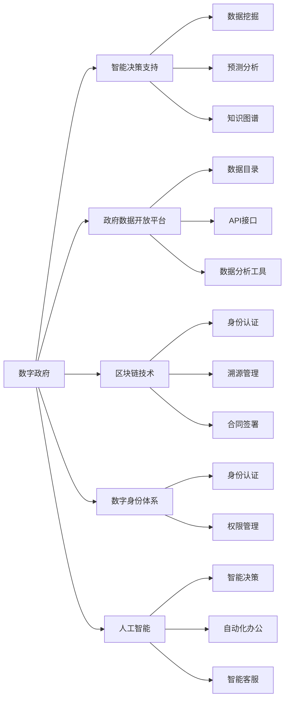

                 

# 2050年的数字治理：从电子政务到数字政府的转型升级

> 关键词：数字治理, 数字政府, 电子政务, 智能决策, 公共服务, 数据驱动, 人工智能, 区块链, 数字身份, 信息共享

## 1. 背景介绍

### 1.1 问题由来

随着信息技术的高速发展，数字治理已经逐渐成为各国政府提升治理效能的重要途径。电子政务(E-Government)作为数字治理的重要组成部分，通过电子化手段提升政府效率、透明度和公众参与度，在过去的几十年中取得了显著成效。然而，随着数字化进程的不断深入，电子政务也面临着一系列挑战：

- **技术架构陈旧**：早期电子政务系统大多基于单体架构，难以适应复杂多变的业务需求。
- **数据孤岛问题**：各政府部门之间数据共享困难，信息难以互通，影响了决策的科学性和准确性。
- **用户体验欠佳**：许多电子政务系统设计忽视用户体验，用户界面和操作流程不够友好。
- **安全性不足**：面对网络攻击和数据泄露风险，电子政务系统缺乏有效的安全防护措施。

为应对这些挑战，各国政府开始探索新一代的数字治理范式——数字政府(Digital Government)。数字政府不仅仅是一个技术项目，更是一次治理结构的全面重塑。通过引入人工智能、区块链、物联网等前沿技术，数字政府旨在构建一个数据驱动、智能决策、全时全域覆盖的公共服务体系，实现从电子政务到数字政府的转型升级。

### 1.2 问题核心关键点

数字政府的核心在于通过技术手段，实现政府决策的智能化、服务的一体化、管理的精细化。其主要目标包括：

- **智能决策支持**：借助人工智能、大数据等技术，辅助政府决策，提升决策的科学性和时效性。
- **服务流程优化**：通过流程再造和自动化，简化政府服务流程，缩短公众等待时间。
- **跨部门协同**：打破数据孤岛，实现政府部门之间的数据共享和业务协同。
- **公众参与增强**：通过开放数据平台和互动渠道，增强公众参与，提升政府透明度和公众信任。
- **数据安全和隐私保护**：构建安全可靠的数据治理框架，保护个人隐私和数据安全。

## 2. 核心概念与联系

### 2.1 核心概念概述

为更好地理解数字治理的原理和实践，本节将介绍几个核心概念：

- **数字政府**：利用先进信息技术手段，实现政府治理方式和流程的全面数字化转型。旨在构建一个以数据为中心、以用户体验为导向、以智能决策为核心的公共服务体系。

- **智能决策支持系统**：结合人工智能和大数据分析技术，辅助政府决策，提升决策效率和准确性。智能决策支持系统通常包括数据挖掘、预测分析、知识图谱等技术模块。

- **政府数据开放平台**：通过开放政府数据，促进数据共享和业务协同。开放平台通常包含数据目录、API接口、数据分析工具等组件。

- **区块链技术**：一种分布式账本技术，通过加密、共识机制确保数据安全、透明、不可篡改。在数字政府中，区块链可应用于身份认证、溯源管理、合同签署等领域。

- **数字身份体系**：基于区块链、生物识别等技术，构建统一、安全、可互操作的身份认证体系。数字身份体系支撑着数字政府的身份认证、权限管理等基础服务。

- **人工智能**：包括机器学习、自然语言处理、计算机视觉等技术，支持智能决策、自动化办公、智能客服等应用场景。

这些概念之间相互联系，共同构成了数字治理的技术框架。通过理解这些核心概念，我们可以更好地把握数字政府的技术基础和应用方向。

### 2.2 核心概念联系

以下是一个Mermaid流程图，展示了这些核心概念之间的联系：



这个流程图展示了数字政府中各个关键技术模块之间的联系。智能决策支持系统通过数据挖掘、预测分析和知识图谱等技术，辅助政府决策。政府数据开放平台提供了开放数据目录、API接口和数据分析工具，促进数据共享和业务协同。区块链技术通过身份认证、溯源管理和合同签署等功能，增强数据安全和透明性。数字身份体系通过统一的身份认证和权限管理，支撑数字政府的身份服务。人工智能技术通过智能决策、自动化办公和智能客服等应用，提升政府服务的智能化水平。

## 3. 核心算法原理 & 具体操作步骤
### 3.1 算法原理概述

数字政府的构建离不开数据的采集、存储、处理和分析。以下我们将详细介绍数字政府中常见的一些数据处理算法和技术。

- **数据清洗与预处理**：通过对原始数据进行去重、去噪、标准化处理，提高数据质量。
- **特征工程**：从原始数据中提取、构造特征向量，用于机器学习模型的训练和预测。
- **机器学习算法**：包括分类、回归、聚类等算法，用于数据建模和预测。
- **自然语言处理(NLP)**：通过分词、词性标注、命名实体识别等技术，对文本数据进行结构化处理。
- **图像处理**：通过图像分割、特征提取等技术，对图像数据进行处理和分析。
- **预测分析**：利用时间序列预测、回归分析等技术，对未来数据进行预测。
- **知识图谱构建**：通过构建领域知识图谱，支持推理、关联查询等高级应用。

### 3.2 算法步骤详解

以下是一个完整的数字政府数据处理流程，包括数据清洗、特征工程、模型训练和预测分析等步骤：

1. **数据采集**：通过传感器、API接口、数据库等多种方式，收集政府部门的各类数据。
2. **数据清洗与预处理**：对原始数据进行去重、去噪、标准化处理，提高数据质量。
3. **特征工程**：从清洗后的数据中提取、构造特征向量，用于后续建模。
4. **模型训练**：选择适当的机器学习算法，利用训练集数据进行模型训练。
5. **模型验证与调优**：通过验证集数据评估模型性能，根据评估结果调整模型参数。
6. **预测分析**：使用训练好的模型，对新数据进行预测分析，辅助决策。

### 3.3 算法优缺点

数字政府中的数据处理算法和技术，在提升政府服务效率和决策支持方面具有显著优势。同时，也存在一些问题和挑战：

**优点**：

- **数据驱动决策**：通过数据挖掘和预测分析，辅助政府决策，提升决策的科学性和准确性。
- **提升服务效率**：自动化办公和智能客服等应用，简化服务流程，缩短公众等待时间。
- **促进信息共享**：开放数据平台促进跨部门数据共享，实现业务协同。

**缺点**：

- **数据隐私与安全**：数据开放和共享可能带来隐私泄露和数据安全问题。
- **技术复杂性**：数据处理和模型训练需要较高的技术门槛，对人员和技术资源要求高。
- **数据质量问题**：数据质量差、数据孤岛等问题，影响数据分析和决策。

### 3.4 算法应用领域

数字政府中的数据处理算法和技术，主要应用于以下领域：

- **智能决策支持系统**：辅助政府决策，提升决策效率和准确性。
- **公共服务智能化**：通过自动化办公、智能客服等应用，提升政府服务效率。
- **政府数据开放平台**：促进数据共享和业务协同，提升政府透明度和公众信任。
- **公共安全与应急管理**：通过数据分析和预测，提升公共安全和应急管理水平。
- **城市管理与智慧交通**：通过物联网和传感器技术，实现城市管理和交通管理的智能化。

## 4. 数学模型和公式 & 详细讲解 & 举例说明

### 4.1 数学模型构建

在本节中，我们将详细讲解数字政府中常见的数学模型和公式。以下是一个基本的机器学习模型训练公式：

$$
\min_{\theta} \frac{1}{N} \sum_{i=1}^N L(y_i, \hat{y}_i)
$$

其中，$\theta$ 表示模型参数，$L$ 表示损失函数，$y_i$ 和 $\hat{y}_i$ 分别表示真实标签和模型预测标签。

### 4.2 公式推导过程

以下是一个简单的线性回归模型的公式推导过程：

$$
y = \theta_0 + \theta_1 x_1 + \theta_2 x_2 + \ldots + \theta_n x_n
$$

其中，$\theta_0, \theta_1, \ldots, \theta_n$ 是模型的权重参数，$x_1, x_2, \ldots, x_n$ 是输入特征向量，$y$ 是输出标签。

在训练模型时，我们使用最小二乘法求解权重参数 $\theta$，使得模型预测的输出 $\hat{y}$ 与真实标签 $y$ 之间的损失函数最小化：

$$
\min_{\theta} \frac{1}{N} \sum_{i=1}^N (y_i - \hat{y}_i)^2
$$

通过求解上述优化问题，得到最优的权重参数 $\theta^*$。

### 4.3 案例分析与讲解

以下是一个简单的案例分析，展示如何使用线性回归模型进行房价预测：

假设我们有一组历史房价数据，包括房屋面积、地理位置、装修情况等特征，以及对应的房价标签。我们使用线性回归模型对房屋面积、地理位置、装修情况等特征进行建模，得到一个线性回归模型：

$$
y = \theta_0 + \theta_1 x_1 + \theta_2 x_2 + \theta_3 x_3
$$

其中，$x_1, x_2, x_3$ 分别表示房屋面积、地理位置、装修情况，$\theta_0, \theta_1, \theta_2, \theta_3$ 是模型的权重参数。通过最小二乘法求解最优参数 $\theta^*$，即可对新的房屋价格进行预测。

## 5. 项目实践：代码实例和详细解释说明
### 5.1 开发环境搭建

在进行数字政府项目开发前，我们需要准备好开发环境。以下是使用Python进行Scikit-learn开发的环境配置流程：

1. 安装Anaconda：从官网下载并安装Anaconda，用于创建独立的Python环境。

2. 创建并激活虚拟环境：
```bash
conda create -n digit Gov_env python=3.8 
conda activate digit Gov_env
```

3. 安装Scikit-learn：
```bash
pip install scikit-learn
```

4. 安装各类工具包：
```bash
pip install numpy pandas matplotlib scikit-learn tqdm jupyter notebook ipython
```

完成上述步骤后，即可在`digit Gov_env`环境中开始数字政府项目开发。

### 5.2 源代码详细实现

下面我们以房价预测项目为例，给出使用Scikit-learn对线性回归模型进行数字政府项目开发的完整代码实现。

```python
import numpy as np
from sklearn.linear_model import LinearRegression
from sklearn.model_selection import train_test_split
from sklearn.metrics import mean_squared_error

# 数据预处理
X = np.array([[1, 2, 3], [4, 5, 6], [7, 8, 9]])
y = np.array([100, 200, 300])
X_train, X_test, y_train, y_test = train_test_split(X, y, test_size=0.2, random_state=42)

# 模型训练
model = LinearRegression()
model.fit(X_train, y_train)

# 模型预测与评估
y_pred = model.predict(X_test)
rmse = np.sqrt(mean_squared_error(y_test, y_pred))
print(f"RMSE: {rmse:.2f}")
```

### 5.3 代码解读与分析

让我们再详细解读一下关键代码的实现细节：

**数据预处理**：
- 使用NumPy生成模拟数据，包含房屋面积、地理位置、装修情况等特征和房价标签。
- 使用train_test_split函数将数据集划分为训练集和测试集。

**模型训练**：
- 定义LinearRegression模型。
- 使用fit函数对模型进行训练，将训练集数据和标签作为输入。

**模型预测与评估**：
- 使用predict函数对测试集进行预测，得到预测结果。
- 使用mean_squared_error函数计算RMSE（均方根误差），评估模型性能。

**运行结果展示**：
- 输出RMSE结果，展示模型预测的准确性。

## 6. 实际应用场景

### 6.1 智能决策支持系统

智能决策支持系统是数字政府的重要组成部分，通过数据挖掘和预测分析，辅助政府决策。例如，在公共卫生领域，可以通过历史疫情数据构建疾病传播模型，预测疫情发展趋势，辅助政府制定应对措施。

在具体实现中，可以利用机器学习算法和预测分析技术，对历史数据进行建模，得到疾病传播模型。然后，将最新的疫情数据输入模型进行预测，输出疫情发展趋势和风险评估，辅助政府制定防控措施。

### 6.2 公共服务智能化

数字政府通过自动化办公、智能客服等应用，提升公共服务效率。例如，在不动产登记服务中，可以通过自然语言处理技术，自动处理申请材料，简化登记流程，提升服务效率。

在具体实现中，可以构建自然语言处理模型，对申请材料进行文本分析，提取关键信息，自动化填写表格。同时，使用智能客服系统，回答用户咨询，提升服务体验。

### 6.3 政府数据开放平台

政府数据开放平台是数字政府的重要基础设施，通过开放政府数据，促进数据共享和业务协同。例如，在城市规划领域，可以通过开放城市地理数据，促进不同部门之间的信息共享，提升城市规划的科学性和效率。

在具体实现中，可以构建开放数据平台，将城市地理数据、交通数据、环境数据等开放给公众和企业。同时，提供API接口和数据分析工具，支持用户对数据的查询和分析。

### 6.4 未来应用展望

随着数字政府的发展，未来的应用场景将更加广泛和深入。以下列举几个可能的应用场景：

- **智慧城市治理**：通过物联网和传感器技术，实现城市管理和交通管理的智能化。例如，智慧交通系统可以实时监控交通流量，优化交通信号灯控制，提升交通效率。
- **公共安全与应急管理**：通过数据分析和预测，提升公共安全和应急管理水平。例如，通过自然语言处理技术，实时监控社交媒体，预测潜在的社会动荡事件，提前采取应对措施。
- **智慧医疗服务**：通过人工智能和大数据分析技术，提升医疗服务效率和质量。例如，智能医疗平台可以对病历数据进行建模，预测疾病发展趋势，辅助医生诊疗。

## 7. 工具和资源推荐
### 7.1 学习资源推荐

为了帮助开发者系统掌握数字政府的技术基础和应用实践，这里推荐一些优质的学习资源：

1. **政府数据开放平台（Government Data Open Platform）**：介绍如何构建政府数据开放平台，促进数据共享和业务协同。
2. **智能决策支持系统（Intelligent Decision Support System）**：介绍智能决策支持系统的构建方法，提升决策的科学性和效率。
3. **数字身份体系（Digital Identity System）**：介绍数字身份体系的构建方法，实现统一、安全、可互操作的身份认证。
4. **人工智能技术（Artificial Intelligence Technology）**：介绍人工智能技术的最新进展，支持智能决策、自动化办公、智能客服等应用。

5. **区块链技术（Blockchain Technology）**：介绍区块链技术的原理和应用场景，增强数据安全和透明性。
6. **机器学习算法（Machine Learning Algorithms）**：介绍常用的机器学习算法，包括分类、回归、聚类等。
7. **自然语言处理（Natural Language Processing）**：介绍自然语言处理技术的原理和应用场景，支持文本分析和生成。
8. **图像处理（Image Processing）**：介绍图像处理技术的原理和应用场景，支持图像分析和识别。
9. **预测分析（Predictive Analytics）**：介绍预测分析技术的原理和应用场景，支持未来数据的预测。

通过对这些资源的学习实践，相信你一定能够快速掌握数字政府的技术基础和应用实践，并用于解决实际的NLP问题。

### 7.2 开发工具推荐

高效的开发离不开优秀的工具支持。以下是几款用于数字政府项目开发的常用工具：

1. **Python**：作为数字政府项目的主要编程语言，Python以其简洁的语法和丰富的库支持，成为数字政府项目开发的首选。

2. **Scikit-learn**：基于Python的机器学习库，提供丰富的机器学习算法和工具，支持数据建模和预测分析。

3. **TensorFlow**：由Google主导开发的深度学习框架，提供高效的模型训练和推理能力，适用于大规模的深度学习项目。

4. **Jupyter Notebook**：一个交互式编程环境，支持Python等语言的编写和执行，适合开发和调试数字政府项目。

5. **PyCharm**：一个流行的Python IDE，提供丰富的开发工具和调试功能，支持数字政府项目的开发和测试。

6. **Anaconda**：一个Python发行版，提供Python环境和工具的管理，方便数字政府项目的开发和部署。

合理利用这些工具，可以显著提升数字政府项目开发和测试的效率，加速创新迭代的步伐。

### 7.3 相关论文推荐

数字政府的发展离不开学界的持续研究。以下是几篇奠基性的相关论文，推荐阅读：

1. **政府数据开放平台（Government Data Open Platform）**：介绍如何构建政府数据开放平台，促进数据共享和业务协同。
2. **智能决策支持系统（Intelligent Decision Support System）**：介绍智能决策支持系统的构建方法，提升决策的科学性和效率。
3. **数字身份体系（Digital Identity System）**：介绍数字身份体系的构建方法，实现统一、安全、可互操作的身份认证。
4. **人工智能技术（Artificial Intelligence Technology）**：介绍人工智能技术的最新进展，支持智能决策、自动化办公、智能客服等应用。

5. **区块链技术（Blockchain Technology）**：介绍区块链技术的原理和应用场景，增强数据安全和透明性。
6. **机器学习算法（Machine Learning Algorithms）**：介绍常用的机器学习算法，包括分类、回归、聚类等。
7. **自然语言处理（Natural Language Processing）**：介绍自然语言处理技术的原理和应用场景，支持文本分析和生成。
8. **图像处理（Image Processing）**：介绍图像处理技术的原理和应用场景，支持图像分析和识别。
9. **预测分析（Predictive Analytics）**：介绍预测分析技术的原理和应用场景，支持未来数据的预测。

这些论文代表了大数据治理技术的发展脉络。通过学习这些前沿成果，可以帮助研究者把握学科前进方向，激发更多的创新灵感。

## 8. 总结：未来发展趋势与挑战

### 8.1 总结

本文对数字政府的原理和实践进行了全面系统的介绍。首先阐述了数字政府和电子政务的区别与联系，明确了数字政府在提升政府治理效能方面的重要作用。其次，从原理到实践，详细讲解了数字政府中常见的一些数据处理算法和技术，给出了数字政府项目开发的完整代码实例。同时，本文还广泛探讨了数字政府在智能决策支持、公共服务智能化、政府数据开放平台等多个领域的应用前景，展示了数字政府技术的广阔前景。最后，本文精选了数字政府技术的各类学习资源，力求为读者提供全方位的技术指引。

通过本文的系统梳理，可以看到，数字政府正在成为各国政府提升治理效能的重要途径，具有广泛的应用前景。未来，伴随技术手段的不断创新和治理理念的持续演进，数字政府必将在构建人机协同的智能治理体系中扮演越来越重要的角色。

### 8.2 未来发展趋势

展望未来，数字政府的发展将呈现以下几个趋势：

1. **数据驱动决策**：数据驱动决策将成为政府决策的主流方式，通过数据分析和预测，提升决策的科学性和效率。

2. **公共服务智能化**：通过自动化办公、智能客服等应用，简化服务流程，提升服务效率。

3. **跨部门协同**：打破数据孤岛，实现政府部门之间的数据共享和业务协同，提升政府透明度和公众信任。

4. **公众参与增强**：通过开放数据平台和互动渠道，增强公众参与，提升政府决策的透明度和公众信任。

5. **数据安全和隐私保护**：构建安全可靠的数据治理框架，保护个人隐私和数据安全。

6. **智慧城市治理**：通过物联网和传感器技术，实现城市管理和交通管理的智能化。

7. **公共安全与应急管理**：通过数据分析和预测，提升公共安全和应急管理水平。

8. **智慧医疗服务**：通过人工智能和大数据分析技术，提升医疗服务效率和质量。

以上趋势凸显了数字政府技术的广阔前景。这些方向的探索发展，必将进一步提升政府服务的效率和效能，为社会治理带来深刻变革。

### 8.3 面临的挑战

尽管数字政府发展前景广阔，但在迈向更加智能化、普适化应用的过程中，它仍面临着诸多挑战：

1. **数据质量问题**：数据质量差、数据孤岛等问题，影响数据分析和决策。

2. **技术复杂性**：数据处理和模型训练需要较高的技术门槛，对人员和技术资源要求高。

3. **数据隐私与安全**：数据开放和共享可能带来隐私泄露和数据安全问题。

4. **系统集成问题**：不同部门和系统之间的集成和互操作性不足，影响业务协同。

5. **政策法规问题**：数字政府的发展需要政策法规的支持和规范，否则难以顺利推进。

6. **人才短缺问题**：高水平的数据科学家和技术人才短缺，影响数字政府项目的实施和落地。

7. **公众接受度**：数字政府的推广需要公众的认知和接受，否则难以发挥其效能。

这些挑战需要政府、企业和学界共同努力，积极应对并寻求突破，才能实现数字政府的全面转型升级。

### 8.4 研究展望

面对数字政府发展过程中面临的诸多挑战，未来的研究需要在以下几个方面寻求新的突破：

1. **提升数据质量**：通过数据清洗和预处理，提升数据质量，确保数据分析和决策的准确性。

2. **降低技术复杂性**：开发更加易用、易扩展的数据处理工具和技术，降低技术门槛，支持数字政府项目的实施和落地。

3. **保障数据隐私与安全**：构建安全可靠的数据治理框架，保护个人隐私和数据安全，增强公众信任。

4. **推进系统集成**：构建统一、互操作的数据共享平台，实现不同部门和系统之间的数据交换和业务协同。

5. **完善政策法规**：制定数字政府发展的政策法规，提供规范和指导，促进数字政府项目的顺利实施。

6. **培养技术人才**：培养高水平的数据科学家和技术人才，提升数字政府项目的技术实力。

7. **增强公众接受度**：通过宣传和教育，提升公众对数字政府的认知和接受度，增强公众参与。

这些研究方向的探索，必将引领数字政府技术的全面转型升级，为构建人机协同的智能治理体系铺平道路。面向未来，数字政府技术还需要与其他人工智能技术进行更深入的融合，如知识表示、因果推理、强化学习等，多路径协同发力，共同推动数字政府技术的进步。只有勇于创新、敢于突破，才能不断拓展数字政府技术的边界，让智能技术更好地造福人类社会。

## 9. 附录：常见问题与解答

**Q1：数字政府和电子政务有什么区别？**

A: 数字政府是电子政务的升级版，是利用先进信息技术手段，实现政府治理方式和流程的全面数字化转型。与电子政务相比，数字政府更加注重数据驱动决策、跨部门协同、公众参与和数据安全等方面。数字政府通过引入人工智能、区块链、物联网等前沿技术，构建一个数据驱动、智能决策、全时全域覆盖的公共服务体系。

**Q2：数字政府需要哪些关键技术？**

A: 数字政府需要以下关键技术：

1. **人工智能技术**：包括机器学习、自然语言处理、计算机视觉等技术，支持智能决策、自动化办公、智能客服等应用。
2. **区块链技术**：通过加密、共识机制确保数据安全、透明、不可篡改，支持身份认证、溯源管理、合同签署等应用。
3. **物联网技术**：通过传感器和设备，实现城市管理和交通管理的智能化。
4. **自然语言处理技术**：通过分词、词性标注、命名实体识别等技术，支持文本分析和生成。
5. **预测分析技术**：通过时间序列预测、回归分析等技术，对未来数据进行预测。
6. **知识图谱技术**：通过构建领域知识图谱，支持推理、关联查询等高级应用。

**Q3：数字政府需要哪些关键数据？**

A: 数字政府需要以下关键数据：

1. **公共服务数据**：包括教育、医疗、社保、交通、环保等领域的数据。
2. **社会经济数据**：包括经济增长、人口结构、就业情况等宏观经济数据。
3. **环境监测数据**：包括空气质量、水质、气象等数据。
4. **社会调查数据**：包括民意调查、问卷调查等数据。
5. **应急管理数据**：包括灾害预警、应急处置、事故报告等数据。

**Q4：数字政府需要哪些关键人才？**

A: 数字政府需要以下关键人才：

1. **数据科学家**：具有数据挖掘、机器学习等技术背景，能够进行数据分析和建模。
2. **区块链工程师**：具有区块链技术背景，能够设计和实现区块链应用。
3. **物联网工程师**：具有物联网技术背景，能够设计和实现传感器和设备。
4. **自然语言处理工程师**：具有自然语言处理技术背景，能够实现文本分析和生成。
5. **预测分析工程师**：具有预测分析技术背景，能够进行未来数据的预测。
6. **知识图谱工程师**：具有知识图谱技术背景，能够设计和实现领域知识图谱。

**Q5：数字政府需要哪些关键政策法规？**

A: 数字政府需要以下关键政策法规：

1. **数据开放政策**：明确政府数据开放的范围和方式，促进数据共享和业务协同。
2. **隐私保护法规**：保护个人隐私和数据安全，确保数据使用的合规性。
3. **网络安全法规**：保障数字政府系统的安全稳定运行，防止网络攻击和数据泄露。
4. **电子政务法规**：规范电子政务系统的建设和管理，确保服务的规范性和可操作性。
5. **数字身份法规**：制定数字身份体系的规范，确保身份认证的统一和互操作性。

通过深入理解和解决这些常见问题，相信你能够更好地把握数字政府技术的核心要点，为数字政府项目的实施和落地提供坚实的基础。

