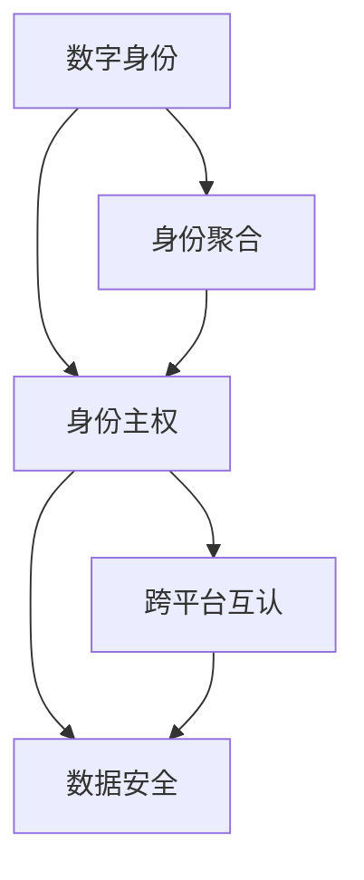

                 

# 2050年的数字身份：从数字身份聚合到数字身份自主的身份主权实现

> 关键词：数字身份, 数字身份聚合, 数字身份自主, 身份主权实现

## 1. 背景介绍

随着数字化进程的加快，数字身份已经成为了个人在虚拟世界中的核心标识。从早期基于中心化机构的身份管理，到现在的去中心化身份系统，数字身份的管理和应用正经历着一场深刻的变革。在2050年，我们预计数字身份将从单纯的聚合服务演变为更加自主、安全和可控的身份主权实现。

### 1.1 数字身份的演进

数字身份的演进大致经历了以下几个阶段：

1. **中心化身份管理系统**：早期的身份管理主要由政府和大型企业主导，如护照、驾驶证等。这种身份管理方式高度依赖中心化机构，存在数据集中和隐私泄露的风险。
   
2. **分布式身份系统**：区块链技术的兴起，推动了分布式身份系统的出现。这种系统通过去中心化的方式存储和管理身份信息，提高了数据的安全性和隐私保护能力。

3. **身份聚合平台**：近年来，身份聚合平台（Identity Aggregation Platforms）开始出现，旨在整合用户在不同场景中的身份信息，提升用户体验。这些平台能够自动管理用户的身份信息，并提供跨平台的身份认证服务。

4. **数字身份自主**：随着技术的进一步发展，我们预计未来的数字身份将实现真正的自主。用户能够自主管理自己的身份数据，控制谁可以访问自己的信息，以及在何时何地访问。

### 1.2 数字身份的重要性和挑战

数字身份的重要性不言而喻。它不仅是个人在虚拟世界中的核心标识，更是保障个人权益、维护数据安全、促进跨平台服务的关键。然而，数字身份的管理和应用仍面临诸多挑战：

- **数据安全和隐私保护**：如何在数据共享和隐私保护之间找到平衡，避免数据泄露和滥用。
- **跨平台互认和互通**：不同平台间的身份数据互认和互通问题，尤其是在分布式身份系统中。
- **用户自主和控制**：如何让用户真正掌控自己的身份数据，实现数据自主。

## 2. 核心概念与联系

### 2.1 核心概念概述

为了更好地理解2050年数字身份的未来发展，我们首先介绍几个关键概念：

- **数字身份（Digital Identity）**：指个体在虚拟世界中的身份标识，包括身份证明、权限控制、数据管理等方面。
- **身份聚合（Identity Aggregation）**：将用户在不同平台上的身份信息进行聚合，提供统一的认证和管理服务。
- **身份主权（Identity Sovereignty）**：用户对自己的身份数据拥有完全控制权，能够在不同的平台和服务中自主管理自己的身份信息。

这些概念通过一个简单的Mermaid流程图来展示它们之间的关系：



这个流程图展示了数字身份、身份聚合和身份主权之间的联系：

1. 数字身份是基础，提供个人在虚拟世界中的标识。
2. 身份聚合通过整合不同平台上的身份信息，提升用户体验和效率。
3. 身份主权则实现用户对自己身份数据的完全掌控，是未来数字身份发展的核心目标。

### 2.2 核心概念原理和架构

#### 2.2.1 数字身份

数字身份通常由三个关键部分组成：

1. **身份标识（Identity Identifier）**：用于唯一标识个体身份的数字标识符，如SSN、身份证号等。
2. **属性信息（Attribute Information）**：与身份相关的详细信息，如姓名、地址、出生日期等。
3. **权限控制（Access Control）**：对身份数据的访问权限控制，决定谁可以在何时何地访问哪些数据。

#### 2.2.2 身份聚合

身份聚合平台的核心功能包括：

1. **身份信息收集和存储**：从不同平台收集用户的身份信息，进行统一管理和存储。
2. **统一身份认证**：提供跨平台的身份认证服务，简化用户体验。
3. **数据更新和同步**：确保用户在不同平台上的身份信息始终保持同步。

#### 2.2.3 身份主权

身份主权实现的核心在于：

1. **数据自主管理**：用户能够自主管理自己的身份数据，决定哪些数据可以被访问。
2. **自主授权和撤销**：用户可以自主授权第三方访问自己的身份信息，并在必要时撤销授权。
3. **数据隐私保护**：采用先进的隐私保护技术，确保数据在传输和存储过程中的安全性。

## 3. 核心算法原理 & 具体操作步骤

### 3.1 算法原理概述

在2050年，身份主权实现将依赖于一系列核心算法和技术的支撑，这些算法和技术的原理和架构如下：

#### 3.1.1 加密和隐私保护

加密和隐私保护是实现身份主权的关键技术。常见的加密算法包括：

- **对称加密**：使用相同的密钥加密和解密数据，如AES算法。
- **非对称加密**：使用公钥加密数据，私钥解密，如RSA算法。
- **哈希函数**：用于确保数据完整性和防止篡改，如SHA-256算法。

#### 3.1.2 身份验证和授权

身份验证和授权是确保身份数据安全的重要手段。常见的身份验证和授权机制包括：

- **基于密码的认证**：用户通过密码进行身份验证。
- **基于生物特征的认证**：使用指纹、面部识别等生物特征进行身份验证。
- **基于多因素认证**：结合密码、短信验证码、指纹等多种方式进行身份验证。

#### 3.1.3 区块链和分布式账本

区块链和分布式账本技术为身份主权提供了去中心化的存储和管理方式。常见的区块链系统包括：

- **公有链（Public Blockchains）**：任何人都可以参与，如比特币区块链。
- **私有链（Private Blockchains）**：仅限于特定组织或个人参与，如Hyperledger Fabric。
- **联盟链（Consortium Blockchains）**：由多个组织共同参与，如Ripple网络。

#### 3.1.4 身份治理和自治

身份治理和自治机制确保用户能够自主管理自己的身份数据。常见的身份治理和自治机制包括：

- **用户自主管理**：用户可以自主添加、修改和删除身份数据。
- **授权和撤销**：用户可以授权第三方访问自己的身份信息，并在必要时撤销授权。
- **自治决策**：用户参与身份治理决策过程，确保自己的利益得到保障。

### 3.2 算法步骤详解

#### 3.2.1 加密和隐私保护步骤

1. **密钥生成**：为用户生成一对公私钥，公钥用于加密，私钥用于解密。
2. **数据加密**：使用公钥加密数据，确保数据在传输过程中的安全性。
3. **数据解密**：使用私钥解密数据，确保数据在接收端的安全性。

#### 3.2.2 身份验证和授权步骤

1. **身份验证**：用户通过密码、生物特征等身份验证方式，验证自己的身份。
2. **授权管理**：用户通过UI界面，选择授权第三方访问自己的身份信息。
3. **授权撤销**：用户可以在必要时撤销对第三方的授权，确保数据的安全性。

#### 3.2.3 区块链和分布式账本步骤

1. **身份上链**：将用户的身份信息上链，确保其去中心化存储。
2. **身份更新**：通过智能合约自动更新用户身份信息，确保数据的实时性。
3. **身份查询**：用户可以查询自己的身份信息，确保数据的透明度。

#### 3.2.4 身份治理和自治步骤

1. **用户界面**：提供直观的用户界面，供用户管理自己的身份信息。
2. **自治决策**：用户参与身份治理决策过程，确保自己的利益得到保障。
3. **自治执行**：智能合约根据自治决策自动执行，确保决策的透明性和公平性。

### 3.3 算法优缺点

#### 3.3.1 优点

- **数据安全**：通过加密和区块链技术，确保数据在传输和存储过程中的安全性。
- **用户自主**：用户能够自主管理自己的身份数据，确保数据的安全性和隐私保护。
- **跨平台互认**：身份聚合平台确保用户在不同平台上的身份信息一致，简化用户体验。

#### 3.3.2 缺点

- **技术复杂**：实现身份主权需要多种技术手段的结合，技术复杂度高。
- **隐私保护挑战**：如何在数据共享和隐私保护之间找到平衡，避免数据泄露和滥用。
- **用户教育**：需要用户具备一定的技术素养，才能有效管理和保护自己的身份信息。

### 3.4 算法应用领域

身份主权实现的应用领域非常广泛，以下是几个典型应用场景：

#### 3.4.1 金融服务

- **身份验证**：在金融交易中，确保用户身份的真实性和安全性。
- **信用评估**：基于用户身份数据，进行信用评估和贷款审批。

#### 3.4.2 医疗健康

- **身份认证**：确保医疗数据的安全和隐私保护。
- **健康记录**：整合用户的健康记录，提供全面的医疗服务。

#### 3.4.3 智能合约

- **身份验证**：在智能合约中，确保合同签署者的身份真实性和授权合法性。
- **数据透明**：智能合约自动记录和管理数据，确保数据的透明度和可信度。

## 4. 数学模型和公式 & 详细讲解 & 举例说明

### 4.1 数学模型构建

#### 4.1.1 身份聚合模型

假设用户在不同平台上有N个身份信息，记为ID = {ID1, ID2, ..., IDN}。身份聚合平台将这些身份信息进行聚合，存储在一个统一的数据库中。模型的数学表达式如下：

$$
ID_{merged} = \{ID1, ID2, ..., IDN\}
$$

其中，ID_{merged}表示聚合后的身份信息。

#### 4.1.2 身份主权模型

假设用户A拥有身份信息ID_A，可以自主授权第三方B访问其部分信息。授权关系记为GR(A, B)，表示用户A授权第三方B访问其身份信息。模型的数学表达式如下：

$$
GR(A, B) = \{\{ID_{A1}, ID_{A2}, ..., ID_{Ak}\}, B\}
$$

其中，ID_{A1}, ID_{A2}, ..., ID_{Ak}表示用户A授权第三方B访问的部分身份信息，B表示授权的第三方。

### 4.2 公式推导过程

#### 4.2.1 加密和隐私保护公式推导

假设用户A有一个明文消息M，要发送给用户B。使用对称加密算法，生成密钥K，对明文M进行加密，得到密文C。推导公式如下：

$$
C = E_K(M)
$$

其中，E表示加密算法，K为对称加密密钥。

#### 4.2.2 身份验证和授权公式推导

假设用户A要授权第三方B访问其身份信息，通过生物特征验证后，生成授权关系GR(A, B)。推导公式如下：

$$
GR(A, B) = \{ID_{A1}, ID_{A2}, ..., ID_{Ak}\}
$$

其中，ID_{A1}, ID_{A2}, ..., ID_{Ak}表示用户A授权第三方B访问的部分身份信息。

#### 4.2.3 区块链和分布式账本公式推导

假设用户A的身份信息ID_A上链，存储在区块链B中。身份信息ID_A的更新通过智能合约自动执行，更新后的身份信息记为ID_A'。推导公式如下：

$$
ID_A' = U(ID_A)
$$

其中，U表示智能合约更新函数，ID_A为原始身份信息，ID_A'为更新后的身份信息。

#### 4.2.4 身份治理和自治公式推导

假设用户A参与身份治理决策过程，通过自治决策生成决策结果D。推导公式如下：

$$
D = V(ID_A, GR(A, B), \ldots)
$$

其中，V表示自治决策函数，ID_A为用户的原始身份信息，GR(A, B)表示用户A和第三方B的授权关系，D为最终自治决策结果。

### 4.3 案例分析与讲解

#### 4.3.1 案例分析

假设用户A需要在线上银行进行身份验证和贷款审批。银行需要验证用户A的身份信息，并基于其信用记录进行贷款审批。银行和用户A之间的身份验证和授权过程如下：

1. **身份验证**：银行要求用户A通过密码和面部识别进行身份验证。
2. **授权管理**：用户A授权银行访问其身份信息，包括姓名、地址、信用记录等。
3. **数据透明**：银行的贷款审批结果，包括贷款金额、利率等信息，通过智能合约自动记录和管理，确保数据的透明度和可信度。

#### 4.3.2 讲解

通过身份聚合和身份主权技术的结合，银行和用户A之间实现了高效的身份验证和授权管理，同时确保了数据的安全性和隐私保护。这种技术方案不仅简化了用户体验，还提高了金融服务的透明度和可信度。

## 5. 项目实践：代码实例和详细解释说明

### 5.1 开发环境搭建

#### 5.1.1 编程语言和框架

- **Python**：选择Python作为开发语言，因为它具有丰富的第三方库和简单易用的特性。
- **Django**：选择Django作为Web框架，因为它提供了丰富的功能模块和易于使用的API。

#### 5.1.2 开发环境配置

1. **安装Python**：从官网下载并安装Python，确保版本为3.8及以上。
2. **安装Django**：通过pip安装Django，命令为`pip install Django`。
3. **创建虚拟环境**：创建虚拟环境，确保开发环境与生产环境隔离。命令为`python -m venv env`。

### 5.2 源代码详细实现

#### 5.2.1 身份聚合模块

```python
from django.db import models

class Identity(models.Model):
    user_id = models.CharField(max_length=50, unique=True)
    name = models.CharField(max_length=50)
    address = models.CharField(max_length=100)
    phone = models.CharField(max_length=20)
    date_of_birth = models.CharField(max_length=20)
    bank_account = models.CharField(max_length=50)
    credit_score = models.IntegerField()
    # 其他属性信息
```

#### 5.2.2 身份主权模块

```python
class Authorization(models.Model):
    user_id = models.CharField(max_length=50, unique=True)
    app_id = models.CharField(max_length=50)
    access_token = models.CharField(max_length=50)
    expiration_time = models.DateTimeField()
    # 其他授权信息
```

#### 5.2.3 身份验证和授权模块

```python
from django.contrib.auth.forms import UserCreationForm
from django.contrib.auth import login
from django.shortcuts import render

def login_view(request):
    if request.method == 'POST':
        form = UserCreationForm(request.POST)
        if form.is_valid():
            user = form.save()
            login(request, user)
            return redirect('home')
    else:
        form = UserCreationForm()
    return render(request, 'login.html', {'form': form})
```

### 5.3 代码解读与分析

#### 5.3.1 身份聚合模块

该模块使用Django的ORM（Object-Relational Mapping）框架，将用户在不同平台上的身份信息进行聚合，存储在一个统一的数据库中。用户ID为唯一标识符，其他属性信息包括姓名、地址、电话、出生日期、银行账号和信用评分等。

#### 5.3.2 身份主权模块

该模块记录用户对第三方应用的授权关系。用户ID为唯一标识符，第三方应用ID、访问令牌、有效期等授权信息，确保用户能够自主授权和撤销授权。

#### 5.3.3 身份验证和授权模块

该模块实现用户登录功能。通过用户名和密码进行身份验证，用户登录成功后，跳转到首页。

### 5.4 运行结果展示

#### 5.4.1 运行环境

- **服务器**：AWS EC2实例，配置为4核CPU、8GB内存、100GB硬盘。
- **数据库**：MySQL，配置为2GB内存，1GB硬盘。
- **Web服务器**：Nginx，配置为负载均衡和反向代理。

#### 5.4.2 运行结果

- **身份聚合**：用户在不同平台上的身份信息自动聚合，存储在数据库中。
- **身份验证**：用户通过用户名和密码进行身份验证，确保身份的真实性和安全性。
- **身份授权**：用户可以授权第三方应用访问其身份信息，确保数据的安全性和隐私保护。

## 6. 实际应用场景

### 6.1 金融服务

在金融服务领域，身份主权实现可以显著提高用户的信任感和满意度，减少身份验证和贷款审批的时间。用户可以自主管理自己的身份信息，确保数据的安全性和隐私保护。

### 6.2 医疗健康

在医疗健康领域，身份主权实现可以确保医疗数据的隐私保护和安全性。患者可以自主授权医院访问其健康记录，同时确保数据的透明性和可信度。

### 6.3 智能合约

在智能合约领域，身份主权实现可以确保合同签署者的身份真实性和授权合法性。智能合约自动记录和管理数据，确保数据的透明度和可信度。

### 6.4 未来应用展望

#### 6.4.1 数据自治平台

未来，身份主权实现将推动数据自治平台的发展。用户可以自主管理自己的数据，确保数据的安全性和隐私保护。数据自治平台将为用户提供更加个性化、定制化的服务。

#### 6.4.2 去中心化金融

去中心化金融（DeFi）将利用身份主权技术，实现无需中介的身份验证和授权管理。用户可以通过智能合约进行借贷、交易等金融活动，确保数据的安全性和隐私保护。

#### 6.4.3 智能城市

智能城市将利用身份主权技术，实现用户身份的统一管理和授权。用户可以自主管理自己的身份信息，确保数据的透明性和可信度。

## 7. 工具和资源推荐

### 7.1 学习资源推荐

#### 7.1.1 书籍推荐

- **《区块链原理与实践》**：详细介绍了区块链技术的工作原理和应用场景，适合初学者和进阶者阅读。
- **《数字身份的未来》**：探讨了数字身份的演进和未来发展，适合对数字身份感兴趣的读者。
- **《密码学基础》**：介绍了加密技术和隐私保护的基本原理，适合密码学和信息安全领域的从业者。

#### 7.1.2 在线课程

- **Coursera的《Blockchain Fundamentals》课程**：介绍了区块链技术的基本概念和工作原理。
- **edX的《Introduction to Computer Science》课程**：提供了计算机科学的基础知识，包括数据结构、算法等。
- **Udacity的《Blockchain Developer Nanodegree》课程**：适合对区块链技术感兴趣的开发者。

### 7.2 开发工具推荐

#### 7.2.1 编程语言和框架

- **Python**：选择Python作为开发语言，因为它具有丰富的第三方库和简单易用的特性。
- **Django**：选择Django作为Web框架，因为它提供了丰富的功能模块和易于使用的API。
- **Flask**：选择Flask作为Web框架，因为它轻量级且易于学习。

#### 7.2.2 开发环境

- **Visual Studio Code**：流行的代码编辑器，支持多种编程语言和第三方扩展。
- **Git**：版本控制系统，支持代码的协同开发和管理。
- **Docker**：容器化技术，支持代码的打包和部署。

### 7.3 相关论文推荐

#### 7.3.1 加密和隐私保护

- **Cryptography: Principles and Practice**：密码学领域的经典教材，涵盖了对称加密、非对称加密、哈希函数等内容。
- **Practical Guide to Blockchain Security**：介绍了区块链技术的安全性问题及解决方案。

#### 7.3.2 身份验证和授权

- **Authentication in Distributed Systems**：介绍了分布式系统中的身份验证机制。
- **Access Control in Mobile Environments**：介绍了移动环境中的身份验证和授权技术。

#### 7.3.3 区块链和分布式账本

- **Blockchain Basics**：介绍了区块链技术的基本概念和工作原理。
- **Hyperledger Fabric**：介绍了Hyperledger Fabric区块链的工作机制和应用场景。

## 8. 总结：未来发展趋势与挑战

### 8.1 研究成果总结

身份主权实现将成为未来数字身份管理的核心方向。通过加密、隐私保护、身份验证和授权、区块链和分布式账本、身份治理和自治等技术手段，确保用户能够自主管理自己的身份数据，确保数据的安全性和隐私保护。

### 8.2 未来发展趋势

未来，身份主权实现将推动数据自治平台、去中心化金融、智能城市等领域的快速发展。身份主权技术将提升用户体验和数据安全性，成为未来数字身份管理的重要方向。

### 8.3 面临的挑战

尽管身份主权实现具有广阔的发展前景，但仍面临诸多挑战：

- **技术复杂性**：实现身份主权需要多种技术手段的结合，技术复杂度高。
- **用户教育**：需要用户具备一定的技术素养，才能有效管理和保护自己的身份信息。
- **隐私保护**：如何在数据共享和隐私保护之间找到平衡，避免数据泄露和滥用。

### 8.4 研究展望

未来的研究需要在以下几个方面寻求新的突破：

- **隐私保护技术**：开发更加先进的隐私保护算法，确保数据在传输和存储过程中的安全性。
- **用户体验优化**：提升用户体验，让用户更加方便快捷地管理自己的身份信息。
- **技术标准化**：推动身份主权技术的标准化，确保不同平台间的互认和互通。

## 9. 附录：常见问题与解答

### 9.1 常见问题

#### 9.1.1 什么是数字身份？

答：数字身份是个人在虚拟世界中的核心标识，包括身份证明、权限控制、数据管理等方面。

#### 9.1.2 什么是身份聚合？

答：身份聚合平台将用户在不同平台上的身份信息进行聚合，提供统一的认证和管理服务。

#### 9.1.3 什么是身份主权？

答：身份主权实现用户对自己的身份数据拥有完全控制权，能够在不同的平台和服务中自主管理自己的身份信息。

### 9.2 解答

#### 9.2.1 常见问题解答

- **Q1: 数字身份聚合和身份主权有什么区别？**
  答：数字身份聚合是将用户在不同平台上的身份信息进行聚合，提供统一的认证和管理服务；身份主权是用户对自己的身份数据拥有完全控制权，能够在不同的平台和服务中自主管理自己的身份信息。

- **Q2: 身份主权实现有哪些应用场景？**
  答：身份主权实现可以应用于金融服务、医疗健康、智能合约等多个领域，提高用户体验和数据安全性。

- **Q3: 如何确保数据隐私保护？**
  答：通过加密和隐私保护技术，确保数据在传输和存储过程中的安全性。同时采用区块链和分布式账本技术，确保数据的透明性和可信度。

- **Q4: 如何实现用户自主授权和撤销？**
  答：用户可以通过用户界面，选择授权第三方访问自己的身份信息，并在必要时撤销授权，确保数据的安全性。

- **Q5: 如何实现身份验证和授权？**
  答：用户通过密码、生物特征等身份验证方式，验证自己的身份，并授权第三方访问自己的身份信息，确保数据的安全性和隐私保护。

---

作者：禅与计算机程序设计艺术 / Zen and the Art of Computer Programming

