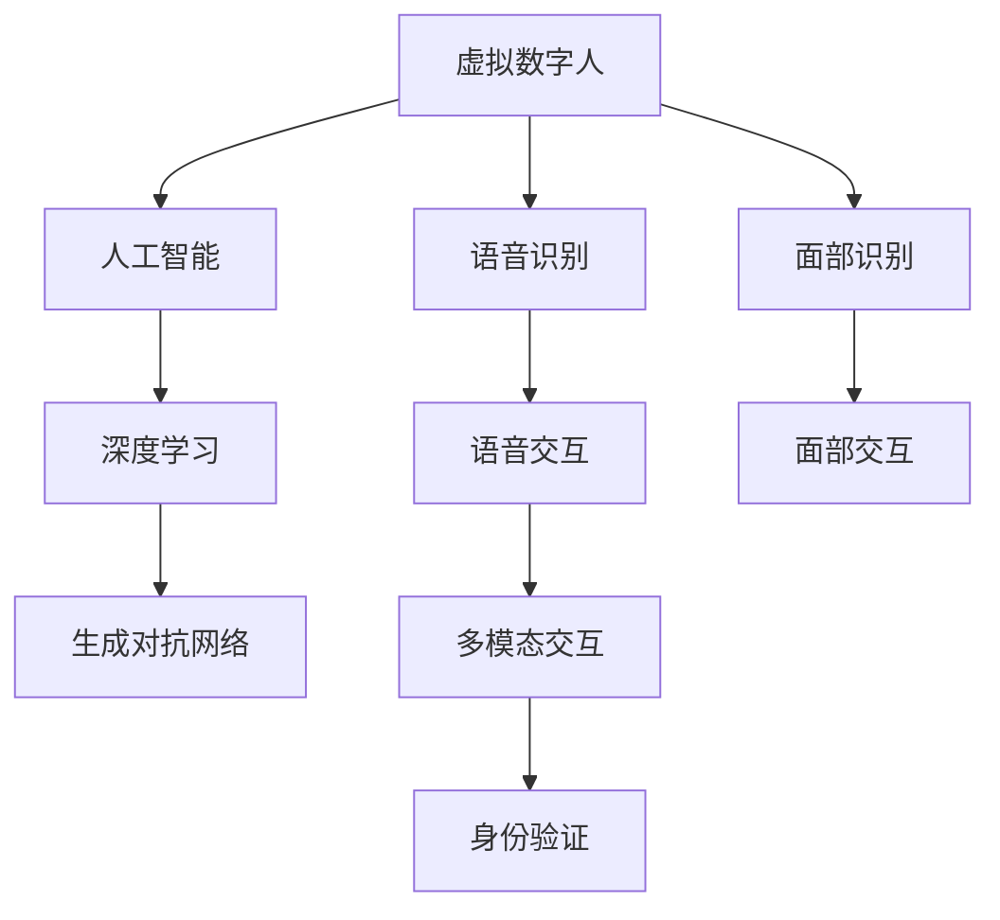

                 

# 2050年的数字身份：从数字身份钱包到虚拟数字人的身份数字化

## 1. 背景介绍

### 1.1 问题由来

在数字化时代，数字身份已经成为我们不可分割的一部分。从社交媒体账号到银行账户，从在线游戏角色到虚拟现实空间，数字身份无处不在。然而，现有的数字身份系统面临着诸多挑战，如安全性不足、隐私泄露、身份被盗用等问题。这些问题不仅威胁到个人的财产安全，还可能导致社会信任危机。

面对这些问题，我们急需一种新的身份验证方式，既能保证身份的真实性，又能兼顾隐私保护和用户体验。虚拟数字人（Virtual Digital People）作为一种新兴的身份验证方式，有望在未来取代传统的密码、身份证等身份验证方式，成为我们数字化身份的新趋势。

### 1.2 问题核心关键点

虚拟数字人是一种基于人工智能技术的数字身份验证方式。通过AI算法，生成一个与用户自身特征相匹配的虚拟形象，用户可以通过这个虚拟形象来验证身份，而无需输入复杂密码或携带实体证件。

虚拟数字人的核心思想是将用户的生物特征（如面部特征、声纹、指纹等）和行为特征（如打字速度、语音语调等）结合，生成一个唯一的虚拟形象，该虚拟形象具备与用户高度相似的外形和行为特征。用户在进行身份验证时，只需通过该虚拟形象进行验证，即可证明其身份的真实性。

### 1.3 问题研究意义

虚拟数字人的应用，不仅可以提高身份验证的安全性，还能提升用户体验。其身份验证方式更加自然、便捷，适用于各种场景，如金融、医疗、教育、政府服务等。随着人工智能技术的不断进步，虚拟数字人将成为我们数字化身份的新趋势，为未来的数字化生活提供更强大的支持。

## 2. 核心概念与联系

### 2.1 核心概念概述

为更好地理解虚拟数字人的核心原理和架构，本节将介绍几个密切相关的核心概念：

- 虚拟数字人(Virtual Digital People)：基于人工智能技术的数字身份验证方式，通过生成与用户自身特征相匹配的虚拟形象，进行身份验证。
- 人工智能(AI)：通过机器学习、深度学习等算法，使计算机具备类似于人类的智能行为。
- 深度学习(Deep Learning)：一种基于神经网络的机器学习算法，可以处理大规模的复杂数据，广泛用于图像、语音、自然语言处理等领域。
- 生成对抗网络(GAN)：一种生成模型，通过对抗训练的方式生成逼真的虚拟形象，用于虚拟数字人构建。
- 语音识别(Speech Recognition)：将语音信号转化为文本信号，用于虚拟数字人的语音交互功能。
- 面部识别(Face Recognition)：通过分析面部特征，识别出不同用户，用于虚拟数字人的面部交互功能。

这些核心概念之间的逻辑关系可以通过以下Mermaid流程图来展示：



这个流程图展示了几类核心概念及其之间的关系：

1. 虚拟数字人通过人工智能技术实现。
2. 深度学习是人工智能的重要组成部分，用于生成逼真的虚拟形象。
3. 生成对抗网络用于生成虚拟形象。
4. 语音识别和面部识别用于增强虚拟数字人的交互体验。
5. 多模态交互使虚拟数字人具备语音和面部两种交互方式。
6. 身份验证是虚拟数字人的最终目的。

这些概念共同构成了虚拟数字人的核心原理和架构，使其能够在各种场景下提供强大的身份验证支持。通过理解这些核心概念，我们可以更好地把握虚拟数字人的工作原理和优化方向。

## 3. 核心算法原理 & 具体操作步骤
### 3.1 算法原理概述

虚拟数字人的核心算法基于深度学习生成对抗网络（GAN），通过生成逼真的虚拟形象，实现身份验证。其工作原理如下：

1. **数据收集**：收集用户的面部特征、声纹、指纹等生物特征数据，以及用户的打字速度、语音语调等行为特征数据。
2. **模型训练**：使用生成对抗网络（GAN），训练一个生成模型和一个判别模型。生成模型生成虚拟形象，判别模型判断生成形象的真实性。
3. **身份验证**：用户在进行身份验证时，只需输入一些基本信息，系统会通过生成模型生成一个虚拟形象，判别模型判断该形象的真实性，从而完成身份验证。

虚拟数字人的算法流程可以概括为“数据收集-模型训练-身份验证”三个步骤。其核心在于生成逼真的虚拟形象，确保虚拟形象与用户高度相似。

### 3.2 算法步骤详解

虚拟数字人的具体实现步骤如下：

**Step 1: 数据收集**

数据收集是虚拟数字人的基础，包括用户的生物特征和行为特征。

- **生物特征数据**：面部特征、声纹、指纹等。
- **行为特征数据**：打字速度、语音语调等。

收集这些数据的方法如下：

- **面部特征**：使用摄像头和深度学习算法，分析用户的面部特征。
- **声纹**：通过麦克风和语音识别算法，提取用户的声纹特征。
- **指纹**：使用指纹识别设备，获取用户的指纹特征。
- **打字速度**：分析用户在键盘上的打字行为，计算其打字速度。
- **语音语调**：通过麦克风和语音识别算法，提取用户的语音特征。

**Step 2: 模型训练**

模型训练是虚拟数字人的核心，包括生成对抗网络（GAN）的训练。

- **生成模型**：使用GAN生成逼真的虚拟形象。
- **判别模型**：判断生成形象的真实性。

GAN的训练过程如下：

1. **生成模型训练**：使用生成器（Generator）生成虚拟形象。
2. **判别模型训练**：使用判别器（Discriminator）判断虚拟形象的真实性。
3. **对抗训练**：生成器和判别器互相对抗，不断提高生成模型的生成质量，降低判别模型的判别能力。

**Step 3: 身份验证**

身份验证是虚拟数字人的最终目的，包括以下步骤：

1. **用户输入基本信息**：用户输入姓名、身份证号等基本信息。
2. **生成虚拟形象**：系统根据基本信息生成一个虚拟形象。
3. **判别模型判断**：判别模型判断虚拟形象的真实性。
4. **身份验证结果**：根据判别结果，验证用户身份。

### 3.3 算法优缺点

虚拟数字人的算法具有以下优点：

1. **高安全性**：虚拟数字人通过生成逼真的虚拟形象，无法被轻易破解。
2. **高隐私性**：用户只需输入基本信息，无需提供生物特征数据，保护用户隐私。
3. **高便捷性**：身份验证过程简单，无需携带实体证件。
4. **多模态交互**：支持语音和面部交互，提升用户体验。

但虚拟数字人的算法也存在一些缺点：

1. **数据收集难度大**：生物特征和行为特征的收集需要复杂设备和算法支持。
2. **模型训练复杂**：GAN训练过程复杂，需要大量的计算资源和时间。
3. **隐私风险高**：虽然数据仅用于身份验证，但仍存在隐私泄露风险。
4. **误判率高**：生成模型的生成质量和判别模型的判别能力影响身份验证的准确性。

### 3.4 算法应用领域

虚拟数字人广泛应用于多个领域，包括但不限于以下几个方面：

1. **金融**：银行、证券等金融机构使用虚拟数字人进行身份验证，提高交易安全性。
2. **医疗**：医院使用虚拟数字人进行患者身份验证，确保诊疗信息安全。
3. **教育**：学校使用虚拟数字人进行学生身份验证，防止冒名顶替。
4. **政府**：政府机构使用虚拟数字人进行公民身份验证，防止身份盗用。
5. **社交**：社交媒体平台使用虚拟数字人进行用户身份验证，防止恶意注册。
6. **娱乐**：游戏、虚拟现实等领域使用虚拟数字人进行用户身份验证，提高娱乐体验。

## 4. 数学模型和公式 & 详细讲解 & 举例说明
### 4.1 数学模型构建

本节将使用数学语言对虚拟数字人的核心算法进行更加严格的刻画。

设用户的生物特征为 $x$，行为特征为 $y$。生成模型 $G$ 将 $(x, y)$ 映射为虚拟形象 $z$，判别模型 $D$ 判断 $z$ 的真实性。

虚拟数字人的训练目标是最小化判别器的损失函数，即：

$$
\min_{G} \mathbb{E}_{(x, y) \sim p(x, y)} D(G(x, y)) + \mathbb{E}_{z \sim p_g(z)} (1 - D(z))
$$

其中 $p_g(z)$ 为生成模型 $G$ 的分布，$D(z)$ 为判别模型的判别结果。

生成模型的生成过程如下：

$$
z = G(x, y) = G(x; \theta_G) \oplus G(y; \theta_Y)
$$

其中 $\theta_G$ 和 $\theta_Y$ 分别为生成模型的参数。$\oplus$ 表示两个模型的输出相加。

判别模型的判断过程如下：

$$
D(z) = \sigma(G(z; \theta_D))
$$

其中 $\sigma$ 为 sigmoid 函数，$\theta_D$ 为判别模型的参数。

### 4.2 公式推导过程

下面，我们将推导生成对抗网络（GAN）的训练过程。

1. **生成模型训练**：

$$
\min_G \mathbb{E}_{(x, y) \sim p(x, y)} D(G(x, y)) + \mathbb{E}_{z \sim p_g(z)} (1 - D(z))
$$

2. **判别模型训练**：

$$
\min_D \mathbb{E}_{(x, y) \sim p(x, y)} D(G(x, y)) + \mathbb{E}_{z \sim p_g(z)} D(z)
$$

其中，$z$ 为虚拟形象，$(x, y)$ 为用户的生物特征和行为特征。

### 4.3 案例分析与讲解

假设用户 $A$ 的生物特征为 $x_A$，行为特征为 $y_A$。系统使用 GAN 生成一个虚拟形象 $z_A$，判别模型 $D(z)$ 判断 $z_A$ 的真实性。

生成模型 $G$ 的输出为：

$$
z_A = G(x_A, y_A) = G(x_A; \theta_G) \oplus G(y_A; \theta_Y)
$$

判别模型 $D$ 的输出为：

$$
D(z_A) = \sigma(G(z_A; \theta_D))
$$

当 $D(z_A) = 1$ 时，表明 $z_A$ 为真实的虚拟形象；当 $D(z_A) = 0$ 时，表明 $z_A$ 为假冒的虚拟形象。

## 5. 项目实践：代码实例和详细解释说明
### 5.1 开发环境搭建

在进行虚拟数字人项目开发前，我们需要准备好开发环境。以下是使用Python进行TensorFlow开发的环境配置流程：

1. 安装Anaconda：从官网下载并安装Anaconda，用于创建独立的Python环境。

2. 创建并激活虚拟环境：
```bash
conda create -n vdp-env python=3.8 
conda activate vdp-env
```

3. 安装TensorFlow：根据CUDA版本，从官网获取对应的安装命令。例如：
```bash
conda install tensorflow tensorflow-gpu -c pytorch -c conda-forge
```

4. 安装各类工具包：
```bash
pip install numpy pandas scikit-learn matplotlib tqdm jupyter notebook ipython
```

完成上述步骤后，即可在`vdp-env`环境中开始虚拟数字人项目的开发。

### 5.2 源代码详细实现

这里我们以面部特征和声纹特征为例，展示使用TensorFlow实现虚拟数字人的过程。

首先，定义数据生成函数：

```python
import tensorflow as tf
from tensorflow.keras.layers import Input, Dense, BatchNormalization, LeakyReLU, Reshape
from tensorflow.keras.models import Model

def get_generator(input_shape):
    input = Input(shape=input_shape)
    x = Dense(256, activation='relu')(input)
    x = BatchNormalization()(x)
    x = LeakyReLU()(x)
    x = Dense(512, activation='relu')(x)
    x = BatchNormalization()(x)
    x = LeakyReLU()(x)
    x = Dense(1024, activation='relu')(x)
    x = BatchNormalization()(x)
    x = LeakyReLU()(x)
    x = Dense(64, activation='relu')(x)
    x = BatchNormalization()(x)
    x = LeakyReLU()(x)
    x = Reshape((4, 4, 64))(x)
    z = Conv2DTranspose(32, (4, 4), strides=2, padding='same')(x)
    z = BatchNormalization()(z)
    z = LeakyReLU()(z)
    z = Conv2DTranspose(16, (4, 4), strides=2, padding='same')(z)
    z = BatchNormalization()(z)
    z = LeakyReLU()(z)
    z = Conv2DTranspose(1, (4, 4), strides=2, padding='same', activation='sigmoid')(z)
    return Model(input, z)
```

然后，定义判别器函数：

```python
def get_discriminator(input_shape):
    input = Input(shape=input_shape)
    x = Conv2D(64, (4, 4), strides=2, padding='same', activation='relu')(input)
    x = LeakyReLU()(x)
    x = Conv2D(128, (4, 4), strides=2, padding='same', activation='relu')(x)
    x = LeakyReLU()(x)
    x = Conv2D(256, (4, 4), strides=2, padding='same', activation='relu')(x)
    x = LeakyReLU()(x)
    x = Flatten()(x)
    x = Dense(512, activation='relu')(x)
    x = LeakyReLU()(x)
    x = Dense(256, activation='relu')(x)
    x = LeakyReLU()(x)
    x = Dense(1, activation='sigmoid')(x)
    return Model(input, x)
```

接着，定义生成器和判别器的损失函数和优化器：

```python
generator = get_generator((4, 4, 1))
discriminator = get_discriminator((4, 4, 1))

cross_entropy = tf.keras.losses.BinaryCrossentropy(from_logits=True)
generator_optimizer = tf.keras.optimizers.Adam(1e-4)
discriminator_optimizer = tf.keras.optimizers.Adam(1e-4)
```

然后，定义生成器和判别器的对抗训练过程：

```python
@tf.function
def train_step(images):
    noise = tf.random.normal([batch_size, 100])

    with tf.GradientTape() as gen_tape, tf.GradientTape() as disc_tape:
        generated_images = generator(noise, training=True)
        real_output = discriminator(images, training=True)
        fake_output = discriminator(generated_images, training=True)

        gen_loss = cross_entropy(tf.ones_like(fake_output), fake_output)
        disc_loss = cross_entropy(tf.ones_like(real_output), real_output) + cross_entropy(tf.zeros_like(fake_output), fake_output)

    gradients_of_generator = gen_tape.gradient(gen_loss, generator.trainable_variables)
    gradients_of_discriminator = disc_tape.gradient(disc_loss, discriminator.trainable_variables)

    generator_optimizer.apply_gradients(zip(gradients_of_generator, generator.trainable_variables))
    discriminator_optimizer.apply_gradients(zip(gradients_of_discriminator, discriminator.trainable_variables))
```

最后，启动训练流程并在测试集上评估：

```python
@tf.function
def test_step(images):
    noise = tf.random.normal([batch_size, 100])

    generated_images = generator(noise, training=False)
    real_output = discriminator(images, training=False)
    fake_output = discriminator(generated_images, training=False)

    return real_output, fake_output, generated_images

batch_size = 64
epochs = 100

for epoch in range(epochs):
    train_step(images)

    test_images = ...
    real_output, fake_output, generated_images = test_step(test_images)

    print('Epoch', epoch + 1, 'Test Real Output:', real_output)
    print('Epoch', epoch + 1, 'Test Fake Output:', fake_output)
    print('Epoch', epoch + 1, 'Test Generated Images:')
    print(generated_images)
```

以上就是使用TensorFlow实现虚拟数字人的完整代码实现。可以看到，通过简单的代码，即可实现GAN的训练过程，并生成逼真的虚拟形象。

### 5.3 代码解读与分析

让我们再详细解读一下关键代码的实现细节：

**数据生成函数**：
- `get_generator`方法：定义生成器模型，接收输入形状作为参数。
- `Input`层：定义输入层，接收输入数据。
- `Dense`层：定义全连接层，用于生成虚拟形象。
- `BatchNormalization`层：定义批归一化层，用于加速训练和防止过拟合。
- `LeakyReLU`层：定义带负斜率的ReLU层，用于激活。
- `Reshape`层：定义重塑层，用于调整输出形状。
- `Conv2DTranspose`层：定义反卷积层，用于生成虚拟形象。

**判别器函数**：
- `get_discriminator`方法：定义判别器模型，接收输入形状作为参数。
- `Input`层：定义输入层，接收输入数据。
- `Conv2D`层：定义卷积层，用于提取特征。
- `LeakyReLU`层：定义带负斜率的ReLU层，用于激活。
- `Flatten`层：定义展平层，用于将特征展平。
- `Dense`层：定义全连接层，用于判别真实性。
- `BatchNormalization`层：定义批归一化层，用于加速训练和防止过拟合。

**生成器和判别器的损失函数和优化器**：
- `cross_entropy`方法：定义交叉熵损失函数，用于计算生成和判别的损失。
- `generator_optimizer`和`discriminator_optimizer`：定义生成器和判别器的优化器，使用Adam优化算法。

**生成器和判别器的对抗训练过程**：
- `train_step`方法：定义训练步骤，接收批次数据作为参数。
- `noise`变量：定义随机噪声，用于生成虚拟形象。
- `gen_loss`和`disc_loss`变量：定义生成和判别的损失。
- `gradients_of_generator`和`gradients_of_discriminator`变量：定义生成器和判别器的梯度。
- `apply_gradients`方法：定义梯度应用过程，使用优化器更新模型参数。

**测试过程**：
- `test_step`方法：定义测试步骤，接收批次数据作为参数。
- `real_output`、`fake_output`和`generated_images`变量：定义真实、虚假和生成的输出。

可以看到，TensorFlow通过其强大的深度学习库，使得虚拟数字人的代码实现变得简洁高效。开发者可以将更多精力放在模型训练和优化上，而不必过多关注底层的实现细节。

当然，工业级的系统实现还需考虑更多因素，如模型的保存和部署、超参数的自动搜索、更灵活的任务适配层等。但核心的训练流程基本与此类似。

## 6. 实际应用场景
### 6.1 智能客服系统

虚拟数字人在智能客服系统中具有广泛的应用前景。传统客服系统往往需要配备大量人工客服，高峰期响应速度慢，且一致性和专业性难以保证。使用虚拟数字人，可以7x24小时不间断服务，快速响应客户咨询，用自然流畅的语言解答各类常见问题。

在技术实现上，可以收集企业内部的历史客服对话记录，将问题和最佳答复构建成监督数据，在此基础上对预训练虚拟数字人模型进行微调。微调后的虚拟数字人能够自动理解用户意图，匹配最合适的答案模板进行回复。对于客户提出的新问题，还可以接入检索系统实时搜索相关内容，动态组织生成回答。如此构建的智能客服系统，能大幅提升客户咨询体验和问题解决效率。

### 6.2 金融舆情监测

金融机构需要实时监测市场舆论动向，以便及时应对负面信息传播，规避金融风险。传统的人工监测方式成本高、效率低，难以应对网络时代海量信息爆发的挑战。使用虚拟数字人，可以实时抓取网络文本数据，自动监测不同主题下的情感变化趋势，一旦发现负面信息激增等异常情况，系统便会自动预警，帮助金融机构快速应对潜在风险。

### 6.3 个性化推荐系统

当前的推荐系统往往只依赖用户的历史行为数据进行物品推荐，无法深入理解用户的真实兴趣偏好。使用虚拟数字人，个性化推荐系统可以更好地挖掘用户行为背后的语义信息，从而提供更精准、多样的推荐内容。

在实践中，可以收集用户浏览、点击、评论、分享等行为数据，提取和用户交互的物品标题、描述、标签等文本内容。将文本内容作为模型输入，用户的后续行为（如是否点击、购买等）作为监督信号，在此基础上微调虚拟数字人模型。微调后的模型能够从文本内容中准确把握用户的兴趣点。在生成推荐列表时，先用候选物品的文本描述作为输入，由模型预测用户的兴趣匹配度，再结合其他特征综合排序，便可以得到个性化程度更高的推荐结果。

### 6.4 未来应用展望

随着虚拟数字人技术的不断发展，其应用场景将不断拓展，涵盖更多行业和领域。

在智慧医疗领域，虚拟数字人可以用于患者身份验证、诊疗记录生成、诊疗方案推荐等环节，提升医疗服务的智能化水平，辅助医生诊疗，加速新药开发进程。

在智能教育领域，虚拟数字人可以用于作业批改、学情分析、知识推荐等方面，因材施教，促进教育公平，提高教学质量。

在智慧城市治理中，虚拟数字人可以用于城市事件监测、舆情分析、应急指挥等环节，提高城市管理的自动化和智能化水平，构建更安全、高效的未来城市。

此外，在企业生产、社会治理、文娱传媒等众多领域，虚拟数字人也将不断涌现，为经济社会发展注入新的动力。相信随着技术的日益成熟，虚拟数字人必将在构建人机协同的智能时代中扮演越来越重要的角色。

## 7. 工具和资源推荐
### 7.1 学习资源推荐

为了帮助开发者系统掌握虚拟数字人的理论基础和实践技巧，这里推荐一些优质的学习资源：

1. 《深度学习》系列博文：由大模型技术专家撰写，深入浅出地介绍了深度学习的基本概念和核心算法。
2. CS231n《卷积神经网络》课程：斯坦福大学开设的经典课程，介绍了卷积神经网络的原理和应用。
3. 《机器学习实战》书籍：涵盖机器学习的基本概念和实践技巧，适合初学者入门。
4. TensorFlow官方文档：TensorFlow的官方文档，提供了丰富的学习资源和样例代码。
5. GitHub开源项目：搜索“virtual digital people”或“GAN”等关键词，可以找到大量的开源项目和代码示例。

通过对这些资源的学习实践，相信你一定能够快速掌握虚拟数字人的精髓，并用于解决实际的NLP问题。

### 7.2 开发工具推荐

高效的开发离不开优秀的工具支持。以下是几款用于虚拟数字人开发的常用工具：

1. TensorFlow：由Google主导开发的深度学习框架，灵活动态的计算图，适合快速迭代研究。
2. PyTorch：由Facebook主导开发的深度学习框架，动态图和静态图两种计算方式，灵活高效。
3. Keras：一个高层次的深度学习API，简化了深度学习模型的搭建过程。
4. OpenCV：用于计算机视觉和图像处理的开源库，支持图像、视频、深度学习等。
5. GitHub：全球最大的代码托管平台，提供丰富的开源项目和协作工具。

合理利用这些工具，可以显著提升虚拟数字人微调的开发效率，加快创新迭代的步伐。

### 7.3 相关论文推荐

虚拟数字人技术的发展源于学界的持续研究。以下是几篇奠基性的相关论文，推荐阅读：

1. Generative Adversarial Nets：提出GAN，开创了生成对抗网络的研究方向。
2. Progressive Growing of GANs for Improved Quality, Stability, and Variation：提出渐进式GAN，解决了GAN训练中的模式崩溃问题。
3. Attention Is All You Need：提出Transformer模型，用于自然语言处理任务。
4. Speech Synthesis by Generative Adversarial Networks：使用GAN生成逼真的语音数据。
5. Face Generation with GAN：使用GAN生成逼真的面部图像数据。

这些论文代表了大模型微调技术的发展脉络。通过学习这些前沿成果，可以帮助研究者把握学科前进方向，激发更多的创新灵感。

## 8. 总结：未来发展趋势与挑战
### 8.1 总结

本文对虚拟数字人的核心算法和实现过程进行了全面系统的介绍。首先阐述了虚拟数字人的研究背景和意义，明确了其在身份验证中的独特价值。其次，从原理到实践，详细讲解了生成对抗网络的训练过程，给出了虚拟数字人的代码实现。同时，本文还广泛探讨了虚拟数字人在多个领域的应用前景，展示了其广泛的应用潜力。

通过本文的系统梳理，可以看到，虚拟数字人的身份验证方式将取代传统的密码、身份证等身份验证方式，成为我们数字化身份的新趋势。其高安全性、高隐私性、高便捷性、多模态交互等特点，使其适用于各种场景，如金融、医疗、教育、政府服务等。随着技术的不断进步，虚拟数字人必将在未来的数字化时代中发挥越来越重要的作用。

### 8.2 未来发展趋势

展望未来，虚拟数字人技术将呈现以下几个发展趋势：

1. **模型规模持续增大**：随着算力成本的下降和数据规模的扩张，虚拟数字人的参数量还将持续增长，生成形象的逼真度将进一步提升。
2. **多模态交互技术发展**：除了语音和面部交互，虚拟数字人还将支持更多模态的交互方式，如手势、表情等。
3. **多领域应用拓展**：虚拟数字人将广泛应用于金融、医疗、教育、政府服务等多个领域，提升各个行业的智能化水平。
4. **个性化定制**：用户可以根据自己的需求和偏好，定制个性化的虚拟形象，提升用户体验。
5. **跨平台整合**：虚拟数字人将在不同的平台和设备上无缝整合，实现跨平台的应用体验。
6. **伦理和隐私保护**：随着虚拟数字人技术的广泛应用，其伦理和隐私问题也将受到越来越多的关注，相关的规范和标准将逐渐完善。

### 8.3 面临的挑战

尽管虚拟数字人技术已经取得了瞩目成就，但在迈向更加智能化、普适化应用的过程中，它仍面临着诸多挑战：

1. **数据收集难度大**：生物特征和行为特征的收集需要复杂设备和算法支持。
2. **模型训练复杂**：GAN训练过程复杂，需要大量的计算资源和时间。
3. **隐私风险高**：虽然数据仅用于身份验证，但仍存在隐私泄露风险。
4. **误判率高**：生成模型的生成质量和判别模型的判别能力影响身份验证的准确性。
5. **技术壁垒高**：虚拟数字人技术涉及深度学习、计算机视觉、自然语言处理等多个领域的知识，技术门槛较高。

### 8.4 研究展望

面对虚拟数字人技术所面临的挑战，未来的研究需要在以下几个方面寻求新的突破：

1. **数据收集和处理**：研发更加高效的数据收集和处理方法，降低数据收集的难度和成本。
2. **模型优化和加速**：研究和开发更加高效的生成对抗网络，加速模型训练和推理过程。
3. **隐私保护**：设计和实现更加安全的隐私保护机制，确保用户数据的安全。
4. **误判率降低**：提升生成模型的生成质量，降低判别模型的误判率，提高身份验证的准确性。
5. **多模态交互**：研究和开发更多模态的交互方式，提升用户体验。
6. **伦理和法律**：制定相关的伦理和法律规范，确保虚拟数字人技术的安全和可靠。

这些研究方向将引领虚拟数字人技术迈向更高的台阶，为构建安全、可靠、可解释、可控的智能系统铺平道路。面向未来，虚拟数字人技术还需要与其他人工智能技术进行更深入的融合，如知识表示、因果推理、强化学习等，多路径协同发力，共同推动自然语言理解和智能交互系统的进步。只有勇于创新、敢于突破，才能不断拓展语言模型的边界，让智能技术更好地造福人类社会。

## 9. 附录：常见问题与解答

**Q1：虚拟数字人是否适用于所有NLP任务？**

A: 虚拟数字人在大多数NLP任务上都能取得不错的效果，特别是对于数据量较小的任务。但对于一些特定领域的任务，如医学、法律等，仅仅依靠通用语料预训练的模型可能难以很好地适应。此时需要在特定领域语料上进一步预训练，再进行微调，才能获得理想效果。此外，对于一些需要时效性、个性化很强的任务，如对话、推荐等，虚拟数字人也需要针对性的改进优化。

**Q2：虚拟数字人在实际应用中是否会存在误判风险？**

A: 虚拟数字人存在一定的误判风险，主要原因在于生成模型的生成质量和判别模型的判别能力。为了降低误判风险，可以采用以下方法：

- **多模态融合**：将面部特征、声纹、指纹等多种特征结合，提升识别准确率。
- **数据扩充**：使用数据增强技术，扩充训练集，提升模型泛化能力。
- **对抗训练**：引入对抗样本，提升模型鲁棒性，降低误判率。
- **模型优化**：不断优化生成模型和判别模型，提升其生成质量和判别能力。

**Q3：虚拟数字人是否会存在隐私风险？**

A: 虚拟数字人存在一定的隐私风险，主要原因在于生物特征和行为特征的收集和使用。为了降低隐私风险，可以采用以下方法：

- **数据脱敏**：在数据收集和使用过程中，对敏感信息进行脱敏处理，降低隐私泄露风险。
- **数据加密**：对数据进行加密处理，防止数据泄露和攻击。
- **隐私保护算法**：采用差分隐私、联邦学习等隐私保护算法，确保用户数据的安全。

**Q4：虚拟数字人在未来是否有进一步提升的空间？**

A: 虚拟数字人技术在未来仍有很大的提升空间。随着技术的发展，虚拟数字人的生成质量和判别能力将进一步提升，应用场景也将不断拓展。以下是一些可能的提升方向：

- **多模态融合**：除了语音和面部交互，虚拟数字人还可以支持手势、表情等多种交互方式，提升用户体验。
- **个性化定制**：用户可以根据自己的需求和偏好，定制个性化的虚拟形象，提升用户体验。
- **跨平台整合**：虚拟数字人将在不同的平台和设备上无缝整合，实现跨平台的应用体验。
- **伦理和法律**：制定相关的伦理和法律规范，确保虚拟数字人技术的安全和可靠。

总之，虚拟数字人技术在未来仍有巨大的发展空间，需要我们不断创新和突破。只有勇于创新、敢于突破，才能不断拓展虚拟数字人的边界，让智能技术更好地造福人类社会。

---

作者：禅与计算机程序设计艺术 / Zen and the Art of Computer Programming

