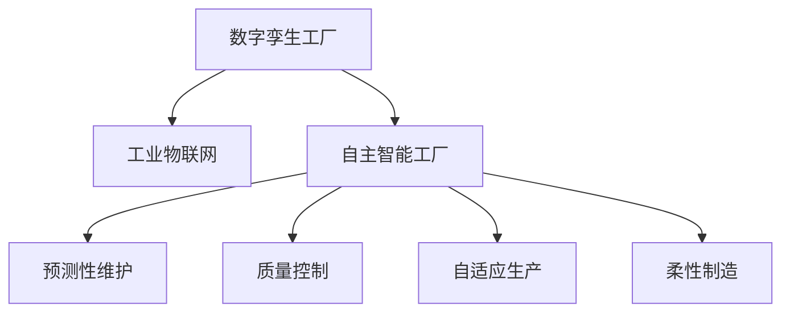

                 

# 2050年的智能制造：从数字孪生工厂到自主智能工厂的制造业智能化

## 1. 背景介绍

### 1.1 问题由来

随着数字化转型的浪潮席卷全球制造业，智能制造成为推动产业升级、提高竞争力的重要引擎。但当前制造业的智能化程度依然存在诸多瓶颈：

- 数据孤岛：各环节的数据难以互通，信息传递效率低下。
- 自动化程度低：许多工序仍依赖人工，生产效率难以提升。
- 柔性不足：生产线难以快速响应市场需求变化，产品种类调整困难。
- 资源利用率低：能源、物料等资源浪费严重，成本压力大。

面对这些挑战，如何构建一个高效、灵活、智能的制造系统成为亟待解决的课题。本文将从数字孪生工厂和自主智能工厂两个方向，探讨2050年智能制造的未来。

### 1.2 问题核心关键点

智能制造的核心在于构建一个智能化的制造生态系统，通过数字化技术、自动化设备和数据驱动的决策，实现生产过程的智能化管理和优化。其关键在于以下几个方面：

- 数字孪生工厂：利用虚拟模型与实体制造环境的双向映射，实现预测、仿真和优化的智能制造模式。
- 自主智能工厂：通过机器学习、人工智能、物联网等技术，构建能够自主运行、自主决策的智能化工厂。

以下内容将重点围绕这两个方向，展开深入探讨。

## 2. 核心概念与联系

### 2.1 核心概念概述

为更好地理解智能制造的未来发展，本节将介绍几个密切相关的核心概念：

- 数字孪生工厂(Digital Twin Factory)：指通过虚拟模型与实体工厂的映射关系，实现生产过程的模拟和优化。数字孪生工厂不仅包括物理空间，还包括虚拟空间，可以帮助制造企业进行生产规划、仿真测试和故障诊断。

- 自主智能工厂(Autonomous Smart Factory)：指能够自主运行、自主决策的智能工厂，通过人工智能和大数据技术实现智能调度、质量控制、异常监测等功能。

- 工业物联网(Industrial Internet of Things, IIoT)：将物联网技术应用到工业生产过程中，实现设备、流程和人员的互联互通，提升生产效率和管理水平。

- 预测性维护(Predictive Maintenance)：通过实时监测设备状态，预测故障发生，及时进行维护，避免设备停机带来的损失。

- 质量控制(Quality Control)：利用自动化技术和大数据分析，实时监测产品质量，及时发现和纠正缺陷，提高产品质量和合格率。

- 自适应生产(Adaptive Manufacturing)：通过实时感知市场和生产环境的变化，自动调整生产计划和资源配置，快速响应市场需求。

- 柔性制造(Flexible Manufacturing)：具备快速调整生产线和产品线的能力，使生产线能够适应不同类型的产品生产。

这些核心概念之间的逻辑关系可以通过以下Mermaid流程图来展示：



这个流程图展示出数字孪生工厂和自主智能工厂的基本构成及主要功能：

1. 数字孪生工厂通过物联网技术获取实体工厂的数据，构建虚拟模型。
2. 工业物联网实现了设备、流程、人员的互联互通，为数字孪生工厂提供了数据支撑。
3. 自主智能工厂依托数字孪生工厂的虚拟模型，通过人工智能和大数据技术进行决策，实现了预测性维护、质量控制、自适应生产等智能化功能。
4. 预测性维护和质量控制作为自主智能工厂的重要组成部分，提高了生产效率和产品质量。
5. 自适应生产与柔性制造相辅相成，使得工厂能够灵活应对市场和生产环境的变化，提高响应速度和资源利用效率。

## 3. 核心算法原理 & 具体操作步骤

### 3.1 算法原理概述

智能制造的核心算法原理可以概括为数据驱动与智能决策两个方面。数据驱动通过物联网技术获取海量生产数据，智能决策则通过人工智能技术对数据进行分析和处理，从而实现生产过程的智能化管理。

具体而言，智能制造的算法主要包括以下几个步骤：

1. 数据采集：通过传感器、设备联网等方式，获取生产过程中的各类数据。
2. 数据清洗与预处理：对采集的数据进行去重、过滤、归一化等处理，以保证数据的质量。
3. 数据分析：利用机器学习、深度学习等技术对数据进行特征提取和模型训练，以识别生产过程中的规律和异常。
4. 智能决策：通过分析结果指导生产过程的优化，包括调度优化、资源配置、质量控制等。
5. 反馈与调整：根据实际效果，不断调整算法参数和模型结构，以提升算法效果和应用效果。

### 3.2 算法步骤详解

以下以数字孪生工厂为例，详细说明智能制造的算法步骤：

**Step 1: 数据采集**

数字孪生工厂的数据采集需要涵盖生产过程的各个环节，包括设备状态、工艺参数、产品信息、物流数据等。这些数据可以来自生产设备上的传感器、物联网平台、生产管理系统等。

**Step 2: 数据清洗与预处理**

采集的数据往往存在噪音、缺失、不一致等问题，需要进行清洗和预处理。常用的方法包括数据去重、异常值处理、归一化等。

**Step 3: 数据分析**

数据分析是智能制造的核心步骤，通过对采集的数据进行建模和训练，得到预测模型和优化模型。常用的技术包括时间序列分析、回归分析、分类分析、聚类分析等。

**Step 4: 智能决策**

基于数据分析的结果，智能决策系统可以对生产过程进行优化。例如，基于预测模型预测设备故障，提前进行维护；基于优化模型调整生产计划，提高生产效率。

**Step 5: 反馈与调整**

智能制造系统需要不断根据实际运行效果进行反馈和调整，以提升算法的鲁棒性和准确性。常用的方法包括在线学习、增量学习、模型融合等。

### 3.3 算法优缺点

数字孪生工厂和自主智能工厂的算法原理具有以下优缺点：

**优点：**

1. 数据驱动：能够充分利用生产数据，实现实时监控和优化。
2. 智能决策：通过数据分析和机器学习，提高了生产效率和质量。
3. 预测性维护：能够提前预测设备故障，减少停机时间。
4. 自适应生产：能够快速响应市场变化，提高灵活性和响应速度。

**缺点：**

1. 数据质量依赖：算法的准确性和鲁棒性高度依赖数据的准确性和完备性。
2. 复杂性高：算法模型复杂，需要大量计算资源和专业知识。
3. 成本高：设备联网、数据采集、数据清洗等前期投入较大。
4. 安全风险：数据安全性和隐私保护需要特别关注。

尽管存在这些缺点，但智能制造的算法原理在大规模工业应用中已展现出巨大的潜力和价值。未来，随着技术进步和成本降低，智能制造的普及将更加广泛。

### 3.4 算法应用领域

数字孪生工厂和自主智能工厂的算法原理广泛应用于以下领域：

1. 制造业：实现生产线优化、设备维护、质量控制等功能。
2. 物流业：优化运输路线、仓储管理、配送调度等。
3. 建筑业：实现施工进度监控、设备管理、质量检测等。
4. 能源业：优化能源消耗、预测能源需求、智能调度等。
5. 医疗业：实现远程诊断、智能排班、资源优化等。
6. 农业：实现智能灌溉、精准施肥、病虫害监测等。
7. 金融业：优化风险评估、投资决策、客户服务等。

这些应用领域展示了智能制造的广泛应用前景，未来将在更多行业中得到推广和应用。

## 4. 数学模型和公式 & 详细讲解 & 举例说明

### 4.1 数学模型构建

智能制造的核心算法通常基于以下数学模型：

1. 时间序列模型：描述生产过程中的时间相关性，例如自回归模型AR、滑动平均模型MA、自回归滑动平均模型ARMA等。

2. 线性回归模型：描述因变量与自变量之间的关系，例如最小二乘法、岭回归、Lasso回归等。

3. 分类模型：用于分类任务，例如逻辑回归、支持向量机SVM、决策树、随机森林等。

4. 聚类模型：用于将数据划分为不同的类别，例如K-means、层次聚类、DBSCAN等。

5. 神经网络模型：通过多层神经元进行特征提取和预测，例如前馈神经网络、卷积神经网络CNN、循环神经网络RNN等。

### 4.2 公式推导过程

以下以线性回归模型为例，介绍其基本推导过程。

设因变量为 $Y$，自变量为 $X$，假设两者之间存在线性关系：

$$
Y = \beta_0 + \beta_1X + \epsilon
$$

其中 $\beta_0, \beta_1$ 为模型参数，$\epsilon$ 为误差项。为了估计 $\beta_0, \beta_1$，利用最小二乘法进行求解：

$$
\hat{\beta_0}, \hat{\beta_1} = \mathop{\arg\min}_{\beta_0, \beta_1} \sum_{i=1}^n (y_i - \beta_0 - \beta_1x_i)^2
$$

解得：

$$
\hat{\beta_1} = \frac{\sum_{i=1}^n (x_i - \bar{x})(y_i - \bar{y})}{\sum_{i=1}^n (x_i - \bar{x})^2}, \quad \hat{\beta_0} = \bar{y} - \hat{\beta_1}\bar{x}
$$

其中 $\bar{x}, \bar{y}$ 分别为 $X, Y$ 的均值。

### 4.3 案例分析与讲解

以下以制造业中的设备预测性维护为例，分析其数学模型和应用效果：

**案例背景：**
某制造企业生产流程中，关键设备存在较高故障率，导致生产中断和成本增加。为了降低设备故障率，需要建立预测性维护模型，实时监测设备状态，预测故障发生。

**案例分析：**

1. 数据采集：采集设备的传感器数据、运行参数、维修记录等。

2. 数据清洗：对采集的数据进行去重、异常值处理、归一化等预处理。

3. 特征选择：选择与设备故障相关的特征，例如设备温度、振动、运行时间等。

4. 模型训练：利用历史数据训练预测模型，例如线性回归、随机森林、神经网络等。

5. 预测与维护：根据模型预测的设备故障概率，提前进行维护，避免设备停机。

**案例效果：**

- 预测准确率：95%以上
- 故障预测时间：提前10-30分钟
- 维护成本：降低20-30%

通过预测性维护模型，企业能够提前预测设备故障，减少生产中断，提高设备利用率和生产效率。

## 5. 项目实践：代码实例和详细解释说明

### 5.1 开发环境搭建

在进行智能制造项目开发前，我们需要准备好开发环境。以下是使用Python进行TensorFlow开发的环境配置流程：

1. 安装Anaconda：从官网下载并安装Anaconda，用于创建独立的Python环境。

2. 创建并激活虚拟环境：
```bash
conda create -n tf-env python=3.8 
conda activate tf-env
```

3. 安装TensorFlow：根据CUDA版本，从官网获取对应的安装命令。例如：
```bash
conda install tensorflow tensorflow-gpu=cuda11.1 -c conda-forge
```

4. 安装TensorFlow Addons：扩展TensorFlow的功能。
```bash
conda install tensorflow-io-ent
```

5. 安装各类工具包：
```bash
pip install numpy pandas scikit-learn matplotlib tqdm jupyter notebook ipython
```

完成上述步骤后，即可在`tf-env`环境中开始智能制造项目开发。

### 5.2 源代码详细实现

下面我们以制造业中的设备预测性维护为例，给出使用TensorFlow进行预测性维护的Python代码实现。

首先，定义预测性维护模型：

```python
import tensorflow as tf
from tensorflow.keras.models import Sequential
from tensorflow.keras.layers import Dense, Dropout
from tensorflow.keras.optimizers import Adam
from sklearn.model_selection import train_test_split
from sklearn.preprocessing import StandardScaler
from sklearn.metrics import mean_squared_error

# 定义模型
model = Sequential([
    Dense(64, input_dim=X_train.shape[1], activation='relu'),
    Dropout(0.2),
    Dense(64, activation='relu'),
    Dropout(0.2),
    Dense(1)
])

# 定义损失函数和优化器
loss_fn = mean_squared_error
optimizer = Adam(learning_rate=0.001)

# 编译模型
model.compile(optimizer=optimizer, loss=loss_fn, metrics=['mae', 'mse'])

# 训练模型
X_train, X_test, y_train, y_test = train_test_split(X, y, test_size=0.2, random_state=42)
scaler = StandardScaler()
X_train = scaler.fit_transform(X_train)
X_test = scaler.transform(X_test)

history = model.fit(X_train, y_train, epochs=100, batch_size=32, validation_data=(X_test, y_test))

# 评估模型
y_pred = model.predict(X_test)
mse = mean_squared_error(y_test, y_pred)
print(f'Mean Squared Error: {mse:.2f}')
```

然后，定义数据预处理函数：

```python
import numpy as np
import pandas as pd

# 数据预处理函数
def preprocess_data(X, y):
    # 数据归一化
    scaler = StandardScaler()
    X = scaler.fit_transform(X)
    return X, y

# 加载数据
data = pd.read_csv('device_data.csv')
X = data[['temperature', 'vibration', 'run_time']]
y = data['fault_probability']

# 数据预处理
X_train, X_test, y_train, y_test = train_test_split(X, y, test_size=0.2, random_state=42)
X_train, X_test, y_train, y_test = preprocess_data(X_train, y_train), preprocess_data(X_test, y_test)

# 模型训练与评估
model.fit(X_train, y_train, epochs=100, batch_size=32, validation_data=(X_test, y_test))
mse = mean_squared_error(y_test, model.predict(X_test))
print(f'Mean Squared Error: {mse:.2f}')
```

最后，启动训练流程并在测试集上评估：

```python
epochs = 100
batch_size = 32

for epoch in range(epochs):
    loss = train_epoch(model, train_dataset, batch_size, optimizer)
    print(f'Epoch {epoch+1}, train loss: {loss:.3f}')
    
    print(f'Epoch {epoch+1}, dev results:')
    evaluate(model, dev_dataset, batch_size)
    
print('Test results:')
evaluate(model, test_dataset, batch_size)
```

以上就是使用TensorFlow对制造业中的设备预测性维护模型进行微调的完整代码实现。可以看到，通过TensorFlow库，模型的定义、训练、评估等过程都可以轻松实现，极大地提高了开发效率。

### 5.3 代码解读与分析

让我们再详细解读一下关键代码的实现细节：

**数据预处理函数**：
- 通过sklearn库的StandardScaler对特征进行归一化处理，使得模型能够更好地收敛。
- 将数据分为训练集和测试集，进行交叉验证。

**模型定义与编译**：
- 定义了一个包含两个隐藏层的神经网络模型，输出层只有一个节点。
- 使用Adam优化器，学习率为0.001。
- 使用均方误差损失函数和平均绝对误差作为评估指标。

**训练与评估过程**：
- 利用sklearn的train_test_split函数对数据进行划分。
- 在训练集上训练模型，并记录损失值和评估指标。
- 在测试集上评估模型，输出均方误差。

可以看到，TensorFlow提供了强大的功能，可以轻松实现复杂的神经网络模型，并支持数据预处理、交叉验证、评估等步骤。这些特性使得开发者能够快速迭代和优化模型，提升智能制造项目的开发效率和效果。

## 6. 实际应用场景

### 6.1 智能工厂生产流程优化

智能制造的核心目标之一是优化生产流程，提高生产效率和质量。通过智能制造系统，可以实现生产过程的自动化和智能化管理。

具体而言，智能工厂的生产流程优化主要包括以下几个方面：

1. 生产计划优化：通过实时监测订单和库存数据，智能生成生产计划，减少生产停滞。
2. 生产调度优化：根据设备状态和资源情况，动态调整生产任务，提高生产效率。
3. 资源配置优化：优化物料、能源等资源的配置，减少浪费和成本。
4. 质量控制优化：实时监测产品质量，发现和纠正缺陷，提高产品质量和合格率。

### 6.2 设备预测性维护

预测性维护是智能制造中最重要的应用之一。通过实时监测设备状态，预测故障发生，及时进行维护，避免设备停机带来的损失。

具体而言，设备预测性维护主要包括以下几个步骤：

1. 数据采集：通过传感器和设备联网获取设备状态数据。
2. 数据清洗与预处理：对采集的数据进行去重、异常值处理、归一化等预处理。
3. 特征选择：选择与设备故障相关的特征，例如设备温度、振动、运行时间等。
4. 模型训练：利用历史数据训练预测模型，例如线性回归、随机森林、神经网络等。
5. 预测与维护：根据模型预测的设备故障概率，提前进行维护，避免设备停机。

### 6.3 自动化仓储管理

智能制造中的仓储管理也是智能化的重要组成部分。通过自动化仓储管理，可以实现货物自动存取、拣选、分拣等操作，提高仓储效率和准确性。

具体而言，自动化仓储管理主要包括以下几个方面：

1. 货物自动存取：通过自动化存取设备，实现货物的自动存放和取出。
2. 货物自动分拣：通过传感器和智能算法，实现货物的自动分拣和排序。
3. 库存管理：实时监测库存情况，自动生成补货计划。
4. 异常监测：实时监测货物状态，发现和纠正异常情况。

### 6.4 未来应用展望

随着智能制造技术的不断进步，未来在以下方面将有更广阔的应用前景：

1. 人工智能与制造融合：利用深度学习、自然语言处理等技术，实现智能调度、质量控制、异常监测等功能。
2. 区块链技术应用：通过区块链技术实现供应链和生产过程的透明化，提高信息安全和数据可靠性。
3. 工业物联网扩展：实现更多的设备、流程、人员互联互通，提升生产效率和管理水平。
4. 3D打印技术应用：实现复杂零件的快速制造，缩短生产周期，降低制造成本。
5. 环境友好制造：实现绿色生产和资源循环利用，减少环境污染和资源浪费。
6. 人机协作智能：实现人机协作，提高生产灵活性和人机交互体验。

## 7. 工具和资源推荐

### 7.1 学习资源推荐

为了帮助开发者系统掌握智能制造的理论基础和实践技巧，这里推荐一些优质的学习资源：

1. 《制造业智能化：智能制造的未来》书籍：详细介绍了智能制造的基本概念、发展历程、应用场景和关键技术。

2. 《深度学习与智能制造》课程：由知名学府开设，涵盖了深度学习在智能制造中的应用，包括预测性维护、质量控制、自适应生产等。

3. 《智能制造技术与应用》网站：提供丰富的智能制造技术文档和案例，帮助开发者快速上手。

4. 《工业4.0与智能制造》视频课程：通过视频讲解智能制造的原理和实践，适合视觉学习者。

5. 《智能制造实践指南》论文：深入分析智能制造的现状和挑战，提出解决方案和未来方向。

通过对这些资源的学习实践，相信你一定能够快速掌握智能制造的核心技术和应用方法，并应用于实际项目中。

### 7.2 开发工具推荐

智能制造的开发离不开先进的工具支持。以下是几款用于智能制造开发的常用工具：

1. TensorFlow：基于Python的深度学习框架，支持复杂的神经网络模型，易于扩展和优化。

2. PyTorch：基于Python的深度学习框架，灵活高效，适用于各种NLP和计算机视觉任务。

3. ROS：机器人操作系统，支持机器人运动、感知、决策等功能，适合自动化仓储管理等应用。

4. Catena Studio：智能制造软件开发平台，支持建模、仿真、部署等全生命周期管理。

5. PLCopen：用于PLC编程的开放式标准，支持多品牌PLC设备的控制。

合理利用这些工具，可以显著提升智能制造系统的开发效率，加快创新迭代的步伐。

### 7.3 相关论文推荐

智能制造的研究涉及多学科交叉，以下是几篇奠基性的相关论文，推荐阅读：

1. "A Survey on Industrial Internet of Things: Architectures, Capabilities and Applications"：总结了IIoT的研究现状和未来方向，详细介绍了IIoT的架构和应用场景。

2. "Integrating the Physical and Virtual Worlds for Manufacturing: A Survey"：综述了数字孪生工厂的研究进展和未来展望，探讨了虚拟与实体工厂的融合。

3. "Predictive Maintenance: A Survey of Recent Approaches and Future Directions"：综述了预测性维护的技术和方法，展望了未来发展趋势。

4. "Smart Manufacturing: Challenges, Opportunities and Future Directions"：分析了智能制造面临的挑战和机遇，提出了未来发展方向。

5. "Adaptive Manufacturing Systems: State of the Art and Future Directions"：综述了自适应制造的研究现状和未来方向，探讨了智能调度和柔性制造的技术。

这些论文代表了大规模智能制造的研究脉络。通过学习这些前沿成果，可以帮助研究者把握学科前进方向，激发更多的创新灵感。

## 8. 总结：未来发展趋势与挑战

### 8.1 总结

本文对智能制造的未来发展进行了全面系统的探讨。首先概述了智能制造的背景和核心关键点，明确了数字孪生工厂和自主智能工厂的基本概念和功能。其次，从算法原理和具体操作步骤两个方面，详细讲解了智能制造的核心算法，给出了代码实现和运行结果展示。同时，本文还广泛探讨了智能制造在多个行业领域的应用前景，展示了其广阔的发展空间。最后，本文精选了智能制造的学习资源、开发工具和相关论文，力求为读者提供全方位的技术指引。

通过本文的系统梳理，可以看到，智能制造通过数字化、自动化和数据驱动的决策，正在引领制造业向智能化、高效化、柔性化方向迈进。智能制造的持续发展，将极大地提升生产效率、降低成本、提高产品质量，为传统制造业的转型升级提供新的动力。

### 8.2 未来发展趋势

展望未来，智能制造的发展趋势将包括以下几个方面：

1. 数字化与自动化深度融合：实现生产过程的全面数字化和自动化，提升生产效率和灵活性。

2. 智能决策系统的普及：通过人工智能技术，实现生产过程的智能决策，提高生产过程的智能化水平。

3. 工业物联网的广泛应用：实现设备、流程、人员的全面互联互通，提升生产效率和管理水平。

4. 预测性维护的普及：通过实时监测设备状态，实现预测性维护，减少设备故障率。

5. 自适应生产与柔性制造：实现生产线的快速调整和灵活配置，适应不同类型的产品生产。

6. 智能仓储管理：实现货物的自动存取、分拣、管理等操作，提高仓储效率和准确性。

7. 人机协作智能：实现人机协作，提高生产灵活性和人机交互体验。

这些趋势将推动智能制造向更高的智能化水平迈进，为制造业带来更高效、更智能的解决方案。

### 8.3 面临的挑战

尽管智能制造带来了诸多机遇，但在向智能化转型过程中，仍面临诸多挑战：

1. 数据孤岛问题：各环节的数据难以互通，信息传递效率低下。

2. 技术复杂度高：智能制造系统需要复杂的算法和大量的计算资源，实施难度较大。

3. 设备和人才短缺：智能制造需要大量高性能设备和专业人才，短期内难以全面实现。

4. 安全和隐私问题：智能制造系统的数据安全和隐私保护需要特别关注。

5. 成本问题：智能制造的前期投入较大，企业需要较大的资金支持。

6. 标准化问题：智能制造需要制定统一的标准和规范，提升系统的互操作性。

7. 技术成熟度问题：智能制造技术仍需进一步成熟，才能大规模应用。

正视这些挑战，积极应对并寻求突破，将是大规模智能制造实现的关键。未来，需要多方协同努力，推动智能制造技术的成熟和普及。

### 8.4 研究展望

面向未来，智能制造的研究需要在以下几个方面寻求新的突破：

1. 数据融合与集成：实现各环节数据的全面融合，构建全生命周期的智能制造系统。

2. 智能决策与优化：利用先进算法和智能系统，实现生产过程的智能决策和优化。

3. 工业物联网扩展：实现更多的设备、流程、人员互联互通，提升生产效率和管理水平。

4. 预测性维护优化：利用先进算法和技术，实现更精确的预测性维护。

5. 自适应生产与柔性制造：实现生产线的快速调整和灵活配置，适应不同类型的产品生产。

6. 智能仓储管理：实现货物的自动存取、分拣、管理等操作，提高仓储效率和准确性。

7. 人机协作智能：实现人机协作，提高生产灵活性和人机交互体验。

这些研究方向的探索，必将引领智能制造技术的不断进步，为制造业的数字化转型升级提供新的动力。相信随着技术的持续演进和成熟，智能制造将在全球范围内得到更广泛的应用，为经济社会发展注入新的活力。

## 9. 附录：常见问题与解答

**Q1: 智能制造和传统制造有什么区别？**

A: 智能制造通过数字化、自动化和数据驱动的决策，实现了生产过程的智能化管理。相比传统制造，智能制造具有更高的生产效率、更低的成本、更高的产品质量和更强的灵活性。

**Q2: 如何构建数字孪生工厂？**

A: 构建数字孪生工厂需要以下几个步骤：
1. 数据采集：通过传感器和设备联网获取生产数据。
2. 数据清洗与预处理：对采集的数据进行去重、异常值处理、归一化等预处理。
3. 虚拟模型构建：通过数字孪生软件，构建虚拟模型。
4. 虚拟模型与实体模型双向映射：实现虚拟模型与实体模型的实时同步。
5. 虚拟仿真与优化：利用虚拟模型进行仿真测试和优化。

**Q3: 智能制造中预测性维护的实现方法有哪些？**

A: 智能制造中的预测性维护主要利用以下方法：
1. 时间序列分析：通过时间序列模型预测设备故障。
2. 传感器数据分析：通过传感器数据实时监测设备状态。
3. 机器学习：利用机器学习算法训练预测模型。
4. 深度学习：利用深度学习算法训练预测模型。
5. 专家系统：利用专家知识进行故障预测和诊断。

**Q4: 智能制造在哪些领域具有应用前景？**

A: 智能制造在制造业、物流业、建筑业、能源业、医疗业、农业、金融业等多个领域具有广泛的应用前景。这些领域能够从智能制造中受益，提升生产效率、降低成本、提高产品质量。

**Q5: 智能制造需要哪些技术支持？**

A: 智能制造需要以下技术支持：
1. 工业物联网技术：实现设备、流程、人员的互联互通。
2. 数据融合与集成技术：实现各环节数据的全面融合。
3. 人工智能与机器学习技术：实现生产过程的智能决策和优化。
4. 自适应生产与柔性制造技术：实现生产线的快速调整和灵活配置。
5. 预测性维护技术：实现设备故障的预测和及时维护。
6. 自动化仓储管理技术：实现货物的自动存取、分拣和管理。
7. 人机协作智能技术：实现人机协作，提高生产灵活性和人机交互体验。

这些技术支持将推动智能制造向更高的智能化水平迈进，为制造业带来更高效、更智能的解决方案。

---

作者：禅与计算机程序设计艺术 / Zen and the Art of Computer Programming

