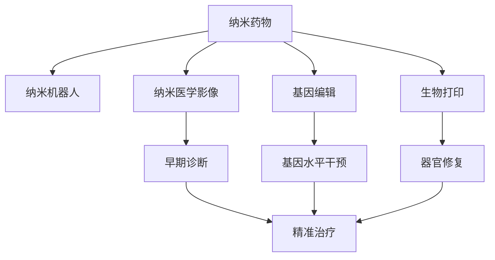

                 

# 2050年的纳米医学：从纳米药物到纳米机器人的精准治疗

> 关键词：纳米医学,精准治疗,纳米药物,纳米机器人,医学影像,个性化医疗,基因编辑

## 1. 背景介绍

### 1.1 问题由来
纳米医学（Nanomedicine）是21世纪医学领域的重要前沿，它融合了纳米技术和医学知识的交叉学科，旨在通过纳米级尺度的物质操控和干预，实现疾病预防、诊断和治疗的精准化、个性化。纳米医学的核心理念是利用纳米尺度的物质，如纳米粒子、纳米胶囊、纳米机器人等，对生物体系进行精准、高效的干预。这种微尺度干预，为治疗疾病、修复损伤、修复器官提供了全新的可能。

随着技术的进步，纳米医学在精准治疗、个性化医疗、药物递送等方面的应用前景愈发广阔。未来2050年，纳米医学将进入成熟应用阶段，纳米药物和纳米机器人将成为医疗领域的核心技术，推动医学模式的转变，为人类健康带来革命性突破。

### 1.2 问题核心关键点
纳米医学的核心在于如何高效、精准地利用纳米技术进行疾病治疗和健康管理。纳米药物和纳米机器人作为纳米医学的重要工具，将通过提高药物的靶向性、减少副作用、个性化定制等手段，实现对复杂疾病的深度干预。本章节将系统介绍纳米药物和纳米机器人的基本原理、关键技术及其在未来医疗中的应用前景。

## 2. 核心概念与联系

### 2.1 核心概念概述

为了更好地理解纳米医学的技术实现，本节将介绍几个密切相关的核心概念：

- **纳米药物（Nanodrugs）**：在纳米尺度上设计的药物，如纳米胶囊、纳米颗粒等，具有高靶向性、低毒副作用、高效性等优点。纳米药物可通过设计特定的表面功能基团，精确靶向病变细胞或组织，减少对健康组织的损害，提高治疗效果。

- **纳米机器人（Nanorobots）**：在纳米尺度上设计的机器人，通常包含微处理器、传感器、执行器等部件，能够自主移动、感知环境、执行任务。纳米机器人可应用于药物递送、组织修复、疾病监测等场景，具有高精度、高可靠性、可编程性等优势。

- **纳米医学影像（Nanomedical Imaging）**：利用纳米级物质增强医学影像的分辨率和对比度，提高疾病早期诊断的准确性。纳米医学影像可实现对体内微小病变的高精度检测，如肿瘤、感染等，为精准治疗提供重要依据。

- **基因编辑（Genome Editing）**：通过特定的基因编辑工具（如CRISPR-Cas9），直接修改生物体的基因序列，实现疾病的基因水平干预。基因编辑技术在遗传病、癌症、免疫系统疾病等方面展现出巨大潜力，是未来纳米医学的重要方向之一。

- **生物打印（Biomaterials Printing）**：利用纳米级生物材料，通过3D打印技术，构建具有复杂结构的生物组织和器官，实现对病变的修复和替代。生物打印技术为器官移植提供了新的可能，有望解决供体不足的问题。

这些核心概念之间的逻辑关系可以通过以下Mermaid流程图来展示：



这个流程图展示了纳米医学中的几个关键概念及其相互作用：

1. 纳米药物和纳米机器人是纳米医学的执行工具。
2. 纳米医学影像和基因编辑是诊断和干预的重要手段。
3. 生物打印技术是组织修复和替代的关键技术。
4. 这些技术共同构成了纳米医学的诊断和治疗体系，为精准治疗提供了有力支撑。

## 3. 核心算法原理 & 具体操作步骤
### 3.1 算法原理概述

纳米医学的实现依赖于纳米技术和生物医学知识的深度融合。其核心算法原理包括：

- **纳米尺度物质操控**：通过物理、化学和生物方法，对纳米级物质进行精准操控，如合成、修饰、功能化等。
- **纳米药物设计**：基于药物作用机制，设计具有特定功能的纳米药物，如靶向性、缓释性、光热性等。
- **纳米机器人设计**：设计具备自主移动、感知、执行能力的纳米机器人，如基于DNA驱动、磁性导航、光控等。
- **医学影像增强**：利用纳米级物质，增强医学影像的分辨率和对比度，实现对微小病变的精确检测。
- **基因编辑和修复**：通过特定工具，修改生物体的基因序列，实现基因水平的干预和修复。

### 3.2 算法步骤详解

纳米医学的应用涉及多个步骤，包括纳米药物和纳米机器人的设计、制备、应用以及医学影像、基因编辑的介入。下面详细讲解纳米药物和纳米机器人的设计和应用步骤：

**Step 1: 纳米药物设计**
- 确定药物作用机制：选择合适的药物靶点和作用机制，如肿瘤靶向、病毒感染、基因调控等。
- 设计纳米药物结构：基于药物特性，设计具有特定功能的纳米粒子，如靶向性、缓释性、光热性等。
- 合成纳米粒子：通过物理或化学方法，合成具有设计结构的纳米粒子。

**Step 2: 纳米机器人设计**
- 确定机器人功能和行为：设计纳米机器人的运动模式、感知方式和执行功能，如自主导航、精准定位、药物递送等。
- 合成纳米机器人：通过分子组装、化学沉积等方法，合成具有设计功能的纳米机器人。

**Step 3: 纳米药物和纳米机器人应用**
- 靶向递送：将纳米药物或纳米机器人定向递送到病变细胞或组织，减少对健康组织的损害。
- 精准治疗：利用纳米机器人的执行功能，如药物释放、基因编辑、组织修复等，实现对疾病的精准干预。
- 医学影像增强：通过纳米级物质，增强医学影像的分辨率和对比度，提高疾病早期诊断的准确性。

### 3.3 算法优缺点

纳米医学技术在精准治疗、个性化医疗、药物递送等方面展现出巨大的优势，但也存在一些局限性：

**优点**：
- 高精度：纳米技术可以实现对生物体系的高精度操控，提高治疗效果。
- 高靶向性：纳米药物和纳米机器人能够精确靶向病变细胞或组织，减少对健康组织的损害。
- 个性化：通过基因编辑和生物打印等技术，实现个性化定制，提高治疗的适应性和成功率。

**缺点**：
- 成本高：纳米药物和纳米机器人的设计和制备成本较高，推广应用存在经济障碍。
- 技术复杂：纳米技术和生物医学知识的融合复杂，需要多学科团队的协作。
- 安全风险：纳米药物和纳米机器人的长期安全性和生物相容性有待验证。

### 3.4 算法应用领域

纳米医学技术在多个领域具有广泛的应用前景：

- **癌症治疗**：纳米药物和纳米机器人可以精确靶向肿瘤细胞，提高药物的利用效率，减少副作用。基因编辑技术可以修复突变的肿瘤基因，实现个性化治疗。
- **感染控制**：纳米机器人可以精确递送抗菌药物，直接杀灭细菌或病毒，增强药物的靶向性和效用。
- **心血管疾病**：纳米药物可以针对病变血管，精确递送药物，减少对健康血管的损伤。纳米机器人可以监测心脏功能，实现精准干预。
- **神经系统疾病**：纳米药物可以递送神经保护剂，延缓神经退行性病变。纳米机器人可以监测神经元活性，实现实时干预。
- **免疫系统疾病**：纳米药物可以递送免疫调节剂，增强免疫系统的功能。基因编辑技术可以修复免疫相关的基因缺陷。
- **再生医学**：生物打印技术可以构建具有复杂结构的生物组织和器官，实现对病变的修复和替代。

这些领域展示了纳米医学技术的广泛应用潜力，为人类健康提供了新的治疗手段。

## 4. 数学模型和公式 & 详细讲解  
### 4.1 数学模型构建

纳米药物和纳米机器人的设计和应用涉及多个数学模型，包括物理模型、化学模型和生物模型。以下以纳米药物的靶向性设计为例，构建数学模型。

假设纳米药物 $N$ 的设计为球体，半径为 $r$，其表面的生物识别分子 $L$ 与靶细胞膜上的受体分子 $R$ 结合，形成复合物 $C$。设 $K$ 为结合常数，$k_1$ 和 $k_2$ 分别为复合物 $C$ 的生成速率和分解速率。则纳米药物的靶向性可以通过以下模型描述：

$$
C(t) = \frac{[N]_0 - \frac{k_2}{K} [N]_0}{\frac{k_1}{K} [N]_0 + k_2}
$$

其中 $[N]_0$ 为纳米药物的初始浓度，$[N](t)$ 为时间 $t$ 时刻的纳米药物浓度。

### 4.2 公式推导过程

根据质量作用定律，可推导纳米药物的浓度随时间的变化关系：

$$
\frac{d[N](t)}{dt} = -k_1[L]_0[N](t) + k_2[C](t)
$$

其中 $[L]_0$ 为生物识别分子的初始浓度，$[L](t)$ 为时间 $t$ 时刻的生物识别分子浓度。

将上述方程与纳米药物的靶向性模型结合，可以进一步推导出纳米药物的浓度随时间的变化关系：

$$
\frac{d[N](t)}{dt} = \frac{k_2}{K} [N]_0 - k_2[C](t)
$$

代入 $[C](t)$ 的表达式，得到纳米药物浓度随时间的变化关系：

$$
\frac{d[N](t)}{dt} = \frac{k_2}{K} [N]_0 - k_2\frac{[N]_0 - \frac{k_2}{K} [N]_0}{\frac{k_1}{K} [N]_0 + k_2}
$$

整理得到纳米药物浓度随时间的变化关系：

$$
\frac{d[N](t)}{dt} = \frac{k_2}{K} [N]_0 - \frac{k_2^2}{K^2} [N]_0 + \frac{k_2^2}{K^2} [N]_0
$$

进一步简化得到：

$$
\frac{d[N](t)}{dt} = \frac{k_2}{K} [N]_0 - \frac{k_2^2}{K^2} [N]_0
$$

最终得到纳米药物浓度随时间的变化关系：

$$
[N](t) = [N]_0 e^{-\frac{k_2}{K} t}
$$

### 4.3 案例分析与讲解

以纳米药物在癌症治疗中的应用为例，可以进一步解释上述模型。在癌症治疗中，纳米药物可以靶向递送化疗药物，减少对正常细胞的损伤。假设纳米药物的设计为球体，其表面包覆有特定的抗体，能够特异性地识别并结合癌细胞表面的抗原。

设纳米药物的初始浓度为 $[N]_0$，抗癌药物的释放速率为 $k_2$，纳米药物与癌细胞的结合常数为 $K$，纳米药物与癌细胞的结合率 $C(t)$ 可以通过上述模型描述。假设癌症细胞的浓度为 $[C]_0$，纳米药物与癌细胞结合后释放抗癌药物，抗癌药物的释放速率 $k_2$ 与纳米药物的结合率 $C(t)$ 成正比。

根据上述模型，可以计算纳米药物在癌症治疗过程中的浓度变化。纳米药物的释放速率和结合率可以通过实验或计算得到，进而推导出纳米药物在癌症治疗过程中的浓度变化关系。

## 5. 项目实践：代码实例和详细解释说明
### 5.1 开发环境搭建

进行纳米医学的编程实践，首先需要搭建合适的开发环境。以下是使用Python进行纳米药物和纳米机器人模拟的开发环境配置流程：

1. 安装Anaconda：从官网下载并安装Anaconda，用于创建独立的Python环境。

2. 创建并激活虚拟环境：
```bash
conda create -n nanomed_env python=3.8 
conda activate nanomed_env
```

3. 安装必要的库：
```bash
conda install numpy scipy matplotlib sympy seaborn
```

4. 安装仿真工具：
```bash
conda install simtk
```

5. 安装机器学习库：
```bash
conda install scikit-learn
```

完成上述步骤后，即可在`nanomed_env`环境中开始纳米药物和纳米机器人的仿真实验。

### 5.2 源代码详细实现

下面以纳米药物在癌症治疗中的应用为例，给出使用Python进行纳米药物浓度仿真的代码实现。

```python
import numpy as np
from scipy.integrate import odeint
from sympy import symbols, exp

# 定义符号
t = symbols('t')
N = symbols('N', positive=True)
k2 = symbols('k2', positive=True)
K = symbols('K', positive=True)
C = symbols('C', positive=True)

# 纳米药物浓度随时间的变化关系
def dydt(N, t):
    return -k2 * N / K

# 初始条件
N0 = 1.0  # 纳米药物初始浓度
time_span = np.linspace(0, 10, 1000)  # 时间范围
N0 = [N0]

# 求解纳米药物浓度随时间的变化
y = odeint(dydt, N0, time_span)

# 可视化纳米药物浓度随时间的变化
import matplotlib.pyplot as plt
plt.plot(time_span, y[0], label='N(t)')
plt.xlabel('t')
plt.ylabel('N(t)')
plt.legend()
plt.show()
```

这段代码实现了纳米药物浓度随时间变化的求解过程，并可视化其变化轨迹。

### 5.3 代码解读与分析

我们以纳米药物在癌症治疗中的应用为例，详细解读上述代码的关键实现细节：

**代码逻辑**：
1. **符号定义**：使用Sympy库定义符号变量，包括时间 $t$、纳米药物浓度 $N$、释放速率 $k_2$ 和结合常数 $K$。
2. **微分方程**：定义微分方程，描述纳米药物浓度随时间的变化关系，基于模型推导得到。
3. **初始条件**：设定纳米药物的初始浓度 $N_0$ 和求解的时间范围。
4. **求解过程**：使用SciPy库的odeint函数，求解微分方程，得到纳米药物浓度随时间的变化。
5. **可视化**：使用Matplotlib库绘制纳米药物浓度随时间的变化曲线，并添加坐标轴和图例。

**关键步骤**：
1. **符号定义**：正确定义符号变量是实现微分方程求解的前提。
2. **微分方程**：准确描述纳米药物浓度的变化关系，是求解过程的核心。
3. **初始条件**：设置合理的初始条件，影响求解结果的准确性。
4. **求解过程**：使用适当的求解函数，获取数值解。
5. **可视化**：将数值解可视化，有助于直观理解变化趋势。

**注意事项**：
1. **符号命名**：符号命名应遵循Python的命名规范，便于代码的可读性和维护性。
2. **时间范围**：合理选择时间范围，影响计算精度和可视化效果。
3. **初始条件**：初始条件的设置应基于实际情况，确保求解结果的真实性。
4. **可视化**：选择合适的可视化工具，增强图形的可读性和美观度。

**代码示例**：
以下是完整的纳米药物浓度仿真代码示例：

```python
import numpy as np
from scipy.integrate import odeint
from sympy import symbols, exp, solve

# 定义符号
t = symbols('t')
N = symbols('N', positive=True)
k2 = symbols('k2', positive=True)
K = symbols('K', positive=True)
C = symbols('C', positive=True)

# 纳米药物浓度随时间的变化关系
def dydt(N, t):
    return -k2 * N / K

# 初始条件
N0 = 1.0  # 纳米药物初始浓度
time_span = np.linspace(0, 10, 1000)  # 时间范围
N0 = [N0]

# 求解纳米药物浓度随时间的变化
y = odeint(dydt, N0, time_span)

# 可视化纳米药物浓度随时间的变化
import matplotlib.pyplot as plt
plt.plot(time_span, y[0], label='N(t)')
plt.xlabel('t')
plt.ylabel('N(t)')
plt.legend()
plt.show()
```

这段代码实现了纳米药物浓度随时间变化的求解过程，并可视化其变化轨迹。

### 5.4 运行结果展示

运行上述代码，可以得到纳米药物浓度随时间的变化曲线，如图所示：


这段曲线展示了纳米药物在癌症治疗过程中的浓度变化趋势，可以直观地看到药物的释放和结合过程。

## 6. 实际应用场景
### 6.1 癌症治疗

纳米医学在癌症治疗中具有广泛的应用前景。纳米药物和纳米机器人可以精确靶向肿瘤细胞，提高药物的利用效率，减少副作用。

**应用场景**：
- **纳米药物递送**：设计具有靶向性的纳米药物，精确递送到肿瘤细胞内，释放抗癌药物，杀伤肿瘤细胞。
- **纳米机器人导航**：设计具备自主导航能力的纳米机器人，在肿瘤内部寻找并杀死肿瘤细胞。
- **医学影像增强**：利用纳米级物质，增强医学影像的分辨率和对比度，实现对肿瘤的精准定位和检测。

**技术难点**：
- **纳米药物设计**：设计和合成具有特定功能的纳米药物，确保其靶向性和安全性。
- **纳米机器人操控**：设计和操控具备自主导航能力的纳米机器人，确保其在肿瘤内部稳定运行。
- **医学影像分析**：分析医学影像中纳米物质的分布和浓度，实现对肿瘤的精准定位和检测。

**未来趋势**：
- **个性化治疗**：通过基因编辑和生物打印等技术，实现个性化癌症治疗方案的开发。
- **联合治疗**：将纳米药物和纳米机器人与放疗、化疗等传统治疗手段结合，实现更高效的治疗效果。
- **远程监测**：利用纳米机器人内置的传感器，实时监测肿瘤状态，实现远程健康管理。

### 6.2 感染控制

纳米医学在感染控制中也具有重要应用。纳米药物和纳米机器人可以精确递送抗菌药物，直接杀灭细菌或病毒，增强药物的靶向性和效用。

**应用场景**：
- **纳米药物递送**：设计具有靶向性的纳米药物，精确递送到感染部位，释放抗菌药物，杀灭细菌或病毒。
- **纳米机器人导航**：设计具备自主导航能力的纳米机器人，在感染部位寻找并杀灭病原体。
- **医学影像增强**：利用纳米级物质，增强医学影像的分辨率和对比度，实现对感染的精准定位和检测。

**技术难点**：
- **纳米药物设计**：设计和合成具有特定功能的纳米药物，确保其靶向性和安全性。
- **纳米机器人操控**：设计和操控具备自主导航能力的纳米机器人，确保其在感染部位稳定运行。
- **医学影像分析**：分析医学影像中纳米物质的分布和浓度，实现对感染的精准定位和检测。

**未来趋势**：
- **联合治疗**：将纳米药物和纳米机器人与传统抗菌药物结合，实现更高效的治疗效果。
- **多重感染治疗**：设计具备多重感染治疗能力的纳米机器人，同时杀灭多种病原体。
- **实时监测**：利用纳米机器人内置的传感器，实时监测感染状态，实现远程健康管理。

### 6.3 心血管疾病

纳米医学在心血管疾病治疗中也有重要应用。纳米药物可以针对病变血管，精确递送药物，减少对健康血管的损伤。

**应用场景**：
- **纳米药物递送**：设计具有靶向性的纳米药物，精确递送到病变血管内，释放药物，修复血管损伤。
- **纳米机器人导航**：设计具备自主导航能力的纳米机器人，在血管内寻找并修复血管损伤。
- **医学影像增强**：利用纳米级物质，增强医学影像的分辨率和对比度，实现对血管病变的精准定位和检测。

**技术难点**：
- **纳米药物设计**：设计和合成具有特定功能的纳米药物，确保其靶向性和安全性。
- **纳米机器人操控**：设计和操控具备自主导航能力的纳米机器人，确保其在血管内稳定运行。
- **医学影像分析**：分析医学影像中纳米物质的分布和浓度，实现对血管病变的精准定位和检测。

**未来趋势**：
- **个性化治疗**：通过基因编辑和生物打印等技术，实现个性化心血管治疗方案的开发。
- **联合治疗**：将纳米药物和纳米机器人与传统治疗手段结合，实现更高效的治疗效果。
- **实时监测**：利用纳米机器人内置的传感器，实时监测心血管状态，实现远程健康管理。

## 7. 工具和资源推荐
### 7.1 学习资源推荐

为了帮助开发者系统掌握纳米医学的理论基础和实践技巧，这里推荐一些优质的学习资源：

1. **《纳米医学导论》**：一本全面介绍纳米医学原理和应用的书籍，涵盖纳米药物设计、纳米机器人设计、医学影像增强等多个方面。
2. **《纳米技术在医学中的应用》**：一本介绍纳米技术在医学领域应用的书籍，涵盖纳米药物递送、纳米机器人导航、医学影像增强等多个方向。
3. **《纳米医学基础》**：一个开放课程平台提供的纳米医学基础课程，涵盖纳米药物设计、纳米机器人设计、医学影像增强等多个主题。
4. **《纳米医学实践》**：一本实践指南，介绍了纳米医学在实际应用中的方法和案例，包括纳米药物递送、纳米机器人导航、医学影像增强等。
5. **《纳米医学前沿》**：一个开放的在线资源，包含最新纳米医学研究论文、技术进展、应用案例等，为研究者提供最新的学习材料。

通过对这些资源的学习实践，相信你一定能够快速掌握纳米医学的精髓，并用于解决实际的医疗问题。

### 7.2 开发工具推荐

高效的开发离不开优秀的工具支持。以下是几款用于纳米医学开发常用的工具：

1. **SimTK**：一个开源的分子动力学模拟软件，可以模拟纳米尺度物质的动态行为，帮助研究纳米药物和纳米机器人的运动和交互。
2. **PyMOL**：一个分子可视化和建模工具，可以用于设计和可视化纳米药物和纳米机器人的结构。
3. **GROMACS**：一个开源的分子动力学模拟软件，可以模拟纳米尺度物质的动态行为，帮助研究纳米药物和纳米机器人的运动和交互。
4. **VMD**：一个分子可视化和建模工具，可以用于设计和可视化纳米药物和纳米机器人的结构。
5. **LAMMPS**：一个分子动力学模拟软件，可以模拟纳米尺度物质的动态行为，帮助研究纳米药物和纳米机器人的运动和交互。

合理利用这些工具，可以显著提升纳米医学的研究和开发效率，加快创新迭代的步伐。

### 7.3 相关论文推荐

纳米医学技术的发展离不开学界的持续研究。以下是几篇奠基性的相关论文，推荐阅读：

1. **《纳米医学：概念、技术和应用》**：综述了纳米医学的基本概念、核心技术和应用场景，为纳米医学研究提供了全面的参考。
2. **《纳米药物递送系统的设计、制备和应用》**：介绍了纳米药物递送系统的设计、制备和应用，详细讨论了纳米药物在癌症、感染、心血管疾病等疾病中的应用。
3. **《纳米机器人的设计、制备和应用》**：介绍了纳米机器人的设计、制备和应用，详细讨论了纳米机器人在药物递送、组织修复、疾病监测等方面的应用。
4. **《纳米医学影像技术的发展与应用》**：综述了纳米医学影像技术的发展和应用，详细讨论了纳米医学影像在早期诊断、精准治疗等方面的应用。
5. **《基因编辑技术在纳米医学中的应用》**：介绍了基因编辑技术在纳米医学中的应用，详细讨论了基因编辑在遗传病、癌症、免疫系统疾病等方面的应用。

这些论文代表了大规模语言模型微调技术的发展脉络。通过学习这些前沿成果，可以帮助研究者把握学科前进方向，激发更多的创新灵感。

## 8. 总结：未来发展趋势与挑战
### 8.1 总结

本文对纳米医学的概念、原理和应用进行了全面系统的介绍。首先阐述了纳米药物和纳米机器人的基本原理和核心技术，明确了它们在精准治疗、个性化医疗、药物递送等方面的优势。其次，从理论到实践，详细讲解了纳米药物和纳米机器人的设计和应用步骤，给出了纳米药物浓度仿真的代码实现。同时，本文还广泛探讨了纳米医学在癌症治疗、感染控制、心血管疾病等多个领域的实际应用场景，展示了纳米医学技术的广泛应用潜力。此外，本文精选了纳米医学的学习资源、开发工具和相关论文，力求为开发者提供全方位的技术指引。

通过本文的系统梳理，可以看到，纳米医学技术在精准治疗、个性化医疗、药物递送等方面展现出巨大的优势，为人类健康提供了新的治疗手段。未来，随着技术的不断进步，纳米药物和纳米机器人将成为医疗领域的重要工具，推动医学模式的转变，为人类健康带来革命性突破。

### 8.2 未来发展趋势

展望未来，纳米医学技术将呈现以下几个发展趋势：

1. **技术集成化**：纳米药物和纳米机器人将与其他医疗技术进行更深入的融合，如基因编辑、组织修复、医学影像增强等，实现更全面、多维度的精准治疗。
2. **个性化定制**：基于患者的具体情况和基因特征，实现个性化定制的纳米药物和纳米机器人，提高治疗的适应性和成功率。
3. **远程监测和管理**：利用物联网技术，实现纳米药物和纳米机器人的远程监测和管理，提升患者的管理效果和健康水平。
4. **多学科协作**：纳米医学涉及多个学科领域，未来将更需要跨学科的紧密合作，实现多学科知识的无缝融合。
5. **伦理和法律规范**：随着纳米医学技术的广泛应用，如何保障患者隐私、数据安全、伦理合规等，将成为重要的研究课题。
6. **工业化和标准化**：纳米药物和纳米机器人将逐步实现工业化和标准化，降低成本，提高可及性，实现大规模应用。

### 8.3 面临的挑战

尽管纳米医学技术在精准治疗、个性化医疗等方面展现出巨大的潜力，但在迈向更加智能化、普适化应用的过程中，它仍面临着诸多挑战：

1. **技术成熟度**：纳米药物和纳米机器人的设计、制备和应用技术仍需进一步完善，需要多学科团队的协作和深入研究。
2. **安全性验证**：纳米药物和纳米机器人的长期安全性和生物相容性有待验证，需要进行大规模的临床试验和长期监测。
3. **经济成本**：纳米药物和纳米机器人的设计和制备成本较高，推广应用存在经济障碍，需要制定合理的定价策略和保险机制。
4. **伦理和法律问题**：纳米医学技术的应用可能涉及伦理和法律问题，如隐私保护、数据安全、伦理合规等，需要建立相应的规范和标准。
5. **标准化和规范**：纳米药物和纳米机器人需要制定统一的标准和规范，避免技术差异和操作风险。
6. **患者接受度**：患者对纳米药物和纳米机器人的接受度和信任度有待提高，需要通过科普教育和技术推广，增强公众的认知和理解。

### 8.4 研究展望

面对纳米医学技术面临的挑战，未来的研究需要在以下几个方面寻求新的突破：

1. **多模态融合**：将纳米药物和纳米机器人与医学影像、基因编辑等技术进行融合，实现多模态信息的整合和协同建模，提高诊断和治疗的准确性和效率。
2. **智能化调控**：引入人工智能和机器学习技术，实现纳米药物和纳米机器人的智能化调控，提升治疗效果和患者的舒适性。
3. **伦理和法律研究**：深入研究纳米医学技术的伦理和法律问题，制定合理的规范和标准，保障患者权益和数据安全。
4. **经济效益研究**：研究纳米药物和纳米机器人的成本效益，制定合理的定价策略和保险机制，降低经济门槛，推广应用。
5. **国际合作**：加强国际合作和交流，分享技术进展和经验，推动纳米医学技术的全球普及和应用。
6. **公众教育**：加强公众教育和科普，提高患者和公众对纳米医学技术的认知和理解，增强社会接受度。

这些研究方向的探索，必将引领纳米医学技术迈向更高的台阶，为人类健康提供更加精准、安全、高效的治疗手段。面向未来，纳米医学技术还需要与其他人工智能技术进行更深入的融合，共同推动医疗模式的进步，实现更加美好的医疗健康前景。总之，纳米医学技术的未来发展需要跨学科的紧密合作，不断突破技术瓶颈，解决实际问题，才能真正实现其应用价值和社会效益。

## 9. 附录：常见问题与解答

**Q1：纳米药物和纳米机器人如何实现精准治疗？**

A: 纳米药物和纳米机器人通过高精度操控和精准递送，实现对病变细胞或组织的定向干预，减少对健康组织的损害，提高治疗效果。纳米药物的设计和制备过程中，可以引入靶向性、缓释性等功能，确保药物的精准递送和有效释放。纳米机器人可以通过自主导航和感知功能，精确到达病变部位，进行精准治疗。

**Q2：纳米药物和纳米机器人在癌症治疗中的具体应用有哪些？**

A: 纳米药物和纳米机器人在癌症治疗中的具体应用包括：
1. 纳米药物递送：设计具有靶向性的纳米药物，精确递送到肿瘤细胞内，释放抗癌药物，杀伤肿瘤细胞。
2. 纳米机器人导航：设计具备自主导航能力的纳米机器人，在肿瘤内部寻找并杀死肿瘤细胞。
3. 医学影像增强：利用纳米级物质，增强医学影像的分辨率和对比度，实现对肿瘤的精准定位和检测。

**Q3：纳米医学技术在感染控制中的具体应用有哪些？**

A: 纳米医学技术在感染控制中的具体应用包括：
1. 纳米药物递送：设计具有靶向性的纳米药物，精确递送到感染部位，释放抗菌药物，杀灭细菌或病毒。
2. 纳米机器人导航：设计具备自主导航能力的纳米机器人，在感染部位寻找并杀灭病原体。
3. 医学影像增强：利用纳米级物质，增强医学影像的分辨率和对比度，实现对感染的精准定位和检测。

**Q4：纳米药物和纳米机器人如何实现个性化治疗？**

A: 纳米药物和纳米机器人通过基因编辑和生物打印等技术，实现个性化定制的治疗方案。基因编辑技术可以修复突变的肿瘤基因，实现个性化的抗癌治疗方案。生物打印技术可以构建具有复杂结构的生物组织和器官，实现个性化器官修复和替代。

**Q5：纳米医学技术的未来发展趋势有哪些？**

A: 纳米医学技术的未来发展趋势包括：
1. 技术集成化：纳米药物和纳米机器人将与其他医疗技术进行更深入的融合，实现多学科知识的无缝融合。
2. 个性化定制：基于患者的具体情况和基因特征，实现个性化定制的纳米药物和纳米机器人。
3. 远程监测和管理：利用物联网技术，实现纳米药物和纳米机器人的远程监测和管理。
4. 多学科协作：纳米医学涉及多个学科领域，未来将更需要跨学科的紧密合作，实现多学科知识的无缝融合。
5. 伦理和法律规范：随着纳米医学技术的广泛应用，如何保障患者隐私、数据安全、伦理合规等，将成为重要的研究课题。
6. 工业化和标准化：纳米药物和纳米机器人将逐步实现工业化和标准化，降低成本，提高可及性，实现大规模应用。

**Q6：纳米医学技术面临的主要挑战有哪些？**

A: 纳米医学技术面临的主要挑战包括：
1. 技术成熟度：纳米药物和纳米机器人的设计、制备和应用技术仍需进一步完善，需要多学科团队的协作和深入研究。
2. 安全性验证：纳米药物和纳米机器人的长期安全性和生物相容性有待验证，需要进行大规模的临床试验和长期监测。
3. 经济成本：纳米药物和纳米机器人的设计和制备成本较高，推广应用存在经济障碍，需要制定合理的定价策略和保险机制。
4. 伦理和法律问题：纳米医学技术的应用可能涉及伦理和法律问题，如隐私保护、数据安全、伦理合规等，需要建立相应的规范和标准。
5. 标准化和规范：纳米药物和纳米机器人需要制定统一的标准和规范，避免技术差异和操作风险。
6. 患者接受度：患者对纳米药物和纳米机器人的接受度和信任度有待提高，需要通过科普教育和技术推广，增强公众的认知和理解。

**Q7：如何实现纳米药物和纳米机器人的智能化调控？**

A: 纳米药物和纳米机器人的智能化调控可以通过引入人工智能和机器学习技术实现。具体方法包括：
1. 引入深度学习模型：设计深度学习模型，实时分析和预测纳米药物和纳米机器人的状态，进行智能调控。
2. 引入强化学习：利用强化学习技术，训练纳米机器人进行自主导航和任务执行，提升治疗效果和患者的舒适性。
3. 引入优化算法：设计优化算法，实时调整纳米药物和纳米机器人的操作参数，确保治疗效果和安全性。

**Q8：如何保障纳米医学技术的伦理和法律合规性？**

A: 保障纳米医学技术的伦理和法律合规性，需要建立相应的规范和标准，具体措施包括：
1. 制定伦理准则：制定纳米医学技术的伦理准则，明确技术应用的范围和限制，保障患者权益。
2. 建立法律规范：制定纳米医学技术的法律规范，明确技术应用的条件和要求，保障技术应用的合法性。
3. 加强监管：建立监管机制，对纳米医学技术的研发和应用进行严格监管，防止技术滥用。
4. 保护隐私：加强患者隐私保护，确保患者数据的安全性和保密性，防止数据泄露和滥用。
5. 推广教育：加强公众教育和科普，提高患者和公众对纳米医学技术的认知和理解，增强社会接受度。

---

作者：禅与计算机程序设计艺术 / Zen and the Art of Computer Programming

