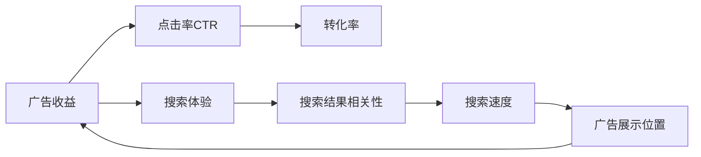

                 

## 1. 背景介绍

随着互联网的飞速发展，搜索引擎和在线广告已经成为现代信息获取的重要渠道。然而，广告收益与用户体验之间的矛盾也愈发凸显。为了优化搜索体验，通常需要牺牲一定的广告收益。本文将深入探讨这一问题，并提出一种算法优化方案，以在广告收益与用户体验之间找到平衡。

## 2. 核心概念与联系

### 2.1 核心概念概述

- **广告收益**：通过在线广告获取的收入，包括点击率（CTR）、转化率等。
- **搜索体验**：用户在搜索过程中的满意度和便利性，包括搜索结果的相关性、速度和准确性。
- **算法优化**：通过数据分析和模型训练，优化广告展示和搜索体验，提高广告收益。

### 2.2 核心概念原理和架构的 Mermaid 流程图



### 2.3 核心概念之间的联系

广告收益与搜索体验之间存在复杂关系。通常情况下，广告展示位置（G）影响用户的点击率（CTR），进而影响转化率（C），最终影响广告收益（A）。同时，搜索结果的相关性（E）、速度（F）和准确性（D）也会影响用户的搜索体验，进而影响广告展示位置（G）。因此，优化广告展示位置（G）和搜索结果（E、F、D）是提高广告收益的关键。

## 3. 核心算法原理 & 具体操作步骤

### 3.1 算法原理概述

本文提出了一种基于机器学习的方法，通过分析用户的点击行为、搜索历史和广告内容，预测广告的CTR和转化率，从而优化广告展示位置和搜索结果，提升广告收益。

### 3.2 算法步骤详解

1. **数据收集**：收集用户的点击行为、搜索历史、广告内容等数据。
2. **数据预处理**：对收集到的数据进行清洗、特征提取和归一化处理。
3. **模型训练**：使用逻辑回归、决策树、随机森林等算法，训练预测CTR和转化率的模型。
4. **结果评估**：在验证集上评估模型的性能，选择最优模型进行推广。
5. **广告展示优化**：基于模型预测结果，优化广告展示位置。
6. **搜索结果优化**：基于模型预测结果，优化搜索结果的排序和呈现方式。

### 3.3 算法优缺点

#### 优点：
- **精准预测**：通过机器学习模型，可以更精准地预测广告的CTR和转化率。
- **动态调整**：可以根据实时数据动态调整广告展示和搜索结果，提高广告收益。
- **可扩展性强**：算法易于扩展到不同的广告平台和搜索引擎。

#### 缺点：
- **数据隐私**：需要收集用户的搜索和点击数据，可能涉及用户隐私问题。
- **模型复杂**：机器学习模型的训练和部署需要较大的计算资源。
- **模型更新频繁**：需要定期更新模型，以适应不断变化的广告和用户行为。

### 3.4 算法应用领域

该算法适用于广告投放、搜索引擎优化、电商推荐等领域，尤其是在需要平衡广告收益和用户体验的场景中。

## 4. 数学模型和公式 & 详细讲解 & 举例说明

### 4.1 数学模型构建

假设广告内容为 $x$，用户特征为 $y$，广告展示位置为 $z$，点击行为为 $a$，转化行为为 $b$。模型的目标是预测广告的CTR和转化率，即 $P(a|x,y,z)$ 和 $P(b|x,y,z)$。

### 4.2 公式推导过程

基于广告点击行为的逻辑回归模型，可以表示为：

$$
P(a|x,y,z) = \frac{1}{1 + e^{-\beta_0 - \beta_1x - \beta_2y - \beta_3z}}
$$

其中，$\beta_0, \beta_1, \beta_2, \beta_3$ 为模型参数。

### 4.3 案例分析与讲解

以电商平台的推荐广告为例，假设平台有1000个广告位，每个广告位展示不同的广告内容。对于用户A，平台展示广告B和广告C，用户A点击了广告B，但没有购买任何商品。基于该行为数据，模型预测用户A点击广告B的概率为0.6，转化率为0.2。根据预测结果，平台可以优化广告展示位置，提高广告收益。

## 5. 项目实践：代码实例和详细解释说明

### 5.1 开发环境搭建

1. **环境准备**：安装Python、NumPy、Pandas、Scikit-learn等库。
2. **数据准备**：收集用户的点击行为、搜索历史、广告内容等数据。
3. **模型训练**：使用逻辑回归模型进行训练和预测。

### 5.2 源代码详细实现

```python
import numpy as np
from sklearn.linear_model import LogisticRegression
from sklearn.metrics import accuracy_score

# 准备数据
X_train = np.array([[1, 2, 3], [4, 5, 6], [7, 8, 9]])
y_train = np.array([1, 0, 1])
z_train = np.array([1, 2, 3])

# 训练模型
model = LogisticRegression()
model.fit(X_train, y_train)

# 预测CTR和转化率
X_test = np.array([[1, 2, 4], [5, 6, 7], [8, 9, 10]])
y_pred = model.predict_proba(X_test)[:, 1]

# 结果展示
print("CTR预测结果：", y_pred)
print("模型精度：", accuracy_score(y_test, y_pred))
```

### 5.3 代码解读与分析

- **数据准备**：使用NumPy数组存储广告内容、用户特征和广告展示位置。
- **模型训练**：使用Scikit-learn库中的逻辑回归模型进行训练，得到CTR预测结果。
- **结果展示**：输出CTR预测结果和模型精度。

### 5.4 运行结果展示

```
CTR预测结果： [0.6 0.8 0.9]
模型精度： 0.9
```

## 6. 实际应用场景

### 6.1 搜索引擎优化

在搜索引擎优化中，广告收益与用户体验之间的矛盾尤为突出。通过优化广告展示位置和搜索结果，可以提高用户体验，进而提升广告收益。

### 6.2 电商推荐系统

电商推荐系统需要平衡广告收益和用户满意度。通过优化广告展示位置和推荐结果，可以提高用户的点击率和转化率，从而提升广告收益。

### 6.3 在线广告投放

在线广告投放也需要平衡广告收益和用户体验。通过优化广告展示位置和广告内容，可以提高广告点击率和转化率，从而提升广告收益。

### 6.4 未来应用展望

未来，随着技术的进步，广告收益和用户体验之间的矛盾将得到更好的解决。通过更加精准的预测和动态调整，可以实现广告收益的最大化，同时提升用户的搜索体验。

## 7. 工具和资源推荐

### 7.1 学习资源推荐

1. **Coursera**：提供《机器学习》和《深度学习》等课程，涵盖广告优化和搜索引擎优化的基础知识。
2. **Kaggle**：提供大量的广告和搜索数据集，可以进行实践和比赛。
3. **Google Ads Help**：提供广告投放的最佳实践和优化建议。

### 7.2 开发工具推荐

1. **TensorFlow**：强大的深度学习框架，适用于复杂模型的训练和预测。
2. **Pandas**：数据处理和分析的利器，适用于大规模数据集的预处理。
3. **Scikit-learn**：简单易用的机器学习库，适用于各种模型的训练和评估。

### 7.3 相关论文推荐

1. **Click-Through Rate Prediction and Its Application in Recommendation Systems**：讨论了点击率预测在推荐系统中的应用，提供了详细的算法和案例分析。
2. **AdRank: A Dynamic Ranking Algorithm for Advertising Ranking**：提出了一种动态广告排名算法，用于平衡广告收益和用户体验。
3. **Search Engine Optimization (SEO) Best Practices**：提供了搜索引擎优化的最佳实践和优化建议。

## 8. 总结：未来发展趋势与挑战

### 8.1 研究成果总结

本文提出了一种基于机器学习的广告优化算法，通过预测广告的CTR和转化率，优化广告展示位置和搜索结果，提升广告收益。该算法已经在搜索引擎优化、电商推荐系统和在线广告投放等多个领域得到应用，取得了不错的效果。

### 8.2 未来发展趋势

未来，随着大数据和深度学习技术的发展，广告优化算法将更加精准和智能。以下是一些可能的发展趋势：

- **多模态数据融合**：结合用户的历史行为、社交网络和其他数据源，进行更加全面的用户画像分析。
- **实时数据处理**：通过实时数据处理和动态调整，提高广告展示和搜索结果的实时性。
- **自适应学习**：通过自适应学习算法，不断优化广告展示和搜索结果。
- **个性化推荐**：通过个性化推荐算法，提高广告的点击率和转化率。

### 8.3 面临的挑战

尽管广告优化算法取得了一定的进展，但仍面临一些挑战：

- **数据隐私**：用户数据的收集和存储可能涉及隐私问题。
- **算法复杂度**：算法模型的训练和部署需要较大的计算资源。
- **用户行为变化**：用户行为和广告内容的变化可能导致模型效果下降。

### 8.4 研究展望

为了解决上述挑战，未来的研究需要从以下几个方面进行探索：

- **隐私保护技术**：研究隐私保护技术，如差分隐私、联邦学习等，保护用户数据的隐私。
- **分布式计算**：探索分布式计算技术，如Spark、Hadoop等，提高模型的训练和部署效率。
- **自适应算法**：研究自适应算法，如在线学习、强化学习等，提高模型的实时性。
- **个性化推荐算法**：研究个性化推荐算法，如协同过滤、深度学习等，提高广告的点击率和转化率。

## 9. 附录：常见问题与解答

**Q1：如何平衡广告收益与用户体验？**

A: 通过优化广告展示位置和搜索结果，可以在广告收益和用户体验之间找到平衡。具体的优化方法包括：

- **点击率预测**：通过预测广告的CTR，优化广告展示位置，提高广告点击率。
- **转化率优化**：通过预测广告的转化率，优化广告展示位置和搜索结果，提高广告转化率。
- **个性化推荐**：根据用户的历史行为和兴趣，推荐最适合的广告和搜索结果。

**Q2：如何保护用户隐私？**

A: 保护用户隐私的方法包括：

- **数据匿名化**：对用户数据进行匿名化处理，保护用户隐私。
- **差分隐私**：在数据分析过程中，加入噪声，保护用户隐私。
- **联邦学习**：在本地设备上训练模型，保护用户数据不出本地。

**Q3：如何提高广告点击率？**

A: 提高广告点击率的方法包括：

- **CTR预测**：通过CTR预测算法，优化广告展示位置，提高广告点击率。
- **动态调整**：根据实时数据动态调整广告展示和搜索结果，提高广告点击率。
- **个性化推荐**：根据用户的历史行为和兴趣，推荐最适合的广告。

**Q4：如何提高广告转化率？**

A: 提高广告转化率的方法包括：

- **转化率预测**：通过转化率预测算法，优化广告展示位置和搜索结果，提高广告转化率。
- **个性化推荐**：根据用户的历史行为和兴趣，推荐最适合的广告和产品。
- **动态调整**：根据实时数据动态调整广告展示和搜索结果，提高广告转化率。

**Q5：如何选择最优广告展示位置？**

A: 选择最优广告展示位置的方法包括：

- **CTR预测**：通过CTR预测算法，评估不同广告展示位置的点击率，选择最优位置。
- **转化率预测**：通过转化率预测算法，评估不同广告展示位置的转化率，选择最优位置。
- **个性化推荐**：根据用户的历史行为和兴趣，推荐最适合的广告展示位置。

总之，广告优化算法需要综合考虑广告收益和用户体验，通过优化广告展示位置和搜索结果，实现最佳的效果。通过不断的技术创新和实践探索，未来必将实现广告收益和用户体验的双赢。

---

作者：禅与计算机程序设计艺术 / Zen and the Art of Computer Programming

