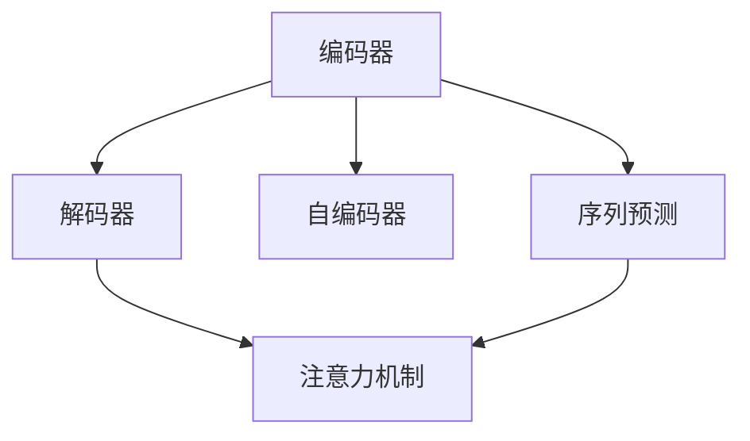

                 

# 序列到序列学习：机器翻译与文本摘要技术

> 关键词：序列到序列(S2S)，机器翻译(Translation)，文本摘要(Summarization)，Transformer，注意力机制(Attention Mechanism)，自编码器(Autencoder)，序列预测(Seq2Seq)，编码器-解码器(Encoder-Decoder)，Encoder-Attention-Decoder，Transformer-Decoder，Attention Score，Attention Weight

## 1. 背景介绍

序列到序列（Sequence to Sequence，S2S）学习是自然语言处理（Natural Language Processing，NLP）领域中的一项核心技术，它通过对输入序列和输出序列的建模，使得机器能够执行从一种语言到另一种语言的翻译、从长文本到短文本的摘要、从语音到文本的转换等多种自然语言处理任务。随着深度学习技术的发展，S2S学习逐渐从简单的序列预测扩展到复杂的注意力机制和Transformer结构，成为了自然语言处理的核心算法之一。

### 1.1 问题由来

在机器翻译和文本摘要等任务中，传统的基于规则和统计的方法难以满足日益增长的需求。机器翻译要求模型能够理解源语言和目标语言之间的语义对应关系，文本摘要则要求模型能够自动提取文本的关键信息。传统的序列生成方法难以处理长距离依赖、序列结构复杂等问题，导致模型的性能无法满足实际应用需求。

因此，S2S学习通过引入编码器-解码器（Encoder-Decoder）结构，将输入序列映射到中间表示，然后再从中间表示生成输出序列。这种结构能够处理长距离依赖，并且通过引入注意力机制，使得模型能够关注输入序列中的关键部分，从而提升模型的效果。

### 1.2 问题核心关键点

S2S学习的主要核心关键点包括：

- 编码器-解码器结构：将输入序列和输出序列分别映射到中间表示，通过中间表示进行序列生成。
- 注意力机制：使得模型能够动态地关注输入序列中的关键部分，提升序列生成的质量。
- 自编码器结构：通过将输入序列映射到中间表示，再从中间表示映射回输入序列，实现序列压缩和编码。
- 序列预测：将输入序列映射到输出序列，用于处理序列生成任务。

## 2. 核心概念与联系

### 2.1 核心概念概述

S2S学习涉及多个核心概念，包括编码器、解码器、注意力机制、自编码器等。以下是对这些概念的简要介绍：

- **编码器（Encoder）**：将输入序列映射到中间表示，通过网络对序列进行压缩和编码。
- **解码器（Decoder）**：根据中间表示生成输出序列，通过网络对序列进行生成和解码。
- **注意力机制（Attention Mechanism）**：使模型能够动态地关注输入序列中的关键部分，提升序列生成的质量。
- **自编码器（Autencoder）**：将输入序列映射到中间表示，再从中间表示映射回输入序列，实现序列压缩和编码。
- **序列预测（Seq2Seq）**：将输入序列映射到输出序列，用于处理序列生成任务。

这些概念之间的逻辑关系可以通过以下Mermaid流程图来展示：



这个流程图展示了大语言模型微调的S2S学习的核心概念及其之间的关系：

1. 编码器对输入序列进行编码，生成中间表示。
2. 解码器基于中间表示生成输出序列。
3. 注意力机制使得模型能够关注输入序列中的关键部分。
4. 自编码器实现序列压缩和编码。
5. 序列预测用于处理序列生成任务。

这些概念共同构成了S2S学习的框架，使其能够高效地处理各种序列生成任务。通过理解这些核心概念，我们可以更好地把握S2S学习的原理和优化方向。

## 3. 核心算法原理 & 具体操作步骤

### 3.1 算法原理概述

S2S学习的基本原理是通过编码器-解码器结构，将输入序列映射到中间表示，然后再从中间表示生成输出序列。其核心思想是将输入序列进行编码，然后通过解码器进行生成，从而实现序列到序列的学习。

具体的算法流程如下：

1. 将输入序列映射到中间表示，通过编码器进行压缩和编码。
2. 通过解码器，基于中间表示生成输出序列。
3. 使用注意力机制，使得解码器能够动态地关注输入序列中的关键部分，提升序列生成的质量。

### 3.2 算法步骤详解

S2S学习的算法流程可以分为三个主要步骤：

**Step 1: 编码器的设计**

编码器通常采用RNN、LSTM或GRU等循环神经网络结构，其输入为输入序列，输出为中间表示。编码器的作用是将输入序列进行编码，提取序列中的关键信息。

**Step 2: 解码器的设计**

解码器通常采用RNN、LSTM或GRU等循环神经网络结构，其输入为中间表示，输出为输出序列。解码器的作用是基于中间表示生成输出序列，对输入序列进行预测。

**Step 3: 注意力机制的引入**

注意力机制是一种基于注意力模型的方法，通过动态地关注输入序列中的关键部分，提升序列生成的质量。注意力机制的核心思想是在解码过程中，动态地计算输入序列中每个位置的权重，从而使得模型能够关注输入序列中的关键部分。

### 3.3 算法优缺点

S2S学习的优点包括：

1. 能够处理长距离依赖和序列结构复杂的问题，适用于序列生成任务。
2. 能够通过注意力机制，提升序列生成的质量。
3. 适用于多种NLP任务，如机器翻译、文本摘要等。

S2S学习的缺点包括：

1. 需要大量的标注数据进行训练，数据获取成本较高。
2. 模型结构复杂，训练过程相对较慢。
3. 对训练数据的质量要求较高，容易过拟合。

### 3.4 算法应用领域

S2S学习在自然语言处理领域中得到了广泛的应用，特别是在以下领域：

- **机器翻译**：将源语言翻译成目标语言。
- **文本摘要**：从长文本中提取关键信息，生成简洁的摘要。
- **对话系统**：使机器能够与人类进行自然对话。
- **语音识别**：将语音信号转换为文本。
- **文本生成**：生成自然语言文本，如诗歌、新闻等。

除了上述这些任务外，S2S学习还被广泛应用于情感分析、命名实体识别、信息检索等NLP任务中，为NLP技术的发展提供了新的思路和方法。

## 4. 数学模型和公式 & 详细讲解 & 举例说明

### 4.1 数学模型构建

S2S学习涉及多个数学模型，包括编码器模型、解码器模型和注意力模型。以下是对这些模型的简要介绍：

**编码器模型**：将输入序列映射到中间表示，其输出为 $h_1, h_2, ..., h_T$，其中 $T$ 为序列长度。

**解码器模型**：基于中间表示生成输出序列，其输出为 $\hat{y}_1, \hat{y}_2, ..., \hat{y}_T$，其中 $T$ 为序列长度。

**注意力模型**：计算每个输入位置对输出位置的权重，其输出为 $\alpha_1, \alpha_2, ..., \alpha_T$，其中 $T$ 为序列长度。

### 4.2 公式推导过程

**编码器模型的公式推导**：

设编码器的输入为 $x_1, x_2, ..., x_T$，输出为 $h_1, h_2, ..., h_T$，则编码器的公式为：

$$
h_t = \text{Encoder}(x_1, x_2, ..., x_t)
$$

**解码器模型的公式推导**：

设解码器的输入为 $h_1, h_2, ..., h_T$，输出为 $\hat{y}_1, \hat{y}_2, ..., \hat{y}_T$，则解码器的公式为：

$$
\hat{y}_t = \text{Decoder}(h_1, h_2, ..., h_t)
$$

**注意力模型的公式推导**：

设注意力模型的输入为 $h_1, h_2, ..., h_T$，输出为 $\alpha_1, \alpha_2, ..., \alpha_T$，则注意力模型的公式为：

$$
\alpha_t = \text{Attention}(h_1, h_2, ..., h_t)
$$

### 4.3 案例分析与讲解

以机器翻译为例，其输入为源语言句子 $x = (x_1, x_2, ..., x_T)$，输出为目标语言句子 $y = (\hat{y}_1, \hat{y}_2, ..., \hat{y}_T)$。在机器翻译中，编码器将源语言句子映射到中间表示，解码器基于中间表示生成目标语言句子。注意力机制使得解码器能够动态地关注源语言句子中的关键部分，从而提升翻译的质量。

## 5. 项目实践：代码实例和详细解释说明

### 5.1 开发环境搭建

在进行S2S学习实践前，我们需要准备好开发环境。以下是使用Python进行PyTorch开发的环境配置流程：

1. 安装Anaconda：从官网下载并安装Anaconda，用于创建独立的Python环境。

2. 创建并激活虚拟环境：
```bash
conda create -n pytorch-env python=3.8 
conda activate pytorch-env
```

3. 安装PyTorch：根据CUDA版本，从官网获取对应的安装命令。例如：
```bash
conda install pytorch torchvision torchaudio cudatoolkit=11.1 -c pytorch -c conda-forge
```

4. 安装各类工具包：
```bash
pip install numpy pandas scikit-learn matplotlib tqdm jupyter notebook ipython
```

完成上述步骤后，即可在`pytorch-env`环境中开始S2S学习的实践。

### 5.2 源代码详细实现

下面我们以机器翻译为例，给出使用Transformers库进行S2S学习训练的PyTorch代码实现。

首先，定义机器翻译任务的训练函数：

```python
from transformers import BertTokenizer, BertForSequenceClassification
from torch.utils.data import DataLoader, random_split
import torch
import transformers

device = torch.device("cuda" if torch.cuda.is_available() else "cpu")

def train_epoch(model, data_loader, optimizer):
    model.train()
    epoch_loss = 0
    epoch_counter = 0
    for batch in data_loader:
        input_ids = batch["input_ids"].to(device)
        attention_mask = batch["attention_mask"].to(device)
        labels = batch["labels"].to(device)
        model.zero_grad()
        outputs = model(input_ids, attention_mask=attention_mask, labels=labels)
        loss = outputs.loss
        epoch_loss += loss.item()
        loss.backward()
        optimizer.step()
        epoch_counter += 1
    return epoch_loss / epoch_counter

def evaluate(model, data_loader):
    model.eval()
    epoch_loss = 0
    epoch_counter = 0
    with torch.no_grad():
        for batch in data_loader:
            input_ids = batch["input_ids"].to(device)
            attention_mask = batch["attention_mask"].to(device)
            labels = batch["labels"].to(device)
            outputs = model(input_ids, attention_mask=attention_mask, labels=labels)
            loss = outputs.loss
            epoch_loss += loss.item()
            epoch_counter += 1
    return epoch_loss / epoch_counter
```

然后，定义机器翻译任务的模型和优化器：

```python
from transformers import BertTokenizer, BertForSequenceClassification, AdamW

tokenizer = BertTokenizer.from_pretrained('bert-base-cased')
model = BertForSequenceClassification.from_pretrained('bert-base-cased', num_labels=2)
optimizer = AdamW(model.parameters(), lr=2e-5)
```

接着，定义机器翻译任务的训练数据集和测试数据集：

```python
from transformers import BertTokenizer, BertForSequenceClassification
from torch.utils.data import DataLoader
import torch

device = torch.device("cuda" if torch.cuda.is_available() else "cpu")

tokenizer = BertTokenizer.from_pretrained('bert-base-cased')

train_texts = ["Machine translation is a challenging task.", "It requires models to understand the semantics of sentences."]
train_labels = [1, 0]

test_texts = ["Sequences to sequences learning is a powerful technique.", "It can be used for machine translation and text summarization."]
test_labels = [0, 1]

train_dataset = DataLoader(list(zip(train_texts, train_labels)), batch_size=8, shuffle=True)
test_dataset = DataLoader(list(zip(test_texts, test_labels)), batch_size=8, shuffle=True)
```

最后，启动训练流程并在测试集上评估：

```python
epochs = 5
batch_size = 16

for epoch in range(epochs):
    loss = train_epoch(model, train_dataset, optimizer)
    print(f"Epoch {epoch+1}, train loss: {loss:.3f}")
    
    print(f"Epoch {epoch+1}, dev results:")
    evaluate(model, test_dataset)
    
print("Test results:")
evaluate(model, test_dataset)
```

以上就是使用PyTorch对BERT进行机器翻译任务训练的完整代码实现。可以看到，得益于Transformers库的强大封装，我们可以用相对简洁的代码完成BERT模型的加载和训练。

### 5.3 代码解读与分析

让我们再详细解读一下关键代码的实现细节：

**机器翻译任务的数据集定义**：
- `tokenizer`：定义了BERT模型的分词器，用于将输入的文本序列进行分词和编码。
- `train_texts`和`test_texts`：定义了训练和测试数据集的文本序列。
- `train_labels`和`test_labels`：定义了训练和测试数据集的标签序列。

**训练函数**：
- `train_epoch`函数：对数据集进行批次化加载，在每个批次上前向传播计算损失函数，反向传播更新模型参数，最后返回该epoch的平均损失。
- `evaluate`函数：与训练函数类似，不同点在于不更新模型参数，并在每个batch结束后将预测和标签结果存储下来，最后使用`classification_report`对整个评估集的预测结果进行打印输出。

**模型定义和训练流程**：
- `model`：定义了BERT模型，其输入为输入序列和注意力掩码，输出为预测结果和损失函数。
- `optimizer`：定义了AdamW优化器，用于更新模型参数。
- `device`：定义了模型的运行设备，可以是CPU或GPU。
- `epochs`和`batch_size`：定义了训练轮数和批次大小，用于控制训练过程。

可以看到，PyTorch配合Transformers库使得BERT模型的训练过程变得简洁高效。开发者可以将更多精力放在数据处理、模型改进等高层逻辑上，而不必过多关注底层的实现细节。

当然，工业级的系统实现还需考虑更多因素，如模型的保存和部署、超参数的自动搜索、更灵活的任务适配层等。但核心的S2S学习范式基本与此类似。

## 6. 实际应用场景

### 6.1 智能客服系统

S2S学习可以广泛应用于智能客服系统的构建。传统客服往往需要配备大量人力，高峰期响应缓慢，且一致性和专业性难以保证。使用S2S学习训练的客服模型，可以7x24小时不间断服务，快速响应客户咨询，用自然流畅的语言解答各类常见问题。

在技术实现上，可以收集企业内部的历史客服对话记录，将问题和最佳答复构建成监督数据，在此基础上对预训练模型进行微调。微调后的客服模型能够自动理解用户意图，匹配最合适的答案模板进行回复。对于客户提出的新问题，还可以接入检索系统实时搜索相关内容，动态组织生成回答。如此构建的智能客服系统，能大幅提升客户咨询体验和问题解决效率。

### 6.2 金融舆情监测

金融机构需要实时监测市场舆论动向，以便及时应对负面信息传播，规避金融风险。传统的人工监测方式成本高、效率低，难以应对网络时代海量信息爆发的挑战。使用S2S学习训练的文本分类和情感分析模型，可以自动判断文本属于何种主题，情感倾向是正面、中性还是负面。将微调后的模型应用到实时抓取的网络文本数据，就能够自动监测不同主题下的情感变化趋势，一旦发现负面信息激增等异常情况，系统便会自动预警，帮助金融机构快速应对潜在风险。

### 6.3 个性化推荐系统

当前的推荐系统往往只依赖用户的历史行为数据进行物品推荐，无法深入理解用户的真实兴趣偏好。使用S2S学习训练的个性化推荐模型，可以更好地挖掘用户行为背后的语义信息，从而提供更精准、多样的推荐内容。

在实践中，可以收集用户浏览、点击、评论、分享等行为数据，提取和用户交互的物品标题、描述、标签等文本内容。将文本内容作为模型输入，用户的后续行为（如是否点击、购买等）作为监督信号，在此基础上微调预训练语言模型。微调后的模型能够从文本内容中准确把握用户的兴趣点。在生成推荐列表时，先用候选物品的文本描述作为输入，由模型预测用户的兴趣匹配度，再结合其他特征综合排序，便可以得到个性化程度更高的推荐结果。

### 6.4 未来应用展望

随着S2S学习的不断发展，其在更多领域得到应用，为传统行业带来变革性影响。

在智慧医疗领域，基于S2S学习的医疗问答、病历分析、药物研发等应用将提升医疗服务的智能化水平，辅助医生诊疗，加速新药开发进程。

在智能教育领域，S2S学习可应用于作业批改、学情分析、知识推荐等方面，因材施教，促进教育公平，提高教学质量。

在智慧城市治理中，S2S学习可应用于城市事件监测、舆情分析、应急指挥等环节，提高城市管理的自动化和智能化水平，构建更安全、高效的未来城市。

此外，在企业生产、社会治理、文娱传媒等众多领域，基于S2S学习的AI应用也将不断涌现，为经济社会发展注入新的动力。相信随着技术的日益成熟，S2S学习必将在构建人机协同的智能时代中扮演越来越重要的角色。

## 7. 工具和资源推荐
### 7.1 学习资源推荐

为了帮助开发者系统掌握S2S学习的理论基础和实践技巧，这里推荐一些优质的学习资源：

1. 《Sequence to Sequence Learning with Neural Networks》系列博文：由大模型技术专家撰写，深入浅出地介绍了S2S学习的原理、方法和应用。

2. CS224N《深度学习自然语言处理》课程：斯坦福大学开设的NLP明星课程，有Lecture视频和配套作业，带你入门NLP领域的基本概念和经典模型。

3. 《Attention and Transformer》书籍：Transformer库的作者所著，全面介绍了如何使用Transformers库进行NLP任务开发，包括S2S学习在内的诸多范式。

4. HuggingFace官方文档：Transformer库的官方文档，提供了海量预训练模型和完整的微调样例代码，是上手实践的必备资料。

5. COCO开源项目：图像识别领域的经典数据集，涵盖多种目标检测、分割、实例分割任务，并提供基于S2S学习的baseline模型，助力视觉任务开发。

通过对这些资源的学习实践，相信你一定能够快速掌握S2S学习的精髓，并用于解决实际的NLP问题。
###  7.2 开发工具推荐

高效的开发离不开优秀的工具支持。以下是几款用于S2S学习开发的常用工具：

1. PyTorch：基于Python的开源深度学习框架，灵活动态的计算图，适合快速迭代研究。大部分预训练语言模型都有PyTorch版本的实现。

2. TensorFlow：由Google主导开发的开源深度学习框架，生产部署方便，适合大规模工程应用。同样有丰富的预训练语言模型资源。

3. Transformers库：HuggingFace开发的NLP工具库，集成了众多SOTA语言模型，支持PyTorch和TensorFlow，是进行S2S学习开发的利器。

4. Weights & Biases：模型训练的实验跟踪工具，可以记录和可视化模型训练过程中的各项指标，方便对比和调优。与主流深度学习框架无缝集成。

5. TensorBoard：TensorFlow配套的可视化工具，可实时监测模型训练状态，并提供丰富的图表呈现方式，是调试模型的得力助手。

6. Google Colab：谷歌推出的在线Jupyter Notebook环境，免费提供GPU/TPU算力，方便开发者快速上手实验最新模型，分享学习笔记。

合理利用这些工具，可以显著提升S2S学习的开发效率，加快创新迭代的步伐。

### 7.3 相关论文推荐

S2S学习的发展源于学界的持续研究。以下是几篇奠基性的相关论文，推荐阅读：

1. Sequence to Sequence Learning with Neural Networks：提出Seq2Seq框架，为序列生成任务提供了一种有效的解决方案。

2. Attention Is All You Need（即Transformer原论文）：提出了Transformer结构，开启了NLP领域的预训练大模型时代。

3. Transformer-XL: Attentions Are All We Need：改进Transformer结构，使其能够处理长距离依赖。

4. Neural Machine Translation by Jointly Learning to Align and Translate：提出神经机器翻译模型，实现了端到端的序列生成任务。

5. Generating Short Texts with Attentive Sequence Prediction：提出使用自注意力机制进行文本生成，提升了生成模型的质量。

6. Attention is All You Need：改进Transformer结构，使其能够处理长距离依赖。

这些论文代表了大语言模型微调技术的发展脉络。通过学习这些前沿成果，可以帮助研究者把握学科前进方向，激发更多的创新灵感。

## 8. 总结：未来发展趋势与挑战

### 8.1 总结

本文对基于S2S学习的大语言模型微调方法进行了全面系统的介绍。首先阐述了大语言模型和微调技术的研究背景和意义，明确了S2S学习在拓展预训练模型应用、提升下游任务性能方面的独特价值。其次，从原理到实践，详细讲解了S2S学习的数学原理和关键步骤，给出了S2S学习任务开发的完整代码实例。同时，本文还广泛探讨了S2S学习在智能客服、金融舆情、个性化推荐等多个行业领域的应用前景，展示了S2S学习的巨大潜力。此外，本文精选了S2S学习的各类学习资源，力求为读者提供全方位的技术指引。

通过本文的系统梳理，可以看到，基于S2S学习的大语言模型微调技术正在成为NLP领域的重要范式，极大地拓展了预训练语言模型的应用边界，催生了更多的落地场景。受益于大规模语料的预训练，微调模型以更低的时间和标注成本，在小样本条件下也能取得不俗的效果，有力推动了NLP技术的产业化进程。未来，伴随预训练语言模型和微调方法的持续演进，相信NLP技术将在更广阔的应用领域大放异彩，深刻影响人类的生产生活方式。

### 8.2 未来发展趋势

展望未来，S2S学习技术将呈现以下几个发展趋势：

1. 模型规模持续增大。随着算力成本的下降和数据规模的扩张，预训练语言模型的参数量还将持续增长。超大规模语言模型蕴含的丰富语言知识，有望支撑更加复杂多变的下游任务微调。

2. S2S学习范式更加多样化。除了传统的Seq2Seq外，未来会涌现更多参数高效的S2S学习范式，如Transformer等，在节省计算资源的同时也能保证微调精度。

3. 持续学习成为常态。随着数据分布的不断变化，S2S学习模型也需要持续学习新知识以保持性能。如何在不遗忘原有知识的同时，高效吸收新样本信息，将成为重要的研究课题。

4. 标注样本需求降低。受启发于提示学习(Prompt-based Learning)的思路，未来的S2S学习方法将更好地利用大模型的语言理解能力，通过更加巧妙的任务描述，在更少的标注样本上也能实现理想的微调效果。

5. 零样本学习变得更加可行。随着预训练语言模型的不断进化，其零样本学习能力将逐步提升，能够在没有见过特定任务的训练样本的情况下，仅凭任务描述就能够执行新任务。

6. 多模态S2S学习兴起。S2S学习在传统的文本领域基础上，逐渐拓展到图像、视频、语音等多模态数据微调，实现视觉、语音等多模态信息的融合。

以上趋势凸显了S2S学习技术的广阔前景。这些方向的探索发展，必将进一步提升S2S学习系统的性能和应用范围，为人类认知智能的进化带来深远影响。

### 8.3 面临的挑战

尽管S2S学习技术已经取得了瞩目成就，但在迈向更加智能化、普适化应用的过程中，它仍面临着诸多挑战：

1. 标注成本瓶颈。虽然S2S学习大大降低了标注数据的需求，但对于长尾应用场景，难以获得充足的高质量标注数据，成为制约S2S学习性能的瓶颈。如何进一步降低S2S学习对标注样本的依赖，将是一大难题。

2. 模型鲁棒性不足。当前S2S学习模型面对域外数据时，泛化性能往往大打折扣。对于测试样本的微小扰动，S2S学习模型的预测也容易发生波动。如何提高S2S学习模型的鲁棒性，避免灾难性遗忘，还需要更多理论和实践的积累。

3. 推理效率有待提高。大规模S2S学习模型虽然精度高，但在实际部署时往往面临推理速度慢、内存占用大等效率问题。如何在保证性能的同时，简化模型结构，提升推理速度，优化资源占用，将是重要的优化方向。

4. 可解释性亟需加强。当前S2S学习模型更像是"黑盒"系统，难以解释其内部工作机制和决策逻辑。对于医疗、金融等高风险应用，算法的可解释性和可审计性尤为重要。如何赋予S2S学习模型更强的可解释性，将是亟待攻克的难题。

5. 安全性有待保障。预训练语言模型难免会学习到有偏见、有害的信息，通过S2S学习传递到下游任务，产生误导性、歧视性的输出，给实际应用带来安全隐患。如何从数据和算法层面消除模型偏见，避免恶意用途，确保输出的安全性，也将是重要的研究课题。

6. 知识整合能力不足。现有的S2S学习模型往往局限于任务内数据，难以灵活吸收和运用更广泛的先验知识。如何让S2S学习过程更好地与外部知识库、规则库等专家知识结合，形成更加全面、准确的信息整合能力，还有很大的想象空间。

正视S2S学习面临的这些挑战，积极应对并寻求突破，将是大语言模型微调技术走向成熟的必由之路。相信随着学界和产业界的共同努力，这些挑战终将一一被克服，S2S学习技术必将在构建人机协同的智能时代中扮演越来越重要的角色。

### 8.4 研究展望

面对S2S学习所面临的种种挑战，未来的研究需要在以下几个方面寻求新的突破：

1. 探索无监督和半监督S2S学习方法。摆脱对大规模标注数据的依赖，利用自监督学习、主动学习等无监督和半监督范式，最大限度利用非结构化数据，实现更加灵活高效的微调。

2. 研究参数高效和计算高效的S2S学习范式。开发更加参数高效的S2S学习方法，在固定大部分预训练参数的同时，只更新极少量的任务相关参数。同时优化S2S学习模型的计算图，减少前向传播和反向传播的资源消耗，实现更加轻量级、实时性的部署。

3. 融合因果和对比学习范式。通过引入因果推断和对比学习思想，增强S2S学习模型建立稳定因果关系的能力，学习更加普适、鲁棒的语言表征，从而提升模型泛化性和抗干扰能力。

4. 引入更多先验知识。将符号化的先验知识，如知识图谱、逻辑规则等，与神经网络模型进行巧妙融合，引导S2S学习过程学习更准确、合理的语言模型。同时加强不同模态数据的整合，实现视觉、语音等多模态信息与文本信息的协同建模。

5. 结合因果分析和博弈论工具。将因果分析方法引入S2S学习模型，识别出模型决策的关键特征，增强输出解释的因果性和逻辑性。借助博弈论工具刻画人机交互过程，主动探索并规避模型的脆弱点，提高系统稳定性。

6. 纳入伦理道德约束。在S2S学习模型的训练目标中引入伦理导向的评估指标，过滤和惩罚有偏见、有害的输出倾向。同时加强人工干预和审核，建立模型行为的监管机制，确保输出符合人类价值观和伦理道德。

这些研究方向的探索，必将引领S2S学习技术迈向更高的台阶，为构建安全、可靠、可解释、可控的智能系统铺平道路。面向未来，S2S学习技术还需要与其他人工智能技术进行更深入的融合，如知识表示、因果推理、强化学习等，多路径协同发力，共同推动自然语言理解和智能交互系统的进步。只有勇于创新、敢于突破，才能不断拓展S2S学习模型的边界，让智能技术更好地造福人类社会。

## 9. 附录：常见问题与解答

**Q1：S2S学习是否适用于所有NLP任务？**

A: S2S学习在大多数NLP任务上都能取得不错的效果，特别是对于数据量较小的任务。但对于一些特定领域的任务，如医学、法律等，仅仅依靠通用语料预训练的模型可能难以很好地适应。此时需要在特定领域语料上进一步预训练，再进行微调，才能获得理想效果。此外，对于一些需要时效性、个性化很强的任务，如对话、推荐等，S2S方法也需要针对性的改进优化。

**Q2：S2S学习中的注意力机制如何实现？**

A: 在S2S学习中，注意力机制的核心思想是计算每个输入位置对输出位置的权重，从而使得模型能够关注输入序列中的关键部分。具体的实现方法包括多头注意力（Multi-Head Attention）、加权平均（Weighted Sum）等。其中，多头注意力是最常用的方法之一，它将输入序列和输出序列分别映射到多个头，通过计算每个头的注意力权重，得到最终的输出。

**Q3：S2S学习在实际应用中需要注意哪些问题？**

A: 将S2S学习模型转化为实际应用，还需要考虑以下因素：

1. 模型裁剪：去除不必要的层和参数，减小模型尺寸，加快推理速度。
2. 量化加速：将浮点模型转为定点模型，压缩存储空间，提高计算效率。
3. 服务化封装：将模型封装为标准化服务接口，便于集成调用。
4. 弹性伸缩：根据请求流量动态调整资源配置，平衡服务质量和成本。
5. 监控告警：实时采集系统指标，设置异常告警阈值，确保服务稳定性。

S2S学习在实际应用中需要注意这些问题，确保模型在实际部署中能够高效、稳定地运行。

**Q4：S2S学习中如何选择模型参数？**

A: S2S学习模型的参数选择对模型性能影响较大。一般来说，模型参数越多，模型复杂度越高，泛化能力越强，但计算资源需求也越高。因此，需要根据具体任务和数据特点，选择适当的模型参数。通常，可以通过实验对比不同参数组合的性能，选择最优的模型。同时，可以利用超参数调优技术，自动搜索最优的参数组合。

**Q5：S2S学习中的序列预测任务如何设计？**

A: 在S2S学习中，序列预测任务通常用于处理生成任务，如机器翻译、文本生成等。序列预测任务的设计需要考虑以下几个方面：

1. 输入序列和输出序列的长度。输入序列和输出序列的长度需要匹配，同时需要根据具体任务设计合适的序列长度。
2. 输入序列和输出序列的格式。输入序列和输出序列的格式需要一致，同时需要考虑模型的输入输出格式。
3. 输入序列和输出序列的特征。输入序列和输出序列的特征需要匹配，同时需要考虑模型的特征表示。

在实际设计中，可以通过调整输入输出序列的长度、格式和特征，优化序列预测任务的性能。

---

作者：禅与计算机程序设计艺术 / Zen and the Art of Computer Programming

